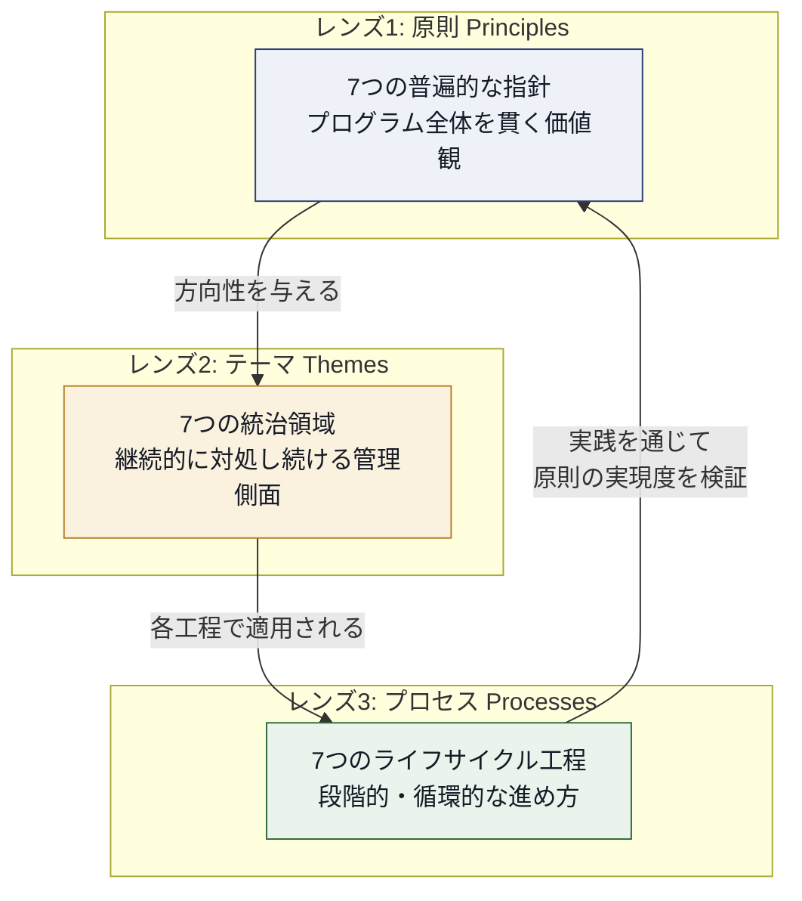
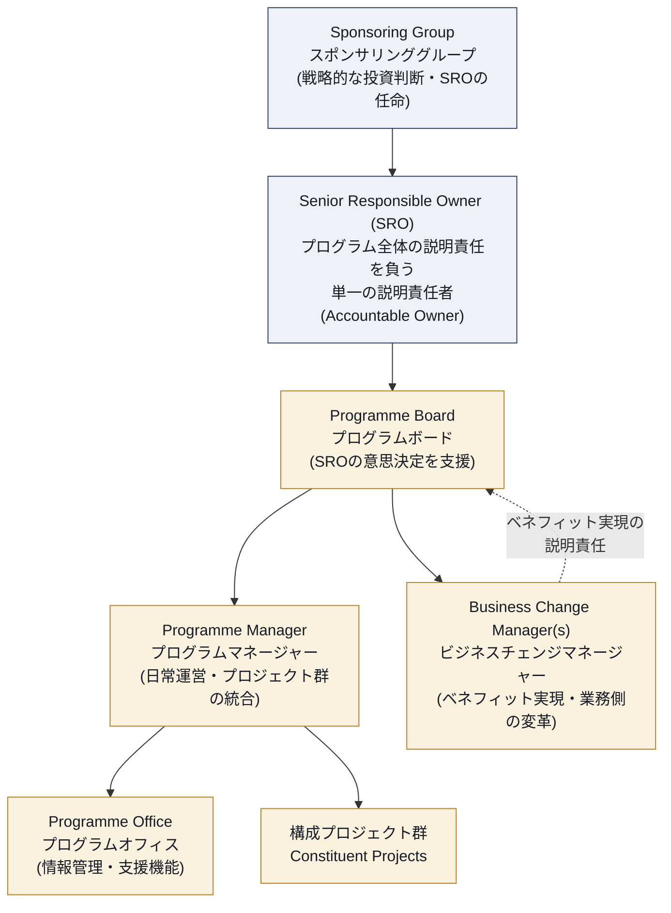
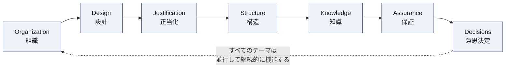
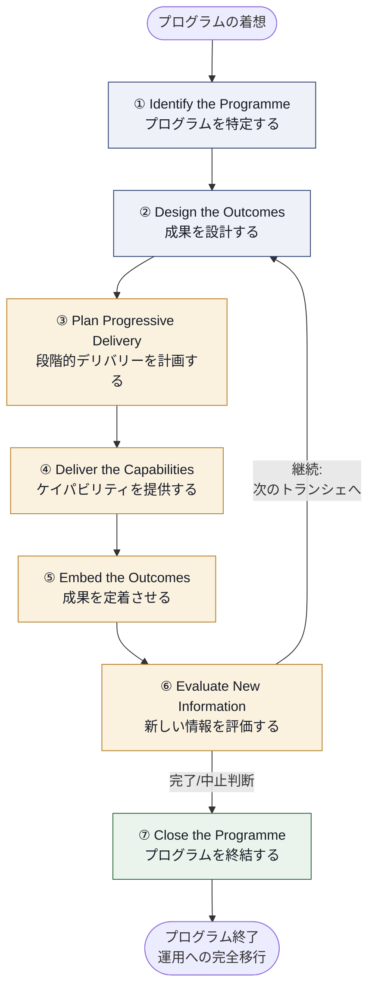

# MSP® プラクティショナー(第5版)学習ガイド ― 初学者のための実践適用ステップバイステップ解説

> 対象試験: **MSP® Practitioner, 5th edition**(PeopleCert / 旧AXELOS)
> 公式製品ページ: https://www.peoplecert.org/browse-certifications/project-programme-and-portfolio-management/MSP-6/msp-practitioner-5th-edition-2932

---

## 目次

1. [はじめに：MSPプラクティショナーとは何か](#1-はじめにmspプラクティショナーとは何か)
2. [試験概要](#2-試験概要)
3. [MSPの全体構造：3つのレンズ](#3-mspの全体構造3つのレンズ)
4. [7つの原則(Principles)とその実践適用](#4-7つの原則principlesとその実践適用)
5. [プログラム組織とガバナンス構造](#5-プログラム組織とガバナンス構造)
6. [7つのテーマ(Themes)詳細解説](#6-7つのテーマthemes詳細解説)
   - [6.1 Organization(組織)テーマ](#61-organization組織テーマ)
   - [6.2 Design(設計)テーマ](#62-design設計テーマ)
   - [6.3 Justification(正当化)テーマ](#63-justification正当化テーマ)
   - [6.4 Structure(構造)テーマ](#64-structure構造テーマ)
   - [6.5 Knowledge(知識)テーマ](#65-knowledge知識テーマ)
   - [6.6 Assurance(保証)テーマ](#66-assurance保証テーマ)
   - [6.7 Decisions(意思決定)テーマ](#67-decisions意思決定テーマ)
7. [7つのプロセス(プログラムライフサイクル)](#7-7つのプロセスプログラムライフサイクル)
8. [テーラリング(Tailoring)：MSPを現場に合わせる](#8-テーラリングtailoringmspを現場に合わせる)
9. [プラクティショナー試験対策：シナリオ適用のコツ](#9-プラクティショナー試験対策シナリオ適用のコツ)
10. [ベストプラクティス総まとめ表](#10-ベストプラクティス総まとめ表)
11. [参考文献・出典(ソースURL)](#11-参考文献出典ソースurl)

---

## 1. はじめに：MSPプラクティショナーとは何か

**MSP®(Managing Successful Programmes)** は、PeopleCert(旧AXELOS)が管理する、世界的に認知されたプログラムマネジメント(複数のプロジェクトや活動を束ねて組織的な変革を実現する管理手法)のベストプラクティスフレームワークです。2020年に刊行された**第5版(5th edition)**では、俊敏性(アジリティ)・柔軟性・段階的な価値提供を強く意識した構成に刷新されました。

第5版の資格体系は Foundation と Practitioner の2段階です(参考として、旧第4版の上位資格も併記します)。

| 段階 | 目的 |
|---|---|
| MSP Foundation(基礎) | MSPの用語・構造(原則・テーマ・プロセス)を**記憶し理解している**ことを確認する試験。暗記中心。 |
| **MSP Practitioner(実践)** | MSPの原則・テーマ・プロセスを**実際のシナリオに適用し、テーラリング(調整)できる**ことを確認する試験。応用力中心。 |
| MSP Advanced Practitioner(上級実践) | **旧第4版(2011年版)の資格で、現在は廃止済み(レガシー)**。第5版の資格体系(Foundation → Practitioner)には含まれない。 |

Practitionerレベルの学習目標は公式コース概要で次のように明示されています。

- MSPの原則を文脈(コンテキスト)に応じて適用する方法を理解する
- MSPのテーマの関連する側面を文脈に応じて適用・テーラリングする方法を理解する
- MSPのプロセスの関連する側面を文脈に応じて適用・テーラリングする方法を理解する

出典: https://ilxgroup.com/uk/training/msp/practitioner

つまりFoundationが「知っているか」を問うのに対し、Practitionerは「**与えられたプログラムのシナリオに対して、どのMSPの要素を、どの程度、どのようにテーラリングして適用するのが最適か**」を問う、判断力・応用力の試験です。この違いを常に意識しながら本ガイドを読み進めてください。

**受験前提条件(Prerequisite)**: MSP第5版Foundation、またはMSP第4版Practitionerのいずれかの保有が必須です。
出典: https://www.peoplecert.org/browse-certifications/project-programme-and-portfolio-management/MSP-6/msp-practitioner-5th-edition-2932

---

## 2. 試験概要

| 項目 | 内容 |
|---|---|
| 出題形式 | 58問(一部に小問を含む)、配点合計70点のオブジェクティブテスト方式 |
| 試験時間 | 150分 |
| 方式 | **オープンブック**(公式MSPマニュアルの持ち込み・参照が可能) |
| 合格基準 | 60%以上の得点 |
| 試験言語 | 英語・中国語 |
| 受験前提 | MSP第5版Foundation または MSP第4版Practitioner |
| 認定有効期間 | 3年ごとに更新が必要(CPDポイント60点の取得等) |
| 学習ボリューム目安 | 講座形式により10〜24時間(eラーニング)/ 2〜5日(集合研修) |

出典: https://www.peoplecert.org/browse-certifications/project-programme-and-portfolio-management/MSP-6/msp-practitioner-5th-edition-2932 、 https://goodelearning.com/product/project-program-management/msp-5th-edition-foundation-self-paced-e-learning/

> **ベストプラクティス**: オープンブック試験とはいえ、150分で58問(70点分)を解くには1問あたり平均2〜3分弱しか使えません。マニュアルを試験中に一から探しても間に合わないため、事前学習で「どの情報がマニュアルのどの章にあるか」の**目次感覚**を身につけておくことが合格の鍵になります。本ガイドの章立ては公式マニュアルの構成(原則→テーマ→プロセス)に沿っているため、学習の地図として活用してください。

---

## 3. MSPの全体構造：3つのレンズ

MSP第5版は、プログラムマネジメントを3つの異なる視点(レンズ)から捉える構造になっています。

- **原則(Principles)**: プログラムが成功するために常に守られるべき、普遍的・自己検証的・力を与える(empowering)7つの指針。MSPに沿ったプログラムはこれらの原則に導かれます。原則が守られていなければ、そのプログラムはMSPの原則を効果的に適用できていないことになります。
- **テーマ(Themes)**: プログラムのライフサイクルを通じて**継続的に**対処し続けなければならない、統治(ガバナンス)上の側面。7つあり、いずれも一度整備して終わりではなく、常時見直しが必要です。
- **プロセス(Processes)**: プログラムを立ち上げてから閉じるまでの**段階的・循環的**な活動の流れ。7つの工程で構成され、直線的というより「反復しながら前進する」流れとして描かれます。

第5版では、第4版(2011年)で「Transformational Flow」と呼ばれていたプロセス部分が「**MSP Programme Lifecycle(プログラムライフサイクル)**」という呼称に変わり、段階的(incremental)な価値提供とアジャイル的な繰り返しの性質がより強調されています。
出典: https://goodelearning.com/msp-5th-edition-whats-changed-about-managing-successful-programmes/

またテーマの数も、旧版(第4版)の「9つのガバナンステーマ」から**7つのテーマ**へ統合・再編されました。たとえば旧版の「Vision」「Benefits Realization Management」「Risk and Issue Management」等は、新版では再編され、ビジョン・ベネフィット・プログラムリスク・ターゲットオペレーティングモデル(TOM)は「Design」テーマで一体的に扱われる一方、課題(イシュー)解決のアプローチやリスク対応(リスクへの対処の選択)は「Decisions」テーマで扱われるようになっています。
出典: https://axelos.com/resource-hub/blog/msp-5th-edition-what-has-changed

---

## 4. 7つの原則(Principles)とその実践適用

第5版における7つの原則は、旧版(第4版)から名称・切り口が刷新されており、より現代的な変革リーダーシップの語彙で表現されています。

| # | 原則(英語) | 原則(和訳) | 一言でいうと |
|---|---|---|---|
| 1 | Lead with purpose | 目的を持って導く | 望ましい成果を描き、伝え続ける |
| 2 | Collaborate across boundaries | 境界を越えて協働する | 組織横断的な効果的ガバナンスを促進する |
| 3 | Deal with ambiguity | 曖昧さに対処する | 意思決定に伴うリスクを理解し受け入れる |
| 4 | Align with priorities | 優先順位に整合させる | 新しい情報や創発的な変化に適応する |
| 5 | Deploy diverse skills | 多様なスキルを配置する | 変化する業務ニーズに応える |
| 6 | Realize measurable benefits | 測定可能なベネフィットを実現する | 一貫性のある組織能力を設計・提供する |
| 7 | Bring pace and value | ペースと価値をもたらす | 段階的に価値を届け続ける |

出典: https://www.theknowledgeacademy.com/za/courses/msp-training/msp-training/ 、 https://zoboko.com/book/8exoemo3/managing-successful-programmes-5th-edition (公式マニュアルの章立て:第2章 Principles / 2.1〜2.7)

### 4.1 各原則の意味とPractitionerレベルの適用ポイント

**① Lead with purpose(目的を持って導く)**
プログラムは「なぜこの変革が必要か」という明確な目的意識のもとに導かれなければなりません。プログラムマネージャーやSRO(後述)は、ビジョンを繰り返し発信し、意思決定の軸をぶらさないリーダーシップが求められます。
- **適用のポイント**: シナリオ問題では、ビジョンが曖昧・頻繁に変わる・関係者に伝わっていない、といった兆候が「Lead with purposeの原則が守られていない」ことを示すヒントになります。対応策としては、ビジョンステートメントの再確認・コミュニケーション計画の強化を提案します。

**② Collaborate across boundaries(境界を越えて協働する)**
プログラムは複数の部門・組織・サプライヤーにまたがるため、通常の部門ガバナンスだけでは統治できません。組織横断的な合意形成の仕組みが必要です。
- **適用のポイント**: 部門間の対立、サイロ化した意思決定、ステークホルダー間の情報格差が見られるシナリオでは、Organizationテーマにおけるガバナンス構造の見直しや、Sponsoring Group(後述)による調整が解決策になります。

**③ Deal with ambiguity(曖昧さに対処する)**
プログラムの初期段階では不確実性が高く、すべてを事前に計画しきることはできません。曖昧さを前提としたリスクベースの意思決定が必要です。
- **適用のポイント**: 「情報が不十分なまま意思決定を迫られている」というシナリオでは、Decisionsテーマのデータ収集・オプション分析のアプローチを適用し、段階的に確度を高めていく提案が適切です。

**④ Align with priorities(優先順位に整合させる)**
外部環境や組織戦略は変化し続けるため、プログラムは定期的に優先順位を見直し、必要であれば方向転換(リフォーカス)する柔軟性を持つ必要があります。
- **適用のポイント**: 戦略変更や市場環境の変化が描かれるシナリオでは、Evaluate New Information(後述プロセス)を通じた計画の見直しが求められているサインです。

**⑤ Deploy diverse skills(多様なスキルを配置する)**
プログラムは技術・チェンジマネジメント・財務・調達など多様な専門性を必要とします。硬直的な組織図ではなく、必要なスキルを機動的に配置できる体制が求められます。
- **適用のポイント**: リソース不足・スキルミスマッチのシナリオでは、Structureテーマのリソースマネジメントとの関連付けが評価されます。

**⑥ Realize measurable benefits(測定可能なベネフィットを実現する)**
※原則6は英語表記で "Realize measurable benefits" ですが、公式教材によっては「一貫性のある組織能力(capability)の設計・提供」という説明が併記される場合があります。プログラムの成果は**測定可能な形で定義**され、単発のプロジェクト完了ではなく、実際の便益実現まで追跡されなければなりません。
- **適用のポイント**: 「プロジェクトは完了したがベネフィットが計測されていない」というシナリオは典型的な出題パターンです。Design/Justificationテーマのベネフィットマップ・ベネフィットプロファイルの整備を提案します。

**⑦ Bring pace and value(ペースと価値をもたらす)**
すべてを完成させてから価値を届けるのではなく、**段階的(トランシェ単位)に早期から価値を提供**し続けることが重視されます。
- **適用のポイント**: 「最終成果物まで何も価値が出ない」計画になっているシナリオでは、Structureテーマのトランシェ設計・Plan Progressive Delivery(後述プロセス)の見直しが解答の方向性になります。

> **ベストプラクティス**: Practitioner試験では、シナリオ文中の「症状(何がうまくいっていないか)」から、どの原則が損なわれているかを逆引きする訓練が有効です。7原則を「目的→協働→曖昧さ→優先順位→スキル→ベネフィット→ペース」の順で暗唱できるようにし、それぞれに対応する典型的な失敗パターンと解決策(テーマ・プロセスとの紐付け)をセットで覚えましょう。

---

## 5. プログラム組織とガバナンス構造

7つのテーマの中でも「Organization(組織)」テーマはプログラム全体の土台となるため、先に主要な役割と構造を整理します。

| ロール | 主な責務 |
|---|---|
| **Sponsoring Group(スポンサリンググループ)** | 組織戦略とプログラムを結びつける最上位の投資決定機関。SROを任命し、資金・企業リソースを承認する。組織横断的な対立の最終調整も担う。 |
| **Senior Responsible Owner (SRO)** | プログラムの成功に対する**単一の説明責任**を負うシニアリーダー。ビジョンとビジネスケースの健全性を守り、主要な意思決定・資金確保・アシュアランス計画の承認を行う。 |
| **Programme Board(プログラムボード)** | SROを議長とし、委任された権限(トレランス)の範囲内でプログラムの推進を統治し、助言・挑戦(チャレンジ)・承認を行う機関。最低限、SRO・プログラムマネージャー・BCM・プログラムオフィス責任者で構成される。 |
| **Programme Manager** | プログラムの日常運営責任者。構成プロジェクト群の計画・統合・進捗管理を行い、MSPの主要文書の大部分(プログラム戦略、プログラム計画、リスク登録簿等)を作成する。 |
| **Business Change Manager (BCM)** | 新しい能力を業務運用に組み込み、実際のベネフィット実現を確認する責任者。ベネフィットマップ・ベネフィットプロファイルの作成責任を持つ。複数名配置されることもある。 |
| **Programme Office** | 情報管理・進捗レポーティング・標準化支援などプログラムマネジメントを下支えする機能。 |

出典: https://www.finance-ni.gov.uk/articles/programme-board 、 https://www.finance-ni.gov.uk/articles/senior-responsible-owner 、 https://eapad.dk/?p=6228

> **ベストプラクティス(委譲権限/トレランス)**: プログラムボードとSROの間、SROとスポンサリンググループの間では、コスト・スケジュール・スコープ・品質・リスク・ベネフィットの6つの側面について**委譲された許容範囲(トレランス)**を明確に定義しておくことが重要です。これにより、些細な判断まで上位機関にエスカレーションする必要がなくなり、意思決定のスピードが確保されます(Decisionsテーマ・Bring pace and value原則とも直結する実務ポイントです)。
出典: https://open-exam-prep.com/study-guides/msp-foundation/organization-and-governance/governance-structure

---

## 6. 7つのテーマ(Themes)詳細解説

7つのテーマは、プログラムのライフサイクル全体を通じて**継続的に**対処されるガバナンス側面です。Practitionerレベルでは、単にテーマの定義を覚えるのではなく、「このシナリオではどのテーマの、どの側面を、どの程度厚く(あるいは軽く)適用すべきか」というテーラリング判断が問われます。

### 6.1 Organization(組織)テーマ

**目的**: プログラムの統治構造・役割・説明責任を確立し、明確な意思決定経路を設計すること。

**主要な構成要素**:
- ガバナンスアプローチ(意思決定の階層・トレランスの設計)
- リスクアペタイト(組織としてどこまでリスクを許容するか)
- 組織構造(前章の図参照)と個々のロールの責務
- ガバナンスを支える追加支援オフィス(法務・調達・財務など)

**プラクティショナーでの適用ポイント**:
- 小規模・単純なプログラムでは、スポンサリンググループとプログラムボードを兼務させる等、階層を圧縮するテーラリングが妥当。
- 複数国・複数事業部にまたがる大規模プログラムでは、地域別・機能別のサブガバナンス層を追加することが正当化される。
- シナリオに「意思決定が遅い」「誰が最終責任者か不明確」という症状があれば、Organizationテーマの構造見直しが解答の軸になります。

**ベストプラクティス**:
- ロールと個人を混同しない(1人が複数ロールを兼務することはあっても、責務の所在は明確に保つ)。
- プログラムボードの人数は「主要な意見を代表できる最小限」に絞り、意思決定の停滞を防ぐ。

出典: https://zoboko.com/book/8exoemo3/managing-successful-programmes-5th-edition (第4章 Organization) 、 https://www.finance-ni.gov.uk/articles/programme-board

### 6.2 Design(設計)テーマ

**目的**: プログラムが実現しようとする「将来の望ましい状態」を明確化し、ビジョン・ベネフィット・リスク・ターゲットオペレーティングモデル(TOM)を一体的に設計すること。第5版ではこの4要素が統合され、設計の一貫性が強調されています。

**主要な構成要素**:

| 要素 | 内容 |
|---|---|
| ビジョンステートメント | 望ましい将来状態を簡潔に描いた文書。多様なステークホルダーが理解できる言葉で書かれ、プログラム全体を通じて参照される「北極星」の役割を果たす。 |
| ベネフィット(便益) | プログラムが生み出す価値。財務的/非財務的、直接的/間接的など複数の分類がある。トップダウン型(戦略目標から分解)・ボトムアップ型(個別成果から積み上げ)のベネフィットマップで可視化する。 |
| リスク | プログラムレベルの戦略的リスク・戦術的リスク・運用リスクを識別し、優先順位付けする。 |
| ターゲットオペレーティングモデル(TOM) | 旧版の「ブループリント」に相当する概念。変革後の組織が実際にどう機能するか(プロセス・組織・技術・情報)を描いた設計図。 |

出典: https://axelos.com/resource-hub/blog/msp-5th-edition-what-has-changed 、 https://cademy.io/courses/mps

**プラクティショナーでの適用ポイント**:
- ビジョン不在または形骸化しているシナリオ(例:「誰もビジョンステートメントを見たことがない」)は頻出パターン。対応策として、ビジョンの再策定とコミュニケーション計画の強化を提示する。
- ベネフィットマップとビジネスケース(Justificationテーマ)の整合性が取れていないシナリオでは、テーマ間の連携不足を指摘する視点が評価されます。

**ベストプラクティス**:
- ビジョンステートメントは「現状(As-Is)」ではなく必ず「将来状態(To-Be)」を描写し、過度に詳細な実装方法には踏み込まない。
- ベネフィットは定義段階で「誰が」「いつまでに」「どう測定するか」まで具体化し、ベネフィットプロファイルとして文書化する。

### 6.3 Justification(正当化)テーマ

**目的**: プログラムへの投資が継続的に正当化されることを保証すること。単発の承認ではなく、ライフサイクル全体を通じた**継続的なビジネスケースの検証**が核心です。

**主要な構成要素**:
- ビジネスケース(投資対効果、コスト・便益・リスクのバランス)
- 財務計画・キャッシュフロー管理
- 資金調達のガバナンス(トランシェごとの投資承認)

出典: https://goodelearning.com/product/project-program-management/msp-5th-edition-foundation-self-paced-e-learning/

**プラクティショナーでの適用ポイント**:
- 「最初の承認以降、ビジネスケースが一度も更新されていない」というシナリオは、Justificationテーマの継続的検証が機能していないことを示す典型例。
- 各トランシェの終了時に「続行/中止(Go/No-Go)」判断がビジネスケースに基づいてなされているかを確認する視点が重要です。

**ベストプラクティス**:
- ビジネスケースは一度作って終わりにせず、Evaluate New Informationプロセスと連動させて定期的に見直す。
- 便益(ベネフィット)側だけでなく、コスト超過・便益未達のリスクも同じ重みで管理する。

### 6.4 Structure(構造)テーマ

**目的**: プログラムをどのように段階的に届けるか(デリバリーアプローチ)、どのペースで進めるか、どうリソースを配分するかを計画すること。

**主要な構成要素**:
- デリバリーアプローチ(ウォーターフォール型・アジャイル/反復型・ハイブリッド型の選択)
- 適切なペース(トランシェ)の設定
- デリバリー計画・依存関係管理
- ベネフィット実現計画(Benefits Realization Plan)
- リソースマネジメント(人・設備・資金の配分と最適化)

出典: https://zoboko.com/book/8exoemo3/managing-successful-programmes-5th-edition (第7章 Structure) 、 https://goodelearning.com/product/project-program-management/msp-5th-edition-foundation-self-paced-e-learning/

**プラクティショナーでの適用ポイント**:
- 第5版では、プログラムは作業ごとに適したデリバリーアプローチを選択し、状況が求める場合には複数の方式を組み合わせることができます(例:技術的に不確実性が高い部分にはアジャイル/反復型、規制要件が明確な部分にはウォーターフォール型)。ハイブリッドを既定として推奨するものではありません。
- 「最終トランシェまで何のベネフィットも実現しない」設計は、Bring pace and value原則違反のサインであり、トランシェの再設計(早期に価値を出せる構成プロジェクトを前倒しする)が解答になります。

**ベストプラクティス**:
- トランシェの境界は、意味のあるベネフィットが実現できる単位、かつビジネスケースを見直せる自然な区切りに設定する。
- 依存関係(プロジェクト間・外部組織との依存)は、プログラムマネージャーが一元的に可視化・管理する。

### 6.5 Knowledge(知識)テーマ

**目的**: プログラムが情報・知識をどのように取得・整理・活用し、経験から学び、継続的改善の文化を醸成するかを定義すること。

**主要な構成要素**:
- 情報管理(バージョン管理、アクセス制御、データプライバシーの確保)
- 知識管理(教訓(レッスンズラーンド)の収集と再利用)
- 継続的改善の仕組み

出典: https://goodelearning.com/articles/what-is-msp/

**プラクティショナーでの適用ポイント**:
- 「過去の類似プログラムの教訓が今回のプログラムで再現されている失敗」というシナリオは、Knowledgeテーマ(教訓管理)の不備を示す典型パターン。
- 情報の版が混在しメンバーが古い資料を参照しているシナリオでは、情報管理(ドキュメント統制)の強化を提案します。

**ベストプラクティス**:
- 教訓は「収集して終わり」ではなく、次のトランシェの計画立案時に**必ず参照するプロセス**として組み込む。
- 機密情報・個人情報を扱う場合は、アクセス権限の設計をKnowledgeテーマの一部として明示的に計画する。

### 6.6 Assurance(保証)テーマ

**目的**: プログラムが正しく統治され、計画通りに進んでいることを独立した視点で確認する仕組みを設計すること。「**スリーラインズオブディフェンス(three lines of defense、三線防御)**」の考え方に基づき、役割と責任を階層的に整理します。

**三線防御モデルの考え方**:

| ライン | 委譲された権限のレベル | 役割 |
|---|---|---|
| 第1線 | プロジェクト/業務運用レベル | プロジェクトおよび業務運用のリスクとコントロールを管理する |
| 第2線 | プログラムレベル | プログラムレベルのリスクとコントロールを管理する |
| 第3線 | 企業(エンタープライズ)レベル | 企業レベルのリスクとコントロールを管理する |

特定の組織(プログラムオフィスや内部監査など)を一律にいずれかの線へ割り当てるものではありません。内部監査は、状況に応じてアシュアランスを提供しうる主体の一つとして位置づけます。

出典: https://goodelearning.com/articles/what-is-msp/

**プラクティショナーでの適用ポイント**:
- 「プログラムマネージャー自身が自分の進捗を評価するだけで、外部レビューが一度もない」というシナリオは、独立したアシュアランス(内部監査などによる客観的な保証)の欠如を示す典型例。
- アシュアランス活動は計画段階から**アシュアランスプラン**として明示的に設計し、場当たり的なレビューにしないことが求められます。

**ベストプラクティス**:
- アシュアランスの独立性(誰が誰をレビューするか)を組織図上で明確にし、利益相反を避ける。
- 高リスクな領域(大規模な資金投入、規制要件が厳しい領域)には、より頻度の高い・より独立性の高いアシュアランスを重点配置する(リスクベースのアシュアランス)。

### 6.7 Decisions(意思決定)テーマ

**目的**: プログラムのライフサイクルを通じて発生する意思決定(課題解決、リスク対応、選択肢の評価など)を、一貫した・十分に統治された方法で行うための仕組みを定義すること。

**主要な構成要素**:
- 課題(イシュー)解決のアプローチ
- リスク対応(回避・低減・転嫁・受容などの選択)
- データ収集とレポーティング
- オプション分析(複数の選択肢を比較評価する手法)

出典: https://goodelearning.com/product/project-program-management/msp-5th-edition-foundation-self-paced-e-learning/

**プラクティショナーでの適用ポイント**:
- 「同じような課題に対して毎回対応がバラバラ」というシナリオは、Decisionsテーマの一貫したアプローチの欠如を示します。
- 不確実性が高い意思決定(Deal with ambiguity原則)では、断定的な結論を急がず、選択肢を並べて比較評価するオプション分析の適用を提案するのが適切です。

**ベストプラクティス**:
- 意思決定の記録(誰が・いつ・どのような根拠で決定したか)を残し、後から説明責任を果たせるようにする。
- 意思決定の権限(トレランス内で誰が決められるか)をOrganizationテーマのガバナンス構造とセットで設計する。

---

## 7. 7つのプロセス(プログラムライフサイクル)

プロセスは、プログラムを立ち上げてから閉じるまでの流れを示す「レンズ」です。第4版の「Transformational Flow」から名称が変わり、直線的な工程ではなく、**トランシェを繰り返しながら段階的に前進する循環的な流れ**として描かれます。

出典: https://aaronpercival.substack.com/p/innovate-iterate-integrate 、 https://goodelearning.com/msp-5th-edition-whats-changed-about-managing-successful-programmes/

### プロセス別サマリー表

| # | プロセス | 目的 | 主な成果物・活動 |
|---|---|---|---|
| ① | Identify the Programme | プログラムの必要性を認識し、初期の正当性を確立する | プログラムブリーフ、初期ビジョン、スポンサリンググループの結成、SRO任命 |
| ② | Design the Outcomes | 変革の土台を固める | ビジョンステートメントの確定、ベネフィットマップ、TOM、リスク登録簿、初版ビジネスケース |
| ③ | Plan Progressive Delivery | プログラム設計をもとに次のトランシェの計画を具体化する | トランシェ計画、デリバリー計画、資源計画、次のGo判断 |
| ④ | Deliver the Capabilities | 構成プロジェクトの実行を監督し、新しいケイパビリティを生み出す | プロジェクト群の統合管理、進捗レポーティング、課題・リスク対応 |
| ⑤ | Embed the Outcomes | 新しい働き方を業務に定着させ、ベネフィットを実現する | 移行計画、運用への引き渡し、ベネフィット測定 |
| ⑥ | Evaluate New Information | 新しい情報を収集・評価・報告し、継続/中止を判断する | ビジネスケースの見直し、トランシェレビュー、次工程への意思決定 |
| ⑦ | Close the Programme | プログラムを正式に終結し、資源を解放する | 最終評価、残存ベネフィットの運用への引き継ぎ、教訓の記録、チーム解散 |

出典: https://zoboko.com/book/8exoemo3/managing-successful-programmes-5th-edition (第11〜12章 Introduction to MSP processes / Identify the programme ほか)

### 7.1 各プロセスの詳細とベストプラクティス

**① Identify the Programme(プログラムを特定する)**
- **目的**: この変革の取り組みが本当に「プログラム」として管理すべき規模・複雑性を持つかを見極め、最初の正当性(マンデート)を確立する。
- **主要ロール**: スポンサリンググループが主導し、SROを任命する。
- **ベストプラクティス**: 単なる大型プロジェクトをプログラムとして過剰に統治構造化しない。プログラムマネジメントが必要な理由(相互に関連するプロジェクトやその他の作業を調整し、組織にとってのベネフィットをもたらすアウトカムを段階的に実現する必要性)を明確に説明できるかを確認する。

**② Design the Outcomes(成果を設計する)**
- **目的**: プログラムの「将来状態」を確定させ、その後の全工程の土台となる設計文書群を整える。
- **ベストプラクティス**: この段階でビジョン・ベネフィット・リスク・TOMの整合性を取っておくことが、後工程の手戻りを防ぐ最大のポイントです。

**③ Plan Progressive Delivery(段階的デリバリーを計画する)**
- **目的**: 全体設計をもとに、直近のトランシェの詳細計画を策定する。「Progressive(漸進的)」という名称の通り、全期間を一度に詳細計画するのではなく、**近い将来ほど詳しく、遠い将来ほど粗く**計画するローリングウェーブ的な考え方が推奨されます。
- **ベストプラクティス**: 各トランシェの終了条件(何を達成したら次に進むか)を事前に明確化しておく。

**④ Deliver the Capabilities(ケイパビリティを提供する)**
- **目的**: 構成プロジェクトの実行を監督し、合意された新しい能力(システム・プロセス・組織)を生み出す。
- **ベストプラクティス**: プログラムマネージャーは個々のプロジェクトの詳細管理(それはプロジェクトマネージャーの仕事)ではなく、**プロジェクト間の統合・依存関係・優先順位調整**に集中する。

**⑤ Embed the Outcomes(成果を定着させる)**
- **目的**: 新しい能力を実際の業務運用に移行し、想定していたベネフィットが実際に発生することを確認する。ここはBCM(ビジネスチェンジマネージャー)が主導する工程です。
- **ベストプラクティス**: 「システムを納品したら終わり」ではなく、利用者が新しい働き方に適応し、実際に便益指標が動き出すまでをスコープに含める。変更管理(チェンジマネジメント)・トレーニング計画をセットで用意する。

**⑥ Evaluate New Information(新しい情報を評価する)**
- **目的**: 実績データ、外部環境の変化、教訓などの新しい情報を収集・分析し、「このままトランシェを継続するか、計画を調整するか、あるいはプログラムを中止するか」を判断する。
- **ベストプラクティス**: この工程を形式的なゲートレビューで終わらせず、Justificationテーマのビジネスケース見直しと直結させる。ネガティブな情報(想定通りいっていない兆候)を早期に可視化する文化を作ることが重要です。

**⑦ Close the Programme(プログラムを終結する)**
- **目的**: プログラムを正式に終わらせ、残っている責任・資源を運用組織やその他の体制へ引き継ぐ。
- **ベストプラクティス**: 早すぎる解散(まだベネフィットが実現しきっていないのに体制を解いてしまう)と、逆に不要に長く体制を維持し続けるコスト超過の両方を避けるバランス感覚が問われます。教訓の記録(Knowledgeテーマ)を組織のナレッジベースに確実に残すことも忘れないようにします。

> **プロセスとテーマの関係のベストプラクティス**: 7つのプロセスは「いつ」行うかを、7つのテーマは「何を」継続的に管理するかを示しています。たとえば③Plan Progressive Deliveryの工程では、Structureテーマ(デリバリー計画・リソース)とJustificationテーマ(資金承認)が同時に強く関与します。Practitioner試験では、特定のプロセス工程においてどのテーマの活動が中心になるかを結びつけて説明できることが評価されます。

---

## 8. テーラリング(Tailoring)：MSPを現場に合わせる

MSP第5版の学習目標には、「原則・テーマ・プロセスの関連する側面を**文脈に応じてテーラリング**する」ことが明記されています。テーラリングとは、フレームワークを機械的にすべて適用するのではなく、プログラムの規模・複雑性・組織文化・リスクレベルに応じて**厚みを調整する**ことです。

| テーラリングの判断軸 | 考慮するポイント |
|---|---|
| プログラムの規模 | 小規模ならガバナンス階層を圧縮、大規模なら追加の統治層を設ける |
| 組織の成熟度 | プログラムマネジメント経験が浅い組織では、文書化やレビューをより手厚くする |
| リスクレベル | 高リスク領域ほどAssurance(保証)を厚く、Decisionsの意思決定記録を詳細にする |
| 変革の性質 | ビジョン主導型(vision-led)・コンプライアンス主導型(compliance-driven)・創発型(emergent)のいずれかによって、Designテーマの重み付けが変わる |
| デリバリーの性質 | 技術的不確実性が高い部分はアジャイル/反復型、規制要件が明確な部分はウォーターフォール型を混在させる |

> **ベストプラクティス**: テーラリングは「省略してよい」という意味ではなく、「なぜその厚み・その方法を選んだかを説明できる」状態を指します。Practitioner試験のシナリオ問題では、単に「このテーマを適用する」ではなく、「このシナリオの特性(例:規制産業である、初めてプログラムマネジメントを導入する組織である等)を踏まえ、なぜこの適用方法が適切か」まで説明できる選択肢が高得点を得やすい傾向があります。

---

## 9. プラクティショナー試験対策：シナリオ適用のコツ

MSP Practitioner試験はオープンブックのオブジェクティブテストであり、多くの場合「架空のプログラムのシナリオ」が提示され、そのシナリオに最も適した対応(または最も不適切な対応)を選ぶ形式で出題されます。以下は学習・受験時の実践的なコツです。

1. **シナリオを先に読み、症状を書き出す**: 「意思決定が遅い」「ベネフィットが測定されていない」「同じ失敗が繰り返されている」といった具体的な症状を特定し、どのテーマ・原則に対応するかをマッピングします。
2. **原則→テーマ→プロセスの順で当てはめる**: まずどの原則が損なわれているかを特定し、次にそれを是正するためにどのテーマの活動を強化すべきか、最後にそれをどのプロセス工程で実施すべきかを考えます。
3. **「もっとも適切な」選択肢を選ぶ訓練をする**: MSPの試験は複数の選択肢がそれっぽく見えるよう設計されています。教科書的に正しいだけでなく、**そのシナリオの制約条件(規模・リスク・組織文化)に最も適合する**選択肢を選ぶ練習をしましょう。
4. **オープンブックを過信しない**: 試験時間は限られているため、マニュアルは「用語の正確な定義を確認する」ための補助として使い、全体の判断は事前学習した理解力で行う前提で臨みましょう。
5. **旧版(第4版)の知識と混同しない**: 第4版の「9つのガバナンステーマ」「Transformational Flow」といった用語は第5版では使われません。本ガイドの用語(7テーマ、Programme Lifecycle等)で統一して覚え直すことが重要です。

---

## 10. ベストプラクティス総まとめ表

| 領域 | ベストプラクティス |
|---|---|
| 原則全般 | シナリオの「症状」から損なわれている原則を逆引きできるようにする |
| Organization | ロールと個人を分離して考える。トレランスを明確に定義し意思決定の遅延を防ぐ |
| Design | ビジョンは将来状態(To-Be)で記述し、ベネフィット・リスク・TOMと整合させる |
| Justification | ビジネスケースは一度作って終わりにせず、各トランシェで継続的に検証する |
| Structure | デリバリーアプローチはプログラム内で混在(ハイブリッド)させてよい。早期に価値を出すトランシェ設計を優先する |
| Knowledge | 教訓は収集するだけでなく、次の計画立案で必ず参照する仕組みにする |
| Assurance | 三線防御(プロジェクト/業務運用・プログラム・企業の各権限レベル)で責任を整理し、リスクベースで重点配置する |
| Decisions | 意思決定の記録を残し、一貫したアプローチ(オプション分析)を用いる |
| プロセス全般 | プロセス工程とテーマの関連を結びつけて理解する(例:③はStructureとJustificationが中心) |
| テーラリング | 「なぜその適用方法を選んだか」を常に説明できる状態を目指す |

---

## 11. 参考文献・出典(ソースURL)

- MSP Practitioner, 5th edition(公式製品ページ・試験概要・前提条件):
  https://www.peoplecert.org/browse-certifications/project-programme-and-portfolio-management/MSP-6/msp-practitioner-5th-edition-2932
- MSP Foundation, 5th edition(前提資格の公式ページ):
  https://www.peoplecert.org/browse-certifications/project-programme-and-portfolio-management/MSP-6/msp-foundation-5th-edition-2930
- AXELOS Resource Hub「MSP 5th edition – what has changed?」(第4版から第5版への変更点、テーマの再編・Designテーマ統合):
  https://axelos.com/resource-hub/blog/msp-5th-edition-what-has-changed
- Good e-Learning「What is MSP? Everything you Need to Know」(7原則・7テーマの概説、三線防御):
  https://goodelearning.com/articles/what-is-msp/
- Good e-Learning「MSP® 5th Edition Foundation」コースシラバス(テーマ別モジュール構成、試験形式):
  https://goodelearning.com/product/project-program-management/msp-5th-edition-foundation-self-paced-e-learning/
- Good e-Learning「MSP 5th Edition update」記事(Programme Lifecycleへの名称変更、プロセスの位置づけ):
  https://goodelearning.com/msp-5th-edition-whats-changed-about-managing-successful-programmes/
- Aaron Percival「Innovate, Iterate, Integrate」(7プロセスの解説):
  https://aaronpercival.substack.com/p/innovate-iterate-integrate
- The Knowledge Academy「MSP® Foundation & Practitioner Course」シラバス(第5版7原則の正式名称、Practitionerの学習目標):
  https://www.theknowledgeacademy.com/za/courses/msp-training/msp-training/
- Zoboko「Managing Successful Programmes (5th Edition)」公式マニュアル章立て(原則・各テーマの節構成):
  https://zoboko.com/book/8exoemo3/managing-successful-programmes-5th-edition
- Cademy「MSP® - 5th Edition」コース内容(各テーマの詳細トピック一覧):
  https://cademy.io/courses/mps
- Finance NI「Programme Board」(プログラムボードの構成・役割):
  https://www.finance-ni.gov.uk/articles/programme-board
- Finance NI「Senior Responsible Owner」(SROの責務):
  https://www.finance-ni.gov.uk/articles/senior-responsible-owner
- Open Exam Prep「Programme Governance Structure」(スポンサリンググループ・トレランスの解説):
  https://open-exam-prep.com/study-guides/msp-foundation/organization-and-governance/governance-structure
- ILX Group「MSP® Practitioner」コース概要(Practitionerの学習目標):
  https://ilxgroup.com/uk/training/msp/practitioner

> **注記**: 本ガイドはMSP® 第5版(Managing Successful Programmes, 5th edition)の公開されている公式製品情報・認定トレーニングプロバイダーの公開シラバス・公式マニュアルの章立て情報をもとに、初学者向けに要約・再構成したものです。MSP®はPeopleCert International Limitedの登録商標です。実際の受験にあたっては、必ず公式マニュアル『Managing Successful Programmes, 5th edition』(PeopleCert発行)を一次情報として参照してください。
