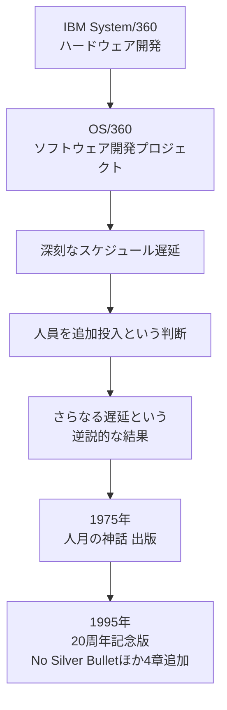
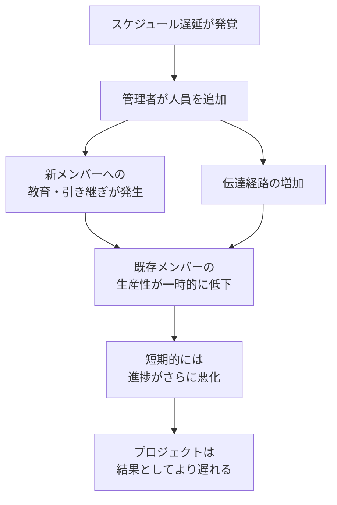
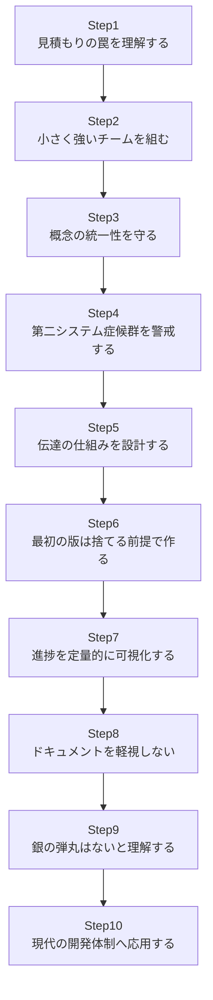
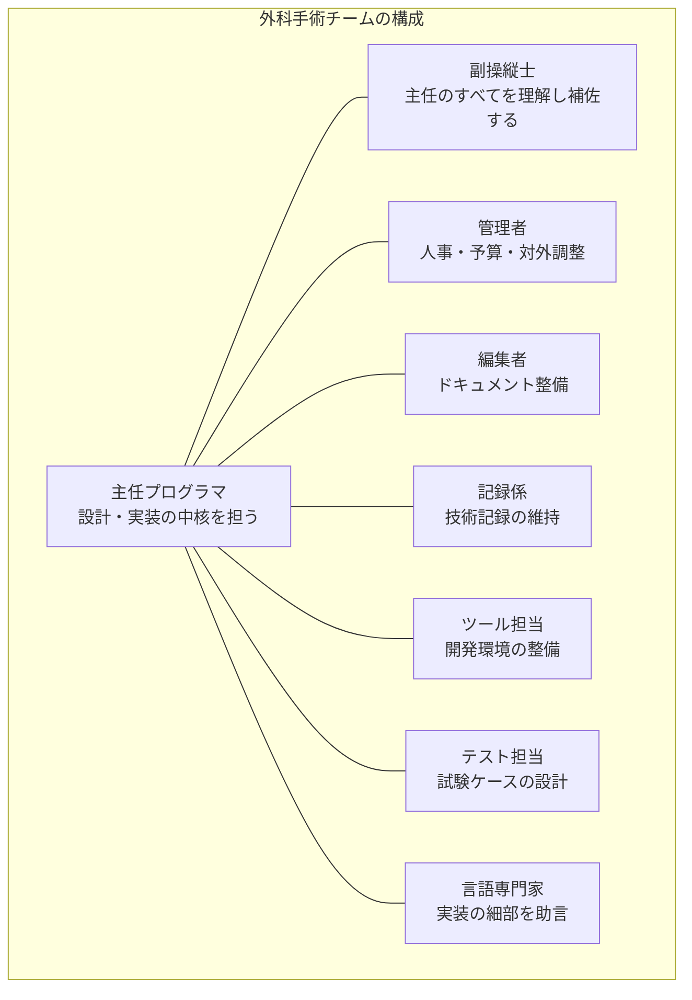
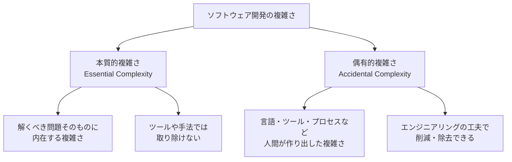

# 『人月の神話』完全ガイド ― 初学者のためのステップ・バイ・ステップ実践集

> 原著: *The Mythical Man-Month: Essays on Software Engineering, Anniversary Edition* / Frederick P. Brooks, Jr.（Addison-Wesley Professional）
> 参照元: [O'Reilly 書誌ページ](https://www.oreilly.com/library/view/mythical-man-month-the/0201835959/)

このガイドは、ソフトウェア工学史上もっとも引用される古典『人月の神話（The Mythical Man-Month）』を、初めて読む方でも実務にすぐ応用できるように、ステップ・バイ・ステップの形式でまとめたものです。ASCIIアートは使用せず、フローチャートはすべて Mermaid、構造化された情報はすべて Markdown の表で表現しています。内容は 2026年8月19日時点までの公開情報をウェブ検索し、著名な国際的開発者（Joel Spolsky、apenwarr こと Avery Pennarun、Mark Seemann、Adrian Colyer ほか）の言及も参照して作成しました。出典 URL は末尾の「参考文献」に一覧化しています。

---

## 目次

1. [この本について](#1-この本について)
2. [核心：ブルックスの法則](#2-核心ブルックスの法則)
3. [なぜ人を増やしても早くならないのか](#3-なぜ人を増やしても早くならないのか)
4. [章立てマップ（全19章 + エピローグ）](#4-章立てマップ全19章--エピローグ)
5. [ステップ・バイ・ステップ ベストプラクティス](#5-ステップバイステップ-ベストプラクティス)
6. [神話 vs 現実：比較表](#6-神話-vs-現実比較表)
7. [著名な開発者たちはどう評価しているか](#7-著名な開発者たちはどう評価しているか)
8. [現代（アジャイル／DevOps／AI時代）への示唆](#8-現代アジャイルdevopsai時代への示唆)
9. [まとめ](#9-まとめ)
10. [参考文献](#10-参考文献)

---

## 1. この本について

Fred Brooks（フレデリック・P・ブルックス・ジュニア）は、IBM System/360 ファミリーおよびその基本ソフトウェアである OS/360 の開発プロジェクトマネージャーを務めた人物です。1975年に出版された本書は、当時としては史上最大規模だったこのソフトウェアプロジェクトでの実体験――スケジュール遅延、人員追加による混乱、概念の統一性の崩壊――を率直に振り返ったエッセイ集です。

Brooks 自身、この本を評して「みんなが引用し、何人かが読み、ごく一部の人だけがその通りに実行する」と語ったと伝えられています。この皮肉めいた言葉こそが、本書が半世紀にわたり読み継がれている理由を物語っています。

Brooks は1999年に ACM チューリング賞（コンピュータ科学における最高の栄誉）を「コンピュータアーキテクチャ、オペレーティングシステム、およびソフトウェア工学への画期的貢献」により受賞し、2022年11月17日に91歳で逝去しました。

---

## 2. 核心：ブルックスの法則

本書のタイトルにもなっている中心命題は「人月（man-month）」という単位そのものが神話であるという指摘です。人月とは「1人が1か月で行える作業量」という仮想的な単位ですが、Brooks は、これを使って人と時間を機械的に交換できると考えることが根本的な誤りだと論じました。

その帰結が、今日「ブルックスの法則」として知られる一節です。

> 「遅れているソフトウェアプロジェクトへの人員追加は、そのプロジェクトをさらに遅らせる」

Brooks は自らこの法則を「とんでもない単純化」と認めつつも、これが多くのプロジェクトに共通する本質的な力学を捉えていると述べています。有名な比喩として「9人の女性を集めても、1か月で赤ん坊は生まれない」という一文も本書に登場し、作業のすべてが分割可能・並列化可能ではないことを端的に示しています。

### ブルックスの法則が成立する主な理由

| 要因 | 内容 |
|---|---|
| 教育コスト（Ramp-up time） | 新メンバーは既存メンバーから説明を受けて初めて生産的になれる。教育中は既存メンバーの生産性も落ちる |
| コミュニケーションオーバーヘッド | 人数が増えるほど、必要な伝達経路の数が急激に増加する |
| タスクの逐次性 | ソフトウェア開発の一部作業は本質的に順序依存で並列化できない |
| 分割コスト | 作業を分割すればするほど、統合・すり合わせという新たな作業が発生する |

---

## 3. なぜ人を増やしても早くならないのか

### 3.1 コミュニケーション経路の急増

チームの人数を n 人とすると、全員が互いに情報をやり取りする必要がある場合、経路の数は組み合わせの数式 `n(n-1)/2` に従って増加します。これは人数の増加に対して直線的（線形）ではなく、二次関数的に増えることを意味します。

| チーム人数 n | 伝達経路数 n(n-1)/2 |
|---|---|
| 2 | 1 |
| 4 | 6 |
| 6 | 15 |
| 10 | 45 |
| 20 | 190 |
| 50 | 1,225 |

人数がわずか2.5倍（20人→50人）になっただけで、経路数は6倍以上に膨れ上がります。この非線形な伸びこそが、大人数チームで「声が届かなくなる」実感の正体です。

### 3.2 ブルックスの法則が引き起こす悪循環

### 3.3 例外：分割可能なタスクには当てはまらない

ブルックス自身が本書で述べているとおり、ブルックスの法則が効くのは**メンバー間の緊密な調整が必要な、相互依存性の高い作業**であり、担当者どうしのやり取りをほとんど必要としない分割可能なタスクには当てはまりません。本ガイドの適用例を挙げるなら、既存コードベース全体を手分けしてレビューし、セキュリティ上の問題を洗い出すような作業がこれに当たります（この例は本ガイドによる応用であり、原著や後述の引用元が挙げているものではありません）。

---

## 4. 章立てマップ（全19章 + エピローグ）

20周年記念版（Anniversary Edition）の目次に基づく全体像です。

| 章 | 原題 | 要点（初学者向け一言） |
|---|---|---|
| 1 | The Tar Pit | ソフトウェア開発はなぜ「タールの沼」のように厄介なのかを提示する序章 |
| 2 | The Mythical Man-Month | 人月という単位の危険性とブルックスの法則の提示 |
| 3 | The Surgical Team | 外科手術チームという小人数・高効率のチーム編成モデル |
| 4 | Aristocracy, Democracy, and System Design | 「概念の統一性」を守るためのアーキテクト中心の設計思想 |
| 5 | The Second-System Effect | 二作目のシステムほど過剰設計に陥りやすいという警鐘 |
| 6 | Passing the Word | 仕様や設計意図をチーム全体に周知する方法 |
| 7 | Why Did the Tower of Babel Fail? | バベルの塔の寓話に見る、組織とコミュニケーションの失敗 |
| 8 | Calling the Shot | 見積もりが甘くなりがちな理由と対処法 |
| 9 | Ten Pounds in a Five-Pound Sack | リソース制約下（メモリ・容量など）での設計判断 |
| 10 | The Documentary Hypothesis | 文書化そのものが設計品質を高めるという逆説 |
| 11 | Plan to Throw One Away | 最初に作るものは「捨てる前提」で作るべきという提言 |
| 12 | Sharp Tools | 開発ツールへの投資を惜しまないことの重要性 |
| 13 | The Whole and the Parts | 部分の結合とシステムテストにおける落とし穴 |
| 14 | Hatching a Catastrophe | 大規模な遅延は「小さな遅れの積み重ね」から生まれる |
| 15 | The Other Face | プログラムのもう一つの顔＝文書としての側面 |
| 16 | No Silver Bullet ― Essence and Accident in Software Engineering | 銀の弾丸は存在しない：本質的複雑さと偶有的複雑さ |
| 17 | "No Silver Bullet" Refined | 1986年の主張を10年後に再検証 |
| 18 | Propositions of The Mythical Man-Month: True or False? | 本書の主要命題を20年後の視点で採点し直す |
| 19 | The Mythical Man-Month after 20 Years | 20年を経てのブルックス自身による総括 |
| Epilogue | Fifty Years of Wonder, Excitement, and Joy | 出版50年を振り返るエピローグ（追補） |

---

## 5. ステップ・バイ・ステップ ベストプラクティス

以下は本書のエッセンスを、実務で使える10のステップに落とし込んだものです。

### Step 1｜見積もりの罠を理解する（第2・8章）

- 人は本質的に楽観主義者であり、「今回は問題が起きないだろう」と見積もりを甘くしがちです。
- 作業を「実装（コーディング）」だけで見積もらず、設計・テスト・システム統合・文書化を含めた総工数で見積もります。
- 「N人月かかる」という見積もりから安易に「では2N人を投入すれば半分の期間で終わる」と逆算しないこと。これは本書が最も強く戒めている誤りです。

### Step 2｜小さく強いチームを組む（第3章：外科手術チーム）

Harlan Mills が提案し Brooks が発展させた「外科手術チーム」モデルは、実際の外科手術チームになぞらえて、少数精鋭の中心人物とそれを支える専門スタッフでチームを構成する考え方です。

- ポイントは「全員が対等に分業する」のではなく、**設計判断の責任を一人（または少数）に集中させる**ことで概念の統一性とコミュニケーションコストの両方を抑える点にあります。
- 現代的な解釈では、これは「テックリード＋支援メンバー」という体制や、マイクロサービスにおける「1チーム1オーナー」原則として応用されています。

### Step 3｜概念の統一性（コンセプチュアル・インテグリティ）を守る（第4章）

- Brooks は「システム設計において最も重要なのは概念の統一性である」と述べています。
- 機能を増やすたびに「このアイデアは全体の設計思想に本当に合致するか」を問い、合致しなければ機能が優れていても採用を見送る勇気が必要です。
- 一部の実装者の思いつきをすべて取り込むと、ユーザーから見て一貫性のない「委員会設計（design by committee）」に陥ります。

### Step 4｜第二システム症候群を警戒する（第5章）

最初のシステムは制約の中で慎重に作られるため簡潔になりがちですが、その成功体験を経て取り組む「二作目」では、開発者は自信を得た結果、これまで我慢してきた機能をすべて詰め込みたくなります。これが**第二システム効果**です。

- 対策として、Brooks はアーキテクトに「機能ごとに要するバイト数・処理時間などのコストを明示させる」ことで自己規律を働かせるよう提案しています。
- 実務上は、経験豊富な（＝すでに一度「二作目」を通過した）設計者をアーキテクトに据えることが有効だとされています。

### Step 5｜伝達の仕組みを設計する（第6・7章）

- 「バベルの塔」の寓話は、共通言語（共通の目的意識）を失ったチームがいかに崩壊するかの比喩として使われます。
- 定例会議、非公式なチャット、共有の技術記録など、複数のチャネルを併用して仕様や設計意図を周知することが推奨されています。
- 現代でいえば、ADR（Architecture Decision Record）、社内 Wiki、Slack の技術チャンネルなどがこの「伝達の仕組み」に相当します。

### Step 6｜最初の版は捨てる前提で作る（第11章）

> 「パイロット版を作って捨てるかどうかを議論する必要はない。あなたはどのみちそれをやることになる。だから最初からそのつもりで計画せよ」

- 最初に書いたコードには、要件理解の不足からくる設計上の欠陥が含まれやすくなります。
- これを前提に計画すれば、「捨てる」ことが失敗ではなく、計画通りの学習プロセスとして扱えます。
- 一方で、apenwarr（Avery Pennarun）は、大規模な「ゼロからの書き直し」自体が第二システム症候群の温床になりやすいと指摘しており、Joel Spolsky が論じた Netscape のフルスクラッチ書き直しの失敗例（"Things You Should Never Do, Part I"）を教訓として挙げています。**「捨てる前提で小さく作る」と「土台からすべて作り直す」は別物である**という点は現代的な補足として重要です。

### Step 7｜進捗を定量的に可視化する（第14章：破局のふ化）

- 大きな遅延は、ある日突然発生するのではなく「小さな遅れの積み重ね」が見過ごされた結果です。
- マイルストーンは「9割終わった」のような曖昧な自己申告ではなく、成果物単位（動くコード・通過したテストなど）で判定します。
- 進捗の遅れを早期に検知し、早期に対処するほど、ブルックスの法則が引き起こす悪循環を避けやすくなります。

### Step 8｜ドキュメントを軽視しない（第10・15章）

- Brooks はドキュメント作成そのものを「設計の欠陥をあぶり出す行為」として重視しました。設計を言語化する過程で、曖昧な部分が可視化されるためです。
- アジャイル的な開発では重厚な仕様書は敬遠されがちですが、「なぜその設計にしたか」という意思決定の記録（ADR等）は現代でも高い価値を持ちます。

### Step 9｜銀の弾丸はないと理解する（第16・17章：No Silver Bullet）

1986年の論文 "No Silver Bullet: Essence and Accidents of Software Engineering" で Brooks は、ソフトウェア開発の困難さを **本質的複雑さ（essential complexity）** と **偶有的複雑さ（accidental complexity）** に分類しました。

- 高水準言語やIDE、時分割処理などの技術革新は、あくまで偶有的複雑さを削減してきたにすぎません。
- 「このフレームワーク／この手法を導入すれば生産性が10倍になる」という宣伝文句には、本質的複雑さを解決できるのかという視点で懐疑的に向き合うべきだと Brooks は説いています。

### Step 10｜現代の開発体制へ応用する

- アジャイル開発における「スモールチーム」「継続的なコミュニケーション」「反復的なプロトタイピング」は、実は本書が半世紀前から主張してきた原則の延長線上にあります。
- クラウド・DevOps時代においても、マイクロサービス化はコミュニケーション経路の問題を「組織の分割」によって緩和しようとする試みとして解釈できます（いわゆるコンウェイの法則との接続）。
- 生成AIによるコーディング支援が普及した2026年現在においても、「コードを書く」という偶有的複雑さの一部は削減されつつありますが、要件を理解し設計判断を下すという本質的複雑さは依然として人間に残されています。この点は次節で詳しく扱います。

---

## 6. 神話 vs 現実：比較表

| よくある思い込み（神話） | 本書が示す現実 |
|---|---|
| 人を増やせば、その分だけ早く終わる | 相互依存性の高い作業では、教育コストと伝達コストが生産性の増分を上回ることが多い |
| 見積もりは「作業量 ÷ 人数」で単純に算出できる | ソフトウェア開発の作業は分割不可能な部分が多く、人月は等価交換できる単位ではない |
| 機能を増やせば増やすほど良いシステムになる | 概念の統一性を失ったシステムは、機能が多くても使いにくいものになる |
| 二作目のシステムは経験を積んだ分、必ず良くなる | 自信過剰から機能を詰め込みすぎる「第二システム症候群」に陥りやすい |
| ドキュメント作成は開発速度を遅らせるだけの作業だ | 文書化の過程は設計の曖昧さを可視化し、後工程の手戻りを減らす |
| 新しい言語・ツール・手法を導入すれば生産性は劇的に向上する | 偶有的複雑さは削減できても、本質的複雑さは技術だけでは解決できない |
| 最初に書いたコードをそのまま本番運用すればよい | 最初の版は設計上の問題が見つかる可能性が高いため、学習として捨てる前提で計画すべき |

---

## 7. 著名な開発者たちはどう評価しているか

### Joel Spolsky（Stack Overflow 共同創業者・元CEO、Fog Creek Software 創業者）

自身のブログ Joel on Software で本書に繰り返し言及しており、「凡庸なプログラマー5人を優秀なプログラマー1人の代わりにすることはできない」という論旨のもと、少人数の精鋭チームがなぜ調整コストの面で有利かを説明しています。ここでの論点は、人数を増やすことでは代替できない「調整コスト」と個人の能力差にあります。

### apenwarr（Avery Pennarun、Tailscale 共同創業者・CEO、git-subtree や sshuttle などの開発者）

第二システム症候群を現代のソフトウェア業界の事例（IPv6、Python 3、Perl 6 など）に照らして再解釈し、大規模な「ゼロからの書き直し」プロジェクトがなぜ繰り返し失敗するのかを論じています。Joel Spolsky が指摘した Netscape の全面書き直しの失敗も引用しつつ、50年前の教訓が今なお繰り返されている現実を指摘しています。

### Mark Seemann（ploeh blog、『Code That Fits in Your Head』などの著者）

1986年の "No Silver Bullet" における本質的複雑さと偶有的複雑さの比率について、Brooks の見立て（偶有的複雑さは全体の半分以下）に独自の反証を試みており、本書の主張を鵜呑みにせず批判的に検証する姿勢を示しています。

### Adrian Colyer（the morning paper、元 Pivotal / SpringSource CTO）

技術論文の要約ブログ the morning paper において "No Silver Bullet" を取り上げ、本質的困難と偶有的困難というアリストテレス由来の区分を丁寧に解説し、後年の "Out of the Tar Pit"（Moseley & Marks, 2006）との思想的な連続性も指摘しています。

---

## 8. 現代（アジャイル／DevOps／AI時代）への示唆

- **アジャイル開発との関係**：頻繁な対話・反復的な開発・小さなチーム編成といったアジャイルの原則の多くは、本書が指摘した「コミュニケーションコストの管理」という課題への一つの回答と位置づけられます。一方で、大規模な仕様書を軽視しすぎる風潮に対しては、Brooks が重視した文書化の意義を再確認する声も見られます。
- **マイクロサービス／組織設計との関係**：システムを疎結合なサービス群に分割する動きは、コミュニケーション経路の急増という問題を「組織構造そのものを分割する」ことで緩和しようとする試みとして解釈できます。
- **生成AI時代の"銀の弾丸"論争**：AIによるコード生成は、偶有的複雑さ（定型的な実装作業）を大幅に削減する強力なツールですが、「何を作るべきか」「なぜそう設計すべきか」という本質的複雑さの判断はなお人間の役割として残ります。AIコーディング（いわゆる vibe coding）の普及が進む中でも、要件定義から設計、テスト、リリースに至る構造化されたプロセスの重要性は変わらないという指摘が、2026年時点の記事でもなされています。

---

## 9. まとめ

『人月の神話』が半世紀近く読み継がれている理由は、扱っているのが特定の技術やツールではなく、**人間が集団でものを作るときに普遍的に直面する力学**だからです。

- 人を増やすことは万能の解決策ではない（ブルックスの法則）
- 小さく強いチームと明確な意思決定の中心が、大規模開発における混乱を防ぐ（外科手術チーム、概念の統一性）
- 成功体験の直後こそ、過剰設計の罠に陥りやすい（第二システム症候群）
- 技術の進歩は偶有的複雑さを減らすが、本質的複雑さは決してゼロにならない（銀の弾丸はない）

Brooks 自身が述べたように「みんなが引用し、何人かが読み、ごく一部の人だけがその通りに実行する」書物ではなく、実際にチーム運営や見積もりの現場でこれらの原則を意識して「実行する」側に回ることが、このガイドの目的です。

---

## 10. 参考文献

以下は本ガイド作成にあたって参照した情報源です（2026年8月19日時点でアクセス確認済み）。

- O'Reilly 書誌ページ（本書の目次・概要）
  https://www.oreilly.com/library/view/mythical-man-month-the/0201835959/
- Wikipedia: The Mythical Man-Month
  https://en.wikipedia.org/wiki/The_Mythical_Man-Month
- Wikipedia: Brooks's law
  https://en.wikipedia.org/wiki/Brooks's_law
- Wikipedia: No Silver Bullet
  https://en.wikipedia.org/wiki/No_Silver_Bullet
- Wikipedia: Second-system effect
  https://en.wikipedia.org/wiki/Second-system_effect
- Wikipedia: Fred Brooks（経歴・チューリング賞について）
  https://en.wikipedia.org/wiki/Fred_Brooks
- ACM A.M. Turing Award: Frederick Brooks（受賞理由）
  https://amturing.acm.org/award_winners/brooks_1002187.cfm
- Communications of the ACM: In Memoriam: Frederick P. Brooks, Jr. 1931–2022
  https://cacm.acm.org/news/in-memoriam-frederick-p-brooks-jr-1931-2022/
- Joel Spolsky, "Hitting the High Notes"（Joel on Software）
  https://www.joelonsoftware.com/2005/07/25/hitting-the-high-notes/
- apenwarr（Avery Pennarun）, "Systems design explains the world: volume 1"
  https://apenwarr.ca/log/20201227
- Mark Seemann, "Yes silver bullet"（ploeh blog）
  https://blog.ploeh.dk/2019/07/01/yes-silver-bullet/
- Adrian Colyer, "No Silver Bullet — essence and accident in software engineering"（the morning paper）
  https://blog.acolyer.org/2016/09/06/no-silver-bullet-essence-and-accident-in-software-engineering/
- Jason Sachs, "In Memoriam: Frederick P. Brooks, Jr. and The Mythical Man-Month"（EmbeddedRelated）
  https://www.embeddedrelated.com/showarticle/1484.php
- Fred Brooks, "No Silver Bullet: Essence and Accidents of Software Engineering"（原著論文 PDF、UNC 技術報告書）
  https://www.cs.unc.edu/techreports/86-020.pdf
- "The Mythical Man Month: 5 Lessons About Software Development"（vibe coding 時代における再評価、2026年）
  https://five.co/blog/5-lessons-on-software-development-the-mythical-man-month/

> 本ガイドは上記情報源を要約・言い換えて作成したものであり、原文からの長文引用は行っていません。詳細な内容については、必ず原著および各リンク先の一次情報をご確認ください。
