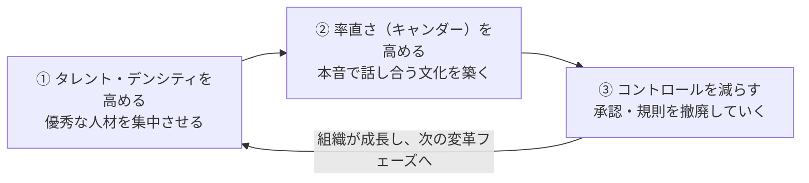
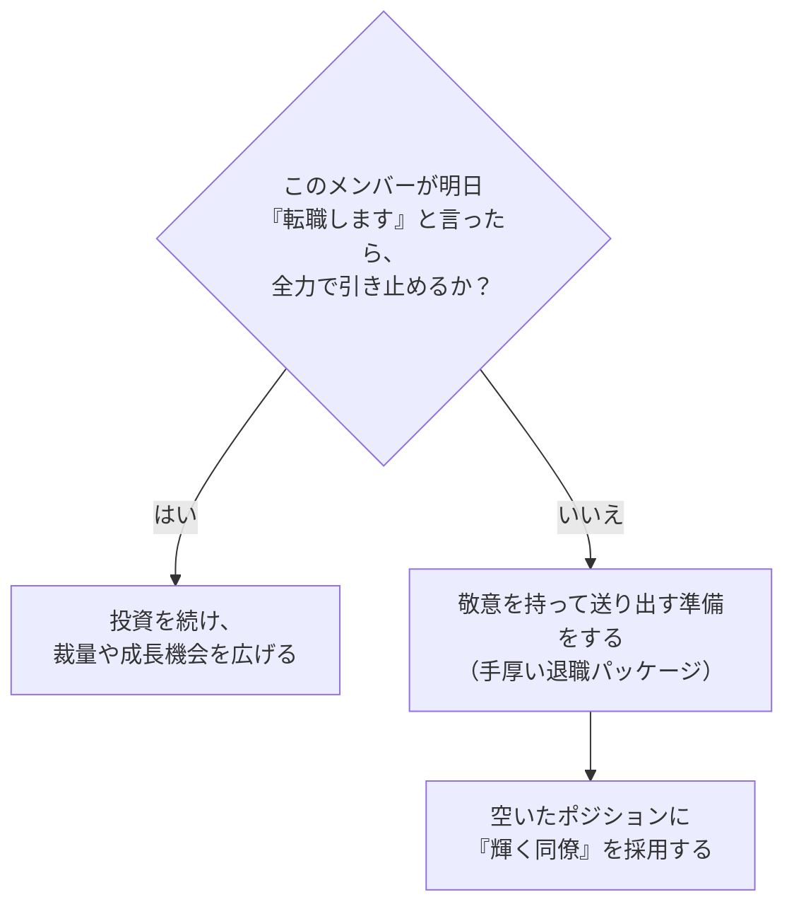
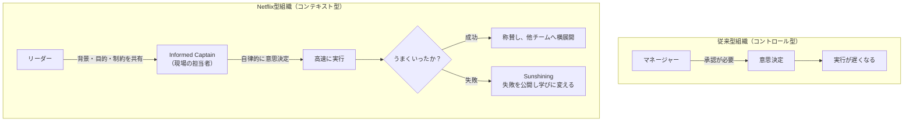
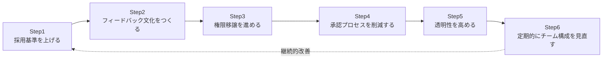

# 『NO RULES RULES(ノー・ルールズ)』完全ガイド
### ― Netflixの型破りな企業文化を初学者向けにステップバイステップで解説 ―

> 原著: *No Rules Rules: Netflix and the Culture of Reinvention*（2020年刊）
> 著者: リード・ヘイスティングス（Netflix共同創業者・会長。原著刊行時は共同CEO）／エリン・メイヤー（INSEAD教授、『異文化理解力』著者）

---

## この記事について

本ガイドは、Netflixの企業文化を解説した経営書『NO RULES RULES』のエッセンスを、ソフトウェアエンジニアやプロジェクトマネージャーの視点から初学者向けに整理したものです。原著の文章をそのまま引用するのではなく、内容を要約・パラフレーズして解説しています。より深く学びたい方は、ぜひ原著を手に取ってください。

情報は2026年8月時点のウェブ検索結果（書評サイト、開発者ブログ、公式情報など）をもとにまとめており、末尾に根拠となるソースURLを掲載しています。

---

## 目次

1. [この本の背景と著者](#1-この本の背景と著者)
2. [核となる考え方：Netflixサイクル](#2-核となる考え方netflixサイクル)
3. [ステップ1：タレント・デンシティ（人材密度）を高める](#3-ステップ1タレントデンシティ人材密度を高める)
4. [ステップ2：率直さ（キャンダー）を高める](#4-ステップ2率直さキャンダーを高める)
5. [ステップ3：コントロール（管理・統制）を減らす](#5-ステップ3コントロール管理統制を減らす)
6. [本の構成（チャプター早見表）](#6-本の構成チャプター早見表)
7. [ソフトウェア開発チームへの応用ガイド](#7-ソフトウェア開発チームへの応用ガイド)
8. [導入時の注意点・批判的視点](#8-導入時の注意点批判的視点)
9. [世界の開発者・エンジニアの声](#9-世界の開発者エンジニアの声)
10. [まとめ：あなたのチームは何から始めるべきか](#10-まとめあなたのチームは何から始めるべきか)
11. [参考文献・ソースURL](#11-参考文献ソースurl)

---

## 1. この本の背景と著者

### 1.1 リード・ヘイスティングスとは

リード・ヘイスティングスは1997年にNetflixを共同創業し、会長・共同CEOを務めた人物です。もともとはソフトウェアエンジニア出身で、Netflix以前の1991年に「Pure Software」という会社（Unix/C言語向けデバッグツール「Purify」を開発）を創業しています。

Pure Softwareは急成長する過程でミスが起こるたびに新しいルールや承認プロセスを追加していった結果、官僚的で創造性に乏しい組織になってしまい、プログラミング言語のトレンドがC++からJavaへ移行する変化に対応できず、最終的に競合のRational Softwareに売却することになりました。

この経験からヘイスティングスは「ルールや管理を増やすことが、かえって企業の適応力を奪う」という教訓を得て、Netflixでは正反対のアプローチ――**自由と責任（Freedom & Responsibility）**を軸にした文化――を意図的に築いていきました。

### 1.2 エリン・メイヤーとは

エリン・メイヤーは、フランスの名門ビジネススクールINSEADの教授で、異文化マネジメントの世界的権威です。ベストセラー『異文化理解力（The Culture Map）』の著者でもあり、2019年には「世界で最も影響力のあるビジネス思想家50人」の一人に選出されています。本書では、200人以上のNetflix従業員へのインタビューを行い、ヘイスティングスの主張を検証・肉付けする役割を担いました。

### 1.3 本書の位置づけ

- 2020年刊行、Financial Times & McKinsey ビジネス書大賞の最終候補
- 2020年10月にニューヨーク・タイムズ・ベストセラー入り
- Netflixが公開し、Facebook（当時）のCOOシェリル・サンドバーグが「シリコンバレーから出た中で最も重要な文書」と評したとされる「カルチャーデック」（127枚のスライド）の内容を、体系立てて書籍化したもの

---

## 2. 核となる考え方：Netflixサイクル

本書の中心的なメッセージは、以下の**3ステップの循環プロセス**を繰り返すことで、統制（コントロール）に頼らない自由な組織文化を築けるというものです。

重要なのは、これが**一度きりの改革ではなく、繰り返すサイクルだ**という点です。Netflixは「DVD郵送レンタル → ストリーミング配信 → オリジナルコンテンツ制作 → グローバル展開」という4回の大きな事業転換を経験してきましたが、そのたびにこのサイクルを回すことで組織文化を再構築してきました。

> **なぜこの順番なのか？**
> いきなり管理を外すと組織は崩壊します。まず「優秀な人材」を集め、次に「本音で言い合える関係性」を築いて初めて、安心して「管理を手放す」ことができる、という因果関係になっています。

---

## 3. ステップ1：タレント・デンシティ（人材密度）を高める

### 3.1 基本コンセプト

タレント・デンシティとは、「平均的な人材を大勢集める」のではなく「卓越した少数精鋭（Netflixの言葉で"stunning colleagues"＝輝く同僚）」を集めるという考え方です。

Netflixが重視するのは、パフォーマンスは伝染するという事実です。優秀な人材の周りにいると、他のメンバーも引き上げられて成長しますが、逆に平凡・低パフォーマンスな人材がいると、周囲のモチベーションやアウトプットの質を静かに引き下げてしまいます。

ソフトウェア開発の世界でしばしば語られる「優秀なプログラマーと平均的なプログラマーの生産性には、数倍〜数十倍の差がある」という趣旨の議論（いわゆる「ロックスター・プログラマー」論）も、本書内で人材密度の重要性を裏付ける例として紹介されています。

### 3.2 具体的な実践方法

| 実践項目 | 内容 |
|---|---|
| 市場最高水準の報酬を支払う | ボーナスではなく基本給で、個人の市場価値の最高水準を払う。ボーナスは「決められた行動」を促すため、柔軟性を損なうと考えられている |
| キーパーテストを使う | マネージャーが定期的に「このメンバーが辞めると言ったら、全力で引き止めるか？」を自問する |
| 十分なパフォーマンスでも入れ替える | 「及第点（Adequate）」の人材には、手厚い退職金を払って気持ちよく卒業してもらい、より優れた人材を採用する |

### 3.3 キーパーテストの意思決定フロー

初学者向けの補足として、これは「冷酷なリストラ推奨」ではなく、「本人にとっても、より合ったポジションを探すきっかけになる」という前提のもとに語られている点に注意してください（後述する批判点も参照）。

---

## 4. ステップ2：率直さ（キャンダー）を高める

### 4.1 なぜ率直さが必要か

タレント・デンシティが高い組織では、遠慮のない率直なフィードバックが機能しやすくなります。本書では「率直さは歯医者に行くようなもの――多少痛くても、放置すると後で大きな問題になる」という趣旨の比喩で説明されています。

Netflixでは、上司にだけ意見を言うのではなく、**あらゆる方向（部下→上司、同僚→同僚含む）へのフィードバック**が奨励されており、上司の意見に対してミーティング中に反対意見を述べることも「当然の行動」とされています。言い換えれば、気づいた問題を黙っていることの方が「組織への裏切り」とみなされる文化です。

### 4.2 4Aフィードバックモデル

率直さが単なる「攻撃」や「人格否定」にならないよう、Netflixでは以下の4つの原則（4A）でフィードバックの質を担保しています。

| 記号 | 英語 | 意味 | 誰の役割か |
|---|---|---|---|
| A | Aim to Assist（助けるために） | 個人攻撃ではなく、相手やチームの成功を助ける意図で伝える | フィードバックを**送る**側 |
| A | Actionable（行動可能な） | 具体的に何を変えれば良いかが分かる内容にする | フィードバックを**送る**側 |
| A | Appreciate（感謝する） | 防御的にならず、まず感謝の姿勢で受け止める | フィードバックを**受ける**側 |
| A | Accept or Discard（受け入れるか、取捨選択する） | フィードバックをすべて鵜呑みにする必要はなく、最終判断は本人に委ねられる | フィードバックを**受ける**側 |

### 4.3 サンシャイニングと反対意見の奨励

本書ではさらに次の2つの実践が紹介されています。

- **サンシャイニング（Sunshining）**：失敗や間違いを隠すのではなく、あえて日の光の下にさらして共有し、組織全体の学びに変える実践
- **反対意見を積極的に集める（Farming for Dissent）**：大きな意思決定の前に、あえて反対意見を求めて回り、盲点をつぶしてから前に進む姿勢

なお、率直さの表現方法には文化差があることにも本書は触れています。共著者エリン・メイヤーの専門である異文化理解の知見を踏まえ、「直接的な物言いを好む文化」と「婉曲的な表現を好む文化」でフィードバックの伝え方を調整する必要性が語られています（後述の開発者レビューでも、オランダ文化の直接性などが具体例として言及されています）。

---

## 5. ステップ3：コントロール（管理・統制）を減らす

### 5.1 基本方針：「コントロール」ではなく「コンテキスト」を与える

タレント・デンシティと率直さの土台ができて初めて、Netflixは規則や承認プロセスを取り除いていきます。ここでのキーコンセプトが「**コンテキストで導く、コントロールでは導かない（Lead with Context, Not Control）**」です。

リーダーの役割は「決裁者」ではなく、「意思決定に必要な背景情報・目的・制約条件を与える人」に変わります。実際の意思決定は、現場でその判断を下すのに最も適した人物――本書では**インフォームド・キャプテン（Informed Captain）**と呼ばれる――に委ねられます。

### 5.2 具体的に撤廃される代表的な規則

| 規則 | 従来型企業 | Netflix |
|---|---|---|
| 休暇ポリシー | 年間日数が規定され、事前承認が必要 | 明文化された日数の上限はなく、上司と相談しながら自分で判断する |
| 出張・経費承認 | 上長の事前承認や上限額のルールが必要 | 「Netflixの利益を最優先に考えて行動する」という原則のみで、個別承認は不要 |
| 意思決定の承認 | 稟議・複数階層の承認フローが必須 | 現場のInformed Captainが、周囲に意見を求めた上で自ら決定する |
| 評価・ボーナス制度 | 目標達成度に応じた個人ボーナス | 個人ボーナス無し。市場水準の基本給で報いる |

### 5.3 なぜこれが機能するのか

本書は、これらの施策が「単独の福利厚生」ではなく、**信頼のシグナル**として機能していると説明しています。会社が従業員を信頼して裁量を渡すことで、従業員側も「信頼に応えよう」という責任感を強め、結果的により責任ある行動につながる、という因果の連鎖です。

ただし本書自身も、リーダーが自ら長期休暇を取って手本を見せなければ「誰も本当に休暇を取らなくなる」「休暇日数の少なさを競い合う」といった副作用が起こり得ることを認めています。制度だけでなく、リーダーの行動が伴って初めて機能する点は重要な注意点です。

---

## 6. 本の構成（チャプター早見表）

初学者が原著を読む際の見取り図として、章立てと対応するテーマをまとめました。

| # | 原題（要約） | 対応するテーマ |
|---|---|---|
| 1 | A Great Workplace Is Stunning Colleagues | タレント・デンシティの重要性 |
| 2 | Say What You Really Think (with Positive Intent) | 率直なフィードバック文化 |
| 3a | Remove Vacation Policy | 休暇ポリシーの撤廃 |
| 3b | Remove Travel and Expense Approvals | 経費承認プロセスの撤廃 |
| 4 | Pay Top of Personal Market | 市場最高水準の報酬 |
| 5 | Open the Books | 経営情報の透明化 |
| 6 | No Decision-Making Approvals Needed | 意思決定の承認撤廃 |
| 7 | The Keeper Test | キーパーテストによる人材の見直し |
| 8 | A Circle of Feedback | 360度フィードバックの仕組み化 |
| 9 | Lead with Context, Not Control | コンテキスト型リーダーシップ |
| 10 | Bring It All to the World! | 文化のグローバル展開 |

---

## 7. ソフトウェア開発チームへの応用ガイド

ここからは、世界トップクラスのソフトウェアエンジニア／プロジェクトマネージャーの視点から、本書のエッセンスをエンジニアリング組織で実践するためのステップバイステップガイドを示します。**いきなり全てを真似るのではなく、段階的に導入する**ことが重要です。

### Step 1：採用基準を上げ、タレント・デンシティを可視化する

- コードレビューやペアプログラミングでの技術面接を強化し、「一緒に働きたい／このチームに誇りを持てる」水準の人材だけを採用する
- チームメンバー自身が採用プロセスに関わる仕組みを作る（採用の当事者意識を高める）

### Step 2：ブレームレス・ポストモーテム（＝サンシャイニングの実践）を導入する

- 障害対応後の振り返り（ポストモーテム）を「誰が悪いか」ではなく「何が起きたか・どう防ぐか」に焦点化する
- インシデントの詳細をチーム全体、可能なら社内全体に共有し、同じ失敗を他チームが繰り返さないようにする
- 1on1やスプリントレトロスペクティブで、4Aモデル（助けるため・行動可能・感謝して受け止める・取捨選択できる）を明示的にルール化する

### Step 3：意思決定の権限をチームに委譲する

- 技術選定は、実際にコードを書くエンジニアチームが「RFC（Request for Comments）」形式で提案し、関係者から意見を募った上で自分たちで決定する仕組みを作る
- マネージャーやテックリードの役割を「承認者」から「コンテキスト（ビジネス背景・制約・優先順位）を提供する人」へ再定義する

### Step 4：承認プロセスを段階的に削減する

- 例：本番デプロイの承認フローを、テストカバレッジやCIの合格を条件に自動化・簡略化する
- 例：一定額以下の開発ツール購入や外部サービス契約について、事後報告制に変更する
- 一気に全廃するのではなく、信頼できる範囲（チーム、金額、影響範囲）から段階的に緩めていく

### Step 5：透明性を高める

- ロードマップ、OKR、障害対応記録、技術的負債のバックログなどをできる限りオープンにする
- 経営指標やプロダクト指標をエンジニアにも共有し、「なぜこの機能を作るのか」というコンテキストを提供する

### Step 6：定期的にチーム構成を見直す（キーパーテストの応用）

- マネージャーが半期に一度、「このメンバーが転職を検討していると聞いたら、引き止めるために何をするか」を自問する運用ルールを作る
- 「及第点」のパフォーマンスに安住させず、成長機会の提示か、円満な移行支援かのどちらかを早めに判断する

---

## 8. 導入時の注意点・批判的視点

本書は高く評価される一方で、実務家や読者からは以下のような懸念点も指摘されています。バランスの取れた理解のために整理します。

### 8.1 前提条件が厳しい

Netflixの「管理を外す」施策は、すでに高いタレント・デンシティと信頼関係が築かれていることが大前提です。ある開発者ブログのレビューでは、経費承認なしの制度を数年間悪用し、豪華な出張や食事を繰り返していた社員のエピソードが紹介されており、性善説だけに頼る仕組みにはリスクも伴うことが示唆されています。

### 8.2 文化として「厳しすぎる」という声もある

Goodreadsの読者レビューの中には、Netflixのカルチャーデックを「過度に対立的で、攻撃的だ」と感じたという声もあり、率直さの文化が心理的安全性を損なう可能性への懸念が指摘されています。フィードバック文化を導入する際は、ポジティブな評価や心理的な安心感とのバランスを意識する必要があります。

### 8.3 ソフトウェア開発の具体的な手法にはあまり触れていない

複数の開発者によるレビューでは、本書はあくまで「企業文化・人事制度」に焦点を当てた内容であり、Netflixのエンジニアリング組織が実際にどのような開発プロセスやアーキテクチャを採用しているかについては、ほとんど触れられていない点が指摘されています。技術的な実践を学びたい場合は、Netflix Tech Blogなど別のソースを参照する必要があります。

### 8.4 全ての組織に当てはまるわけではない

本書自身も「これはNetflixというユニークな文脈で機能した処方箋であり、万能の正解ではない」という留保をつけています。会社の規模、業種、資金状況、法規制環境によっては、そのまま適用するとむしろリスクになる施策（無制限休暇、経費承認廃止など）も含まれるため、「自社にとってどこまで移植可能か」を慎重に見極めることが推奨されます。

---

## 9. 世界の開発者・エンジニアの声

書評サイトやニュースレターから、実際にソフトウェアエンジニアとして働く著者たちのコメントを紹介します（要約・パラフレーズ）。

- **Luca Rossi**（エンジニアリングリーダー向けニュースレター「Refactoring」主宰、元CTO）は、本書を「普遍的なルール集ではなく、Netflixという特定の文脈で機能する“特定の処方箋”を説明した本」と位置づけ、読者が自社にそのまま当てはめるのではなく、批判的に検討しながら活用すべきだと論じています。
- **DEV Community**のレビュー（開発者 sirech 氏）では、率直なフィードバック文化についての章を高く評価しつつも、フィードバックの伝え方には文化差（例：オランダ文化の直接的な物言い）があることを学べた点を評価しています。一方で、ソフトウェア開発そのものに関する記述が少ない点を残念な点として挙げています。
- ソフトウェアエンジニアの**Mario Fernandez**氏は、Netflixの文化を「思いやりのあるダーウィニズム（compassionate Darwinism）」と表現し、高いパフォーマンスを求めつつも実験や自律的意思決定を促す文化のバランスを評価しています。
- スタッフエンジニアの**Cody Hiar**氏は、「賭け（bets）を立てて実行し、失敗したらサンシャイニングする」というNetflix流の意思決定プロセスを、自身がスタッフエンジニアに昇進する過程で実際に活用したと述べています。
- エンジニアの個人ブログ（ernest.oppet.it）では、経費承認なしの制度のおかげで、あるエンジニアが『ハウス・オブ・カード』のローンチ前夜に急遽購入した新型Samsung TVでアプリのデバッグを行い、ローンチを救ったエピソードが紹介されています。

---

## 10. まとめ：あなたのチームは何から始めるべきか

『NO RULES RULES』の核心は、**「ルールを無くすこと」自体が目的ではなく、「優秀な人材」「率直な対話」「信頼に基づく自律性」という3つの土台を順番に積み上げることで、結果的にルールが不要になっていく**というプロセスにあります。

初学者・小規模チームがまず取り組みやすいステップは、以下の3つです。

1. **フィードバックの質を上げる**：4Aモデルを1on1やレトロスペクティブに取り入れる（コストが低く、すぐ始められる）
2. **ブレームレスな振り返り文化を作る**：障害対応やプロジェクトの失敗を「誰の責任か」ではなく「仕組みの改善」として扱う
3. **小さな承認プロセスから権限委譲する**：影響範囲が小さい意思決定から、現場に判断を委ねる練習を始める

大きな制度改革（無制限休暇、経費承認の全廃など）は、これらの土台が組織に根付いてから、慎重に検討することをお勧めします。

---

## 11. 参考文献・ソースURL

以下は本ガイド作成にあたり参照した情報源です（2026年8月時点でアクセス確認）。

| 情報源 | 種別 | URL |
|---|---|---|
| Erin Meyer公式サイト（著者本人による書籍紹介） | 公式情報 | https://erinmeyer.com/books/no-rules-rules/ |
| Erin Meyer - Wikipedia | 百科事典 | https://en.wikipedia.org/wiki/Erin_Meyer |
| Netflix公式ニュース「'No Rules Rules' explores how Netflix reinvented work culture」 | 公式情報 | https://about.netflix.com/en/news/no-rules-rules-explores-how-netflix-reinvented-work-culture |
| Goodreads（読者レビュー・批判的意見を含む） | 読者レビュー | https://www.goodreads.com/book/show/49099937-no-rules-rules |
| Admired Leadership「No Rules Rules」書籍要約 | ビジネス書要約 | https://admiredleadership.com/book-summaries/no-rules-rules/ |
| Luca Rossi「No Rules Rules」（ニュースレター Refactoring） | 著名エンジニアリングリーダーによる書評 | https://refactoring.fm/p/no-rules-rules |
| DEV Community（開発者 sirech 氏による書評） | 開発者コミュニティ | https://dev.to/sirech/book-review-no-rules-rules-netflix-and-the-culture-of-reinvention-3d5g |
| Mario Fernandez氏（ソフトウェアエンジニア）の書評 | 開発者ブログ | https://hceris.com/book-review-no-rules-rules-netflix/ |
| Cody Hiar氏（スタッフエンジニア）の書評 | 開発者ブログ | https://www.codyhiar.com/blog/book-review-no-rules-rules/ |
| ernest.oppet.it（エンジニアの読書ノート） | 開発者ブログ | https://ernest.oppet.it/2021/02/22/no-rules-rules/ |
| NPR「No Rules Rules」関連報道アーカイブ | 報道機関 | https://www.npr.org/tags/912917743/no-rules-rules/archive |
| Bookey（章立て参照） | 書籍要約サービス | https://www.bookey.app/book/no-rules-rules |

---

*本ガイドはAIによるリサーチ・要約であり、原著の著作権を尊重し、本文の逐語引用は行っていません。正確な理解のためには、必ず原著『No Rules Rules: Netflix and the Culture of Reinvention』（Reed Hastings, Erin Meyer 著）をお読みください。*
