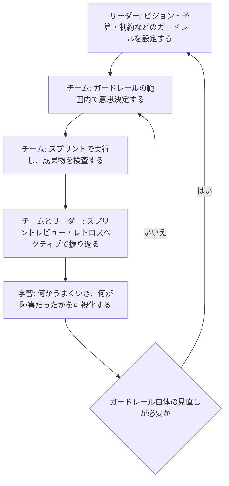
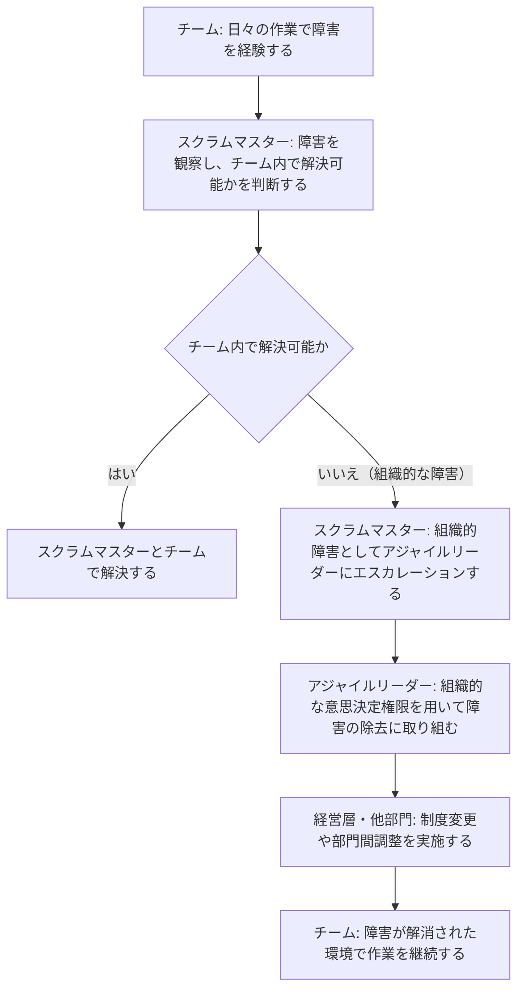

# Professional Agile Leadership™ I（PAL I）認定試験 学習ガイド

> サーバントリーダーシップと組織的アジリティの本質を、初学者でも体系的に理解できるように解説する実践ガイドです。
> 公式参照: [PAL I 試験概要](https://www.scrum.org/assessments/professional-agile-leadership-certification) / [The Scrum Guide](https://www.scrumguides.org/) / [Evidence-Based Management Guide](https://www.scrum.org/resources/evidence-based-management-guide) / [Agile Leadership Learning Series](https://www.scrum.org/pathway/agile-leader-learning-series)

---

## 目次

1. [PAL I 認定試験概要と「アジャイルリーダーシップ」の基本理念](#1-pal-i-認定試験概要とアジャイルリーダーシップの基本理念)
2. [高業績・自己管理型チームの育成](#2-高業績自己管理型チームの育成developing-people--teams)
3. [組織的な障害の排除とカルチャー変革](#3-組織的な障害の排除とカルチャー変革managing-the-organization)
4. [価値とエビデンスに基づく測定と改善（EBM）](#4-価値とエビデンスに基づく測定と改善ebm-evidence-based-management)
5. [試験対策・頻出シチュエーション問題の解法パターン](#5-試験対策頻出シチュエーション問題の解法パターン)
6. [参考リソース・公式リンク集](#6-参考リソース公式リンク集)

---

## 1. PAL I 認定試験概要と「アジャイルリーダーシップ」の基本理念

### 1.1 PAL I 試験の目的と試験形式

PAL I（Professional Agile Leadership I）は、Scrum.org が提供する、マネージャーやエグゼクティブなど「チームの外側」からアジャイルな組織づくりを支える立場の人材向けの認定です。PSM（Professional Scrum Master）がチーム内のスクラム実践に焦点を当てるのに対し、PAL I は「組織がアジャイルチームを機能させるために、リーダーは何をすべきか」という一段上のレイヤーを扱います。

| 項目 | 内容 |
|---|---|
| 試験時間 | 60分 |
| 出題数 | 36問（多肢選択・複数選択・True/False混在） |
| 合格ライン | 85%（36問中31問以上の正答が目安） |
| 出題言語 | 英語のみ |
| 受験前提コース | 必須ではないが「Professional Agile Leadership Essentials（PAL-E）」受講が推奨 |
| 有効期限 | なし（再認定不要の永続資格） |
| 出題領域 | Facilitation、Self-Managing Teams、Empiricism、Product Value、Leadership Styles、Events、Forecasting & Release Planning、Scrum Team、Stakeholders & Customers、Scrum Values、Organizational Design & Culture、Evidence-Based Management、Emergent Software Development |

これらの数値・出題領域は今後変更される可能性があるため、受験前に必ず公式ページで最新情報を確認してください。

> 出典: [PAL I Certification 公式ページ](https://www.scrum.org/assessments/professional-agile-leadership-certification)

### 1.2 なぜアジャイル組織に新しいリーダーシップが求められるのか

従来の管理手法は、環境が比較的安定していて「計画を立てれば予測どおりに進む」ことを前提にしていました。しかし現代のビジネス環境は VUCA（Volatility＝変動性、Uncertainty＝不確実性、Complexity＝複雑性、Ambiguity＝曖昧性）と呼ばれる状態にあり、次のような変化が起きています。

- 顧客ニーズが高速に変化し、最初の計画どおりに作っても市場に受け入れられるとは限らない
- ソフトウェアや市場そのものが複雑系であり、事前にすべてを分析しきることができない
- 現場（チーム）の方が、経営層よりも「実際に何が機能しているか」の一次情報を多く持っている

このような環境では、「詳細な計画を立て、それを厳密に管理・統制する」という伝統的マネジメントは機能しにくくなります。Scrum が採用する経験主義（Empiricism）は、計画に固執するのではなく、実際に得られた成果（Evidence）に基づいて意思決定を継続的に調整していく考え方です。PAL I が問うアジャイルリーダーシップとは、この経験主義を組織レベルで実践できるように、リーダー自身の振る舞いと組織の仕組みを変えていくことを指します。

### 1.3 伝統的マネジメントとアジャイルリーダーシップの根本的な違い

重要なのは、アジャイルリーダーシップは「役職としてのマネージャーが不要になる」という話ではなく、**リーダーの関わり方そのものが指示命令型からサーバントリーダーシップへとパラダイムシフトする**という点です。サーバントリーダーとは「まず奉仕し、その後に導く」リーダー像であり、チームの上に立って統制するのではなく、チームの前に立って障害を取り除き、後ろから支える存在です。

| 観点 | 伝統的マネージャー（Command & Control） | アジャイルリーダー（Servant Leadership） |
|---|---|---|
| 意思決定の所在 | リーダーが詳細タスクレベルまで意思決定する | 実行方法の意思決定はチームに委ね、リーダーは方向性と制約を示す |
| 情報の流れ | トップダウンの指示伝達が中心 | チームからの一次情報を吸い上げ、組織的な障害除去に使う |
| 評価指標 | 個人の稼働率、計画遵守率、進捗の「報告」内容 | チームが生み出す顧客・事業価値、学習の速度、心理的安全性 |
| 失敗への態度 | 失敗は罰の対象、犯人探しが起きやすい | 失敗は学習の機会として扱い、実験を奨励する |
| チームへの関わり方 | 指示を出し、進捗を管理・監督する | 障害を取り除き、ガードレールを設け、権限を委譲する |
| 組織構造への働きかけ | 既存の階層・承認プロセスを維持・運用する | アジリティを阻害する評価制度・予算プロセス自体を見直す対象とする |
| 求められるスキル | 専門知識に基づく指揮命令能力 | ファシリテーション、コーチング、対人関係構築、システム思考 |

このシフトの根底にあるのは、「複雑な問題の最適な解決策は、現場に最も近い人々が経験主義を通じて発見する」という信頼です。リーダーの役割は答えを与えることではなく、チームが自ら答えを見つけられる環境（心理的安全性、明確な境界線、必要なリソースへのアクセス）を整えることにシフトします。

> 出典: [The Scrum Guide](https://www.scrumguides.org/)（経験主義・自己管理の定義）、[Agile Leadership Learning Series](https://www.scrum.org/pathway/agile-leader-learning-series)

---

## 2. 高業績・自己管理型チームの育成（Developing People & Teams）

### 2.1 自己管理型（Self-Managing）チームへの成熟度ステージ

2020年版 Scrum Guide 以降、「自己組織化（Self-Organizing）」という言葉は「自己管理（Self-Managing）」に置き換えられました。自己管理型チームとは、「誰が」「何を」「どのように」行うかを、チーム内部で選択できるチームを指します。ただし、チームは最初から自己管理できるわけではなく、段階的に成熟していきます。

- **依存段階**: チームはリーダーからの指示がないと動けない。タスクの割り振りも意思決定もリーダー主導。
- **自己組織化の芽生え段階**: チームがタスクの進め方について意見を出し始めるが、重要な意思決定はまだリーダーに確認を求める。
- **自己管理の実践段階**: チームが「何を」「どのように」作るかを自ら決定し、リーダーは境界線（プロダクトの方向性、予算、コンプライアンス等）のみを示す。
- **高業績段階**: チーム自身がさらに広い権限（採用への関与、技術選定、プロセス改善）を持ち、組織的な意思決定にも影響を与える。

リーダーの役割は、この成熟度ステージに応じて関わり方を変えていくこと（状況対応型リーダーシップ）です。未成熟な段階でいきなり権限を丸投げすると混乱を招き、逆に成熟したチームに対して細かく指示を出し続けるとチームのモチベーションと自律性を損ないます。

### 2.2 権限委譲（Delegation & Empowerment）の実践

アジャイルリーダーシップにおける委譲は、「丸投げ（Abdication）」でも「マイクロマネジメント」でもありません。両極端の中間にある、**段階的なコントロールの委譲**という考え方が重要です。これを可視化する代表的なツールが「7 段階の委譲（7 Levels of Delegation、Management 3.0）」や、それを議論するための「Delegation Board」です。

| レベル | 呼称 | リーダーとチームの関係 |
|---|---|---|
| 1 | Tell（指示する） | リーダーが決定し、チームに伝える |
| 2 | Sell（説得する） | リーダーが決定し、その理由をチームに説明して納得を得る |
| 3 | Consult（相談する） | チームの意見を聞いた上で、最終的にリーダーが決定する |
| 4 | Agree（合意する） | リーダーとチームが議論し、合意の上で決定する |
| 5 | Advise（助言する） | リーダーは助言のみ行い、決定はチームが行う |
| 6 | Inquire（尋ねる） | チームが決定した後、リーダーはその理由を尋ねて学ぶ |
| 7 | Delegate（委任する） | チームが完全に決定し、リーダーは関与しない |

すべての意思決定を一律にレベル7へ引き上げる必要はありません。「技術的な実装方法」はレベル6〜7、「予算やコンプライアンスに関わる意思決定」はレベル2〜4というように、**意思決定の種類ごとに委譲レベルを明示すること**が実践上のポイントです。この一覧表自体をチームと共有し、認識をすり合わせるプロセスが Delegation Board の使い方です。

### 2.3 ガードレール（境界線・制約条件）の設定

権限を委譲する際、リーダーが完全に手を離してよいわけではありません。リーダーが担うべき責任は、「チームが安全に自律的な意思決定を行える範囲（ガードレール）」を明確にすることです。ガードレールの例としては、プロダクトのビジョンやゴール、予算の上限、法令・コンプライアンス要件、組織全体で合意されたアーキテクチャ原則などが挙げられます。ガードレールが明確であればあるほど、チームは安心してその内側で自由に意思決定できます。

次の図は、リーダーがガードレールを設定し、チームが自律的に意思決定・実行し、その結果を振り返って学習し、次のガードレール調整につなげていく自律サイクルを示しています。

このサイクルが回り続けることで、チームは経験主義に基づいて自己管理能力を高め、リーダーは「細部への介入」から「システムの調整」へと役割をシフトさせていくことができます。

### 2.4 心理的安全性の担保と失敗を学習に変える文化

自己管理とガードレールの仕組みがあっても、チームメンバーが「間違いを指摘したら評価が下がる」「新しい提案をして失敗したら責められる」と感じていれば、実験も率直な発言も起きません。心理的安全性とは、対人関係のリスクを取っても罰せられないとチームメンバーが確信できる状態を指し、高業績チームの土台となる要素です。

リーダーが心理的安全性を醸成するための具体的な実践には、次のようなものがあります。

- 失敗が起きた際に「誰が悪いか」ではなく「システムのどこに学習の機会があるか」を問うブレームレス・ポストモーテムを行う
- リーダー自身が自分の失敗や不確実性を率直に語り、弱さを見せることを許容する雰囲気を作る
- スプリントレトロスペクティブなどの「安全な場」を、経営層からの評価の場にしないことを明言し、実際にそう運用する
- 実験を「失敗」ではなく「仮説検証」として扱い、小さく速く試すことを奨励する予算・時間の余白を用意する

心理的安全性は一度作れば終わりではなく、リーダーの日々の反応（特に悪いニュースを受け取ったときの反応）によって継続的に強化・毀損されるものであるという理解が重要です。

> 出典: [Agile Leadership Learning Series](https://www.scrum.org/pathway/agile-leader-learning-series)、[The Scrum Guide](https://www.scrumguides.org/)（自己管理型チームの定義）

---

## 3. 組織的な障害の排除とカルチャー変革（Managing the Organization）

### 3.1 チーム内の課題（Team Impediments）と組織全体の課題（Organizational Impediments）の切り分け

スクラムチームが直面する障害には、大きく分けて2種類があります。

- **チーム内の障害（Team Impediments）**: チームのプロセスやコミュニケーションの中で発生し、チーム自身とスクラムマスターの支援によって解決可能なもの。例: スプリント計画の進め方が非効率、チーム内のコミュニケーション不足など。
- **組織的な障害（Organizational Impediments）**: チームの権限の外側にあり、組織構造・制度・他部門との関係に起因するもの。例: 予算承認に数ヶ月かかる、部門間のサイロで必要な情報や協力が得られない、人事評価制度が個人の成果のみを評価しチームワークを評価しない、など。

チーム内の障害はスクラムマスターとチームが自力で解決できることが多い一方、組織的な障害はチーム単独では解決できません。ここでアジャイルリーダーの出番が生まれます。**組織的な障害を特定し、それを取り除くことは、アジャイルリーダーの中核的な責務**です。

### 3.2 スクラムマスターとアジャイルリーダーの協調関係

スクラムマスターは日々チームに最も近い立場から障害を観察・特定できますが、組織的な障害を解決する権限（予算の変更、人事制度の改定、他部門への働きかけなど）を持っていないことがほとんどです。一方でアジャイルリーダーは、その権限を持つ立場にいながら、現場で何が起きているかの一次情報を持っていません。したがって、両者が協調することで初めて組織的な障害は解消に向かいます。

このエスカレーションの流れが機能するためには、リーダーが「スクラムマスターから上がってきた課題を真剣に受け止め、実際に行動する」という信頼関係を築いていることが前提になります。エスカレーションしても何も変わらない経験が続くと、スクラムマスターとチームは声を上げなくなり、組織的な障害は放置されたままになります。

### 3.3 サイロの打破と部門横断的なコラボレーションの促進

多くの伝統的組織は、機能別（開発、QA、インフラ、マーケティングなど）に部門が分かれた「サイロ構造」を持っています。サイロは専門性を高める一方で、プロダクトを顧客に届けるために必要な部門間の連携を妨げ、待ち時間（Time to Market の悪化）を生み出します。アジャイルリーダーは、次のような働きかけによってサイロを打破し、部門横断的な協働を促進します。

- 機能別チームではなく、顧客価値の単位でエンドツーエンドの責任を持つプロダクト志向のチーム編成へ再構成する
- 部門間の引き継ぎ（ハンドオフ）をなくし、必要な専門性をチーム内に内包する、または必要なタイミングで柔軟にアクセスできるようにする
- 部門ごとの個別最適化された目標（KPI）ではなく、組織全体・プロダクト全体で共有される成果指標を設定する
- 部門を横断した「コミュニティ・オブ・プラクティス」など、専門性を共有しながらもチームの自律性を損なわない仕組みを支援する

### 3.4 アジリティを阻害する既存システム（人事評価、予算配分、承認プロセス）の刷新

組織的な障害の多くは、意図せずアジリティを阻害してしまっている既存の制度に起因します。アジャイルリーダーが見直しの対象とすべき代表的な制度には、次のようなものがあります。

- **人事評価制度**: 個人の成果やベロシティ比較に基づく評価は、チームワークやチーム全体の価値創出よりも個人の見栄えを優先する行動を誘発します。チーム単位の成果や協働行動を評価する仕組みへの移行が求められます。
- **予算配分プロセス**: 年次の固定予算に基づくプロジェクト単位の予算承認は、市場の変化に応じた優先順位の見直しを妨げます。プロダクト単位での継続的な予算配分（インクリメンタル・ファンディング）への移行が有効です。
- **承認プロセス**: 多段階の稟議や承認が必要な意思決定フローは、意思決定のリードタイムを長期化させます。権限委譲の考え方を組織の意思決定プロセスにも適用し、現場に近いレベルで判断できる範囲を広げることが求められます。

これらの制度変更は一朝一夕には実現できず、経営層を巻き込んだ長期的なカルチャー変革の取り組みとなります。PAL I ではこうした変革を「一度に完璧に実施する」のではなく、スクラム自体が経験主義に基づくのと同様に、**小さな変更を試し、効果を検証しながら段階的に進める**アプローチが期待されます。

> 出典: [Agile Leadership Learning Series](https://www.scrum.org/pathway/agile-leader-learning-series)、[The Scrum Guide](https://www.scrumguides.org/)（スクラムマスターの組織への説明責任）

---

## 4. 価値とエビデンスに基づく測定と改善（EBM: Evidence-Based Management）

### 4.1 EBM フレームワークとは

Evidence-Based Management（EBM）は、組織がアジャイルへの投資から実際にどれだけの価値を得ているかを測定し、意思決定を継続的に改善していくための Scrum.org 公式フレームワークです。EBM の目的は、「忙しく見えるかどうか」や「計画どおりに進んだかどうか」ではなく、**実際に顧客と組織にもたらされた成果（アウトカム）**に焦点を当てることにあります。リーダーにとって EBM が重要なのは、組織的な意思決定（どこに投資すべきか、どの取り組みを止めるべきか）を、憶測ではなくエビデンスに基づいて行えるようになるためです。

### 4.2 4つの主要価値領域（Key Value Areas, KVA）

EBM は次の4つの Key Value Areas（KVA）で構成されます。

| KVA | リーダー視点での意味 | 有効なメトリクスの例 | 避けるべきアンチパターン指標 |
|---|---|---|---|
| **Current Value（CV）: 現在の価値** | 現時点でプロダクトが顧客・事業にもたらしている実際の成果を可視化する | 顧客満足度、実際の利用率・アクティブユーザー数、顧客あたりの収益 | 出荷した機能数（アウトプット量そのもの） |
| **Unrealized Value（UV）: 未実現の価値** | 将来的に獲得できる可能性のある市場機会・投資余地を把握する | 市場シェアの伸びしろ、顧客からの未対応の要望、潜在市場規模 | 「バックログの行数」など、価値と無関係な量的指標 |
| **Time to Market（T2M）: 市場投入までの時間** | アイデアが意思決定されてから顧客に届くまでのリードタイムを短縮する | リリース頻度、アイデアから本番リリースまでのリードタイム | チームの稼働率100%（キャパシティの余白がないとリードタイムはむしろ悪化する） |
| **Ability to Innovate（A2I）: 革新への能力** | 新しい価値創出にどれだけのキャパシティを割けるか（技術的負債や運用負荷にどれだけ圧迫されているか） | 技術的負債への対応に充てられる時間の割合、デプロイの自動化率、変更障害率 | 個人間のベロシティ比較（チームごとに前提が異なり比較不可能） |

### 4.3 誤ったメトリクスとアンチパターンの危険性

EBM を正しく実践する上でリーダーが特に注意すべきなのが、測定行為そのものが組織の行動を歪めてしまうリスクです。代表的なアンチパターンには次のようなものがあります。

- **ベロシティの個人・チーム間比較**: ベロシティはチームごとに見積もりの基準が異なるため、チーム間の比較や個人評価に使うと、見積もりのインフレ（数字を大きく見せる行動）を誘発します。ベロシティはあくまで単一チームの計画補助ツールとして扱うべきです。
- **稼働率100%信仰**: チームを常にフル稼働させることは、一見効率的に見えますが、突発的な割り込みや学習・改善のための余白がなくなり、結果としてリードタイム（T2M）を悪化させます。理論上も、キューイング理論の観点から、稼働率が高くなるほど待ち時間は急激に増加することが知られています。
- **アウトプット指標への固執**: 「何行のコードを書いたか」「何個の機能をリリースしたか」といったアウトプット量の指標は、それが顧客価値（CV）に結びついているかを保証しません。EBM は常にアウトプットではなくアウトカム（成果）を問います。

リーダーの役割は、こうした歪んだ指標をチームに課さないようにすると同時に、組織全体の意思決定（どのプロダクトに投資を続けるか、どの取り組みを終了するか）を、4つの KVA に基づくエビデンスによって行うよう働きかけることです。

> 出典: [Evidence-Based Management Guide](https://www.scrum.org/resources/evidence-based-management-guide)

---

## 5. 試験対策・頻出シチュエーション問題の解法パターン

PAL I の試験は知識の暗記だけでなく、状況判断（シチュエーション）問題が多く出題される点が特徴です。以下は典型的なジレンマのパターンと、判断の軸です。

### 5.1 典型的なジレンマ・状況判断シナリオ

- **スプリントゴール未達が見込まれる場面**: 「リーダーが介入して残業を指示する」のではなく、「チームに検査・適応を委ね、なぜ未達になりそうなのかという根本原因（見積もりの精度、割り込みの多さ、技術的負債など）に焦点を当てる」ことが望ましい振る舞いです。残業の強制は短期的な帳尻合わせにしかならず、根本原因を隠蔽してしまいます。
- **ステークホルダーからの割り込み要請**: リーダーは、ステークホルダーの要求そのものを拒否するのではなく、「進行中のスプリントの計画・コミットメントを保護しつつ、次のスプリントプランニングや優先順位付けのプロセスを通じて正式に扱う」という形でチームを守ります。プロダクトオーナーとステークホルダーの間の優先順位付けの透明性を高めることが、割り込みの根本的な予防策になります。
- **チーム間の対立**: 対立の内容が技術的な意見の相違なのか、目標や評価制度の不一致に起因するものなのかを見極めます。前者はチーム内のファシリテーションで解決を促し、後者（組織の評価制度がチーム間の協力を阻害しているケース）は組織的障害として、リーダー自身が制度側に働きかけるべき対象として扱います。
- **評価制度とアジャイルな働き方のギャップ**: 個人単位の目標設定がチームでの協働を阻害している場合、リーダーは現場のプロセスを変えるのではなく、評価制度そのものを見直す責任を負います。

これらのシナリオに共通する判断軸は、「**この状況で、チームの自律性を尊重しつつ、リーダーとしてしか解決できない障害（組織的な制約）に自分は取り組めているか**」という問いです。

### 5.2 合格に向けた推奨学習ステップ

- The Scrum Guide を読み込み、経験主義・自己管理・スクラムの価値基準を確実に理解する
- Evidence-Based Management Guide を読み、4つの KVA とそれぞれの目的を説明できるようにする
- 公式の Agile Leadership Open Assessment を、安定して高得点が取れるようになるまで繰り返し受験する
- Scrum Open Assessment も合わせて受験し、スクラムの基礎知識に抜け漏れがないかを確認する
- 各シナリオ問題に対して、「なぜその選択肢が正しいか」だけでなく「なぜ他の選択肢が誤りか（マイクロマネジメントに寄りすぎている、丸投げになっている、等）」を説明できるようにしておく
- 試験本番では、迷った問題に時間をかけすぎず、一旦マークして先に進み、時間内に全問へ目を通すことを優先する

> 出典: [PAL I Certification 公式ページ](https://www.scrum.org/assessments/professional-agile-leadership-certification)（Practice assessments: Agile Leadership Open, Scrum Open）

---

## 6. 参考リソース・公式リンク集

- [Professional Agile Leadership Certification（公式試験概要）](https://www.scrum.org/assessments/professional-agile-leadership-certification)
- [The Scrum Guide（スクラムガイド最新版）](https://www.scrumguides.org/)
- [Evidence-Based Management Guide（EBM ガイド）](https://www.scrum.org/resources/evidence-based-management-guide)
- [Agile Leadership Learning Series](https://www.scrum.org/pathway/agile-leader-learning-series)
