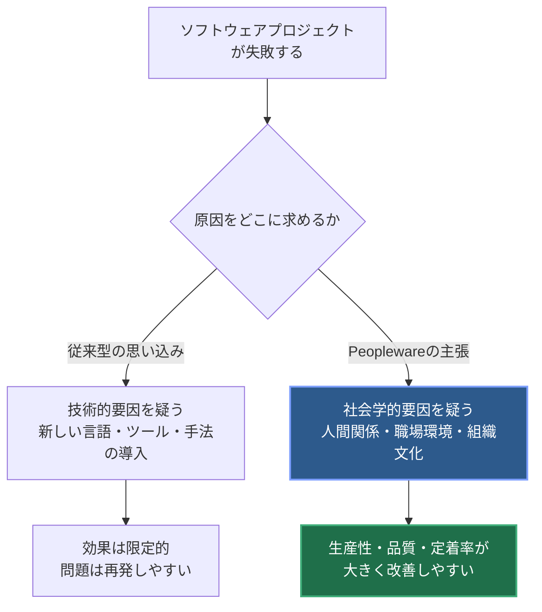
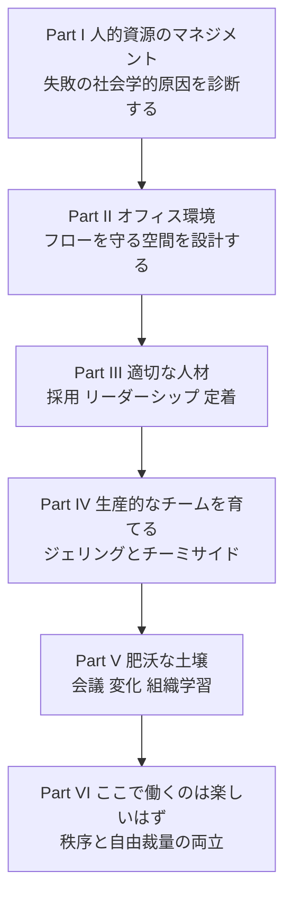
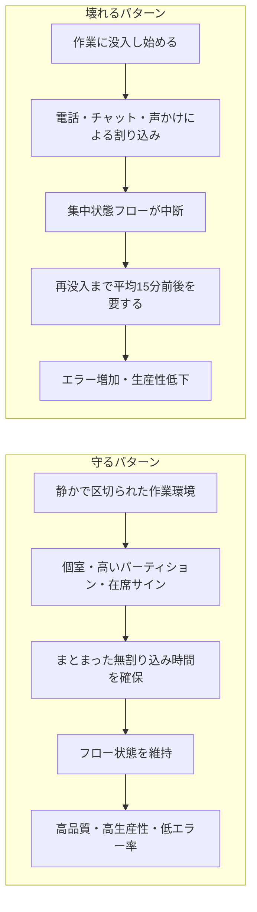
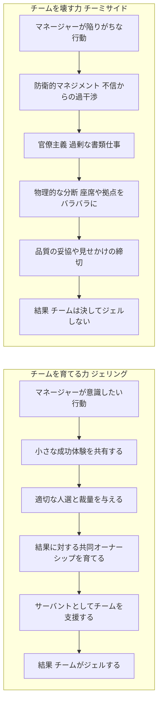
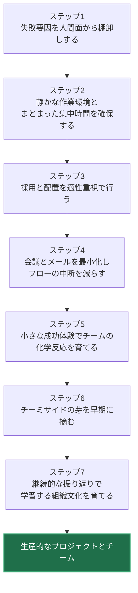

# 『Peopleware: Productive Projects and Teams』初学者ガイド

**ソフトウェア開発が「人間」の問題であることを理解し、実践するためのステップバイステップ解説**

> 原著: *Peopleware: Productive Projects and Teams, Third Edition*
> 著者: Tom DeMarco, Tim Lister（Addison-Wesley Professional, 2013年）
> 参照: [O'Reilly掲載ページ](https://www.oreilly.com/library/view/peopleware-productive-projects/9780133440706/)

---

## この記事の読み方

このガイドは、ソフトウェア開発のマネジメントを学び始めた方に向けて、名著『Peopleware』の要点を**ステップバイステップ**で解説するものです。原著は272ページ・全39章という短めのエッセイ集ですが、扱っているテーマは多岐にわたります。そこで本ガイドでは、原著の6部構成（Part I〜VI）を軸に、初学者がつまずきやすい概念を図解・表・具体例つきで整理しました。

- 図解はすべて **Mermaid** で記述しています（ASCII図は使用していません）。
- 各セクションの末尾に「実践のポイント」を置き、明日から使えるチェックリストにしています。
- 巻末に、著名な開発者・著者による言及を含む参考ソースのURLをまとめています。

---

## 目次

1. [Peoplewareとは何か](#1-peoplewareとは何か)
2. [核心テーゼ：プロジェクトの問題は技術ではなく社会学である](#2-核心テーゼプロジェクトの問題は技術ではなく社会学である)
3. [書籍全体の構成（6部39章）](#3-書籍全体の構成6部39章)
4. [Part I：人的資源のマネジメント](#4-part-i人的資源のマネジメント)
5. [Part II：オフィス環境とフロー状態](#5-part-iiオフィス環境とフロー状態)
6. [Part III：適切な人材](#6-part-iii適切な人材)
7. [Part IV：生産的なチームを育てる](#7-part-iv生産的なチームを育てる)
8. [Part V：肥沃な土壌（組織文化）](#8-part-v肥沃な土壌組織文化)
9. [Part VI：ここで働くのは楽しいはず](#9-part-viここで働くのは楽しいはず)
10. [実践ロードマップ：7ステップで始めるPeopleware](#10-実践ロードマップ7ステップで始めるpeopleware)
11. [著名な開発者たちはどう語っているか](#11-著名な開発者たちはどう語っているか)
12. [批判的な視点・限界](#12-批判的な視点限界)
13. [まとめ](#13-まとめ)
14. [参考ソース（URL一覧）](#14-参考ソースurl一覧)

---

## 1. Peoplewareとは何か

**Peopleware**（ピープルウェア）は、1987年にTom DeMarcoとTim Listerが著したソフトウェアマネジメントの古典です。その後1999年（第2版）、2013年（第3版）と改訂が重ねられ、第3版では「リーダーシップの新たな病理」「会議文化の変化」「世代の異なるメンバーが混在するハイブリッドチーム」「便利なはずのツールが逆に足かせになる現象」などを扱う章が追加されました。

著者2人は、システム構築とその人間的側面に関するコンサルティング会社 **Atlantic Systems Guild** の共同経営者であり、1979年から国際的にマネジメント・見積もり・生産性・企業文化について講演・執筆・コンサルティングを行ってきました。

書籍全体を通じて、著者は「ソフトウェア開発における最大の課題は技術的なものではなく社会学的なものである」という立場を、実際のプロジェクト経験や独自の調査データに基づくエピソードを交えながら説明しています。

`ソフトウェア工学分野で最も影響力のある管理書の一つ` として、*The Mythical Man-Month*（人月の神話）の著者であるFrederick P. Brooks Jr.や、Stack Overflow共同創業者のJoel Spolskyら著名な開発者・研究者からも高く評価されてきました（詳細は[第11章](#11-著名な開発者たちはどう語っているか)を参照）。

### 実践のポイント

- はじめてマネジメントに関わる人は、まず「技術で解決しようとしていないか」を自問する習慣をつけましょう。
- 本書は短いエッセイの集合体なので、通読よりも「気になる章から拾い読み」でも十分に効果があります。

---

## 2. 核心テーゼ：プロジェクトの問題は技術ではなく社会学である

Peopleware第1章「Somewhere Today, a Project Is Failing（どこかで今日もプロジェクトが失敗している）」は、著者たちが数百のプロジェクトを調査した結果として、失敗の主要因が特定の技術的欠陥に集約されないことを明らかにしたところから始まります。よく挙げられる失敗理由は「政治」でしたが、著者たちはこれをより正確に「プロジェクトの社会学（project sociology）」と呼び直しています。

多くのマネージャー（特に元エンジニア出身者）は、人をあたかも交換可能な部品（モジュール）であるかのように扱う傾向があります。著者たちはこれを、効率と均一性ばかりを追求するファストフード店の管理手法になぞらえ、**「チーズバーガー・マネジメント」**と呼んで批判しています。知的で創造的な仕事であるソフトウェア開発を、規格化された組立ラインのように扱うと、人々の意欲は削がれ、本来向き合うべき課題からも目がそれてしまう、というわけです。

### 実践のポイント

- プロジェクトの振り返り（レトロスペクティブ）で不具合が出たとき、真っ先に「ツールを変えよう」と結論づけず、コミュニケーションや環境の要因も同じ重みで検討しましょう。
- 「人は部品ではない」という前提を、評価制度・配置転換・進捗管理の設計に反映させましょう。

---

## 3. 書籍全体の構成（6部39章）

原著（第3版）は以下の6部構成になっています。各Partにどんな問いが置かれているかを把握しておくと、拾い読みの効率が上がります。

### 各Partの主な章（第3版の目次より抜粋）

| Part | テーマ | 代表的な章 |
|---|---|---|
| I. Managing the Human Resource | 人的資源のマネジメント | 1. Somewhere Today, a Project Is Failing／2. Make a Cheeseburger, Sell a Cheeseburger／4. Quality—If Time Permits／5. Parkinson's Law Revisited／6. Laetrile |
| II. The Office Environment | オフィス環境 | 7. The Furniture Police／9. Saving Money on Space／10. Brain Time versus Body Time／11. The Telephone／12. Bring Back the Door |
| III. The Right People | 適切な人材 | 14. The Hornblower Factor／15. Let's Talk about Leadership／16. Hiring a Juggler／19. Happy to Be Here（離職コスト）／20. Human Capital |
| IV. Growing Productive Teams | 生産的なチームを育てる | 21. The Whole Is Greater Than the Sum of the Parts／22. The Black Team／23. Teamicide／24. Teamicide Revisited／26. A Spaghetti Dinner／28. Chemistry for Team Formation |
| V. Fertile Soil | 肥沃な土壌 | 29. The Self-Healing System／30. Dancing with Risk／31. Meetings, Monologues, and Conversations／33. E(vil) Mail／35. Organizational Learning |
| VI. It's Supposed to Be Fun to Work Here | ここで働くのは楽しいはず | 37. Chaos and Order／38. Free Electrons／39. Holgar Dansk |

出典: [O'Reilly掲載の目次](https://www.oreilly.com/library/view/peopleware-productive-projects/9780133440706/)

### 実践のポイント

- 新任マネージャーには、まずPart II（オフィス環境）とPart IV（チーム形成）から読ませると、すぐに現場で応用しやすい概念に出会えます。

---

## 4. Part I：人的資源のマネジメント

### 4-1. チーズバーガー・マネジメントを避ける

前述のとおり、人を規格化された部品として扱う発想は、創造的な知的労働には向いていません。著者たちは、プログラマーやアーティストにとって「仕事の質」自体が重要な内発的動機であると論じています。

### 4-2. 「時間さえあれば品質は上がる」という誤解（Quality—If Time Permits）

多くの現場では、締切が近づくと真っ先に品質基準が犠牲になります。しかし著者たちは、優れた作り手にとって品質への妥協は強い意欲喪失（デモチベーション）を招くと指摘しています。品質を後回しにする文化そのものが、後述する「チーミサイド（チーム崩壊）」の一因にもなります。

### 4-3. Parkinson's Law（パーキンソンの法則）は必ずしも成り立たない

「仕事は与えられた時間をすべて満たすまで膨張する」というパーキンソンの法則は広く知られていますが、著者たちは、優秀なソフトウェア技術者に対してはこの法則が当てはまるとは限らないと論じ、締切を人為的に厳しくすることの弊害を指摘しています。

### 4-4. Laetrile（レートリル）— 効かない万能薬に注意

「レートリル」とは、かつて効果が証明されないまま流行したがん治療薬の名前です。著者たちはこれを比喩に用い、生産性向上を謳う流行の方法論やツールを鵜呑みにする危うさを警告しています。**特効薬のように見える解決策ほど、実際には検証が必要**、というメッセージです。

### 実践のポイント

- 締切のプレッシャーがかかったとき、削るべきはスコープであって品質基準ではないか、を確認する。
- 新しい開発手法やツールを導入する際は、「なぜ効くのか」の根拠を確認してから展開する。

---

## 5. Part II：オフィス環境とフロー状態

Peoplewareの中でも特に有名で、今なお引用され続けているのがこのPartです。

### 5-1. フロー（Flow）とは何か

心理学者が定義する「フロー」とは、深い没入状態のことです。DeMarcoとListerは、ソフトウェア開発のような思考集約型の仕事では、フロー状態に入るまでに時間がかかり、いったん中断されると**再没入までにまとまった時間を要する**ことを説明しています。

### 5-2. 「ファニチャー・ポリス（Furniture Police）」— 均一性という名の牢獄

著者たちは、オフィス空間を「均一性」と「最小コストでの収容」だけを基準に管理する人々を皮肉を込めて **ファニチャー・ポリス** と呼びます。夜間はデスクに家族写真以外を置くことを禁じるといった極端な逸話も紹介されており、こうした管理は生産性を無視した「見た目のきれいさ」だけを優先する典型例として描かれています。日当たりの悪い地下オフィスが「均一だから公平」として好まれてしまう、という笑えない実例も紹介されています。

### 5-3. 実証データ：Coding War Games

著者たちは1984〜1986年にかけて、92社・600人以上のプログラマーを対象に **Coding War Games** という実証実験を行いました。参加者は自分の職場で、通常の業務時間内に同一の課題を設計・実装・テストし、結果が比較されました。

主な発見は次のとおりです。

| 指標 | 結果 |
|---|---|
| 最上位群と最下位群の生産性の差 | 約10倍 |
| 最上位群と中央値の差 | 約2〜2.5倍 |
| 経験年数・給与との相関 | ほとんど相関なし |
| 個室または6フィート以上のパーティションを持つ参加者の割合 | 全体の約11% |
| 100平方フィート以上の専有スペースを持つ参加者の割合 | 全体の約16% |
| 同一企業内のペア間の成績 | ほぼ同水準（企業文化の影響が示唆される） |

出典: [Coding War Gamesの分析記事（U.S. News）](https://www.usnews.com/opinion/blogs/economic-intelligence/2013/04/19/how-office-space-affects-company-productivity)、[Far From Random／fs.blog](https://fs.blog/increasing-the-productivity-of-computer-programmers-and-engineers/)

この結果から著者たちは、**静かさとプライバシーの度合いが、生産性のばらつきを説明する最も強い要因の一つ**であると結論づけました。一方で経験年数や給与といった「わかりやすい」要因はほとんど説明力を持ちませんでした。

なお、この実験は「騒音レベルを客観的に測定したわけではなく、本人が許容できるかどうかを尋ねた主観的評価である」という限界も著者ら自身が明言しています（[U.S. Newsの解説記事](https://www.usnews.com/opinion/blogs/economic-intelligence/2013/04/19/how-office-space-affects-company-productivity)より）。

### 5-4. 必要な物理スペースの目安

IBMサンタテレサ研究所での調査（建築家Gerald McCue主導）を根拠に、著者たちは以下の目安を提示しています。

| 項目 | 推奨値 |
|---|---|
| 一人あたりの専有スペース | 約100平方フィート（約9平方メートル） |
| 一人あたりの作業台スペース | 約30平方フィート（約3平方メートル） |
| 遮音対策 | 個室、または高さ6フィート（約2メートル）以上のパーティション |

### 5-5. Bring Back the Door（ドアを取り戻せ）

「電話（The Telephone）」の章では、鳴った電話に反射的に応答してしまう心理的圧力と、それによる作業中断のコストが論じられています。「ドアを取り戻せ」の章では、開放的なオフィスの象徴であった「ドアを取り払う」流行に対し、著者たちは集中を守るための物理的な区切りの重要性を再主張しています。

### 実践のポイント

- 「集中タイム」をカレンダー上に確保し、チャット通知をオフにできる文化を作る。
- オフィスレイアウトを決める際、コスト最適化だけでなく「静けさ」「区切り」「日照」を評価基準に含める。
- リモート/ハイブリッド環境でも、同期コミュニケーション（通話・チャット即レス期待）を必要最小限に絞る。

---

## 6. Part III：適切な人材

### 6-1. Hiring a Juggler（ジャグラーを雇う）

著者たちは、面接で候補者の実際のスキルを見極める難しさを、実際にジャグリングができるかを確かめずに「ジャグラー」を採用してしまう例えで説明しています。これは、履歴書や口頭でのアピールだけで人材を評価することの危うさを示す比喩です。

### 6-2. リーダーシップの語り方

Part IIIでは、リーダーシップを「役職に付随する権限」ではなく、状況に応じてチームメンバーの間を移動する機能として捉える視点が示されます（この考え方はPart IVの「ジェルしたチーム」概念とも接続しています）。

### 6-3. 離職の隠れたコスト（Happy to Be Here／Human Capital）

離職には採用コストのような「見えるコスト」だけでなく、引き継ぎロス・チームの再編成・知識の喪失といった「見えないコスト」が伴います。著者たちは、経験者の立ち上がり（ランプアップ）にかかる時間を軽視する組織文化にも警鐘を鳴らしています。

### 実践のポイント

- 採用面接では、実際の作業に近いタスクで評価する（ペアプログラミングや設計ディスカッションなど）。
- 離職率を「コスト」として経営層に説明する際は、採用コストだけでなく再教育・引き継ぎのコストも含めて試算する。

---

## 7. Part IV：生産的なチームを育てる

このPartはPeoplewareの中でも中心的なテーマである「チーム形成」を扱います。

### 7-1. ジェルしたチーム（Jelled Team）とは

著者たちは、メンバーの総和以上の成果を出す一体化したチームを **ジェルしたチーム（jelled team）** と呼びます。特徴は次のとおりです。

| ジェルしたチームの兆候 | 説明 |
|---|---|
| 低い離職率 | メンバーがチームを離れたがらない |
| 強い当事者意識 | 成果物を「自分たちのもの」として捉える |
| 独自のアイデンティティ | 「自分たちは特別だ」という一体感（エリート意識） |
| 自然な相互コーチング | リーダーシップが知識や状況に応じてメンバー間を移動する |
| 仕事そのものを楽しんでいる | 単なる成果以上に、プロセス自体への満足感がある |

重要なのは、著者たち自身が「チームを確実にジェルさせる万能の手順書は存在しない」と率直に認めている点です。その代わりに本書は、チームが自然にジェルする土壌を整えること、そして次に説明する「チーミサイド（チーム崩壊行為）」を避けることに焦点を当てています。

### 7-2. The Black Team（ブラックチーム）の逸話

著者たちが紹介する伝説的な逸話の一つが、IBM社内で結成された「ブラックチーム」です。あえて他人のバグを執念深く見つけ出すことに誇りを持つ、独自の文化とアイデンティティを持ったレビューチームとして描かれ、強いチームアイデンティティが持つ力を象徴する例として語られています。

### 7-3. チーミサイド（Teamicide）— チームを殺す7つ（+2つ）の方法

**チーミサイド**とは、著者たちが作った造語で、意図せずジェルしたチームを破壊してしまう経営行動を指します。第2版・第3版では当初の7項目に加えて2項目が追加されています。

| # | チーミサイドの種類 | 内容 |
|---|---|---|
| 1 | 防衛的マネジメント（Defensive Management） | 部下を信頼せず、逐一介入・監視する |
| 2 | 官僚主義（Bureaucracy） | 本質的価値のない書類仕事を強いる |
| 3 | 物理的な分断（Physical Separation） | 座席や拠点をバラバラにし、雑談すら生まれない状態にする |
| 4 | 時間の断片化（Fragmentation of Time） | 一人のメンバーを複数プロジェクトに同時アサインする |
| 5 | 品質基準の切り下げ（The Quality-Reduced Product） | 締切優先で品質へのこだわりを奪う |
| 6 | 見せかけの締切（Phony Deadlines） | 根拠のない締切設定でチームの信頼を損なう |
| 7 | クリークの排除（Clique Control） | 自然発生した非公式な結束を上から統制しようとする |
| 8 | やる気を削るポスターやスローガン（Teamicide Revisited） | 表面的なモチベーション施策で本質的な課題を覆い隠す |
| 9 | 不公平な残業運用（Overtime） | ジェルしたチームに一律に適用しにくい残業慣行が結束を損なう |

出典: [Applied Frameworks「What is Teamicide?」](https://appliedframeworks.com/what-is-teamicide/)、[The Scrum Academyによる要約](https://thescrumacademy.com/2015/03/16/peopleware-productive-teams-and-projects-3rd-edition/)、[O'Reilly Chapter 23: Teamicide](https://www.oreilly.com/library/view/peopleware-productive-projects/9780133440706/ch23.xhtml)

### 7-4. Competition（内部競争の弊害）

個人を競わせる報奨制度や、いわゆる成果主義的なランキングは、短期的にはやる気を引き出すように見えても、チームの結束を破壊するリスクがあると著者たちは指摘します。人事評価そのものにも、チーミサイドの側面があることを直視すべきだ、という論点です。

### 7-5. A Spaghetti Dinner（スパゲッティ・ディナー）

新しく結成されたチームを自宅の夕食に招き、買い出しから調理まで全員で分担させるという、著者たちが紹介する象徴的な逸話です。全員が自然に役割分担を見出し、最初の「小さな成功体験」を共有することが、チーム結成初期の一体感につながることを示しています。

### 7-6. Chemistry for Team Formation（チーム形成の化学反応）

チームが「化学反応」を起こすためのいくつかの要因（質へのこだわりの共有、多様な専門性を持つメンバー、成功しているチームを不用意に解体しないこと、など）が論じられます。

### 実践のポイント

- 新規チーム結成時には、意図的に「小さくても分かりやすい成功体験」を早期に設計する。
- 個人ランキングや強制分布の評価制度が、チームの信頼関係にどう影響しているかを定期的に点検する。
- ジェルしているチームを安易に解体・再編成しない。

---

## 8. Part V：肥沃な土壌（組織文化）

### 8-1. The Self-Healing System（自己修復するシステム）

組織やプロセスにおいて、あらゆる例外を事前に規定しようとする「決定論的」なやり方には限界があります。著者たちは、変化に応じて自律的に調整できる「非決定論的」な仕組みづくりの重要性を論じています。

### 8-2. Dancing with Risk（リスクと共に踊る）

リスクを隠したり過度に恐れたりするのではなく、リスクを可視化し、チームで共有しながら向き合う姿勢が推奨されています。

### 8-3. Meetings, Monologues, and Conversations（会議・独白・対話）

会議文化そのものが生産性を左右する要因として扱われます。特に第3版では「進化する会議文化」を扱う新章が追加され、目的のあいまいな会議が時間泥棒になりがちである点が改めて論じられています。

### 8-4. E(vil) Mail（メールという名の悪魔）

メールや非同期コミュニケーションが、本来集中すべき時間を細切れにしてしまう問題が扱われます。著者たちは、時間の断片化がチームにも個人にも有害であると繰り返し強調しています。

### 8-5. The Ultimate Management Sin（究極のマネジメントの罪）

著者たちは、部下の時間を無為に浪費させることこそが最大の経営上の罪であると位置づけています。会議・メール・過剰な報告を求める文化は、この観点から見直す価値があります。

### 8-6. Organizational Learning（組織学習）

失敗から学ぶ文化、知識を組織内で共有し続ける仕組みづくりが、持続的に生産性を高めるための土台として論じられます。

### 実践のポイント

- 会議のたびに「目的」「終了条件」「必要な参加者」を明文化する。
- 非同期で済むやり取りは、チャットの即レス期待から切り離す。
- 失敗を罰するのではなく、学習の材料として扱うふりかえり文化を制度化する。

---

## 9. Part VI：ここで働くのは楽しいはず

### 9-1. Chaos and Order（混沌と秩序）

過度な統制（秩序）は創造性を殺し、過度な自由放任（混沌）はチームを迷走させます。著者たちは、この2つのバランスを取ることの重要性を論じています。

### 9-2. Free Electrons（自由電子）

組織の規範に縛られず、自発的に動いて価値を生み出す人材を「自由電子」と呼び、こうした人材が活躍できる余白を組織が残しておくことの価値が語られます。

### 9-3. Holgar Dansk（伝説の戦士ホルガー・ダンスク）

最終章は、デンマークの伝説の英雄になぞらえた寓話で締めくくられ、必要なときに立ち上がる「潜在的な力」としてのチームや個人の可能性を象徴的に描いています。

### 実践のポイント

- ルールや標準化を強めすぎていないか、定期的に点検する。
- 規範の外側で自発的に動く人の動きを、罰するのではなく歓迎する仕組みを作る。

---

## 10. 実践ロードマップ：7ステップで始めるPeopleware

ここまでの内容を、明日からのアクションに落とし込むと、次のようなロードマップになります。

| ステップ | 該当するPart | 具体的なアクション例 |
|---|---|---|
| 1. 現状診断 | Part I | 直近の失敗事例を「技術要因」「人間要因」に分けて棚卸しする |
| 2. 環境整備 | Part II | 集中時間の確保、通知設計、座席レイアウトの見直し |
| 3. 採用と配置 | Part III | 実務に近い評価方法への切り替え、離職コストの可視化 |
| 4. コミュニケーション設計 | Part V | 会議の棚卸し、非同期コミュニケーションの活用 |
| 5. チーム形成 | Part IV | 新チーム結成時の「小さな成功体験」の設計 |
| 6. チーミサイド対策 | Part IV | 評価制度・座席配置・締切設定にチーミサイドの兆候がないか点検 |
| 7. 組織学習 | Part V・VI | 失敗を学びに変えるふりかえりの制度化、自由裁量の余白づくり |

---

## 11. 著名な開発者たちはどう語っているか

Peoplewareは出版から30年以上を経た今も、著名な開発者やソフトウェア工学の権威によって繰り返し言及されています。

- **Frederick P. Brooks Jr.**（*The Mythical Man-Month*〈人月の神話〉の著者）は、第3版の推薦文の中で、本書が長年自身のお気に入りの2冊のうちの1冊であり続けていること、そして「チームの一体化」と「職場環境」に関する洞察が自身の考え方や教え方を変えたことを述べています。（[O'Reilly掲載ページ](https://www.oreilly.com/library/view/peopleware-productive-projects/9780133440706/)より）

- **Joel Spolsky**（Stack Overflow共同創業者、Fog Creek Software創業者）は、Peoplewareをソフトウェアチームを率いるすべての人が毎年読み返すべき一冊として推薦し続けています。自身の会社Fog Creekでは、この本の思想に触発されて、窓付き個室オフィス群「**Bionic Office（バイオニック・オフィス）**」を設計しました。プログラマーには「ドアを閉められる個室」が絶対条件だったとブログで説明しています。（[Bionic Office原文](https://www.joelonsoftware.com/2003/09/24/bionic-office/)）SpolskyはDeMarco本人と直接、個室環境とペアプログラミングの両立について意見交換したことも記しています。（[Joel on Software 2002年4月30日](https://www.joelonsoftware.com/2002/04/30/20020430/)）

- Stack Overflow社の公式ブログも、開放型オフィスが従業員満足度や生産性を損なうという研究結果があるにもかかわらず、業界全体がむしろ「壁のないオープンオフィス」へと向かっている状況を批判し、Peopleware由来の「個室文化」を維持し続ける理由を説明しています。（[Why We (Still) Believe in Private Offices](https://stackoverflow.blog/2015/01/16/why-we-still-believe-in-private-offices/)）

- **Cal Newport**（『Deep Work』著者、ジョージタウン大学准教授）は、SpolskyによるFacebookの大規模オープンオフィス批判を取り上げ、個室と中断のない集中時間を提供することが、現代の「つながりすぎた時代」において開発者に提供できる最も価値のある福利厚生の一つだという趣旨のSpolskyの主張を紹介しています。（[Cal Newportのブログ記事](https://calnewport.com/is-facebooks-massive-open-office-scaring-away-developers/)）

- ソフトウェア工学の学術コミュニティでも、Coding War Gamesのデータは長年引用され続けており、Tim Lister自身の経歴ページでは、発表から25年以上経った後も職場設計に関する論考で参照され続けていると説明されています。（[Tim Lister — Wikipedia](https://en.wikipedia.org/wiki/Tim_Lister)）

### 実践のポイント

- 「個室か、オープンオフィスか」は今も議論が分かれるテーマです。次章の批判的視点もあわせて確認し、自分たちのチームの働き方に合わせて判断しましょう。

---

## 12. 批判的な視点・限界

Peoplewareは高く評価される一方で、いくつかの限界も指摘されています。バランスの取れた理解のために、以下の点も押さえておきましょう。

- **提言の受容には差がある**：Tim Listerの経歴ページによれば、静けさや割り込み防止といった環境要因への提言は広く受け入れられた一方で、「オープンプランよりも囲われた個室空間を」という提言は、実際の業界では十分に採用されてこなかったと指摘されています。（[Tim Lister — Wikipedia](https://en.wikipedia.org/wiki/Tim_Lister)）
- **データの性質**：Coding War Gamesの騒音評価は客観的な計測ではなく主観的な自己申告に基づくものであると著者ら自身が明言しており、環境要因と生産性の間の因果関係の解釈には注意が必要です。（[U.S. News掲載の解説](https://www.usnews.com/opinion/blogs/economic-intelligence/2013/04/19/how-office-space-affects-company-productivity)）
- **エピソード中心の構成**：読者レビューの中には、本書の主張の多くが逸話ベースであり、体系的な実証研究というよりは説得力のある経験則として受け止めるべきだ、という指摘も見られます。（[Goodreadsのレビュー欄](https://www.goodreads.com/book/show/67825.Peopleware)）
- **時代背景の違い**：初版は1987年に書かれており、リモートワークやクラウドベースのコラボレーションツールが一般化した現在の働き方とは前提が異なる部分があります。第3版ではハイブリッドチームや会議文化の変化を扱う章が追加されていますが、リモートファーストの組織にそのまま当てはめる際は、自組織の状況に応じた読み替えが必要です。

### 実践のポイント

- 本書の提言を「絶対的な正解」としてではなく、「検証すべき仮説」として自組織に適用し、実際の効果を観察しながら調整しましょう。

---

## 13. まとめ

Peoplewareが一貫して伝えているメッセージは、次の一文に集約できます。

> **ソフトウェア開発プロジェクトの成否を分けるのは、多くの場合、技術そのものではなく、人・環境・組織文化である。**

この前提に立つと、マネージャーの役割は「人を働かせること」ではなく「人が働きやすい状況を作ること」に変わります。フローを守る環境づくり、適切な人材配置、チーミサイドを避けたチーム形成、そして時間を尊重する組織文化——これらはどれも特別なツールを必要としない、明日からでも着手できる実践です。

---

## 14. 参考ソース（URL一覧）

本ガイドの作成にあたり、2026年8月19日時点で以下の情報源を参照しました。

| No. | ソース | URL |
|---|---|---|
| 1 | O'Reilly公式書籍ページ（原著目次・出版情報） | https://www.oreilly.com/library/view/peopleware-productive-projects/9780133440706/ |
| 2 | O'Reilly Chapter 23: Teamicide（本文抜粋） | https://www.oreilly.com/library/view/peopleware-productive-projects/9780133440706/ch23.xhtml |
| 3 | Wikipedia「Peopleware: Productive Projects and Teams」 | https://en.wikipedia.org/wiki/Peopleware:_Productive_Projects_and_Teams |
| 4 | Wikipedia「Tim Lister」（Coding War Gamesの評価・受容の記述） | https://en.wikipedia.org/wiki/Tim_Lister |
| 5 | Wikipedia「Peopleware（用語）」 | https://en.wikipedia.org/wiki/Peopleware |
| 6 | Joel Spolsky「Bionic Office」（Joel on Software） | https://www.joelonsoftware.com/2003/09/24/bionic-office/ |
| 7 | Joel Spolsky「2002/04/30」（DeMarco本人との対話） | https://www.joelonsoftware.com/2002/04/30/20020430/ |
| 8 | Joel Spolsky「A Field Guide to Developers」 | https://www.joelonsoftware.com/2006/09/07/a-field-guide-to-developers-2/ |
| 9 | Stack Overflow Blog「Why We (Still) Believe in Private Offices」 | https://stackoverflow.blog/2015/01/16/why-we-still-believe-in-private-offices/ |
| 10 | Cal Newport「Is Facebook's Massive Open Office Scaring Away Developers?」 | https://calnewport.com/is-facebooks-massive-open-office-scaring-away-developers/ |
| 11 | U.S. News「How Office Space Affects Company Productivity」（Coding War Games統計） | https://www.usnews.com/opinion/blogs/economic-intelligence/2013/04/19/how-office-space-affects-company-productivity |
| 12 | fs.blog「Increasing the Productivity of Computer Programmers and Engineers」 | https://fs.blog/increasing-the-productivity-of-computer-programmers-and-engineers/ |
| 13 | Applied Frameworks「What is Teamicide?」 | https://appliedframeworks.com/what-is-teamicide/ |
| 14 | The Scrum Academy「Peopleware: Productive Teams and Projects」要約 | https://thescrumacademy.com/2015/03/16/peopleware-productive-teams-and-projects-3rd-edition/ |
| 15 | Goodreads「Peopleware」読者レビュー | https://www.goodreads.com/book/show/67825.Peopleware |

---

*本ガイドは上記ソースの内容を要約・翻訳・図解したものであり、原著の文章をそのまま転載したものではありません。詳細な内容は、必ず原著（第3版）をご参照ください。*
