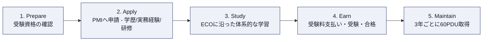
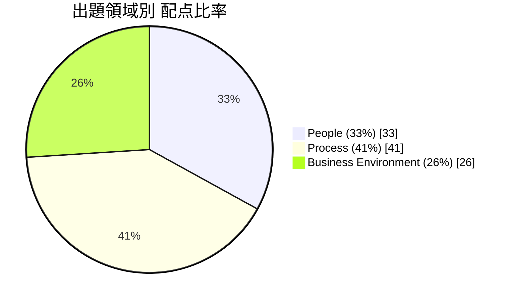
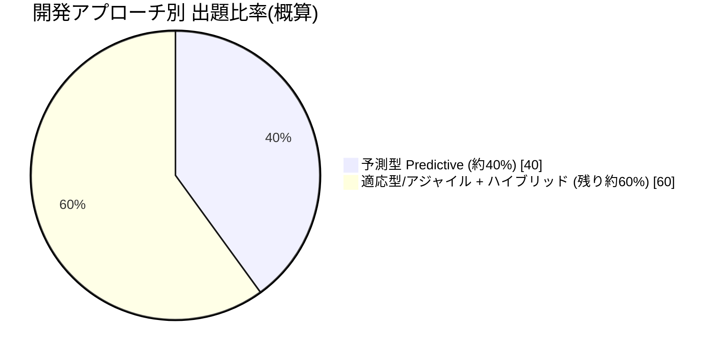
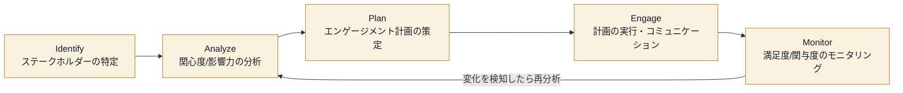
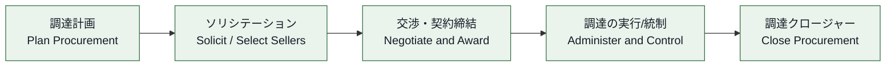
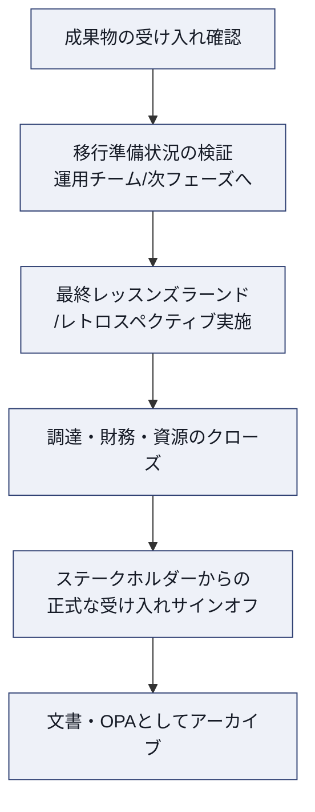
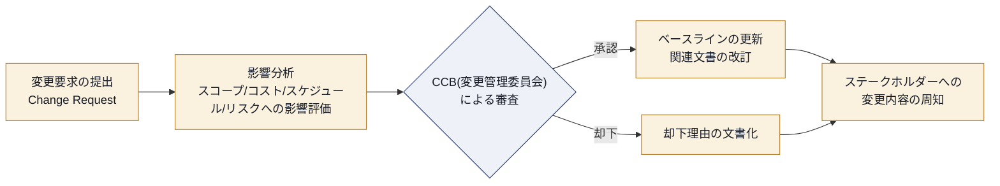
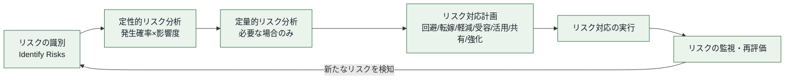
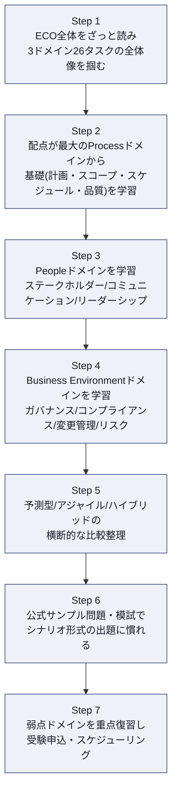

# PMP®(Project Management Professional)認定試験 完全攻略ガイド
## 初学者向け ステップバイステップ解説 — 2026年7月改定 Exam Content Outline (ECO) 準拠

---

## 0. このガイドについて

このガイドは、PMI(Project Management Institute)が公開している以下の一次情報源を基に、PMP®認定試験の出題内容・受験資格・ベストプラクティスを初学者向けに整理・解説したものです。原文の要約・翻訳・独自解説であり、PMI公式資料そのものではありません。正確な最新情報は必ず一次情報源(巻末「12. 参考文献・出典一覧」)を参照してください。

- 対象読者: PMP受験を検討し始めたばかりの初学者、プロジェクトマネジメント未経験〜浅い経験者
- ベース資料: `Project Management Professional (PMP)® Examination Content Outline – 2026`(2026年7月改定版)、PMI公式PMP認定ページ
- 表記方針: 日本語解説の中で、試験に頻出する英語の専門用語(Domain, Task, Enabler, ECO, CCB, EVM など)はそのまま併記します

> **重要な注意**: PMPの出題内容(ECO)は定期的に改定されます。本ガイドは2026年7月改定版を基にしていますが、受験前に必ずPMI公式サイトで最新版を確認してください。

---

## 1. PMP資格とは何か

PMP®(Project Management Professional)は、PMIが認定する、プロジェクトを主導した3年以上の実務経験を持つ人向けの専門資格です。特定の業界・地域・開発手法(予測型/アジャイル/ハイブリッド)に縛られず、「人」「プロセス」「ビジネス環境」の3つの側面からプロジェクトを主導する能力を証明します。

PMI公式ページによると、PMP保持者は以下のような特徴を持つとされています。

| 指標 | 内容 |
|---|---|
| 保有者数 | 世界で170万人以上(プロジェクトマネジメント関連資格として世界最多) |
| 米国での年収中央値 | 135,000ドル |
| 給与プレミアム | 非保持者と比較して中央値で17%高い給与を報告 |
| 対応する開発アプローチ | 予測型(Predictive)、適応型/アジャイル(Adaptive/Agile)、ハイブリッド(Hybrid)のすべて |

出典: PMI公式 PMP認定ページ(https://www.pmi.org/certifications/project-management-pmp)

### 1.1 CAPM®との違い

CAPM®(Certified Associate in Project Management)は実務経験を問わない入門資格である一方、PMPはプロジェクトを「主導・指揮した」実務経験(3〜5年、学歴により変動)を必須とする、より上位の資格です。CAPM保持者はPMP申請時に35時間の商業研修要件が免除されるという優遇措置があります(詳細は3.3節)。

---

## 2. PMP取得までのロードマップ

PMI公式ページは、PMP取得までの流れを5つのステップで示しています。

各ステップの要点:

1. **Prepare(準備)**: 自分の学歴・実務経験がどの受験資格パターンに該当するかを確認する
2. **Apply(申請)**: PMIオンライン申請システムで学歴・35時間の研修・プロジェクト経験(月単位)を記録する
3. **Study(学習)**: ECOのDomain(People / Process / Business Environment)ごとにタスクとイネイブラーを学習する
4. **Earn(取得)**: 受験料を支払い、Pearson VUEのテストセンターまたはオンライン監督試験で180問・240分の試験を受ける
5. **Maintain(維持)**: 3年間の更新サイクルごとに60 PDU(Professional Development Unit)を取得し、更新費用を支払う

出典: PMI公式 PMP認定ページ「Your Path to PMP Certification」(https://www.pmi.org/certifications/project-management-pmp)

---

## 3. 受験資格要件(Eligibility Requirements)

PMP認定試験を受験するには、以下の「学歴 × 実務経験」の4パターンのいずれか **1つ** を満たし、かつ35時間の商業研修(Project Professional Training)を修了している必要があります。

### 3.1 学歴・実務経験の4パターン

| 学歴パターン | 必要な非重複プロジェクトマネジメント実務経験(過去10年以内) |
|---|---|
| 高校卒業(またはGED等の中等教育修了相当) | 60ヶ月/5年 |
| 準学士号・専門学校卒業等(EQF Level 5相当) | 48ヶ月/4年 |
| 学士号以上(EQF Level 6相当) | 36ヶ月/3年 |
| PMI GAC(Global Accreditation Center)認定プログラムの学士号/大学院学位 | 24ヶ月/2年 |

出典: PMP Examination Content Outline – 2026(pp.13-14)、PMI Global Accreditation Center(https://www.pmi.org/global-accreditation-center/)

> **2026年改定のポイント**: 学歴要件が国・地域ごとの資格枠組み(EQFやISCEDなど)にマッピングされる形に明確化されました。学歴証明書にレベル記載がない場合、監査時には国の資格登録簿の抜粋、発行機関の公式声明、または認定機関による正式な評価のいずれかの提出が求められます。

### 3.2 商業研修(35時間)要件

学歴・実務経験に加えて、ECOの内容に沿った **35時間** の商業研修(Project Professional Training)を修了している必要があります。以下のいずれかの提供元からの研修が対象です。

- PMI公認研修パートナー(ATP: Authorized Training Partner)
- 中国登録教育プロバイダー(REP)
- PMI GACプログラム
- 認定高等教育機関のプロジェクトマネジメント関連講座
- 雇用主/企業主催のプログラム
- 研修会社・コンサルタントによるコース
- 修了時評価を含む自己学習型オンデマンド講座

**重要**: 書籍のみ・模試のみの学習は、35時間の商業研修としては認められません。

出典: PMP Examination Content Outline – 2026(pp.14-15)、PMI公認研修パートナー検索(https://www.pmi.org/learning/authorized-training-partners)

### 3.3 CAPM®保持者への優遇措置

アクティブなCAPM®認定を保持しており、学歴・実務経験要件を満たしている場合、35時間の研修要件のドキュメント提出が **免除** されます(CAPM保持自体が35時間分の研修クレジットとして扱われます)。

出典: PMP Examination Content Outline – 2026(p.15)、CAPM認定ページ(https://www.pmi.org/certifications/certified-associate-capm)

### 3.4 プロジェクト経験の数え方(重複月のカウント方法)

実務経験は「プロジェクト数」ではなく「月数」で数えます。同じ期間に複数のプロジェクトを並行してリードしていた場合、その重複期間を二重にカウントすることはできません。例えば、1月〜3月にプロジェクトI、2月〜5月にプロジェクトIIをリードしていた場合、合計は「1月〜5月の5ヶ月間」としてカウントします。

出典: PMP Examination Content Outline – 2026(p.16)

### 3.5 申請時のベストプラクティス

- **学校のプロジェクトや個人的な活動は対象外**: 学業目的のプロジェクト、個人的なイベント企画、自宅のリフォームなどは「プロフェッショナルな設定」での経験と認められません
- **ルーティン業務は除外する**: 定型的な運用・管理業務のみのエントリーは記載しないこと(監査対象になりやすい)
- **監査に備えて記録を保管する**: 学歴証明・研修修了証・プロジェクトの詳細記録は、監査に選ばれた場合に提出できるよう事前に整理しておく
- **要件を満たさない場合はCAPMを検討する**: PMI自身も、要件を満たさない場合はまずCAPM®取得を推奨している

出典: PMP Examination Content Outline – 2026(pp.13-17)

---

## 4. 試験の全体像

### 4.1 試験形式

| 項目 | 内容 |
|---|---|
| 総問題数 | 180問 |
| 採点対象問題数 | 170問 |
| プレテスト(採点対象外)問題数 | 10問(将来の問題の妥当性検証用。ランダムに配置され、どれがプレテストかは受験者にはわからない) |
| 制限時間 | 240分(4時間) |
| 休憩 | 10分の休憩が2回(1回目はケーススタディセクション後、2回目は独立問題セクションの中間付近) |
| 再受験可能回数 | 1年間の受験資格期間内に最大3回まで |
| 出題領域構成比 | People 33% / Process 41% / Business Environment 26% |

出典: PMP Examination Content Outline – 2026(pp.17-21)

> **注意**: 休憩を開始すると、それ以前のセクションの問題には戻れません。

### 4.2 出題形式(2026年7月改定で新設された形式を含む)

| 出題形式 | 説明 | 提供形式 |
|---|---|---|
| Case/Scenario(新形式) | 詳細なシナリオ(グラフ・チャートを含む場合あり)を提示し、それに基づく複数の設問に回答する | 全形式(CBT/PBT/OPT)で利用可能 |
| Graphic-Based Question(新形式) | チャート・グラフ・図表・画像などの視覚情報を読み取って解答する | 全形式で利用可能 |
| Enhanced Matching | 画像や図を用いたマッチング問題。項目をドラッグ&ドロップして図の特定位置に配置する形式を含む | CBTのみ |
| Multiple-Choice Single Response | 選択肢の中から正解を1つ選ぶ | 全形式 |
| Multiple-Response | 選択肢の中から正解を複数選ぶ | 全形式 |
| Point and Click | 画像上の隠れたホットスポット領域をクリックして解答する | CBTのみ |
| Matching | 複数のリストから項目をペアリングする | CBTのみ |
| Pull-down List | ドロップダウンリストから正解を選択する | CBTのみ |

出典: PMP Examination Content Outline – 2026(pp.18-20)

### 4.3 出題領域(Domain)と配点比率

出典: PMP Examination Content Outline – 2026(p.5)

### 4.4 開発アプローチ(予測型 / アジャイル / ハイブリッド)の出題比率

ECOは、Domainのどこか特定の場所に開発アプローチが偏っているわけではなく、People・Process・Business Environmentの **すべてのDomainを横断して** 予測型・適応型/アジャイル・ハイブリッドの3つの働き方が出題されると明記しています。

出典: PMP Examination Content Outline – 2026(p.5)「Approximately 40% of the items will represent predictive project management approaches, whereas the remaining 60% will be divided between adaptive/agile and hybrid management approaches.」の記述に基づく(正確な内訳は試験フォームにより変動)

### 4.5 受験方法と再受験ポリシー

| 受験方法 | 内容 |
|---|---|
| CBT(Computer-Based Testing) | Pearson VUEのテストセンターで受験。PMI推奨の方式(https://www.pearsonvue.com/us/en/pmi.html) |
| PBT(Paper-Based Testing) | 中国本土のみ、ATA test servicesが提供 |
| OPT(Online Proctored Test) | 自宅等からオンライン監督で受験。事前のシステムチェックが必要(https://www.pearsonvue.com/us/en/pmi/onvue.html) |

**再受験ポリシー**: 1回目の受験に不合格の場合、1年間の受験資格期間内であれば最大3回まで再受験できます。3回不合格になった場合、最後の受験日から1年間は再申請できません(その間も他のPMI資格には申請可能)。1年の受験資格期間が切れた場合(3回受験していなくても)、再申請が必要ですが、この場合は待機期間はありません。

出典: PMP Examination Content Outline – 2026(p.21)、試験配慮に関するページ(https://www.pmi.org/certifications/certification-resources/accommodations)

---

## 5. Domain I: People(33%)

### Domainの狙い

Peopleドメインは、プロジェクトマネージャーが「人」を通じて成果を出す能力 — チームリーダーシップ、対立管理、ステークホルダーとの信頼構築、コミュニケーション — を測定します。ECOのタスク構造説明にあるとおり、PMIは近年のリサーチ(*Maximizing Project Success* レポート)を踏まえ、プロジェクトの成功を「スケジュール・予算・スコープの達成」だけでなく「ステークホルダーにとって、その労力と費用に見合う価値を提供できたか」という、より広い視点で再定義しています。Peopleドメインの多くのタスクはこの価値観と直結しています。

出典: PMP Examination Content Outline – 2026(p.6)

---

#### Task 1: 共通ビジョンの構築(Develop a common vision)

**このタスクが測る能力**: プロジェクトマネージャーが、キーステークホルダーと共有された「なぜこのプロジェクトをやるのか」というビジョンを確立し、維持し続ける能力です。ビジョンは一度作って終わりではなく、プロジェクトの進行に伴って形骸化しないよう継続的に発信・更新する必要があります。

**主な行動要素(Enablers)**:
- キーステークホルダーとの間で共有ビジョンを確立する
- 共有ビジョンを浸透させる(プロモート)
- ビジョンを最新の状態に保つ
- ビジョンの誤解が生じている状況を分解し、根本原因を特定する

**ベストプラクティス**:
- プロジェクト憲章(Project Charter)策定の段階でスポンサーと合意した「ビジネスケース」「期待される成果」を、チーム全員が繰り返し参照できる形(1枚もののビジョンステートメントなど)に落とし込む
- キックオフミーティングだけでなく、マイルストーンごとにビジョンを再確認する場を設ける(アジャイルではスプリントレビューやプロダクトビジョンの再共有がこれに相当する)
- ビジョンの誤解が疑われる場合は、表面的な意見の相違ではなく「なぜそう解釈したのか」を掘り下げるルートコーズ分析を行う

出典: PMBOK® Guide(https://www.pmi.org/standards/pmbok)、PMP Examination Content Outline – 2026(p.7)

---

#### Task 2: 対立の管理(Manage conflicts)

**このタスクが測る能力**: チーム内・ステークホルダー間で発生する対立(コンフリクト)を、発生源を特定した上で適切な解決戦略を選び、実行する能力です。

**主な行動要素(Enablers)**:
- 対立の発生源を特定する
- 対立の文脈を分析する
- 合意された解決戦略を実行する
- チームや外部ステークホルダーに対立管理の原則を伝える
- グラウンドルール(共通のルール)が守られる環境を確立する
- グラウンドルール違反を是正する

**ベストプラクティス**:
- 対立の背景(価値観の相違か、リソース不足か、スケジュールのプレッシャーかなど)を切り分けてから対応方針を決める
- 対立解決のアプローチ(協力/妥協/強制/回避/緩和)を状況に応じて使い分ける — 例えば技術的な優先度をめぐる対立は「協力」で根本解決を目指し、些細な意見の相違は「妥協」で時間を節約する、といった判断が求められる
- チーム憲章(Team Charter)でグラウンドルールを明文化し、違反時の対応プロセスをあらかじめ合意しておく

出典: PMBOK® Guide(https://www.pmi.org/standards/pmbok)、PMI Talent Triangle - Power Skills(https://www.pmi.org/certifications/certification-resources/maintain/talent-triangle)

---

#### Task 3: プロジェクトチームのリード(Lead the project team)

**このタスクが測る能力**: チームへの期待値設定、権限委譲(エンパワーメント)、問題解決、チームの多様な経験・スキル・視点のサポート、状況に応じたリーダーシップスタイルの選択、明確な役割と責任の設定など、チームリーダーとしての総合力を測定します。

**主な行動要素(Enablers)**:
- チームレベルでの期待値を設定する
- チームをエンパワーする
- 問題を解決する
- チームの声を代弁する
- チームの多様な経験・スキル・視点をサポートする
- 適切なリーダーシップスタイルを判断する
- チーム内の明確な役割と責任を確立する

**ベストプラクティス**:
- RACIマトリクス(Responsible / Accountable / Consulted / Informed)を使い、タスクごとの役割と責任を可視化する
- サーバントリーダーシップ(奉仕型リーダーシップ)は、特にアジャイル/自己組織化チームで推奨されるスタイルであり、Agile Practice Guideでも中心的な考え方として扱われている
- チームの成熟度(Tuckmanの「形成期・混乱期・統一期・機能期」モデルなど)に応じてリーダーシップスタイル(指示型→コーチ型→支援型→委任型)を切り替える

出典: PMBOK® Guide(https://www.pmi.org/standards/pmbok)、Agile Practice Guide(https://www.pmi.org/standards/agile)

---

#### Task 4: ステークホルダーの関与(Engage stakeholders)

**このタスクが測る能力**: ステークホルダーを特定し、分析し、それぞれのニーズに合わせてコミュニケーションを調整し、ステークホルダーエンゲージメント計画を実行し、信頼を構築してプロジェクト目標達成に向けて影響力を発揮する能力です。

**主な行動要素(Enablers)**:
- ステークホルダーを特定する
- ステークホルダーを分析する
- コミュニケーションを分析しステークホルダーのニーズに合わせて調整する
- ステークホルダーエンゲージメント計画を実行する
- ステークホルダーのニーズ・期待とプロジェクト目標の整合を最適化する
- 信頼を構築し、ステークホルダーに影響を与えてプロジェクト目標達成を促す

以下は、ステークホルダーとの関わりを継続的なサイクルとして捉えたプロセスです。

**ベストプラクティス**:
- 「権力・関心度グリッド(Power/Interest Grid)」でステークホルダーを4象限(監視/情報提供/満足維持/密接管理)に分類し、労力の配分を最適化する
- ステークホルダーレジスター(Stakeholder Register)を一度作って終わりにせず、プロジェクトの局面が変わるたびに更新する
- 影響力のあるステークホルダーには「伝える」だけでなく「巻き込む」双方向のコミュニケーションを設計する

出典: PMBOK® Guide(https://www.pmi.org/standards/pmbok)、PMP Examination Content Outline – 2026(p.7)

---

#### Task 5: ステークホルダーの期待の整合(Align stakeholder expectations)

**このタスクが測る能力**: ステークホルダーを分類し、それぞれの期待値を特定した上で、期待値の食い違いを解消するための議論を進行し、メンタリングの機会を組織・活用する能力です。

**主な行動要素(Enablers)**:
- ステークホルダーを分類する
- ステークホルダーの期待値を特定する
- 期待値を整合させるための議論をファシリテートする
- メンタリングの機会を組織し、行動に移す

**ベストプラクティス**:
- 期待値の食い違いは「サイレント」なまま進行しやすいため、定期的な1on1やステークホルダーインタビューで早期に顕在化させる
- ファシリテーションでは、対立する期待値そのものではなく「その期待の裏にある目的・懸念」を掘り下げて共通点を探す
- 経験豊富なメンバーと若手・新規参画者をペアリングするメンタリング機会を意図的に設計し、暗黙知の共有と期待値のすり合わせを同時に進める

出典: PMBOK® Guide(https://www.pmi.org/standards/pmbok)、PMI Talent Triangle(https://www.pmi.org/certifications/certification-resources/maintain/talent-triangle)

---

#### Task 6: ステークホルダーの期待の管理(Manage stakeholder expectations)

**このタスクが測る能力**: 内部・外部の顧客の期待を特定し、それに沿ってアウトカムを整合・維持し、満足度や期待の変化を継続的にモニタリングして対応する能力です。

**主な行動要素(Enablers)**:
- 内部・外部顧客の期待を特定する
- 内部・外部顧客の期待にアウトカムを整合させ、維持する
- 内部・外部顧客の満足度/期待をモニタリングし、必要に応じて対応する

**ベストプラクティス**:
- 顧客満足度は主観的な印象ではなく、NPS(Net Promoter Score)や定期的なステークホルダーサーベイなど測定可能な指標で継続的に把握する
- 期待値のズレが検知された時点で、原因(スコープの誤解か、進捗の可視性不足か)を切り分けて対応する
- アジャイル環境では、スプリントレビューでのプロダクトオーナー/顧客からの直接フィードバックが期待値管理の中心的な仕組みになる

出典: Agile Practice Guide(https://www.pmi.org/standards/agile)、PMBOK® Guide(https://www.pmi.org/standards/pmbok)

---

#### Task 7: 知識移転の促進(Help ensure knowledge transfer)

**このタスクが測る能力**: プロジェクトにとって重要な知識を特定し、収集し、その知識がチーム内・組織内で移転される環境を醸成する能力です。ECOの本文中でも例示として取り上げられているタスクです。

**主な行動要素(Enablers)**:
- プロジェクトにとって重要な知識を特定する
- 知識を収集する
- 知識移転のための環境を醸成する

**ベストプラクティス**:
- レッスンズラーンド(Lessons Learned)を「プロジェクト終了時にまとめて書く」のではなく、フェーズやスプリントの節目ごとに継続的に記録する
- 暗黙知(ベテランの勘所やノウハウ)は文書化だけでなく、ペアワークやシャドーイングなど「一緒にやる」形での移転を組み合わせる
- ナレッジをOPA(組織のプロセス資産)として組織のリポジトリに蓄積し、将来のプロジェクトが再利用できる形にする

出典: PMP Examination Content Outline – 2026(p.6, タスク構造の例示として掲載)、PMBOK® Guide(https://www.pmi.org/standards/pmbok)

---

#### Task 8: コミュニケーションの計画と管理(Plan and manage communication)

**このタスクが測る能力**: コミュニケーション戦略の定義、透明性とコラボレーションの促進、フィードバックループの確立、レポーティング要件の理解、スポンサー/ステークホルダーの期待に沿ったレポート作成、ガバナンスプロセスのサポートまでを含む、包括的なコミュニケーション管理能力です。

**主な行動要素(Enablers)**:
- コミュニケーション戦略を定義する
- 透明性とコラボレーションを促進する
- フィードバックループを確立する
- レポーティング要件を理解する
- スポンサー/ステークホルダーの期待に沿ったレポートを作成する
- レポーティングとガバナンスプロセスをサポートする

**ベストプラクティス**:
- コミュニケーションマネジメント計画では「誰に・何を・いつ・どの手段で・誰が」伝えるかをマトリクス化する
- レポートは受け手の役割(経営層向けはサマリーとKPI、実務チーム向けは詳細なバーンダウン/進捗)に応じて粒度を変える
- フィードバックループは一方向の報告で終わらせず、受け手からの質問・懸念を吸い上げる仕組み(定例会の質疑時間、非同期コメントなど)を組み込む

出典: PMBOK® Guide(https://www.pmi.org/standards/pmbok)、PMI Talent Triangle(https://www.pmi.org/certifications/certification-resources/maintain/talent-triangle)

---

## 6. Domain II: Process(41%)

### Domainの狙い

Processドメインは、出題比率41%と3ドメインの中で最大のウェイトを占めます。統合マネジメント計画の策定からスコープ・資源・調達・財務・品質・スケジュール・進捗評価・クロージャーまで、プロジェクトを「実行し、完了させる」ための一連のプロセスに関する実務能力を測定します。開発アプローチ(予測型/アジャイル/ハイブリッド)を問わず、これらのプロセスの目的と使い分けを理解していることが問われます。

出典: PMP Examination Content Outline – 2026(pp.9-11)

---

#### Task 1: 統合プロジェクトマネジメント計画の策定とデリバリー計画(Develop an integrated project management plan and plan delivery)

**このタスクが測る能力**: プロジェクトの複雑さ・規模を評価し、適切な開発アプローチ(予測型・アジャイル・ハイブリッド)を推奨し、統合されたプロジェクトマネジメント計画を作成・維持する能力です。2026年改定では「サステナビリティ」を含む重要情報要件の判断が明示的に追加されています。

**主な行動要素(Enablers)**:
- プロジェクトのニーズ・複雑さ・規模を評価する
- プロジェクト開発アプローチ(予測型/アジャイル/ハイブリッド)を推奨する
- 重要な情報要件(例: サステナビリティ)を決定する
- プロジェクト実行戦略を推奨する
- 統合プロジェクトマネジメント計画を作成する
- 作業工数と資源要件を見積もる
- 統合された計画の依存関係・ギャップ・継続的なビジネス価値を評価する
- 統合プロジェクトマネジメント計画を維持する
- データを収集・分析し、根拠あるプロジェクト意思決定を行う

**ベストプラクティス**:
- 開発アプローチの選定は「不確実性(要求が明確か)」と「変動性(解の合意度)」の2軸で判断する。要求もソリューションも明確なら予測型、両方が不透明ならアジャイル、一部が明確なら成果物やフェーズ単位でアプローチを混ぜるハイブリッドを検討する
- 統合マネジメント計画は各サブ計画(スコープ・スケジュール・コスト・品質・資源・コミュニケーション・リスク・調達・ステークホルダー計画)を独立に作らず、依存関係を意識して整合させる
- 計画は一度作って固定するのではなく、段階的詳細化(Progressive Elaboration)の考え方で継続的に更新する

出典: PMBOK® Guide(https://www.pmi.org/standards/pmbok)、Agile Practice Guide(https://www.pmi.org/standards/agile)、PMP Examination Content Outline – 2026(p.9)

---

#### Task 2: プロジェクトスコープの策定と管理(Develop and manage project scope)

**このタスクが測る能力**: スコープを定義し、ステークホルダーの合意を取り付け、スコープを分解する能力です。

**主な行動要素(Enablers)**:
- スコープを定義する
- プロジェクトスコープについてステークホルダーの合意を得る
- スコープを分解する

**ベストプラクティス**:
- 予測型ではWBS(Work Breakdown Structure、作業分解構成図)で成果物ベースにスコープを階層分解し、WBS辞書で各要素の完了基準を明文化する
- アジャイルではプロダクトバックログとユーザーストーリーでスコープを段階的に分解し、優先順位付けを継続的に見直す
- スコープの合意は口頭ではなく、スコープ記述書やプロダクトバックログへのサインオフという形で記録に残す

出典: PMBOK® Guide(https://www.pmi.org/standards/pmbok)、Agile Practice Guide(https://www.pmi.org/standards/agile)

---

#### Task 3: 価値に基づくデリバリーの促進(Help ensure value-based delivery)

**このタスクが測る能力**: キーステークホルダーと共に価値の構成要素を特定し、価値とフィードバックに基づいて作業を優先順位付けし、価値を段階的に届ける機会を評価する能力です。前述のとおり、2026年改定ECOはPMIの調査『Maximizing Project Success』を反映し、プロジェクト成功の定義を「価値の提供」に寄せています。

**主な行動要素(Enablers)**:
- キーステークホルダーと共に価値の構成要素を特定する
- 価値とステークホルダーのフィードバックに基づいて作業を優先順位付けする
- 価値を段階的に届ける機会を評価する
- プロジェクトを通じてビジネス価値を検証する
- 便益を追跡する測定システムが整っていることを確認する
- 価値を実証するためのデリバリーオプションを評価する

**ベストプラクティス**:
- MoSCoW法(Must/Should/Could/Won't)やWSJF(Weighted Shortest Job First)など、価値ベースの優先順位付け手法を活用する
- 「アウトプット(作ったもの)」ではなく「アウトカム(もたらした成果)」を測定するベネフィット追跡指標を設計する
- インクリメンタルデリバリー(MVPやリリースの分割)により、早期に価値を届けフィードバックを得る機会を最大化する

出典: Agile Practice Guide(https://www.pmi.org/standards/agile)、PMP Examination Content Outline – 2026(p.6, p.9)

---

#### Task 4: 資源の計画と管理(Plan and manage resources)

**このタスクが測る能力**: 要求事項に基づいて資源を定義・計画し、資源のニーズと可用性を管理・最適化する能力です。

**主な行動要素(Enablers)**:
- 要求事項に基づいて資源を定義・計画する
- 資源のニーズと可用性を管理・最適化する

**ベストプラクティス**:
- 資源ヒストグラム(Resource Histogram)で稼働の山谷を可視化し、資源平準化(Leveling)や資源円滑化(Smoothing)で過負荷を調整する
- チームメンバーのスキルだけでなく可用性(他プロジェクトとの兼務状況)も含めて資源計画を立てる
- アジャイルチームでは「専属・安定したチーム(Stable Team)」を維持する方が、都度アサインを変えるより生産性が高いとされる

出典: PMBOK® Guide(https://www.pmi.org/standards/pmbok)、Agile Practice Guide(https://www.pmi.org/standards/agile)

---

#### Task 5: 調達の計画と管理(Plan and manage procurement)

**このタスクが測る能力**: 調達の計画、調達マネジメント計画の実行、契約タイプの選定、サプライヤーのパフォーマンス評価、契約合意の目的達成確認、交渉への参加、交渉戦略の決定、サプライヤーと契約の管理など、調達プロセス全体を扱う能力です。

**主な行動要素(Enablers)**:
- 調達を計画する
- 調達マネジメント計画を実行する
- 望ましい契約タイプを選定する
- ベンダーのパフォーマンスを評価する
- 調達合意の目的が満たされていることを確認する
- 合意の交渉に参加する
- 交渉戦略を決定する
- サプライヤーと契約を管理する
- 調達戦略を計画・管理する
- デリバリーソリューションを策定する

調達プロセスは、一般的に以下のようなライフサイクルで進行します。

**ベストプラクティス**:
- 契約タイプはリスク分担で選ぶ: 要件が明確なら**FFP(Firm Fixed Price、確定固定価格)**、要件が不確実で工数ベースなら**T&M(Time and Materials)**、開発コストが読みにくい研究開発案件なら**CPFF(Cost Plus Fixed Fee)**のように、プロジェクトの不確実性に応じて使い分ける
- ベンダー評価は契約締結後も継続的に行い(SLA遵守率、納期遵守率など)、評価結果を将来の調達判断にフィードバックする
- 交渉戦略は自社の代替案(BATNA: Best Alternative to a Negotiated Agreement)を事前に明確化してから臨む

出典: PMBOK® Guide(https://www.pmi.org/standards/pmbok)、PMP Examination Content Outline – 2026(p.9)

---

#### Task 6: 財務の計画と管理(Plan and manage finance)

**このタスクが測る能力**: プロジェクトの財務ニーズの分析、リスク・コンティンジェンシーの財務的配分の定量化、プロジェクトライフサイクルを通じた支出追跡計画、財務レポーティング計画、将来の財務課題の予測、財務差異のモニタリングとガバナンスプロセスとの連携、財務準備金の管理までを扱います。

**主な行動要素(Enablers)**:
- プロジェクトの財務ニーズを分析する
- リスクとコンティンジェンシーの財務的配分を定量化する
- プロジェクトライフサイクル全体の支出追跡を計画する
- 財務レポーティングを計画する
- 将来の財務上の課題を予測する
- 財務差異をモニタリングし、ガバナンスプロセスと連携する
- 財務準備金を管理する

**ベストプラクティス**:
- コストベースライン(承認済み予算計画)を設定し、実績との差異をEVM(Earned Value Management)で定量的に把握する — 代表的な指標はCV(Cost Variance)、CPI(Cost Performance Index)
- コンティンジェンシー予備(既知の未知リスク用)とマネジメント予備(未知の未知用)を明確に区別して管理する
- 財務差異は発見してから報告するのではなく、閾値(例: CPIが0.9を下回ったら)を事前に定義し、ガバナンスへのエスカレーション基準を明文化しておく

出典: PMBOK® Guide(https://www.pmi.org/standards/pmbok)、PMP Examination Content Outline – 2026(p.10)

---

#### Task 7: 成果物の品質計画と最適化(Plan and optimize quality of products/deliverables)

**このタスクが測る能力**: 成果物の品質要求事項の収集、品質プロセス/ツールの計画、品質マネジメント計画の実行、規制遵守の確保、CoQ(品質コスト)とサステナビリティの管理、継続的な品質レビュー、継続的改善の実装までを扱います。

**主な行動要素(Enablers)**:
- プロジェクト成果物の品質要求事項を収集する
- 品質プロセスとツールを計画する
- 品質マネジメント計画を実行する
- 規制遵守を確保する
- CoQ(Cost of Quality)とサステナビリティを管理する
- 継続的な品質レビューを実施する
- 継続的改善を実装する

**ベストプラクティス**:
- CoQは「適合コスト(予防・評価)」と「不適合コスト(内部/外部の失敗コスト)」に分け、予防への投資が下流の手戻りコストを削減することを意識する
- 品質は最終検査だけで担保せず、プロセスの早い段階での品質作り込み(Quality by Design、アジャイルの「Definition of Done」など)を重視する
- 品質メトリクスは定期的にレビューし、パレート分析や特性要因図(フィッシュボーン図)で不具合の根本原因を特定して継続的改善につなげる

出典: PMBOK® Guide(https://www.pmi.org/standards/pmbok)、Agile Practice Guide(https://www.pmi.org/standards/agile)

---

#### Task 8: スケジュールの計画と管理(Plan and manage schedule)

**このタスクが測る能力**: 選定した開発アプローチに基づくスケジュール準備、他プロジェクト/オペレーションとの調整、プロジェクトタスク(マイルストーン・依存関係・ストーリーポイント)の見積もり、ベンチマークと過去実績データの活用、スケジュール作成・ベースライン設定・実行・差異分析までを扱う、実務上非常に幅広いタスクです。

**主な行動要素(Enablers)**:
- 選定した開発アプローチに基づいてスケジュールを準備する
- 他プロジェクト/オペレーションと調整する
- プロジェクトタスク(マイルストーン、依存関係、ストーリーポイント)を見積もる
- ベンチマークと過去実績データを活用する
- プロジェクトスケジュールを作成する
- プロジェクトスケジュールをベースライン化する
- スケジュールマネジメント計画を実行する
- スケジュール差異を分析する

**ベストプラクティス**:
- 予測型ではクリティカルパス法(CPM: Critical Path Method)でフロート(余裕時間)がゼロのタスク列を特定し、そこに集中的にリソースを配分する
- アジャイルではベロシティ(1スプリントあたりの完了ストーリーポイント数)の実績を蓄積し、将来のイテレーション計画に活用する
- スケジュール差異はSV(Schedule Variance)やSPI(Schedule Performance Index)などEVM指標で定量化し、感覚ではなくデータで遅延リスクを判断する

出典: PMBOK® Guide(https://www.pmi.org/standards/pmbok)、Agile Practice Guide(https://www.pmi.org/standards/agile)

---

#### Task 9: プロジェクト状況の評価(Evaluate project status)

**このタスクが測る能力**: プロジェクトメトリクスの開発・分析・照合、必要なアーティファクト(成果物・記録物)の特定とカスタマイズ、アーティファクトの作成・レビュー・更新・文書化の確保、進捗の評価、メトリクスの測定・分析・更新、プロジェクト状況のコミュニケーション、アーティファクト管理の有効性の継続的評価までを扱います。

**主な行動要素(Enablers)**:
- プロジェクトメトリクス・分析・照合を開発する
- 必要なアーティファクトを特定し、テーラリング(調整)する
- アーティファクトが作成・レビュー・更新・文書化されるようにする
- アーティファクトへのアクセス可能性を確保する
- 現在の進捗を評価する
- プロジェクトメトリクスを測定・分析・更新する
- プロジェクト状況をコミュニケーションする
- アーティファクト管理の有効性を継続的に評価する

**ベストプラクティス**:
- アーティファクト(バーンダウンチャート、ダッシュボード、ステータスレポート等)は「作ること」自体を目的化せず、意思決定に使われているかを定期的に見直し、使われていないものは廃止する
- ステータスレポートは「進捗(何が終わったか)」だけでなく「今後のリスクと必要な意思決定」をセットで報告する
- アジャイルではバーンダウン/バーンアップチャートとベロシティトレンドを組み合わせ、予測型ではEVMのSPI/CPIトレンドを用いて、いずれも「トレンド」で状況を判断する

出典: PMBOK® Guide(https://www.pmi.org/standards/pmbok)、PMP Examination Content Outline – 2026(p.10)

---

#### Task 10: プロジェクトクロージャーの管理(Manage project closure)

**このタスクが測る能力**: プロジェクト完了に対するステークホルダーの承認取得、プロジェクト/フェーズを正常にクローズする基準の決定、移行(運用チームや次フェーズへの移行など)の準備状況の検証、プロジェクト/フェーズをクローズするための活動(最終レッスンズラーンド、レトロスペクティブ、調達・財務・資源のクローズなど)の完了までを扱います。

**主な行動要素(Enablers)**:
- プロジェクト完了に対するステークホルダーの承認を得る
- プロジェクト/フェーズを正常にクローズする基準を決定する
- 移行(例: 運用チームや次フェーズへ)の準備状況を検証する
- プロジェクト/フェーズをクローズするための活動を完了する(最終レッスンズラーンド、レトロスペクティブ、調達、財務、資源など)

クロージャーは、以下のような流れで整理すると抜け漏れを防ぎやすくなります。

**ベストプラクティス**:
- クロージャーの基準(Definition of Done at project level)はプロジェクト開始時点で定義し、終盤で場当たり的に決めない
- 調達のクローズでは、契約上の義務(検収、支払い、保証条件)がすべて満たされたことを文書で確認してから正式クローズする
- レッスンズラーンドは組織のナレッジベース(OPA)に登録し、将来のプロジェクトの見積もり精度・リスク識別に活用できる形にする

出典: PMBOK® Guide(https://www.pmi.org/standards/pmbok)、PMP Examination Content Outline – 2026(p.10)

---

## 7. Domain III: Business Environment(26%)

### Domainの狙い

Business Environmentドメインは、プロジェクトを組織・外部環境の文脈の中に位置づける能力を測定します。ガバナンス、コンプライアンス、変更管理、障害・課題対応、リスク管理、継続的改善、組織変革の支援、外部環境変化への対応まで、「プロジェクトの外側」との接続を扱うタスク群です。

出典: PMP Examination Content Outline – 2026(pp.11-12)

---

#### Task 1: プロジェクトガバナンスの定義と確立(Define and establish project governance)

**このタスクが測る能力**: OPA(組織のプロセス資産)を活用して、プロジェクトの構造・ルール・手続き・レポーティング・倫理・ポリシーを記述・確立し、成功指標を定義し、ガバナンスのエスカレーションパスと閾値を明確化する能力です。

**主な行動要素(Enablers)**:
- OPAを活用してプロジェクトの構造・ルール・手続き・レポーティング・倫理・ポリシーを記述・確立する
- 成功指標を定義する
- ガバナンスのエスカレーションパスと閾値を明確にする

**ベストプラクティス**:
- ガバナンス構造(意思決定権限を持つのは誰か、どの階層で何を承認するか)はプロジェクト開始時点でRACIやガバナンス憲章として文書化する
- 成功指標はスケジュール・コスト・スコープだけでなく、ステークホルダーにとっての価値実現度を含めて定義する
- エスカレーションの閾値(例: コスト差異が◯%を超えたらスポンサーへ報告)を数値で事前合意しておくことで、判断の属人化を防ぐ

出典: PMBOK® Guide(https://www.pmi.org/standards/pmbok)、PMP Examination Content Outline – 2026(p.11)

---

#### Task 2: プロジェクトコンプライアンスの計画と管理(Plan and manage project compliance)

**このタスクが測る能力**: セキュリティ、健康・安全、サステナビリティ、規制遵守などのコンプライアンス要件を確認し、コンプライアンスカテゴリを分類し、コンプライアンスへの潜在的な脅威を判断し、コンプライアンスをサポートする手法を用い、非遵守の影響を分析し、必要なアプローチ・アクションを決定し、コンプライアンスの遵守度を測定する能力です。

**主な行動要素(Enablers)**:
- プロジェクトのコンプライアンス要件を確認する(例: セキュリティ、健康・安全、サステナビリティ、規制遵守)
- コンプライアンスカテゴリを分類する
- コンプライアンスへの潜在的な脅威を判断する
- コンプライアンスをサポートする手法を用いる
- 非遵守の影響を分析する
- コンプライアンス対応に必要なアプローチとアクションを決定する
- プロジェクトがコンプライアンスを満たしている度合いを測定する

**ベストプラクティス**:
- コンプライアンス要件は業界・地域ごとに異なるため、プロジェクト開始時に法務・コンプライアンス部門と要件一覧を確定し、要件トレーサビリティマトリクスで管理する
- 非遵守が発覚した場合の影響(罰金・信用失墜・プロジェクト停止リスク)を事前に定量化し、優先度判断の材料にする
- サステナビリティ関連のコンプライアンス(環境負荷、労働慣行など)は、2026年改定ECOでも明示的に言及されており、リスク・品質管理と統合して扱うのがベストプラクティスとされる

出典: PMP Examination Content Outline – 2026(p.11)、PMBOK® Guide(https://www.pmi.org/standards/pmbok)

---

#### Task 3: 変更の管理と統制(Manage and control changes)

**このタスクが測る能力**: 変更管理プロセスの実行、提案された変更のステータスのコミュニケーション、承認された変更のプロジェクトへの実装、変更を反映したプロジェクト文書の更新を扱う、PMP試験で頻出のタスクです。

**主な行動要素(Enablers)**:
- 変更管理プロセスを実行する
- 提案された変更のステータスをコミュニケーションする
- 承認された変更をプロジェクトに実装する
- 変更を反映してプロジェクト文書を更新する

統合変更管理(Integrated Change Control)の典型的な流れは以下のとおりです。

**ベストプラクティス**:
- すべての変更要求は、口頭や個別のチャットで処理せず、必ず正式な変更管理プロセス(変更ログへの記録)を通す
- CCB(Change Control Board)には、プロジェクトへの影響を評価できる適切な権限者(技術リード、QAリード、プロダクトオーナー等)を含める
- 承認された変更は、必ず影響を受けるすべての計画・文書(スコープ記述書、スケジュール、コストベースラインなど)に反映してから初めて「完了」とする — 変更の実装だけでベースライン更新を忘れるのはよくある失敗パターン
- アジャイル環境では、変更管理はスプリント境界での「バックログの再優先順位付け」という形で軽量化されるが、進行中のスプリントスコープの変更は原則避けるのが一般的な実務

出典: 『Managing Change in Organizations: A Practice Guide』(https://www.pmi.org/pmbok-guide-standards/practice-guides/change)、PMBOK® Guide(https://www.pmi.org/standards/pmbok)

---

#### Task 4: 障害の除去と課題管理(Remove impediments and manage issues)

**このタスクが測る能力**: 障害物(インペディメント)の影響評価、優先順位付けと強調表示、介入戦略の決定と適用、チームの障害・障壁・ブロッカーが対応され続けているかの継続的な再評価、リスクが課題に転化したことの認識、関連ステークホルダーとの協業による課題解決アプローチの決定を扱います。

**主な行動要素(Enablers)**:
- 障害物の影響を評価する
- 障害物を優先順位付けし、目立たせる
- 障害物を除去/最小化するための介入戦略を決定・適用する
- チームの障害・障壁・ブロッカーへの対応が継続されているか、繰り返し再評価する
- リスクが課題に転化したタイミングを認識する
- 関連ステークホルダーと協力して課題解決のアプローチを決定する

**ベストプラクティス**:
- 課題ログ(Issue Log)を維持し、リスクレジスターと分けて管理する — リスクは「起きるかもしれないこと」、課題は「すでに起きたこと」という区別を徹底する
- スクラムのデイリースタンドアップのように、障害物を毎日短いサイクルで可視化する仕組みを設けると、対応の遅れを防げる
- 障害物の除去は担当者(プロジェクトマネージャー、スクラムマスター等)の権限を超える場合、速やかにエスカレーションする基準をあらかじめ明確にしておく

出典: Agile Practice Guide(https://www.pmi.org/standards/agile)、PMBOK® Guide(https://www.pmi.org/standards/pmbok)

---

#### Task 5: リスクの計画と管理(Plan and manage risk)

**このタスクが測る能力**: リスクの識別・分析・監視・統制、リスクマネジメント計画の策定、リスクレジスターの維持(例: 不十分なITセキュリティ)、リスクマネジメント計画の実行(例: セキュリティリスクへの対応、サステナビリティリスクの管理)、リスクの影響状況のコミュニケーションを扱います。

**主な行動要素(Enablers)**:
- リスクを識別する
- リスクを分析する
- リスクを監視・統制する
- リスクマネジメント計画を策定する
- リスクレジスターを維持する(例: 不十分なITセキュリティ)
- リスクマネジメント計画を実行する(例: セキュリティやサステナビリティリスクへのリスク対応)
- プロジェクトへのリスク影響状況をコミュニケーションする

リスクマネジメントは、単発の作業ではなく継続的なライフサイクルとして扱われます。

**ベストプラクティス**:
- 発生確率×影響度のマトリクス(Probability-Impact Matrix)でリスクの優先順位を可視化し、対応リソースを高優先度リスクに集中させる
- 脅威(ネガティブリスク)への対応戦略は「回避・転嫁・軽減・受容」、好機(ポジティブリスク)への対応戦略は「活用・共有・強化・受容」というように、リスクの性質に応じた戦略を使い分ける
- リスクレジスターはプロジェクト開始時に作って終わりにせず、定例のリスクレビュー会で継続的に更新し、「起きたリスク」は課題ログへ移管する

出典: PMI『The Standard for Risk Management in Portfolios, Programs, and Projects』(https://www.pmi.org/standards/risk-management)、PMBOK® Guide(https://www.pmi.org/standards/pmbok)

---

#### Task 6: 継続的改善(Continuous improvement)

**このタスクが測る能力**: レッスンズラーンドの活用、継続的改善プロセスが更新され続けていることの確保、OPA(組織のプロセス資産)の更新を扱います。

**主な行動要素(Enablers)**:
- レッスンズラーンドを活用する
- 継続的改善プロセスが更新され続けていることを確保する
- OPAを更新する

**ベストプラクティス**:
- アジャイルのレトロスペクティブのように、定期的に「何がうまくいったか/何を改善すべきか」を振り返る場を予測型プロジェクトでも定例化する
- 改善のアイデアは出して終わりにせず、次のフェーズ/スプリントで実際に試すアクションアイテムとして追跡する
- 改善サイクルの結果(テンプレート、チェックリスト、見積もり基準の更新など)はOPAとして組織に蓄積し、他プロジェクトが再利用できるようにする

出典: Agile Practice Guide(https://www.pmi.org/standards/agile)、PMBOK® Guide(https://www.pmi.org/standards/pmbok)

---

#### Task 7: 組織変革の支援(Support organizational change)

**このタスクが測る能力**: 組織文化の評価、組織変革がプロジェクトに与える影響の評価と必要なアクションの決定を扱います。

**主な行動要素(Enablers)**:
- 組織文化を評価する
- 組織変革がプロジェクトに与える影響を評価し、必要なアクションを決定する

**ベストプラクティス**:
- 組織変革への抵抗は「変化そのもの」への抵抗ではなく「不確実性」への反応であることが多いため、変更の目的・影響・スケジュールを早期かつ繰り返し伝えるコミュニケーション計画を重視する
- チェンジマネジメントの代表的なフレームワーク(ADKARモデル、コッターの8段階プロセスなど)を、プロジェクトのステークホルダーエンゲージメント計画と統合して運用する
- 組織文化(トップダウン型か、合意形成型かなど)を把握したうえで、その文化に合った変革の進め方(強制的な展開か、段階的なパイロット導入か)を選ぶ

出典: PMI『Managing Change in Organizations: A Practice Guide』(https://www.pmi.org/pmbok-guide-standards/practice-guides/change)

---

#### Task 8: 外部ビジネス環境変化の評価(Evaluate external business environment changes)

**このタスクが測る能力**: 規制・技術・地政学・市場など外部ビジネス環境の変化を調査し、プロジェクトのスコープ/バックログへの影響を評価・優先順位付けし、外部ビジネス環境の変化がもたらす影響を継続的にレビューする能力です。

**主な行動要素(Enablers)**:
- 外部ビジネス環境の変化を調査する(例: 規制、技術、地政学、市場)
- プロジェクトのスコープ/バックログへの影響を評価・優先順位付けする
- プロジェクトのスコープ/バックログへの影響について、外部ビジネス環境を継続的にレビューする

**ベストプラクティス**:
- PESTLE分析(政治・経済・社会・技術・法律・環境)のようなフレームワークで外部環境要因を定期的にスキャンする
- 外部環境変化(例: 新しい規制、AI関連技術の急速な進化)を検知した際は、既存のリスクレジスターに統合し、影響度評価のプロセスに乗せる
- 外部環境モニタリングは一度きりのタスクではなく、定例のガバナンスレビューに組み込み、継続的なプロセスとして運用する

出典: PMP Examination Content Outline – 2026(p.12)、PMBOK® Guide(https://www.pmi.org/standards/pmbok)

---

## 8. PMI Talent Triangle®と資格維持(PDU / CCRプログラム)

### 8.1 PMI Talent Triangle®とは

PMI Talent Triangle®は、PMP保持者が継続教育(PDU取得)を通じて伸ばすべきスキル領域を3つに整理したフレームワークです。かつては「テクニカル」「リーダーシップ」「戦略・ビジネスマネジメント」と呼ばれていた区分が、現在は以下の名称に更新されています。

| 領域 | 内容 | 具体例 |
|---|---|---|
| Ways of Working(旧: テクニカル) | 予測型・アジャイル・ハイブリッドなど、プロジェクトを進める上での技術的な手法・ツール | スケジュール管理、リスク管理、要求管理、EVM、スコープ管理 |
| Power Skills(旧: リーダーシップ) | チームやステークホルダーに影響を与えるための対人スキル | コミュニケーション、協働的リーダーシップ、傾聴、共感 |
| Business Acumen(旧: 戦略・ビジネスマネジメント) | 組織・業界の文脈でプロジェクトを判断するための知識 | 業界知識、法規制、市場動向、財務指標の理解 |

出典: PMI「Plan Your Development to the PMI Talent Triangle」(https://www.pmi.org/certifications/certification-resources/maintain/talent-triangle)

### 8.2 資格維持要件(CCR: Continuing Certification Requirements)

PMPは一度取得すれば終わりではなく、**3年ごとの更新サイクル内に60 PDU(Professional Development Unit)を取得**し、更新費用を支払うことで維持されます。1 PDUは、学習・他者への指導・プレゼンテーション・読書・ボランティア活動・コンテンツ制作などに費やした1時間に相当します。

出典: PMI公式 PMP認定ページ「Maintaining your PMP certification」(https://www.pmi.org/certifications/project-management-pmp)、PDU/CCRの詳細(https://www.pmi.org/certifications/certification-resources/maintain)

---

## 9. 初学者向け 学習ロードマップの提案

ECOの構成(People 33% / Process 41% / Business Environment 26%)を踏まえると、以下のような学習順序が効率的です。あくまで一つの提案であり、実務経験の偏り(例: すでに調達実務に強い、逆にステークホルダーマネジメントが苦手など)に応じて調整してください。

### 学習時のポイント

- **知識の暗記ではなくシナリオ適用力を鍛える**: 2026年改定で新設されたCase/Scenario形式やGraphic-Based形式は、単純な用語暗記では対応できません。「この状況でプロジェクトマネージャーが最初にすべきことは何か」という判断力を問う問題が中心です
- **開発アプローチを横断して理解する**: 同じタスク(例: スケジュール管理)でも、予測型ではクリティカルパス法、アジャイルではベロシティというように、アプローチごとの使い分けを問われるため、暗記ではなく「なぜその手法が適しているか」まで理解する
- **PMI公認研修パートナー(ATP)の活用を検討する**: 35時間の商業研修要件を満たしつつ、体系的な学習ができる(https://www.pmi.org/learning/authorized-training-partners)

---

## 10. 初学者がつまずきやすいポイントとベストプラクティスまとめ

| つまずきポイント | 対策(ベストプラクティス) |
|---|---|
| 実務経験の月数を「プロジェクト数」で数えてしまう | 重複期間を除いた「月数」で正確に集計する(3.4節参照) |
| 35時間の商業研修を書籍・模試だけで済ませようとする | ATPやGACプログラムなど、正式な研修修了証が出るコースを選ぶ |
| ECOのタスクを丸暗記しようとする | タスクごとの「なぜそれが必要か」という背景(価値提供、リスク低減など)を理解する |
| 予測型の知識だけでアジャイル系の設問に対応しようとする | Agile Practice Guideの基礎(Kanban、スプリント、レトロスペクティブなど)も並行して学習する |
| Case/Scenario形式に慣れないまま本番に臨む | 公式サンプル問題や模試で、長文シナリオから必要な情報を素早く抽出する練習をする |
| リスクと課題(Issue)を混同する | 「まだ起きていない=リスク」「すでに起きた=課題」という定義の違いを徹底する |
| 変更管理プロセスを飛ばして現場判断で変更を実装してしまう | どんな小さな変更もCCB/変更管理プロセスを通す習慣を学習段階から意識する |
| 出題領域の配点比率を意識せずに学習時間を配分する | Process(41%)に厚めに時間を割きつつ、People(33%)・Business Environment(26%)も手薄にしない |

---

## 11. 2026年7月改定ECOの主な変更点(まとめ)

- 試験開発においてJTA(Job Task Analysis、職務タスク分析)を実施し、AI(人工知能)とサステナビリティという2つの新しいトレンドを分析に組み込んだ
- 出題形式に**Case/Scenario**と**Graphic-Based Question**という2つの新形式が追加された
- 受験資格の学歴要件が、国際的な資格枠組み(EQF/ISCED等)へのマッピングという形でより明確に定義された
- プロジェクト成功の定義が、スケジュール・予算・スコープという伝統的指標に加え、「ステークホルダーにとって労力と費用に見合う価値を提供できたか」という視点を含む形に拡張された(PMI『Maximizing Project Success』レポートに基づく)
- 各タスク・イネイブラーの随所に、サステナビリティ・セキュリティ・AIに関する言及が追加された(例: リスクレジスターの例として「不十分なITセキュリティ」、財務タスクでのサステナビリティ言及など)
- PMP認定はISO/ANSI 17024およびISO 9001の国際規格認定を受けている

出典: PMP Examination Content Outline – 2026(pp.4-5)

---

## 12. 参考文献・出典一覧

本ガイドの作成にあたり参照した一次情報源(すべてPMI公式、または一部PMI公式が主催・運営するページ)は以下のとおりです。

1. PMI公式 PMP認定ページ
   https://www.pmi.org/certifications/project-management-pmp
2. Project Management Professional (PMP)® Examination Content Outline – 2026(2026年7月改定版 PDF)
   https://www.pmi.org/-/media/pmi/documents/public/pdf/certifications/new-pmp-examination-content-outline-2026.pdf?rev=b618cf45573e4276a54151e7636c97bf
3. PMBOK® Guide(PMI標準ページ)
   https://www.pmi.org/standards/pmbok
4. Agile Practice Guide(PMI標準ページ)
   https://www.pmi.org/standards/agile
5. The Standard for Risk Management in Portfolios, Programs, and Projects(PMI標準ページ)
   https://www.pmi.org/standards/risk-management
6. Managing Change in Organizations: A Practice Guide(PMI公式)
   https://www.pmi.org/pmbok-guide-standards/practice-guides/change
7. PMI Talent Triangle®(PDU/資格維持ガイド)
   https://www.pmi.org/certifications/certification-resources/maintain/talent-triangle
8. PMP資格維持・CCRプログラム
   https://www.pmi.org/certifications/certification-resources/maintain
9. PMI公認研修パートナー(ATP)検索
   https://www.pmi.org/learning/authorized-training-partners
10. PMI Global Accreditation Center(GAC)
    https://www.pmi.org/global-accreditation-center/
11. CAPM®認定ページ
    https://www.pmi.org/certifications/certified-associate-capm
12. 試験配慮(Exam Accommodations)
    https://www.pmi.org/certifications/certification-resources/accommodations
13. Pearson VUE テストセンター検索(CBT)
    https://www.pearsonvue.com/us/en/pmi.html
14. Pearson VUE OnVue オンライン監督試験
    https://www.pearsonvue.com/us/en/pmi/onvue.html

> **免責事項**: 本ガイドはPMI公式資料に基づく独自の要約・解説であり、PMIによる公式認定や保証を受けたものではありません。PMIは特定の受験対策教材・コース・参考資料を推奨も保証もしておらず、本ガイドも合格を保証するものではない点にご留意ください。試験の詳細・最新の受験資格要件は、必ず上記の一次情報源で確認してください。「PMI」「PMP」「PMBOK」はProject Management Institute, Inc.の登録商標です。
