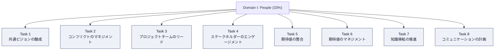
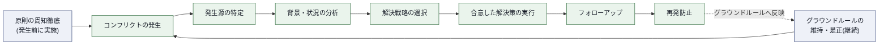
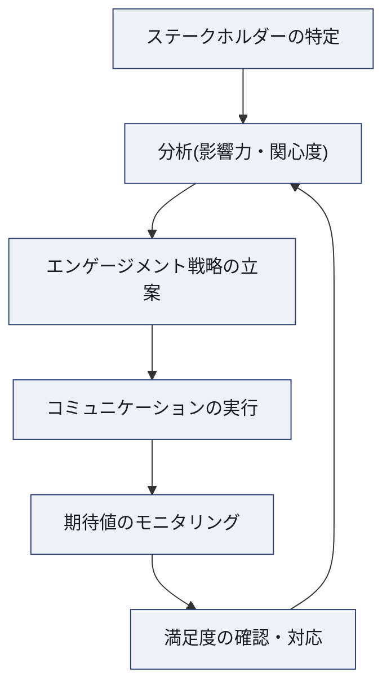
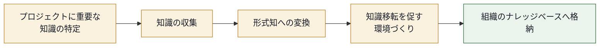
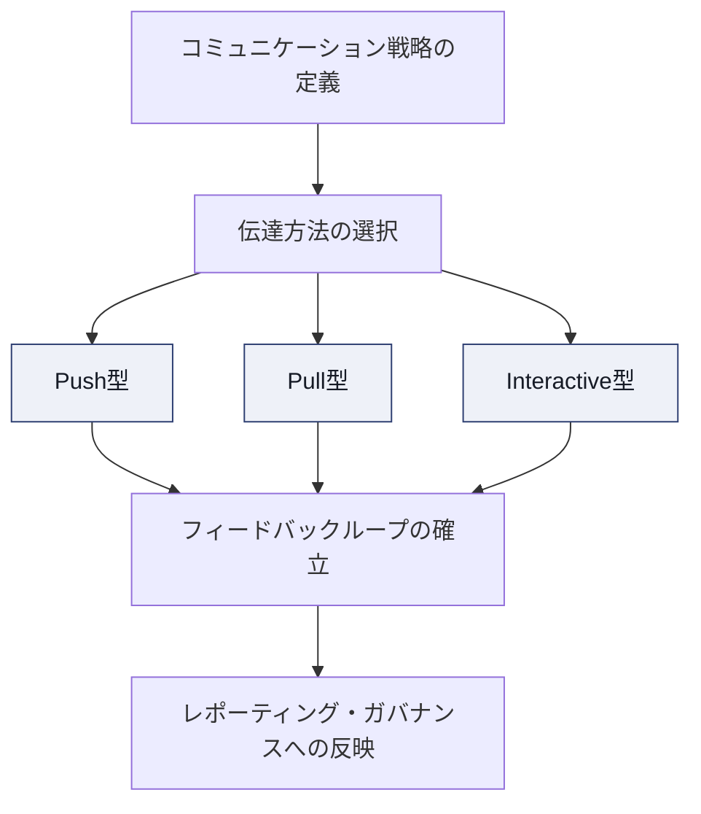

# PMP® Domain I: People 完全攻略ガイド ― 初学者向けステップバイステップ解説

> 本ガイドは、PMI(Project Management Institute)が公開する **PMP® Certification Exam Content Outline(ECO)2026年7月改定版** を一次情報源として、Domain I: People(第I領域:人)を初学者向けに体系化した学習資料です。各Task(タスク)・Enabler(実務行動例)の内容を丁寧に解説し、実務およびPMP試験対策の両面で使えるベストプラクティスを、根拠となる出典URLとともに整理しています。

---

## 目次

1. [このガイドについて](#このガイドについて)
2. [PMP試験の全体像](#1-pmp試験の全体像)
3. [2026年7月改定のポイント](#2-2026年7月改定のポイント)
4. [Domain I: Peopleとは何か](#3-domain-i-peopleとは何か)
5. [Task 1: 共通ビジョンの醸成](#task-1-共通ビジョンの醸成-develop-a-common-vision)
6. [Task 2: コンフリクトのマネジメント](#task-2-コンフリクトのマネジメント-manage-conflicts)
7. [Task 3: プロジェクトチームのリード](#task-3-プロジェクトチームのリード-lead-the-project-team)
8. [Task 4: ステークホルダーのエンゲージメント](#task-4-ステークホルダーのエンゲージメント-engage-stakeholders)
9. [Task 5: ステークホルダーの期待値の整合](#task-5-ステークホルダーの期待値の整合-align-stakeholder-expectations)
10. [Task 6: ステークホルダーの期待値のマネジメント](#task-6-ステークホルダーの期待値のマネジメント-manage-stakeholder-expectations)
11. [Task 7: 知識移転の推進](#task-7-知識移転の推進-help-ensure-knowledge-transfer)
12. [Task 8: コミュニケーションの計画とマネジメント](#task-8-コミュニケーションの計画とマネジメント-plan-and-manage-communication)
13. [タスク横断ベストプラクティス総まとめ表](#4-タスク横断ベストプラクティス総まとめ表)
14. [People領域の試験対策のコツ](#5-people領域の試験対策のコツ)
15. [参考文献・出典](#6-参考文献出典)

---

## このガイドについて

- **対象読者**: PMP資格取得を目指す初学者、プロジェクトマネジメント未経験〜浅い経験者
- **前提知識**: 不要(専門用語は初出時に説明を付与)
- **表記方針**: 日本語を主体としつつ、PMI公式の英語術語(Task名・Enabler名・フレームワーク名など)はそのまま残しています。PMP試験は受験時に選択した言語で表示され、必要に応じて英語の原文も併せて確認できるため、英語術語に慣れておくと訳語の揺れに戸惑わずに済みます。
- **図解方針**: ASCIIアートは使用せず、フローチャートはすべて Mermaid 記法、比較・整理情報はすべて Markdown表 で表現しています。

---

## 1. PMP試験の全体像

PMP試験は、PMIが実施するグローバル資格試験で、ジョブタスク分析(Job Task Analysis, JTA)に基づいて実際のプロジェクトマネージャーの業務内容から出題内容が設計されています。

| 項目 | 内容 |
|---|---|
| 総問題数 | 180問(うち採点対象外のプリテスト問題10問を含む) |
| 採点対象問題数 | 170問 |
| 試験時間 | 240分(4時間) |
| 休憩 | 10分間の休憩が2回(ケーススタディ区間の後、独立設問区間の中間) |
| 受験形式 | テストセンター(CBT/PBT)またはオンライン監督試験(OPT) |
| 再受験 | 1年間の受験資格期間内に最大3回まで受験可能 |
| 認定維持 | 3年ごとに60 PDU(専門能力開発ユニット)の取得と更新料の支払いが必要 |

出題領域(ドメイン)は3つに分かれており、それぞれの出題比率が明確に定められています。

| ドメイン | 出題比率 |
|---|---|
| I. People(人) | 33% |
| II. Process(プロセス) | 41% |
| III. Business Environment(ビジネス環境) | 26% |

また、開発アプローチの観点では、予測型(ウォーターフォール型)アプローチに関する設問がおよそ40%、残りの60%がアジャイル型・ハイブリッド型アプローチに関する設問という構成になっており、特定のドメインが特定のアプローチに偏っているわけではない点に注意が必要です。

出典: [PMP Examination Content Outline 2026(PMI公式PDF)](https://www.pmi.org/-/media/pmi/documents/public/pdf/certifications/new-pmp-examination-content-outline-2026.pdf), [PMP Certification | PMI](https://www.pmi.org/certifications/project-management-pmp)

---

## 2. 2026年7月改定のポイント

PMP試験のExamination Content Outline(ECO)は2026年7月に大幅改定されました。旧版(2021年版)を学習した経験がある方、または他の教材で学習中の方は、以下の変更点に注意してください。

- **ドメイン比率の変更**: People 42%→**33%**、Process 50%→**41%**、Business Environment 8%→**26%**(Business Environmentの比重が大幅増加)
- **Taskの再構成**: Domain I: Peopleは旧版の14Taskから**8Task**へ再編。「Plan and manage communication(コミュニケーションの計画とマネジメント)」がProcessドメインからPeopleドメインへ移動し、統合された
- **新しい出題形式の追加**: Case or Scenario(詳細なシナリオ・図表を提示し複数設問に答える形式)、Enhanced Matching(画像・図表を用いたマッチング)、Graphic-Based Questions(図表を読み解く形式)が新設
- **AIとサステナビリティの反映**: JTAの入力として、AI(人工知能)やサステナビリティといった近年の業界トレンドが明示的に反映されている
- **PMBOK® Guideとの関係の明確化**: ECOはPMBOK® Guideとは別物であり、特定の教材・単一の参考書に基づいて出題されるものではないことが明記されている。ECOは「実際にプロジェクトを率いる人材が行う重要な業務(Task)」を定義したものであり、PMBOK® Guideは「原則・パフォーマンスドメイン・プロセス」を体系化した知識体系である

出典: [PMP Examination Content Outline 2026(PMI公式PDF)](https://www.pmi.org/-/media/pmi/documents/public/pdf/certifications/new-pmp-examination-content-outline-2026.pdf)

---

## 3. Domain I: Peopleとは何か

ECOでは、試験の構造を **Domain(領域)→ Task(タスク)→ Enabler(実務行動例)** の3階層で定義しています。

- **Domain**: プロジェクトマネジメントの実践に不可欠な、ハイレベルな知識領域
- **Task**: そのドメイン内でプロジェクトマネージャーが担う基本的な責任
- **Enabler**: そのTaskに含まれる業務内容を示す具体例(網羅的リストではなく代表例)

Domain I: Peopleは、試験全体の33%を占める領域であり、「人・チーム・ステークホルダーとどう向き合うか」という、プロジェクトマネージャーのリーダーシップとソフトスキルを問う領域です。8つのTaskで構成されています。

Task 1〜3は主に「チーム内部」への働きかけ、Task 4〜6は「ステークホルダーとの関係性」、Task 7〜8は「情報・知識の流通」に関わるTaskとして整理すると理解しやすくなります。

出典: [PMP Examination Content Outline 2026(PMI公式PDF)](https://www.pmi.org/-/media/pmi/documents/public/pdf/certifications/new-pmp-examination-content-outline-2026.pdf)

---

## Task 1: 共通ビジョンの醸成 (Develop a common vision)

### 概要

プロジェクトの目的・目指す姿について、主要なステークホルダーの間で共通認識を作り、それを維持し続けるTaskです。ビジョンが共有されていないプロジェクトでは、チームメンバーがそれぞれ異なる方向に努力してしまい、手戻りや対立の温床になります。

### Enabler(実務行動例)

| Enabler | 説明 |
|---|---|
| 主要ステークホルダーとの共有ビジョンの醸成 | キックオフ等でビジョンを共同構築し、全員が「自分ごと」として捉えられるようにする |
| 共有ビジョンの浸透 | 会議・レポート・日々のコミュニケーションを通じてビジョンを繰り返し伝える |
| ビジョンの鮮度維持 | 環境変化に応じてビジョンを見直し、陳腐化させない |
| ビジョン誤解の根本原因分析 | 認識のズレが生じた際に、状況を分解して根本原因を突き止める |

### ステップバイステップ解説

1. **ビジョンを言語化する**: プロジェクト憲章(Project Charter)やビジネスケースをもとに、「なぜこのプロジェクトを行うのか」「成功した状態はどのようなものか」を短い言葉で表現する
2. **主要ステークホルダーと共同構築する**: 一方的に伝えるのではなく、キックオフミーティングやワークショップでステークホルダーの意見を取り入れながらビジョンを練り上げる
3. **反復的に発信する**: 一度伝えただけでは浸透しない。定例会議、ニュースレター、ダッシュボードなど複数のチャネルで繰り返し伝える
4. **定点観測する**: プロジェクトの状況やスコープが変化した際、ビジョンが現実と乖離していないか定期的に確認する
5. **ズレが起きたら分解して原因分析する**: チームやステークホルダーの言動にビジョンとの不一致が見られた場合、感情的に対応せず、状況を要素分解して根本原因(情報不足か、優先順位の対立か、単なる誤解か)を特定する

### ベストプラクティス

- ビジョンは「何を作るか」だけでなく「なぜそれに価値があるか」を含めて言語化する。PMIの調査では、プロジェクトの成功を測る指標が、従来のスコープ・予算・スケジュールという伝統的な物差しから、ステークホルダーにとっての価値創出やアウトカムの達成という、より広い視点へ再定義されつつあることが示されている
- ビジョンの共有は一度きりのイベントではなく、プロジェクトライフサイクル全体を通じた継続的な活動として計画する
- ビジョンのズレを検知したら、誰が悪いかではなく「なぜそのズレが生じたか」という構造的な原因に焦点を当てる

出典: [PMP Examination Content Outline 2026(PMI公式PDF)](https://www.pmi.org/-/media/pmi/documents/public/pdf/certifications/new-pmp-examination-content-outline-2026.pdf)

---

## Task 2: コンフリクトのマネジメント (Manage conflicts)

### 概要

プロジェクトチームやステークホルダー間で発生する意見の対立(コンフリクト)を、発生源の特定から解決、再発防止までマネジメントするTaskです。コンフリクトそのものは悪ではなく、放置・不適切な対処が問題であるという前提に立って学習することが重要です。

### Enabler(実務行動例)

| Enabler | 説明 |
|---|---|
| コンフリクトの発生源の特定 | 何が対立の火種になっているかを把握する |
| コンフリクトの背景・状況分析 | 表面的な言い争いの奥にある利害関係を分析する |
| 合意した解決戦略の実行 | 状況に応じた解決アプローチを選び、実行する |
| チーム・外部ステークホルダーへの原則周知 | コンフリクトマネジメントの考え方をあらかじめ共有しておく |
| グラウンドルール遵守環境の整備 | チームの行動規範(グラウンドルール)が守られる土壌を作る |
| グラウンドルール違反の是正 | 違反が起きた際に適切に対処し、修正する |

### コンフリクトマネジメントのプロセスフロー

### ベストプラクティス: Thomas-Kilmann Conflict Mode Instrument(TKI)

コンフリクト解決戦略の選択にあたっては、心理学者Kenneth ThomasとRalph Kilmannが1970年代に提唱した「Thomas-Kilmann Conflict Mode Instrument」が広く参照されています。これは「自己主張の強さ(Assertiveness)」と「協調性(Cooperativeness)」という2軸で、5つの対応モードを整理したフレームワークです。

| モード | 自己主張 | 協調性 | 適したシーン |
|---|---|---|---|
| Competing(強制/直接対応) | 高 | 低 | 緊急性が高く迅速な意思決定が必要な場面、譲れない安全・コンプライアンス事項 |
| Collaborating(協調/問題解決) | 高 | 高 | 長期的な関係性が重要で、双方の全面的な合意が必要な複雑な課題 |
| Compromising(妥協) | 中 | 中 | 双方にとってある程度重要だが、時間をかけてまで対立を続ける価値がない場合の暫定合意 |
| Avoiding(回避/撤退) | 低 | 低 | 影響力の小さい低次元の対立、当事者のクールダウンが先に必要な場合 |
| Accommodating(適応/融和) | 低 | 高 | 自分にとっての重要度が低く、相手との関係維持を優先すべき場合 |

5つのモードに一律の優劣はなく、適切なモードはコンフリクトの発生源と状況(緊急度、関係性の重要度、影響範囲、譲れない制約の有無)を分析したうえで選択します。試験対策としては「どのモードが常に正しいか」ではなく「この状況ではなぜこのモードが適切か」を状況ごとに判断できるようにしておくことが重要です。

### その他のベストプラクティス

- グラウンドルールはチーム結成の初期段階(Storming期に入る前)に、チーム自身が主体的に策定することで遵守率が高まる
- コンフリクトの解決は「勝ち負け」ではなく「プロジェクトの目的達成」を基準に判断する
- コンフリクトマネジメントの原則は、対立が起きてから伝えるのではなく、あらかじめチーム・外部ステークホルダーに周知しておくことで、いざという時の対応がスムーズになる

出典: [Ralph H. Kilmann(Wikipedia)](https://en.wikipedia.org/wiki/Ralph_H._Kilmann), [Leadership Through Conflict: Grow and Advance Project Teams | PMI](https://www.pmi.org/learning/library/leadership-conflict-advance-project-teams-6711), [PMP Examination Content Outline 2026(PMI公式PDF)](https://www.pmi.org/-/media/pmi/documents/public/pdf/certifications/new-pmp-examination-content-outline-2026.pdf)

---

## Task 3: プロジェクトチームのリード (Lead the project team)

### 概要

チームレベルでの期待値設定から、権限移譲(エンパワーメント)、問題解決、チームの声の代弁、多様性の尊重、リーダーシップスタイルの選択、役割と責任の明確化まで、チームを率いる上での中核的な行動を扱うTaskです。

### Enabler(実務行動例)

| Enabler | 説明 |
|---|---|
| チームレベルでの期待値設定 | 働き方・品質基準・コミュニケーション頻度などを明文化する |
| チームのエンパワーメント | 意思決定権限を適切に委譲し、主体性を引き出す |
| 問題解決 | チームが直面する課題に対して解決策を導く |
| チームの声の代弁 | 経営層やスポンサーに対してチームの状況・懸念を正確に伝える |
| 多様な経験・スキル・視点の支援 | チームメンバーの背景の違いを尊重し、強みとして活かす |
| 適切なリーダーシップスタイルの決定 | 状況やチームの成熟度に応じてスタイルを使い分ける |
| 役割と責任の明確化 | 誰が何を担当するのかをチーム内で明確にする |

### ベストプラクティス: リーダーシップスタイルの使い分け

PMIの複数の学習ライブラリ記事では、プロジェクトマネージャーのリーダーシップは「サーバントリーダーシップ(Servant Leadership)」と「状況対応型リーダーシップ(Situational Leadership)」を組み合わせたパターンが効果的であるとされています。特に、正式な権限が限られる中でチームやステークホルダーを動かす必要があるプロジェクトマネージャーにとって、サーバントリーダーシップは実務上の有効性が高いとされています。

| リーダーシップスタイル | 特徴 | 適したシーン |
|---|---|---|
| Servant(サーバント) | チームの成長・自律性・ウェルビーイングを最優先し、障害を取り除く役割に徹する | 自己組織化されたアジャイルチーム、成熟度の高いチーム |
| Situational(状況対応型) | チームの成熟度や状況に応じて指示型〜委任型までスタイルを可変させる | チームの発達段階(Tuckmanモデルのforming〜performing)が混在するプロジェクト |
| Transformational(変革型) | ビジョンを掲げ、内発的動機付けによってチームを鼓舞する | 大規模な変革プロジェクト、イノベーションが求められる場面 |
| Directive(指示型) | 明確な指示と綿密な監督を行う | 危機対応、経験の浅いチーム、精度が最優先される場面 |
| Laissez-faire(自由放任型) | チームに意思決定を委ね、必要最小限の介入にとどめる | 高度に自律的で経験豊富なチーム |

チームの発達段階は、心理学者Bruce Tuckmanが提唱した「Forming(形成期)→ Storming(混乱期)→ Norming(統一期)→ Performing(機能期)」というモデルで捉えられることが多く、この発達段階に応じてリーダーシップスタイルを切り替えていくアプローチ(状況対応型リーダーシップ)が、PMBOK® Guideの関連文献でも紹介されています。

### その他のベストプラクティス

- 役割と責任は、RACIチャート(Responsible/Accountable/Consulted/Informed)のような可視化ツールを用いてチーム全員が同じ認識を持てるようにする
- エンパワーメントは「丸投げ」ではなく、意思決定に必要な情報・権限・スキルをセットで委譲することが前提になる
- チームの多様な視点を活かすには、心理的安全性(Psychological Safety)、すなわち「発言してもリスクがない」と感じられる環境づくりが土台になる

出典: [Leadership essentials for project management professionals (PMPs) | PMI](https://www.pmi.org/learning/library/leadership-essentials-project-management-professionals-6226), [Great project leadership | PMI](https://www.pmi.org/learning/library/great-project-leadership-five-essentials-5915), [PMP Examination Content Outline 2026(PMI公式PDF)](https://www.pmi.org/-/media/pmi/documents/public/pdf/certifications/new-pmp-examination-content-outline-2026.pdf)

---

## Task 4: ステークホルダーのエンゲージメント (Engage stakeholders)

### 概要

ステークホルダーの特定から分析、コミュニケーションの調整、エンゲージメント計画の実行、期待値とプロジェクト目標の整合、信頼構築までを扱う、ステークホルダーマネジメントの中核Taskです。

### Enabler(実務行動例)

| Enabler | 説明 |
|---|---|
| ステークホルダーの特定 | プロジェクトに影響を与える・受ける関係者を洗い出す |
| ステークホルダーの分析 | 影響力・関心度・態度などの観点で分析する |
| コミュニケーションの分析と調整 | ステークホルダーごとにニーズに合わせて伝え方を変える |
| エンゲージメント計画の実行 | 計画したアプローチを実際の行動に移す |
| ニーズ・期待値・プロジェクト目標の整合最適化 | 三者間のギャップを埋める |
| 信頼構築と影響力の行使 | 信頼関係を土台に、目標達成へ向けてステークホルダーを動かす |

### ステークホルダーエンゲージメントのサイクル

### ベストプラクティス: ステークホルダー分析ツール

- **Power/Interest Grid(権力・関心度グリッド)**: 「影響力の大小」と「関心度の高低」の2軸でステークホルダーを4象限に分類し、対応の優先順位を決める代表的なツール
- **Stakeholder Engagement Assessment Matrix(ステークホルダーエンゲージメント評価マトリクス)**: 各ステークホルダーについて「現在の関与レベル(Current)」と「望ましい関与レベル(Desired)」を比較し、そのギャップを埋めるための具体的なコミュニケーション施策を計画するツール(詳細はTask 5・6で解説)

### その他のベストプラクティス

- ステークホルダー分析は一度実施して終わりではなく、プロジェクトの進行やフェーズ移行に応じて定期的に見直す
- 「信頼構築」は一朝一夕には成立しない。約束を守る・透明性を保つ・小さな成功体験を積み重ねるといった地道な行動の積み重ねが土台になる
- 影響力の行使は職位上の権限(Positional Power)だけに頼らず、専門性・人間関係・実績に基づく影響力(Referent Power/Expert Power)も活用する

出典: [PMP Examination Content Outline 2026(PMI公式PDF)](https://www.pmi.org/-/media/pmi/documents/public/pdf/certifications/new-pmp-examination-content-outline-2026.pdf)

---

## Task 5: ステークホルダーの期待値の整合 (Align stakeholder expectations)

### 概要

ステークホルダーを分類し、それぞれが何を期待しているかを把握したうえで、期待値のズレを話し合いによって整合させ、さらにメンタリングの機会を通じて関係性を深めるTaskです。

### Enabler(実務行動例)

| Enabler | 説明 |
|---|---|
| ステークホルダーの分類 | 属性・立場・利害関係などでグルーピングする |
| ステークホルダーの期待値の特定 | 明示的・暗黙的な期待を洗い出す |
| 期待値整合のためのディスカッション促進 | ズレがある場合、対話の場を設けて合意形成する |
| メンタリング機会の組織化と実行 | 経験の浅いメンバーやステークホルダーの育成機会を活かす |

### ベストプラクティス: Stakeholder Engagement Assessment Matrix

ステークホルダーの現在の関与レベルと、プロジェクト成功のために必要な望ましい関与レベルを比較するツールとして、5段階の分類が広く使われています。

| レベル | 説明 |
|---|---|
| Unaware(無自覚) | プロジェクトの存在やその影響について認識していない |
| Resistant(抵抗) | プロジェクトの存在は認識しているが、変化に対して抵抗を示す |
| Neutral(中立) | プロジェクトを認識しているが、支持も反対もしていない |
| Supportive(支持) | プロジェクトを認識し、その成果を支持している |
| Leading(主導) | プロジェクトの成功に向けて能動的に関与し、推進している |

各ステークホルダーについて「現在地(C: Current)」と「目標地点(D: Desired)」をマトリクス上にマッピングし、そのギャップの大きさに応じて対話・メンタリング・情報提供などの施策を計画します。例えば、スポンサーの現在地が「Supportive」で目標地点が「Leading」であれば、意思決定への巻き込みや推進役としての役割付与といった、ワンランク引き上げる施策を検討します。

### その他のベストプラクティス

- 期待値のズレは「誰が正しいか」ではなく「何が事実で、何が解釈の違いか」を切り分けて話し合う
- メンタリングは一方的な指導ではなく、経験の浅いステークホルダーやチームメンバーが自ら気づきを得られるよう、対話を通じて支援する
- ステークホルダーの分類は固定的なものではなく、プロジェクトの局面によって重要度・関与度が変化することを前提に、継続的に更新する

出典: [What is the Stakeholder Engagement Assessment Matrix? | PM Study Circle](https://pmstudycircle.com/stakeholder-engagement-assessment-matrix/), [3 Types of Stakeholder Matrix](https://www.projectengineer.net/3-types-of-stakeholder-matrix/), [PMP Examination Content Outline 2026(PMI公式PDF)](https://www.pmi.org/-/media/pmi/documents/public/pdf/certifications/new-pmp-examination-content-outline-2026.pdf)

---

## Task 6: ステークホルダーの期待値のマネジメント (Manage stakeholder expectations)

### 概要

Task 5が「期待値を整合させる」という一時的な合意形成の活動であるのに対し、Task 6は社内外の顧客の期待値を継続的に維持・監視し、必要に応じて対応するという、より継続的・運用的な性質のTaskです。

### Enabler(実務行動例)

| Enabler | 説明 |
|---|---|
| 社内外の顧客期待値の特定 | 誰が顧客であり、何を期待しているかを把握する |
| 成果物と期待値の整合維持 | プロジェクトの成果が期待とズレないよう継続的に調整する |
| 満足度・期待値のモニタリングと対応 | 定点観測を行い、変化があれば適切に対処する |

### Task 5とTask 6の違いを理解する

初学者がつまずきやすいポイントとして、Task 5「Align」とTask 6「Manage」の違いがあります。以下のように整理すると理解しやすくなります。

| 観点 | Task 5: Align(整合) | Task 6: Manage(マネジメント) |
|---|---|---|
| 時間軸 | 特定時点でのズレを解消する、一時的な活動 | プロジェクト期間を通じた継続的な活動 |
| 主なアクション | ディスカッションによる合意形成、メンタリング | モニタリング、満足度確認、継続的対応 |
| 焦点 | 期待値そのものを揃えること | 揃えた期待値を維持し、満足度を保つこと |

### ベストプラクティス

- 顧客満足度は、正式なアンケートだけでなく、定例会議での発言・トーン、成果物へのフィードバック速度といった定性的なシグナルからも把握する
- 期待値と実際の成果に乖離が生じそうな兆候を早期に検知し、サプライズを避けるための先手のコミュニケーションを行う(いわゆる「Bad news early」の原則)
- モニタリングの結果は一過性の報告で終わらせず、次のエンゲージメント施策の入力情報として活用する

出典: [PMP Examination Content Outline 2026(PMI公式PDF)](https://www.pmi.org/-/media/pmi/documents/public/pdf/certifications/new-pmp-examination-content-outline-2026.pdf)

---

## Task 7: 知識移転の推進 (Help ensure knowledge transfer)

### 概要

プロジェクトを通じて蓄積される知識が、個人の頭の中に留まらず組織の資産として継承されるよう促進するTaskです。ECO本文では、Domain / Task / Enablerという3階層の構造を説明する例としてこのTaskが挙げられています。

### Enabler(実務行動例)

| Enabler | 説明 |
|---|---|
| プロジェクトに重要な知識の特定 | 何が失われると困る知識かを見極める |
| 知識の収集 | インタビュー・レビュー・ドキュメント化などを通じて集める |
| 知識移転を促す環境づくり | 心理的安全性やインセンティブを含めた土壌を整える |

### 知識移転のプロセスフロー

### ベストプラクティス: 暗黙知(Tacit Knowledge)と形式知(Explicit Knowledge)

PMIの複数のライブラリ記事では、知識を「Explicit Knowledge(形式知)」と「Tacit Knowledge(暗黙知)」の2種類に区分して捉えることが推奨されています。

| 種類 | 説明 | 移転の難易度 |
|---|---|---|
| Explicit Knowledge(形式知) | マニュアル・手順書・テンプレートなど、言語化・文書化されている知識 | 比較的容易(文書共有・研修などで移転可能) |
| Tacit Knowledge(暗黙知) | 個人の経験・勘・判断力に基づく、言語化しにくい知識 | 困難(対話・共同作業・メンタリングを通じてしか移転しにくい) |

伝統的なプロジェクトマネジメントの手法は形式知の管理に重心が置かれがちである一方、実際にプロジェクトの成否を分けるのは暗黙知であることが多いとされています。暗黙知の移転には、以下のような具体的な手法が有効とされています。

- **レッスンズラーンド(Lessons Learned)セッションの構造化**: プロジェクト終了後だけでなく、フェーズの節目ごとに実施する。参加者は成果物に直接関わった実務担当者を中心に選定し、「何が起きたか」を経験ベースで語ってもらうことから始める
- **メンタリング・コーチング**: 経験豊富なメンバーと若手メンバーを組ませ、日常業務を通じた暗黙知の伝承を促す
- **コミュニティ・オブ・プラクティス(実践共同体)**: 同じ専門性を持つメンバー同士が定期的に知見を交換する場を設ける

### その他のベストプラクティス

- 「重要な知識」を特定する際は、失われた場合の影響度(インパクト)と、その知識を持つ人材の代替可能性(希少性)の両面で優先順位をつける
- 知識移転を促す環境づくりには、心理的安全性(失敗や疑問を共有しても咎められない文化)、情報共有のインセンティブ設計、離職・異動のタイミングを見越した早期の引き継ぎ計画が含まれる
- 収集した知識はドキュメント化するだけでなく、次のプロジェクトで実際に参照・活用される仕組み(検索性の高いナレッジベースなど)とセットで設計する

出典: [Being in the know | PMI](https://www.pmi.org/learning/library/turning-experience-into-knowledge-3828), [Tapping tacit knowledge | PMI](https://www.pmi.org/learning/library/tapping-tacit-knowledge-across-enterprise-7747), [How To Support Knowledge Transfer Through PMOs | PMI](https://www.pmi.org/learning/library/support-knowledge-transfer-pmos-10206), [PMP Examination Content Outline 2026(PMI公式PDF)](https://www.pmi.org/-/media/pmi/documents/public/pdf/certifications/new-pmp-examination-content-outline-2026.pdf)

---

## Task 8: コミュニケーションの計画とマネジメント (Plan and manage communication)

### 概要

2026年改定でProcessドメインからPeopleドメインへ統合されたTaskです。コミュニケーション戦略の策定、透明性・協働の促進、フィードバックループの確立、レポーティング要件の理解、ガバナンスプロセスへの対応までを扱います。

### Enabler(実務行動例)

| Enabler | 説明 |
|---|---|
| コミュニケーション戦略の定義 | 誰に・何を・いつ・どう伝えるかを設計する |
| 透明性と協働の促進 | 情報の隠蔽をなくし、オープンな協力関係を築く |
| フィードバックループの確立 | 一方通行ではなく、双方向の情報流通を仕組み化する |
| レポーティング要件の理解 | 誰がどのような報告を必要としているかを把握する |
| スポンサー・ステークホルダー期待に沿ったレポート作成 | 相手のニーズに合わせた粒度・形式で報告する |
| レポーティング・ガバナンスプロセスの支援 | 組織のガバナンス体制に沿った報告の仕組みを支える |

### コミュニケーション計画のフロー

### ベストプラクティス: 3つのコミュニケーション方式

PMBOK® Guideの伝統的な整理では、コミュニケーション手法は方向性の観点から3種類に分類されます。

| 方式 | 特徴 | 具体例 |
|---|---|---|
| Push型(プッシュ型) | 受信確認や即時のフィードバックを前提とせず、送り手から一方的に情報を届ける | メール、レポート、社内報 |
| Pull型(プル型) | 受け手が必要なタイミングで自発的に情報にアクセスする | 社内ポータル、共有ドライブ、ナレッジベース |
| Interactive型(双方向型) | リアルタイムでの多方向のやり取りが発生する | 会議、電話、ビデオ会議、対面での立ち話 |

複雑な意思決定やセンシティブな話題にはInteractive型、定型的な進捗報告にはPush型、必要なときに参照される情報にはPull型、というように使い分けることが基本原則とされています。

### その他のベストプラクティス

- コミュニケーションチャネルの数は、ステークホルダーの人数が増えるほど組み合わせの数として急激に増加する(n人であれば n×(n-1)÷2 通りの経路が存在する)。ステークホルダーが増えるほど、構造化されたコミュニケーション計画の重要性が高まる
- フィードバックループは「報告して終わり」にせず、受け手からの反応・疑問・懸念を次のアクションに反映する仕組みとして設計する
- レポートの粒度・頻度・形式はステークホルダーごとに異なる。経営層には要約されたダッシュボード、実務チームには詳細なバックログというように、受け手に応じてテーラリングする

出典: [Beyond reporting--the communication strategy | PMI](https://www.pmi.org/learning/library/communication-strategy-stakeholder-generating-reports-6887), [PMP Examination Content Outline 2026(PMI公式PDF)](https://www.pmi.org/-/media/pmi/documents/public/pdf/certifications/new-pmp-examination-content-outline-2026.pdf)

---

## 4. タスク横断ベストプラクティス総まとめ表

| Task | キーとなるフレームワーク・概念 | 一言でいうと |
|---|---|---|
| Task 1: 共通ビジョンの醸成 | ビジョンステートメント、根本原因分析 | 「なぜやるのか」を全員で共有し続ける |
| Task 2: コンフリクトのマネジメント | Thomas-Kilmann Conflict Mode Instrument | 状況に応じて解決モードを使い分ける |
| Task 3: プロジェクトチームのリード | サーバントリーダーシップ、状況対応型リーダーシップ、Tuckmanモデル | チームの成熟度に合わせてスタイルを変える |
| Task 4: ステークホルダーのエンゲージメント | Power/Interest Grid | 影響力と関心度でステークホルダーを整理する |
| Task 5: ステークホルダーの期待値の整合 | Stakeholder Engagement Assessment Matrix | 現在地と目標地点のギャップを埋める |
| Task 6: ステークホルダーの期待値のマネジメント | 満足度モニタリング、Bad news early原則 | 揃えた期待値を継続的に維持する |
| Task 7: 知識移転の推進 | 形式知/暗黙知、レッスンズラーンド | 個人の知識を組織の資産に変える |
| Task 8: コミュニケーションの計画とマネジメント | Push/Pull/Interactive型コミュニケーション | 相手と目的に応じて伝達手段を選ぶ |

---

## 5. People領域の試験対策のコツ

PMP試験は知識の暗記だけでなく、シナリオに対する状況判断力を問う設問が中心です。People領域では特に以下の思考パターンを意識すると得点力が向上します。

- **プロアクティブ(能動的)な選択肢を優先する**: 問題が発生してから対応する受動的な選択肢よりも、事前にリスクや対立を予見して行動する選択肢が正解になりやすい
- **まず状況を評価してから行動する**: 「即座にエスカレーションする」「即座に変更を実施する」といった、状況把握を飛ばして行動に飛びつく選択肢は、多くの場合誤りである。PMI公式サイトのサンプル設問でも、変更要求に対しては影響評価と正式な変更管理プロセスに従うこと、チームへの指示が競合する場合はまず該当ステークホルダーと役割・権限・影響を確認する話し合いを行うことが、望ましい対応として示されている
- **チームを主語にする**: 「マネージャーが一方的に決める」よりも「チームと協働して解決する」「チームの声を代弁する」という選択肢が好まれる傾向がある
- **開発アプローチを問わない原則を意識する**: People領域の設問は predictive/agile/hybrid のいずれのアプローチでも成立する内容が多い。特定の手法名に引きずられず、「人と人との関係性」という観点で設問の本質を捉える
- **Case or Scenario形式・Graphic-Based Questions形式に慣れる**: 2026年改定で追加された新形式では、シナリオや図表を読み解いたうえで複数の設問に答える必要がある。単文の記憶問題ではなく、まとまった情報から必要な要素を抽出する練習をしておくとよい

出典: [PMP Certification | PMI](https://www.pmi.org/certifications/project-management-pmp), [PMP Examination Content Outline 2026(PMI公式PDF)](https://www.pmi.org/-/media/pmi/documents/public/pdf/certifications/new-pmp-examination-content-outline-2026.pdf)

---

## 6. 参考文献・出典

本ガイドの作成にあたり、以下の一次情報源・PMI公式ライブラリ記事を参照しました。

### PMI公式・一次情報源

- [PMP® Certification Exam Content Outline 2026(2026年7月改定版・PMI公式PDF)](https://www.pmi.org/-/media/pmi/documents/public/pdf/certifications/new-pmp-examination-content-outline-2026.pdf)
- [Project Management Professional (PMP)® Certification | PMI](https://www.pmi.org/certifications/project-management-pmp)
- [PMBOK® Guide | PMI](https://www.pmi.org/standards/pmbok)

### コンフリクトマネジメント関連

- [Leadership Through Conflict: Grow and Advance Project Teams | PMI](https://www.pmi.org/learning/library/leadership-conflict-advance-project-teams-6711)
- [Ralph H. Kilmann(Wikipedia)](https://en.wikipedia.org/wiki/Ralph_H._Kilmann)

### リーダーシップ関連

- [Leadership essentials for project management professionals (PMPs)® | PMI](https://www.pmi.org/learning/library/leadership-essentials-project-management-professionals-6226)
- [Great project leadership | PMI](https://www.pmi.org/learning/library/great-project-leadership-five-essentials-5915)

### ステークホルダーマネジメント関連

- [What is the Stakeholder Engagement Assessment Matrix? | PM Study Circle](https://pmstudycircle.com/stakeholder-engagement-assessment-matrix/)
- [3 Types of Stakeholder Matrix | ProjectEngineer](https://www.projectengineer.net/3-types-of-stakeholder-matrix/)

### 知識移転関連

- [Being in the know | PMI](https://www.pmi.org/learning/library/turning-experience-into-knowledge-3828)
- [Tapping tacit knowledge | PMI](https://www.pmi.org/learning/library/tapping-tacit-knowledge-across-enterprise-7747)
- [How To Support Knowledge Transfer Through PMOs | PMI](https://www.pmi.org/learning/library/support-knowledge-transfer-pmos-10206)
- [Uncovering tacit knowledge in projects | PMI](https://www.pmi.org/learning/library/uncovering-tacit-knowledge-projects-7378)

### コミュニケーション管理関連

- [Beyond reporting--the communication strategy | PMI](https://www.pmi.org/learning/library/communication-strategy-stakeholder-generating-reports-6887)

> **免責事項**: 本ガイドはPMI公式のECO(2026年7月改定版)を主要な一次情報源とし、周辺分野についてはPMI公式ライブラリおよび信頼性の高い二次情報源を参照して作成した学習補助資料です。PMIは特定の学習教材・参考書を公式に推奨・保証しておらず、本ガイドも合格を保証するものではありません。最新かつ正確な情報は、必ずPMI公式サイト([pmi.org](https://www.pmi.org/))でご確認ください。
