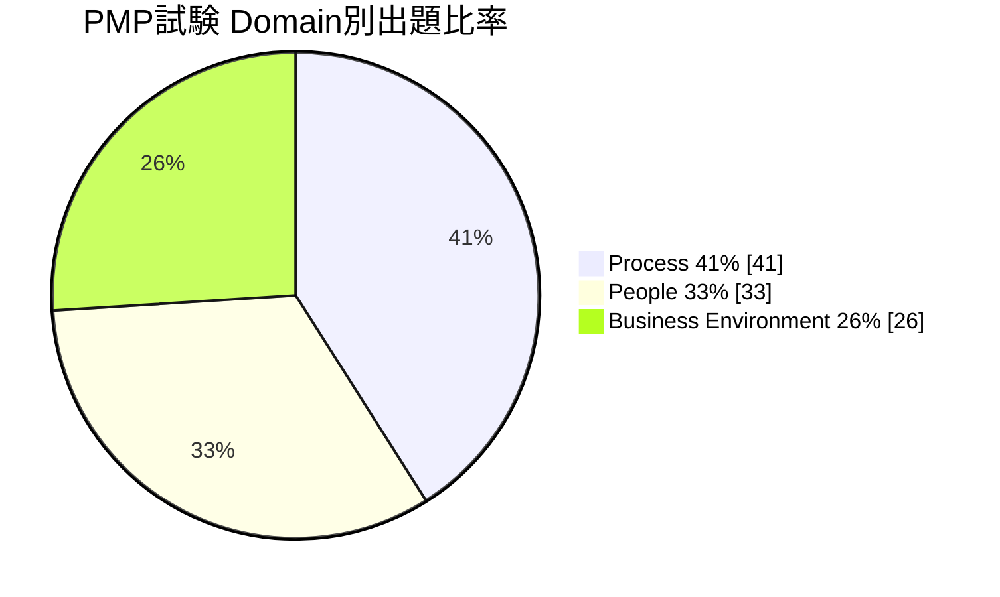
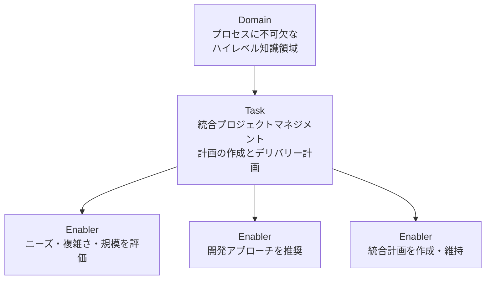
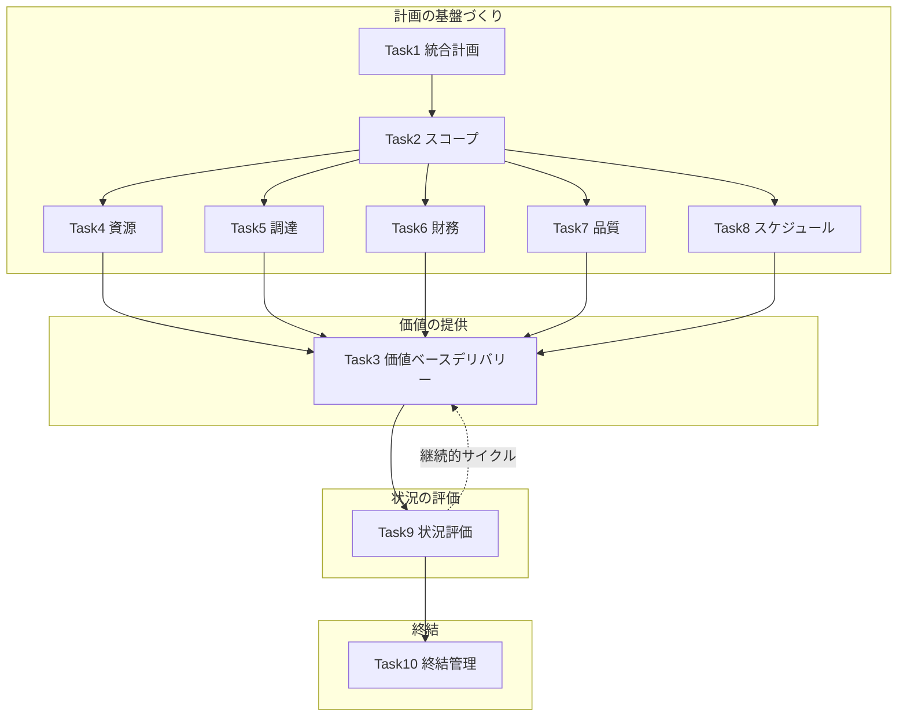
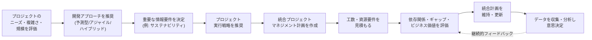
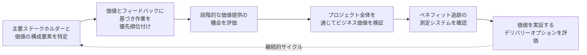
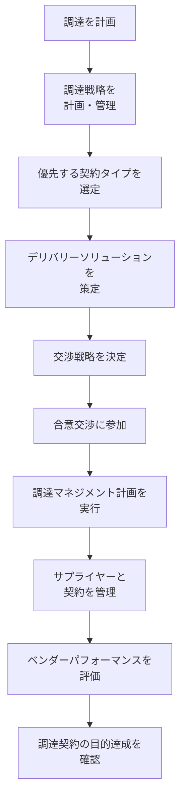
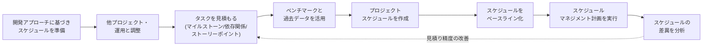
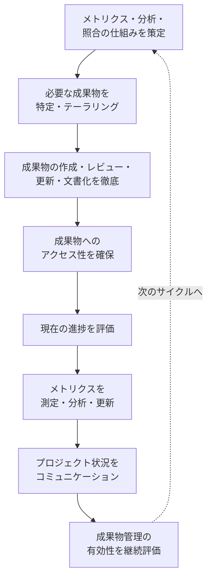
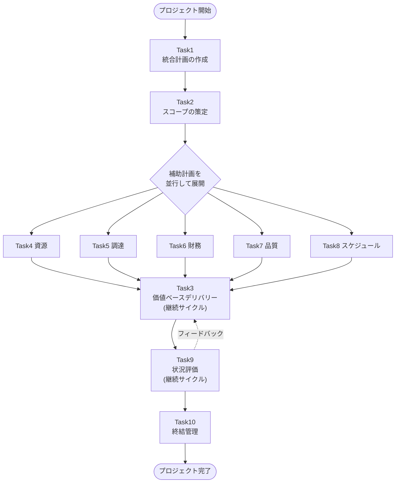

# PMP® Domain II: Process 完全解説ガイド

> **対象読者**: PMP®(Project Management Professional)受験を検討している初学者
> **範囲**: PMP Examination Content Outline (ECO) 2026年7月改訂版における **Domain II: Process(プロセス)** — 試験全体の **41%** を占める最大領域
> **本ガイドの位置づけ**: PMI公式のECO(出題範囲定義文書)を一次情報源とし、各タスク(Task)とイネーブラー(Enabler)を初学者向けに翻訳・解説し、実務でのベストプラクティスを補足したものです

---

## 目次

1. [本ガイドについて](#1-本ガイドについて)
2. [PMP試験全体像とDomain IIの位置づけ](#2-pmp試験全体像とdomain-iiの位置づけ)
3. [ECOの構造を理解する: Domain / Task / Enabler](#3-ecoの構造を理解する-domain--task--enabler)
4. [Domain II: Process 10タスクの全体マップ](#4-domain-ii-process-10タスクの全体マップ)
5. [Task別詳細解説](#5-task別詳細解説)
   - [Task 1: 統合プロジェクトマネジメント計画の作成とデリバリー計画](#task-1-統合プロジェクトマネジメント計画の作成とデリバリー計画)
   - [Task 2: プロジェクトスコープの策定と管理](#task-2-プロジェクトスコープの策定と管理)
   - [Task 3: 価値ベースのデリバリーの徹底](#task-3-価値ベースのデリバリーの徹底)
   - [Task 4: 資源の計画と管理](#task-4-資源の計画と管理)
   - [Task 5: 調達の計画と管理](#task-5-調達の計画と管理)
   - [Task 6: 財務の計画と管理](#task-6-財務の計画と管理)
   - [Task 7: 製品/成果物の品質計画と最適化](#task-7-製品成果物の品質計画と最適化)
   - [Task 8: スケジュールの計画と管理](#task-8-スケジュールの計画と管理)
   - [Task 9: プロジェクト状況の評価](#task-9-プロジェクト状況の評価)
   - [Task 10: プロジェクト終結の管理](#task-10-プロジェクト終結の管理)
6. [Domain II 学習ロードマップとタスク間の関係](#6-domain-ii-学習ロードマップとタスク間の関係)
7. [試験対策のポイント](#7-試験対策のポイント)
8. [参考文献・ソース一覧](#8-参考文献ソース一覧)

---

## 1. 本ガイドについて

PMP®認定試験は、PMI(Project Management Institute)が実施する世界で最も広く保有されているプロジェクトマネジメント認定資格です。出題範囲は **Examination Content Outline (ECO)** という公式文書で定義されており、2026年7月改訂版のECOでは試験が3つのDomain(領域)に分かれています。

このガイドは、その中でも最大の比重(41%)を占める **Domain II: Process** に焦点を当て、以下の観点で解説します。

- 各Task(タスク)が何を問うているのかを、初学者にもわかる言葉で説明する
- 各TaskのEnabler(具体的な業務例)を漏れなく取り上げる
- 実務におけるベストプラクティスを補足する
- 可能な限りMermaidのフローチャートで処理の流れを可視化する(ASCII図解は使用しない)

> **注記**: ECOはPMBOK® Guideとは異なる文書です。ECOはプロジェクトマネージャーが実際に行う「職務(job task)」を定義したものであり、PMBOK® Guideはその職務を支える知識体系・原則です。PMP試験はECOに基づいて出題されるため、本ガイドもECOの構成を軸に解説します。

---

## 2. PMP試験全体像とDomain IIの位置づけ

### 2-1. 3つのDomainと出題比率

PMP試験の出題は以下の3つのDomainに分類され、それぞれ出題比率が定められています。

| Domain | 名称 | 出題比率 | 概要 |
|---|---|---|---|
| I | People(人) | 33% | チームリード、コンフリクト管理、ステークホルダーエンゲージメントなど「人」に関する能力 |
| II | **Process(プロセス)** | **41%** | 計画作成、スコープ、価値提供、資源、調達、財務、品質、スケジュール、状況評価、終結など「プロセス」の遂行能力 |
| III | Business Environment(ビジネス環境) | 26% | ガバナンス、コンプライアンス、変更管理、リスク、継続的改善、組織変革対応など |

Domain IIは3領域の中で最も出題比率が高く、**10個のTask**で構成されています。プロジェクトの計画立案から終結までの一連の「実務プロセス」を幅広くカバーしているため、PMP合格のためには最も重点的に学習すべき領域です。

### 2-2. アプローチ(開発手法)の出題バランス

ECOでは、predictive(予測型)・adaptive/agile(適応型/アジャイル)・hybrid(ハイブリッド)という3つのプロジェクト開発アプローチが、特定のDomainに偏ることなく全Domainを通じて出題されることが明記されています。

| アプローチ区分 | 出題割合の目安 |
|---|---|
| Predictive(予測型・ウォーターフォール型) | 約40% |
| Adaptive/Agile + Hybrid(適応型・アジャイル・ハイブリッドの合計) | 残り約60% |

> **補足**: この配分は試験フォームごとに変動する可能性があるとECOに明記されています。特定の手法に偏った学習ではなく、3つのアプローチすべてに対応できる知識が求められます。

### 2-3. 試験フォーマットの基本情報

| 項目 | 内容 |
|---|---|
| 総問題数 | 180問(うち採点対象170問、プレテスト[未採点]10問) |
| 試験時間 | 240分(4時間) |
| 休憩 | 10分間の休憩が2回(ケーススタディセクション後、独立問題セクションの中間) |
| 出題形式 | 単一選択、複数選択、ドラッグ&ドロップ、ケース/シナリオ形式(新形式)、拡張マッチング、グラフィックベース問題(新形式)、ポイント&クリック、マッチング、プルダウンリストなど |
| 再受験 | 1年間の受験資格期間内に最大3回まで受験可能 |

---

## 3. ECOの構造を理解する: Domain / Task / Enabler

ECOは3階層の構造で出題範囲を定義しています。この構造を理解しておくと、各Taskの学習がしやすくなります。

| 階層 | 定義 | 具体例(Domain II Task 1より) |
|---|---|---|
| **Domain(領域)** | プロジェクトマネジメントの実践に不可欠な、ハイレベルな知識領域 | Process(プロセス) |
| **Task(タスク)** | 各Domain領域内でプロジェクトマネージャーが担う基本的な責務 | 統合プロジェクトマネジメント計画の作成とデリバリー計画 |
| **Enabler(イネーブラー)** | そのTaskに関連する業務の具体例(網羅的リストではなく代表例) | プロジェクトのニーズ・複雑さ・規模を評価する 等 |

試験問題は、この構造に沿って各Domainの全Taskをカバーするように出題され、PMIはDomainレベルでの出題比率(33/41/26%)を遵守しています。なお、**ECOが定めているのはDomain単位の出題比率のみで、Task別の出題比率は定められていません。** したがって、特定のTaskだけを重点的に絞り込むことはできず、Domain II内の10Taskはすべて学習対象として押さえる必要があります。

---

## 4. Domain II: Process 10タスクの全体マップ

Domain II: Processは以下の10個のTaskで構成されます。

| No. | Task名(原文) | Task名(日本語) | 主要キーワード |
|---|---|---|---|
| 1 | Develop an integrated project management plan and plan delivery | 統合プロジェクトマネジメント計画の作成とデリバリー計画 | 統合計画、開発アプローチ、見積り |
| 2 | Develop and manage project scope | プロジェクトスコープの策定と管理 | スコープ定義、WBS、合意形成 |
| 3 | Help ensure value-based delivery | 価値ベースのデリバリーの徹底 | 価値、優先順位付け、インクリメンタルデリバリー |
| 4 | Plan and manage resources | 資源の計画と管理 | 資源計画、資源の最適化 |
| 5 | Plan and manage procurement | 調達の計画と管理 | 契約タイプ、ベンダー評価、交渉 |
| 6 | Plan and manage finance | 財務の計画と管理 | 財務ニーズ、予備費、財務報告 |
| 7 | Plan and optimize quality of products/deliverables | 製品/成果物の品質計画と最適化 | 品質要件、CoQ、継続的改善 |
| 8 | Plan and manage schedule | スケジュールの計画と管理 | 見積り、ベースライン、差異分析 |
| 9 | Evaluate project status | プロジェクト状況の評価 | メトリクス、成果物管理、報告 |
| 10 | Manage project closure | プロジェクト終結の管理 | 完了承認、移行、教訓 |

以下のフローチャートは、10のTaskを学習上の意味合いでグルーピングしたものです(ECO自体は厳密な順序を定めていませんが、初学者が全体像をつかむための整理です)。

> **補足**: 実際のプロジェクトでは、これらのTaskは一度きりの直線的な流れではなく、開発アプローチ(予測型/アジャイル/ハイブリッド)に応じて反復的に実施されます。特にTask3(価値提供)とTask9(状況評価)はプロジェクト期間中継続的に回り続けるサイクルです。

---

## 5. Task別詳細解説

### Task 1: 統合プロジェクトマネジメント計画の作成とデリバリー計画

**原文**: Develop an integrated project management plan and plan delivery

このTaskは、Domain II全体の「入口」にあたるTaskです。プロジェクトの特性を評価し、最適な開発アプローチを選び、それを1つの整合性あるマネジメント計画にまとめる能力が問われます。

#### Enabler(業務例)一覧

| Enabler(原文) | 日本語訳 |
|---|---|
| Assess project needs, complexity, and magnitude | プロジェクトのニーズ・複雑さ・規模を評価する |
| Recommend a project management development approach (predictive, adaptive/agile, or hybrid) | 開発アプローチ(予測型/アジャイル/ハイブリッド)を推奨する |
| Determine critical information requirements (e.g., sustainability) | 重要な情報要件を決定する(例: サステナビリティ) |
| Recommend a project execution strategy | プロジェクト実行戦略を推奨する |
| Create an integrated project management plan | 統合プロジェクトマネジメント計画を作成する |
| Estimate work effort and resource requirements | 工数・資源要件を見積もる |
| Assess consolidated project plans for dependencies, gaps, and continued business value | 統合された計画の依存関係・ギャップ・継続的なビジネス価値を評価する |
| Maintain the integrated project management plan | 統合プロジェクトマネジメント計画を維持する |
| Collect and analyze data to make informed project decisions | データを収集・分析し、根拠に基づく意思決定を行う |

#### 初学者向けステップ解説

1. **プロジェクトの性質を見極める**: いきなり計画を書き始めるのではなく、まずプロジェクトの複雑さ・不確実性・規模を評価します。要件が固まっているか、変化が予想されるかによって、次のステップで選ぶアプローチが変わります。
2. **開発アプローチを選ぶ**: 予測型(要件を先に固めて計画通り進める)、アジャイル(短いサイクルで反復しながら適応する)、ハイブリッド(両者を組み合わせる)のいずれが最適かを判断し、根拠を持って推奨します。
3. **重要情報要件を洗い出す**: サステナビリティ要件などプロジェクト特有の制約・要件を特定します。
4. **実行戦略と統合計画の作成**: スコープ・スケジュール・コスト・品質・資源・コミュニケーション・リスク・調達・ステークホルダーなど、個別の補助計画(サブシディアリープラン)を1つの首尾一貫した統合計画にまとめます。
5. **見積りを行う**: 工数と資源要件を見積もります。
6. **整合性を検証する**: 複数の計画要素間の依存関係・ギャップ・ビジネス価値への貢献を継続的に確認します。
7. **計画を維持する**: プロジェクトの進行に伴い、計画は「一度作って終わり」ではなく継続的に更新します。
8. **データドリブンな意思決定**: 収集したデータを分析し、勘や経験だけに頼らない意思決定を行います。

> **ベストプラクティス**
> - 開発アプローチの選定は「組織の慣習」ではなく、プロジェクト固有の複雑さ・要件の安定度・ステークホルダーの関与度で判断する
> - 統合計画は各補助計画(スコープ、スケジュール、コスト等)の単純な集合ではなく、それらの間の依存関係が可視化された「1つの整合性ある計画」であるべき
> - 計画はベースライン化した後も、変更管理プロセスを通じて継続的にメンテナンスする(「作りっぱなし」にしない)
> - 意思決定の根拠となるデータの収集・分析を、直感だけに頼らず定期的に行う

---

### Task 2: プロジェクトスコープの策定と管理

**原文**: Develop and manage project scope

Enablerは3つで、「何を作るか/作らないか」を定義する基盤的なTaskです。

#### Enabler(業務例)一覧

| Enabler(原文) | 日本語訳 |
|---|---|
| Define scope | スコープを定義する |
| Obtain stakeholder agreement on project scope | プロジェクトスコープについてステークホルダーの合意を得る |
| Break down scope | スコープを分解する |

#### 初学者向けステップ解説

1. **スコープを定義する**: プロジェクトが「何を含み、何を含まないか」を明確にします。予測型では要件定義書やスコープ記述書として、アジャイルではプロダクトバックログとして表現されることが多いです。
2. **合意を得る**: 定義したスコープについて、スポンサーや主要ステークホルダーから明確な合意を取り付けます。認識のズレは後工程での手戻りやスコープクリープの原因になります。
3. **分解する**: 大きなスコープを、管理可能な単位(WBS: Work Breakdown Structure のワークパッケージや、アジャイルにおけるエピック→ストーリー→タスク)に分解します。

> **ベストプラクティス**
> - スコープ定義は「成果物ベース」で行い、あいまいな表現(「使いやすいシステム」等)を避け、検証可能な受け入れ基準を併記する
> - 合意形成は口頭ではなく文書化し、後で参照できる形で残す
> - スコープの分解は100%ルール(上位要素の作業内容を漏れなくすべて下位要素でカバーする)を意識する
> - アジャイル環境では、プロダクトバックログの優先順位を継続的にリファインメントし、固定的なスコープではなく「進化するスコープ」として扱う

---

### Task 3: 価値ベースのデリバリーの徹底

**原文**: Help ensure value-based delivery

「アジャイル/価値駆動」の考え方が分かりやすく表れるTaskの一例です。単に成果物を作ることではなく、ビジネス価値を実際に届けることに焦点を当てます。なお、予測型・適応型(アジャイル)・ハイブリッドの3アプローチは全Domain・全Taskを横断して問われるため、アジャイル的な出題がこのTaskに限定されるわけではありません。

#### Enabler(業務例)一覧

| Enabler(原文) | 日本語訳 |
|---|---|
| Identify value components with key stakeholders | 主要ステークホルダーと共に価値の構成要素を特定する |
| Prioritize work based on value and stakeholder feedback | 価値とステークホルダーからのフィードバックに基づき作業を優先順位付けする |
| Assess opportunities to deliver value incrementally | 価値を段階的(インクリメンタル)に提供する機会を評価する |
| Examine the business value throughout the project | プロジェクト全体を通じてビジネス価値を検証する |
| Verify a measurement system is in place to track benefits | ベネフィットを追跡するための測定システムが整備されていることを確認する |
| Evaluate delivery options to demonstrate value | 価値を実証するためのデリバリーオプションを評価する |

#### 初学者向けステップ解説

1. **価値の構成要素を特定する**: 「このプロジェクトが生み出す価値とは何か」をステークホルダーと一緒に明確化します。
2. **価値に基づき優先順位を付ける**: バックログやタスクリストを、ビジネス価値とステークホルダーフィードバックに基づいて並び替えます。
3. **段階的デリバリーの機会を探す**: 完成を待たず、価値のある単位で早期かつ頻繁にリリースできないかを検討します(MVP: Minimum Viable Product の考え方に近い)。
4. **継続的に価値を検証する**: プロジェクトの節目ごとに、当初想定した価値が実際に生まれているかを確認します。
5. **測定の仕組みを確認する**: ベネフィット(便益)を定量的に追跡する仕組み(KPIやベネフィットレジスタなど)が機能しているかを検証します。
6. **デリバリーオプションを評価する**: 価値を証明するための最適な提供方法(段階リリース、パイロット導入等)を選びます。

> **ベストプラクティス**
> - 「完成させること」と「価値を届けること」は同じではないと意識し、進捗の測定はアウトプット(作業量)ではなくアウトカム(成果・便益)で行う
> - バックログの優先順位付けは、思い込みではなくステークホルダーからの定量・定性フィードバックに基づいて定期的に見直す
> - ベネフィットの測定は一度きりではなく、プロジェクト完了後の運用フェーズまで見据えて計画する
> - 早期に小さく価値を届けることで、方向性の誤りを早期発見しやすくなる

---

### Task 4: 資源の計画と管理

**原文**: Plan and manage resources

#### Enabler(業務例)一覧

| Enabler(原文) | 日本語訳 |
|---|---|
| Define and plan resources based on requirements | 要件に基づき資源を定義・計画する |
| Manage and optimize resource needs and availability | 資源のニーズと可用性を管理・最適化する |

#### 初学者向けステップ解説

1. **資源要件を定義する**: 人的資源(チームメンバーのスキル・役割)、設備、資材など、プロジェクト遂行に必要な資源を要件から洗い出します。
2. **資源を計画する**: いつ、誰が、どの資源をどれだけ必要とするかを計画します(資源マネジメント計画、資源カレンダー等)。
3. **需給を管理・最適化する**: 実際のプロジェクト進行に伴い、資源の需要と供給(可用性)のギャップを継続的に監視し、コンフリクトが起きた際は調整・最適化します。

> **ベストプラクティス**
> - チームメンバーの稼働率は100%を前提にせず、他プロジェクトとの兼務や不確実性を考慮したバッファを設ける
> - 資源の最適化は「足りない資源をどう補うか」だけでなく「過剰な資源をどう再配置するか」も含めて検討する
> - 物理的資源(設備・資材)についても、リードタイムを考慮した調達計画と連動させる

---

### Task 5: 調達の計画と管理

**原文**: Plan and manage procurement

Domain II内でEnablerが最多(10個)のTaskで、外部サプライヤー・ベンダーとの関係構築から契約管理までを幅広くカバーします。

#### Enabler(業務例)一覧

| Enabler(原文) | 日本語訳 |
|---|---|
| Plan procurement | 調達を計画する |
| Execute a procurement management plan | 調達マネジメント計画を実行する |
| Select preferred contract types | 優先する契約タイプを選定する |
| Evaluate vendor performance | ベンダーパフォーマンスを評価する |
| Verify objectives of the procurement agreement are met | 調達契約の目的が達成されていることを確認する |
| Participate in agreement negotiations | 合意交渉に参加する |
| Determine a negotiation strategy | 交渉戦略を決定する |
| Manage suppliers and contracts | サプライヤーと契約を管理する |
| Plan and manage the procurement strategy | 調達戦略を計画・管理する |
| Develop a delivery solution | デリバリーソリューションを策定する |

#### 初学者向けステップ解説

1. **調達戦略と調達自体を計画する**: 何を内製し、何を外部調達するか(Make-or-Buy分析)を判断し、調達全体の戦略を立てます。
2. **契約タイプを選ぶ**: 固定価格契約、実費償還契約、タイム・アンド・マテリアル契約など、リスク配分に応じた契約タイプを選定します。
3. **デリバリーソリューションを策定する**: 調達を通じてどのように成果物を届けるかの具体的な方法を設計します。
4. **交渉戦略を立て、交渉に参加する**: 価格・納期・品質・リスク分担などについて、事前に戦略を練った上で交渉に臨みます。
5. **調達管理計画を実行する**: 契約に基づき、実際の発注・履行管理を行います。
6. **サプライヤーと契約を管理する**: 契約履行状況を継続的にモニタリングします。
7. **ベンダーパフォーマンスを評価する**: 品質・納期・コストの観点からベンダーの実績を評価します。
8. **契約目的の達成を確認する**: 最終的に契約が本来の目的(必要な成果物・サービスの取得)を満たしたかを検証します。

> **ベストプラクティス**
> - 契約タイプの選定は、要件の明確さ・リスク配分・変更条件の3点を比較して決める。要件が明確でリスクをベンダー側に移したい場合は固定価格が有効であり、不確実性が高い場合はフェーズ単位で固定価格を結び直す、あるいは実費償還型・タイム&マテリアル型と組み合わせる、といった選択肢も検討する
> - 交渉は一方的な価格圧縮ではなく、双方にとって持続可能な関係(Win-Winの範囲)を意識する
> - ベンダー評価は契約終了時だけでなく、プロジェクト期間中に定期的に実施し、早期に問題を是正する
> - 調達文書(SOW、RFP等)は成果物の受け入れ基準まで明記し、後の解釈の相違を防ぐ

---

### Task 6: 財務の計画と管理

**原文**: Plan and manage finance

#### Enabler(業務例)一覧

| Enabler(原文) | 日本語訳 |
|---|---|
| Analyze project financial needs | プロジェクトの財務ニーズを分析する |
| Quantify risk and contingency financial allocations | リスクとコンティンジェンシー(予備費)の財務配分を定量化する |
| Plan spend tracking throughout the project life cycle | プロジェクトライフサイクル全体を通じた支出追跡を計画する |
| Plan financial reporting | 財務報告を計画する |
| Anticipate future finance challenges | 将来の財務上の課題を予測する |
| Monitor financial variations and work with the governance process | 財務差異を監視し、ガバナンスプロセスと連携する |
| Manage financial reserves | 財務予備を管理する |

#### 初学者向けステップ解説

1. **財務ニーズを分析する**: プロジェクトに必要な予算の全体像を分析します。
2. **予備費を定量化する**: リスク対応のためのコンティンジェンシー予備(既知の未知に対応)とマネジメント予備(未知の未知に対応)を見積もります。
3. **支出追跡を計画する**: プロジェクト期間全体を通じて、実際の支出をどう追跡・記録するかを計画します。
4. **財務報告を計画する**: 誰に、どの頻度で、どのような形式で財務状況を報告するかを設計します。
5. **将来の課題を予測する**: 為替変動、コスト超過リスクなど、将来起こりうる財務上の課題を先読みします。
6. **差異を監視し、ガバナンスと連携する**: 予算と実績の差異を継続的に監視し、必要に応じて組織のガバナンスプロセス(承認機関等)と連携します。
7. **予備を管理する**: 予備費の消費状況を管理し、必要に応じて再配分や追加承認を行います。

> **ベストプラクティス**
> - コンティンジェンシー予備とマネジメント予備は目的が異なるため、混同せず別々に管理・報告する
> - コスト差異は発生後の事後対応ではなく、EVM(アーンドバリューマネジメント)等の手法で早期に傾向を捉える
> - 財務報告のフォーマットと頻度は、スポンサーやガバナンス機関の意思決定サイクルに合わせて設計する

---

### Task 7: 製品/成果物の品質計画と最適化

**原文**: Plan and optimize quality of products/deliverables

#### Enabler(業務例)一覧

| Enabler(原文) | 日本語訳 |
|---|---|
| Gather quality requirements for project deliverables | プロジェクト成果物の品質要件を収集する |
| Plan quality processes and tools | 品質プロセスとツールを計画する |
| Execute a quality management plan | 品質マネジメント計画を実行する |
| Help ensure regulatory compliance | 規制コンプライアンスの遵守を徹底する |
| Manage cost of quality (CoQ) and sustainability | 品質コスト(CoQ)とサステナビリティを管理する |
| Conduct ongoing quality reviews | 継続的な品質レビューを実施する |
| Implement continuous improvement | 継続的改善を実施する |

#### 初学者向けステップ解説

1. **品質要件を収集する**: 顧客・規制・組織標準など複数の観点から品質要件を集めます。
2. **品質プロセスとツールを計画する**: どのような検査・レビュー・テスト手法(チェックリスト、統計的サンプリング等)を用いるかを計画します。
3. **規制コンプライアンスを確認する**: 業界規制や法令への準拠を組み込みます。
4. **品質マネジメント計画を実行する**: 計画したプロセスを実際の作業に適用します。
5. **品質コスト(CoQ)とサステナビリティを管理する**: 予防コスト・評価コストと、内部/外部失敗コストのバランスを管理し、サステナビリティの観点も含めます。
6. **継続的な品質レビューを行う**: 一度きりの検査ではなく、プロジェクトを通じて継続的にレビューを実施します。
7. **継続的改善を実施する**: レビューで得られた知見をプロセス改善に反映します。

> **ベストプラクティス**
> - 品質は「検査で作り込む」のではなく「プロセスで作り込む」— 予防コストへの投資は失敗コストの削減につながる
> - 品質基準は測定可能な受け入れ基準として定義し、主観的な「良い/悪い」の判断を避ける
> - 継続的改善はKaizenの考え方に基づき、小さな改善を積み重ねるサイクル(PDCA等)として運用する

---

### Task 8: スケジュールの計画と管理

**原文**: Plan and manage schedule

#### Enabler(業務例)一覧

| Enabler(原文) | 日本語訳 |
|---|---|
| Prepare a schedule based on the selected development approach | 選択した開発アプローチに基づきスケジュールを準備する |
| Coordinate with other projects and operations | 他のプロジェクトや運用部門と調整する |
| Estimate project tasks (milestones, dependencies, story points) | プロジェクトタスクを見積もる(マイルストーン、依存関係、ストーリーポイント) |
| Utilize benchmarks and historical data | ベンチマークと過去データを活用する |
| Create a project schedule | プロジェクトスケジュールを作成する |
| Baseline a project schedule | プロジェクトスケジュールをベースライン化する |
| Execute a schedule management plan | スケジュールマネジメント計画を実行する |
| Analyze schedule variation | スケジュールの差異を分析する |

#### 初学者向けステップ解説

1. **開発アプローチに応じたスケジュールを準備する**: 予測型ではガントチャート形式、アジャイルではスプリント計画・リリース計画といったように、選んだアプローチに適した形式でスケジュールを準備します。
2. **他プロジェクト・運用と調整する**: 共有資源や依存関係がある他プロジェクト・運用チームとスケジュールを調整します。
3. **タスクを見積もる**: マイルストーン、タスク間の依存関係、(アジャイルの場合)ストーリーポイントなどを見積もります。
4. **過去データとベンチマークを活用する**: 類似プロジェクトの実績データを参考に見積り精度を高めます。
5. **スケジュールを作成する**: クリティカルパス法などを用いてスケジュールを作成します。
6. **ベースライン化する**: 承認されたスケジュールを基準線(ベースライン)として固定します。
7. **スケジュールマネジメント計画を実行する**: 計画に基づき実行・監視します。
8. **差異を分析する**: 実績と計画のズレを分析し、必要な是正措置を検討します。

> **ベストプラクティス**
> - 見積りは単一の点推定ではなく、三点見積り(楽観値・最頻値・悲観値)などで不確実性を織り込む
> - クリティカルパス上のタスクは特に重点的に監視し、余裕(フロート)のあるタスクと区別して管理する
> - ベースラインは変更管理プロセスを通じてのみ更新し、無秩序な変更を防ぐ
> - アジャイル環境では、固定スケジュールよりベロシティに基づく予測(リリースバーンアップ等)を用いる

---

### Task 9: プロジェクト状況の評価

**原文**: Evaluate project status

プロジェクトの「健康状態」を継続的にチェックし、関係者に伝えるTaskです。Domain IIの中でTask3(価値提供)と並んで、プロジェクト期間中ずっと回り続けるサイクル型のTaskです。

#### Enabler(業務例)一覧

| Enabler(原文) | 日本語訳 |
|---|---|
| Develop project metrics, analysis, and reconciliation | プロジェクトのメトリクス・分析・照合の仕組みを策定する |
| Identify and tailor needed artifacts | 必要な成果物(アーティファクト)を特定し、テーラリングする |
| Help ensure artifacts are created, reviewed, updated, and documented | 成果物が作成・レビュー・更新・文書化されることを徹底する |
| Help ensure accessibility of artifacts | 成果物へのアクセス性を確保する |
| Assess current progress | 現在の進捗を評価する |
| Measure, analyze, and update project metrics | プロジェクトメトリクスを測定・分析・更新する |
| Communicate project status | プロジェクト状況をコミュニケーションする |
| Continually assess the effectiveness of artifact management | 成果物管理の有効性を継続的に評価する |

#### 初学者向けステップ解説

1. **メトリクスの仕組みを作る**: 進捗・コスト・品質などを測るための指標(メトリクス)とその分析・照合方法を設計します。
2. **必要な成果物を特定・調整する**: プロジェクトの規模や複雑さに応じて、どの成果物(ステータスレポート、ダッシュボード等)が必要かをテーラリングします。
3. **成果物のライフサイクルを管理する**: 作成・レビュー・更新・文書化のサイクルが確実に回るようにします。
4. **アクセス性を確保する**: 関係者が必要な情報に必要なタイミングでアクセスできるようにします(情報の透明性)。
5. **現状を評価する**: 実際の進捗を客観的に評価します。
6. **メトリクスを測定・更新する**: 定期的にデータを収集し、指標を更新します。
7. **状況をコミュニケーションする**: 評価結果を適切な相手に、適切な形式・頻度で伝えます。
8. **成果物管理の有効性を継続評価する**: 使っている報告・管理の仕組み自体が本当に機能しているかを見直します。

> **ベストプラクティス**
> - 進捗評価は「作業がどれだけ終わったか」だけでなく「価値がどれだけ届いたか」を含めて評価する(Task3との連動)
> - レポートは受け手(経営層・チーム・顧客)ごとに粒度と形式を変える(One-size-fits-allにしない)
> - 悪い知らせ(赤信号)ほど早く、正確に共有する文化を作る
> - 成果物やレポートのテンプレートは定期的に見直し、実際に読まれていない/使われていないものは廃止する

---

### Task 10: プロジェクト終結の管理

**原文**: Manage project closure

プロジェクトまたはフェーズを適切に締めくくるTaskです。単なる「作業の終わり」ではなく、承認・検証・移行・教訓の記録までを含みます。

#### Enabler(業務例)一覧

| Enabler(原文) | 日本語訳 |
|---|---|
| Obtain project stakeholder approval of project completion | プロジェクト完了についてステークホルダーの承認を取得する |
| Determine criteria to successfully close the project or phase | プロジェクト/フェーズを正常に終結するための基準を決定する |
| Validate readiness for transition (e.g., to operations team or next phase) | 移行(運用チームや次フェーズ等へ)への準備状況を検証する |
| Conclude activities to close the project or phase (e.g., final lessons learned, retrospectives, procurement, financials, resources) | プロジェクト/フェーズを終結するための活動を完了する(最終的な教訓、振り返り、調達、財務、資源等) |

#### 初学者向けステップ解説

1. **完了承認を得る**: 成果物がスコープ・品質基準を満たしていることをステークホルダーに確認してもらい、正式な承認を取得します。
2. **終結基準を決定する**: 何をもって「終わった」とみなすかの基準を明確にします(契約上の完了条件、受け入れテストの合格等)。
3. **移行準備を検証する**: 運用チームへの引き継ぎや次フェーズへの移行に必要な準備(ドキュメント、トレーニング、サポート体制等)が整っているかを確認します。
4. **終結活動を完了する**: 最終的な教訓(レッスンズラーンド)の記録、振り返り(レトロスペクティブ)、契約の終了処理、財務の最終精算、資源(人員・設備)の解放など、一連の締めくくり作業を実施します。

> **ベストプラクティス**
> - 終結基準はプロジェクト開始時(計画段階)にあらかじめ定義しておき、終結間際に場当たり的に決めない
> - 教訓(レッスンズラーンド)はプロジェクトの最後だけでなく、フェーズ・イテレーションごとに記録し、組織のナレッジとして蓄積する
> - 契約や調達の終結では、未解決の請求・保証条項などを漏れなく確認する
> - チームメンバーの次のアサインへのスムーズな移行にも配慮し、燃え尽き(バーンアウト)を防ぐ

---

## 6. Domain II 学習ロードマップとタスク間の関係

10のTaskを個別に暗記するのではなく、以下のような「循環構造」として理解すると記憶に定着しやすくなります。

> **補足**: BRANCHノードは「同時並行で計画されうる複数の補助計画」を表現するための分岐点であり、実務上は資源・調達・財務・品質・スケジュールの計画は多くの場合並行して進みます。

学習の際は、以下の順序で押さえると効率的です。

1. **土台となる3つ(Task1, 2, 9)**: 統合計画・スコープ・状況評価は他の全Taskの前提や着地点になるため、最優先で理解する
2. **専門領域(Task4〜8)**: 資源・調達・財務・品質・スケジュールは、それぞれ独立した専門知識(契約タイプ、CoQ、EVM等)を含むため個別に深掘りする
3. **価値と終結(Task3, 10)**: プロジェクトの「目的」と「締めくくり」に関わるTaskとして、他のTaskとどう連動するかを意識する

---

## 7. 試験対策のポイント

### 7-1. Domain IIならではの出題傾向

- Domain IIは**41%と出題比率が最大**であるため、10Task全体をバランスよく学習することが合格への近道です。特定のTask(例えば人気の高い調達やスケジュール)に偏らないよう注意しましょう。
- 出題形式には**ケース/シナリオ形式**や**グラフィックベース問題**といった新形式が導入されています。単なる用語の暗記ではなく、シナリオの中で「次に何をすべきか」を判断する能力が問われます。
- 出題の約60%は**アジャイル・ハイブリッドのアプローチ**を含むため、予測型の知識だけでは不十分です。この比率は試験全体の目安であり、アジャイル的な出題は全Domain・全Taskに分散します。Task3(価値ベースデリバリー)やTask8(開発アプローチに応じたスケジューリング)は、その考え方が表れやすい例として押さえておくとよいでしょう。

### 7-2. 学習の進め方の提案

- 各TaskのEnablerを「暗記」するのではなく、「なぜこの業務が必要なのか」を実務のストーリーとして理解する
- ケーススタディ形式の問題に慣れるため、単純な用語問題だけでなくシナリオベースの練習問題に取り組む
- Domain I(People)・Domain III(Business Environment)ともTaskが連動している(例: Task9の状況評価とDomain IIIのガバナンス・コンプライアンスは密接に関連)ため、Domain単位で学習を分断しすぎない

### 7-3. 受験資格・申請の概要(参考)

| 学歴要件 | 必要なプロジェクトマネジメント実務経験 |
|---|---|
| 高校卒業相当 | 過去10年で60ヶ月(5年) |
| 準学士・高等専門課程修了相当 | 過去10年で48ヶ月(4年) |
| 学士号以上 | 過去10年で36ヶ月(3年) |
| PMI GAC認定プログラムの学位 | 過去10年で24ヶ月(2年) |

いずれの要件でも、**35時間以上のプロジェクトマネジメント関連の商業トレーニング**の受講が必要です(アクティブなCAPM®保有者はこの要件が免除されます)。

---

## 8. 参考文献・ソース一覧

本ガイドの内容は、以下のPMI公式情報を一次情報源としています。数値・出題比率・Task/Enablerの内容に関する最新情報は、必ず公式サイトでもご確認ください。

- **Project Management Professional (PMP)® Examination Content Outline – July 2026(PMI公式ECO文書)**
  Domain II: Process のTask/Enabler全項目、出題比率、試験フォーマット、受験資格要件の一次情報源
  https://www.pmi.org/-/media/pmi/documents/public/pdf/certifications/new-pmp-examination-content-outline-2026.pdf?rev=b618cf45573e4276a54151e7636c97bf

- **Project Management Professional (PMP)® Certification | PMI(PMP認定公式ページ)**
  試験概要、Domain別出題比率のサマリー、受験資格・トレーニング要件、サンプル問題
  https://www.pmi.org/certifications/project-management-pmp

- **PMBOK® Guide(PMI公式標準ガイド概要ページ)**
  ECOが前提とする、プロジェクトマネジメントの原則・知識体系の参照先
  https://www.pmi.org/standards/pmbok

- **Pearson VUE(PMP試験の試験会場情報)**
  試験会場の検索・予約に関する公式情報
  https://www.pearsonvue.com/us/en/pmi.html

- **PMI 認定資格の維持(CCR: Continuing Certification Requirements)**
  PMP資格取得後、3年ごとに60PDU取得による資格維持に関する公式情報
  https://www.pmi.org/certifications/certification-resources/maintain

> **免責事項**: 本ガイドはPMI公式のECO(2026年7月改訂版)を基に作成した学習補助資料であり、PMI公式の教材そのものではありません。試験内容は改訂される可能性があるため、受験前に必ずPMI公式サイトで最新のECOをご確認ください。
