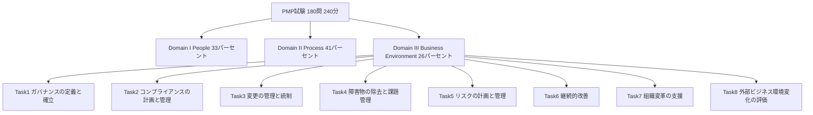
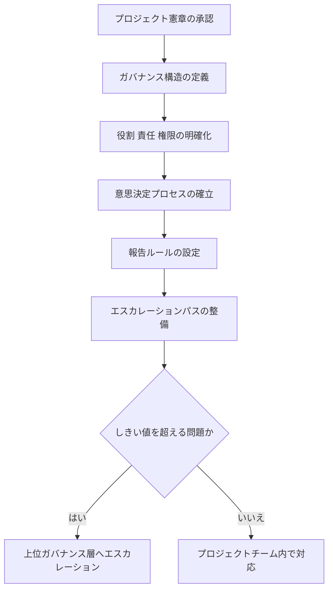
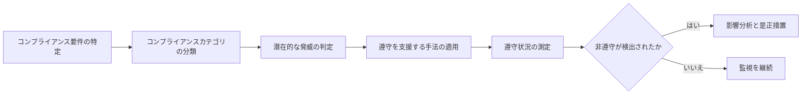
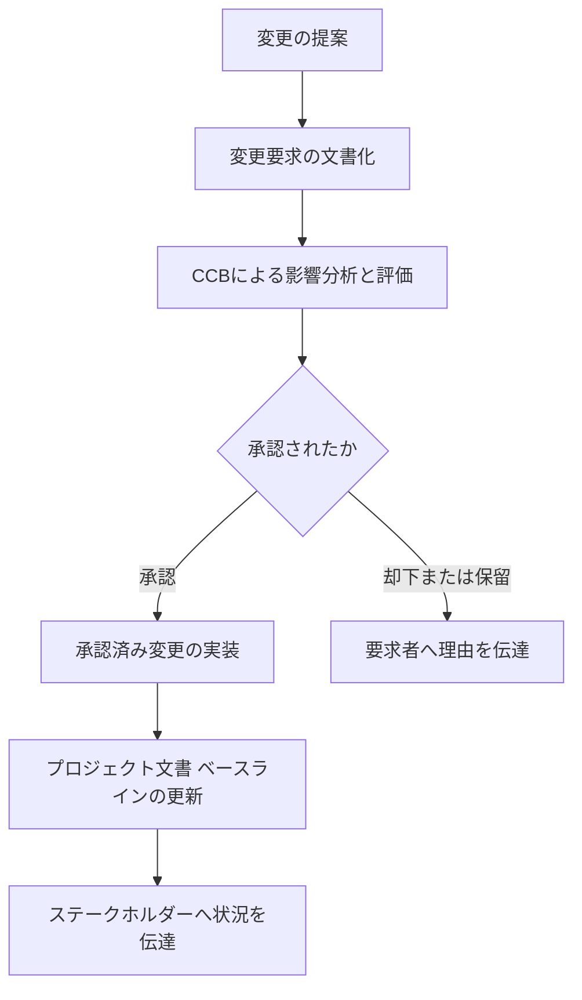
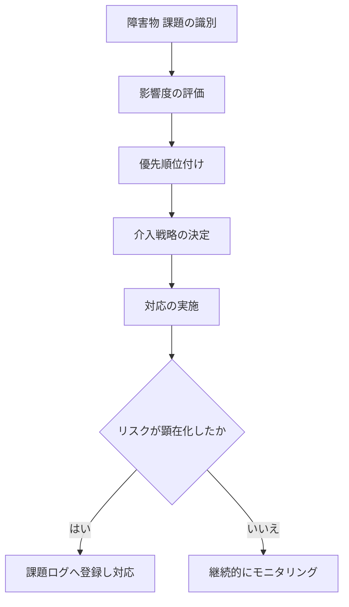
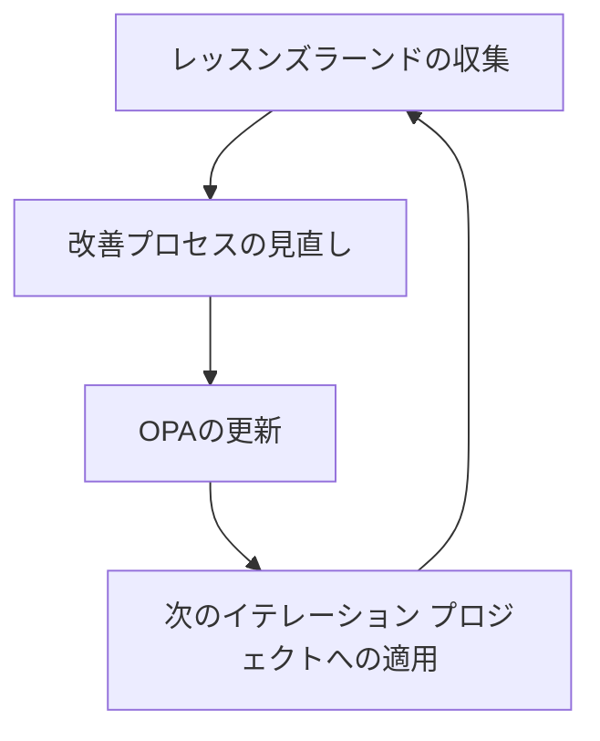
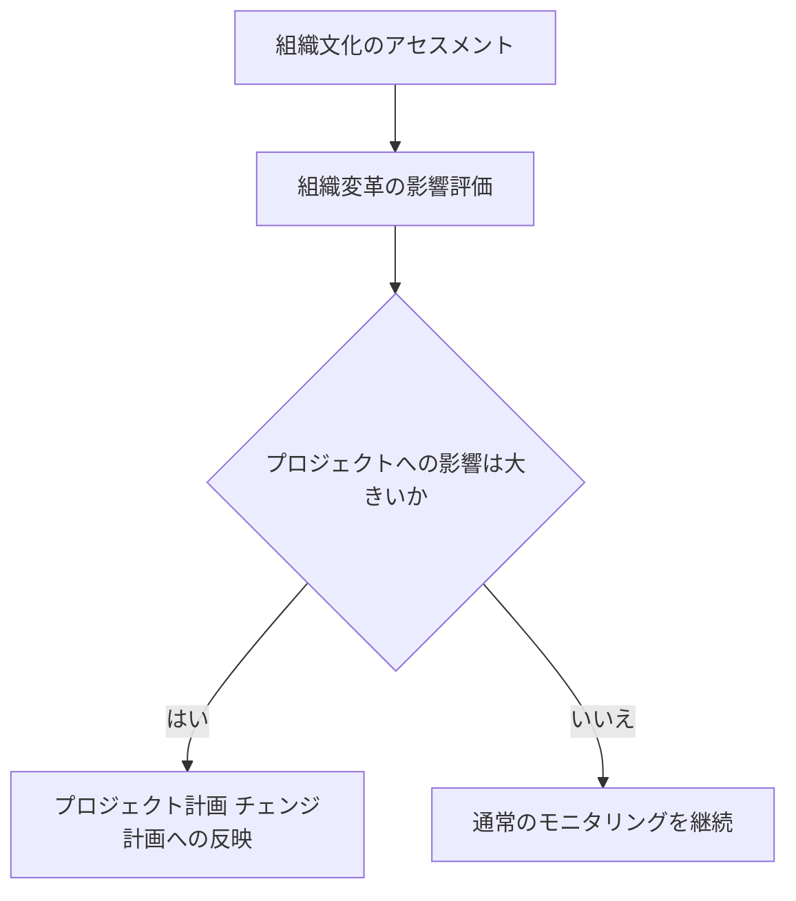
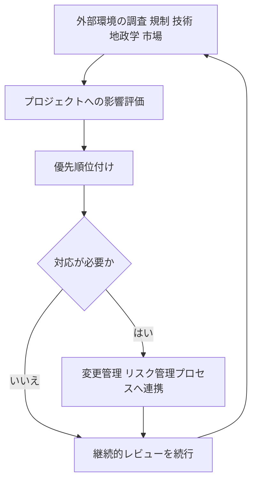
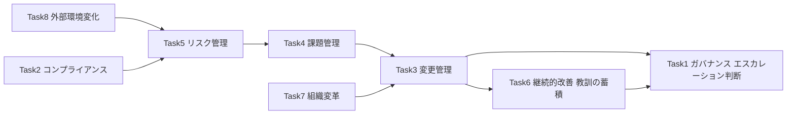

# PMP® Domain III: Business Environment 徹底解説ガイド（初学者向け）

> 本ガイドは PMI（Project Management Institute）が公開する **PMP® Certification Exam Content Outline – July 2026 Update** および PMI公式サイトの PMP認定ページ を一次情報源として、PMP試験の3ドメインのうち **Domain III: Business Environment（ビジネス環境）** を初学者向けにステップバイステップで解説するものです。原文の丸写しではなく、内容を咀嚼し直したうえで実務的な解説とベストプラクティスを付加しています。

---

## この記事の使い方

- **対象読者**: PMP受験を検討し始めた初学者、Domain IIIの学習を始めたい方
- **前提知識**: 不要（用語はすべて解説します）
- **図解ルール**: すべて Mermaid のフローチャートで表現し、ASCIIアートは使用していません。比較・整理はすべて Markdown表 で表現しています
- **情報の基準日**: 2026年7月改定版 ECO（Exam Content Outline）に基づく

---

## 目次

1. [用語ミニ辞典](#part0)
2. [Domain IIIの全体像を掴む](#part1)
3. [Business Environmentの8つのTaskを1つずつ理解する](#part2)
4. [8つのTask 全体まとめ表](#part3)
5. [学習のポイント（初学者向けTips）](#part4)
6. [参考文献・出典](#part5)

---

## Part 0. 用語ミニ辞典

Domain IIIの解説に入る前に、頻出する専門用語を先に押さえておきましょう。

| 用語 | 読み方・意味 |
|---|---|
| ECO（Exam Content Outline） | PMP試験の出題範囲を定義した公式文書。Domain・Task・Enablerの3階層で構成される |
| JTA（Job Task Analysis） | PMIが実施する職務分析。実際のプロジェクトマネージャーの業務実態を調査し、ECOの土台とする |
| PMBOK® Guide | PMIが発行するプロジェクトマネジメントの知識体系ガイド。ECOとは目的が異なる（後述） |
| OPA（Organizational Process Assets） | 組織のプロセス資産。過去のテンプレート、手順書、教訓データベースなど組織に蓄積されたノウハウ |
| CCB（Change Control Board） | 変更管理委員会。変更要求を評価し承認・却下を判断する機関 |
| PDU（Professional Development Unit） | 資格維持に必要な継続教育単位。認定後3年ごとに60PDUの取得が必要 |
| 予測型アプローチ（Predictive） | 従来型のウォーターフォール型開発アプローチ。要件を事前に確定してから計画・実行する |
| 適応型／アジャイル（Adaptive/Agile） | 短いイテレーションで計画と実行を繰り返す開発アプローチ |
| ハイブリッド（Hybrid） | 予測型とアジャイルを組み合わせたアプローチ |

---

## Part 1. Domain IIIの全体像を掴む

### 1-1. PMP試験全体におけるDomain IIIの位置づけ

PMP試験は3つのDomain（領域）から構成されており、それぞれに出題比率が決められています。

| Domain | 名称 | 出題比率 |
|---|---|---|
| Domain I | People（人） | 33% |
| Domain II | Process（プロセス） | 41% |
| Domain III | **Business Environment（ビジネス環境）** | **26%** |
| 合計 | — | 100% |

試験全体は180問（うち10問はスコアに影響しないプレテスト問題）、制限時間240分（4時間）で構成されます。単純計算では、180問中およそ47問前後がDomain IIIに関連する内容として出題される計算になります。

Domain IIIは3つのDomainの中では出題比率が最も低いものの、**プロジェクトが組織・法規制・市場といった「外側の世界」とどう向き合うか**を扱う領域であり、ガバナンス・コンプライアンス・リスク・変更管理・組織変革など、プロジェクトマネージャーが避けて通れない重要テーマを網羅しています。

以下は3つのDomainの構造をシンプルに図示したものです。

### 1-2. Domain・Task・Enablerという3階層構造を理解する

PMIのECOは、出題範囲を次の3階層で定義しています。

| 階層 | 定義 | 具体例（People Domainより） |
|---|---|---|
| **Domain（ドメイン）** | プロジェクトマネジメントの実務に不可欠な、高いレベルの知識領域 | People（人） |
| **Task（タスク）** | そのDomain内でプロジェクトマネージャーが担う責務 | 「知識移転を確実にする」 |
| **Enabler（イネーブラー）** | そのTaskに関連する具体的な業務例（網羅的リストではなく代表例） | 「プロジェクトに不可欠な知識を特定する」「知識を収集する」「知識移転が起きる環境を醸成する」 |

つまり、試験問題はEnablerそのものを丸暗記させるのではなく、**「このTaskの状況で、プロジェクトマネージャーとしてどう行動するのが最も適切か」**を問うシナリオ形式で出題されます。Enablerはあくまで「Taskが具体的にどんな業務を含むかを理解するためのヒント」として位置づけられています。

### 1-3. ECOとPMBOK® Guideの違い

初学者が混同しやすいポイントとして、ECOとPMBOK® Guideは目的が異なります。

| 観点 | ECO（試験内容基準） | PMBOK® Guide |
|---|---|---|
| 位置づけ | 実際のプロジェクトマネージャーの職務分析（JTA）に基づく試験の出題範囲 | 原則やプロセス、共通の技術領域を体系化した知識ガイド |
| 問い方 | 経験に基づくシナリオ問題で、状況に対する適切な行動を問う | 知識・プロセス・成果物の体系を学ぶための参考書 |
| 対応関係 | PMBOK® Guideの特定の章や記述と1対1で対応しているわけではない | ECOの土台にはなるが、試験問題は必ずしもPMBOK® Guideの用語通りには出題されない |

つまり、Domain IIIを学習する際も「PMBOK® Guideの章立てを丸暗記する」のではなく、「実際のプロジェクト現場でガバナンスやリスクにどう向き合うか」という実務的な視点を持つことが重要です。

### 1-4. 開発アプローチとDomain IIIの関係

ECOでは、予測型・適応型（アジャイル）・ハイブリッドという3つの開発アプローチが、特定のDomainに偏ることなく3つのDomainすべてに横断的に出題されると明記されています。

| アプローチ | 出題比率の目安 |
|---|---|
| 予測型（Predictive） | 約40% |
| 適応型（Agile）＋ハイブリッド（Hybrid）の合計 | 約60% |

これはDomain IIIにもそのまま当てはまります。たとえば「変更の管理と統制（Task 3）」は、予測型プロジェクトではCCBによる正式な変更管理プロセスとして出題される一方、アジャイル環境ではプロダクトバックログの優先順位付けという形で出題される可能性があります。学習の際は、**1つのTaskについて予測型・アジャイル両方の実務パターンを押さえる**意識を持つと得点力が上がります。

---

## Part 2. Business Environmentの8つのTaskを1つずつ理解する

Domain IIIは以下の8つのTaskで構成されています。ここから1つずつ、初学者向けに丁寧に解説していきます。

---

### Task 1. プロジェクトガバナンスの定義と確立

**Taskの主旨**：プロジェクトの意思決定の枠組み（誰が・何を・どうやって決めるか）を定義し、確立すること。

#### Enablerの整理

| Enabler（要約） | 初学者向けポイント |
|---|---|
| OPAを活用して、構造・ルール・手続き・報告・倫理・ポリシーを記述し確立する | ゼロから作るのではなく、組織に蓄積された過去のガバナンステンプレートやルールを再利用するのが基本 |
| 成功指標（success metrics）を定義する | 「プロジェクトが成功したと言える状態」を事前に数値・基準として合意しておく |
| ガバナンスのエスカレーションパスとしきい値を明確化する | 「どのレベルの問題が、誰の判断を仰ぐべきか」をあらかじめ決めておく |

#### 初学者向け解説

「ガバナンス（governance）」と聞くと堅苦しく感じるかもしれませんが、要は**「このプロジェクトでは誰がどんな権限を持ち、どうやって物事を決めるのか」というルールブック**のことです。ガバナンスが曖昧なプロジェクトでは、誰の承認を得ればよいか分からず意思決定が滞ったり、逆に権限のない人が勝手に重要な決定を下してしまったりします。

ガバナンス構造には一般的に、スポンサー、ステアリングコミッティ（運営委員会）、PMO（プロジェクトマネジメントオフィス）、プロジェクトマネージャー、プロジェクトチームといった階層が関わります。プロジェクトマネージャーの役割は、この構造を実際に機能させ、報告ルールや倫理規範、エスカレーションのしきい値（例：予算超過が10%を超えたら上位層に報告する、など）を具体的に定義することです。

#### ベストプラクティス

- ガバナンス構造とステークホルダーの権限を、プロジェクト憲章（Project Charter）の段階でスポンサーと合意しておく
- RACIチャートや意思決定権限マトリクス（Decision Rights Matrix）を用いて、誰が実行責任者（Responsible）で誰が説明責任者（Accountable）かを明確にする
- 成功指標はビジネス価値・アウトカムに紐づけ、単なるスコープ・スケジュール・コストだけに偏らせない
- エスカレーションのしきい値は数値（コスト超過率、スケジュール遅延日数など）で事前定義し、属人的な判断に頼らない
- 過去プロジェクトのOPA（ガバナンステンプレート、意思決定ログなど）を積極的に再利用する
- アジャイル環境では、ガバナンスを軽量化しつつも「透明性（visibility）」と「説明責任（accountability）」は絶対に犠牲にしない

#### プロセスイメージ

---

### Task 2. プロジェクトコンプライアンスの計画と管理

**Taskの主旨**：プロジェクトが遵守すべき法規制・基準・ポリシーを把握し、遵守状況を計画的に管理すること。

#### Enablerの整理

| Enabler（要約） | 初学者向けポイント |
|---|---|
| コンプライアンス要件を確認する（セキュリティ、健康・安全、サステナビリティ、規制遵守など） | 対象範囲が「法律」だけでなく、業界標準・組織ポリシー・サステナビリティ要件まで広い |
| コンプライアンスのカテゴリを分類する | 法的要件、契約要件、組織要件などに整理すると管理しやすい |
| コンプライアンスに対する潜在的な脅威を判定する | 規制変更や監査ギャップなど、遵守を脅かす要因を洗い出す |
| 遵守を支援する手法を用いる | チェックリスト、監査、第三者認証などのツールを活用する |
| 非遵守の結果を分析する | 罰金・契約解除・レピュテーション毀損など、影響を具体的に想定する |
| 必要なアプローチとアクションを決定する | 脅威の深刻度に応じて対応策を選ぶ |
| プロジェクトがどの程度遵守できているかを測定する | 定期的な監査やレポートで遵守状況を可視化する |

#### 初学者向け解説

コンプライアンスは「法律を守ること」だけをイメージしがちですが、ECOでは**セキュリティ、健康・安全、サステナビリティ（環境・社会・ガバナンス）、規制遵守**という幅広い範囲が明示されています。特に近年はサステナビリティやAI活用に関する規制・ガイドラインも急速に増えており、プロジェクトマネージャーはこうした変化にも継続的に目を配る必要があります。

重要なのは、コンプライアンスを**事後対応（reactive）ではなく事前計画（proactive）**として扱うことです。プロジェクト計画の初期段階でコンプライアンス要件を洗い出し、リスク登録簿や品質計画と連携させておくことで、後から手戻りが発生するリスクを大幅に減らせます。

#### ベストプラクティス

- 規制・コンプライアンス要件を初期段階でリスク登録簿に組み込み、他のプロジェクトリスクと同列で管理する
- コンプライアンスマトリクス（要件・根拠法令・担当者・証跡）を作成し、要件ごとの対応状況を追跡する
- 法務・監査・情報セキュリティ部門と定例で連携し、規制動向の変化を早期にキャッチする
- 非遵守時の影響（罰金額、契約解除条件、レピュテーション毀損）を定量化し、対応の優先順位付けに使う
- サステナビリティ（ESG）要件も他のコンプライアンス項目と同じ重みで計画段階から明示する
- 遵守状況を定期的に監査・レポートし、監査証跡（エビデンス）を必ず残しておく

#### プロセスイメージ

---

### Task 3. 変更の管理と統制

**Taskの主旨**：発生した変更要求を正式なプロセスに沿って評価・承認し、確実にプロジェクトへ反映すること。

#### Enablerの整理

| Enabler（要約） | 初学者向けポイント |
|---|---|
| 変更管理プロセスを実行する | 変更要求の受付から承認までの一連の流れを回す |
| 提案された変更のステータスを伝達する | 承認待ち・承認済み・却下などの状況をステークホルダーに周知する |
| 承認された変更をプロジェクトに実装する | 承認されたものだけを実行し、無許可の変更を防ぐ |
| プロジェクト文書を更新し変更を反映する | スコープ記述書・スケジュール・予算などのベースラインを更新する |

#### 初学者向け解説

「変更管理（Change Control）」は、統合変更管理（Integrated Change Control）とも呼ばれ、プロジェクトの3大制約（スコープ・スケジュール・コスト）だけでなく品質やリスクへの影響も含めて変更を評価する仕組みです。予測型プロジェクトでは、CCB（Change Control Board：変更管理委員会）が変更要求を正式に審査し、承認・却下・保留を判断します。

一方でアジャイル環境では、正式なCCBを置かない代わりに、プロダクトオーナーがプロダクトバックログの優先順位を継続的に見直すことで「変更」を扱います。つまり**アジャイルにも変更管理は存在しますが、その形が「正式な承認プロセス」から「継続的な優先順位付け」に変わる**という点が試験でも問われやすいポイントです。

#### ベストプラクティス

- 変更管理計画（Change Management Plan）を事前に定義し、承認フロー・権限者を明確にしておく
- すべての変更要求を単一の変更ログ（Change Log）で一元管理し、抜け漏れを防ぐ
- 影響分析（スコープ・スケジュール・コスト・品質・リスクへの影響）を必須ステップとして組み込む
- 承認結果にかかわらず、要求者へ理由とともに必ずフィードバックする
- ベースラインの更新は承認後にのみ行い、無許可の変更（スコープクリープ）を防止する
- アジャイル環境ではプロダクトバックログの優先順位付けという軽量な形で変更を扱う
- 変更のステータスをステークホルダーへタイムリーに伝達し、透明性を確保する

#### プロセスイメージ

---

### Task 4. 障害物の除去と課題管理

**Taskの主旨**：チームの作業を妨げる障害物を取り除き、リスクが顕在化した課題（issue）に対応すること。

#### Enablerの整理

| Enabler（要約） | 初学者向けポイント |
|---|---|
| 障害物の影響を評価する | 放置した場合にどれだけプロジェクトへ影響するかを見積もる |
| 障害物を優先順位付けし強調する | 影響の大きいものから対処する |
| 障害物を除去・最小化する介入戦略を決定し適用する | PM自らが動くか、他のリソースを動員するかを判断する |
| チームの障害物が対応されているか継続的に再評価する | 一度対応して終わりではなく、繰り返し確認する |
| リスクが課題に変わったタイミングを認識する | 「起こるかもしれない」が「実際に起きた」に変わった瞬間を見逃さない |
| 関係するステークホルダーと解決策を協働で検討する | PM一人で抱え込まず、関係者を巻き込む |

#### 初学者向け解説

「障害物（impediment）」はアジャイルの文脈（デイリースタンドアップで報告される「ブロッカー」）でよく使われる言葉で、「課題（issue）」はより公式な課題管理台帳（Issue Log）で管理される概念です。両者は似ていますが、**障害物はチームの日々の作業を妨げるもの、課題はより広い意味でプロジェクトに影響を与える未解決の問題**と捉えると整理しやすくなります。

特に重要なのが「リスクが課題になる瞬間を認識する」という点です。リスクはあくまで「将来起こるかもしれない不確実な事象」ですが、それが実際に発生した時点で「課題」に変わります。この移行を見逃さず、リスク登録簿から課題ログへ確実に引き継ぐことが求められます。

#### ベストプラクティス

- デイリースタンドアップなどの短いチェックインで障害物を早期に可視化する
- 課題ログ（Issue Log）を維持し、優先度・担当者・期限を必ず明記する
- リスクが顕在化した際は速やかにリスク登録簿から課題ログへ移行させる
- Task 1で確立したエスカレーションパスと連携し、PMの権限を超える障害物は上位層へ引き上げる
- チームの障害物を取り除くことはPM／スクラムマスターの重要な役割（サーバントリーダーシップ）と捉える
- 同種の障害物が繰り返し発生する場合は、根本原因分析（RCA：Root Cause Analysis）を実施する

#### プロセスイメージ

---

### Task 5. リスクの計画と管理

**Taskの主旨**：プロジェクトに影響しうる不確実性を特定・分析し、計画的に対応・監視すること。

#### Enablerの整理

| Enabler（要約） | 初学者向けポイント |
|---|---|
| リスクを特定する | 起こりうる不確実な事象を洗い出す |
| リスクを分析する | 発生確率と影響度を評価する（定性的・定量的） |
| リスクを監視しコントロールする | 継続的にリスク状況を追跡する |
| リスクマネジメント計画を策定する | どうリスクに向き合うかの方針を定める |
| リスク登録簿を維持する（例：ITセキュリティの不備） | すべてのリスクを一元管理する台帳を持つ |
| リスクマネジメント計画を実行する（例：セキュリティリスクへの対応、サステナビリティリスクの管理） | 計画倒れにせず、実際に対応策を実行する |
| プロジェクトへのリスク影響状況を伝達する | ステークホルダーに状況を継続的に共有する |

#### 初学者向け解説

リスクマネジメントは「悪いことが起きないようにする」だけの活動ではありません。PMBOK的な考え方では、リスクには**脅威（threat：望ましくない影響）**と**好機（opportunity：望ましい影響）**の両方が含まれます。リスク対応戦略としては、回避（Avoid）・転嫁（Transfer）・軽減（Mitigate）・受容（Accept）に加え、好機に対しては活用（Exploit）・共有（Share）・強化（Enhance）といった戦略があります。

ECOの例示にもある通り、ITセキュリティやサステナビリティに関するリスクも、通常のプロジェクトリスクと同様にリスク登録簿で管理し、リスクオーナーを割り当てて対応する必要があります。近年はサイバーセキュリティやサステナビリティに関するリスクの重要性が高まっており、試験でもこうした現代的なテーマを扱ったシナリオが出題される傾向にあります。

#### ベストプラクティス

- プロジェクト初期にリスクマネジメント計画を策定し、組織・ステークホルダーのリスク許容度（risk appetite）を明確化する
- リスク登録簿を継続的に更新し、すべてのリスクに責任を持つリスクオーナーを割り当てる
- 発生確率と影響度のマトリクスを用いて定性的・定量的分析を組み合わせ、優先順位を付ける
- コンティンジェンシー予備（既知のリスク用）とマネジメント予備（未知のリスク用）を確保する
- セキュリティやサステナビリティに関するリスクも、通常のプロジェクトリスクと同じ厳密さで管理する
- リスクステータスを定期的にステークホルダーへ報告し、透明性を確保する
- アジャイル環境では、スプリントレビューやレトロスペクティブにリスクレビューを組み込む

#### プロセスイメージ

---

### Task 6. 継続的改善

**Taskの主旨**：プロジェクトを通じて得られた教訓を組織の資産として蓄積し、継続的な改善サイクルを回すこと。

#### Enablerの整理

| Enabler（要約） | 初学者向けポイント |
|---|---|
| レッスンズラーンド（教訓）を活用する | 過去の経験を今のプロジェクトに活かす |
| 継続的改善プロセスが更新されていることを確実にする | 改善の仕組み自体も定期的に見直す |
| OPAを更新する | 得られた知見を組織全体の資産として残す |

#### 初学者向け解説

継続的改善は、プロジェクトの**終了時にまとめて振り返る**ものだと誤解されがちですが、実際には**プロジェクトを通じて継続的に**行うものです。アジャイルのレトロスペクティブ（振り返り）はその典型例で、各イテレーションの終わりに「うまくいったこと」「改善すべきこと」「次に試すこと」を短いサイクルで回します。

重要なのは、得られた教訓を個人やチームの中だけに留めず、**OPA（組織のプロセス資産）として組織全体に還元する**ことです。これにより、同じ失敗を別のプロジェクトで繰り返すリスクを減らし、組織全体の成熟度を高めることができます。

#### ベストプラクティス

- プロジェクト終了時だけでなく、フェーズの節目やイテレーションごとにレッスンズラーンドを収集する
- レトロスペクティブ（振り返り）を定例化し、改善アクションを次のサイクルに確実に反映する
- 得られた知見をテンプレート・チェックリスト・過去データとしてOPAへ反映し、組織全体の資産にする
- 改善の効果を測定する指標（サイクルタイムの短縮、手戻り率の低下など）を設定する
- 率直なフィードバックが出やすいよう、心理的安全性（psychological safety）を確保する

#### プロセスイメージ

---

### Task 7. 組織変革の支援

**Taskの主旨**：プロジェクトが組織にもたらす変化を理解し、組織側の受け入れ準備を支援すること。

#### Enablerの整理

| Enabler（要約） | 初学者向けポイント |
|---|---|
| 組織文化をアセスメントする | 変化に対する組織の受け入れやすさを見極める |
| 組織変革がプロジェクトに与える影響を評価し必要なアクションを決定する | 組織側の変化がプロジェクトの前提を揺るがすことがある |

#### 初学者向け解説

プロジェクトは多くの場合、単に成果物を作るだけでなく、**組織のプロセスや働き方そのものを変える**ことを目的としています（例：新しい基幹システムの導入、業務プロセスの再設計）。このとき、プロジェクトマネージャーは技術的な納品物の管理だけでなく、**組織の受け入れ準備（readiness）**にも目を配る必要があります。

たとえば、組織文化が変化に対して保守的である場合、どれだけ優れたシステムを納品しても現場で使われなければプロジェクトは実質的に失敗です。逆に、組織側で進行中の別の変革（M&A、大規模な組織再編など）がプロジェクトの前提条件を覆すこともあります。プロジェクトマネージャーはこうした組織側の動きを常に把握し、必要に応じてプロジェクト計画を調整する役割を担います。

#### ベストプラクティス

- プロジェクト開始前に組織文化とチェンジレディネス（変革への準備度）を評価する
- 変革影響評価（Change Impact Assessment）を実施し、影響を受ける部門・役割・業務プロセスを特定する
- チェンジマネジメント計画をプロジェクトマネジメント計画と連携させ、別々の取り組みにしない
- スポンサーシップを可視化し、経営層からの一貫したメッセージ発信を後押しする
- 抵抗（resistance）の兆候を早期に察知し、コミュニケーションとトレーニングで対応する
- プロジェクト終了後も変革の定着度（サステインメント）をモニタリングする

#### プロセスイメージ

---

### Task 8. 外部ビジネス環境変化の評価

**Taskの主旨**：規制・技術・地政学・市場といった外部環境の変化を継続的に把握し、プロジェクトへの影響を評価すること。

#### Enablerの整理

| Enabler（要約） | 初学者向けポイント |
|---|---|
| 外部ビジネス環境の変化を調査する（規制、技術、地政学、市場など） | プロジェクトの外側で何が起きているかを常にウォッチする |
| 外部環境の変化がプロジェクトスコープ／バックログに与える影響を評価し優先順位付けする | 変化を検知したら、対応の要否と優先度を判断する |
| プロジェクトスコープ／バックログへの影響について外部環境を継続的にレビューする | 一度きりの調査ではなく、継続的な監視活動として捉える |

#### 初学者向け解説

このTaskは、いわゆる**PESTLE分析**（政治・経済・社会・技術・法規制・環境）に近い考え方で、プロジェクトを取り巻く外部環境の変化をプロジェクトマネージャーが継続的に監視することを求めています。ECOでは特に「規制」「技術」「地政学」「市場」の4点が具体例として挙げられています。

現代のプロジェクトでは、AI技術の急速な進化、地政学的な緊張（貿易規制・関税など）、サプライチェーンの変動など、外部環境の変化がプロジェクトのスコープや前提条件に直接影響を与えるケースが増えています。重要なのは、これを**プロジェクト計画時の一度きりの分析で終わらせず、プロジェクト期間中を通じて継続的にレビューする**ことです。

#### ベストプラクティス

- 規制・技術・地政学・市場の動向を対象に、定例で外部環境スキャンを実施する
- 外部変化がプロジェクトスコープ／バックログに与える影響を評価し、対応の優先順位を付ける
- 外部環境スキャンの結果をTask 3（変更管理）・Task 5（リスク管理）のプロセスと連携させる
- 業界動向・競合・サプライチェーンの変化を継続的にモニタリングする
- 地政学的リスク（関税、貿易規制、地域紛争など）を定期的にレビュー対象に含める
- 変化の兆候をとらえる先行指標（leading indicators）を定義し、後手に回らないようにする

#### プロセスイメージ

---

## Part 3. 8つのTask 全体まとめ表

学習の総復習用に、Domain IIIの8つのTaskを一覧化しました。

| No | Task名 | 中心テーマ | 主に関連するEnabler数 |
|---|---|---|---|
| 1 | プロジェクトガバナンスの定義と確立 | 意思決定の枠組み・エスカレーション | 3 |
| 2 | プロジェクトコンプライアンスの計画と管理 | 法規制・セキュリティ・サステナビリティ遵守 | 7 |
| 3 | 変更の管理と統制 | 変更要求の評価・承認・実装 | 4 |
| 4 | 障害物の除去と課題管理 | ブロッカー対応・リスクから課題への移行 | 6 |
| 5 | リスクの計画と管理 | リスク特定・分析・対応・監視 | 7 |
| 6 | 継続的改善 | レッスンズラーンド・OPA更新 | 3 |
| 7 | 組織変革の支援 | 組織文化・チェンジマネジメント | 2 |
| 8 | 外部ビジネス環境変化の評価 | 規制・技術・地政学・市場の監視 | 3 |

### Task間の連携イメージ

Domain IIIの8つのTaskは独立して機能するのではなく、相互に連携しています。特にTask 3（変更管理）・Task 4（課題管理）・Task 5（リスク管理）・Task 8（外部環境評価）は密接に関連しており、外部環境の変化がリスクや課題を生み、それが変更要求につながるという流れが典型的です。

---

## Part 4. 学習のポイント（初学者向けTips）

### 4-1. 出題形式を知っておく

PMP試験は単純な用語の暗記ではなく、**シナリオ（状況設定）に基づいて「次に何をすべきか」を問う形式**が中心です。2026年7月改定版のECOでは、ケース／シナリオ形式やグラフィックを用いた問題形式が新たに追加されており、より実務に近い判断力が問われる傾向が強まっています。

### 4-2. Domain IIIならではの視点

Domain IIIの問題を解く際は、次のような視点を意識すると精度が上がります。

- **「誰が決めるべきか」を常に考える**：Task 1のガバナンス構造を踏まえ、PM単独で判断してよい範囲か、エスカレーションが必要な範囲かを区別する
- **予測型かアジャイルかで対応の形が変わる**：同じ「変更」でも、CCBでの正式承認なのか、バックログの優先順位付けなのかで正解の選択肢が変わりうる
- **リスクと課題を混同しない**：「まだ起きていないこと」はリスク、「実際に起きたこと」は課題として扱う
- **受動的（reactive）ではなく能動的（proactive）な選択肢を選ぶ**：コンプライアンスやリスクへの対応は、事前の計画・監視を伴う選択肢が正解になりやすい

### 4-3. オリジナル演習シナリオ（学習用）

以下は本ガイド独自に作成した、Domain IIIの考え方を練習するための例題です（PMI公式問題の引用ではありません）。

> **シナリオ**：ハイブリッド開発で進行中のプロジェクトで、主要な外部サプライヤーが新たな貿易規制により部材の納期を4週間遅延させる可能性があると連絡してきた。プロジェクトにはスケジュール予備がほとんど残っていない。
>
> **考え方**：これはTask 8（外部ビジネス環境変化の評価）とTask 5（リスクの計画と管理）が交差する状況です。まず影響範囲を評価し（Task 8）、既存のリスク登録簿を更新して対応策を検討し（Task 5）、対応にスコープやスケジュールの変更が必要であれば正式な変更管理プロセスに乗せる（Task 3）、という流れで整理すると、試験のシナリオ問題にも応用しやすい考え方になります。

### 4-4. 他Domainとのつながりを意識する

Domain IIIの内容は、Domain II（Process）のTask 5「調達の計画と管理」やTask 6「財務の計画と管理」、Domain I（People）のTask 2「対立の管理」などとも密接に関連しています。Domain IIIだけを切り離して学習するのではなく、People・Processの学習と並行して「この状況ならどのDomainのどのTaskの視点で考えるべきか」を整理する習慣をつけることをお勧めします。

---

## Part 5. 参考文献・出典

本ガイドの内容は、以下のPMI公式情報源に基づいています。詳細な一次情報は必ず公式サイト・公式PDFをご確認ください。

- Project Management Institute, *Project Management Professional (PMP)® Examination Content Outline – July 2026 Update*（Domain III: Business Environment—26% の Task／Enabler 一覧の一次情報源）
  https://www.pmi.org/-/media/pmi/documents/public/pdf/certifications/new-pmp-examination-content-outline-2026.pdf?rev=b618cf45573e4276a54151e7636c97bf
- PMI公式サイト *Project Management Professional (PMP)® Certification* ページ（試験概要、出題比率、受験資格、試験形式）
  https://www.pmi.org/certifications/project-management-pmp
- PMI *PMBOK® Guide* 紹介ページ（ECOとPMBOK® Guideの関係を理解するための参考）
  https://www.pmi.org/standards/pmbok
- PMI *Certification Resources – Maintain & Renew Your Certification*（PDU・資格更新に関する情報）
  https://www.pmi.org/certifications/certification-resources/maintain
- PMI *Certification FAQs*（受験資格・試験運用に関するFAQ）
  https://www.pmi.org/certifications/certification-resources/faq

> **注記**：PMP認定試験の内容・出題比率・受験資格は改定される可能性があります。学習を開始する前に、必ず上記PMI公式サイトで最新版のECOを確認してください。本ガイドは2026年7月改定版ECOの内容に基づいています。

---

*本ガイドは教育・学習目的で作成されたものであり、PMI公式の教材・模擬試験・受験対策コースを代替するものではありません。*
