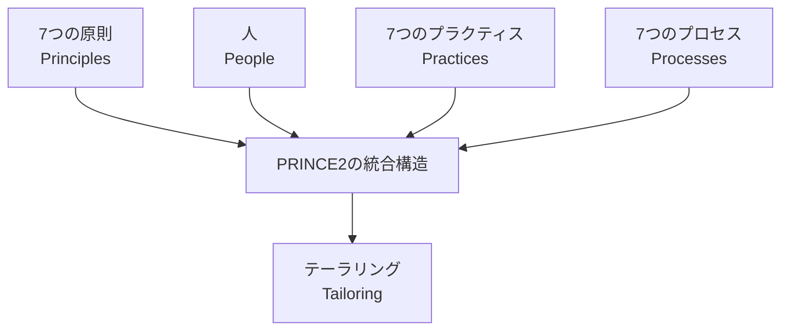
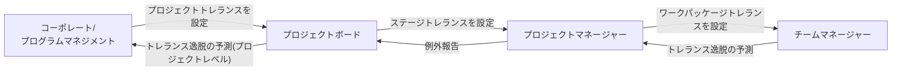
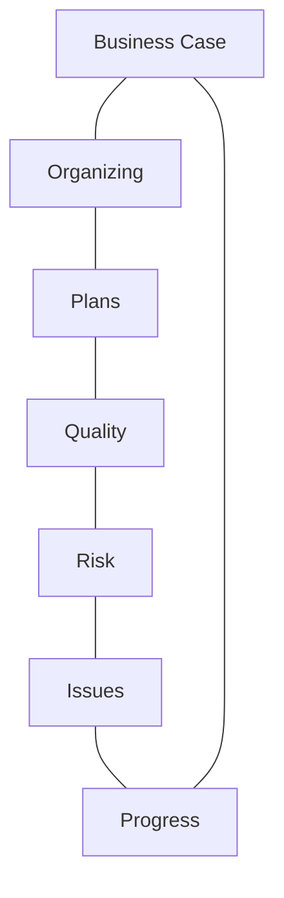
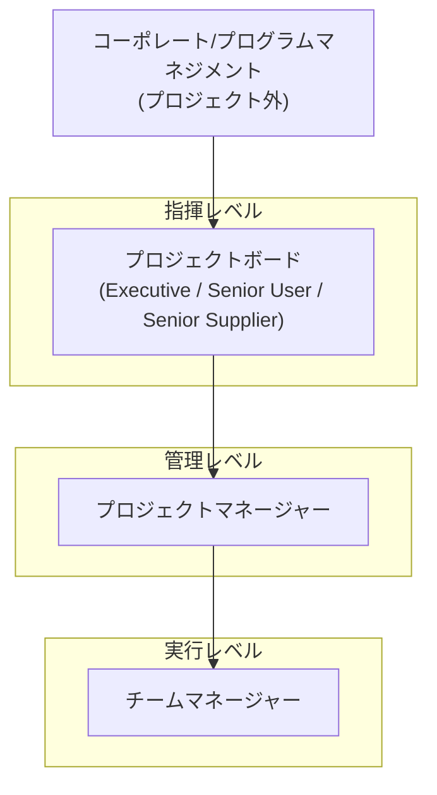
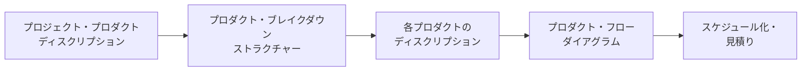
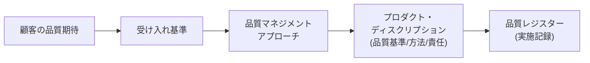
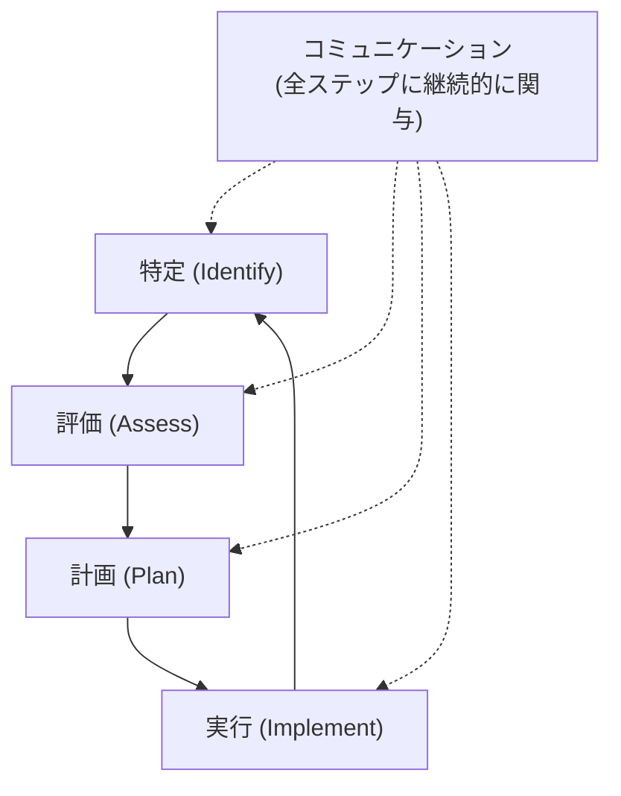
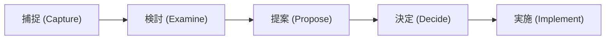
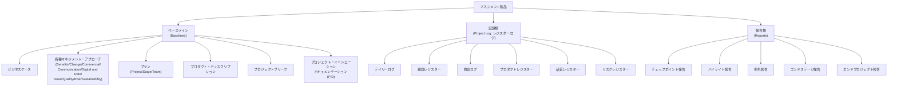
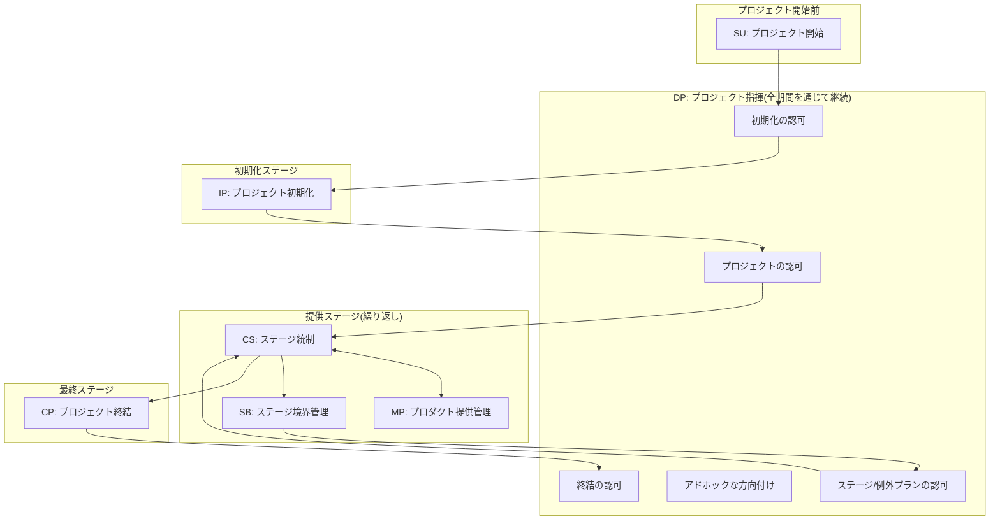

# PRINCE2® Project Management Foundation (Version 7) 学習ガイド

> 対象試験: **PRINCE2 Project Management Foundation (Version 7)** — PeopleCert実施
> 本ガイドは初学者が「なぜそうするのか」を理解しながら、出題範囲の各項目を体系的に押さえられるように構成しています。ASCII図は使用せず、フローチャートは Mermaid、比較・一覧情報は Markdown表を使用しています。

---

## 0. 試験の全体像(まずここを把握する)

| 項目 | 内容 |
|---|---|
| 出題形式 | 選択式 (Multiple Choice) 60問 |
| 試験時間 | 60分 |
| 方式 | Closed book(参考資料の持ち込み不可) |
| 合格基準 | 60% 以上(60問中36問以上正解) |
| 対応言語 | 英語・日本語を含む14言語 |
| 認定更新 | 3年ごと。更新にはCPD(継続的専門能力開発)60ポイントが必要 |

> **補足(V6→V7での構造変化):** PRINCE2 7版では、旧版の「7つのテーマ(Themes)」が **「7つのプラクティス(Practices)」** に名称変更され、そのうち旧「Change」テーマが **「Issues」プラクティス** に改称されました。さらに新章として **「People(人)」** が追加され、**サステナビリティ(持続可能性)** が Progress/Business Case等の既存プラクティスに統合され、**デジタル&データマネジメント(Digital and Data)** の視点が全体に組み込まれています。原則(Principles)7つ・プロセス(Processes)7つの数と名称は旧版から変更ありません。
> (出典: [PeopleCert公式ページ](https://www.peoplecert.org/browse-certifications/project-programme-and-portfolio-management/PRINCE2-2/PRINCE2-7-foundation-3579)、[onlinepmcourses.com「Top 10 Changes」](https://onlinepmcourses.com/prince2-7th-edition-the-top-10-changes-you-need-to-know/))

### 出題される知識領域(PeopleCert公式「学習内容」より)

1. Project Management Principles(7つの原則)
2. Project Management Practices(7つのプラクティス)
3. Project Management Processes(7つのプロセス)
4. Roles and Responsibilities(役割と責任)
5. People Management(人のマネジメント)
6. Project Performance(サステナビリティ統合を含む)
7. Digital and Data Management(デジタル&データマネジメント)
8. Communication(コミュニケーション)
9. Tailoring(テーラリング)

---

## 1. PRINCE2とは何か / プロジェクトの文脈

PRINCE2(**PR**ojects **IN** **C**ontrolled **E**nvironments)は、英国発祥で世界的に採用されているプロジェクトマネジメント手法です。業種・規模を問わず適用できる「汎用フレームワーク」であり、公式マニュアル『Managing Successful Projects with PRINCE2』第7版が拠り所となります。

- プロジェクトの定義:「ビジネス上の成果物(プロダクト)を、合意されたビジネスケースにもとづいて創出するために編成された、一時的な組織」
- **プロジェクトは"一時的"** であり、日常業務(BAU: Business As Usual)とは異なる。
- PRINCE2は**プロセスベース**の手法であり、原則・プラクティス・プロセスが相互に関係し合う構造を持つ。

> **ベストプラクティス:** 原則は「守るべき絶対条件」、プラクティスは「継続的に扱うべき観点」、プロセスは「実行の手順」と整理して覚えると混同しにくい。試験でも「これは原則か、プラクティスか」を問う設問が頻出する。

---

## 2. 7つの原則(Principles)

原則はPRINCE2プロジェクトであるための**必須条件**です。7つすべてを満たさないプロジェクトは「PRINCE2ベース」を名乗れません。

| # | 原則(英語) | 原則(日本語) | 要点 |
|---|---|---|---|
| 1 | Continued Business Justification | 継続的なビジネス上の正当化 | プロジェクトは常に「望ましさ(Desirability)」「実現可能性(Viability)」「達成可能性(Achievability)」を満たす必要がある |
| 2 | Learn from Experience | 経験からの学習 | 過去の教訓を取り入れ、自らの教訓も記録し継承する |
| 3 | Defined Roles and Responsibilities | 明確な役割と責任 | ビジネス・ユーザー・サプライヤーの3つの利害関係者の視点を明示的に代表する体制を作る |
| 4 | Manage by Stages | 段階(ステージ)による管理 | プロジェクトを管理可能な単位(マネジメントステージ)に分割し、段階ごとに計画・監視・統制する |
| 5 | Manage by Exception | 例外による管理 | 各レベルに許容範囲(トレランス)を委譲し、逸脱が予測される場合のみ上位へエスカレーションする |
| 6 | Focus on Products | プロダクトへの焦点 | 「何を作るか」を起点に計画し、要求事項・品質基準を明確化する |
| 7 | Tailor to the Project Environment | プロジェクト環境へのテーラリング | 規模・複雑さ・重要性・リスク等に応じて手法を調整する(方法自体は削らないが適用度合いを変える) |

### 2.1 原則の詳細解説

**① 継続的なビジネス上の正当化**
- 「望ましさ」= コスト・便益・リスクのバランスが取れているか
- 「実現可能性」= プロダクトを実際に提供できるか
- 「達成可能性」= 提供後に期待した便益(ベネフィット)が実現できるか
- この正当化はビジネスケース(Business Case)practiceによって文書化・継続検証される。

> **ベストプラクティス:** ビジネスケースは「一度作って終わり」ではなく、各マネジメントステージ境界(Stage Boundary)で必ず見直す。正当化が崩れた時点でプロジェクトは中止すべきであり、これは失敗ではなく正しいガバナンスの証拠と理解する。

**② 経験からの学習**
- プロジェクト開始時:類似プロジェクトの教訓を探す
- 実行中:教訓ログ(Lessons Log)に継続記録
- 終結時:教訓報告(Lessons Report)として組織に還元

**③ 明確な役割と責任**
- PRINCE2は「ビジネス」「ユーザー」「サプライヤー」の3視点を常に代表させることを要求する。
- 詳細は本ガイド「6. 役割と責任」を参照。

**④ 段階による管理**
- 最低2つのマネジメントステージ(初期化ステージ+提供ステージ)が必要。
- ステージ数はリスク・不確実性の高さに応じて増減する(不確実性が高いほど、ステージを短く刻む)。

**⑤ 例外による管理**
- トレランス(Tolerance)は7つの目標領域で設定される:**時間(Time)・コスト(Cost)・品質(Quality)・スコープ(Scope)・リスク(Risk)・便益(Benefit)・サステナビリティ(Sustainability)**
- トレランスを超える(または超えると予測される)場合のみ、例外報告(Exception Report)により上位層へエスカレーションする。
- これにより、上位マネジメントは日常業務ではなく戦略的意思決定に集中できる。

**⑥ プロダクトへの焦点**
- プロジェクト・プロダクト・ディスクリプション(Project Product Description)で最終成果物の要求事項・品質基準・受け入れ基準を定義する。
- ここから個々のプロダクト・ディスクリプション(Product Description)へブレイクダウンする「プロダクトベース・プランニング」につながる(詳細は「4.3 Plans」)。

**⑦ テーラリング**
- テーラリングは「原則を省略すること」ではない。プラクティスの**適用の厚み**やプロセスの**形式度**を調整することを指す。
- 小規模プロジェクトでは、複数の役割を1人が兼務したり、報告書を簡略化したりできる(ただし兼務不可の組み合わせがある。「6. 役割と責任」参照)。

---

## 3. People(人) — V7で新設された章

PRINCE2 7版最大の変更点の一つが、この「People」章の新設です。従来版は手法・統制プロセスに重点を置いていましたが、V7では「プロジェクトを成功させるのは結局は人である」という前提を明示しました。

### 3.1 Peopleに関する3つの活動

| 活動 | 内容 |
|---|---|
| Leading Successful Change(効果的な変革のリード) | プロジェクトはアウトプット提供だけでなく、組織における行動・文化の変化を伴う。変革管理の観点(ステークホルダーの受容度、抵抗への対処)を統合する |
| Leading Successful Teams(効果的なチームのリード) | チーム形成、動機づけ、心理的安全性、分散/バーチャルチームのマネジメントなど |
| Communication(コミュニケーション) | ステークホルダーとの双方向コミュニケーションの計画と実践 |

> **ベストプラクティス:** 「People」は独立した1プラクティスとしてではなく、7原則・7プラクティス・7プロセス**すべてに横断的に関わる基盤**として位置づけられている。試験では「Peopleはどのプラクティスに属するか」ではなく「プロジェクト全体にどう統合されるか」という視点で出題されやすい。

### 3.2 コミュニケーション・マネジメント・アプローチ

- ステークホルダーとの情報共有方法を定める文書 **Communication Management Approach(コミュニケーション・マネジメント・アプローチ)** はV6で導入された用語で、V7でもそのまま引き継がれている(V5では「Communication Management Strategy」と呼ばれていた)。
- 内容:誰に・何を・いつ・どの手段で・誰が責任を持つか、を定義する。

(出典: [Managing Successful Projects with PRINCE2 7th Edition 目次(scribd)](https://www.scribd.com/document/799374849/Managing-Successful-Projects-With-PRINCE2-7-Watermarked)、[knowledgetrain.co.uk PRINCE2マニュアル解説](https://www.knowledgetrain.co.uk/project-management/prince2/prince2-manual-managing-successful-projects-with-prince2))

---

## 4. 7つのプラクティス(Practices)

プラクティスは、プロジェクトの間**継続的に**扱われるべき側面です。旧版の「テーマ(Themes)」から名称変更されました。

| # | プラクティス | 目的(一言で) |
|---|---|---|
| 1 | Business Case(ビジネスケース) | プロジェクトが望ましく・実現可能で・達成可能であることを継続的に検証する |
| 2 | Organizing(組織化) | 説明責任(アカウンタビリティ)の構造を定義する |
| 3 | Plans(計画) | 誰が・何を・いつ・どこで・どのように・いくらで実行するかを定義する |
| 4 | Quality(品質) | ユーザーの要求と期待を満たすことを保証する |
| 5 | Risk(リスク) | 不確実な事象を特定・評価・統制する |
| 6 | Issues(課題) | 課題に対応し、ベースラインへの変更を統制する(旧版の「Change」テーマから改称) |
| 7 | Progress(進捗) | 計画に対する現在地を追跡・監視・統制する |

### 4.1 Business Case(ビジネスケース)

**目的:** プロジェクトの望ましさ・実現可能性・達成可能性を確立し、意思決定の判断材料を提供し続ける。

- **アウトラインビジネスケース**(SUプロセスで作成)→**詳細ビジネスケース**(IPプロセスで発展)へと段階的に精緻化される。
- 検証タイミング:各ステージ境界(Managing a Stage Boundary)、重要な例外発生時。
- 構成要素の例:理由(Reasons)、選択肢の検討、期待便益/非便益、コスト、タイムスケール、投資評価、主要リスク。

> **ベストプラクティス:** ビジネスケースの「所有者」は常に**エグゼクティブ(Executive)**である。プロジェクトマネージャーはビジネスケースを作成・維持する実務を担うが、最終的な正当化の判断責任はエグゼクティブにある、という役割分担を混同しないこと。

**便益管理アプローチ(Benefits Management Approach)**
- プロジェクト完了後の便益realizationをどう測定するかを定義する文書。プロジェクト終結後(場合によっては数年後)まで継続する点が特徴。

### 4.2 Organizing(組織化)

**目的:** プロジェクトの説明責任構造(誰が誰に対して責任を負うか)を定義する。

- 3つの利害関係者視点(ビジネス・ユーザー・サプライヤー)をプロジェクトボードに代表させる。
- 4つの管理レベル:**コーポレート/プログラムマネジメント → 指揮(Directing)→ 管理(Managing)→ 実行(Delivering)**

(詳細な役割表は「6. 役割と責任」参照)

### 4.3 Plans(計画)

**目的:** プロジェクトの「誰が・何を・いつ・どこで・どのように・いくらで」を定義する共通の理解を提供する。

- PRINCE2の計画は原則⑥「プロダクトへの焦点」に基づく**プロダクトベース・プランニング**を採用する。
- 3段階のプラン:**プロジェクトプラン → ステージプラン → (必要に応じて)チームプラン**。他に**例外プラン(Exception Plan)**がある。

**プロダクトベース・プランニングの手順**
1. プロジェクト・プロダクト・ディスクリプションの作成
2. プロダクト・ブレイクダウン・ストラクチャーの作成
3. プロダクト・ディスクリプションの作成(品質基準・受け入れ基準を含む)
4. プロダクト・フロー・ダイアグラム(依存関係の順序)の作成

> **ベストプラクティス:** 「タスクから計画する」のではなく「必要なプロダクトから逆算して計画する」ことがPRINCE2流の要点。試験でも「プロダクトベース・プランニングの最初のステップ」がよく問われる。

### 4.4 Quality(品質)

**目的:** プロダクトがユーザーの要求と期待を満たし、目的に適合(fit for purpose)することを保証する。

| 用語 | 意味 |
|---|---|
| Quality Planning(品質計画) | 顧客の品質期待と受け入れ基準を明確化し、品質管理アプローチを定義する |
| Quality Control(品質管理) | 個々のプロダクトが基準を満たしているか検証する活動(レビュー、テスト等) |
| Quality Assurance(品質保証) | プロジェクト外部からの独立した視点で、プロセス自体が適切に運用されているかを確認する |

**品質監査証跡(Quality Audit Trail)の流れ**

> **ベストプラクティス:** 品質基準は「測定可能」でなければならない。「使いやすいこと」ではなく「操作完了までのクリック数が3回以内であること」のように具体化する。

### 4.5 Risk(リスク)

**目的:** 不確実な事象を特定・評価し、それに対して効果的に対応できるようにする。

**リスクマネジメント手順(5ステップ、継続的なコミュニケーションを伴う)**

| 用語 | 意味 |
|---|---|
| リスク選好度(Risk Appetite) | 組織がどの程度のリスクを許容できるかという方針 |
| リスクトレランス(Risk Tolerance) | 許容範囲の具体的な閾値 |
| 発生確率(Probability) | リスクが起こる可能性 |
| 影響度(Impact) | 発生した場合の影響の大きさ |
| 近接性(Proximity) | リスクがいつ発生しうるか(時間的近さ) |

**脅威(Threat)への対応:** 回避(Avoid)・低減(Reduce)・転嫁(Transfer)・受容(Accept)・分担(Share)・フォールバック(Fallback)
**好機(Opportunity)への対応:** 活用(Exploit)・増強(Enhance)・共有(Share)・拒否(Reject)

> **ベストプラクティス:** PRINCE2のリスクは「悪いこと(脅威)」だけでなく「良いこと(好機)」も対象とする。試験では両方の対応戦略を混同させる設問が出やすいので、脅威用語(Avoid/Reduce/Transfer/Accept/Share)と好機用語(Exploit/Enhance/Share/Reject)を分けて暗記する。

### 4.6 Issues(課題)— 旧「Change」からの改称

**目的:** 課題(問題・要求変更・仕様逸脱)を捕捉・評価し、ベースライン(合意済み計画や仕様)への変更を統制する。

**課題の3分類**

| 分類 | 内容 |
|---|---|
| Request for Change(変更要求) | 承認済みプロダクトの仕様変更依頼 |
| Off-Specification(仕様逸脱) | 合意仕様を満たさない、または満たせない見込みの事態 |
| Problem/Concern(問題・懸念) | 上記以外の、対応が必要な事象 |

**課題・変更統制手順**

- 決定権限は基本的に**プロジェクトボード**にあるが、日常的な軽微な変更対応の迅速化のため **チェンジオーソリティ(Change Authority)** に委譲できる(必要に応じて変更予算 Change Budget を設定)。

### 4.7 Progress(進捗)

**目的:** プランに対する実績を継続的に評価し、プロジェクトが計画通りに実行可能であり続けることを保証する意思決定の仕組みを提供する。

- **トレランス(7領域):** 時間・コスト・品質・スコープ・リスク・便益・サステナビリティ(原則⑤参照)
- **統制の種類:**

| 統制手段 | タイミング | 主体 |
|---|---|---|
| イベント駆動型統制(Event-driven Control) | ステージ境界、例外の発生など特定のイベント時 | プロジェクトボード/PM |
| 時間駆動型統制(Time-driven Control) | あらかじめ定めた周期(例:週次) | PM(ハイライト報告)、TM(チェックポイント報告) |

**主要な進捗報告類**

| 報告 | 発信者→宛先 | 内容 |
|---|---|---|
| チェックポイント報告 (Checkpoint Report) | チームマネージャー→PM | ワークパッケージの進捗 |
| ハイライト報告 (Highlight Report) | PM→プロジェクトボード | ステージの進捗サマリー(定期) |
| 例外報告 (Exception Report) | PM→プロジェクトボード | トレランス逸脱の予測時に随時 |
| エンドステージ報告 (End Stage Report) | PM→プロジェクトボード | ステージ終了時の実績報告 |
| エンドプロジェクト報告 (End Project Report) | PM→プロジェクトボード | プロジェクト全体の実績報告 |

---

## 5. マネジメント製品(Management Products)の全体像

PRINCE2の全プラクティス・プロセスは、以下の3系統の「マネジメント製品(文書類)」でトレーサビリティを保つ。

> **補足(用語の変遷とV7での新設):** 「戦略(Strategy)」から**「マネジメント・アプローチ(Management Approach)」**への改称はV6(2017年版)で行われ、V7では引き続きこの呼称が使われている。V7ではこれに加えて、**コマーシャル・マネジメント・アプローチ**、**デジタル&データ・マネジメント・アプローチ**、**サステナビリティ・マネジメント・アプローチ**の3つが新設された。
> (出典: [prince2.wiki — Define roles, responsibilities and relationships](https://prince2.wiki/principles/define-roles-responsibilities-and-relationships/))

**プロジェクト・イニシエーション・ドキュメンテーション(PID)の主な構成**

- プロジェクト定義(目的・スコープ・除外事項・制約・前提)
- 詳細ビジネスケース
- プロジェクトアプローチ
- 各種マネジメント・アプローチ
- プロジェクトプラン
- プロジェクトガバナンス構造(役割・責任)
- プロジェクトコントロール(ステージ数、トレランス)

---

## 6. 役割と責任(Roles and Responsibilities)

PRINCE2の原則③「明確な役割と責任」を具体化したのがこの組織構造です。

| 階層 | 役割 | 代表する利害 | 主な責任 |
|---|---|---|---|
| 指揮 | **エグゼクティブ (Executive)** | ビジネス | ビジネスケースの所有者。プロジェクトボードの議長。最終意思決定者。資金確保 |
| 指揮 | **シニアユーザー (Senior User)** | ユーザー | 要求事項・受け入れ基準の代弁。便益実現の確認責任 |
| 指揮 | **シニアサプライヤー (Senior Supplier)** | サプライヤー | プロダクトの技術的実現可能性・品質・リソースの確保 |
| 管理 | **プロジェクトマネージャー (Project Manager)** | — | 日々のプロジェクト運営。計画・監視・統制・報告 |
| 実行 | **チームマネージャー (Team Manager)** | — | ワークパッケージの実行管理。チームへの割当と統制 |
| 支援 | **プロジェクトアシュアランス (Project Assurance)** | ビジネス/ユーザー/サプライヤー | プロジェクトボードに代わって(委任を受けて)チェックを行う機能。プロジェクトマネージャーからは独立 |
| 支援 | **チェンジオーソリティ (Change Authority)** | — | 変更要求・仕様逸脱の承認権限(委譲された場合) |
| 支援 | **プロジェクトサポート (Project Support)** | — | 管理事務(ログ・レジスターの維持、会議調整、ツール運用等) |

### 6.1 兼務(役割の共有)に関するルール

- **共有できる役割の例:** シニアユーザー、シニアサプライヤー、プロジェクトアシュアランス、チェンジオーソリティ、プロジェクトサポート、チームマネージャー
- **兼務してはいけない組み合わせの代表例:**
  - **エグゼクティブとプロジェクトマネージャーは兼務不可**(意思決定と実行の分離のため)
  - プロジェクトマネージャーがプロジェクトアシュアランス(独立したチェック機能)を兼務することは不可(自らの仕事を自ら監査することになるため)
  - エグゼクティブの説明責任(アカウンタビリティ)自体は委譲できない

> **ベストプラクティス:** 「誰が何を兼務できるか」は毎回のように出題される頻出テーマ。判断軸は「意思決定者」と「独立したチェック機能」を同一人物にしない、という一貫した原則で覚えると迷わない。

(出典: [knowledgetrain.co.uk — PRINCE2 Roles and Responsibilities](https://www.knowledgetrain.co.uk/project-management/prince2/prince2-roles-responsibilities)、[prince2.wiki — Organizing](https://prince2.wiki/practices/organizing/)、[spoclearn.com — PRINCE2 7 Roles Explained](https://www.spoclearn.com/blog/prince2-7-roles-responsibilities/))

---

## 7. 7つのプロセス(Processes)

プロセスは「誰が・いつ・何をするか」を時系列で示した実行手順です。

| # | プロセス(略称) | 主体 | 目的(要約) |
|---|---|---|---|
| 1 | Starting up a Project (SU) | エグゼクティブ/PM | プロジェクトを開始する前提条件が揃っているかを確認する |
| 2 | Directing a Project (DP) | プロジェクトボード | プロジェクト全期間にわたり、意思決定・方向付けを行う(開始~終結まで継続) |
| 3 | Initiating a Project (IP) | PM | 大きな支出の前に、確固たる土台(PID)を確立する |
| 4 | Controlling a Stage (CS) | PM | 各マネジメントステージの日々の監視・統制を行う |
| 5 | Managing Product Delivery (MP) | チームマネージャー | 合意したワークパッケージのプロダクトを規定の品質で提供する |
| 6 | Managing a Stage Boundary (SB) | PM | 現ステージの終了報告と次ステージ計画をまとめ、ボードの承認を得る |
| 7 | Closing a Project (CP) | PM | プロジェクトを統制された形で終結させる |

### 7.1 プロセス全体の流れ

> **ベストプラクティス:** DP(Directing a Project)はプロジェクトボードの活動であり、プロジェクト開始から終結まで「継続して」存在する点に注意。他のプロセスのように「1回だけ実行される線形ステップ」ではない。SUとIPは直列で実行され、その間にDPへの「橋渡し(開始認可)」が入る、という関係を図で押さえておくと試験で迷わない。

### 7.2 各プロセスの詳細

**① Starting up a Project (SU)**
- 目的:プロジェクトマンデート(Project Mandate)を受け、初期化(IP)に進む価値があるかを確認する。
- 主な活動:プロジェクトマネージャーの任命、既存の教訓の確認、アウトラインビジネスケースの作成、プロジェクトブリーフ(Project Brief)の作成、プロジェクトアプローチの選定、初期化ステージプランの作成。

**② Directing a Project (DP)**
- 目的:プロジェクトボードが説明責任を果たし、意思決定を行うための仕組みを提供する。
- 主な活動:初期化の認可、プロジェクトの認可、ステージ/例外プランの認可、アドホックな方向付け(必要な時のみ)、プロジェクト終結の認可。

**③ Initiating a Project (IP)**
- 目的:大きな支出にコミットする前に、プロジェクトの確固たる土台(何を・なぜ・どのように・いつ・誰が)を確立する。
- 主な活動:各マネジメント・アプローチの作成、品質・リスク・課題管理の仕組み構築、プロジェクトプランの作成、詳細ビジネスケースの精緻化、プロジェクトガバナンスの確立、PIDの作成。

**④ Controlling a Stage (CS)**
- 目的:ステージ内の作業を日々監視・統制し、承認されたトレランスの範囲内に収める。
- 主な活動:ワークパッケージの認可、進捗の監視(チェックポイント報告のレビュー)、課題・リスクの捕捉と評価、ハイライト報告の作成、トレランス逸脱の予測時に例外報告を作成。

**⑤ Managing Product Delivery (MP)**
- 目的:チームマネージャーとPM間のインターフェースを明確にし、合意した作業を規定の品質・コスト・時間内で確実に実行する。
- 主な活動:ワークパッケージの受諾、実行、チェックポイント報告の提供、完了したワークパッケージの引き渡し。

**⑥ Managing a Stage Boundary (SB)**
- 目的:現在のステージの状況をプロジェクトボードに報告し、次のステージ(または例外プラン)の承認を得る。
- 主な活動:現ステージの実績評価、次ステージプランの作成、ビジネスケースとリスクの更新、エンドステージ報告の作成。

**⑦ Closing a Project (CP)**
- 目的:プロジェクトの目的が達成された(または達成できないと判断された)ことを確認し、統制された形で終結させる。
- 主な活動:計画実績とプロダクトの受け入れ確認、フォローオン・アクション勧告の作成、教訓報告の作成、便益管理アプローチの更新、プロジェクト終結の推奨、リソースの解放。

(出典: [projex.com — Processes and Practices in PRINCE2 7](https://www.projex.com/processes-and-practices-in-prince2-7-project-management/)、[goodelearning.com — 7プロセス概要ポスター](https://goodelearning.com/downloads/project-program-management/learning-prince2-poster-56-7-prince2-processes/))

---

## 8. テーラリング(Tailoring)

テーラリングは原則の1つであると同時に、PRINCE2適用における横断的な考え方です。

**テーラリングの判断材料**

| 観点 | 具体例 |
|---|---|
| プロジェクト規模 | 小規模なら報告の簡略化・役割の統合 |
| 複雑さ | 複雑なら追加のプロジェクトアシュアランス層 |
| 重要性 | 重要度が高いほどステージを細かく刻む |
| チームの能力 | 経験豊富なチームなら手続きを簡略化できる |
| リスクレベル | リスクが高いほど統制頻度を上げる |
| 組織文化・開発手法 | アジャイル環境ではワークパッケージ単位をスプリントに合わせる、など |

> **ベストプラクティス:** テーラリングは「プロセスや文書を省くこと」ではなく、**目的を満たす最小限かつ適切な形式に調整すること**。例えば「リスクレジスターを作らない」のではなく「1枚のスプレッドシートで十分」というように、目的(トレーサビリティの確保)は必ず維持する。

---

## 9. デジタル&データマネジメント(Digital and Data Management)— V7新規要素

V7では、プロジェクト情報がデジタルツール上で管理されることを前提とした視点が全体に統合されました。

- **デジタル&データ・マネジメント・アプローチ**:プロジェクト情報(文書、データ)をどのツール・形式・アクセス権限で管理するかを定義する新設の文書。
- 対象領域の例:コラボレーションツール、バージョン管理、データセキュリティ、AIツールの活用方針、情報のライフサイクル管理。
- 既存プラクティス(特にPlans、Progress、Issues)の実務が、デジタルツール上でどう運用されるかという観点で出題されうる。

## 10. サステナビリティ(Sustainability)の統合

V6にはなかった「サステナビリティ・マネジメント・アプローチ」がV7で新設され、プロジェクトの環境・社会的影響を計画的に管理することが明示されました。

- サステナビリティは、時間・コスト・品質・スコープ・リスク・便益と並ぶ**第7のパフォーマンス目標**として正式に位置づけられている。
- ビジネスケースの評価軸(コスト・便益・リスク)に、環境・社会的影響の観点を含める。
- サステナビリティトレランス(Sustainability Tolerance)として、他の目標領域と同様に許容範囲がビジネスケースに記載され、逸脱時は同様にエスカレーションされる。

---

## 11. プラクティス×プロセス×原則の関係(横断整理)

試験では「このプラクティスはどの原則を支えるか」「このプロセスはどのプラクティスを使うか」という**横断的な関連性**を問う設問が出やすいため、代表的な対応関係を整理しておきます。

| プラクティス | 主に支える原則 | 主に使われるプロセス |
|---|---|---|
| Business Case | 継続的なビジネス上の正当化 | SU, IP, SB, CP, DP |
| Organizing | 明確な役割と責任 | SU, IP |
| Plans | プロダクトへの焦点、段階による管理 | IP, SB, CS |
| Quality | プロダクトへの焦点 | IP, MP, CS |
| Risk | 経験からの学習 | 全プロセスを通じて継続 |
| Issues | 例外による管理 | CS, SB |
| Progress | 例外による管理、段階による管理 | DP, CS, SB |

---

## 12. 試験対策のポイント

1. **用語の日英対応を正確に覚える。** 特にV6→V7の改称(Themes→Practices、Change→Issues、Strategy→Management Approach)は誤答を誘発しやすい。
2. **原則・プラクティス・プロセスの数字(7・7・7)と各名称のスペルを正確に書けるようにする。**
3. **トレランスの7領域(時間・コスト・品質・スコープ・リスク・便益・サステナビリティ)** を即答できるようにする。
4. **兼務不可の組み合わせ(特にエグゼクティブ×プロジェクトマネージャー)** は頻出。
5. **リスクの脅威/好機それぞれの対応戦略の単語**を混同しないよう分けて暗記する。
6. 過去問形式の演習では、単なる暗記ではなく「なぜその答えがPRINCE2の思想に合致するか」を毎回説明できるようにすると定着しやすい。
7. 本試験はClosed book・60分・60問というタイトな時間配分のため、迷った設問は一旦保留し、全問一周後に見直す時間管理を練習しておく。

---

## 13. 参考文献・出典(URL)

学習にあたっては、必ず一次情報である公式マニュアルとPeopleCert公式ページを参照してください。本ガイドの内容は以下のソースを根拠としています。

- PeopleCert公式「PRINCE2 Project Management Foundation (Version 7)」製品ページ(試験形式・出題範囲):
  https://www.peoplecert.org/browse-certifications/project-programme-and-portfolio-management/PRINCE2-2/PRINCE2-7-foundation-3579
- 公式マニュアル『Managing Successful Projects with PRINCE2 (7th Edition)』目次・章構成の確認:
  https://www.scribd.com/document/799374849/Managing-Successful-Projects-With-PRINCE2-7-Watermarked
- PRINCE2マニュアル解説(章構成、People章の位置づけ):
  https://www.knowledgetrain.co.uk/project-management/prince2/prince2-manual-managing-successful-projects-with-prince2
- V6→V7の変更点整理:
  https://onlinepmcourses.com/prince2-7th-edition-the-top-10-changes-you-need-to-know/
- プロセスとプラクティスの関係整理:
  https://www.projex.com/processes-and-practices-in-prince2-7-project-management/
- 役割と責任(プロジェクトボード、兼務ルール):
  https://www.knowledgetrain.co.uk/project-management/prince2/prince2-roles-responsibilities
  https://www.spoclearn.com/blog/prince2-7-roles-responsibilities/
- Organizing プラクティス(マネジメント製品の全体分類を含む):
  https://prince2.wiki/practices/organizing/
  https://prince2.wiki/principles/define-roles-responsibilities-and-relationships/
- 原則の詳細解説:
  https://www.whatisprince2.net/principles
- プラクティス(旧テーマ)の要点整理:
  https://www.knowledgetrain.co.uk/project-management/prince2/prince2-course/prince2-practices
- 7プロセスの概要ポスター:
  https://goodelearning.com/downloads/project-program-management/learning-prince2-poster-56-7-prince2-processes/

> **注記:** PRINCE2®はAXELOS Limitedの登録商標です。本ガイドは学習補助を目的とした独自の要約・解説であり、公式教材の代替にはなりません。正式な学習には公式eBook・公式トレーニング教材(Learning Resource Kit)を併用してください。
