# PRINCE2® Project Management Practitioner (Version 7) 学習ガイド

> 対象試験: PeopleCert **PRINCE2® 7 Practitioner**
> 本ガイドは、PeopleCertが公開している公式シラバス(Syllabus PRINCE2 7 Practitioner Official Training Materials)、公式製品ページ、および複数の信頼できる二次情報源をもとに作成した、初学者向けの詳細な学習ガイドです。**実際の受験にあたっては、必ず公式教本『PRINCE2 7 Managing Successful Projects』を精読してください。**本ガイドはその理解を助けるための補助教材であり、公式教本の内容をそのまま複製したものではありません。

---

## 目次

1. [このガイドについて / 試験の全体像](#1-このガイドについて--試験の全体像)
2. [PRINCE2 7とは何か? Foundationとの違い、V6からの主な変更点](#2-prince2-7とは何か-foundationとの違いv6からの主な変更点)
3. [Part 1: 7つの原則 (Principles) の適用と分析](#3-part-1-7つの原則-principles-の適用と分析)
4. [Part 2: 人 (People) — リーダーシップ・変革管理・コミュニケーション](#4-part-2-人-people--リーダーシップ変革管理コミュニケーション)
5. [Part 3: 7つのプラクティス (Practices) のテーラリングと適用](#5-part-3-7つのプラクティス-practices-のテーラリングと適用)
6. [Part 4: 7つのプロセス (Processes) の適用と分析](#6-part-4-7つのプロセス-processes-の適用と分析)
7. [Part 5: 役割と責任 (Roles & Responsibilities) の総括](#7-part-5-役割と責任-roles--responsibilities-の総括)
8. [Part 6: V7の新要素 — Sustainability/ESG、Digital & Data、Commercial](#8-part-6-v7の新要素--sustainabilityesgdigital--datacommercial)
9. [Part 7: テーラリング (Tailoring) — Practitioner試験の核心](#9-part-7-テーラリング-tailoring--practitioner試験の核心)
10. [Part 8: 試験対策 — 問題形式と解答テクニック](#10-part-8-試験対策--問題形式と解答テクニック)
11. [参考文献・ソース (References)](#11-参考文献ソース-references)

---

## 1. このガイドについて / 試験の全体像

### 1.1 誰のための資格か

PRINCE2 7 Practitionerは、プロジェクトマネージャーおよびプロジェクトマネージャーを目指す人を主な対象とした資格です。それに加えて、プロジェクトの設計・開発・提供に関わる以下のような役割の人にも関連します。

- プロジェクトボードメンバー(例: Senior Responsible Owner)
- チームマネージャー(例: Product Delivery Manager)
- プロジェクトアシュアランス(例: Business Change Analyst)
- プロジェクトサポート(例: PMO要員)
- 業務側のラインマネージャー・スタッフ

Practitioner試験の目的は、**PRINCE2の手法を実際のプロジェクトに適用し、テーラリング(状況に応じた調整)できるか**を評価することです。合格者は、適切な指導のもとで実プロジェクトへの適用を開始できるレベルとされていますが、あらゆる状況に対応できる熟練度までは求められません。

### 1.2 試験の基本情報

| 項目 | 内容 |
|---|---|
| 試験時間 | 150分(英語を母語・業務言語としない受験者は+25%の187.5分) |
| 出題形式 | オープンブック(公式教本のみ持ち込み可、書き込み可) |
| 問題数 | 56問(部分問題を含む)、配点70点 |
| 合格ライン | 42点/70点(60%) |
| 出題形式 | 客観式(Classic: 1問1点の4択、Matching: 1問3点のマッチング式) |
| 思考レベル | Bloom's Taxonomy レベル3(適用: Apply)とレベル4(分析: Analyse) |
| 出題構成 | プロジェクトシナリオ + 追加情報(登場人物のプロフィール) + 設問 |

出典: PeopleCert公式シラバス「Syllabus PRINCE2 7 Practitioner Official Training Materials」

### 1.3 出題範囲と配点(Learning Outcome Weighting)

Practitioner試験は4つのLearning Outcome(学習成果)から構成されます。この配点比率が**学習の優先順位**を決める最重要情報です。

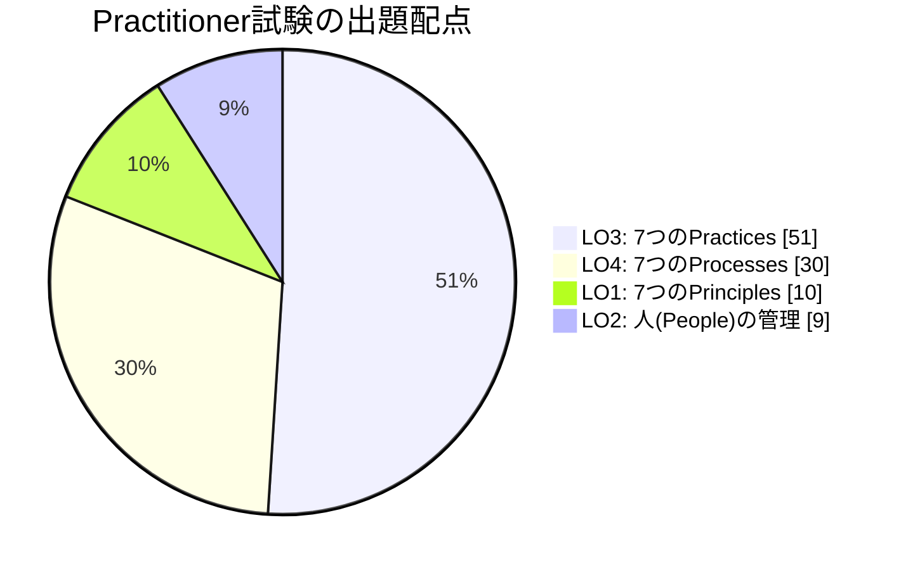

| Learning Outcome | 内容 | 配点比率 | Bloom's Level |
|---|---|---|---|
| LO1 | 状況に応じてPRINCE2の7原則を適用する方法を理解する | 10% | BL4(分析) |
| LO2 | プロジェクトを成功させるための効果的な人の管理を適用する方法を理解する | 9% | BL3/BL4 |
| LO3 | PRINCE2の7プラクティスの関連する側面を、状況に応じて適用・テーラリングする方法を理解する | **51%** | BL3/BL4 |
| LO4 | PRINCE2の7プロセスの関連する側面を、状況に応じて適用(・テーラリング)する方法を理解する | **30%** | BL3/BL4 |

> **学習の最優先事項**: LO3(プラクティス)とLO4(プロセス)だけで出題の81%を占めます。本ガイドもこの2つのセクション(Part 3、Part 4)にもっとも多くの紙幅を割いています。

---

## 2. PRINCE2 7とは何か? Foundationとの違い、V6からの主な変更点

### 2.1 FoundationとPractitionerの違い

| 観点 | Foundation | Practitioner |
|---|---|---|
| 求められる能力 | 用語・構造の**理解(Recall/Understand)** | 実際のシナリオへの**適用・分析(Apply/Analyse)** |
| Bloom's Level | BL1・BL2が中心 | BL3・BL4のみ |
| 出題形式 | 単純な知識確認問題 | プロジェクトシナリオに基づく応用問題 |
| 前提資格 | なし | Foundation合格(またはPRINCE2 5th/6th版、PMP、CAPMなど同等資格) |

Practitionerでは「〇〇という状況で、プロジェクトマネージャーが××をしたことは適切だったか、その理由は?」という形式で問われるため、**各要素の定義を暗記するだけでは不十分**で、「なぜその行動が原則・プラクティス・プロセスの目的に沿っている(または沿っていない)のか」を説明できる理解が必要です。

### 2.2 PRINCE2 7(Version 7)でのV6からの主な変更点

PRINCE2は2023年9月にVersion 7として刷新されました。Practitioner試験でも、この変更点そのものが出題の前提知識になります。

| 変更点 | V6(第6版) | V7(第7版) |
|---|---|---|
| 「テーマ」の名称 | Themes(7つ) | **Practices**(7つ、名称変更・内容拡充) |
| 人に関する章 | 独立した章なし | **新設「People」章**(リーダーシップ、変革管理、コミュニケーション) |
| サステナビリティ | 明示的な言及は限定的 | **7番目のパフォーマンスターゲット**として正式に位置づけ、Sustainability Management Approachを新設 |
| デジタル・データ | 明示的な言及は限定的 | **Digital and Data Management Approach**を新設(Progressプラクティスの管理プロダクトの一部) |
| 商用・調達 | Organization(組織)テーマの一部 | **Commercial Management Approach**として明確化(Organizingプラクティスの管理プロダクト) |
| Issues(旧Change) | "Change"テーマ | **"Issues"プラクティス**に改称 |
| 管理プロダクト | ログ・レジスタが多数分散 | 統合・簡素化(文書オーバーヘッドの削減) |
| テーラリングの扱い | 原則の1つとして記載 | 原則に加え、**適用の考え方全体を貫く指針**としてより強調 |

出典: PeopleCert PRINCE2 7 ローンチ情報、Knowledge Train「PRINCE2 7th Edition – What's different?」

### 2.3 PRINCE2プロジェクトの7つのパフォーマンスターゲット

V7では、プロジェクトが管理すべき対象(旧「6つの側面」)に**サステナビリティ**が加わり、7つになりました。

| No. | パフォーマンスターゲット | 説明 |
|---|---|---|
| 1 | Time(時間) | 計画されたスケジュール通りに完了するか |
| 2 | Cost(コスト) | 承認された予算内に収まるか |
| 3 | Quality(品質) | 要求された品質基準を満たすか |
| 4 | Scope(スコープ) | 合意された範囲の成果物を提供するか |
| 5 | Risk(リスク) | リスクが許容範囲内に管理されているか |
| 6 | Benefits(ベネフィット) | 期待された便益が実現されるか |
| 7 | **Sustainability(サステナビリティ)** | 環境・社会・ガバナンス(ESG)目標に整合しているか(V7新規) |

これらのターゲットには「許容範囲(Tolerance)」が設定され、逸脱が予測される場合は上位レベルへエスカレーションされます。これは後述する「Manage by exception」原則と直結します。

---

## 3. Part 1: 7つの原則 (Principles) の適用と分析

原則はPRINCE2プロジェクトである以上、**例外なくすべて適用しなければならない**普遍的なガイドラインです(適用の「仕方」はテーラリング可能ですが、原則そのものを無視することはできません)。Practitioner試験(LO1, 10%)では、「あるプロジェクトマネージャーの行動が、どの原則に沿っている/反しているか」を分析させる問題が出ます。

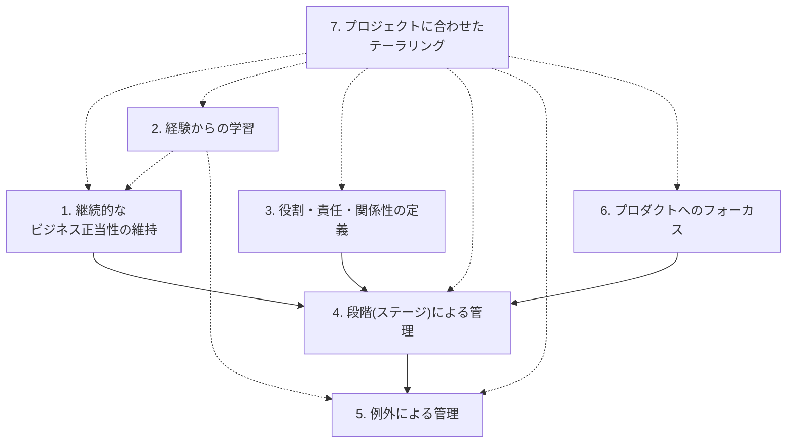

### 3.1 継続的なビジネス正当性の維持 (Ensure continued business justification)

**要点**: プロジェクトは開始時だけでなく、**プロジェクト期間を通じて常に**「やる価値がある」ことを証明し続けなければなりません。ビジネスケースが正当化されなくなった時点で、プロジェクトは中止(または方向転換)されるべきです。

- **適用の仕方**: ビジネスケースをステージ境界ごとに見直す、リスクや外部環境の変化を継続的にビジネスケースへ反映する。
- **Practitioner的な視点**: シナリオ問題で「市場環境が変わったのにビジネスケースを更新しなかった」「便益が実現しなくなったのにプロジェクトを継続した」という記述があれば、この原則への違反を示唆しています。
- **関連プラクティス**: Business Case

### 3.2 経験からの学習 (Learn from experience)

**要点**: プロジェクトチームは、過去のプロジェクトや自プロジェクトの経験から常に学び、その教訓を将来に活かさなければなりません。「初めてだから仕方ない」は理由になりません。

- **適用の仕方**: プロジェクト開始時に類似プロジェクトの教訓を調査する、Lessons Log(教訓ログ)を継続的に記録する、各ステージ・プロジェクト終了時にLessons Report(教訓報告)を作成する。
- **Practitioner的な視点**: 「新しいプロジェクトマネージャーが過去の教訓ログを確認しなかった」というシナリオは、この原則への違反の典型例です。

### 3.3 役割・責任・関係性の定義 (Define roles, responsibilities and relationships)

**要点**: プロジェクトに関わる全員が、自分の役割・責任・権限、そして他者との関係性を明確に理解していなければなりません。

- **適用の仕方**: プロジェクトマネジメントチーム構造を明文化する(PID: Project Management Team Structure)、役割記述書(Role Description)を作成する。
- **Practitioner的な視点**: Executive(責任者)とProject Manager(プロジェクトマネージャー)を同一人物が兼任している、Senior UserとSenior Supplierが利害相反を起こしうる立場で兼任している、といったシナリオは、この原則違反として問われやすいポイントです。

### 3.4 段階(ステージ)による管理 (Manage by stages)

**要点**: プロジェクトは、いくつかの管理ステージに分割して計画・監視・制御されます。プロジェクトボードは、次のステージが始まる前にそのステージの計画を承認します。

- **適用の仕方**: 小規模・低リスクなプロジェクトはステージ数を少なく、大規模・高リスクなプロジェクトはステージを細かく区切る。
- **Practitioner的な視点**: 「プロジェクトマネージャーが次のステージの計画をプロジェクトボードの承認なしに開始した」は典型的な違反シナリオです。

### 3.5 例外による管理 (Manage by exception)

**要点**: 各管理レベルに、時間・コスト・品質・スコープ・リスク・便益・サステナビリティの各パフォーマンスターゲットについて「許容範囲(Tolerance)」が設定されます。許容範囲内であれば下位レベルは上位レベルの承認を待たずに業務を進められ、逸脱が予測される場合のみエスカレーションします。

- **適用の仕方**: プロジェクトボードはプロジェクトマネージャーへステージトレランスを設定、プロジェクトマネージャーはチームマネージャーへワークパッケージトレランスを設定。
- **Practitioner的な視点**: 「許容範囲を超えそうなのに、プロジェクトマネージャーが独断で対応し、プロジェクトボードに報告しなかった」は明確な違反です。逆に「許容範囲内の軽微な遅延についてまでプロジェクトボードへ逐一報告を求める」のは、この原則の過剰適用(マイクロマネジメント)として問題視されます。

### 3.6 プロダクトへのフォーカス (Focus on products)

**要点**: プロジェクトは「何を作るか(プロダクト)」を明確に定義し、それを基準に計画・品質確認・進捗管理を行います。活動(タスク)ベースではなく、成果物(プロダクト)ベースで考えることが重要です。

- **適用の仕方**: プロダクトベースプランニング技法を用いる(後述)、Project Product Description(プロジェクトプロダクト記述書)とProduct Description(プロダクト記述書)を作成する。
- **Practitioner的な視点**: 品質基準やスコープの合意がプロダクト記述書に明記されないまま作業が進められている、というシナリオはこの原則違反を示します。

### 3.7 プロジェクトに合わせたテーラリング (Tailor to suit the project)

**要点**: PRINCE2は「そのまま」使うものではなく、プロジェクトの規模・複雑さ・重要性・組織文化・リスクレベルなどに応じて**調整して**使うべきものです。ただし、原則そのものは調整できず、プラクティス・プロセス・役割・管理プロダクトの「適用の度合い・形式」を調整します。

- **Practitioner的な視点**: この原則は試験全体を貫く最重要概念であり、独立したPart 7でも詳述します。

---

## 4. Part 2: 人 (People) — リーダーシップ・変革管理・コミュニケーション

PRINCE2 7で新設された「People」の章は、Practitioner試験のLearning Outcome 2(配点9%)に対応します。配点比率は小さいものの、PRINCE2 7の最大の思想的変更点であり、他のプラクティス・プロセスの理解にも影響します。

> 公式教本は「プロジェクトの成功は、関わる人々の能力・動機・関係性の理解にかかっている」という考え方を明確に打ち出しています(出典: QA社 PRINCE2 7 Foundation-Practitionerコースガイド)。

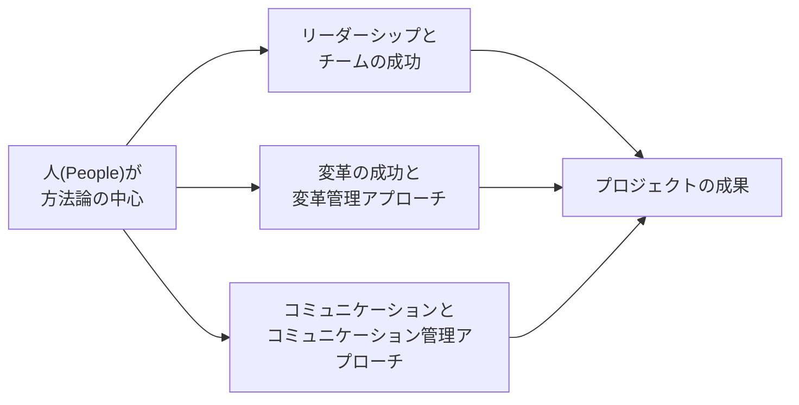

### 4.1 チームを成功に導くリーダーシップ (Leading successful teams)

LO2.1では「チームのリーダーシップとマネジメントへのアプローチが適切かどうかを評価する」ことが求められます(Bloom's Level 4=分析)。

- **リーダーシップの要点**: 明確なビジョンの提示、状況に応じたリーダーシップスタイルの使い分け、心理的安全性の確保、チームメンバーの権限委譲(エンパワーメント)。
- **マネジメントとの違い**: マネジメントは計画・統制・プロセスの実行、リーダーシップは動機づけ・方向づけ・関係構築。PRINCE2 7ではこの両方をプロジェクトマネージャーに求めます。
- **ベストプラクティス**:
  - チームの構成(スキル、経験、文化的背景)に応じてコミュニケーションとタスクの割り当て方法を調整する
  - リモート・分散チームでは、対面よりも意図的な関係構築の機会を設計する
  - チームマネージャーへの権限委譲を、トレランス(許容範囲)の設定を通じて明確に行う(Manage by exceptionとの連携)

### 4.2 変革を成功に導くこと (Leading successful change) と変革管理アプローチ

LO2.2では「プロジェクト内の変革、およびプロジェクトの影響を受ける人々への変革管理・リーダーシップのアプローチが適切かどうか」を評価します。

PRINCE2 7では、プロジェクトの**成果物を作ること(アウトプット)**と、**組織・人がそれを実際に使いこなし便益を得ること(アウトカム)**を明確に区別し、後者を実現するための「変革管理アプローチ(Change Management Approach)」という管理プロダクトを新設しました。

> **注意(用語の混同に注意)**: PRINCE2における"Change"には2つの意味があります。
> 1. **Issue/Change Control(変更管理)**: Issuesプラクティスにおける、スコープ変更要求や不具合などへの対応手続き。
> 2. **Organizational Change Management(組織的変革管理)**: People章における、人々が新しい働き方を受け入れ・適応するための働きかけ。
>
> シナリオ問題で「変更(Change)」という語が出てきたら、**どちらの文脈か**を必ず見極めてください。「課題の捕捉・評価の手続き」を問われていればIssue Control、「抵抗感の低減」「新しい働き方への適応」「トレーニング」「周知」を問われていればOrganizational Change Managementです。

- **変革管理アプローチに含まれる典型的な要素**:
  - 変革戦略(ステークホルダーをどう巻き込み、変革を受け入れてもらうか)
  - インパクト分析(誰が何を失い、誰が何を得るか)
  - 抵抗管理・トレーニング計画・コミュニケーション計画
- **代表的なフレームワーク**: PRINCE2公式教本自体は特定の変革管理モデルを義務づけませんが、実務ではProsciのADKARモデル(Awareness、Desire、Knowledge、Ability、Reinforcement)などの外部フレームワークと組み合わせて使われることが一般的です。
- **ベストプラクティス**:
  - 変革の「なぜ」を、対象者ごとにセグメント化して伝える
  - プロジェクトマネージャーが一方的に変革を指示するのではなく、Senior Userなど適切なステークホルダーが変革を主導する形を整える(Practitioner試験では「PMが独断で変革を強制する」選択肢は誤りであることが多い)
  - 人員削減への不安がある場合は、雇用の安定性やスキル移行についての明確なコミュニケーションを組み込む

### 4.3 コミュニケーション (Communication) とコミュニケーション管理アプローチ

LO2.3・LO2.4では、コミュニケーションへのアプローチの適用と、それを支えるコミュニケーション管理アプローチ(Communication Management Approach)という管理プロダクトの理解が問われます。

- **コミュニケーション管理アプローチの役割**: ステークホルダー分析、各ステークホルダーへの情報の内容・頻度・手段・責任者を定義する。プロジェクト・イニシエーション・ドキュメンテーション(PID)の一部として作成されます。
- **設計上の注意点**: 他の管理アプローチ(リスク・品質・変革管理アプローチなど)が要求するコミュニケーションを取り込む必要があるため、実務上は**他の管理アプローチを先にまとめ、コミュニケーション管理アプローチを最後に確定させる**ことが推奨されます。
- **ベストプラクティス**:
  - プッシュ型(能動的に発信する報告書)とプル型(必要な人が能動的に参照するダッシュボードなど)を使い分ける
  - ハイライトレポートの頻度・粒度をステークホルダーの関与度に応じて調整する
  - デジタルツール(ダッシュボード、チャットツール)を活用しつつ、重要な意思決定は明文化して記録に残す(Digital and Data Management Approachとの連携)

---

## 5. Part 3: 7つのプラクティス (Practices) のテーラリングと適用

**配点51%、試験の合否を左右する最重要セクションです。** 各プラクティスについて、シラバスの構成に沿って「①主要な管理プロダクト」「②関連する役割の関心事」「③効果的なマネジメントと関連技法」「④テーラリングの考慮点」の4点を整理します。

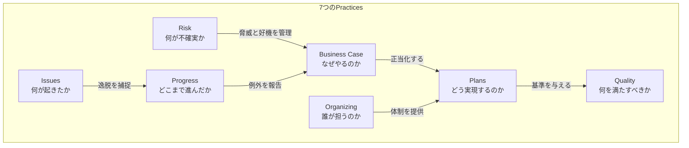

### 5.1 Business Case(ビジネスケース)

**目的**: プロジェクトが「望ましく(Desirable)」「実行可能で(Viable)」「達成可能(Achievable)」であり続けることを保証し、意思決定を支える。

#### 主要な管理プロダクト

| 管理プロダクト | 役割 |
|---|---|
| Business Case(ビジネスケース) | 投資判断の根拠。便益・コスト・タイムスケール・主要リスクをまとめた文書。ステージ境界ごとに見直される |
| PID: Benefits Management Approach(便益管理アプローチ) | 便益をどう定義・測定・実現するかを定める。プロジェクト終了後の便益実現レビューの計画も含む |
| PID: Sustainability Management Approach(サステナビリティ管理アプローチ) | サステナビリティのパフォーマンスターゲットをどう達成・測定・報告するかを定める(V7新規) |
| Project Brief(プロジェクトブリーフ) | Starting up a Projectで作成される、プロジェクトの概要と初期ビジネスケースの土台 |

#### 主要な役割の関心事

- **Executive**: ビジネスケースの「所有者(Owner)」。投資対効果を継続的に確認し、ビジネス・ユーザー・サプライヤーの利害バランスを取る。
- **Senior User**: 便益が実際に実現されるかを確認。プロジェクト終了後の便益実現レビューにも責任を持つことが多い。
- **Project Manager**: ビジネスケースの起草・維持を支援し、各ステージでの見直しを促進する。

#### 効果的な管理と技法

- 5種類のケースタイプ(戦略的適合性、経済性、商業性、財務、管理面)から複数の観点でビジネスケースを検証する考え方
- 便益は「定性的/定量的」「金銭的/非金銭的」に分類して管理する
- コスト・便益・リスクのバランスを定期的(ステージ境界ごと)に再評価する

#### テーラリングの考慮点

- 小規模プロジェクトでは、ビジネスケースを簡潔な1ページ文書に凝縮してもよい
- プログラムの一部であるプロジェクトでは、ビジネスケースの一部(便益の定義など)を上位のプログラムから継承できる

> **Practitioner頻出パターン**: 「便益が実現しなくなったにもかかわらず、ビジネスケースが更新されないままプロジェクトが継続された」→原則違反(継続的なビジネス正当性)とBusiness Case実務の不備の両方が問われる複合問題になりやすい。

---

### 5.2 Organizing(組織化)

**目的**: プロジェクトの説明責任(Accountability)の構造を定義・確立し、「誰が何に責任を持つか」を明確にする。

#### 主要な管理プロダクト

| 管理プロダクト | 役割 |
|---|---|
| PID: Project Management Team Structure(プロジェクトマネジメントチーム構造) | 役割の階層・報告ラインを図示 |
| PID: Role Descriptions(役割記述書) | 各役割の責任・権限・必要スキルを明文化 |
| PID: Commercial Management Approach(商用管理アプローチ) | サプライヤーとの契約・調達関係の管理方法を定義(V7で明確化) |

#### 主要な役割の関心事

- **Executive**: 単一の説明責任者としてプロジェクト全体の成功に責任を持つ。プロジェクトマネジメントチームを任命する。
- **Senior Supplier**: 専門チームの技術的実現可能性とリソース確保に責任を持つ。
- **Project Manager**: 日々のマネジメントを委任される。ExecutiveやSenior User/Senior Supplierと兼任してはならない。

#### 効果的な管理と技法

- 4つの管理レベル(Corporate/Programme、Directing、Managing、Delivering)に沿って役割を配置する
- 役割は「人」ではなく「機能」として定義し、1人が複数役割を兼任することも、1つの役割を複数人で分担することも可能(ただし利害相反に注意)
- Project Assurance(プロジェクトアシュアランス)はProject Manager配下ではなく、Project Boardから独立した形で運用する

#### テーラリングの考慮点

- 小規模組織ではExecutiveがSenior Userを兼任することもあるが、Executive/Project ManagerとSenior Supplierの兼任は利害相反リスクが高いため推奨されない
- 商用契約が存在しない内部プロジェクトでは、Commercial Management Approachを簡略化・省略できる

> **Practitioner頻出パターン**: 「Executiveがプロジェクトマネージャーを兼任している」「Senior UserとSenior Supplierが同一人物」といった役割の兼任シナリオで、利害相反リスクを見抜けるかが問われます。

---

### 5.3 Plans(計画)

**目的**: プロジェクトの「誰が、何を、いつ、どこで、どのように、いくらで」実現するかを定義する。

#### 主要な管理プロダクト

| 管理プロダクト | 役割 |
|---|---|
| Plan(Project/Stage/Team/Exception Plan) | 階層構造を持つ4種類の計画(プロジェクト計画、ステージ計画、チーム計画、例外計画) |
| Project Product Description(プロジェクトプロダクト記述書) | プロジェクト全体の最終成果物の記述。品質期待・受入基準・サステナビリティ要件を含む |
| Work Package Description(ワークパッケージ記述書) | チームマネージャーに委任される作業単位の記述 |

#### 主要な役割の関心事

- **Senior Supplier**: 計画がリソース面・技術面で実現可能かを確認。
- **Project Manager**: プロジェクト計画・ステージ計画を作成し、Project Boardの承認を得る。
- **Team Manager**: チーム計画を作成し、ワークパッケージを実行する。

#### 効果的な管理と技法

- **プロダクトベースプランニング(Product-based Planning)**: 「アクティビティ」ではなく「プロダクト」を起点に計画する技法。手順は概ね次の通り。
  1. Project Product Description(最終成果物記述)の作成
  2. Product Breakdown Structure(プロダクト分解構造)の作成
  3. 各プロダクトのProduct Description(記述書)の作成
  4. Product Flow Diagram(プロダクトフロー図、依存関係)の作成
- スコープの取りこぼしを防ぎ、成果物の依存関係を可視化できるのが最大の利点
- 計画は階層化されており、上位計画ほど粗く、下位計画(チーム計画)ほど詳細になる

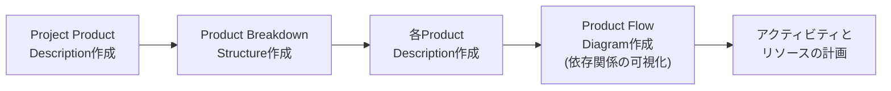

#### テーラリングの考慮点

- アジャイル的な delivery approach(反復・インクリメンタル型)を採用する場合、チーム計画をより短いサイクル(スプリント等)で回し、ステージ計画と整合させる
- ローリングウェーブプランニング(直近ステージは詳細に、将来ステージは概略のみ)を採用することで、不確実性の高いプロジェクトに対応できる

> **Practitioner頻出パターン**: 「プロジェクトマネージャーがアクティビティベースでいきなり計画を立て、成果物の定義や依存関係を明確にしなかった」→プロダクトベースプランニングの不備、および「プロダクトへのフォーカス」原則違反。

---

### 5.4 Quality(品質)

**目的**: ユーザーの要求事項と期待が満たされることを保証する。

#### 主要な管理プロダクト

| 管理プロダクト | 役割 |
|---|---|
| Product Description(プロダクト記述書) | 個々のプロダクトの品質基準・受入基準を定義 |
| Project log: Product Register(プロダクトレジスタ) | 全プロダクトの状態を一覧管理 |
| PID: Quality Management Approach(品質管理アプローチ) | 品質基準、品質責任、品質保証・品質統制の方法を定義 |
| Project log: Quality Register(品質レジスタ) | 実施された品質検証活動の記録 |

#### 主要な役割の関心事

- **Senior User**: 品質期待(Quality Expectations)と受入基準(Acceptance Criteria)を定義する主要な責任者。
- **Senior Supplier**: 定義された品質基準を満たす技術的な実現可能性を保証。
- **Project Assurance**: 品質マネジメント活動が独立した視点から適切に行われているかを確認。

#### 効果的な管理と技法

- **品質計画(Quality Planning)**: 品質期待の捕捉 → 受入基準の定義 → Project Product Descriptionへの記載 → 各プロダクトのQuality Criteria(品質基準)への展開、という流れ。
- **品質統制(Quality Control)**: 品質基準に対して実際にプロダクトを検証する活動。代表的技法が**Quality Review Technique(品質レビュー技法)**で、通常はレビュー準備 → レビューミーティング(誤りの特定、修正の合意) → フォローアップ、というステップで進む。
- 品質保証(Quality Assurance、組織横断的な独立確認)と、プロジェクト内のQuality Control(品質統制)を区別する。

#### テーラリングの考慮点

- ソフトウェア開発など反復型のデリバリーでは、品質レビューを各スプリント/イテレーションの終わりに組み込む
- 規制の厳しい業界(医薬品、金融など)では、外部の品質保証機関によるレビューを品質管理アプローチに明記する

> **Practitioner頻出パターン**: 「受入基準が曖昧なまま開発が進み、納品後にユーザーから『期待していたものと違う』と指摘された」→品質期待の捕捉不足、Project Product Descriptionの記述不備。

---

### 5.5 Risk(リスク)

**目的**: プロジェクト期間中に発生しうる不確実な事象(脅威と好機の両方)を識別・評価・コントロールする。

#### 主要な管理プロダクト

| 管理プロダクト | 役割 |
|---|---|
| PID: Risk Management Approach(リスク管理アプローチ) | リスク管理の手続き、役割、許容範囲(Risk Tolerance)を定義 |
| Project log: Risk Register(リスクレジスタ) | 識別された全リスクの記録(内容、確率、影響、対応、ステータス) |

#### 主要な役割の関心事

- **Executive**: ビジネスケースに関連する戦略的リスクの識別・評価・統制に責任。
- **Project Manager**: 日々のリスク管理活動を実施し、リスクレジスタを維持する。
- **すべての役割**: リスクの識別はプロジェクト関係者全員の責務。

#### 効果的な管理と技法

PRINCE2のリスクマネジメント手続きは、概ね以下のサイクルで構成されます。

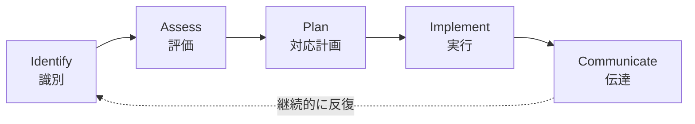

- **脅威(Threat)への対応戦略の例**: 回避(Avoid)、低減(Reduce)、転嫁(Transfer)、受容(Accept)、コンティンジェンシー確保(Fallback/Share)
- **好機(Opportunity)への対応戦略の例**: 活用(Exploit)、強化(Enhance)、共有(Share)、受容(Reject/Accept)
- PRINCE2の大きな特徴は、**脅威だけでなく「好機」も積極的に管理対象とする**点です。多くの現場ではリスク=脅威と捉えがちですが、Practitioner試験では好機を見落としているシナリオが誤りとして問われます。

#### テーラリングの考慮点

- 高リスクプロジェクトでは、Risk Registerの更新頻度を上げ、定量的リスク分析(期待金銭価値=EMVなど)を導入する
- 小規模プロジェクトでは、リスク管理アプローチを簡潔にし、組織の標準リスク許容度をそのまま援用してもよい

> **Practitioner頻出パターン**: 「あるリスクが顕在化した際に、それが『課題(Issue)』として扱われず放置された」→Risk PracticeとIssues Practiceの接続不備(リスクが顕在化したら課題管理プロセスに引き継ぐ必要がある)。

---

### 5.6 Issues(課題)

**目的**: すでに発生した課題に対応し、プロジェクトのベースライン(合意済みの計画・仕様)への変更をコントロールする。V6の「Change(変更)」テーマから改称。

#### 主要な管理プロダクト

| 管理プロダクト | 役割 |
|---|---|
| PID: Issue Management Approach(課題管理アプローチ) | 課題の捕捉・評価・意思決定・記録の手続きを定義 |
| Issue Register(課題レジスタ) | すべての正式な課題の一覧(種類、説明、優先度、深刻度、ステータス) |
| Issue Report(課題報告書) | 個々の課題の詳細な検討結果 |

#### 主要な役割の関心事

- **Change Authority(変更権限者)**: Project Boardから権限委譲を受け、一定範囲の変更要求について意思決定を行う役割(必要に応じて設置)。
- **Project Manager**: 日々の課題を捕捉・評価し、許容範囲内であれば自ら対応、範囲を超える場合はエスカレーションする。
- **Project Assurance**: 課題管理手続きが適切に運用されているかを確認。

#### 効果的な管理と技法

課題は大きく3種類に分類されます。

| 課題の種類 | 内容 |
|---|---|
| Request for Change(変更要求) | スコープ・仕様の変更を求めるもの |
| Off-specification(仕様不適合) | 合意された仕様を満たせない、または満たせなくなったプロダクト |
| Problem/Concern(問題・懸念) | 上記以外の、対応が必要な事項全般 |

課題対応の標準的な手続き:

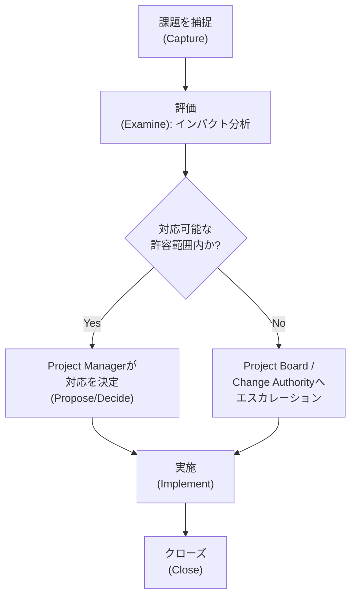

#### テーラリングの考慮点

- 変更頻度が高いプロジェクト(アジャイル型など)では、Change Authorityを設置してProject Boardの負荷を軽減する
- 変更管理の厳格さは、規制要件・契約形態(固定価格契約か、タイム&マテリアル契約か)に応じて調整する

> **Practitioner頻出パターン**: 「軽微な変更要求についてまでProject Boardの承認を毎回求め、プロジェクトの停滞を招いた」→Change Authorityの未活用、または許容範囲設定の不備。

---

### 5.7 Progress(進捗)

**目的**: プロジェクトの実績を計画と比較して追跡・監視し、意思決定を支える情報を提供する。

#### 主要な管理プロダクト

| 管理プロダクト | 役割 |
|---|---|
| Project log: Daily Log(デイリーログ) | 正式な記録を要しない軽微な事項の記録 |
| Project log: Lessons Log(教訓ログ) | プロジェクト期間中に得られた教訓の継続的な記録 |
| Lessons Report(教訓報告書) | ステージ・プロジェクト終了時にまとめられる教訓 |
| End Stage Report(ステージ終了報告書) | ステージ完了時の実績報告 |
| End Project Report(プロジェクト終了報告書) | プロジェクト全体の実績報告 |
| Checkpoint Report(チェックポイント報告書) | Team ManagerからProject Managerへの定期報告 |
| Highlight Report(ハイライト報告書) | Project ManagerからProject Boardへの定期報告 |
| Exception Report(例外報告書) | 許容範囲逸脱が予測される際にProject Boardへ提出される報告書 |
| PID: Digital and Data Management Approach(デジタル・データ管理アプローチ) | プロジェクトデータ・情報をどう収集・管理・活用するか(V7新規) |

#### 主要な役割の関心事

- **Project Board**: ステージ境界ごとに進捗を確認し、次ステージへの継続可否を判断。
- **Project Manager**: 日々の進捗をトレランスと照合し、ハイライトレポートを通じて報告。
- **Team Manager**: チェックポイントレポートを通じてワークパッケージの進捗を報告。

#### 効果的な管理と技法

- **イベント駆動型コントロール(Event-driven controls)**: 特定の出来事(ステージ終了、例外の発生、課題の発生など)をトリガーに実施される管理活動。
- **時間駆動型コントロール(Time-driven controls)**: 一定の周期(週次・月次など)で実施される定期報告。
- **トレランスと例外**: 各レベルで設定されたトレランスを超える(または超えると予測される)場合、Exception Reportを通じて上位レベルへエスカレーションし、Exception Plan(例外計画)の承認を得る。

```mermaid
flowchart LR
    TM["Team Manager"] -->|Checkpoint Report\n(時間駆動)| PM["Project Manager"]
    PM -->|Highlight Report\n(時間駆動)| PB["Project Board"]
    PM -->|Exception Report\n(イベント駆動:\nトレランス逸脱時)| PB
    PB -->|Exception Plan承認| PM
```

#### テーラリングの考慮点

- 報告の頻度・詳細度は、ステークホルダーの関与度とプロジェクトのリスクレベルに応じて調整する
- V7ではデジタルダッシュボードによるリアルタイムな進捗可視化が、従来の書面報告を補完する手段として明示的に位置づけられている

> **Practitioner頻出パターン**: 「トレランス逸脱が予測されたにもかかわらず、Project ManagerがException Reportを提出せず自己判断で進めた」→Manage by exception原則とProgress Practiceの重大な違反。

---

## 6. Part 4: 7つのプロセス (Processes) の適用と分析

**配点30%。** プロセスは「誰が・いつ・何を行うか」という活動の連鎖です。Practitioner試験では、各プロセスの「①活動・インプット・アウトプット」「②推奨される役割と責任(RACI)」「③プラクティスがどう適用されるか」を、シナリオに即して分析することが求められます。

> 以下のRACI表は、PRINCE2の一般的な役割配置の考え方に基づく目安であり、実際の配分はプロジェクトごとにテーラリングされます(R=実行責任者/Responsible, A=説明責任者/Accountable, C=協議先/Consulted, I=報告先/Informed)。

### 6.1 全体像: プロセスモデル

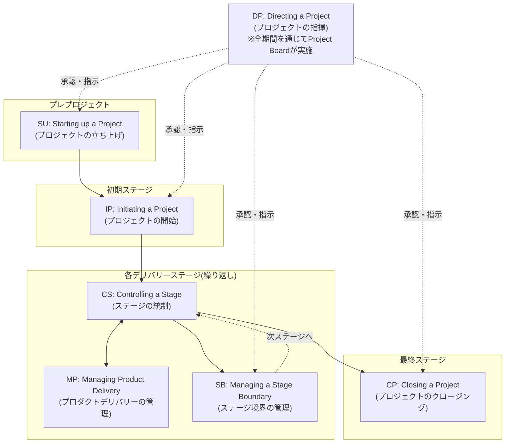

重要なポイント:

- **Directing a Project(DP)はプロジェクト全期間を通じてProject Boardが行う**プロセスであり、他のプロセスと並行して常に存在します。
- **Controlling a Stage(CS)とManaging Product Delivery(MP)は、各デリバリーステージ内で並行して繰り返される**プロセスです(CS=Project Managerの視点、MP=Team Managerの視点)。
- **Managing a Stage Boundary(SB)は、最終ステージの直前では実施されません**。最終ステージの終わりはSBではなくClosing a Project(CP)に置き換わります。

---

### 6.2 Starting up a Project(SU) — プロジェクトの立ち上げ

**目的**: プロジェクトを開始する価値があるかどうかを、最小限のコストと時間で確認する「プレプロジェクト」の活動。

| 項目 | 内容 |
|---|---|
| 主なインプット | Project Mandate(プロジェクトマンデート、上位組織からの指示) |
| 主な活動 | Executiveおよびプロジェクトマネジメントチームの任命、過去の教訓の確認、Project Approach(プロジェクトアプローチ)の決定、各種管理アプローチの概要合意、Project Brief作成、Initiation Stage Plan(初期ステージ計画)作成 |
| 主なアウトプット | Project Brief、Initiation Stage Plan、プロジェクト定義文書一式 |

#### RACI(目安)

| 活動 | Corporate/Programme | Executive | Project Manager | Project Assurance |
|---|---|---|---|---|
| Project Mandateの発行 | A/R | I | I | - |
| Executiveの任命 | A | - | - | - |
| Project Managerの任命 | I | A/R | - | - |
| Project Brief作成 | I | A | R | C |
| Initiation Stage Plan作成 | I | A | R | C |

#### プラクティスの適用

- **Business Case**: アウトラインビジネスケースを作成(詳細版はIPで完成)
- **Organizing**: プロジェクトマネジメントチームの初期構成を決定
- **Plans**: Initiation Stage Planのみを作成(プロジェクト全体計画はまだ作らない)

> **Practitioner頻出パターン**: 「Project Brief作成前に、詳細なプロジェクト計画をいきなり作り始めた」→SUの目的(最小コストでの実行可否判断)を逸脱している。

---

### 6.3 Directing a Project(DP) — プロジェクトの指揮

**目的**: Project Boardが、プロジェクトの主要な意思決定ポイント(開始・各ステージの承認・重大な課題への対応・終了)で方向性を示す。日々のマネジメントには関与しない。

| 項目 | 内容 |
|---|---|
| 主な活動 | 立ち上げの承認、プロジェクトの開始承認、ステージ/例外計画の承認、アドホックな指示の提供、プロジェクト終了の承認 |
| 特徴 | プロジェクト全体を通じて継続する唯一のプロセス。Project Boardが主体で、Project Managerが情報を提供する形で連携 |

#### RACI(目安)

| 活動 | Project Board(Executive/SU/SS) | Project Manager |
|---|---|---|
| 立ち上げの許可 | A/R | C(Project Brief提出) |
| プロジェクト開始の承認 | A/R | C(PID提出) |
| ステージ承認 | A/R | C(End Stage Report/次Stage Plan提出) |
| 例外への対応 | A/R | C(Exception Report提出) |
| プロジェクト終了の承認 | A/R | C(End Project Report提出) |

#### プラクティスの適用

- **Progress**: Highlight ReportやExceptionReportを通じてProject Boardが状況を把握する中心的な接点
- **Business Case**: 各承認ポイントで、Executiveがビジネスケースの妥当性を再確認する

> **Practitioner頻出パターン**: 「Project Boardが日々の業務判断にまで介入し、マイクロマネジメントを行った」→DPの目的(戦略的な方向づけに徹する)からの逸脱。逆に「重大な例外が発生したのにProject Boardが関与しなかった」も同様に問題。

---

### 6.4 Initiating a Project(IP) — プロジェクトの開始

**目的**: プロジェクトを適切にコントロールするための強固な基盤を確立する。プロジェクトの「何を・なぜ・どのように」を全ステークホルダーが共有できる状態にする。

| 項目 | 内容 |
|---|---|
| 主な活動 | 各種管理アプローチ(品質・リスク・課題・変革・コミュニケーション・商用・サステナビリティ・デジタル&データ)の合意、プロジェクト統制の確立、プロジェクト計画の作成、詳細ビジネスケースの作成、PID(Project Initiation Documentation)の組み立て |
| 主なアウトプット | PID一式、Project Plan、Benefits Management Approach |

管理アプローチは並行して作成できますが、他のアプローチが要求するコミュニケーションを取り込む必要があるため、**Communication Management Approachは最後に確定させる**ことが推奨されます。

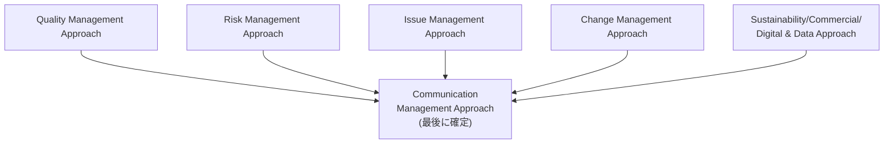

#### RACI(目安)

| 活動 | Project Board | Project Manager | Project Assurance |
|---|---|---|---|
| 管理アプローチの合意 | A | R | C |
| Project Planの作成 | A | R | C |
| 詳細Business Caseの作成 | A(Executive) | R | C |
| PIDの承認 | A/R | C(提出) | C |

#### プラクティスの適用

7つのプラクティスすべてがIPで本格的に立ち上がります。特にBusiness Case(詳細版の完成)、Plans(プロジェクト計画)、Organizing(役割記述書の確定)が中心的です。

> **Practitioner頻出パターン**: 「PIDが完成する前に本格的な作業(デリバリーステージの実作業)が始まってしまった」→統制基盤が整う前の作業着手というガバナンス上の問題。

---

### 6.5 Controlling a Stage(CS) — ステージの統制

**目的**: 各管理ステージにおいて、Project Managerが日々の作業を割り当て、進捗を監視し、トレランス内でプロジェクトを運営する。Project Managerが最も多くの時間を費やすプロセス。

| 項目 | 内容 |
|---|---|
| 主な活動 | ワークパッケージの承認(Authorize a Work Package)、進捗のレビュー、課題・リスクの捕捉と評価、Highlight Reportの作成、必要に応じたException Reportの作成、是正措置の実施 |
| トリガー | ステージの開始(SBまたはIPで承認された後) |

#### RACI(目安)

| 活動 | Project Manager | Team Manager | Project Board |
|---|---|---|---|
| ワークパッケージの承認 | A/R | I | I |
| 進捗の監視 | A/R | R(報告) | I |
| Highlight Report作成 | A/R | C | I |
| Exception Report作成 | A/R | C | I(→対応判断) |
| 課題・リスクの捕捉 | A | R | C |

#### プラクティスの適用

Issues・Risk・Progressの3プラクティスが最も活発に動くプロセスです。Business CaseやSustainability Management Approachで設定されたトレランスとの照合が継続的に行われます。

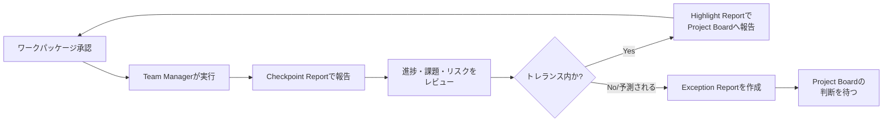

> **Practitioner頻出パターン**: 「Project ManagerがTeam Managerに正式なワークパッケージの承認をせず、口頭で作業を依頼した」→統制の欠如。試験ではこの種の「手続きの省略」がしばしば問題として扱われます。

---

### 6.6 Managing Product Delivery(MP) — プロダクトデリバリーの管理

**目的**: Team Managerが、合意された品質基準・タイムスケール・コストの範囲内でプロダクトを実際に生み出すことを保証する。Project ManagerとTeam Managerの接点となるプロセス。

| 項目 | 内容 |
|---|---|
| 主な活動 | ワークパッケージの受諾(Accept a Work Package)、ワークパッケージの実行、ワークパッケージの納品(Deliver a Work Package) |
| 特徴 | Project Managerの管理レベルとTeam Managerのデリバリーレベルの境界に位置するプロセス。外部サプライヤーが担う場合、契約(Commercial Management Approach)を通じて統制される |

#### RACI(目安)

| 活動 | Team Manager | Project Manager | チームメンバー |
|---|---|---|---|
| ワークパッケージの受諾 | A/R | C | I |
| 実行と品質検証 | A/R | I(Checkpoint経由) | R |
| 完成プロダクトの納品 | A/R | C(承認) | R |

#### プラクティスの適用

Quality Practice(プロダクトが品質基準を満たすかの検証)とProgress Practice(Checkpoint Reportによる報告)が中心です。

> **Practitioner頻出パターン**: 「Team Managerがワークパッケージの受諾時に、実現可能性・必要なリソース・品質基準を十分確認せず引き受けた」→MPの目的(合意された範囲内での確実な実行)を損なう。

---

### 6.7 Managing a Stage Boundary(SB) — ステージ境界の管理

**目的**: 現在のステージの実績を評価し、次のステージ計画を作成し、プロジェクト継続の妥当性をProject Boardが判断できるようにする。

| 項目 | 内容 |
|---|---|
| トリガー | ステージ終了が近づいたとき、または例外計画が必要になったとき |
| 主な活動 | 次ステージ計画(Next Stage Plan)の作成、Business Caseの更新、リスク・課題状況の更新、End Stage Reportの作成、(必要時)Exception Planの作成 |
| 主なアウトプット | End Stage Report、Next Stage Plan、更新されたBusiness Case |

#### RACI(目安)

| 活動 | Project Manager | Project Board | Project Assurance |
|---|---|---|---|
| End Stage Report作成 | A/R | I | C |
| Next Stage Plan作成 | A/R | I | C |
| Business Case更新 | R | A(Executive) | C |
| ステージ完了・次ステージ承認 | I(提出) | A/R | C |

#### プラクティスの適用

Business Case(継続的正当性の再確認)とProgress(実績評価)が中心。Sustainability Management Approachで設定されたサステナビリティトレランスの見直しもこのプロセスで行われます。

> **重要な例外**: 最終ステージの終わりでは、SBではなく**Closing a Project(CP)**が実施されます(次ステージが存在しないため)。
> **Practitioner頻出パターン**: 「ステージが完了する前に、Project Boardの承認なしにProject Managerが次ステージの作業を開始した」→「段階による管理」原則とSBプロセスの重大な違反。

---

### 6.8 Closing a Project(CP) — プロジェクトのクロージング

**目的**: プロジェクトの終了(計画通りの終了、または早期終了)を適切に管理し、成果物の引き渡しと評価を確実に行う。

| 項目 | 内容 |
|---|---|
| 主な活動 | 計画された終結の準備、早期終結の準備(該当する場合)、プロダクトのハンドオーバー、プロジェクトの評価、Project Boardへの終結の推奨 |
| 主なアウトプット | End Project Report、Lessons Report、Follow-on Action Recommendations(フォローオンアクション勧告)、Benefits Management Approachの更新 |

#### RACI(目安)

| 活動 | Project Manager | Project Board | Senior User |
|---|---|---|---|
| プロダクトのハンドオーバー | A/R | I | C(受入確認) |
| End Project Report作成 | A/R | I | C |
| 終結の推奨 | R(推奨) | A(承認) | C |
| 便益実現レビュー計画の更新 | R | A | C |

#### プラクティスの適用

- **Business Case**: 実績(実コスト・実便益)を記録し、将来の便益実現レビュー計画に反映
- **Progress**: 教訓(Lessons)を最終的に取りまとめる
- **Sustainability**: プロジェクトのサステナビリティ実績を評価し報告する(V7で明確化)

早期終結(Premature Closure)の場合も、通常の終結と同様に、実施済み作業の評価・成果物の引き渡し・教訓の記録は省略せずに行う必要がある点に注意してください。

> **Practitioner頻出パターン**: 「プロジェクトが早期終結される際、教訓の記録や成果物の適切な引き渡しが省略された」→CPの目的(どのような終了であっても適切な評価と引き渡しを行う)の逸脱。

---

## 7. Part 5: 役割と責任 (Roles & Responsibilities) の総括

Practitioner試験のMatching形式問題(3点問題)では、「この活動の責任者は誰か」を問う出題が頻出します。以下は役割ごとの中心的な責任の総括です。

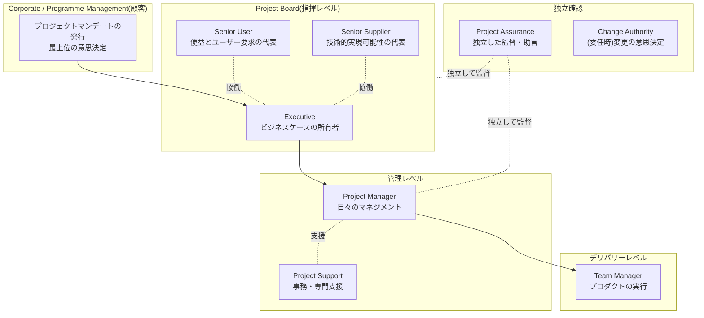

### 7.1 役割別・責任サマリー

| 役割 | 階層 | 中心的な責任 | 兼任時の注意 |
|---|---|---|---|
| **Executive** | Project Board(指揮) | Business Caseの所有、投資対効果の維持、ビジネス・ユーザー・サプライヤー利害のバランス、プロジェクトマネジメントチームの任命 | Project Managerとの兼任は不可 |
| **Senior User** | Project Board(指揮) | ユーザー要求・品質期待・受入基準の定義、便益実現への責任 | Senior Supplierとの兼任は利害相反リスクが高い |
| **Senior Supplier** | Project Board(指揮) | 専門プロダクトの技術的実現可能性、リソースの確保、供給側の品質責任 | Senior Userとの兼任は利害相反リスクが高い |
| **Project Manager** | 管理 | 日々のマネジメント、計画作成、進捗・リスク・課題の管理、Project Boardへの報告 | Executiveとの兼任は不可 |
| **Team Manager** | デリバリー | ワークパッケージの受諾・実行・納品、チームメンバーの管理 | 小規模プロジェクトではProject Managerが兼任することもある |
| **Project Assurance** | 独立確認 | Project Boardに代わり、独立した立場でプロジェクトが正しく管理されているかを監督・助言。Business/User/Supplierの3つの視点に分解可能 | Project Managerが兼任することはできない(独立性の原則) |
| **Project Support** | 支援 | 事務支援、専門ツール(計画技法など)の提供、記録・レジスタの維持、変更管理手続きの運営補助 | Project Managerが兼任することもある(小規模プロジェクト) |
| **Change Authority** | 独立確認(委任時) | Project Boardから権限委譲を受け、一定範囲の変更要求の意思決定を行う | 必須ではなく、必要に応じて設置される役割 |

### 7.2 兼任(コンバイン)の可否早見表

| 組み合わせ | 可否 | 理由 |
|---|---|---|
| Executive + Project Manager | **不可** | 説明責任と実行責任の分離が崩れる |
| Senior User + Senior Supplier | **推奨されない** | 利害相反(要求側と供給側)のリスクが高い |
| Project Manager + Project Assurance | **不可** | 独立した監督機能が損なわれる |
| Project Manager + Team Manager | 可(小規模プロジェクト) | 規模が小さい場合は現実的な選択肢 |
| Project Manager + Project Support | 可(小規模プロジェクト) | 同上 |
| Senior User(複数人) | 可 | 大規模・複数部門にまたがる場合に分担可能 |

---

## 8. Part 6: V7の新要素 — Sustainability/ESG、Digital & Data、Commercial

これらはPart 3のプラクティス(主にBusiness Case、Progress、Organizing)の管理プロダクトとして組み込まれていますが、V7の思想的な柱であるためPractitioner試験でも独立した理解が問われやすく、ここで横断的に整理します。

### 8.1 Sustainability Management Approach(サステナビリティ管理アプローチ)

- サステナビリティはV7で**7番目のパフォーマンスターゲット**として正式に位置づけられました(第2章参照)。
- 国連の持続可能な開発目標(UN SDGs、17のゴール)やESG(環境・社会・ガバナンス)の観点との整合が推奨されています。
- **サステナビリティトレランス(Sustainability Tolerance)**: 他のパフォーマンスターゲットと同様に許容範囲が設定され、Business Caseに記載されます。逸脱が予測される場合は他のトレランス逸脱と同様にエスカレーションされます。
- **プロセスへの組み込み例**:
  - DP: Project Boardがサステナビリティ管理アプローチとトレランスを承認
  - MP: サステナビリティ要件を踏まえてワークパッケージが実行される
  - SB: Business Caseとともにサステナビリティ実績を見直す
  - CP: プロジェクトのサステナビリティ実績を評価・報告

> **Practitioner的な視点**: シナリオで「コスト削減のために環境配慮を後回しにした」といった記述があれば、サステナビリティトレランスの軽視として問題視される可能性があります。

### 8.2 Digital and Data Management Approach(デジタル・データ管理アプローチ)

- Progressプラクティスの管理プロダクトの1つとして新設されました。
- プロジェクトが生成・利用するデータや情報を、**どのツールで、誰が、どのように管理・保護・活用するか**を定義します。
- ダッシュボードやコラボレーションツールによるリアルタイムな進捗可視化を、従来の書面ベースの報告(Highlight Reportなど)と組み合わせる考え方が示されています。
- データのセキュリティ・プライバシー・品質(正確性)も対象範囲に含まれます。

### 8.3 Commercial Management Approach(商用管理アプローチ)

- Organizingプラクティスの管理プロダクトの1つとして明確化されました。
- 外部サプライヤーとの契約関係、調達方法、契約タイプ(固定価格、タイム&マテリアルなど)ごとのリスク配分の考え方を定義します。
- 内部リソースのみで完結するプロジェクトでは、この管理アプローチを大幅に簡略化・省略できます(テーラリングの好例)。

---

## 9. Part 7: テーラリング (Tailoring) — Practitioner試験の核心

テーラリングは原則の1つ(3.7参照)であると同時に、Practitioner試験全体を貫く「思考の型」でもあります。ほぼすべての設問が、最終的には「このプロジェクトの文脈において、この対応は適切にテーラリングされているか?」という問いに帰着します。

### 9.1 テーラリングの対象になるもの・ならないもの

| テーラリング可能 | テーラリング不可 |
|---|---|
| プラクティスの適用の詳細度・形式 | 7つの原則そのもの |
| プロセスの活動の実施方法・組み合わせ方 | プロセスの目的そのもの |
| 管理プロダクトの文書形式・粒度(例: 複数の登録簿を1つに統合する) | 管理プロダクトが持つべき目的・最低限の情報 |
| 役割の兼任・分担の仕方 | 役割の存在そのもの(すべての役割の責任は誰かが担う必要がある) |
| 報告の頻度・詳細度 | トレランス逸脱時のエスカレーションという仕組み自体 |

### 9.2 テーラリングに影響する主な要因

- プロジェクトの規模・複雑さ・重要性(戦略的重要度)
- チームの経験・組織のPRINCE2成熟度
- 組織文化・既存のガバナンス構造
- 採用するデリバリー方法(ウォーターフォール型、反復・インクリメンタル型など)
- 外部サプライヤーの関与度・契約形態
- 規制要件・業界標準

### 9.3 「テーラリングのしすぎ」も誤りになりうる

Practitioner試験では、テーラリングを口実に**PRINCE2の最低限の要件すら満たさなくなっている**選択肢が誤答として用意されることがあります。たとえば以下は「テーラリングの逸脱」であり、正しいテーラリングではありません。

- ビジネスケースを完全に省略する(簡略化は可、省略は不可)
- 役割の責任を誰にも割り当てない(兼任・統合は可、責任の消失は不可)
- 例外時のエスカレーションの仕組み自体をなくす(頻度・粒度の調整は可)

> **試験テクニック**: 「テーラリングとして適切か」を問う設問では、まず「PRINCE2の最低限の要件(Minimum Requirements)を満たしているか」を確認し、満たしたうえで「プロジェクトの文脈に合っているか」を判断する、という2段階で考えると精度が上がります。

---

## 10. Part 8: 試験対策 — 問題形式と解答テクニック

### 10.1 出題形式の詳細

| 形式 | 配点 | 特徴 |
|---|---|---|
| Classic(標準形式) | 1問1点 | 状況説明 + 設問 + 4択(A〜D)。「Yes/No + 理由」の組み合わせ選択肢が多い |
| Matching(マッチング形式) | 1問3点 | 3つの項目それぞれに対し、5〜6個の選択肢(役割や管理プロダクトなど)から1つずつ選ぶ。選択肢は複数回使用可、または未使用も可 |

出題は「Project Scenario(プロジェクトシナリオ)」という共通の背景情報に基づいて進み、少なくとも1問では「Additional Information(追加情報、登場人物のプロフィール)」も参照する必要があります。

### 10.2 解答の進め方(推奨アプローチ)

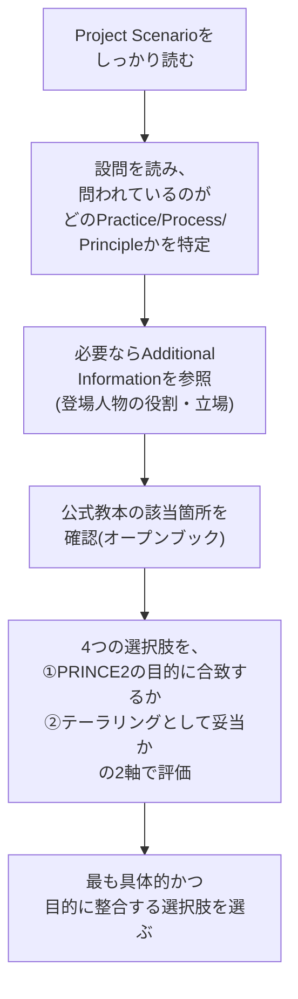

- **「なぜ」の部分が重要**: Classic形式は「Yes/No」だけでなく「なぜそう言えるか」の理由部分の妥当性まで問われます。理由が原則・プラクティス・プロセスの目的と整合しているかを必ず確認してください。
- **登場人物の役割を混同しない**: Matching形式では、シナリオ中の人物がどの役割(Executive、Senior User、Team Managerなど)かを正確に把握することが得点の鍵です。
- **オープンブックを過信しない**: 150分で56問を解く必要があり、逐一教本を調べる時間はありません。教本は「確認」のために使い、基本構造は事前に暗記しておくべきです。
- **配点比率を意識した時間配分**: Practices(51%)とProcesses(30%)に関する問題に、Principles(10%)やPeople(9%)よりも多くの時間を割けるよう、事前の習熟度を高めておく。

### 10.3 よくある誤答パターン(アンチパターン)

| アンチパターン | 該当する原則/プラクティス |
|---|---|
| Project Managerが独断でトレランス逸脱に対応し、報告しない | Manage by exception、Progress |
| ExecutiveとProject Managerの兼任 | Define roles, responsibilities and relationships、Organizing |
| ビジネスケースが更新されないままプロジェクトが継続される | Ensure continued business justification、Business Case |
| 成果物ではなくタスクを起点に計画が作られる | Focus on products、Plans |
| リスクの「好機」側面が無視される | Risk |
| 変更管理(組織的変革)と変更管理(課題対応)の混同 | People、Issues |
| テーラリングの名目でPRINCE2の最低要件を欠く | Tailor to suit the project |
| Project Boardが日々の業務に介入しすぎる、または重大な例外に関与しない | Directing a Project |
| ステージ境界の承認前に次ステージの作業が始まる | Manage by stages、Managing a Stage Boundary |

---

## 11. 参考文献・ソース (References)

本ガイドは以下の一次情報・信頼できる情報源をもとに作成しました。試験対策としては、特に①②の公式情報を優先的に参照してください。

1. **PeopleCert公式 — PRINCE2 Project Management Practitioner (Version 7) 製品ページ**(試験概要、対象者、前提資格、購入オプション)
   https://www.peoplecert.org/browse-certifications/project-programme-and-portfolio-management/PRINCE2-2/PRINCE2-7-practitioner-3581

2. **PeopleCert公式 — PRINCE2 7 Practitioner Syllabus(公式シラバスPDF)**(Learning Outcome、Assessment Criteria、Bloom's Level、配点比率、出題形式の一次情報)
   https://www.mkctraining.com/uploads/25/476df1a933-prince27pracsyllabus.pdf

3. PeopleCert公式 — PRINCE2 7 Foundation製品ページ(前提資格の確認)
   https://www.axelos.com/certifications/propath/prince2-project-management/prince2-7-foundation

4. PRINCE2.com(公式ライセンスパートナー)— "The 7 principles, practices and processes of PRINCE2"
   https://www.prince2.com/usa/blog/the-7-principles-themes-and-processes-of-prince2

5. PRINCE2.com — "PRINCE2® 7 has launched!"(サステナビリティ・ESG・UN SDGsに関する記述)
   https://www.prince2.com/usa/blog/prince2-7-has-launched

6. PRINCE2.com — "PRINCE2 Project Management roles & responsibilities: Who does what?"
   https://www.prince2.com/usa/blog/prince2-project-management-roles-and-responsibilities-who-does-what-on-a-prince2-project

7. Knowledge Train — "PRINCE2 7th Edition – What's different?"(V6からV7への変更点の整理)
   https://www.knowledgetrain.co.uk/project-management/prince2/prince2-course/prince2-7th-edition

8. Knowledge Train — "PRINCE2 Roles and Responsibilities"
   https://www.knowledgetrain.co.uk/project-management/prince2/prince2-roles-responsibilities

9. QA(公式トレーニングパートナー)— "PRINCE2 7 Foundation-Practitioner: Pre-Course Learning Guide"(People章の位置づけ)
   https://www.qa.com/courseware/pcw/pcw-qap27f-v1-0.pdf

10. Prosci — "What is PRINCE2 Change Management?"(ADKARモデルとPRINCE2 7の変革管理アプローチの関係)
    https://www.prosci.com/blog/what-is-prince2-change-management

11. The Projex Academy — "Demystifying PRINCE2 7 Practices"、"Processes and Practices in PRINCE2 7 Project Management"、"PRINCE2 7th Edition Sustainability Management Explained (Part 1/2)"、"PRINCE2 7th Edition Agree the Management Approaches and Establish the Project Controls" ほか一連の解説記事
    https://www.projex.com/demystifying-prince2-7-practices/
    https://www.projex.com/processes-and-practices-in-prince2-7-project-management/
    https://www.projex.com/prince2-7th-edition-sustainability-management-explained-part-1/
    https://www.projex.com/prince2-7th-edition-agree-the-management-approaches-and-establish-the-project-controls/

12. SPOCLearn — "PRINCE2 7 Roles Explained: Project Board to Team Manager"、"PRINCE2 7 Processes Explained"
    https://www.spoclearn.com/blog/prince2-7-roles-responsibilities/
    https://www.spoclearn.com/blog/prince2-7-processes-explained-step-by-step-guide/

13. PRINCE2® wiki(有志によるPRINCE2用語・管理プロダクトの整理サイト)— "Define roles, responsibilities, and relationships"、"Risk management approach"、"Management approaches"
    https://prince2.wiki/principles/defined-roles-and-responsibilities/
    https://prince2.wiki/management-products/baselines/management-approaches/risk/
    https://prince2.wiki/management-products/baselines/management-approaches/

14. Knowledgehut — "The 7 Processes of PRINCE2 [2025 Guide]"(各プロセスの活動一覧)
    https://www.knowledgehut.com/blog/project-management/prince2-processes

15. trustedinstitute.com — "Change Management Approach"、"Leadership and Team Management"(Practitioner v7向け実践的解説、変更管理と組織変革の区別)
    https://trustedinstitute.com/concept/prince2-practitioner-v7/people-management-in-projects/change-management-approach/
    https://trustedinstitute.com/concept/prince2-practitioner/effective-people-management-in-prince2/leadership-team-management/

---

### 免責事項

本ガイドはPeopleCert社の公式教材そのものではなく、公式シラバスおよび公開情報をもとに独自に作成した非公式の学習補助資料です。PRINCE2®はAXELOS Limitedの登録商標です。実際の試験範囲・出題傾向は、必ず最新の公式シラバスおよび公式教本(PRINCE2 7 Managing Successful Projects)で確認してください。
