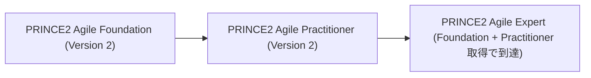
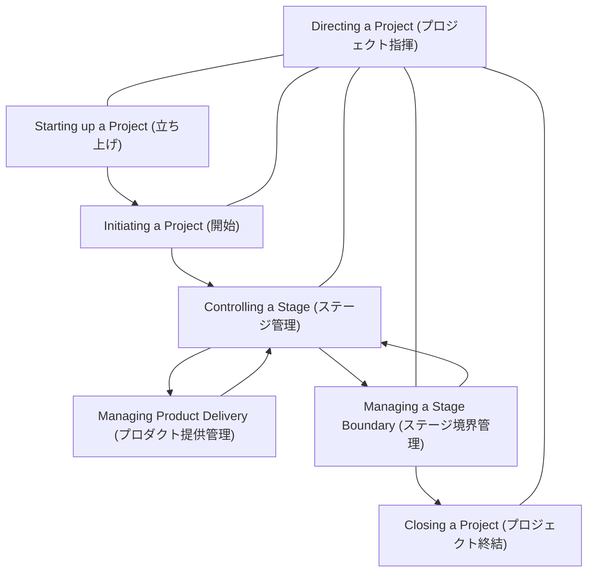
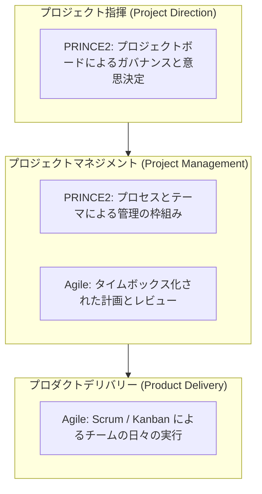
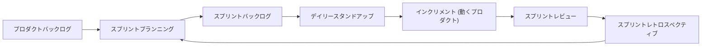
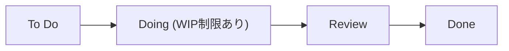
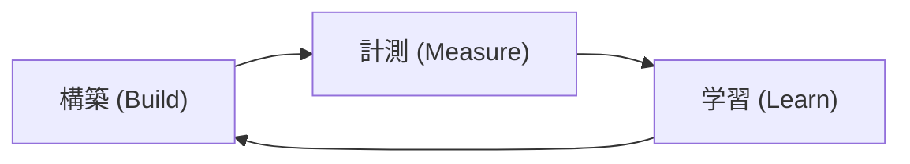
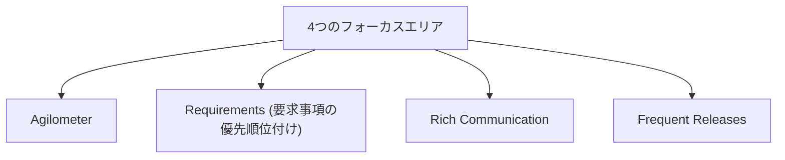
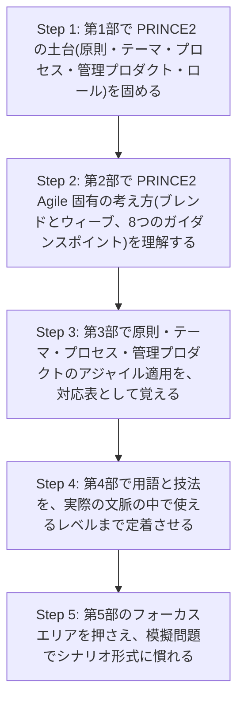

# PRINCE2 Agile Foundation (Version 2) 学習ガイド

> 初学者向け・ステップバイステップ解説 / Markdown + Mermaid図解版
> 対象試験: PeopleCert PRINCE2 Agile Foundation (Version 2)
> 公式製品ページ: https://www.peoplecert.org/browse-certifications/project-programme-and-portfolio-management/PRINCE2-Agile-28/prince2-agile-foundation-4074

---

## 目次

0. [この資格について](#0-この資格について)
1. [第1部: PRINCE2 の基礎知識 (Learning Outcome 1)](#1-第1部-prince2-の基礎知識-learning-outcome-1)
   - 1.1 プロジェクトと PRINCE2 の基本概念
   - 1.2 PRINCE2 の7つのプリンシプル (原則)
   - 1.3 PRINCE2 の7つのテーマ
   - 1.4 PRINCE2 の7つのプロセス
   - 1.5 PRINCE2 の主要な管理プロダクト
   - 1.6 PRINCE2 の主要ロール
2. [第2部: PRINCE2 Agile の基本概念 (Learning Outcome 2)](#2-第2部-prince2-agile-の基本概念-learning-outcome-2)
   - 2.1 PRINCE2 Agile とは何か / プロジェクトと BAU
   - 2.2 PRINCE2 Agile と親和性の高いアジャイル手法
   - 2.3 「ブレンドとウィーブ」と8つのガイダンスポイント
   - 2.4 PRINCE2 Agile デリバリーチームのロール
3. [第3部: 原則・テーマ・プロセス・管理プロダクトのアジャイルへの適用 (Learning Outcome 3)](#3-第3部-原則テーマプロセス管理プロダクトのアジャイルへの適用-learning-outcome-3)
   - 3.1 アジャイル文脈での PRINCE2 原則
   - 3.2 PRINCE2 Agile の5つの振る舞い (Behaviours)
   - 3.3 テーマごとのアジャイルガイダンス
   - 3.4 プロセスごとのアジャイルガイダンス
   - 3.5 管理プロダクトのテーラリング
   - 3.6 何を固定し何を柔軟にするか: ヘキサゴンと5つのターゲット
4. [第4部: アジャイルの実践用語と技法 (Learning Outcome 4)](#4-第4部-アジャイルの実践用語と技法-learning-outcome-4)
   - 4.1 用語集 (Glossary)
   - 4.2 主要なアジャイルの概念と技法
5. [第5部: フォーカスエリア (Learning Outcome 5)](#5-第5部-フォーカスエリア-learning-outcome-5)
   - 5.1 Agilometer (アジロメーター)
   - 5.2 Requirements (要求事項の優先順位付け)
   - 5.3 Rich Communication (リッチコミュニケーション)
   - 5.4 Frequent Releases (頻繁なリリース)
6. [第6部: 試験対策](#6-第6部-試験対策)
7. [付録: 用語集まとめ表](#7-付録-用語集まとめ表)
8. [参考文献・出典](#8-参考文献出典)

---

## 0. この資格について

### 0.1 資格の位置づけ

PRINCE2 Agile Foundation は、世界で最も広く使われているプロジェクトマネジメント手法 **PRINCE2** の統制・ガバナンスの枠組みと、**アジャイル (Agile)** の柔軟性・反復性を組み合わせた「PRINCE2 Agile」の基礎知識を認定する資格です。対象者は、アジャイル実務者、プロジェクトマネージャー、プロダクトオーナー、Scrum Master、開発者など、反復的・漸進的なプロダクトデリバリーに関わるすべての人です。前提資格は不要です。

> **ベストプラクティス:** PRINCE2 Agile は「PRINCE2 か Agile か」の二択ではなく、両方の強みを状況に応じて「どの程度」組み合わせるかを判断する手法です。学習の最初の段階で、この「二項対立で考えない」という姿勢を意識しておくと、以降の全テーマの理解が格段にスムーズになります。

### 0.2 試験概要

| 項目 | 内容 |
| --- | --- |
| 出題形式 | 四肢択一 (Objective Test Question) |
| 問題数 | 40問 |
| 試験時間 | 60分 (英語を母語・業務言語としない受験者は+25%の延長が可能な場合あり) |
| 合格基準 | 60% |
| 教材持ち込み | クローズドブック (不可) |
| 前提資格 | なし |
| 認定有効期間 | 3年 (更新には CPD ポイントの取得、または同スイート内の別資格取得が必要) |

> **出典:** PeopleCert 公式製品ページ「PRINCE2 Agile Foundation (Version 2)」 
> https://www.peoplecert.org/browse-certifications/project-programme-and-portfolio-management/PRINCE2-Agile-28/prince2-agile-foundation-4074

### 0.3 出題範囲 (Learning Outcome) の全体像

公式のシラバス文書では、出題範囲は次の5つの Learning Outcome (学習成果) に分かれています。本ガイドの第1部から第5部は、この5つの Learning Outcome にそのまま対応しています。

| LO | タイトル | 本ガイドの対応章 |
| --- | --- | --- |
| LO1 | プロジェクトと PRINCE2 に関する主要概念の理解 | 第1部 |
| LO2 | プロジェクトと PRINCE2 Agile に関する主要概念の理解 | 第2部 |
| LO3 | PRINCE2 の原則・テーマ・プロセス・管理プロダクトがアジャイル文脈でどのようにテーラリング・適用されるかの理解 | 第3部 |
| LO4 | アジャイルな働き方・主要用語・技法の理解 | 第4部 |
| LO5 | アジャイル文脈におけるフォーカスエリアの理解 | 第5部 |

> **出典:** PeopleCert / (旧)AXELOS「PRINCE2 Agile Foundation Candidate Syllabus」 
> https://www.koenig-solutions.com/CourseContent/custom/2019617460-PRINCE2AgileFoundationCandidateSyllabus.pdf ,
> https://www.oxfordcollegeofmanagement.com/wp-content/uploads/2025/06/PRINCE2-Agile-Foundation-Syllabus.pdf
>
> **注記 (バージョンに関する留意点):** 上記2件の Candidate Syllabus は PeopleCert の公式ドメインではなく第三者サイトによる非公式ミラー(8.2節参照)であり、試験時間・問題数・合格ラインについて「50問・55%合格」という、現行の PeopleCert 製品ページ(Version 2)の「40問・60分・60%合格」とは異なる旧版の情報を記載しています。このミラー文書だけでは、出題範囲(LO1〜LO5)やテーマ構成が Version 2 化後も変わっていないかどうかを確認できません。また PRINCE2 Agile は PRINCE2 の土台の上に成り立つ手法であり、PeopleCert は PRINCE2 側も「PRINCE2 Project Management Version 7」として改定を行っているため、本ガイドが扱う7つのテーマ等の用語・範囲が Version 7 の内容と整合しているかも合わせて確認が必要です。**受験前には必ず PeopleCert 公式サイトで最新の Candidate Syllabus・試験概要、および PRINCE2 Project Management Version 7 との用語・範囲の整合性を確認してください。**

### 0.4 学習の全体マップ

Foundation は「知識の再認・理解 (recall と comprehension)」を問う試験であるのに対し、Practitioner はケーススタディに基づく「適用力」を問う試験です。Foundation の内容を土台として、まず全体像を正確に押さえることが Practitioner 合格への近道です。

---

## 1. 第1部: PRINCE2 の基礎知識 (Learning Outcome 1)

PRINCE2 Agile はあくまで PRINCE2 という「土台」の上に成り立つ手法です。まず土台となる PRINCE2 そのものの構造を正確に理解しておきましょう。

### 1.1 プロジェクトと PRINCE2 の基本概念

PRINCE2 では、**プロジェクト (Project)** を「合意されたビジネスケースに基づき、1つ以上のビジネスプロダクトを提供するために作られる、一時的な組織」と定義します。これは日常的な業務である **BAU (Business As Usual)** と対比されます。

| 観点 | プロジェクト | BAU (定常業務) |
| --- | --- | --- |
| 期間 | 一時的 (開始と終了がある) | 継続的 |
| 目的 | 変化 (Change) を生み出す | 現状の運用を維持する |
| 性質 | 独自性が高い、リスクが相対的に大きい | 繰り返し性が高い、リスクが相対的に安定 |
| 組織 | プロジェクトのために臨時に編成される | 恒常的な組織構造 |

> **ベストプラクティス:** 「この作業はプロジェクトなのか BAU なのか」を最初に切り分けることは、ガバナンスの設計(誰が承認するか、どの程度の統制が必要か)を決める出発点になります。アジャイルなプロダクトチームであっても、予算・期限・ビジネスケースを伴う独立した取り組みであれば PRINCE2 のプロジェクト定義に当てはまります。

### 1.2 PRINCE2 の7つのプリンシプル (原則)

プリンシプルは、その取り組みが本当に PRINCE2 で管理されていると言えるかどうかを判断する「守るべき指針」です。7つすべてを適用してはじめて PRINCE2 と呼べます(テーラリング=調整は可能ですが、原則そのものを省略することはできません)。

| # | 原則 | 概要 |
| --- | --- | --- |
| 1 | 継続的なビジネス正当化 (Continued business justification) | プロジェクトを開始・継続する正当な理由が常に存在し、記録・承認され、有効であり続けることを確認する |
| 2 | 経験からの学習 (Learn from experience) | 過去の経験・教訓を探し、記録し、以降のプロジェクトに活かす |
| 3 | 役割と責任の明確化 (Defined roles and responsibilities) | 誰が何に責任を持つかを明確にし、ビジネス・ユーザー・サプライヤーの利害を代表する体制を作る |
| 4 | 段階(ステージ)による管理 (Manage by stages) | プロジェクトを複数のマネジメントステージに分割し、計画・監視・コントロールを段階的に行う |
| 5 | 例外による管理 (Manage by exception) | 各管理レベルに許容範囲(トレランス)を設定し、逸脱時のみ上位レベルへエスカレーションする |
| 6 | プロダクトへの焦点 (Focus on products) | 何をするか(活動)ではなく、何を生み出すか(プロダクトの品質要件)に焦点を当てる |
| 7 | プロジェクト環境に合わせたテーラリング (Tailor to suit the project environment) | プロジェクトの規模・複雑さ・重要性・能力・リスクに応じて手法を調整する |

> **ベストプラクティス:** 7原則の中でも「例外による管理」と「プロジェクト環境に合わせたテーラリング」は、後述するアジャイルとの親和性が特に高い原則です。自己組織化チームへの権限委譲(=例外による管理)と、状況に応じた運用調整(=テーラリング)は、PRINCE2 Agile を理解する上での重要な橋渡しになります。
>
> **出典:** PeopleCert / AXELOS 公式シラバス Learning Outcome 1.1 (7原則の一覧) 
> https://www.koenig-solutions.com/CourseContent/custom/2019617460-PRINCE2AgileFoundationCandidateSyllabus.pdf

### 1.3 PRINCE2 の7つのテーマ

テーマは、プロジェクトマネジメントの特定の側面について、常に対応し続ける必要がある領域です。

| # | テーマ | 目的 (何を扱うか) |
| --- | --- | --- |
| 1 | ビジネスケース (Business Case) | プロジェクトが望ましく、実行可能で、実現可能であり、投資に値することを立証・維持する仕組み |
| 2 | 組織 (Organization) | プロジェクトに関わる人々の役割と責任、指揮命令系統を定義する仕組み |
| 3 | 品質 (Quality) | プロダクトが目的に適合していることを確実にするための、品質要件の定義と検証の仕組み |
| 4 | 計画 (Plans) | プロダクトを土台にした計画づくりのステップと、進捗のコミュニケーション手段 |
| 5 | リスク (Risk) | 不確実性を識別・評価し、プロジェクトの目的達成への影響をマネジメントする仕組み |
| 6 | 変更 (Change) | 変更要求や懸念事項(イシュー)を識別・評価・コントロールする仕組み |
| 7 | 進捗 (Progress) | 計画に対する実績を監視し、継続の可否を判断し、コントロールを行う仕組み |

> **ベストプラクティス:** テーマは独立した「知識エリア」ではなく、相互に密接に連動しています。例えばリスクの深刻化はビジネスケースの見直しを引き起こし、それが進捗コントロールでの意思決定につながる、というように連鎖します。7テーマを暗記する際は「単独の定義」よりも「テーマ同士のつながり」を意識すると、第3部のアジャイル適用の理解が格段に深まります。
>
> **出典:** PeopleCert / AXELOS 公式シラバス Learning Outcome 1.2 
> https://www.koenig-solutions.com/CourseContent/custom/2019617460-PRINCE2AgileFoundationCandidateSyllabus.pdf

### 1.4 PRINCE2 の7つのプロセス

プロセスは、プロジェクトの開始から終結までの活動の流れを示します。**Directing a Project (プロジェクト指揮)** はプロジェクトボードによる意思決定プロセスであり、他の全プロセスを横断的に統制します。

| # | プロセス | 主な目的 |
| --- | --- | --- |
| 1 | Starting up a Project (立ち上げ) | プロジェクトが実施する価値があるかを確認する準備段階。プロジェクト概要書(Project Brief)を作成する |
| 2 | Initiating a Project (開始) | プロジェクトの土台を固める。プロジェクト・イニシエーション・ドキュメンテーション(PID)を作成する |
| 3 | Directing a Project (指揮) | プロジェクトボードが主要な意思決定を行う(継続可否、例外対応の承認など) |
| 4 | Controlling a Stage (ステージ管理) | プロジェクトマネージャーが日々のステージ運営を行い、ワークパッケージを割り当てる |
| 5 | Managing Product Delivery (プロダクト提供管理) | チームマネージャーがワークパッケージを受け取り、プロダクトを作成・納品する |
| 6 | Managing a Stage Boundary (ステージ境界管理) | 現ステージの完了報告と次ステージの計画をプロジェクトボードに提示する |
| 7 | Closing a Project (終結) | プロジェクトを正式に終結し、成果と教訓を確定する |

> **ベストプラクティス:** アジャイルなプロダクトチームは Managing Product Delivery と Controlling a Stage の間を、スプリントや反復のサイクルとして日々経験することになります。この2プロセスの「反復のリズム」こそが、PRINCE2 の段階的な統制とアジャイルのタイムボックスが接続する最重要ポイントです。
>
> **出典:** PeopleCert / AXELOS 公式シラバス Learning Outcome 1.3 
> https://www.koenig-solutions.com/CourseContent/custom/2019617460-PRINCE2AgileFoundationCandidateSyllabus.pdf

### 1.5 PRINCE2 の主要な管理プロダクト

管理プロダクト(マネジメントプロダクト)は、プロジェクトのガバナンスに使われる文書類です。Foundation 試験では次の7種類が中心的に問われます。

| 管理プロダクト | 目的 |
| --- | --- |
| ビジネスケース (Business Case) | 投資判断の根拠となる、プロジェクトの妥当性・実行可能性を記録する文書 |
| チェックポイントレポート (Checkpoint Report) | チームマネージャーからプロジェクトマネージャーへの定期的な進捗報告 |
| ハイライトレポート (Highlight Report) | プロジェクトマネージャーからプロジェクトボードへの定期的な進捗報告 |
| プロジェクト概要書 (Project Brief) | プロジェクトを開始する価値があるかを判断するための概要情報 |
| プロジェクト・イニシエーション・ドキュメンテーション (PID) | プロジェクトの「何を・なぜ・誰が・どのように」を定義する基準文書一式 |
| プロジェクトプロダクト記述書 (Project Product Description) | プロジェクト全体の最終成果物とその品質要件を定義する文書 |
| ワークパッケージ (Work Package) | チームマネージャー(または個人)に委任される作業内容の合意文書 |

> **ベストプラクティス:** アジャイル文脈では、これらの文書を「一度作って終わり」の静的なものと捉えず、継続的に更新される「生きた(living)」情報源として運用します。特にハイライトレポートやチェックポイントレポートは、情報ラジエーター(Information Radiator)やバーンチャートで代替・補強されることが多く、第3部で詳しく解説します。
>
> **出典:** PeopleCert / AXELOS 公式シラバス Learning Outcome 1.4 
> https://www.koenig-solutions.com/CourseContent/custom/2019617460-PRINCE2AgileFoundationCandidateSyllabus.pdf

### 1.6 PRINCE2 の主要ロール

| ロール | 責任の概要 |
| --- | --- |
| プロジェクトボード (Project Board) | プロジェクト全体に説明責任を負う意思決定機関(Executive・Senior User・Senior Supplier で構成) |
| Executive (エグゼクティブ) | プロジェクトの投資対効果に最終責任を持つ、プロジェクトボードの議長役 |
| Senior User (シニアユーザー) | プロダクトを利用する立場を代表し、ベネフィット実現に責任を持つ |
| Senior Supplier (シニアサプライヤー) | プロダクトを提供するリソース・専門知識を代表する |
| Project Manager (プロジェクトマネージャー) | プロジェクトの日々のマネジメントに責任を持つ |
| Team Manager (チームマネージャー) | ワークパッケージを受け取り、プロダクトの作成を管理する(アジャイルでは Scrum Master がこの役割を兼ねることが多い) |

> **ベストプラクティス:** アジャイルなデリバリーチームでは「チームマネージャー」という肩書きは使われず、Scrum Master やプロダクトオーナーといったアジャイル固有の呼称が使われます。試験対策としては、PRINCE2 の役割名とアジャイルでの一般的な呼称の「対応関係」を意識して覚えると混乱を避けられます(詳細は 2.4 節)。
>
> **出典:** PeopleCert / AXELOS 公式シラバス Learning Outcome 1.5 
> https://www.koenig-solutions.com/CourseContent/custom/2019617460-PRINCE2AgileFoundationCandidateSyllabus.pdf

---

## 2. 第2部: PRINCE2 Agile の基本概念 (Learning Outcome 2)

### 2.1 PRINCE2 Agile とは何か / プロジェクトと BAU

PRINCE2 Agile は、PRINCE2 の**ガバナンスとコントロールの枠組み**に、アジャイルの**振る舞い・概念・フレームワーク・技法**を組み合わせた手法です。PRINCE2 が「何を管理するか(統制の仕組み)」を提供し、アジャイルが「どう実行するか(デリバリーの方法)」を提供する、と整理すると理解しやすくなります。

PRINCE2 Agile では、BAU との違いを踏まえた上で、プロジェクトの中でもとりわけ**プロダクトデリバリーの領域(何を、どの順番で作るか)**にアジャイルの反復性・漸進性を適用します。一方でプロジェクト全体のガバナンス(投資判断、ステージゲート、例外管理)は PRINCE2 の枠組みが担います。

> **ベストプラクティス:** 「PRINCE2 が統治(Govern)し、アジャイルが実行(Deliver)する」という一文で全体像を要約できるようにしておくと、試験のシナリオ問題で迷ったときの判断軸になります。

### 2.2 PRINCE2 Agile と親和性の高いアジャイル手法

公式シラバスでは、PRINCE2 Agile と組み合わせて使うのに適したアジャイルの働き方として、次の3つが明示されています。

| 手法 | 特徴 | PRINCE2 Agile との関係 |
| --- | --- | --- |
| Scrum (スクラム) | プロダクトオーナー・Scrum Master・開発チームという役割構成と、スプリントという固定長のタイムボックスで反復的にプロダクトを作る軽量フレームワーク | プロダクトデリバリーレベルで最も一般的に組み合わされる。ワークパッケージをスプリントバックログとして扱うなどの接続が可能 |
| Kanban (カンバン) | 作業の可視化、WIP(仕掛かり)制限、継続的なフローの最適化を重視する手法。固定のタイムボックスを持たない | 運用・保守フェーズや、優先順位が頻繁に変わる作業の管理に向く。Controlling a Stage の日常運営と相性が良い |
| Lean Startup (リーンスタートアップ) | 「構築・計測・学習」のループを回し、最小限の実用可能なプロダクト(MVP)で仮説検証を行う考え方 | 不確実性の高い新規プロダクト開発において、ビジネスケースの検証やプロジェクトプロダクト記述書の初期定義に活用される |

> **ベストプラクティス:** 試験では「どのアジャイル手法をどの場面で使うか」を問う設問が出ます。目安として、**要件が比較的明確で反復的に作り込む場合は Scrum**、**継続的なフローで優先順位が流動的な場合は Kanban**、**そもそも何を作るべきかが不確実な場合は Lean Startup** という使い分けを覚えておくと判断しやすくなります。
>
> **出典:** PeopleCert / AXELOS 公式シラバス Learning Outcome 2.2 
> https://www.koenig-solutions.com/CourseContent/custom/2019617460-PRINCE2AgileFoundationCandidateSyllabus.pdf

### 2.3 「ブレンドとウィーブ」と8つのガイダンスポイント

PRINCE2 Agile は、PRINCE2 と アジャイルを「ブレンド(混ぜ合わせる)」し、さらにプロジェクトの3つのレベル全体に「ウィーブ(織り込む)」ことを目指します。

一般に、PRINCE2 の統制色は「プロジェクト指揮」レベルで強く、アジャイルの実行色は「プロダクトデリバリー」レベルで強くなります。「プロジェクトマネジメント」レベルはその中間として、両者を橋渡しする役割を担います。

この「ブレンドとウィーブ」を正しく理解するための前提として、公式ガイダンスは次の8つのガイダンスポイントを示しています(誤解が起きやすい論点を明確化するためのものです)。

| # | ガイダンスポイント(要旨) |
| --- | --- |
| 1 | 現行版の PRINCE2 は、もともとアジャイルと組み合わせて使えるように作られている。専用の「アジャイル版 PRINCE2」が必要なのではなく、力点の置き方と詳細なガイダンスの追加が必要なだけである |
| 2 | PRINCE2 はどのようなスタイルのプロジェクトにも適用できる汎用的な手法であり、アジャイルと対比される「伝統的(ウォーターフォール的)」な手法と決めつけるべきではない |
| 3 | PRINCE2 Agile は IT プロジェクト専用ではなく、あらゆる種類のプロジェクトに適用できる |
| 4 | XP(エクストリーム・プログラミング)や SAFe のような「IT専用」のフレームワーク・技法にも触れるが、詳細には踏み込まない |
| 5 | アジャイルは Scrum だけではない。アジャイルは Scrum よりもはるかに広い概念である |
| 6 | 最もよく使われるアジャイルの手法は Scrum と Kanban だが、これらは単独でプロジェクト全体をマネジメントするには不十分である。ただし、プロジェクトという枠組みの中でなら効果的に活用できる |
| 7 | 本ガイダンスにおける「アジャイル」という言葉は、単一の手法ではなく、振る舞い・概念・フレームワーク・技法からなる「一つのファミリー」を指す |
| 8 | プロジェクトでアジャイルを使うかどうかは「はい/いいえ」の二択ではなく、「どの程度(どれくらいの強さで)」使うかという程度問題である |

> **ベストプラクティス:** 8つのガイダンスポイントの中でも、特に5・7・8番目は試験で頻出です。「アジャイル=Scrumではない」「アジャイルは程度問題である」という2点を軸に理解しておくと、選択式問題の誤答選択肢(ディストラクター)を見抜きやすくなります。
>
> **出典:** AXELOS 公式オンライン出版「PRINCE2 Agile」第3.6節 (Important points about PRINCE2 Agile and this manual) 
> https://publications.axelos.com/PRINCE2Agile2016/content.aspx?showNav=true&expandNav=true&page=PRA_25

### 2.4 PRINCE2 Agile デリバリーチームのロール

Foundation シラバスでは、デリバリーチームに関わる次の4つのロール(責任・コンピテンシー)が明示されています。

| ロール | 概要 |
| --- | --- |
| Customer Subject Matter Expert (顧客側の専門家) | 業務要件や顧客ニーズについて深い知識を持ち、デリバリーチームに助言する |
| Customer Representative (顧客代表) | 顧客側の優先順位付けや意思決定を代表する(PRINCE2 Agile ではプロダクトオーナーがこの役割を担うことが多い) |
| Supplier Subject Matter Expert (サプライヤー側の専門家) | 技術的な実装方法について深い知識を持ち、デリバリーチームに助言する |
| Supplier Representative (サプライヤー代表) | 提供側の技術的な意思決定を代表する |

> **ベストプラクティス:** 実務では、これらの役割に加えて **Product Owner(プロダクトオーナー)** と **Scrum Master** という呼称がよく使われます。Foundation レベルでは上記4ロールの「責任の性質」を理解することが優先されますが、Product Owner ≒ Customer Representative、Scrum Master ≒ Team Manager(のアジャイル版)という対応関係を押さえておくと、Practitioner レベルへの橋渡しがスムーズになります。
>
> **出典:** PeopleCert / AXELOS 公式シラバス Learning Outcome 2.4 
> https://www.koenig-solutions.com/CourseContent/custom/2019617460-PRINCE2AgileFoundationCandidateSyllabus.pdf

---

## 3. 第3部: 原則・テーマ・プロセス・管理プロダクトのアジャイルへの適用 (Learning Outcome 3)

この第3部は Foundation 試験の中で最も配点比率が高い領域です。第1部・第2部で学んだ PRINCE2 の基礎知識を、実際にどうアジャイルに「テーラリング(調整)」するかを扱います。

### 3.1 アジャイル文脈での PRINCE2 原則

PRINCE2 の7原則は、アジャイル文脈でも一切省略されません。むしろ、アジャイルの実践はこれらの原則をより強く体現する形で表れます。

| 原則 | アジャイル文脈での現れ方 |
| --- | --- |
| 継続的なビジネス正当化 | プロダクトバックログの価値順の並び替えや、リリースごとのベネフィット確認を通じて、正当性が継続的に再検証される |
| 経験からの学習 | スプリントレトロスペクティブという形で、学習のサイクルが定例化・高頻度化される |
| 役割と責任の明確化 | Product Owner・Scrum Master・開発チームという明確な役割分担が PRINCE2 の役割構造と結びつけられる |
| 段階による管理 | ステージがリリースに、リリースがスプリントにと、入れ子構造でさらに細かく段階化される |
| 例外による管理 | チームへの権限委譲が徹底され、トレランスの範囲内であれば自己組織化チームが自律的に判断する |
| プロダクトへの焦点 | プロダクトバックログアイテムや受け入れ基準(Acceptance Criteria)という形で、プロダクト志向がさらに具体化される |
| テーラリング | アジャイル自体がテーラリングの一形態であり、Agilometer(5.1節)を使って適用度合いを調整する |

> **ベストプラクティス:** 「アジャイルは PRINCE2 の原則を弱める」という誤解は試験でよく狙われるひっかけです。実際は逆で、アジャイルは原則(特に例外による管理と経験からの学習)を、より高頻度・高強度で実践する手段だと理解しておきましょう。
>
> **出典:** AXELOS 公式オンライン出版「PRINCE2 Agile」第7章 (Agile and the PRINCE2 principles) 
> https://publications.axelos.com/PRINCE2Agile2016/

### 3.2 PRINCE2 Agile の5つの振る舞い (Behaviours)

PRINCE2 Agile は、特定の技法だけでなく「振る舞い(Behaviours)」の実践を重視します。

| # | 振る舞い | 概要 |
| --- | --- | --- |
| 1 | Transparency (透明性) | 進捗・課題・リスクを隠さず可視化する。情報ラジエーターなどで誰もが状況を確認できる状態を作る |
| 2 | Collaboration (協働) | 役割の壁を越えてチーム・ステークホルダーが共に働く。プロジェクトボードとの協働的な意思決定も含む |
| 3 | Rich Communication (リッチコミュニケーション) | 対面での会話や視覚的な手段など、最も情報量の多いコミュニケーション手段を優先する |
| 4 | Self-organization (自己組織化) | 実行方法の詳細をチーム自身に委ね、プロジェクトマネージャーはファシリテーターとしての役割を担う |
| 5 | Exploration (探求) | 頻繁な反復とフィードバックループを通じて、学びながら前進する姿勢 |

> **ベストプラクティス:** 5つの振る舞いは互いに補強し合う関係にあります。例えば Transparency がなければ Collaboration は機能せず、Self-organization がなければ Exploration から得た学びをチームが素早く活かせません。試験では単独の定義よりも「なぜこの振る舞いが必要か」という文脈理解が問われます。
>
> **出典:** PeopleCert / AXELOS 公式シラバス Learning Outcome 3.2 
> https://www.koenig-solutions.com/CourseContent/custom/2019617460-PRINCE2AgileFoundationCandidateSyllabus.pdf

### 3.3 テーマごとのアジャイルガイダンス

| テーマ | アジャイル文脈での主な調整ポイント |
| --- | --- |
| ビジネスケース | 一度に確定させず、リリースごとに価値を検証し、ベネフィットを漸進的に実現していく。MVP(実用最小限のプロダクト)を用いて早期に仮説検証を行うこともある |
| 組織 | Product Owner・Scrum Master という一般的なアジャイルロールを、PRINCE2 のロール構造(顧客代表・チームマネージャー)に対応づける。サーバントリーダーシップが重視される |
| 品質 | Definition of Done(完了の定義)と受け入れ基準を用いて品質を継続的に検証する。品質基準そのものは「固定」され、妥協の対象にはしない(3.6節参照) |
| 計画 | プロダクトベースの計画づくりがプロダクトバックログと自然に整合する。ストーリーポイントや T シャツサイズ見積りなど、アジャイル特有の見積り技法を用いる |
| リスク | 頻繁なフィードバックループ自体がリスク低減策となる(誤ったものを作り続けるリスクを早期に発見できる)。リスクはデイリースタンドアップやレビューの中でも継続的に見直される |
| 変更 | トレランスの範囲内であれば、自己組織化したチームが正式な変更管理プロセスを経ずに動的に対応する。トレランスを超える変更のみ、正式な例外処理としてプロジェクトボードに上げる |
| 進捗 | バーンチャート、カンバンボード、情報ラジエーターといったアジャイル指標を用いて、稼働しているプロダクトそのものを進捗の証拠とする |

> **ベストプラクティス:** 各テーマの調整は「PRINCE2 の目的を変えずに、実現手段をアジャイルの技法に置き換える」という発想で理解すると覚えやすくなります。目的(なぜそのテーマが必要か)は変わらず、手段(どう実現するか)がアジャイルの技法に置き換わる、という構造は7テーマすべてに共通しています。
>
> **出典:** PeopleCert / AXELOS 公式シラバス Learning Outcome 3.3 
> https://www.koenig-solutions.com/CourseContent/custom/2019617460-PRINCE2AgileFoundationCandidateSyllabus.pdf

### 3.4 プロセスごとのアジャイルガイダンス

| プロセス | アジャイル文脈での主な調整ポイント |
| --- | --- |
| Starting up a Project | 立ち上げの段階から将来のデリバリーチームを巻き込み、初期プロダクトバックログや Definition of Done の土台を作り始める |
| Initiating a Project | PID の中に、何を固定し何を柔軟にするか(3.6節のヘキサゴン)を明示的に合意として記載する。ワーキングアグリーメントもこの段階で整える |
| Directing a Project | プロジェクトボードとの関わりがより頻繁かつ協働的になる。詳細な文書よりも、情報ラジエーターや実際に動くプロダクトのデモを通じた合意形成が重視される |
| Controlling a Stage | ステージがリリース・スプリント単位に細分化される。プロジェクトマネージャーの役割は、詳細な指示出しからファシリテーション・障害の除去へとシフトする |
| Managing Product Delivery | ワークパッケージがスプリントバックログとして扱われる。チェックポイントレポートはデイリースタンドアップやバーンチャートで代替・補強される |
| Managing a Stage Boundary | スプリントレビュー・レトロスペクティブと、ステージ境界での正式な報告が組み合わされる。学びはステージ境界を待たず継続的に記録される |
| Closing a Project | 漸進的リリースを通じてベネフィットの多くはすでに実現されていることが多く、終結時は正式な受け入れ確認と運用への移行、最終ふりかえりに重点が置かれる |

> **ベストプラクティス:** 7プロセスの中でも Directing a Project と Controlling a Stage は、アジャイル化によってプロジェクトマネージャーとプロジェクトボードの「関わり方」が最も大きく変わる部分です。「詳細な統制」から「頻度は高いが軽量な協働」への転換を意識しておきましょう。
>
> **出典:** PeopleCert / AXELOS 公式シラバス Learning Outcome 3.4 
> https://www.koenig-solutions.com/CourseContent/custom/2019617460-PRINCE2AgileFoundationCandidateSyllabus.pdf

### 3.5 管理プロダクトのテーラリング

| 管理プロダクト | アジャイル文脈でのテーラリング例 |
| --- | --- |
| ビジネスケース | 詳細な数値予測よりも、価値順に並んだプロダクトバックログとの整合性を重視し、軽量かつ頻繁に見直す |
| チェックポイントレポート | 多くの場合、デイリースタンドアップと可視化されたタスクボードに置き換えられる(契約上必要な場合は簡潔な形式で残す) |
| ハイライトレポート | 頻度を高め、分量を絞り、バーンチャートやカンバンボードのスクリーンショットなど視覚的な情報で代替・補強する |
| プロジェクト概要書 | 早い段階からデリバリーチームと協議し、実現可能性やアジャイル適性(Agilometer)を確認する |
| PID | 何を固定・何を柔軟にするかという合意(ヘキサゴン)を明文化する |
| プロジェクトプロダクト記述書 | 品質基準を明確な「譲れない基準線」として定義し、Definition of Done の拠り所とする |
| ワークパッケージ | 個別の技術仕様よりも、対象スプリントのユーザーストーリー群と Definition of Done への参照で構成する |

> **ベストプラクティス:** 管理プロダクトのテーラリングにおいて重要なのは「文書を減らすこと」自体が目的ではなく、「同じガバナンス上の目的を、より軽量な手段で達成すること」が目的だという点です。文書を省略した結果、意思決定に必要な情報が失われてしまっては本末転倒です。
>
> **出典:** PeopleCert / AXELOS 公式シラバス Learning Outcome 3.5 
> https://www.koenig-solutions.com/CourseContent/custom/2019617460-PRINCE2AgileFoundationCandidateSyllabus.pdf

### 3.6 何を固定し何を柔軟にするか: ヘキサゴンと5つのターゲット

PRINCE2 Agile では、プロジェクトのパフォーマンスを構成する6つの側面(アスペクト)を「ヘキサゴン(六角形)モデル」として捉え、どれを「固定(Fix)」しどれを「柔軟(Flex)」にするかを事前に合意します。

| アスペクト | 典型的な扱い | 理由 |
| --- | --- | --- |
| 時間 (Time) | 固定 | 期限を守ることが顧客にとっての価値の中心となることが多いため |
| コスト (Cost) | 固定 | 予算超過は多くの組織で許容度が低いため |
| 品質 (Quality) | 基準線を固定(妥協しない) | 品質基準を下げることは長期的な信頼や保守性を損なうため |
| スコープ (Scope) | 柔軟 | MoSCoW 等の優先順位付けにより、時間とコストを守りながら調整できる余地を持たせるため |
| ベネフィット (Benefits) | 状況に応じて固定/柔軟 | プロジェクトの目的によって、どの程度厳密に扱うかが異なるため |
| リスク (Risk) | 状況に応じて固定/柔軟 | アジャイル自体がリスク低減策となる面もあり、プロジェクトのリスク許容度に応じて調整するため |

> **注記:** 「時間とコストを固定し、スコープと品質を柔軟にする」という組み合わせが典型例としてよく紹介されますが、実際には品質基準そのものは妥協しないという考え方が PRINCE2 Agile の核心です。柔軟にするのは「品質基準を満たすために、どの機能をどこまで作り込むか」というスコープ側の話であり、品質の「基準」自体を下げることではありません。

このヘキサゴンの考え方を支えるのが、次の**5つのターゲット**です。

| # | ターゲット | 概要 |
| --- | --- | --- |
| 1 | 期限を守り、時間通りに完了する (Be on time and hit deadlines) | 予測可能性を高め、ステークホルダーの信頼を維持する |
| 2 | 品質の水準を保護する (Protect the level of quality) | 期限に追われて品質検証(テスト・レビュー)を省略しない |
| 3 | 変化を受け入れる (Embrace change) | 詳細の変化は当然のものとして扱い、コントロールされた形で対応する |
| 4 | チームを安定させる (Keep teams stable) | メンバーの入れ替えを避け、チームの生産性・一体感を維持する |
| 5 | 顧客はすべてを必要としているわけではないと理解する (Accept that the customer doesn't need everything) | 優先順位の低い要求は削ってもよいという前提を関係者全員で共有する |

> **ベストプラクティス:** ヘキサゴンと5つのターゲットは Foundation 試験の頻出テーマです。「なぜスコープを柔軟にするのか」という問いに対して、常に「5つのターゲットを守るため」という因果関係で答えられるようにしておくと、シナリオ形式の設問にも対応しやすくなります。
>
> **出典:** PeopleCert / AXELOS 公式シラバス Learning Outcome 3.6 
> https://www.koenig-solutions.com/CourseContent/custom/2019617460-PRINCE2AgileFoundationCandidateSyllabus.pdf

---

## 4. 第4部: アジャイルの実践用語と技法 (Learning Outcome 4)

### 4.1 用語集 (Glossary)

Foundation 試験では、以下の基本用語の定義を正確に再認できることが求められます。

| 用語 | 定義 |
| --- | --- |
| バックログ (Backlog: sprint / release / product) | 未着手の作業項目を優先順位順に並べたリスト。スプリントバックログ・リリースバックログ・プロダクトバックログの3階層がある |
| ベネフィット (Benefit / Value) | プロジェクトの成果によってもたらされる、測定可能なプラスの効果 |
| エピック (Epic) | 複数のユーザーストーリーに分解される、大きな粒度の要求事項 |
| 情報ラジエーター (Information Radiator) | チームの状況(進捗・課題など)を、通りがかった誰もが一目で把握できるように可視化した掲示物・ボード |
| スパイク (Spike) | 技術的な不確実性や未知の課題を調査するために行う、時間を区切った調査作業 |
| スタンドアップミーティング (Stand-up Meeting) | チームが短時間・立ったまま行う、日々の進捗共有ミーティング(デイリースクラムとも呼ばれる) |
| タイムボックス (Timebox: sprint / release) | 開始と終了が固定された、あらかじめ定められた時間の枠 |
| ベロシティ (Velocity) | チームが1回のタイムボックス(スプリント等)で完了できる作業量の実績値。将来の計画の目安として使う |
| ウォーターフォール手法 (Waterfall Methodology) | 要件定義・設計・実装・テストといった工程を順番に一度ずつ進める、伝統的な開発アプローチ |

> **ベストプラクティス:** 用語の暗記は「単語カード」的な学習だけでなく、実際の一文の中で使ってみることをお勧めします。例えば「スプリントの終わりに、チームはベロシティを記録し、次のリリースバックログの計画に活かす」のように、複数の用語を組み合わせた文を自分で作ると、用語同士の関係性が定着しやすくなります。
>
> **出典:** PeopleCert / AXELOS 公式シラバス Learning Outcome 4.1 (Glossary) 
> https://www.koenig-solutions.com/CourseContent/custom/2019617460-PRINCE2AgileFoundationCandidateSyllabus.pdf

### 4.2 主要なアジャイルの概念と技法

#### 4.2.1 Scrum (スクラム)

Scrum は、プロダクトオーナー・Scrum Master・開発チームという3つの役割と、スプリントという固定長のタイムボックスを中心に構成される、最も広く使われる軽量フレームワークです。

> **ベストプラクティス:** PRINCE2 Agile の文脈では、スプリントの単位をそのままワークパッケージの期間と一致させると、チームマネージャー(Scrum Master)によるプロダクトデリバリー管理がしやすくなります。

#### 4.2.2 Kanban (カンバン)

Kanban は固定のタイムボックスを持たず、作業の流れ(フロー)を可視化し、WIP(仕掛かり作業)を制限することでスループットを最適化する手法です。

> **ベストプラクティス:** 保守運用フェーズや、優先順位が頻繁に変わる差し込み作業が多い環境では、固定タイムボックスを持つ Scrum よりも Kanban の方が PRINCE2 のステージ管理と相性が良いことがあります。

#### 4.2.3 Lean Startup と MVP

Lean Startup は「構築(Build)・計測(Measure)・学習(Learn)」のループを繰り返し、仮説を素早く検証していく考え方です。**MVP(Minimum Viable Product: 実用最小限のプロダクト)** は、この検証を可能にする最小限の機能を備えたプロダクトを指します。

> **ベストプラクティス:** MVP は「品質を落とした簡易版」ではなく、「学びを得るために必要十分な機能を備えた完成品」です。3.6節の「品質基準は固定する」という考え方と矛盾しないよう、MVP であっても品質基準そのものは維持する必要があります。

#### 4.2.4 レトロスペクティブ (Retrospectives)

チームが定期的に自分たちの働き方を振り返り、改善点を特定するための場です。PRINCE2 の「経験からの学習」の原則を、高頻度かつ実践的に体現する仕組みです。

#### 4.2.5 ユーザーストーリーと Definition of Ready / Done

ユーザーストーリーは、エンドユーザーの視点から「誰が」「何を」「なぜ」欲しいのかを簡潔に記述した要求事項の単位です。着手可能と判断する基準を **Definition of Ready(準備完了の定義)**、完了と判断する基準を **Definition of Done(完了の定義)** と呼び、あいまいさを排除するために使われます。

#### 4.2.6 ワークショップ (Workshops)

要件の洗い出し、優先順位付け、問題解決などを目的に、関係者を集めて集中的に行う共同作業セッションです。リッチコミュニケーション(5.3節)を実現する代表的な手段の一つです。

#### 4.2.7 バーンチャート (Burn Charts)

残作業量(バーンダウンチャート)や完了作業量(バーンアップチャート)を時間の推移とともに可視化したグラフです。進捗テーマにおける主要な情報ラジエーターとして機能します。

#### 4.2.8 アジャイル見積り (ポイントと T シャツサイジング)

相対見積りの技法です。ストーリーポイントは作業の相対的な複雑さ・工数を数値(フィボナッチ数列が使われることが多い)で表し、T シャツサイジング(S/M/L/XL等)はより粗い粒度で相対規模を表します。いずれも絶対的な時間見積りよりも精度と速度のバランスに優れるとされます。

#### 4.2.9 ワーキングアグリーメント (Working Agreements)

チームが自分たちの働き方について合意する取り決めです。稼働時間、コミュニケーションのルール、品質基準の運用方法などを含み、自己組織化(Self-organization)を支える基盤になります。

> **ベストプラクティス:** 4.2節の技法はいずれも独立した知識ではなく、3.3節・3.4節で見たテーマ・プロセスのアジャイルガイダンスを実現するための「道具箱」です。「このテーマ・プロセスを実現するために、どの技法が使えるか」という対応関係を意識して学習すると、知識が有機的につながります。
>
> **出典:** PeopleCert / AXELOS 公式シラバス Learning Outcome 4.2 
> https://www.koenig-solutions.com/CourseContent/custom/2019617460-PRINCE2AgileFoundationCandidateSyllabus.pdf

---

## 5. 第5部: フォーカスエリア (Learning Outcome 5)

フォーカスエリアは、PRINCE2 Agile を実践する上で特に重点的に扱うべき4つの領域です。

### 5.1 Agilometer (アジロメーター)

Agilometer は、プロジェクトがどの程度アジャイルに適しているかを可視化するための診断ツールです。次の6つのスライダー(評価軸)について、低い(アジャイルに不向き)から高い(アジャイルに好適)までを評価します。

| # | スライダー | 評価する内容 |
| --- | --- | --- |
| 1 | 何が提供されるかの柔軟性 (Flexibility on what is delivered) | スコープをどれだけ柔軟に扱えるか |
| 2 | 協働のレベル (Level of collaboration) | 顧客・サプライヤー間がどれだけ協力的な関係にあるか(契約が敵対的でないか) |
| 3 | コミュニケーションの容易さ (Ease of communication) | 関係者間で直接的・高頻度なコミュニケーションがどれだけ取りやすいか |
| 4 | 反復的・漸進的に作業する能力 (Ability to work iteratively and deliver incrementally) | 分割してリリースすることが許容される環境か(規制要件などで一括納品が必須でないか) |
| 5 | 有利な環境条件 (Advantageous environmental conditions) | 組織文化・ツール・設備がアジャイルの実践を支援しているか |
| 6 | アジャイルの受容度 (Acceptance of Agile) | 関係者がアジャイルな働き方をどれだけ理解し、受け入れているか |

各スライダーを評価し、六角形のレーダーチャートのような形で可視化することで、プロジェクトチームは「どの領域に追加のガイダンスやリスク対応が必要か」を早期に把握できます。

> **ベストプラクティス:** Agilometer は一度きりの評価ではなく、プロジェクトを通じて定期的に再評価すべきものです。スコアが低い項目があっても「アジャイルを使うべきではない」という結論に直結するわけではなく、「その領域に追加のガイダンス・緩和策が必要」というシグナルとして扱うのが正しい使い方です。
>
> **出典:** AXELOS 公式オンライン出版「PRINCE2 Agile」第6章 (Fix and flex: what can and cannot be varied?) 
> https://publications.axelos.com/PRINCE2Agile2016/

### 5.2 Requirements (要求事項の優先順位付け)

PRINCE2 Agile では、要求事項の優先順位付け技法として **MoSCoW** が推奨されます。

| 優先度 | 意味 |
| --- | --- |
| Must have (必須) | これがなければリリースが成立しない要求 |
| Should have (推奨) | 重要だが、なくてもリリース自体は成立する要求 |
| Could have (あれば良い) | 望ましいが、優先度が低い要求 |
| Won't have this time (今回は対象外) | 今回のタイムボックスでは扱わないと合意された要求 |

> **ベストプラクティス:** 「Must have」の割合をタイムボックスの作業量の60%程度に抑え、残りを Should/Could に配分するという目安がよく使われます。Must have の比率が高すぎると、3.6節で見た「スコープを柔軟にする」余地がなくなり、期限や品質を守れなくなるリスクが高まります。
>
> **出典:** PeopleCert / AXELOS 公式シラバス Learning Outcome 5.2 
> https://www.koenig-solutions.com/CourseContent/custom/2019617460-PRINCE2AgileFoundationCandidateSyllabus.pdf

### 5.3 Rich Communication (リッチコミュニケーション)

情報量の多いコミュニケーション手段(対面での会話、ホワイトボードでの図解、実際に動くプロダクトのデモなど)を、情報量の少ない手段(長文の文書、形式的なメールのみのやり取り)より優先する考え方です。3.2節の「振る舞い」の一つである Transparency を実現する土台になります。

> **ベストプラクティス:** リモート・分散環境では対面コミュニケーションに制約があるため、ビデオ会議での画面共有、共同編集可能なオンラインホワイトボードなど、可能な限り情報量の多い代替手段を選ぶことが推奨されます。

### 5.4 Frequent Releases (頻繁なリリース)

小さく・頻繁にプロダクトをリリースすることで、早い段階からフィードバックを得て、リスクを低減し、ベネフィットを早期に実現するという考え方です。

> **ベストプラクティス:** リリース頻度を上げることは、3.6節の5つのターゲットのうち「変化を受け入れる」「顧客はすべてを必要としているわけではないと理解する」を実現するための最も直接的な手段です。リリースの粒度を小さくするほど、方向修正のコストは小さくなります。
>
> **出典:** PeopleCert / AXELOS 公式シラバス Learning Outcome 5.3–5.4 
> https://www.koenig-solutions.com/CourseContent/custom/2019617460-PRINCE2AgileFoundationCandidateSyllabus.pdf

---

## 6. 第6部: 試験対策

### 6.1 出題形式のおさらい

- 40問の四肢択一式、60分、クローズドブック、合格ラインは60%(0.2節参照)。
- 設問は大きく分けて「用語・定義の再認を問うタイプ」と「短いシナリオに基づき、最も適切な対応を選ばせるタイプ」の2種類に分かれます。

### 6.2 学習の進め方(ステップバイステップ)

> **ベストプラクティス:** 各部の「ベストプラクティス」コールアウトを自分の言葉で言い換えて書き出す(アクティブリコール)と、単純な読み返しよりも定着率が高まります。第3部の対応表(3.3節・3.4節・3.5節)は、白紙の状態から再現できるようになるまで繰り返すことをお勧めします。

### 6.3 頻出のひっかけパターン

| ひっかけの傾向 | 正しい理解 |
| --- | --- |
| 「アジャイルを使うと PRINCE2 の原則やプロセスが不要になる」 | 原則もプロセスもすべて維持される。テーラリング(調整)されるのは実現手段であり、目的や構造そのものではない |
| 「アジャイル = Scrum」 | アジャイルは Scrum・Kanban・Lean Startup などを含む、より広い概念(2.3節ガイダンスポイント5・7) |
| 「品質を柔軟にすれば納期を守れる」 | 柔軟にするのはスコープであり、品質基準は固定する(3.6節) |
| 「Agilometer のスコアが低ければアジャイルは使えない」 | スコアが低い領域には追加のガイダンス・緩和策が必要というシグナルであり、使用可否の単純な判定基準ではない(5.1節) |

> **出典:** 本節は公式シラバスの Learning Outcome 全体(1〜5)を横断する形で、頻出論点を整理したものです。 
> https://www.koenig-solutions.com/CourseContent/custom/2019617460-PRINCE2AgileFoundationCandidateSyllabus.pdf

---

## 7. 付録: 用語集まとめ表

| 用語(英語) | 用語(日本語) | 対応する本ガイドの節 |
| --- | --- | --- |
| Business Case | ビジネスケース | 1.3 / 3.3 |
| Organization | 組織 | 1.3 / 3.3 |
| Quality | 品質 | 1.3 / 3.3 |
| Plans | 計画 | 1.3 / 3.3 |
| Risk | リスク | 1.3 / 3.3 |
| Change | 変更 | 1.3 / 3.3 |
| Progress | 進捗 | 1.3 / 3.3 |
| Blend and Weave | ブレンドとウィーブ | 2.3 |
| Agilometer | アジロメーター | 5.1 |
| MoSCoW | モスクワ(優先順位付け技法) | 5.2 |
| Fix and Flex | 固定と柔軟 | 3.6 |
| Definition of Ready / Done | 準備完了・完了の定義 | 4.2.5 |
| MVP | 実用最小限のプロダクト | 4.2.3 |
| Velocity | ベロシティ | 4.1 |
| Information Radiator | 情報ラジエーター | 3.2 / 4.1 |

---

## 8. 参考文献・出典

### 8.1 公式・一次情報源

- PeopleCert 公式製品ページ「PRINCE2 Agile Foundation」(Version 2 / 試験概要) 
  https://www.peoplecert.org/browse-certifications/project-programme-and-portfolio-management/PRINCE2-Agile-28/prince2-agile-foundation-4074
- AXELOS 公式オンライン出版「PRINCE2 Agile」(第3.6節: Important points about PRINCE2 Agile and this manual) 
  https://publications.axelos.com/PRINCE2Agile2016/content.aspx?showNav=true&expandNav=true&page=PRA_25
- AXELOS 公式オンライン出版「PRINCE2 Agile」トップページ(目次・各章へのリンク) 
  https://publications.axelos.com/PRINCE2Agile2016/

### 8.2 補足・研修プロバイダ資料(非公式・参考情報)

以下は PeopleCert / AXELOS が発行する一次情報ではありませんが、内容の相互検証や補足解説として参照した二次情報源です。学習の際は必ず 8.1 の一次情報源を優先してください。

- PeopleCert / (旧)AXELOS「PRINCE2 Agile Foundation Candidate Syllabus」(第三者サイトによる非公式ミラー版PDF。著作権は PeopleCert International Ltd. に帰属するが、公式ドメインでの配布ではなく内容が旧版の試験概要(50問・55%合格)のままである点に注意) 
  https://www.koenig-solutions.com/CourseContent/custom/2019617460-PRINCE2AgileFoundationCandidateSyllabus.pdf 
  https://www.oxfordcollegeofmanagement.com/wp-content/uploads/2025/06/PRINCE2-Agile-Foundation-Syllabus.pdf
- The Projex Academy「Important points about PRINCE2 7 with Agile」 
  https://www.projex.com/important-points-about-prince2-7-with-agile/
- Brendan Martin「PRINCE2 Agile」学習ノート(8つのガイダンスポイント・主要概念の要約) 
  https://www.brendanmartin.com/prince2-agile/
- What Is PRINCE2「PRINCE2 Agile Book Review」 
  https://www.whatisprince2.net/agile/prince2-agile

---

*本ガイドは、上記の公式・非公式情報源をもとに独自にまとめた学習教材です。原著作物からの長文引用は行わず、内容は要約・翻訳・再構成した独自の解説となっています。試験の出題範囲・形式は改定される可能性があるため、受験前には必ず PeopleCert 公式サイトで最新情報をご確認ください。*
