# PRINCE2 Agile Practitioner (Version 2) 初学者向け完全学習ガイド

> **対象試験**: PeopleCert **PRINCE2® Agile Practitioner (Version 2)**
> **想定読者**: プロジェクト管理・アジャイル開発の初学者〜中級者（PRINCE2 Agile Foundation (Version 2) 合格者、または合格を目指す方）
> **作成日**: 2026-09-20
> **形式**: 日本語解説（英語の公式用語は原語のまま保持）／図解は Mermaid と Markdown 表のみ（ASCII 図解は不使用）

---

## 0. このガイドの使い方（最初に必ず読む）

### 0.1 このガイドの位置づけ

- 本ガイドは、公式シラバス（Version 2.0, 2025 年 5 月）の **学習カテゴリ・評価基準の順** に沿って、初学者が「なぜそうなるのか」から理解できるよう **独自の言葉で** 解説した学習ノートです。
- PRINCE2 Agile Practitioner は **オープンブック試験**（公式ブックの持ち込み可）です。したがって「全暗記」ではなく、**概念の理解 + 公式ブックのどこに書いてあるかを即座に引ける索引力** が合否を分けます。本ガイドでは、シラバスに記載された **公式ブックの章番号** を各所に併記しています。
- 公式ブック（PRINCE2® Agile Version 2 Official Book）の本文は著作物のため、本ガイドは **転載・逐語引用をしていません**。最終的な用語・定義・一覧の正確な文言は、必ず手元の公式ブックで照合してください。

### 0.2 情報の確度を示す凡例

各節の情報には、出所の確度を次の記号で示します。

| 記号 | 意味 | 使い方 |
|---|---|---|
| 【シラバス】 | PeopleCert 公式シラバス（v2.0）に明記されている項目 | 試験範囲そのもの。優先して学習する |
| 【一般知識】 | PRINCE2 7 やアジャイル一般（Scrum / Kanban / Lean 等）で広く知られている内容による補足 | 理解を助ける補足。**試験での正確な表現は公式ブックで確認** |
| 【要照合】 | 章立てや一覧の細部（例: 軸の名称・数、役割の位置づけ）で、本ガイド作成時に一次資料の本文で直接確認できていないもの | **必ず公式ブックの該当章で確認** し、ブックの余白にメモする |

> **正直な注意**: 公式ブック本文は本ガイド作成時に参照できていません。シラバス（一次資料）で確認できた範囲は【シラバス】、それ以外は【一般知識】または【要照合】と明示しています。試験ではブックの記述が正解の根拠になるため、【要照合】は特に優先して確認してください。

### 0.3 各項目の解説フォーマット

各項目は次の順で書かれています。

1. **一言でいうと**（初学者向けの要約）
2. **ステップバイステップ解説**
3. **ベストプラクティス**
4. **よくある落とし穴（アンチパターン）**
5. **試験ポイント**（Bloom's level: BL2 理解 / BL3 適用 / BL4 分析）

---

## 1. 試験の全体像

### 1.1 試験概要 【シラバス】

| 項目 | 内容 |
|---|---|
| 認定名 | PRINCE2 Agile Practitioner (Version 2) |
| 問題数 / 配点 | 50 問 / 各 1 点（**誤答による減点なし**） |
| 合格点 | **30 点（60%）** |
| 試験時間 | **150 分**（母語・業務言語以外で受験する場合は 25% 延長で 188 分） |
| 持ち込み | **オープンブック**: 公式ブックのみ可（ブック内への書き込みメモも可）。他の資料は不可 |
| 思考レベル | Bloom's level **2（理解）/ 3（適用）/ 4（分析）** |
| 出題形式 | **シナリオ + 追加情報 + 設問**（少なくとも 1 問は「追加情報」＝人物情報を使う） |
| 設問タイプ | Standard / Missing word / List（正しいもの 2 つを選ぶ）/ Negative（例外的） |
| 前提資格 | PRINCE2 Agile Foundation (Version 2)、または PRINCE2 Agile (Version 1) の Foundation / Practitioner など（公式ページの記載） |
| 資格更新 | 3 年ごと（CPD 20 ポイント等。詳細は公式ページ） |

### 1.2 出題配分 【シラバス】

| 学習カテゴリ | 配点比率 | 目安問数（50 問換算） |
|---|---|---|
| 1. アジャイルマインドセット・People（OCM を含む）・プロジェクトマネジメントの主要概念 | 20% | 約 10 問 |
| 2. PRINCE2 Agile の **practices** とその適用、および **roles** | **44%** | 約 22 問 |
| 3. PRINCE2 Agile の **processes** とその適用（workshops を含む） | 30% | 約 15 問 |
| 4. より広い文脈での適用（プロダクト管理・運用移行・AI） | 6% | 約 3 問 |

> **読み方**: 合格には 30 問が必要です。**カテゴリ 2 と 3 で全体の 74%** を占めます。ここ（practices と processes）を最優先で固めるのが最短ルートです。

### 1.3 Foundation との違い（何が「上がる」のか）

| 観点 | Foundation (v2) | Practitioner (v2) |
|---|---|---|
| 目的 | 概念・用語を **想起（BL1）・理解（BL2）** できる | 概念を **現実の状況に適用（BL3）・評価（BL4）** できる |
| 試験時間 / 問題数 | 60 分 / 40 問（合格 24 点） | 150 分 / 50 問（合格 30 点） |
| 持ち込み | 不可（クローズドブック） | 公式ブック可（オープンブック） |
| 問題の姿 | 単発の知識問題 | **シナリオ** に基づく問題 |
| 典型的な問い | 「〜とは何か」 | 「このシナリオで、この tailoring は **有効か（fit for purpose）**」 |

### 1.4 試験構造のマインドマップ

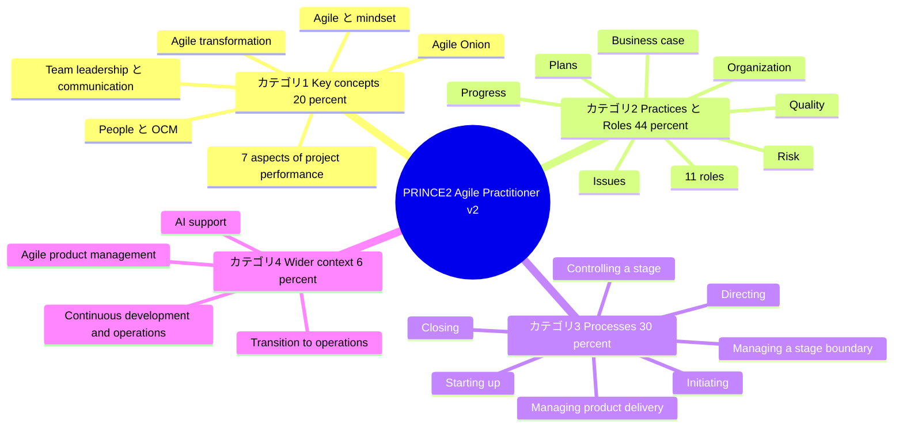

---

## 2. 学習ロードマップ

### 2.1 推奨ステップ

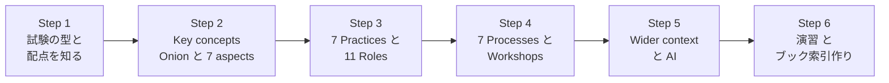

### 2.2 4 週間学習プラン（例）

| 週 | 学習内容 | ゴール | 本ガイドの章 |
|---|---|---|---|
| 1 | 試験の型、Key concepts（Agile / mindset / Onion / 7 aspects / transformation / People） | カテゴリ 1（20%）を説明できる | 第 3 章 |
| 2 | 7 practices の目的・管理プロダクト・agile guidance・techniques、11 roles | カテゴリ 2（44%）の前半 | 第 4 章 |
| 3 | 7 processes と workshops、tailoring 評価の型 | カテゴリ 3（30%）を説明・評価できる | 第 5 章 |
| 4 | Wider context・AI、演習、ブックにタブと付箋を付ける、模擬試験 | 時間内に 30 点以上を安定して取れる | 第 6〜8 章 |

### 2.3 前提知識チェック（自己診断）

次に **説明できる** なら、本ガイドをスムーズに進められます。

- [ ] PRINCE2 の **7 principles / 7 practices / 7 processes** を列挙できる
- [ ] **tolerance** と **management by exception** の関係を説明できる
- [ ] **Agile Manifesto の 4 つの価値** を言える
- [ ] **Scrum** の主要な roles・events・artifacts を言える
- [ ] **product backlog / user story / MoSCoW / burn chart** が何かを説明できる

> 1 つでも不安な場合は、まず第 3 章の 3.1〜3.4 から読み進めてください（必要な前提を初学者向けに補っています）。

---
## 3. カテゴリ 1: Key concepts（配点 20%）

> **カテゴリ 1 の学習ゴール** 【シラバス】
> アジャイルの必要性と「being / doing agile」の違いを説明し（BL2）、Agile Onion と mindset の特徴を適用し（BL3）、7 aspects of project performance と agile transformation の概念を適用し（BL3）、OCM・チームリーダーシップ・コミュニケーションを説明・適用できる。

### 3.1 Agile とアジャイルマインドセット（シラバス 1.1）

#### 3.1.1 一言でいうと

PRINCE2 は「**統制（ガバナンス）の骨格**」、Agile は「**変化に強い動き方**」です。サッカーにたとえると、PRINCE2 が「ルールとフォーメーション」、Agile が「状況に応じて動くプレースタイル」にあたります。PRINCE2 Agile はこの 2 つを **矛盾させずに 1 つのチームで使う** ための指針です。

#### 3.1.2 ステップバイステップ解説

**Step 1: なぜ Agile が必要か（1.1.1 / 公式ブック 2.4）** 【シラバス】

| 従来型（計画駆動）の課題 | Agile が狙う改善 |
|---|---|
| 要求が最初に固定され、後から変化に弱い | 変化を前提にし、**優先順位を継続的に見直す** |
| 最後にまとめて納品し、価値が出るのが遅い | **小さな増分（increment）を頻繁に届け**、早く価値と学びを得る |
| 顧客との対話が最初と最後に偏る | **顧客・ステークホルダーが継続的に関与** する |
| 問題の発覚が遅い | 短いサイクルで **早期にフィードバック** を得る |

**Step 2: Agile Manifesto の 4 つの価値（Foundation 範囲・復習）** 【シラバス（Foundation 1.1.9）】

| 価値（左を重視。右も価値はあるが優先度は左） | 意味（初学者向け） |
|---|---|
| Individuals and interactions **over** processes and tools | 人同士の対話が、ツールや手順に優先する |
| Working software **over** comprehensive documentation | 動く成果物が、網羅的な文書に優先する |
| Customer collaboration **over** contract negotiation | 顧客との協働が、契約交渉に優先する |
| Responding to change **over** following a plan | 変化への対応が、計画への固執に優先する |

**Step 3: 「being agile」と「doing agile」（1.1.2 / 公式ブック 2.3.1）** 【シラバス】

これは Version 2 の **最重要テーマの 1 つ** です。

| 観点 | doing agile（やり方） | being agile（あり方） |
|---|---|---|
| 中身 | practices（実践）と techniques（技法）を使う | mindset（考え方）と behaviours（振る舞い）を体現する |
| 例 | daily stand-up、backlog、burn chart、retrospective を行う | 透明性・信頼・協働・学習を日常の判断で実践する |
| 単独の限界 | 形だけ（「アジャイルごっこ」）になりやすい | 実践がないと成果に結びつきにくい |
| 目指す姿 | **両方を組み合わせる** ことで持続的な成果を得る | |

> **試験ポイント（BL2）**: 「stand-up や backlog を導入したのに、チームが指示待ちで隠し事が多い」→ **doing はできているが being が不足** している、と説明できること。

#### 3.1.3 ベストプラクティス

- 「導入する practice の数」ではなく、「**どんな振る舞いを増やしたいか**」から始める。
- リーダーが **自ら振る舞いで示す**（失敗の共有、意思決定の透明化）。
- retrospective で「practice が behaviour を支えているか」を定期的に点検する。

#### 3.1.4 よくある落とし穴

- ツール導入（Jira や Kanban ボード）だけで「アジャイルになった」と考える。
- 「Agile = ドキュメント不要 / 計画不要」と誤解する（PRINCE2 Agile は **統制を維持したまま** 柔軟性を得る考え方）。

---

### 3.2 Agile mindset と Agile Onion（シラバス 1.1.3 / 公式ブック 2.6, 2.6.1, 2.6.2）

#### 3.2.1 一言でいうと

Agile Onion は、アジャイルを **玉ねぎのような層構造** で捉えるモデルです。外から見える「手順」だけでなく、その根っこにある「考え方」まで含めて理解するための図です。

#### 3.2.2 5 つの層 【シラバス（Foundation 1.1.7）】

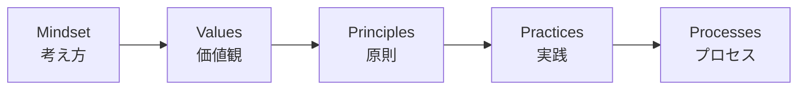

| 層 | 内容（初学者向け） | 例 |
|---|---|---|
| **Mindset** | 物事の捉え方・前提となる考え方 | 変化を歓迎する、学習を重視する |
| **Values** | 大切にする価値観 | Agile Manifesto の 4 つの価値 |
| **Principles** | 価値観から導かれる行動指針 | 顧客価値の早期・継続的な提供 |
| **Practices** | 具体的な実践 | stand-up、retrospective、timeboxing |
| **Processes** | 手順としての流れ | PRINCE2 の 7 processes、Scrum の events の流れ |

> **【要照合】** 上の図は「Mindset を最も内側の核、Processes を最も外側」と捉える一般的な玉ねぎの読み方で並べています。試験では **5 つの層の名前** が問われます（Foundation のシラバスで明記）。層の並び方向・図のキャプションは、公式ブック 2.6.1 の図で照合してください。

#### 3.2.3 Agile mindset の主要な特徴（1.1.3 b / 公式ブック 2.6.2）

シラバスは「key characteristics of the agile mindset」の適用を求めています。**一覧の正確な項目名は公式ブック 2.6.2 で照合** してください【要照合】。一般に、アジャイルマインドセットは次のような姿勢で表されます【一般知識】。

| 特徴（一般的な表現） | 職場での見え方 |
|---|---|
| 変化に対してオープン | 要求変更を「問題」ではなく「学びの機会」として扱う |
| 顧客・ユーザー価値への集中 | 「作ること」より「価値が出ること」を優先する |
| 協働・透明性 | 進捗や問題を隠さず共有する |
| 自己組織化・エンパワーメント | チームが自ら作業の進め方を決める |
| 継続的な学習・改善 | retrospective の学びを次の timebox に反映する |
| 反復・増分での価値提供 | 小さく作り、早く見せ、フィードバックを得る |

#### 3.2.4 ステップバイステップ: Onion を実務で使う（BL3 の練習）

1. **現状の観察**: いま行っている practice（stand-up など）を書き出す（Practices 層）。
2. **1 層内側へ**: それらは、どの Principles を体現しているか？ どの Values に基づくか？
3. **ギャップの発見**: 「practice はあるが、その根っこの values や mindset が伴っていない」箇所を探す。
4. **打ち手**: practice を増やすのではなく、**対話・意思決定・リーダーの行動** を変える。

#### 3.2.5 ベストプラクティス / 落とし穴 / 試験ポイント

- **ベストプラクティス**: 導入初期は外側（processes）ではなく内側（mindset / values）の対話から始める。
- **落とし穴**: 外側の層（フレームワーク）を先に固定し、内側の層を放置する。
- **試験ポイント**: BL2「being と doing の違い」、BL3「シナリオの問題点を Onion のどの層の欠落として説明するか」。

---

### 3.3 Agile の主要アプローチ（Foundation 1.1.10 の復習）

【シラバス（Foundation）】Scrum / Kanban / Lean / Lean Startup が例示されています。PRINCE2 Agile は **特定の 1 つに固定せず**、これらと組み合わせて使えます。

| アプローチ | 一言 | 主なキーワード【一般知識】 |
|---|---|---|
| **Scrum** | 固定長の timebox で反復するフレームワーク | Product Owner / Scrum Master / Developers、Sprint、Sprint Planning、Daily Scrum、Sprint Review、Sprint Retrospective、Product Backlog、Increment |
| **Kanban** | 仕事の流れを可視化し、同時進行数を制限する | ボード、WIP 制限、フロー、継続的デリバリー |
| **Lean** | ムダを排除し価値の流れを最適化する | ムダの排除、フロー、継続的改善 |
| **Lean Startup** | 仮説検証で学びを最大化する | Build-Measure-Learn、**MVP**（Minimum Viable Product） |

> **PRINCE2 Agile での対応関係（初学者向け）**: PRINCE2 Agile の **team roles（Product Owner / Team coach）や timebox（iteration）** は Scrum 用語と対応づけて理解すると覚えやすくなります。ただし試験は **PRINCE2 Agile の用語** で答える必要があるため、Scrum 用語をそのまま使わず、公式ブックの用語で整理してください。

---

### 3.4 PRINCE2 Project Management の基礎（シラバス 1.4.1 / 公式ブック 5.2〜5.4）

#### 3.4.1 5 つの統合要素 【シラバス（Foundation 1.2.3）】

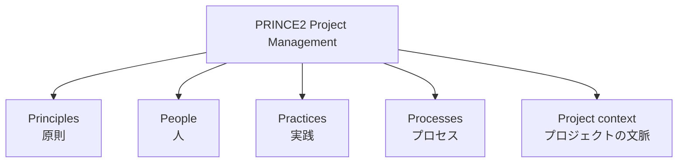

#### 3.4.2 7 principles と Agile 文脈での読み替え（1.2.1 / 公式ブック 5.6.1）

PRINCE2 の 7 principles は **Agile でもそのまま適用** します。Agile では「どう表れるか」が変わります。

| # | Principle 【シラバス】 | Agile 文脈での表れ方【一般知識 + 【要照合】5.6.1】 |
|---|---|---|
| 1 | Ensure continued business justification | **MVP** と頻繁なリリースで価値を早く確認し、business case を継続的に見直す |
| 2 | Learn from experience | **retrospective** と lessons log を各 timebox で回し、学びを即座に反映 |
| 3 | Define roles, responsibilities, and relationships | Product Owner / Team coach など **アジャイルの役割** を PRINCE2 の役割と整合させる |
| 4 | Manage by stages | stage を **複数の timebox（iteration / release）を含む単位** として計画し、ボードの判断点にする |
| 5 | Manage by exception | **tolerance の範囲内はチームに委譲**。範囲を超える兆候だけを上位へ escalate |
| 6 | Focus on products | **product backlog / user story / DoD** で「何を作るか・完成とは何か」を明確化 |
| 7 | Tailor to suit the project | Agilometer・プロジェクトの文脈に合わせ、PRINCE2 と agile の **組み合わせ方を調整** する |

> **試験ポイント（BL3）**: シナリオの状況（例: 「ボードが毎週詳細な承認を求めている」）を見て、**どの principle に反しているか** を特定し、改善案を選ぶ。

#### 3.4.3 7 practices（一覧） 【シラバス】

| Practice | 目的（1 行） | 本ガイドの節 |
|---|---|---|
| **Business case** | プロジェクトが「望ましく・実行可能で・達成可能」か判断する | 4.2 |
| **Organization** | 責任体制を定義し、ステークホルダーを関与させる | 4.3 |
| **Plans** | どう成果物を届けるかを示し、コミュニケーションと統制を促す | 4.4 |
| **Quality** | 成果物が目的に適う（fit for purpose）ことを作り込み・検証する | 4.5 |
| **Risk** | 不確実性（脅威・好機）を識別・評価・対応する | 4.6 |
| **Issues** | 計画外の事象を捕捉・評価・対応する | 4.7 |
| **Progress** | 計画と実績を比較し、逸脱を統制する | 4.8 |

> 目的の文言は【一般知識（PRINCE2 7 の考え方の要約）】です。シラバスのサンプル問題にも「逸脱を統制する目的の practice は？（答えは progress）」という形式が例示されています。**各 practice の "purpose" は公式ブックの 6.1 / 7.1 / 8.1 / 9.1 / 10.1 / 11.1 / 12.1 で必ず照合** してください。

#### 3.4.4 7 processes（一覧）

| Process | 略称 | 主体（一般） | 節 |
|---|---|---|---|
| Starting up a project | SU | Project Board / PM | 5.2 |
| Directing a project | DP | Project Board | 5.3 |
| Initiating a project | IP | PM | 5.4 |
| Controlling a stage | CS | PM | 5.5 |
| Managing product delivery | MP | Team | 5.6 |
| Managing a stage boundary | SB | PM | 5.7 |
| Closing a project | CP | PM / Board | 5.8 |

---

### 3.5 7 aspects of project performance と "fix and flex"（シラバス 1.2.2 / 公式ブック 3.3）

#### 3.5.1 一言でいうと

プロジェクトの成果は **7 つの側面（aspects）** で測ります。どれを「固定（fix）」し、どれを「柔軟（flex）」にするかを、ボードと合意しておくことが Agile 統制の核心です。

> **バージョンに関する注意**: Version 1 の教材では「6 つの aspects（hexagon）」と説明されていました。Version 2 のシラバスは **「seven aspects of project performance」** と明記しています（【シラバス】）。旧版（6 つ）の資料と混同しないよう注意してください。

#### 3.5.2 7 aspects と Agile での典型的な扱い

| Aspect | 意味 | Agile での典型的な扱い【一般知識 + 【要照合】3.3】 |
|---|---|---|
| **Benefits** | 得られる成果・便益 | 早期・継続的なリリースで便益実現を前倒しし、実測する |
| **Risk** | 不確実性 | 短いサイクルで検証し、Agilometer で状況を可視化する |
| **Time** | 期間・納期 | **固定寄り**（timebox を守る） |
| **Cost** | 予算・コスト | **固定寄り**（安定したチーム構成で予測可能にする） |
| **Scope** | 提供する機能範囲 | **柔軟（flex）**: MoSCoW で優先順位を付け、Should / Could を調整弁にする |
| **Quality** | 目的適合性 | **妥協しない**（DoD で基準を明確化し、品質を犠牲にしない） |
| **Sustainability** | 環境・社会・経済面の持続可能性 | 成果物・チーム・運用の持続性を計画に織り込む |

> 「どれを fix / flex にするか」は **プロジェクトの文脈（規制、契約、納期の硬さ）で変わります**。上表は典型例であり、試験ではシナリオの制約（例: 法規制対応の期限は動かせない）から判断してください。

#### 3.5.3 tolerance を階層で考える

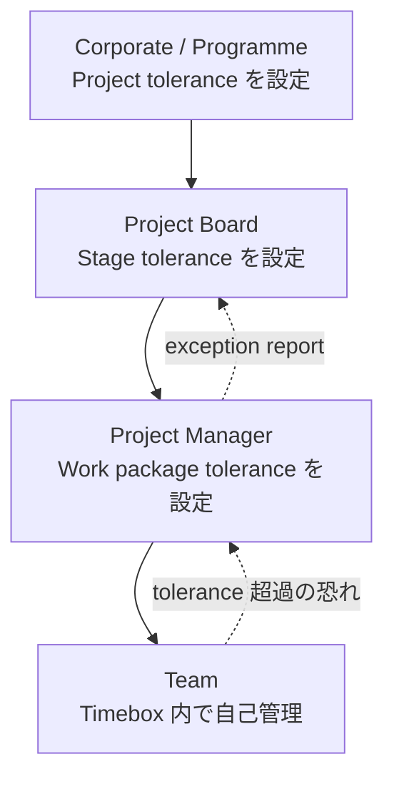

**ステップバイステップ（fix & flex の合意手順）**

1. 各 aspect の **優先順位** を関係者で議論する（何を守り、何を動かせるか）。
2. **fix する aspect** と **flex する aspect** を決め、**tolerance** を数値・範囲で表す。
3. flex する aspect（例: scope）は **MoSCoW** で具体化し、動かせる範囲を見える化する。
4. tolerance の **超過の兆候** を早期に検知したら、上位へ escalate（exception）。
5. 各 stage の境界で見直す。

#### 3.5.4 ベストプラクティス / 落とし穴 / 試験ポイント

- **ベストプラクティス**: 「全部固定」は Agile と両立しない。**1〜2 つを flex 対象に明確化** する。
- **落とし穴**: scope を flex にしつつ、Must の定義が曖昧で、結局すべてが必須になる。
- **試験ポイント（BL3）**: シナリオの制約から「fix / flex の組み合わせ」を選ぶ。**quality を犠牲にして納期を守る** 選択肢は原則として誤り。

---

### 3.6 Agile transformation の主要概念（シラバス 1.2.3 / 公式ブック 2.7）

シラバスは次の 4 つの適用（BL3）を求めています。

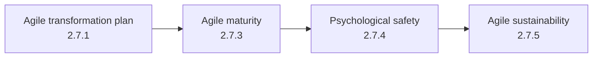

#### 3.6.1 Agile transformation plan（2.7.1）

**一言でいうと**: 組織がアジャイルに変わっていくための「道筋の計画」です。

**ステップバイステップ【一般知識】**

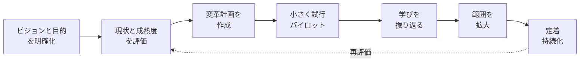

- **ベストプラクティス**: 全社一斉ではなく **小さく始めて学び、広げる**。リーダーシップの関与と、成功基準（測る指標）を最初に決める。
- **落とし穴**: 計画を「一度作って終わり」にする。トランスフォーメーション自体を **アジャイルに（反復的に）** 進めることが必要。

#### 3.6.2 Agile maturity（2.7.3）

**一言でいうと**: 組織・チームの「アジャイルの成熟度合い」を段階で捉えて、次の打ち手を決めるための物差しです。

- **使い方**: 現状を評価 → 目指す状態を設定 → ギャップに対する改善を計画。
- **ベストプラクティス**: 成熟度は **目的ではなく手段**。高い点数を取ること自体を目標にしない。
- **落とし穴**: 他社のスコアとの比較に終始し、自社の文脈に合わない打ち手を導入する。
- **試験ポイント**: 成熟度は、tailoring（例: 委譲の程度、統制の粒度）を **決める材料** になる。

#### 3.6.3 Psychological safety（2.7.4）

**一言でいうと**: 「間違いや懸念、質問を口にしても、責められたり恥をかいたりしない」と感じられる状態です。アジャイルの **透明性・早期フィードバック・学習** の土台になります。

| 心理的安全性が **高い** チーム | **低い** チーム |
|---|---|
| 問題や遅延を早めに共有する | 悪い知らせを隠し、発覚が遅れる |
| 質問・反対意見が出る | 沈黙・忖度が多い |
| 失敗を学習として扱う | 失敗の責任追及が中心になる |

**ベストプラクティス【一般知識】**

- リーダーが **自分の不確実性や失敗を先に開示** する。
- retrospective の **ルールを合意**（人ではなくプロセスに焦点）。
- 懸念を出した人を **感謝で受け止める**。
- 参考: Google の re:Work でも、心理的安全性がチームの有効性で重要な要素として整理されています（参照 URL は第 10 章）。

**試験ポイント（BL3）**: 「stand-up で誰も遅れを報告しない」ような状況で、**心理的安全性を高める施策** を選ぶ。

#### 3.6.4 Agile sustainability（2.7.5）

**一言でいうと**: アジャイルな働き方を **一過性で終わらせず、長期的に続けられる** 状態にすることです。

- **人の持続可能性**: 無理のない持続可能なペース、燃え尽き防止、チームの安定。
- **仕組みの持続可能性**: 継続的改善の習慣、リーダーの後押し、知見の共有。
- **成果の持続可能性**: 運用に耐える品質、技術的負債の管理（7 aspects の Sustainability とも連動）。

> **【要照合】** 公式ブック 2.7.5 が Agile sustainability を上記のどの側面に重心を置いて定義しているかは、本文で確認してください。

---

### 3.7 People と Organizational Change Management（OCM）（シラバス 1.3.1〜1.3.5 / 公式ブック 第 4 章）

#### 3.7.1 OCM の全体像

**一言でいうと**: アジャイルの導入は **人と文化の変化** を伴います。OCM は、その変化を計画的に進める考え方です。

| シラバス項目 | 内容 | 公式ブック |
|---|---|---|
| 1.3.1 | **OCM の重要性**を説明（BL2） | 4.2.1 |
| 1.3.2 | **OCM・ステークホルダー・文化** の主要概念を適用（BL3） | 4.2 |
| 1.3.3 | **組織横断で成功するチーム** を導くための概念を適用（BL3） | 4.3 |
| 1.3.4 | **チーム内コミュニケーション**の重要性を説明（co-located / remote / hybrid）（BL2） | 4.4 |
| 1.3.5 | **アジャイルチームの構築とリード** の考慮事項を適用（BL3） | 4.5 |

#### 3.7.2 OCM ステップバイステップ【一般知識】

1. **なぜ変わるのか（目的）を共有** する。
2. **ステークホルダーを特定** し、影響度・関心度・現在の態度を把握する（Foundation 1.4.2: OCM stakeholders）。
3. **文化を理解する**（4.2.3）: 目に見える行動の背後にある前提を捉える。
4. **小さな成功を作り、見える化** する（アジャイルの増分提供は OCM を支援する: 4.2.4）。
5. **継続的に対話・フィードバック** し、抵抗を学びとして扱う。

> 補足: OCM の代表的なモデルに **Kotter の 8 ステップ** や **ADKAR** があります（参照 URL は第 10 章）。**シラバスは特定モデルの暗記を求めていません**。あくまで理解の補助として使ってください。

#### 3.7.3 文化とアジャイル（4.2.3）

| 観点 | 統制重視の文化 | アジャイルを支える文化 |
|---|---|---|
| 意思決定 | 上位に集中 | **権限委譲**（tolerance の範囲内） |
| 失敗 | 責任追及 | 学習の機会 |
| 情報 | 必要最小限を報告 | **透明性** |
| 顧客 | 契約・仕様で線引き | **継続的な協働** |

**ベストプラクティス**: 文化を「一気に変える」のではなく、**目に見える成功体験（小さな勝ち）** を積み上げる。

#### 3.7.4 組織横断のチームを導く（4.3）とチーム構築（4.5）【一般知識 + 【要照合】】

- **チーム構成**: cross-functional（企画〜開発〜テストを含む）で、**できるだけ安定した少人数**。一般に 1 チーム 10 人以内が目安として知られます。
- **合意事項**: working agreement（チームの約束事）を明文化。
- **リーダーシップ**: 指示命令型ではなく **サーバントリーダーシップ**（障害除去・環境づくり）。
- **意思決定の所在**: 誰がどの範囲で決められるか（decision rights）を明確化。
- **複数チーム**: 共通のゴール、依存関係の可視化、**チーム間の定期的な同期（sync）**。

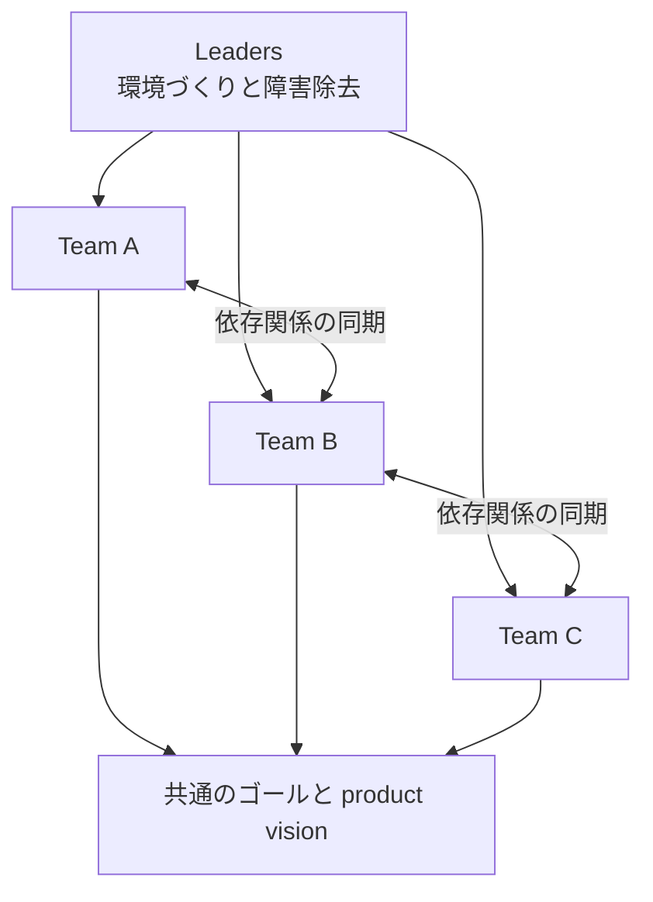

#### 3.7.5 チーム内コミュニケーション（4.4）

アジャイルは **rich communication（豊かなコミュニケーション）** を重視します。対面が最も情報量が豊かで、次にビデオ、電話、チャット、文書の順に情報が細るという考え方が一般的です【一般知識】。

| 形態 | 特徴 | ベストプラクティス |
|---|---|---|
| **Co-located**（同一拠点） | 自然な対話、情報ラジエーター（壁のボード）を使える | 物理ボード、短い対面のやり取りを活用。**それでも決定事項は記録** する |
| **Remote**（全員遠隔） | 非同期になりやすく、孤立や誤解が起きやすい | ビデオ ON の習慣、**共有デジタルボード**、明確な非同期ルール、意図的な雑談の時間 |
| **Hybrid**（混在） | **会議室組と遠隔組で情報格差** が生じやすい | 会議は **全員が個別に接続する** 前提で設計。決定はテキストで残す。重要な場面を対面に偏らせない |

**落とし穴**: hybrid で、会議室の議論が遠隔メンバーに届かず、**二層構造のチーム** になる。

#### 3.7.6 試験ポイント（カテゴリ 1 全体）

| 出やすい問い | 考え方 |
|---|---|
| being と doing の区別（BL2） | 「形」か「あり方」か |
| Onion の層（BL2/3） | 5 層（Mindset / Values / Principles / Practices / Processes）の名前と、シナリオの問題の層 |
| 7 aspects の fix / flex（BL3） | シナリオの制約から決める。quality は妥協しない |
| 心理的安全性・成熟度・持続可能性（BL3） | シナリオの症状に対する適切な施策を選ぶ |
| hybrid 環境（BL2/3） | 情報格差を作らない工夫を選ぶ |

---
## 4. カテゴリ 2: PRINCE2 Agile の practices と roles（配点 44%）

> **最重要カテゴリです（約 22 問）。** 7 つの practice それぞれについて、シラバスは次の 3 段階を求めます。
> - **理解（BL2）**: practice が agile 文脈でどう使われるか
> - **適用（BL3）**: 推奨される **management products / artifacts**、PRINCE2 Agile の **guidance**、関連する **agile techniques** を使って適用する
> - **分析（BL4）**: あるアプローチが **効果的で fit for purpose か** を評価する

### 4.1 practice を「適用・分析」するための共通の型

各 practice を学ぶとき、次の **5 つの視点** で整理すると、BL3/BL4 に強くなります。

| 視点 | 問い | 対応するシラバス表現 |
|---|---|---|
| ① 目的 | この practice は何のためにあるか | purpose（x.1） |
| ② Guidance | PRINCE2 Agile は agile 文脈で何を推奨しているか | PRINCE2 Agile guidance（x.3.1） |
| ③ Management products | どの成果物・記録で運用するか | management products and artifacts（x.3.2） |
| ④ Techniques | どの agile 技法が支えるか | other associated agile artifacts and techniques（x.4） |
| ⑤ 文脈 | プロジェクトの制約・成熟度・Agilometer に合っているか | tailoring（fit for purpose） |

#### BL4「fit for purpose か？」の判断フロー

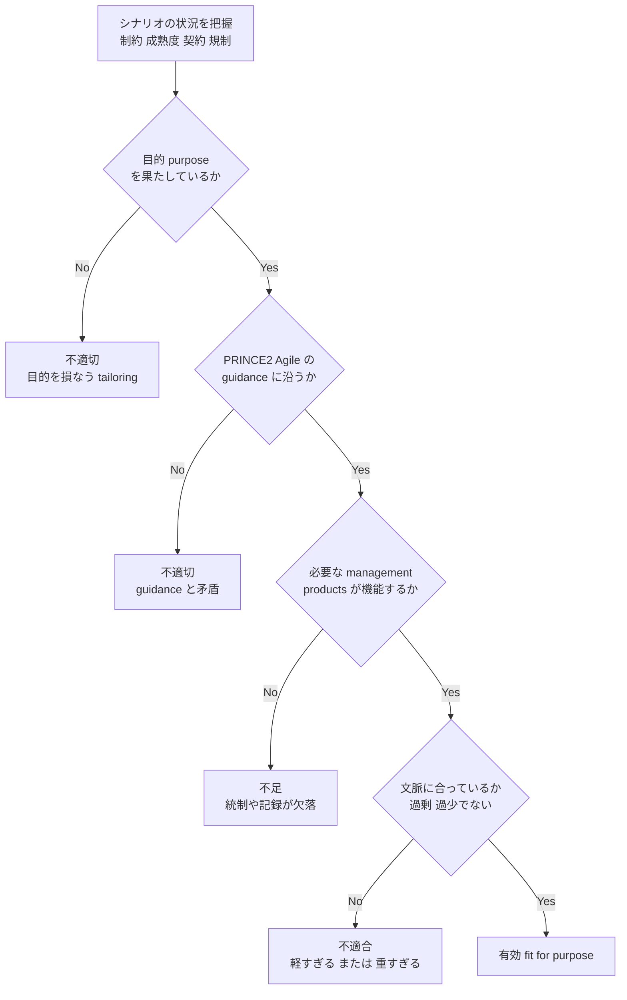

> **BL4 の鉄則**: 選択肢が「もっともらしい」かどうかではなく、**「目的を満たし、guidance と矛盾せず、シナリオの制約に合うか」** で判定します。「重すぎる統制」も「軽すぎる統制」も、どちらも fit for purpose ではありません。

---

### 4.2 Business case practice（シラバス 2.1.2 / 2.1.3 / 公式ブック 第 6 章）

#### 4.2.1 一言でいうと

**「このプロジェクトは、いまもやる価値があるか？」を、繰り返し確認する** ための practice です。Agile では、価値を **早く・少しずつ** 届けて確認できるため、投資判断を継続的に更新しやすくなります。

#### 4.2.2 ステップバイステップ解説

1. **価値仮説を立てる**: 誰の、どんな課題を、どんな成果で解決するか（ビジョン）。
2. **最小限の価値提供を定義する**: **MVP**（Minimum Viable Product）で「まず何を出せば学べるか」を決める（公式ブック 6.3.1）。
3. **business case を軽量に表現する**: 大部の文書ではなく **project canvas**（1 枚で見渡せる形式）を活用する。
4. **便益をどう測るか決める**: **benefits management approach** を用意する。
5. **持続可能性を織り込む**: **sustainability management approach** を用意する。
6. **stage / release ごとに再評価する**: 頻繁なリリースの実績データを踏まえ、継続・変更・中止を判断する。

#### 4.2.3 推奨される management products / artifacts 【シラバス 2.1.2 a / 公式ブック 6.3.2】

| 成果物 | 役割（初学者向け） | Agile での留意点 |
|---|---|---|
| **Project brief** | プロジェクトの出発点を合意する（目的・範囲・体制の概要） | 短く、**ビジョンと制約** に焦点を当てる |
| **Business case / Project canvas** | 望ましさ・実行可能性・達成可能性を示す | **1 枚の canvas** にして関係者と頻繁に見直す |
| **Benefits management approach** | 便益の特定・測定・実現の方法 | **リリースごとに便益を実測** し、次の優先順位に反映する |
| **Sustainability management approach** | 環境・社会・経済面の持続可能性への取り組み方 | 成果物・チーム・運用の持続性を **計画とバックログに反映** する |

#### 4.2.4 関連する agile artifacts / techniques 【シラバス 2.1.2 c / 公式ブック 6.4】

一覧の正確な項目は公式ブック 6.4 で照合してください【要照合】。一般に次のものが該当します【一般知識】。

| 技法 | 内容 |
|---|---|
| **MVP** 【シラバス（Foundation 1.1.11 / 6.3.1）】 | 学びを最大化する最小限の価値提供。**「最低限の機能」ではなく「検証可能な最小の価値」** |
| ビジョン記述 | 目指す姿を 1〜2 文で共有する |
| 価値に基づく優先順位付け | 価値の大きいものから作る（例: MoSCoW と併用） |
| 頻繁なリリース | 便益の実測・早期回収・投資判断の根拠づくり |

#### 4.2.5 ベストプラクティス

- business case を **「承認文書」ではなく「生きたモデル」** として扱う。
- **stage 境界ごと** に、実績（リリース後の利用データ等）で便益仮説を検証する。
- 便益指標を **事前に定義**（後付けで都合よく解釈しない）。
- **MVP を早期に市場・利用者へ** 出し、フィードバックを得る。

#### 4.2.6 よくある落とし穴

- 最初に作った business case を最後まで更新しない。
- MVP を「品質を落とした試作品」と誤解する（→ quality は妥協しない）。
- 便益を **完成後にまとめて** 測ろうとし、途中で軌道修正できない。

#### 4.2.7 試験ポイント

- **BL3**: シナリオの状況（例: 不確実性が高い新規市場）に対し、**MVP と頻繁なリリース** を使って価値確認する提案を選ぶ。
- **BL4**: 「business case を最初に詳細に固めきり、変更を認めない」という tailoring は、**continued business justification に反し fit for purpose ではない**。
- 「project brief / project canvas / benefits management approach / sustainability management approach」が business case practice を支える **management products** である点を押さえる（**sustainability management approach が入っている点** は v2 の特徴）。

---

### 4.3 Organization practice（シラバス 2.1.4 / 2.1.5 / 公式ブック 第 7 章）

#### 4.3.1 一言でいうと

**「誰が何に責任を持ち、どう連携するか」を決める** practice です。Agile では、**責任の委譲（自己組織化）と、上位の統制** の両立が焦点です。

#### 4.3.2 ステップバイステップ解説

1. **体制を設計する**: Project Board、PM、複数の agile team（Product Owner、Team coach、Developer、Tester）の関係を決める（**project management team structure**）。
2. **役割を明文化する**: **role descriptions** で責任・権限・期待を明確にする（第 4.9 節）。
3. **委譲の範囲を決める**: tolerance の範囲で **チームが自己管理** できるようにする。
4. **契約・調達を整える**: **commercial management approach** で、供給者との契約（成果・変更の扱い・支払条件）が agile の働き方と整合するようにする。
5. **ステークホルダーを関与させる**: 定期的なレビュー・デモへの参加を設計する。

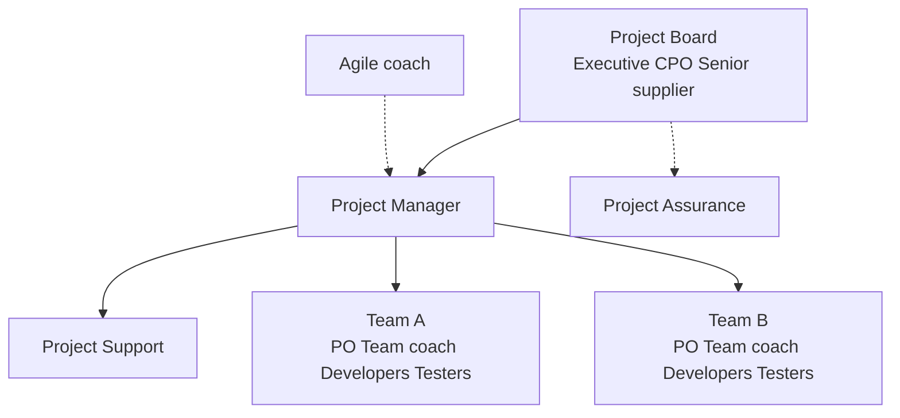

> **【要照合】** 上図は 11 roles の関係を一般的な構造で示したものです。各 role の **位置づけ（誰が誰に報告するか・Board の構成員）** は、公式ブック 7 章と Table 7.2 / Table B.1 で照合してください。

#### 4.3.3 推奨される management products / artifacts 【シラバス 2.1.4 a / 公式ブック 7.3.2】

| 成果物 | 役割 | Agile での留意点 |
|---|---|---|
| **Commercial management approach** | 供給者との契約・調達の進め方 | **範囲変更を許容する契約設計**（固定価格でも「範囲は柔軟」にする等）を検討する |
| **Project management team structure** | 体制図・役割の関係 | 複数チームの **依存関係・連携ポイント** を明確にする |
| **Role descriptions** | 各役割の責任・権限・スキル | **agile roles と PRINCE2 roles の対応** を明記する |

#### 4.3.4 関連する agile artifacts / techniques 【一般知識・【要照合】7.4】

| 技法 | 内容 |
|---|---|
| Working agreements | チームの約束事（コミュニケーション、決定方法、就業ルール） |
| Self-organizing teams | チームが自ら作業割り当てと進め方を決める |
| ステークホルダー分析 | 影響度・関心度で関与方法を決める |
| 定期的な review / demo | 利害関係者との継続的なフィードバックの場 |

#### 4.3.5 ベストプラクティス

- 責任の **重複や空白** を避ける（特に PM と Product Owner、PM と Team coach の境界）。
- **tolerance の範囲内は委譲** し、Board は **例外と主要な判断** に集中する。
- 契約では **「成果と価値」に焦点** を置き、変更を前提にした条項（範囲の入替えルールなど）を設ける。
- **Agile coach** を活用して、組織側（Board を含む）の agile 理解を高める。

#### 4.3.6 よくある落とし穴

- Product Owner の **意思決定権限が不足**（毎回上位の承認待ち）。
- Board が **チーム内の細かな作業配分** にまで介入する（自己組織化を阻害）。
- **固定範囲・固定価格・固定納期** の三重固定契約で、変更が「契約違反」扱いになる。

#### 4.3.7 試験ポイント

- **BL3**: 「契約が範囲固定でアジャイルの優先順位変更と衝突する」場面で、commercial management approach の見直し案を選ぶ。
- **BL4**: 「PM がチームのタスクを日次で割り当てる」体制は、**自己組織化・委譲の趣旨に反し fit for purpose ではない**。

---

### 4.4 Plans practice（シラバス 2.1.6 / 2.1.7 / 公式ブック 第 8 章）

#### 4.4.1 一言でいうと

**「何を・いつ・どんな順序で届けるか」の見通しを、粒度を変えながら共有する** practice です。Agile では、**遠い将来は粗く、近い将来は詳細に** 計画します（計画は生きたもの）。

#### 4.4.2 計画の階層（粗い → 詳細）

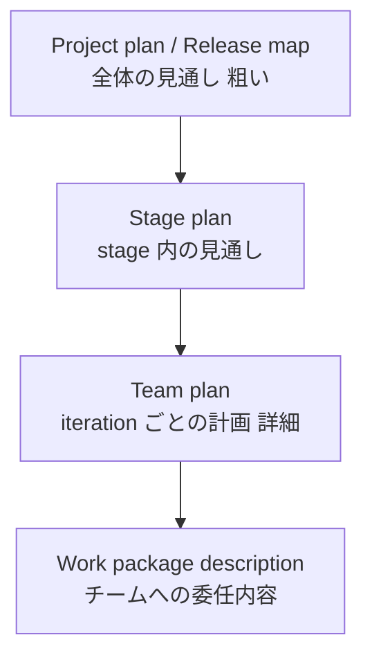

#### 4.4.3 ステップバイステップ解説

1. **プロダクトの全体像を定義**: **project product description / project backlog** に、プロジェクトが届けるべき内容を **epic** レベルで列挙。
2. **release map を作る**: いつ頃どの価値を出すかの **粗い見通し**。
3. **stage plan を作る**: 直近の stage の目標と主要な成果物。
4. **product backlog を整備**: **epic user story** を **user story** に分解し、優先順位を付ける。
5. **team plan を作る**: iteration ごとに、チームが **実施する項目を選び取る**。
6. **work package description で委任**: PM がチームに、期待する成果と **tolerance** を伝える。
7. **見積り・進捗で更新**: 実績（velocity 等）を踏まえ、計画を継続的に調整する。

#### 4.4.4 推奨される management products / artifacts 【シラバス 2.1.6 a / 公式ブック 8.3.2】

| 成果物 | 役割（初学者向け） | Agile での留意点 |
|---|---|---|
| **Plan（project, stage）/ Release map** | プロジェクト全体・stage の見通し | **粗く始め、学びに応じて更新**（rolling wave） |
| **Team plan** | チームが iteration で取り組む計画 | **チーム自身が作る**（PM が押し付けない） |
| **Product backlog** | 優先順位付きの作業項目リスト | **Product Owner が優先順位** を継続的に更新 |
| **Project product description / Project backlog** | プロジェクト全体で届ける成果の記述・一覧 | epic レベルで、**変更を前提** に管理 |
| **Work package description** | チームへ委任する仕事の内容と制約 | **tolerance、完了基準（DoD）** を明記 |
| **Epic user story** | 大きな要求（複数の user story に分解される前） | 分解前は **粗い粒度** で構わない |
| **User story** | ユーザー視点の要求を簡潔に記述した単位 | 【一般知識】「誰が・何を・なぜ」の形式と **受入基準** で明確化 |

#### 4.4.5 関連する agile artifacts / techniques 【シラバス 2.1.6 c / 公式ブック 8.4】

| 技法 | 内容 | 出所 |
|---|---|---|
| **Agile estimation（story points, T-shirt sizing）** | 相対見積りで、作業の大きさを素早く見積もる | 【シラバス（Foundation 1.1.11 / 8.4.3）】 |
| **Timeboxing** | 期間を固定し、その中で優先度の高いものを届ける | 【一般知識】 |
| **Backlog refinement** | backlog の項目を詳細化・見直し・優先付けする | 【一般知識】 |
| **Velocity** | チームが 1 iteration で完了できる量の実績 | 【一般知識】 |
| **Story map** | ユーザー体験の流れで user story を整理する | 【一般知識】 |

**Story points と T-shirt sizing（初学者向け）**

| 方式 | 中身 | 向いている場面 |
|---|---|---|
| Story points | 相対的な大きさを数値（例: 1, 2, 3, 5, 8, 13）で表す | チームが直近の実績を持ち、詳細に見積れる時期 |
| T-shirt sizing | S / M / L / XL で表す | **epic や初期段階の粗い見積り** |

#### 4.4.6 ベストプラクティス

- **近い将来は詳細、遠い将来は粗く**（不確実性が高いほど詳細計画のムダが増える）。
- **チーム自身が見積り・計画** を行う（当事者意識と精度が上がる）。
- 計画の **確からしさが低い部分は明示** し、ボードと共有する。
- release map は **利害関係者が見て分かる粒度** にとどめる。

#### 4.4.7 よくある落とし穴

- 全機能の詳細 plan を最初に固め、**変更を認めない**。
- 見積りを **個人評価やコミットメントの強制** に使う。
- backlog の優先順位が更新されず、**古い前提の項目が残る**。

#### 4.4.8 試験ポイント

- **BL3**: シナリオで「ボードが 12 か月先までの詳細な機能一覧を求める」→ **release map + 直近の詳細計画** を提案する選択肢が適切。
- **BL4**: 「PM がチームの user story を割り当て、見積り値をチームに強制する」計画運用は、**自己組織化・現実的な見積りの趣旨に反し fit for purpose ではない**。
- 「**Plan / Release map / Team plan / Product backlog / Project product description / Work package description / Epic user story / User story**」の **一覧を正確に** 覚える（シラバスの 2.1.6 a）。

---
### 4.5 Quality practice（シラバス 2.1.8 / 2.1.9 / 公式ブック 第 9 章）

#### 4.5.1 一言でいうと

**「完成とは何か」を先に決め、作り込みながら確かめる** practice です。Agile では、品質を **最後に検査する** のではなく、**作りながら継続的に作り込む** ことが基本です。

#### 4.5.2 ステップバイステップ解説

1. **品質の期待を明確にする**: **product description / product backlog** の項目ごとに、期待する品質を明記。
2. **quality management approach を用意**: 品質のための役割・レビュー・テストの進め方を決める。
3. **Definition of Ready（DoR）を決める**: backlog の項目が **着手できる状態** の条件。
4. **Definition of Done（DoD）を決める**: 項目が **完成したと言える** 条件。
5. **MoSCoW で優先順位付け**: 範囲調整の際も、**品質基準は下げない**。
6. **quality register / product register で記録**: 実施した品質活動と、成果物の状態を追跡。
7. **継続的に検証**: テスト、レビュー、デモで、**各 timebox 内で** 品質を確認する。

#### 4.5.3 DoR と DoD の違い（頻出）【シラバス（Foundation 1.1.11 / 9.3.2.1, 9.3.2.2）】

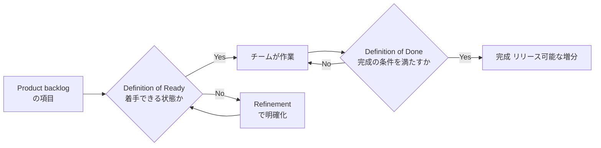

| 項目 | Definition of Ready | Definition of Done |
|---|---|---|
| いつ使う | **作業を始める前** | **作業を終えるとき** |
| 目的 | 曖昧な項目で着手して手戻りするのを防ぐ | 「ほぼ完成」の項目を完成扱いにしない |
| 例 | 受入基準が明記、見積り可能、依存が解消済み | コードレビュー済み、テスト合格、ドキュメント更新済み |

> **暗記のコツ**: Ready = **入口**、Done = **出口**。

#### 4.5.4 推奨される management products / artifacts / techniques 【シラバス 2.1.8 a / 公式ブック 9.3.2】

| 成果物 / 技法 | 役割 | Agile での留意点 |
|---|---|---|
| **Product description / Product backlog** | 成果物の目的・品質基準を記述 | **acceptance criteria** を含め、優先順位付きで管理 |
| **Quality management approach** | 品質保証・品質管理の進め方 | **継続的な検証** を前提とする |
| **Definition of Ready** | 着手可能の条件 | チームで合意し、**必要に応じ更新** |
| **Definition of Done** | 完成の条件 | **リリース可能な品質** を定義し、例外を作らない |
| **Quality register** | 品質活動の記録 | 実施・結果を **透明に** 記録 |
| **Product register** | 成果物ごとの状態の記録 | 進捗と品質の状態を追跡 |
| **MoSCoW** | Must / Should / Could / Won't（今回はやらない）で優先順位付け | **Must は必須のみ**。Should / Could が調整弁 |

**MoSCoW（一般知識）**

| 区分 | 意味 | 扱い |
|---|---|---|
| **M**ust have | ないと成立しない | **必ず届ける**（最小限に絞る） |
| **S**hould have | 重要だが、代替手段で当面しのげる | 可能な限り届ける |
| **C**ould have | あれば望ましい | 余力があれば |
| **W**on't have (this time) | **今回は対象外**（将来検討） | 明示して期待値を管理 |

> 目安として、DSDM 由来の考え方では **Must を全体の約 60% 程度以内に抑え**、残りを調整余地（contingency）として残すことが推奨されています【一般知識】。**具体的な割合は公式ブックの記述で確認** してください【要照合】。

#### 4.5.5 関連する agile techniques 【シラバス 2.1.8 c / 公式ブック 9.4、一般知識】

- **テスト駆動開発（TDD）、継続的インテグレーション（CI）、テスト自動化**: 短いサイクルで品質を維持する。
- **ペアプログラミング / コードレビュー**: 作り込み段階での品質確保。
- **Review / demo**: 利害関係者に動く成果物を見せ、**受入れ** を得る。
- **Tester の関与**: 開発の早期から参加（後工程にしない）。

#### 4.5.6 ベストプラクティス

- **DoD は「全員が同じ完成の意味」を持つための合意**。曖昧な DoD は隠れた未完成を生む。
- 納期が厳しくても **quality を下げて回避しない**（scope を flex にする）。
- **受入基準（acceptance criteria）を user story とセット** で用意する。
- 自動化されたテストで、**リグレッションを早期検知** する。

#### 4.5.7 よくある落とし穴

- 「動けば Done」とし、**テスト・文書・運用準備が未完**（技術的負債の蓄積）。
- DoR を厳格にしすぎ、**着手が滞る**（過剰な事前分析）。
- 納期に間に合わせるため、**テストを次の iteration に回す**。

#### 4.5.8 試験ポイント

- **BL3**: 「完成扱いの成果物に、後からバグが見つかる」→ **DoD の見直し** と受入基準の明確化。
- **BL4**: 「納期が迫ったので DoD の一部を省略して Done とする」は、**quality を犠牲にする点で fit for purpose ではない**。代わりに **scope（Should / Could）を調整** する。
- 「DoR = 入口、DoD = 出口」「MoSCoW の 4 区分」「quality register と product register の違い」を確実に。

---

### 4.6 Risk practice（シラバス 2.1.10 / 2.1.11 / 公式ブック 第 10 章）

#### 4.6.1 一言でいうと

**「うまくいかない可能性（脅威）と、うまくいく機会（好機）」を、早く見つけて手を打つ** practice です。Agile は **短いサイクルで早期に学べる** ため、リスクの発覚と対処が早まります。

#### 4.6.2 ステップバイステップ解説

1. **risk management approach を用意**: リスクの識別・評価・対応・報告の進め方。
2. **Agilometer で全体像を把握**: プロジェクトが agile 適用にどれだけ適しているかを評価（下記）。
3. **risk register に記録**: 識別したリスクと、評価（確率・影響）、対応、責任者。
4. **日常の場で表面化**: daily stand-up、review、retrospective で新しいリスクを拾う。
5. **早期検証で不確実性を下げる**: 小さく作って試す、頻繁にリリースする。
6. **stage 境界で再評価**: Agilometer とリスクを見直す。

#### 4.6.3 Agilometer とは 【シラバス 2.1.10 a / 公式ブック 10.3.2】

**一言でいうと**: **「このプロジェクトは agile に向いているか、どこにリスクがあるか」** を可視化する自己診断ツールです。

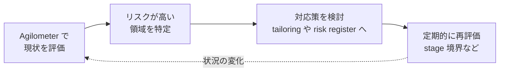

> **【要照合】** Agilometer の **評価軸の名称・数・評価スケール** は、版によって表現が異なり得るため、**必ず公式ブック 10.3.2（サブセクション含む）で確認** してください。試験では「Agilometer を **どの目的で・いつ・どう使うか**」が問われます。一般的な使い方は次のとおりです【一般知識】。

| 使いどころ | 内容 |
|---|---|
| 初期（SU / IP） | agile 適用の **リスクの高い領域** を洗い出し、tailoring や体制設計に反映する |
| 継続的 | stage 境界などで **再評価** し、リスクの変化を追跡する |
| 対応 | 高リスクの領域に対し、**risk register の対応策** や **追加の統制** を設定する |

#### 4.6.4 推奨される management products / artifacts 【シラバス 2.1.10 a】

| 成果物 | 役割 | Agile での留意点 |
|---|---|---|
| **Risk management approach** | リスク管理の方法 | チームと Board で **報告の粒度・頻度** を合意 |
| **Risk register** | リスクの一覧・状況 | **日常的に更新**（stand-up などで発見） |
| **Agilometer** | agile 適用のリスク診断 | **定期的に再実施** |

#### 4.6.5 リスクへの対応（一般知識）

| 種類 | 対応方針の例 |
|---|---|
| 脅威（threat） | 回避（avoid）/ 低減（reduce）/ 転嫁（transfer）/ 受容（accept） |
| 好機（opportunity） | 活用（exploit）/ 強化（enhance）/ 共有（share）/ 受容 |

**Agile 特有のリスク低減手段【一般知識】**: **スパイク（技術的な不確実性を調べる短い調査）**、プロトタイプ、**早期の顧客レビュー**、**頻繁なリリース**、チームの安定化。

#### 4.6.6 ベストプラクティス / 落とし穴 / 試験ポイント

- **ベストプラクティス**: リスクを **チーム全員の責任** として、日常の会話に乗せる。Agilometer の結果を **tailoring の根拠** にする。
- **落とし穴**: Agilometer を **一度実施して終わり** にする。リスクを **PM だけ** が管理する。
- **BL3**: シナリオの状況（例: agile 経験が浅いチーム、遠隔配置）を Agilometer の観点で捉え、**追加の対応策（coaching、コミュニケーション強化）** を選ぶ。
- **BL4**: 「リスクをプロジェクト開始時にだけ評価し、stage 境界で見直さない」運用は、**不確実性の変化に追随できず fit for purpose ではない**。

---

### 4.7 Issues practice（シラバス 2.1.12 / 2.1.13 / 公式ブック 第 11 章）

#### 4.7.1 一言でいうと

**計画外に起きた出来事（問題・変更の要求など）を捕捉し、評価し、対応する** practice です。Agile では **変更は日常的** なので、「変更＝問題」とせず、**tolerance の範囲か、超えるか** で扱いを分けます。

#### 4.7.2 ステップバイステップ解説

1. **issue management approach を用意**: 課題の捕捉・評価・エスカレーションの方法。
2. **issue を捕捉**: **issue register** に記録（誰が・何が・いつ）。
3. **影響を評価**: **tolerance の範囲内か** を判断。
4. **範囲内なら現場で解決**: 例: Product Owner が backlog の優先順位を調整。
5. **範囲を超えるなら escalate**: **issue report** を作成し、PM → Board へ。
6. **結果を記録し、学びに反映**: lessons log へ。

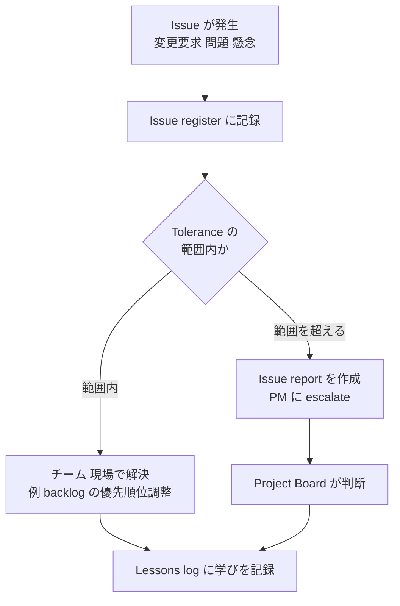

#### 4.7.3 推奨される management products / artifacts 【シラバス 2.1.12 a / 公式ブック 11.3.4】

| 成果物 | 役割 | Agile での留意点 |
|---|---|---|
| **Issue management approach** | issue 対応の進め方 | **軽量・迅速** に。変更は backlog で吸収する前提 |
| **Issue register** | issue の一覧・状況 | 日次の場で更新し、**透明性** を保つ |
| **Issue report** | 個別 issue の詳細（影響・選択肢・推奨） | **tolerance を超える** 場合の escalate に用いる |

#### 4.7.4 関連する agile techniques 【一般知識・【要照合】11.4】

- **Backlog refinement / 優先順位の再設定**: 要求の変更は、**backlog の並べ替え** で吸収する。
- **Daily stand-up**: **障害（impediment）** を早期に表面化する。
- **Kanban ボードの blocker 表示**: 滞留を見える化する。
- **Team coach による障害除去**: チーム単位の障害をリードして取り除く。

#### 4.7.5 ベストプラクティス

- **変更の受入れ窓口を軽量化** し、全変更に承認会議を課さない。
- **tolerance の範囲内は委譲**、範囲外だけ上位に escalate（management by exception）。
- issue を **チームの学びの材料** にする（retrospective へ接続）。

#### 4.7.6 よくある落とし穴

- **すべての変更に正式な承認プロセス** を課し、スピードを失う。
- 逆に、**tolerance 超過の変更を現場で握りつぶす**（ボードへの透明性を欠く）。
- issue の記録が **形骸化** し、対応が追跡できない。

#### 4.7.7 試験ポイント

- **BL3**: 「顧客が新しい要求を追加したい」→ **backlog の優先順位を調整**（Product Owner）。tolerance 内なら escalate 不要。
- **BL4**: 「すべての backlog の変更に Project Board の承認を必須とする」は、**management by exception に反し、かつ agile の変化対応を阻害するため fit for purpose ではない**。

---

### 4.8 Progress practice（シラバス 2.1.14 / 2.1.15 / 公式ブック 第 12 章）

#### 4.8.1 一言でいうと

**「計画に対して今どこにいるか」を測り、先行きを予測し、逸脱を統制する** practice です。Agile では、**実際に動く成果物（完成した増分）** で進捗を測り、**透明性の高い可視化** を重視します。

#### 4.8.2 ステップバイステップ解説

1. **digital and data management approach を用意**: 進捗データ・ツール・情報管理の方針（v2 で強調）。
2. **日次の可視化**: **daily log**、stand-up、Kanban ボード。
3. **チーム内の進捗**: **checkpoint report / team dashboard** で、チームの状況を共有。
4. **PM → Board への報告**: **highlight report / project dashboard** を定期的に。
5. **stage の終わり**: **end stage report**（またはダッシュボード）で実績と次の見通し。
6. **逸脱の恐れ**: **exception report** で Board に判断を求める。
7. **学びの記録**: **lessons log → lessons report**、最後に **end project report**。
8. **目標との整合**: **OKR（Objectives and Key Results）** で目的と成果指標をつなぐ。

#### 4.8.3 推奨される management products / artifacts 【シラバス 2.1.14 a / 公式ブック 12.3.2】

| 成果物 | 役割 | Agile での留意点 |
|---|---|---|
| **Digital and data management approach** | 進捗情報・データの扱い方の方針 | **ツール・データの信頼性**、透明性、セキュリティを明確化 |
| **Daily log** | 日々の記録（決定事項・気づき等） | **軽量** に。チーム内の記憶の補助 |
| **Lessons log** | 学びの記録（随時） | **各 timebox の retrospective の結果** も反映 |
| **Checkpoint report / Team dashboard** | チーム単位の状況報告 | **チームの可視化ボード** を活用し、報告作業を最小化 |
| **Highlight report / Project dashboard** | PM → Board への定期報告 | **ダッシュボード化** し、常時閲覧可能に（報告書の作成を減らす） |
| **Lessons report** | 学びの要約（stage / project 単位） | **今後に活かせる形** で整理 |
| **Exception report** | tolerance 超過時の報告 | **早期に**、選択肢と推奨を添える |
| **End stage report / Project dashboard** | stage 終了時の実績報告 | 実績データ・**完成した増分** を根拠に |
| **End project report** | プロジェクト全体の振り返りと評価 | 便益実現の見通し・運用移行も含める |
| **Objectives and key results（OKR）** | 目標と測定可能な成果指標 | 目的（Objective）と、**計測可能な成果（Key Results）** をつなぐ |

#### 4.8.4 Burn charts（シラバス Foundation 1.1.11 / 12.4.3）

**一言でいうと**: 「残りの作業」または「完了した作業」の推移をグラフにした、進捗の **見える化** ツールです。

| 種類 | 縦軸の意味 | 傾き | 特徴 |
|---|---|---|---|
| **Burn-down** | **残り** の作業量 | 右下がり（0 に向かう） | 完了までの残量が直感的に分かる |
| **Burn-up** | **完了した** 作業量（と全体の範囲） | 右上がり | **範囲（scope）の増減** も同時に見える |

**読み方の例（burn-up）**

| 週 | 完了累計（points） | 全体範囲（points） | 読み取り |
|---|---|---|---|
| 1 | 10 | 100 | 順調な立ち上がり |
| 2 | 22 | 100 | 安定 |
| 3 | 30 | 115 | **範囲が増えた**（要求追加）。完了ペースは維持 |
| 4 | 42 | 115 | 範囲が変わらず着実に進行。**完了予測の見直し** を検討 |

> **ポイント**: burn-down は範囲が増えても「残りが減らない」ように見えるだけで **原因（範囲増か遅延か）** が分かりにくく、burn-up は **範囲の変化を別線で示せる** ため、原因の切り分けに優れます。

#### 4.8.5 関連する agile techniques 【一般知識・【要照合】12.4】

| 技法 | 内容 |
|---|---|
| Kanban ボード | 作業の状態と滞留を可視化 |
| Velocity | チームの完了ペース（予測の根拠） |
| Review / Demo | **動く成果物** で進捗を確認 |
| Retrospective | 進め方の改善点を抽出（学びを lessons log へ） |
| Information radiator（情報ラジエーター） | 壁やボードに **常時見える** 形で状況を掲示 |

#### 4.8.6 tolerance と exception（進捗の統制）

- 各 level で **tolerance** が設定される。
- 範囲内は **現場の判断** で調整し、**超える恐れ** が出たら **exception report** で上位に伝える。
- 逸脱を統制するのが **progress practice の目的の 1 つ**（シラバスのサンプル問題で問われる形式）。

#### 4.8.7 ベストプラクティス

- 進捗は **「完了した（Done の）増分」** で測る（「作業した量」ではなく）。
- 報告書を作るのではなく、**ダッシュボードで常時透明** に。
- **早めに悪い知らせを出せる** 文化（心理的安全性）と、exception の仕組みをセットで運用。
- **OKR** で「何のために進めているか」を全員が理解している状態にする。

#### 4.8.8 よくある落とし穴

- **進捗率（%）だけ** を報告し、実際の増分の完成度が見えない。
- 報告のための **二重管理**（ボードとは別に月次資料を手作業で作る）。
- burn chart を **チーム評価の道具** にして、数字の操作が起こる。

#### 4.8.9 試験ポイント

- **BL3**: シナリオで「stage の途中で scope が増え続けている」→ **burn-up で範囲の増加を可視化** し、Board と tolerance の再交渉。
- **BL4**: 「PM が毎日の詳細報告を全員から集め、月次で人手で資料化する」運用は、**透明性・効率の観点で fit for purpose ではない**（ダッシュボード化が推奨）。
- **成果物名の一覧（10 項目）と、それぞれの役割** を整理して覚える（シラバス 2.1.14 a）。

---
### 4.9 PRINCE2 Agile の 11 roles（シラバス 2.2.1 / 公式ブック Table 7.2, Table B.1）

#### 4.9.1 一言でいうと

PRINCE2 の **統制側の役割** と、Agile の **チーム側の役割** を、1 つの体制に組み込みます。シラバスは **11 の roles** を挙げ、その **ガイダンスの適用（BL3）** を求めます。

#### 4.9.2 11 roles 一覧 【シラバス】と役割の要点【一般知識・【要照合】】

| # | Role | 主な責任（初学者向けの要約） | 層 |
|---|---|---|---|
| a | **Project executive** | プロジェクトの **最終責任者**。business case の成立に責任を持ち、Board を主導する | Direction |
| b | **Chief Product Owner（CPO）** | **プロダクトの価値・優先順位の全体責任**（ユーザー側の代表）。複数の Product Owner をまとめる | Direction / Product |
| c | **Senior supplier** | 供給側の代表。成果物の **実現可能性と資源** に責任を持つ | Direction |
| d | **Project assurance** | **独立した立場で** 事業・ユーザー・供給者の観点を保証（監視・確認） | Assurance |
| e | **Agile coach** | **組織レベル** で agile の実践を支援・助言（PM や Board、複数チームの成長支援） | Support |
| f | **Project manager** | **日常の統制** を担い、Board とチームをつなぐ（tolerance の範囲で委任し、例外を報告） | Management |
| g | **Project support** | 管理業務（ツール、記録、環境）の支援 | Management |
| h | **Product owner（PO）** | **チームの backlog の優先順位** と、ユーザー価値の判断を担う | Delivery |
| i | **Team coach** | **チーム単位** で agile の実践を支援し、障害除去を導く（Scrum の Scrum Master に近い位置づけ） | Delivery |
| j | **Developer** | 成果物を **作り込む** チームメンバー | Delivery |
| k | **Tester** | 成果物の **品質を確認** するチームメンバー（早期から関与） | Delivery |

> **【要照合】** ① CPO が Project Board 上で **どの役割（従来の Senior user に相当する位置づけかなど）** を担うか、② Agile coach と Team coach の **担当範囲の境界**、③ Project assurance の詳細な責任、は **公式ブック Table 7.2 / Table B.1 で必ず確認** してください。試験のシナリオ（追加情報）は、**人物の肩書と発言** から **どの role の責任か** を判断させる形で出題されます。

#### 4.9.3 役割の関係図

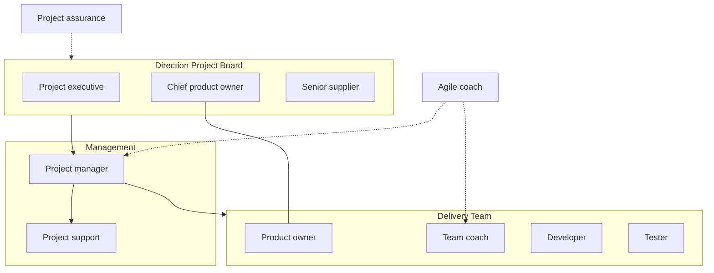

#### 4.9.4 「誰が何を決めるか」早見表（シナリオ問題の判断に）

| 場面 | 主に判断する role | 補足 |
|---|---|---|
| 「プロジェクトを継続・中止するか」 | **Project Board**（**Project executive** が主導） | business case の観点 |
| 「この iteration でどの story を優先するか」 | **Product owner** | ユーザー価値の観点 |
| 「複数チームの優先順位の整合」 | **Chief product owner** | 全体プロダクトの観点 |
| 「チームの作業の進め方・見積り」 | **チーム（Developer / Tester）** | 自己組織化 |
| 「tolerance を超える恐れ」 | **PM → Board** | exception report |
| 「チームが agile の practice でつまずく」 | **Team coach** | チーム単位の支援 |
| 「Board や組織の agile 理解が不足」 | **Agile coach** | 組織単位の支援 |
| 「体制外の独立確認が必要」 | **Project assurance** | 独立した保証 |

#### 4.9.5 ベストプラクティス

- **PM と PO の境界を明確に**: PM は **プロジェクトの統制（tolerance、報告、リスク）**、PO は **プロダクトの価値と優先順位**。
- **Team coach は "管理者" ではない**: チームの自己組織化を支援する立場。
- **Agile coach を Board にも活用**: 統制側の agile 理解が不足すると、**tolerance の委任がうまくいかない**。
- **Project assurance の独立性を保つ**: チーム内の作業者が自己保証しても独立とは言えない。

#### 4.9.6 よくある落とし穴

- **PM が PO の役割を兼ね**、価値判断と統制が混ざる（優先順位が管理都合で決まる）。
- **Team coach が進捗管理者化**（PM の代行）し、自己組織化を阻害。
- **Project executive が不在・多忙** で、Board の判断が遅れる。

#### 4.9.7 試験ポイント（BL3）

- 追加情報の人物表から、シナリオ中の発言（例: 「私が全 story の優先順位を毎日決めている」）を見て、**どの role が越権か、または不足か** を判断する。
- 「**Agile coach** = 組織側の支援」「**Team coach** = チーム側の支援」と区別する。

---
## 5. カテゴリ 3: PRINCE2 Agile の processes と workshops（配点 30%）

> **カテゴリ 3 の学習ゴール** 【シラバス 3.1.1 / 3.1.2】
> 7 つの process について、**activities・関連する workshops・artifacts を agile 文脈で適用（BL3）** し、**tailoring が有効で fit for purpose か分析（BL4）** できる。

### 5.1 processes の全体像

#### 5.1.1 7 processes と流れ

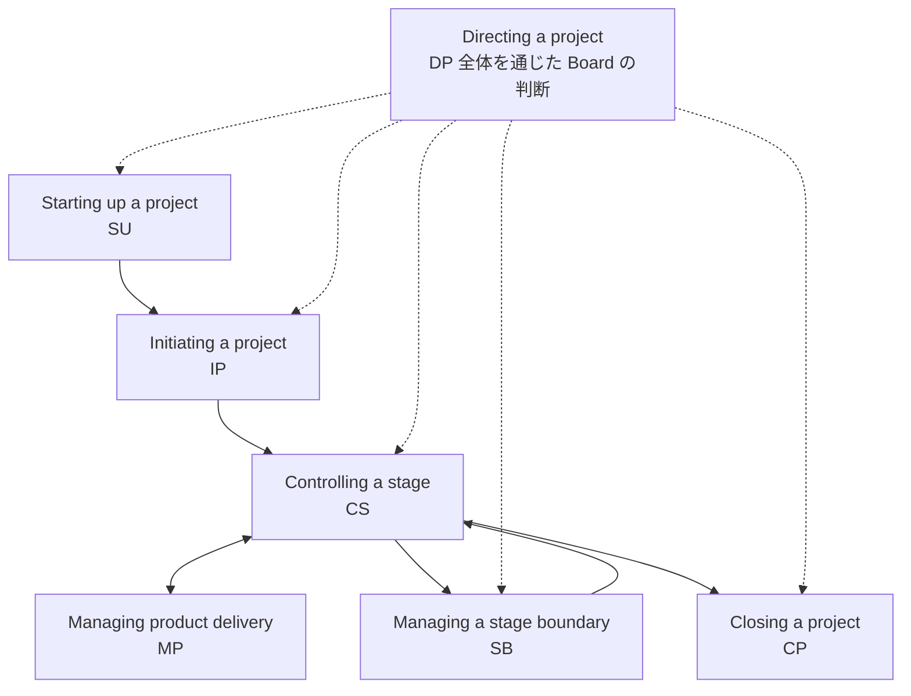

| Process | 目的（1 行）【一般知識】 | Board の主な判断 |
|---|---|---|
| **Starting up a project（SU）** | プロジェクトが **価値ある・実行可能** か見極め、初期体制を作る | 初期化（initiation）を許可するか |
| **Directing a project（DP）** | Board が **重要な判断点で意思決定** し、例外に対応する | 許可・stage 承認・例外対応・終了承認 |
| **Initiating a project（IP）** | **統制と計画の土台** を作り、全員が理解を揃える | プロジェクトを許可するか |
| **Controlling a stage（CS）** | stage 内の **日常の統制**（work package の委任・進捗確認・報告） | （tolerance 内なら委任） |
| **Managing product delivery（MP）** | **チームが成果物を作り・届ける** | （チームの自己管理） |
| **Managing a stage boundary（SB）** | 実績を評価し、**次の stage を計画** する | 次の stage を許可するか |
| **Closing a project（CP）** | **完了・引き継ぎ・学びの記録** | 終了を承認するか |

#### 5.1.2 stage と timebox の関係（Agile の核心）

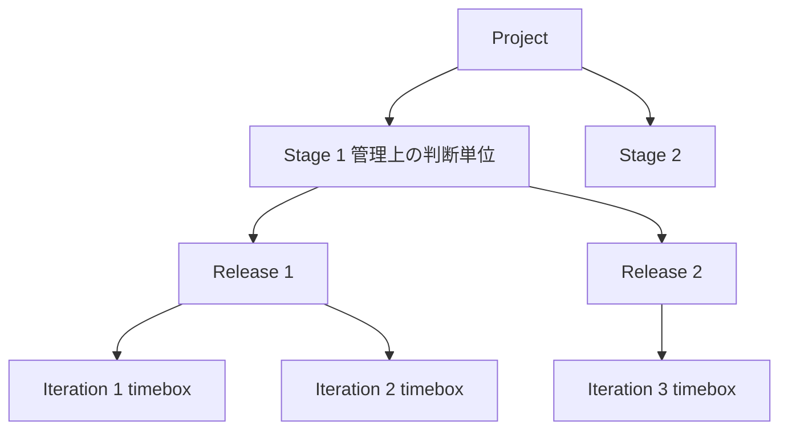

| Timebox の種類 【シラバス（Foundation 1.3.1）】 | 意味 |
|---|---|
| **Iteration** | 固定長の短いサイクル。チームが選んだ項目を完成させる |
| **Release** | 利用者に価値を届ける単位。複数の iteration で構成されることが多い |
| **Stage** | **管理上の判断単位**（Board の承認区切り）。複数の release / iteration を含み得る |

> **【一般知識】** stage の長さは、**計画の確からしさが保てる範囲** で決めます（不確実性が高いほど短く）。具体的な目安は公式ブックの記述で確認してください【要照合】。

#### 5.1.3 tailoring を評価する共通チェックリスト（BL4 用）

process の tailoring を評価するとき、次の 4 点で確認します（シラバス 3.1.2 は **activities / workshops / artifacts** を分析対象と明記）。

| チェック | 質問 |
|---|---|
| ① 目的 | その process の **目的** を、tailoring 後も果たせているか |
| ② Activities | 必要な **activities** が省略・重複していないか |
| ③ Workshops | **workshop** が目的に合い、適切な参加者で実施されているか |
| ④ Artifacts | 必要な **artifacts / management products** が **軽すぎず重すぎず** 用意されているか |

> **Workshops について【要照合】**: シラバスは「process 別に agile workshops が支える」と述べ、各 process の 13.x.3 / 13.x.4 節（サブセクション含む）を参照しています。**個々の workshop の名称・実施目的** は公式ブック 13 章で必ず確認し、ブックにタブを付けてください。以下に示す workshop の例は、一般的なアジャイルの場（vision 共有・優先順位付け・計画・レビュー・振り返り等）に基づくもので、**公式の名称と一致しない可能性** があります。

---

### 5.2 Starting up a project（SU）（公式ブック 13.2）

#### 5.2.1 一言でいうと

**「このプロジェクトを、ちゃんと始める価値があるか」を、最小限の労力で見極める** process です。

#### 5.2.2 ステップバイステップ【一般知識・【要照合】13.2.x】

1. **Project executive と PM を任命** する。
2. **過去の教訓（lessons）を確認** する。
3. **project management team を設計・任命** する（agile roles を含める）。
4. **outline business case（初期の business case / project canvas）** を作成する。
5. **プロジェクトの進め方（project approach）** を選ぶ（agile 適用の程度、プロジェクトの文脈）。
6. **project brief** を作成する。
7. **initiation stage の計画** を立てる。

#### 5.2.3 Agile での tailoring

| 観点 | 内容 |
|---|---|
| **Agilometer の初回評価** | agile 適用のリスクを **最初に把握** する（第 4.6 節） |
| **ビジョンの共有 workshop** | 関係者が **同じ方向** を見るための場（【要照合】名称は 13.2） |
| **project canvas** | 大部の文書ではなく **1 枚で見渡す** |
| **軽量な project brief** | 目的・範囲・体制・制約を **簡潔** に |

#### 5.2.4 ベストプラクティス / 落とし穴 / 試験ポイント

- **ベストプラクティス**: 早期に **agile coach** に関与してもらい、体制と tailoring の初期案を作る。
- **落とし穴**: SU に **時間をかけすぎる**（詳細な要件を固めきろうとする）。
- **BL3**: シナリオの状況を **project brief / project canvas / Agilometer** で整理する。
- **BL4**: 「SU で全機能の詳細仕様を完成させてから IP に進む」は **agile の趣旨に反し fit for purpose ではない**。

---

### 5.3 Directing a project（DP）（公式ブック 13.3）

#### 5.3.1 一言でいうと

**Board が「大事なところだけ」判断する** process です。Agile では、**日々の作業から離れ、要所で価値と統制を確認** します。

#### 5.3.2 ステップバイステップ【一般知識・【要照合】13.3.x】

1. **initiation（初期化）を許可** する。
2. **プロジェクトを許可** する（IP の結果を受けて）。
3. **各 stage を許可** する（SB の結果を受けて）。
4. **随時の指示（ad hoc direction）** を出す（例: 例外への対応）。
5. **プロジェクトの終了を許可** する。

#### 5.3.3 Agile での tailoring

| 観点 | 内容 |
|---|---|
| **ダッシュボードで常時把握** | 報告書の到着を待たず、**project dashboard** で状況を確認 |
| **review への参加** | **動く成果物** を見て、フィードバックし、承認する |
| **tolerance の委任** | 範囲内は PM / チームに **委任** し、Board は例外に注力 |
| **柔軟な判断** | scope の入替えを **tolerance 内で許容** し、価値の高いものに集中 |

#### 5.3.4 ベストプラクティス / 落とし穴 / 試験ポイント

- **ベストプラクティス**: Board メンバー（特に CPO / Executive）が **定期的な review に参加**。
- **落とし穴**: Board が **週次の詳細な承認会議** を要求し、チームの自己組織化を阻害。
- **BL4**: 「Board が全 iteration の開始・終了を承認する」は **management by exception に反し fit for purpose ではない**。

---

### 5.4 Initiating a project（IP）（公式ブック 13.4）

#### 5.4.1 一言でいうと

**「どう進め、どう統制するか」の土台を作る** process です。Agile では、**必要十分（just enough）** な計画で、**早く動き出す** ことが目標です。

#### 5.4.2 ステップバイステップ【一般知識・【要照合】13.4.x】

1. **tailoring の方針を合意** する（PRINCE2 と agile の組み合わせ方）。
2. **各 management approach を用意** する（risk / issue / quality / benefits / sustainability / commercial / digital and data など、practice に対応）。
3. **プロジェクト統制（tolerance、報告の頻度）** を設定する。
4. **プロジェクト計画（release map）** と、**初期の project backlog / product backlog** を用意する。
5. **DoR と DoD** を合意する（品質の基準）。
6. **business case を精緻化** する（project canvas の更新）。
7. **initiation の成果物をまとめ、Board の承認** を得る。

#### 5.4.3 Agile での tailoring

| 観点 | 内容 |
|---|---|
| **Initiation は短く** | 詳細計画ではなく、**必要十分** な見通しと統制の枠組み |
| **release map** | 粗い全体像を **関係者と共有** |
| **チーム体制の確定** | 各チームの **PO・Team coach・Developer・Tester** を確認 |
| **Workshop の活用** | 【要照合】計画・優先順位付け・品質基準合意のための **共同作業の場**（13.4.3 / 13.4.4） |

#### 5.4.4 ベストプラクティス / 落とし穴 / 試験ポイント

- **ベストプラクティス**: IP の成果物を **チームとボードの共通理解** として使う（作って終わりにしない）。
- **落とし穴**: **PID（大部の initiation 文書）** の作成そのものが目的化する。
- **BL3**: DoR / DoD、tolerance、報告頻度など、**IP で決める項目** をシナリオから選ぶ。
- **BL4**: 「IP に数か月かけて、全 backlog の詳細を確定する」は **fit for purpose ではない**（遅すぎる・変化に弱い）。

---

### 5.5 Controlling a stage（CS）（公式ブック 13.5）

#### 5.5.1 一言でいうと

**stage の間、PM が日常の統制を担う** process です。Agile では、**チームの自己管理を尊重しつつ、tolerance を守る** バランスがポイントです。

#### 5.5.2 ステップバイステップ【一般知識・【要照合】13.5.x】

1. **work package を委任** する（**work package description** で内容と tolerance を伝える）。
2. **work package の状況を確認** する（チームのボード、stand-up の情報、checkpoint report）。
3. **完了した work package を受け取る**（**DoD を満たしている** ことを確認）。
4. **stage の状況を確認** する（burn chart、velocity 等）。
5. **highlight report / dashboard を更新** する。
6. **issue と risk を捕捉・評価・エスカレート** する。
7. **是正措置** を取る（tolerance 内）。
8. **tolerance 超過の恐れ** があれば **exception report** を出す。

#### 5.5.3 Agile での tailoring

| 観点 | 内容 |
|---|---|
| **work package = timebox の仕事** | 例: 1 つの iteration 分の作業として委任 |
| **チームが work を pull** | PM が割り当てるのではなく、**チームが backlog から取り込む** |
| **可視化された情報** | **ボード・dashboard** で、PM が **追加の報告を求めずに** 状況を把握 |
| **Workshop / 会議** | 【要照合】review、retrospective、計画など（13.5.3 / 13.5.4） |

#### 5.5.4 ベストプラクティス / 落とし穴 / 試験ポイント

- **ベストプラクティス**: PM は **障害除去と上位との調整** に集中し、チームの作業配分に介入しない。
- **落とし穴**: PM が **日次のタスク管理者** になり、自己組織化を損なう。
- **BL3**: 「チームの velocity が低下している」→ **原因の確認（障害・範囲の変化）** と、tolerance 内の是正 / 必要なら exception。
- **BL4**: 「PM がチームの日次進捗を細かくレビューして個別に指示する」は **委任の趣旨に反し fit for purpose ではない**。

---

### 5.6 Managing product delivery（MP）（公式ブック 13.6）

#### 5.6.1 一言でいうと

**チームが実際に成果物を作り、届ける** process です。Agile では、**チームの自己組織化と iteration の運営** の中心になります。

#### 5.6.2 ステップバイステップ【一般知識・【要照合】13.6.x】

1. **work package を受け入れる**（内容・tolerance・DoD を確認）。
2. **チームで作業を計画する**（team plan、backlog からの取り込み）。
3. **iteration で作り込む**（stand-up、TDD、CI など）。
4. **DoD を満たすものだけを完成とする**。
5. **review / demo で確認**（PO・ステークホルダーのフィードバック）。
6. **retrospective で学ぶ**。
7. **完了を PM に報告する**（team dashboard / checkpoint report）。

#### 5.6.3 Agile での tailoring

| 観点 | 内容 |
|---|---|
| **フレームワークの選択** | Scrum / Kanban 等を **プロジェクトの文脈に合わせて使い分け** |
| **チームの自己管理** | 作業の進め方・見積り・割り当てを **チームが決める** |
| **短いサイクル** | **iteration / timebox** ごとに **動く成果物** を届ける |
| **Workshop / events** | 計画・review・retrospective 等の **チームの場**（13.6.3 / 13.6.4）【要照合】 |

#### 5.6.4 ベストプラクティス / 落とし穴 / 試験ポイント

- **ベストプラクティス**: **DoD を守る**（完成の定義を妥協しない）。
- **落とし穴**: チームが **PM の指示待ち** になる、あるいは PM が **チームの内部に介入** する。
- **BL3**: MP のどのタイミングで **review / retrospective** を行うかをシナリオから選ぶ。
- **BL4**: 「iteration の終わりに review / retrospective を省いて次の作業へ進む」は **学習と透明性の観点で fit for purpose ではない**。

---

### 5.7 Managing a stage boundary（SB）（公式ブック 13.7）

#### 5.7.1 一言でいうと

**stage の終わりに「実績」を評価し、「次の stage」をどうするか判断材料を整える** process です。

#### 5.7.2 ステップバイステップ【一般知識・【要照合】13.7.x】

1. **stage の実績を評価** する（完成した増分、tolerance、品質、便益）。
2. **project plan / release map を更新** する。
3. **business case を更新** する（実績データを踏まえて）。
4. **リスク・Agilometer を再評価** する。
5. **次の stage を計画** する（backlog の再優先順位付け、tolerance の設定）。
6. **end stage report（または project dashboard）を作成** し、Board へ。
7. **tolerance 超過の場合** は **exception plan** を作る。

#### 5.7.3 Agile での tailoring

| 観点 | 内容 |
|---|---|
| **実績ベースの評価** | 完成した増分・利用データで **価値を検証** |
| **Release review** | 【要照合】stage の成果を関係者と確認する場（13.7.3 / 13.7.4） |
| **柔軟な次 stage 計画** | **学び** を反映して、backlog と release map を **調整** |
| **軽量な報告** | **dashboard 中心** に、情報を **最新** に保つ |

#### 5.7.4 ベストプラクティス / 落とし穴 / 試験ポイント

- **ベストプラクティス**: SB を **「実績データに基づく投資判断の場」** にする（business case 更新）。
- **落とし穴**: SB が **形式的な報告会** になり、次 stage の判断に使われない。
- **BL3**: SB で更新する artifacts（release map / business case / Agilometer / backlog）を選ぶ。
- **BL4**: 「stage 境界で business case を更新せず、当初計画通りに進める」は **continued business justification に反し fit for purpose ではない**。

---

### 5.8 Closing a project（CP）（公式ブック 13.8）

#### 5.8.1 一言でいうと

**プロジェクトを「きちんと終わらせ」、引き継ぎと学びを残す** process です。

#### 5.8.2 ステップバイステップ【一般知識・【要照合】13.8.x】

1. **計画的な終了の準備**（または、**早期終了** の場合の準備）。
2. **成果物を引き渡す**（運用側・利用者へ。**運用移行** を含む）。
3. **プロジェクトを評価** する（目標・便益の見通し・学び）。
4. **lessons report** と **end project report** を作成する。
5. **Board に終了を提言** し、承認を得る。

#### 5.8.3 Agile での tailoring

| 観点 | 内容 |
|---|---|
| **早期・段階的な引き渡し** | 増分を **運用に段階的に移行**（最後にまとめてではなく） |
| **最終 retrospective** | **チーム・組織の学び** を共有 |
| **便益の追跡計画** | プロジェクト終了後の **便益実現の測定** を計画 |
| **継続開発への接続** | 【第 6 章参照】プロダクトの継続開発・運用体制へ移行 |

#### 5.8.4 ベストプラクティス / 落とし穴 / 試験ポイント

- **ベストプラクティス**: **運用側を早期に巻き込み**、DoD に **運用準備** を含める。
- **落とし穴**: 最後に一括で引き渡し、**運用側が準備できていない**。
- **BL3**: CP で作る artifacts（lessons report、end project report）と、**便益の追跡** の扱いをシナリオから選ぶ。
- **BL4**: 「引き継ぎを最終日の 1 回だけ実施する」は **運用側の準備不足リスクがあり fit for purpose ではない**。

---

### 5.9 process 別 まとめ表（試験直前の確認用）

| Process | Agile での要点 | 主な artifacts（例） | ありがちな誤り |
|---|---|---|---|
| SU | 軽く・早く。Agilometer 初回、canvas | project brief、business case / canvas、Agilometer | 詳細仕様の完成を待つ |
| DP | 例外管理。dashboard と review | dashboard、exception への対応 | 詳細な承認の要求 |
| IP | just enough。DoR/DoD、tolerance、release map | 各 management approach、release map | 大部の文書化が目的化 |
| CS | 委任と可視化。work package | work package description、dashboard、burn chart | PM の細かな指示 |
| MP | 自己組織化、DoD、review/retro | team plan、team dashboard | 指示待ち / 介入 |
| SB | 実績で business case を更新 | end stage report、更新済み plan | 形式的な報告会 |
| CP | 段階的な引き渡しと学び | lessons report、end project report | 最後の一括引き渡し |

---
## 6. カテゴリ 4: より広い文脈での適用（配点 6%）

> **カテゴリ 4 の学習ゴール** 【シラバス 4.1 / 4.2】
> PRINCE2 Agile を **プロジェクトの外側** に適用し（BL3: agile product management、プロジェクトから運用への移行、継続的な開発と運用）、**AI が PRINCE2 Agile をどう支援するか** を理解する（BL2）。
> **配点は 6%（約 3 問）** ですが、範囲が狭いので **取りこぼさない** のが得策です。

### 6.1 プロジェクトとプロダクトの違い

**一言でいうと**: **プロジェクトには終わりがある** が、**プロダクト（製品・サービス）は使われ続ける** ため、その後も価値を育てる活動が続きます。

| 観点 | プロジェクト | プロダクト（継続） |
|---|---|---|
| 期間 | 有期 | 継続 |
| 目的 | 合意された成果物・便益の実現 | 継続的な価値提供・進化 |
| 統制 | PRINCE2 の stage・Board・tolerance | プロダクト戦略・roadmap・優先順位 |
| 役割 | Project executive / PM 等 | **Product owner / CPO** が長期で責任を持つ |

### 6.2 Agile product management への適用（シラバス 4.1.1 / 公式ブック 14.2.2.1）

**一言でいうと**: プロジェクト後も続くプロダクトの管理に、PRINCE2 Agile の考え方（価値・優先順位・透明性・例外管理）を活かす、という視点です。

**ステップバイステップ【一般知識・【要照合】14.2.2.1】**

1. **プロダクトの vision と roadmap** を明確にする。
2. **PO / CPO が backlog を継続的に優先順位付け** する。
3. **学び（利用データ・フィードバック）** を次の優先順位に反映する。
4. **大きな変更・投資判断** が必要なときに、**PRINCE2 Agile の projects として切り出す**（例: 大規模な機能刷新）。
5. プロダクト全体の **品質・持続可能性** を継続的に管理する。

**ベストプラクティス**: **プロダクトの長期的な責任者（PO）** を明確にし、プロジェクトと継続開発の **役割の連続性** を保つ。
**落とし穴**: プロジェクトが終わった途端に **責任者が不在** になり、backlog が放置される。

### 6.3 プロジェクトから運用への移行（シラバス 4.1.2 / 公式ブック 14.2.1）

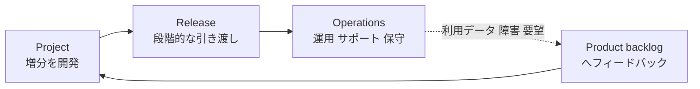

**ステップバイステップ【一般知識・【要照合】14.2.1】**

1. **運用側を早期に巻き込む**（運用要件を backlog に）。
2. **DoD に運用準備を含める**（監視・サポート手順・ドキュメント・研修）。
3. **増分ごとに段階的に引き渡す**（最終日の一括引き渡しを避ける）。
4. **知識移転** を行い、運用側が独立して対応できるようにする。
5. **移行後の学び** を backlog に戻し、改善サイクルを回す。

**ベストプラクティス**: **運用の観点（保守性・監視・サポート）** を「非機能要求」として backlog に入れ、**DoD で担保** する。
**落とし穴**: 運用側が **完成直前まで関与せず**、リリース後に混乱する。

### 6.4 継続的な agile development and operations（シラバス 4.1.3 / 公式ブック 14.2.2.2）

**一言でいうと**: 開発と運用を **分断せず、継続的なフロー** で回す考え方です（DevOps 的な発想）。

| 観点 | 内容【一般知識・【要照合】14.2.2.2】 |
|---|---|
| 継続的デリバリー | 小さな変更を **頻繁・安全に** 本番へ届ける |
| 統合されたチーム | 開発と運用が **同じ目的** を共有し、責任を分かち合う |
| フィードバックの短縮 | 運用データを **すぐ開発に戻す** |
| 統制 | 例外管理・tolerance の考え方は残しつつ、**stage の区切りより「継続的な流れ」** が中心になる |

**ベストプラクティス**: **自動化されたテストとデプロイ**、監視、**変更の可逆性（ロールバック）** で、頻繁なリリースのリスクを下げる。
**落とし穴**: **頻度だけを追い**、品質・持続可能性の基準（DoD）を緩める。

### 6.5 AI による PRINCE2 Agile の支援（シラバス 4.2.1 / 公式ブック 15.4）

> **BL2（理解）** レベルです。**「AI がどの要素をどう支援し得るか」と、その際の留意点** を説明できれば十分です。**具体的なサブセクションの内容は公式ブック 15.4 で確認** してください【要照合】。以下は【一般知識】に基づく整理です。

#### 6.5.1 practice 別の支援例

| Practice | AI の支援例 | 人が必ず確認すること |
|---|---|---|
| Business case | 市場・競合情報の整理、canvas のたたき台 | 前提・データの正しさ、投資判断 |
| Organization | 役割記述のたたき台、ステークホルダー分析の補助 | 責任の最終決定、文化への適合 |
| Plans | user story のドラフト、見積りの参考、backlog の整理 | 優先順位（価値判断）、現実性 |
| Quality | テストケース案、コードレビューの補助、要件の抜け検出 | **DoD への適合**、網羅性 |
| Risk | 過去事例からのリスク候補提示、傾向検知 | リスクの評価・対応の決定 |
| Issues | issue の分類・要約、類似事例の検索 | 対応の意思決定 |
| Progress | 議事録・報告の要約、予測（完了見込み）の補助 | データの信頼性、**予測の根拠** |

#### 6.5.2 AI 活用のベストプラクティス

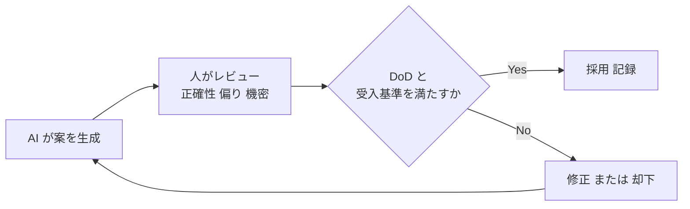

- **人が説明責任（accountability）を持つ**。AI は意思決定を代行しない（Board の判断や優先順位付けは人が行う）。
- **AI の成果物も DoD の対象**（レビュー・テストを省略しない）。
- **データの機密性・個人情報・知的財産** に配慮し、利用ルールを **digital and data management approach**（第 4.8 節）などで明確化する。
- **透明性**: どこに AI を使ったかを **記録・共有** する。
- **偏り・誤り（ハルシネーション）** の可能性を前提に、**検証の手順** を組み込む。

#### 6.5.3 試験ポイント（BL2）

- 「AI は **支援する道具** であり、**責任は人に残る**」という方向の選択肢が正解になりやすい。
- 「AI の出力を無検証で採用する」「AI が Board の意思決定を置き換える」「品質管理が不要になる」は **典型的な誤答**。

---

## 7. 試験対策: オープンブックを最大限に活かす

### 7.1 「暗記」より「索引」を作る

オープンブックだからこそ、**時間内に探せること** が重要です。本ガイドは、シラバスが示す章番号をもとに、**タブ（付箋）を付ける箇所** を整理しました。

| タブ | 公式ブックの章 | 内容 |
|---|---|---|
| A | 2.6, 2.6.1, 2.6.2 | Agile mindset / Agile Onion / 特徴 |
| B | 2.7.1〜2.7.5 | transformation plan / maturity / psychological safety / sustainability |
| C | 3.3 | 7 aspects of project performance |
| D | 第 4 章（4.2〜4.5） | OCM / stakeholders / culture / チーム / コミュニケーション |
| E | 5.2〜5.4, 5.6, 5.6.1 | PRINCE2 の principles / practices / processes と agile 文脈 |
| F | 第 6 章（6.3.1, 6.3.2, 6.4） | Business case practice |
| G | 第 7 章（7.3, 7.3.1, 7.3.2, 7.4） | Organization practice |
| H | 第 8 章（8.3, 8.3.1, 8.3.2, 8.4） | Plans practice |
| I | 第 9 章（9.3, 9.3.1, 9.3.2, 9.4） | Quality practice |
| J | 第 10 章（10.3.1, 10.3.2, 10.4） | Risk practice / Agilometer |
| K | 第 11 章（11.3.1〜11.3.4, 11.4） | Issues practice |
| L | 第 12 章（12.3.1, 12.3.2, 12.4） | Progress practice |
| M | Table 7.2, Table B.1 | roles |
| N | 第 13 章（13.2〜13.8） | processes と workshops |
| O | 第 14 章（14.2.1, 14.2.2.1, 14.2.2.2） | プロダクト管理 / 運用移行 / 継続開発 |
| P | 15.4 | AI による支援 |
| Q | Glossary | 用語集（用語の確認に） |

> **ブック書き込みは許可されています**（シラバスの記載）。ただし **持ち込めるのは公式ブックのみ** です。ノートや別紙は不可なので、**ブック自体の余白** に要点（例: 「Agilometer は再評価」「DoR=入口 / DoD=出口」）を書き込みましょう。

### 7.2 時間配分

| 項目 | 目安 |
|---|---|
| 総時間 | 150 分（延長対象なら 188 分） |
| 1 問あたり | **平均 3 分**（50 問） |
| 一巡目 | 約 90〜100 分：確信の持てる問題を素早く。**迷ったら印を付けて先へ** |
| 二巡目 | 約 40〜50 分：BL4（分析）問題や、ブック確認が必要な問題 |
| 見直し | 残りで、未回答の確認（**誤答減点なし** のため、**空欄は作らない**） |

> **誤答による減点はありません。** 必ず全問に解答してください。

### 7.3 シナリオ問題の読み方（ステップ）

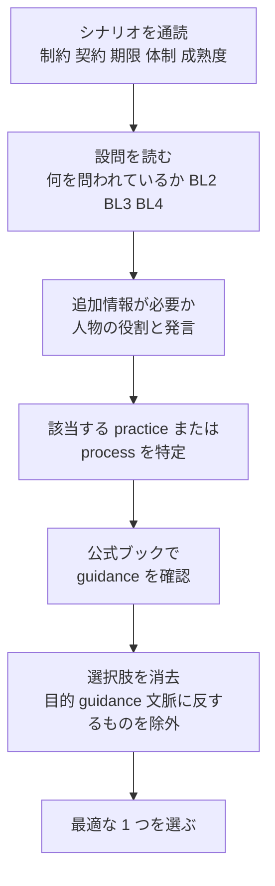

### 7.4 設問タイプ別の攻略

| 設問タイプ | コツ |
|---|---|
| **Standard**（選択肢 4 つ） | 正解は 1 つ。**もっとも適切** を選ぶ。**極端な断定（「常に」「決して」）** を含む選択肢は疑う |
| **Missing word** | 文の **目的** を考える（例: 逸脱を統制する目的 → progress）。practice の purpose を復習 |
| **List**（2 つ選ぶ） | 4 つの記述を **個別に真偽判定** し、真の 2 つを含む組合せを選ぶ（**否定形では出題されない**） |
| **Negative** | 例外的な出題。「**やってはいけない** こと」を選ぶ。**設問文の NOT を見落とさない** |

### 7.5 BL4（分析）問題の判断基準

**「fit for purpose（目的に適う）」の観点で、次の順に確認します。**

1. **その practice / process の目的を果たしているか**
2. **PRINCE2 Agile の guidance と矛盾しないか**
3. **必要な management products / artifacts が機能するか**
4. **シナリオの文脈（制約・成熟度・契約）に合うか**
5. **統制が過剰（重すぎる）または不足（軽すぎる）でないか**

### 7.6 頻出する誤答パターン

| 誤答パターン | なぜ誤りか |
|---|---|
| Board がすべての変更・iteration を承認する | **management by exception** に反する |
| PM がチームの日次タスクを割り当てる | **自己組織化** と委任の趣旨に反する |
| 納期のために **quality（DoD）を下げる** | **quality は妥協せず、scope を flex** にする |
| business case を **最初に固めて更新しない** | **continued business justification** に反する |
| Agilometer を **一度だけ** 実施 | **定期的な再評価** が必要 |
| 詳細な全体計画を **最初に完成** させる | **rolling wave / 近い将来ほど詳細** に反する |
| 報告書を **手作業で大量に作成** | **dashboard での透明性** が推奨される |
| 「Agile だから文書・統制は不要」 | PRINCE2 Agile は **統制を維持したまま** 柔軟性を得る |
| AI の出力を **検証せず採用** | **人が責任**、DoD を満たすことが必要 |

### 7.7 よくある混同（用語の整理）

| 混同しやすい用語 | 違い |
|---|---|
| **Agile coach vs Team coach** | Agile coach = **組織・複数チーム / Board** の支援、Team coach = **チーム単位** の支援【要照合】 |
| **Product backlog vs Project backlog** | Product backlog = 各チームが扱う **優先順位付き** の作業項目、Project backlog = **プロジェクト全体** の成果物レベルの一覧（epic 等）【要照合】 |
| **Checkpoint report vs Highlight report** | Checkpoint = **チーム → PM**、Highlight = **PM → Board**（dashboard 化も可） |
| **Exception report vs Issue report** | Exception = **tolerance 超過の恐れ** を Board に伝える、Issue = 個別の issue の詳細 |
| **Stage vs Timebox（iteration/release）** | Stage = **管理上の判断単位**、iteration / release = **チームの作業・提供の単位** |
| **DoR vs DoD** | DoR = 入口、DoD = 出口 |
| **Burn-down vs Burn-up** | Burn-down = 残り作業、Burn-up = 完了 + 全体範囲 |

---
## 8. 演習: シナリオ形式の練習問題（オリジナル）

> **注意**: 以下は本ガイド用に作成した **オリジナルの練習問題** です（公式サンプルペーパーではありません）。形式（シナリオ + 追加情報 + 設問、Standard / Missing word / List）は公式シラバスの説明に合わせています。公式のサンプルペーパーは、PeopleCert の公式ページ・研修機関経由で入手して併用してください。

### 8.1 プロジェクトシナリオ

**「さくら銀行 モバイルアプリ刷新プロジェクト」**（架空）

- 地方銀行が、モバイルバンキングアプリを刷新する。**新しい法規制への対応期限（9 か月後）は動かせない**。
- 3 つのチーム（A: 口座、B: 決済、C: 基盤）、合計 24 名。**大阪・東京の 2 拠点 + リモート** の混在。
- これまでは従来型（ウォーターフォール）で運営。最近、2 チームが Scrum を試行し始めた。
- チーム C は外部供給者への委託で、**契約は固定価格・固定範囲**。
- Project Board は **毎週 40 ページの状況報告書**（PM が手作業で作成）を求めている。
- business case は **2 年前に承認** されたまま更新されていない。Agilometer は未実施。
- **DoD は未定義**。テストは各リリースの直前にまとめて実施している。

### 8.2 追加情報（人物）

| 氏名 | 役割 | 状況・発言 |
|---|---|---|
| 田中 愛子 | Project manager | PRINCE2 の経験は豊富だが agile は初めて。現在、チームのタスクを日次で割り当てている |
| 伊藤 健 | Product owner（チーム A） | backlog の変更のたびに、Project executive の承認を待っている |
| 呉 晨 | Team coach（チーム B） | agile 経験が豊富。チーム B の stand-up の運営を支援している |
| 森 大輔 | Project executive | 「範囲は固定したい。ただし法規制対応は絶対に間に合わせたい」 |
| 佐藤 英二 | Senior supplier | 固定価格・固定範囲の契約を維持したい |
| 近藤 風香 | Chief product owner | agile に協力的。複数チームの優先順位の整合を担当している |
| 阿部 玄 | Agile coach | 最近参画。組織全体の agile 導入を支援する |

### 8.3 設問

---

**Q1（BL2・Standard）**
次のうち、Agile Onion の層はどれか。

- A. Tolerance
- B. Stage
- C. Mindset
- D. Benefit

---

**Q2（BL2・Missing word）**
次の文の空欄に入る語を選べ。
「[ ? ] practice の目的の 1 つは、計画に対する実績を比較し、許容できない逸脱を統制することである。」

- A. business case
- B. progress
- C. organization
- D. quality

---

**Q3（BL3・Standard）**
伊藤（チーム A の Product owner）は、backlog を変更するたびに森（Project executive）の承認を待っており、チームの作業が滞っている。**issues practice** の適用として **もっとも適切** なものはどれか。

- A. Board が管理を保つため、すべての変更に Project executive の承認を継続する
- B. stage の終わりまで backlog を凍結する
- C. Team coach がすべての変更を承認する
- D. 合意した tolerance の範囲内であれば Product owner が backlog の優先順位を変更し、tolerance を超える恐れがある変更のみを escalate する

---

**Q4（BL3・List）**
Definition of Ready（DoR）と Definition of Done（DoD）について、**正しい 2 つ** の記述はどれか。

1. DoR は、backlog の項目が着手できる状態にあるかを示す。
2. DoD は、項目が完成したとみなせる条件を示す。
3. 納期が迫った場合、範囲を守るために DoD を緩めてよい。
4. DoR は、Project Board が stage を承認する条件である。

- A. 1 と 2
- B. 2 と 3
- C. 3 と 4
- D. 1 と 4

---

**Q5（BL4・Standard）**
Project Board は毎週 40 ページの状況報告書を求めており、PM が手作業で作成している。この運用の **評価として最も適切** なものはどれか。

- A. Board が統制を保つために詳細が必要なので、fit for purpose である
- B. チームのボードや burn chart で既に見える情報の重複であり、fit for purpose ではない。project dashboard と例外報告への切り替えが望ましい
- C. 月次にすれば fit for purpose になる
- D. Board は進捗情報を一切受け取るべきではないため、fit for purpose ではない

---

**Q6（BL3・Standard）**
田中（PM）は、Agilometer を使い始めることにした。Agilometer の使い方として **もっとも適切** なものはどれか。

- A. プロジェクト開始時にのみ使う
- B. プロジェクト終了時にのみ使う
- C. 開始時に使い、その後も stage 境界や状況が変化したときに再評価する
- D. exception report を出したときにのみ使う

---

**Q7（BL4・Standard）**
チーム C の契約は固定価格・固定範囲で、Board は法規制対応の期限を守りたい。**commercial management approach の tailoring として最も効果的** なものはどれか。

- A. 範囲を固定のままにし、すべての変更を exception として扱う
- B. 契約を解除し、すべてを社内で実施する
- C. 柔軟性を得るため、契約から Must の項目を除外する
- D. 価格と期限は維持しつつ、MoSCoW で範囲に優先順位を付け、法規制対応の Must は固定したまま、tolerance の範囲で Should / Could を入れ替えられるように契約の運用を見直す

---

**Q8（BL3・Standard）**
チーム B は、会議室に 5 名、リモートに 3 名がいる hybrid 環境で、リモートメンバーが議論に参加しづらい。**hybrid 環境でのコミュニケーション** の適用として **最も適切** なものはどれか。

- A. 会議室にいる人も含め、全員が個別にオンライン会議へ参加し、決定事項を共有ボードに記録する
- B. 会議は会議室で行い、リモートメンバーには議事録を送る
- C. リモートメンバーは review にのみ招待する
- D. チームの会議をすべてメールに置き換える

---

**Q9（BL4・Standard）**
田中（PM）は、stage 境界（SB）で「plan は更新するが、business case は 2 年前に承認済みなので更新しない」と考えている。この考えの **評価として最も適切** なものはどれか。

- A. Board が承認済みであり、変更には新たな承認が必要なので、fit for purpose である
- B. agile プロジェクトでは plan だけを更新すればよいので、fit for purpose である
- C. fit for purpose ではない。SB では、実際の提供実績と便益のデータを用いて business case を更新し、継続的な事業上の正当性を確認すべきである
- D. fit for purpose ではない。business case はチームが毎日更新すべきである

---

**Q10（BL2・Standard）**
PRINCE2 Agile を AI で支援する際の記述として **もっとも適切** なものはどれか。

- A. 時間が足りない場合、AI の出力は確認せずに採用してよい
- B. AI は user story の下書きやリスクの要約を支援できるが、人が説明責任を持ち、成果物は DoD を満たす必要がある
- C. AI は Project Board の意思決定を代行できる
- D. AI を使えば quality management approach は不要になる

---

**Q11（BL3・List）**
PRINCE2 Agile の roles について、**正しい 2 つ** の記述はどれか。

1. Product owner は、チームの product backlog の優先順位付けに責任を持つ。
2. Team coach は、チームメンバーのタスクを日次で割り当てる。
3. Agile coach は、組織レベルでの agile の導入・実践を支援する。
4. Project assurance は、Project manager に報告して独立性を保つ。

- A. 1 と 3
- B. 2 と 3
- C. 1 と 4
- D. 2 と 4

---

### 8.4 解答と解説

| 問 | 正解 | 解説 |
|---|---|---|
| Q1 | **C** | Agile Onion の層は Mindset / Values / Principles / Practices / Processes。Tolerance・Stage・Benefit は PRINCE2 の用語で、Onion の層ではない |
| Q2 | **B** | 「実績と計画の比較」「逸脱の統制」は **progress** の目的。business case は望ましさ・実行可能性の判断、organization は責任体制、quality は目的適合性が主眼 |
| Q3 | **D** | 変更は agile では日常的。**tolerance の範囲内は現場（Product owner）で調整** し、**超える恐れのあるもののみ escalate**（management by exception）。A は Board の過剰統制、B は変化対応を阻害、C は Team coach に権限を移しても本質的な解決にならず、役割の趣旨（支援）にも反する |
| Q4 | **A** | DoR は **入口**（着手できる状態）、DoD は **出口**（完成の条件）。3 は quality を下げて範囲を守る選択で誤り（範囲＝ Should / Could を調整する）。4 は DoR の役割ではない |
| Q5 | **B** | 既にチームのボード・burn chart で見える情報の **二重管理** であり、透明性・効率の点で fit for purpose ではない。**dashboard の常時公開 + 例外報告** が推奨。頻度を月次にしても手作業の重複は解消しない（C）。Board が情報を受け取らないのも誤り（D） |
| Q6 | **C** | Agilometer は **初期に把握し、定期的（stage 境界など）や状況変化時に再評価** する。一度きりの実施は不十分（A, B, D） |
| Q7 | **D** | 価格・期限（法規制対応）を守りつつ、**MoSCoW で Must を固定し Should / Could を柔軟にする**。A は変化に対応できず、B は極端で非現実的、C は Must を外すと法規制対応が危うい |
| Q8 | **A** | hybrid の情報格差を避けるため、**全員が個別に接続する前提** で会議を設計し、決定事項を **共有ボードに記録**。B, C, D はリモートメンバーを実質的に排除・遅延させる |
| Q9 | **C** | **continued business justification**。SB は実績データで business case を更新する機会。B は誤り。D は頻度が過剰で、business case の役割にそぐわない |
| Q10 | **B** | AI は **支援ツール**。人が説明責任を持ち、成果物は DoD・受入基準を満たす。A・C・D は典型的な誤答 |
| Q11 | **A** | 1 と 3 が正しい。2 は Team coach は自己組織化を **支援** する立場で、日次のタスク割当は行わない（自己組織化に反する）。4 は Project assurance は **独立** した立場であり、PM に報告して独立性を保つという記述は矛盾する |

### 8.5 自己採点の目安

| 正解数（11 問中） | 目安 |
|---|---|
| 9〜11 | 十分。ブックの索引精度を上げ、公式サンプルペーパーへ |
| 6〜8 | 概ね理解。誤答した領域の章を再読し、**なぜ誤りか** を説明できるか確認 |
| 5 以下 | 第 3〜5 章の「ベストプラクティス」「落とし穴」を中心に再学習 |

---

## 9. 用語集（英日対訳）

> **【要照合】** 用語の定義は **公式ブックの Glossary** が正です。以下は初学者向けの要約です。

| 英語 | 日本語 | 要約 |
|---|---|---|
| Agile | アジャイル | 反復的・協働的に、変化に対応しながら価値を届ける考え方 |
| Agile coach | アジャイルコーチ | 組織レベルで agile の導入・実践を支援する role |
| Agile maturity | アジャイル成熟度 | 組織・チームの agile 実践の成熟の度合い |
| Agile Onion | アジャイル・オニオン | Mindset / Values / Principles / Practices / Processes の層構造モデル |
| Agile sustainability | アジャイルの持続可能性 | agile な働き方を長期的に維持できる状態 |
| Agile transformation plan | アジャイル変革計画 | 組織が agile へ移行するための道筋の計画 |
| Agilometer | アジロメーター | agile 適用のリスクを診断・可視化するツール |
| Backlog（product / project） | バックログ | 優先順位付きの作業項目の一覧 |
| Being agile / Doing agile | アジャイルである / アジャイルを行う | mindset・behaviours のあり方 / practices・techniques のやり方 |
| Benefit | 便益 | 成果物の利用から得られる望ましい結果 |
| Burn chart | バーンチャート | 進捗の推移を示すグラフ（burn-down / burn-up） |
| Business case | ビジネスケース | 投資の望ましさ・実行可能性・達成可能性を示す根拠 |
| Checkpoint report | チェックポイントレポート | チームから PM への状況報告 |
| Chief Product Owner（CPO） | チーフ・プロダクトオーナー | プロダクトの価値・優先順位に関する全体責任（複数 PO を統括） |
| Dashboard（project / team） | ダッシュボード | 状況を常時見える化した表示（報告の代替） |
| Definition of Done（DoD） | 完成の定義 | 項目が完成したとみなせる条件（出口） |
| Definition of Ready（DoR） | 着手可能の定義 | 項目が着手できる状態の条件（入口） |
| End project report | プロジェクト終了報告 | プロジェクト全体の評価と学び |
| End stage report | ステージ終了報告 | stage の実績と次の見通し |
| Epic user story | エピック（大きな user story） | 分解前の大きな要求 |
| Exception report | 例外報告 | tolerance 超過の恐れを Board に伝える報告 |
| Fix and flex | 固定と柔軟 | どの aspect を固定し、どれを柔軟にするか |
| Highlight report | ハイライトレポート | PM から Board への定期報告 |
| Increment | 増分 | 完成した、利用可能な成果物の追加分 |
| Issue register / Issue report | 課題登録簿 / 課題報告 | issue の一覧 / 個別の詳細 |
| Iteration | イテレーション | 固定長の短い作業サイクル（timebox の一種） |
| Lessons log / Lessons report | 教訓ログ / 教訓報告 | 学びの記録 / 要約 |
| Management by exception | 例外管理 | tolerance 内は委任し、超過時のみ上位が関与する |
| MoSCoW | モスクワ | Must / Should / Could / Won't の優先順位付け |
| MVP | 実用最小限の製品 | 学びを最大化する最小限の価値提供 |
| OCM | 組織変革マネジメント | 組織の変化を計画的に進める考え方 |
| OKR | 目標と主要な成果 | Objectives and Key Results |
| Product owner（PO） | プロダクトオーナー | チームの backlog の優先順位に責任を持つ role |
| Project canvas | プロジェクトキャンバス | 1 枚で見渡せる軽量な business case 表現 |
| Psychological safety | 心理的安全性 | 懸念や失敗を口にしても不利益がないと感じられる状態 |
| Release map | リリースマップ | 提供の粗い見通しを示す計画 |
| Retrospective | 振り返り | チームが進め方を振り返り改善する場 |
| Story points / T-shirt sizing | ストーリーポイント / T シャツサイズ | 相対見積りの方式 |
| Team coach | チームコーチ | チーム単位で agile の実践を支援する role |
| Timebox | タイムボックス | 期間を固定した作業枠（iteration / release / stage） |
| Tolerance | 許容範囲 | 目標からの許容できるずれの範囲 |
| User story | ユーザーストーリー | ユーザー視点で要求を簡潔に記述した単位 |
| Velocity | ベロシティ | チームが 1 iteration で完了できる量の実績 |
| Work package description | ワークパッケージ記述 | チームへ委任する仕事の内容と制約 |

---
## 10. 参考資料・根拠ソース（URL）

> **凡例**: 「一次」= 認定機関（PeopleCert）の公式情報、「二次」= 公式トレーニング提供者等による解説、「一般」= アジャイル・変革管理などの一般的な参考資料（本ガイド作成時の調査セッションでは本文を直接確認していないもの）。
> **本ガイドの試験範囲・配点・形式・章番号は、一次資料（シラバス v2.0）に基づきます。**

### 10.1 一次資料（PeopleCert 公式）

| 資料 | URL | 本ガイドでの根拠箇所 |
|---|---|---|
| PRINCE2 Agile Practitioner (Version 2) 公式製品ページ | https://www.peoplecert.org/browse-certifications/project-programme-and-portfolio-management/PRINCE2-Agile-28/prince2-agile-practitioner-4076 | 試験概要（50 問・150 分・合格 60%・オープンブック・前提資格・更新要件・学習内容） |
| **PRINCE2 Agile Practitioner Syllabus v2.0（2025 年 5 月）** | https://peoplecert.jp/doc/PRINCE2_Agile_PRT_Syllabus_EN_v2_0.pdf | **学習カテゴリ・評価基準・Bloom's level・公式ブック章番号・配点（20/44/30/6%）・問題タイプ** |
| PRINCE2 Agile Foundation Syllabus v2.0 | https://peoplecert.jp/doc/PRINCE2_Agile_FND_Syllabus_EN_v2_0.pdf | Agile Onion の 5 層、Agile Manifesto、MVP・DoR/DoD・burn chart 等の用語、practice の一覧 |
| PRINCE2 Agile Foundation (Version 2) 公式製品ページ | https://www.peoplecert.org/browse-certifications/project-programme-and-portfolio-management/PRINCE2-Agile-28/prince2-agile-foundation-4074 | 前提資格・学習リソースの確認 |
| PRINCE2 Agile 公式カテゴリページ | https://www.peoplecert.org/browse-certifications/project-programme-and-portfolio-management/PRINCE2-Agile-28 | 認定体系全体の確認 |
| PRINCE2 Agile フレームワーク概要ページ | https://www.peoplecert.org/Frameworks-Professionals/PRINCE2-Agile-Framework | Version 2 の特徴（agile 統合の拡充、people と mindset、agile leadership、成功の重視） |
| PRINCE2 Agile (Version 2) Official Book（書誌） | https://www.amazon.co.uk/PRINCE2%C2%AE-Agile-Version-Official-Book/dp/9925349400 | 公式ブックの存在と概要（試験でのオープンブック対象） |

### 10.2 二次資料（公式トレーニング提供者等）

| 資料 | URL | 参照した内容 |
|---|---|---|
| ILX: PRINCE2 Agile (Version 2): What's changed? | https://www.ilxgroup.com/usa/blog/prince2-agile-version-2-whats-changed | Version 2 の変更点（agile 統合、people と mindset、agile leadership、performance） |
| ILX: The Agile Onion | https://www.ilxgroup.com/usa/blog/the-agile-onion-building-agile-behaviours-with-prince2-agile | Agile Onion の考え方（行動・mindset を起点とする） |
| ILX: PRINCE2 Agile Practitioner (Version 2) コース概要 | https://www.ilxgroup.com/usa/training/prince2-agile/practitioner | 学習内容（agile transformation、mindset、心理的安全性、チームのリード） |
| PRINCE2.com: Aligning PRINCE2 Agile (Version 2) with PRINCE2 7 | https://www.prince2.com/usa/blog/aligning-prince2-agile-version-2-with-prince2-7-prince2 | PRINCE2 7 との用語・構造の整合 |
| PRINCE2.com: From 'doing agile' to 'being agile' | https://www.prince2.com/usa/blog/from-doing-agile-to-being-agile-building-an-agile-mindset-with-prince2-agile-version-2 | being / doing agile、価値観と文化の重視 |
| Serview: PRINCE2 Agile Version 2 - what's new | https://en.serview.de/detail/prince2-agile-version-2-was-ist-neu-und-was-bleibt | PRINCE2 7 との整合、mindset・leadership の追加 |
| Learning Tree: PRINCE2 Agile v2 Key Updates | https://www.learningtree.com/blog/prince2-agile-key-updates/ | 変更点の概要（mindset、leadership、スケーリング） |
| ITSM Hub: PRINCE2 Agile Practitioner (Version 2) | https://www.itsmhub.com/products/prince2-agile-practitioner-version-2-course-examination | 前提資格・学習成果の概要 |
| （Version 1 の比較用）whatisprince2.net: Agile Practitioner | https://www.whatisprince2.net/agile/prince2-agile-practitioner | Version 1 の学習成果（fix and flex を 6 aspects で説明）。**Version 2 との差異を意識するための参照** |

### 10.3 一般資料（補足・理解の助け）

| 資料 | URL | 用途 |
|---|---|---|
| Agile Manifesto | https://agilemanifesto.org/ | 4 つの価値・12 の原則 |
| Scrum Guide | https://scrumguides.org/ | Scrum の roles・events・artifacts |
| Kanban Guides | https://kanbanguides.org/ | Kanban の実践（フロー・WIP 制限） |
| The Lean Startup | http://theleanstartup.com/ | MVP・Build-Measure-Learn |
| Google re:Work: Understand team effectiveness | https://rework.withgoogle.com/en/guides/understanding-team-effectiveness | 心理的安全性の一般的な整理 |
| Kotter: 8 ステップ | https://www.kotterinc.com/methodology/8-steps/ | OCM の参考モデル |
| Prosci: ADKAR | https://www.prosci.com/methodology/adkar | OCM の参考モデル |

> **注意**: 10.3 は理解の補助であり、**試験の正解根拠は公式ブック** です。URL は将来変更される可能性があるため、リンク切れの場合は各組織の公式サイトで再検索してください。

---

## 付録 A: シラバス対応表（学習成果 → 本ガイド → 公式ブック）

| シラバス項目 | 内容 | Bloom | 本ガイド | 公式ブック章 |
|---|---|---|---|---|
| 1.1.1 | agile の必要性と being/doing のメリット | BL2 | 3.1 | 2.4 |
| 1.1.2 | being agile と doing agile の違い | BL2 | 3.1 | 2.3.1 |
| 1.1.3 | agile mindset（Onion・特徴）の適用 | BL3 | 3.2 | 2.6, 2.6.1, 2.6.2 |
| 1.2.1 | PRINCE2 principles の適用 | BL3 | 3.4 | 5.6.1 |
| 1.2.2 | 7 aspects of project performance と agile | BL3 | 3.5 | 3.3 |
| 1.2.3 | agile transformation の主要概念 | BL3 | 3.6 | 2.7.1, 2.7.3, 2.7.4, 2.7.5 |
| 1.3.1〜1.3.5 | OCM・チーム・コミュニケーション | BL2/3 | 3.7 | 4.2〜4.5 |
| 1.4.1 | PRINCE2 principles・practices・processes の理解 | BL2 | 3.4 | 5.2〜5.4 |
| 2.1.1 | practices の agile 適用の理解 | BL2 | 4.1 | 5.6 |
| 2.1.2〜2.1.3 | business case（適用・分析） | BL3/4 | 4.2 | 6.3, 6.3.1, 6.3.2, 6.4 |
| 2.1.4〜2.1.5 | organization（適用・分析） | BL3/4 | 4.3 | 7.3, 7.3.1, 7.3.2, 7.4 |
| 2.1.6〜2.1.7 | plans（適用・分析） | BL3/4 | 4.4 | 8.3, 8.3.1, 8.3.2, 8.4 |
| 2.1.8〜2.1.9 | quality（適用・分析） | BL3/4 | 4.5 | 9.3, 9.3.1, 9.3.2, 9.4 |
| 2.1.10〜2.1.11 | risk（適用・分析） | BL3/4 | 4.6 | 10.3.1, 10.3.2, 10.4 |
| 2.1.12〜2.1.13 | issues（適用・分析） | BL3/4 | 4.7 | 11.3.1〜11.3.4, 11.4 |
| 2.1.14〜2.1.15 | progress（適用・分析） | BL3/4 | 4.8 | 12.3.1, 12.3.2, 12.4 |
| 2.2.1 | 11 roles のガイダンス適用 | BL3 | 4.9 | Table 7.2, Table B.1 |
| 3.1.1 | 7 processes の適用（activities・workshops・artifacts） | BL3 | 5.2〜5.8 | 13.2〜13.8 |
| 3.1.2 | processes の tailoring の分析 | BL4 | 5.1.3 | 13.x.1, 13.x.3, 13.x.4 |
| 4.1.1 | agile product management | BL3 | 6.2 | 14.2.2.1 |
| 4.1.2 | プロジェクトから運用への移行 | BL3 | 6.3 | 14.2.1 |
| 4.1.3 | 継続的な agile development and operations | BL3 | 6.4 | 14.2.2.2 |
| 4.2.1 | AI による支援 | BL2 | 6.5 | 15.4 |

---

## 付録 B: 【要照合】項目チェックリスト（公式ブックで必ず確認）

本ガイド作成時に、公式ブック本文を直接確認できていない項目です。**ブックの該当箇所にタブと要点メモを付けて** ください。

| # | 確認項目 | 公式ブックの箇所 | 確認済 |
|---|---|---|---|
| 1 | Agile Onion の図と、5 層の並び方向・説明 | 2.6.1 | [ ] |
| 2 | Agile mindset の key characteristics の正式な一覧 | 2.6.2 | [ ] |
| 3 | Agile sustainability の定義の重心 | 2.7.5 | [ ] |
| 4 | 7 aspects of project performance の名称と agile での fix / flex 指針 | 3.3 | [ ] |
| 5 | 各 practice の purpose の正式な文言 | 6.1 / 7.1 / 8.1 / 9.1 / 10.1 / 11.1 / 12.1 | [ ] |
| 6 | 各 practice の「agile guidance」の要点 | 6.3.1 / 7.3.1 / 8.3.1 / 9.3.1 / 10.3.1 / 11.3.1〜3 / 12.3.1 | [ ] |
| 7 | 各 practice の「associated agile techniques」の一覧 | 6.4 / 7.4 / 8.4 / 9.4 / 10.4 / 11.4 / 12.4 | [ ] |
| 8 | MoSCoW の割合の目安（Must の比率） | 9.3.2（サブセクション） | [ ] |
| 9 | Agilometer の評価軸の名称・数・使い方 | 10.3.2 | [ ] |
| 10 | 11 roles の位置づけ（CPO の Board 上の位置づけ、Agile coach と Team coach の境界、Project assurance） | Table 7.2, Table B.1 | [ ] |
| 11 | Product backlog と Project backlog の定義の違い | Glossary, 8.3.2 | [ ] |
| 12 | 各 process の activities と、支える workshops の名称・目的 | 13.2〜13.8 | [ ] |
| 13 | stage の長さ・timebox の関係に関する推奨 | 5.4 / 13.x | [ ] |
| 14 | 運用移行・継続的開発と運用の指針 | 14.2.1, 14.2.2.1, 14.2.2.2 | [ ] |
| 15 | AI 支援の具体的なサブセクション | 15.4 | [ ] |

---

## 付録 C: 最終チェックリスト（試験前日）

- [ ] 出題配分を言える（**20 / 44 / 30 / 6%**）。合格は **30/50**。
- [ ] Agile Onion の **5 層** を言える。
- [ ] **7 practices と、各 practice の management products** を言える（第 4 章の表）。
- [ ] **11 roles** を言え、**PM と PO、Agile coach と Team coach の違い** を説明できる。
- [ ] **7 processes** の目的と、agile での tailoring の要点を言える。
- [ ] **DoR = 入口、DoD = 出口**。**quality は下げず scope を flex** にする。
- [ ] **tolerance 内は委任、超過は exception**（management by exception）。
- [ ] **Agilometer は再評価** する。
- [ ] 公式ブックに **タブ（A〜Q）** を付け、付録 B の項目を確認した。
- [ ] **全問に解答**（誤答減点なし）。

---

> **免責**: 本ガイドは学習支援を目的とした独自の解説です。PRINCE2® および PRINCE2 Agile® は PeopleCert の登録商標です。試験の最終的な出題範囲・用語・定義は、PeopleCert の公式資料（シラバス・公式ブック・サンプルペーパー）に従ってください。