# Professional Agile Leadership™ - Evidence-Based Management™（PAL-EBM）認定 学習ガイド

> 本ガイドは Scrum.org 公式アセスメントページ（https://www.scrum.org/assessments/professional-agile-leadership-evidence-based-management-certification）および Scrum.org が公開する Evidence-Based Management™ Guide、公式ブログ等の一次情報をもとに、初学者が「なぜ経験主義的な組織運営が必要なのか」から「4つの主要価値領域（KVA）をどう実務に落とし込むか」までをステップバイステップで理解できるよう構成しています。各章末に根拠ソースのURLを明記しています。

---

## 目次

1. [試験概要](#chapter1)
2. [出題範囲（Focus Areas）の全体像](#chapter2)
3. [経験主義（Empiricism）― なぜ、いつ必要か](#chapter3)
4. [Evidence-Based Management™（EBM）とは何か](#chapter4)
5. [4つの主要価値領域（Key Value Areas, KVA）](#chapter5)
6. [プロダクトバリュー（Product Value）の評価方法](#chapter6)
7. [ビジネス戦略とUnrealized Value](#chapter7)
8. [ステークホルダーと顧客管理](#chapter8)
9. [ポートフォリオプランニング（Evolving the Agile Organization）](#chapter9)
10. [仮説形成と検証（Forming & Evaluating Hypotheses）](#chapter10)
11. [目標の設定・検査・適応（Setting, Inspecting & Adapting Goals）](#chapter11)
12. [試験対策：シナリオ問題の解き方](#chapter12)
13. [学習ステップ（初学者向けロードマップ）](#chapter13)
14. [用語集（Glossary）](#chapter14)
15. [参考文献・ソースURL一覧](#chapter15)

---

## 第1章：試験概要

### 1.1 PAL-EBMとは

PAL-EBM（Professional Agile Leadership™ - Evidence-Based Management™）は、Scrum.org が提供する認定資格の1つです。組織が顧客アウトカム（customer outcomes）、組織能力（organizational capabilities）、ビジネス成果（business results）を継続的に改善するために、なぜ経験主義的アプローチ（empirical approach）が有効なのかについて、応用レベルの理解を証明する資格です。

対象は Scrum Master、Product Owner、チームリード、コーチ、コンサルタント、そして組織の意思決定に関わるエグゼクティブ／マネージャーです。PAL Iが「リーダーシップと自己管理型チームの育成」に焦点を当てるのに対し、PAL-EBMは「Evidence-Based Management™ フレームワークを用いた価値の測定と組織アジリティの向上」に焦点を当てます。

### 1.2 試験の基本情報

| 項目 | 内容 |
|---|---|
| 試験名 | Professional Agile Leadership™ - Evidence-Based Management™（PAL-EBM） |
| 提供元 | Scrum.org |
| レベル | Intermediate（中級） |
| 出題数 | 40問 |
| 制限時間 | 60分 |
| 出題形式 | 選択式（Multiple Choice）、複数選択（Multiple Answer）、True/False |
| 合格ライン | 85%以上 |
| 受験費用 | USD 200 |
| 言語 | 英語 |
| 有効期限 | なし（一度取得すると失効しない） |
| 受験場所 | オンライン（自宅や職場から受験可能、試験会場への訪問不要） |
| 前提条件 | 公式には必須のトレーニング受講条件はないが、PAL-EBMクラスの受講が強く推奨されている |

出典：Scrum.orgアセスメントページおよびScrum.org公式ブログ「How To Pass The PAL-EBM Assessment」に基づく。

### 1.3 他のPAL系認定との違い

| 認定 | 主な焦点 |
|---|---|
| PAL I（Professional Agile Leadership I） | 自己管理型チームの育成、権限移譲、組織的インペディメントの除去 |
| PAL-EBM（本ガイドの対象） | Evidence-Based Management™フレームワークによる価値の測定、仮説駆動の意思決定 |

### 1.4 認定取得までの流れ

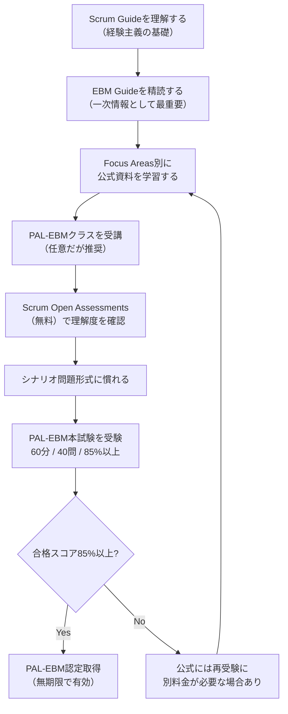

**参考ソース**
- https://www.scrum.org/assessments/professional-agile-leadership-evidence-based-management-certification
- https://www.scrum.org/resources/blog/how-pass-professional-agile-leadership-evidence-based-management-pal-ebm-assessment

---

## 第2章：出題範囲（Focus Areas）の全体像

PAL-EBMの出題範囲は、Scrum.orgが定義する「Professional Scrum Competencies（プロフェッショナル・スクラム・コンピテンシー）」モデルの中から、EBMに関連するFocus Areaと、コンピテンシーモデルには明示されていない追加トピック（Additional Topics）から構成されます。

### 2.1 出題範囲マップ

| コンピテンシー領域 | Focus Area | 概要 |
|---|---|---|
| Understanding and Applying the Scrum Framework（スクラムフレームワークの理解と適用） | Empiricism（経験主義） | なぜ・いつ経験主義が必要かを説明できる |
| Managing Products with Agility（アジリティをもったプロダクトマネジメント） | Product Value（プロダクトバリュー） | プロダクトが提供する価値を評価する方法 |
| 同上 | Business Strategy（ビジネス戦略） | Unrealized Valueの概念を機会追求に応用する |
| 同上 | Stakeholders & Customers（ステークホルダーと顧客） | Current Value、Unrealized Valueをステークホルダー・顧客管理に応用する |
| Evolving the Agile Organization（アジャイル組織への進化） | Portfolio Planning（ポートフォリオプランニング） | リーン・アジャイル原則をビジネス便益最大化の投資に適用する |
| 同上 | Evidence-Based Management™ | EBMフレームワークの概念理解 |
| Additional Topics（コンピテンシーモデル外の追加トピック） | Forming & Evaluating Hypotheses（仮説の形成と検証） | 短く焦点を絞った実験を通じて望む成果に近づく |
| 同上 | Setting, Inspecting & Adapting Goals（目標の設定・検査・適応） | 複雑な世界で経験主義を使い目標に向かって進む方法 |

### 2.2 出題範囲の構造図

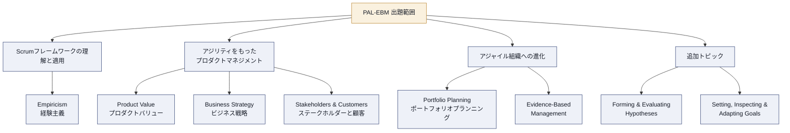

> **ベストプラクティス**：試験対策では「どのFocus Areaの、どの概念が問われているか」をまず特定する癖をつけると、選択肢の絞り込みが速くなります。特にScrumシナリオの選択肢が複数正解に見える場合、「これはCurrent Valueの話かUnrealized Valueの話か」「これはT2MかA2Iか」という軸で切り分けると精度が上がります。

**参考ソース**
- https://www.scrum.org/assessments/professional-agile-leadership-evidence-based-management-certification
- https://www.scrum.org/resources/suggested-resources-professional-agile-leadershiptm-evidence-based-management
- https://www.scrum.org/professional-scrum-competencies

---

## 第3章：経験主義（Empiricism）― なぜ、いつ必要か

### 3.1 経験主義の3本柱

Scrum GuideおよびEBM Guideが共通して基盤とするのが「経験主義（Empiricism）」です。経験主義とは、知識は経験から生まれ、意思決定は観察された事実（evidence）に基づくべきという考え方です。Scrumはこの経験主義を支える3本柱の上に成り立っています。

| 柱 | 意味 | EBMにおける位置づけ |
|---|---|---|
| Transparency（透明性） | プロセスと成果物が、それを見る人全員に見える形で共有されていること | KVAの測定結果を関係者全員に公開することが前提になる |
| Inspection（検査） | 進捗や成果物を頻繁かつ注意深く検査し、望ましくない差異を検出すること | Sprint ReviewなどでKVAの測定値を検査する |
| Adaptation（適応） | 検査の結果、プロセスや成果物が許容範囲外だと判断された場合に速やかに調整すること | 測定結果に基づき戦略・バックログ・投資配分を調整する |

### 3.2 なぜ「複雑な問題」に経験主義が必要なのか

ソフトウェアプロダクト開発や組織変革は「複雑（complex）」な問題領域に属することが多く、事前に全ての要件・結果を正確に予測することができません。これに対し、伝統的なマネジメント手法の多くは「定義的（defined）プロセス制御」、つまり「決められた通りに実行すれば決められた結果が出る」という前提に立っています。

| アプローチ | 前提 | 適した問題領域 | リスク |
|---|---|---|---|
| 定義的プロセス制御（伝統的マネジメント） | インプットとプロセスが同じならアウトプットも同じになる | 単純（simple）〜煩雑（complicated）な問題 | 複雑な問題に適用すると予測が外れやすい |
| 経験主義的プロセス制御（Scrum / EBM） | 結果は不確実なので、頻繁な検査と適応で軌道修正する | 複雑（complex）な問題 | 短いサイクルでの検査・適応の規律が必要 |

### 3.3 検査と適応のサイクル

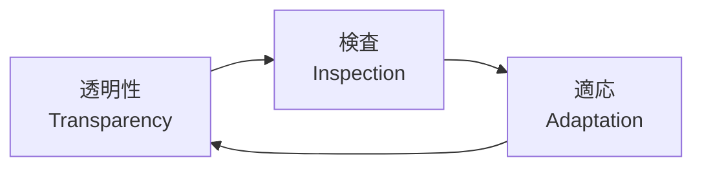

> **ベストプラクティス**
> - 測定指標（メトリクス）は必ず「誰が見ても同じ意味に解釈できる」形で公開する（透明性の担保）。
> - 検査の頻度は、変化のスピードと不確実性の高さに応じて設計する。Sprint Reviewはその代表的なイベントの一つ。
> - 「適応」を行わない検査は意味がない。検査結果が許容範囲外だった場合の意思決定プロセスをあらかじめ決めておく。

**参考ソース**
- https://www.scrum.org/resources/scrum-guide（Scrum Guide 経験主義の記述）
- https://www.scrum.org/resources/suggested-resources-professional-agile-leadershiptm-evidence-based-management

---

## 第4章：Evidence-Based Management™（EBM）とは何か

### 4.1 定義と目的

Evidence-Based Management™（EBM）は、Ken SchwaberとScrum.orgが開発したフレームワークで、正式名称は **「The Evidence-Based Management Guide: Improving Value Delivery Under Conditions of Uncertainty」** です。組織が不確実性の高い状況下でプロダクト提供から得られる価値を測定・管理・向上させるための経験主義的アプローチを提供します。

EBMの目的は、意思決定を「勘」や「権威」ではなく「観察可能な証拠（evidence）」に基づかせることで、リスクを低減し、戦略目標に向けたアジリティを高めることです。

### 4.2 EBMの基本サイクル

EBMは「目標を設定する → 測定する → 実験する → 学習し改善する」というサイクルを繰り返します。これは経験主義の3本柱（透明性・検査・適応）を組織レベルの価値提供に応用したものです。

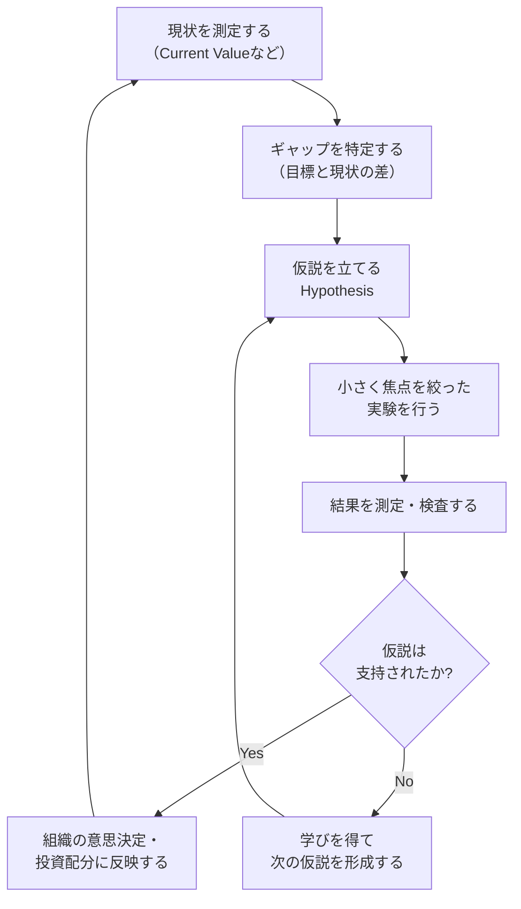

### 4.3 EBMが解決しようとする課題

| 課題 | EBMによるアプローチ |
|---|---|
| 「忙しく働いているのに価値が出ているか分からない」 | アウトプット指標ではなくアウトカム指標（4つのKVA）で価値を可視化する |
| 「大規模な投資判断が勘や政治力で決まる」 | 小さな実験と測定結果というevidenceに基づいて意思決定する |
| 「イノベーションが停滞している」 | Ability to Innovate（A2I）を明示的に測定・改善対象にする |
| 「市場機会を逃している」 | Unrealized Value（UV）として機会のギャップを可視化する |

> **ベストプラクティス**
> - EBMは「特定の指標セットを導入すること」がゴールではない。組織の戦略目標に紐づく、その組織固有の測定指標を見つけることが本質。
> - 測定すること自体を目的化しない。「何を改善したいのか」を先に定義し、そのための指標を選ぶ順序を守る。
> - EBM Guideの最新版では具体的な指標例は「付録（Appendix）の参考例」という位置づけであり、組織はそれをそのまま採用するのではなく自組織のコンテキストに合わせて選定することが推奨されている。

**参考ソース**
- https://www.scrum.org/resources/evidence-based-management（EBM Guideダウンロードページ）
- https://www.infoq.com/articles/evidence-based-management-guide-updated
- https://www.scrum.org/resources/blog/3-questions-consider-when-getting-started-evidence-based-management-ebm

---

## 第5章：4つの主要価値領域（Key Value Areas, KVA）

PAL-EBM試験における最重要トピックです。EBMは価値を4つの「主要価値領域（Key Value Areas, KVA）」に分解して捉えます。2つは「市場に向き合う価値（Market Value）」、残り2つは「価値を提供する組織能力（Ability to Deliver Value）」に関するものです。

### 5.1 全体マップ

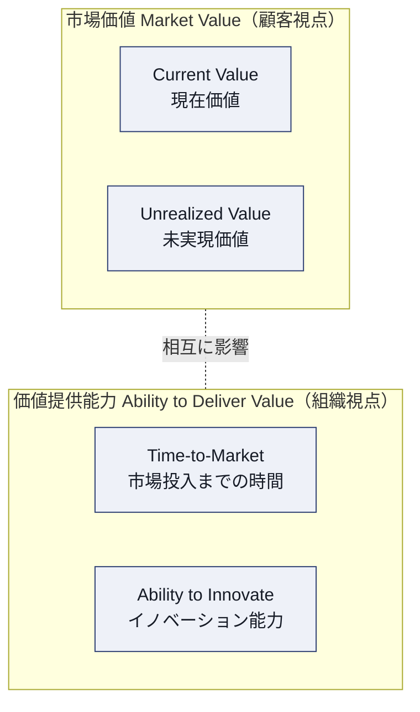

### 5.2 各KVAの定義と問いかけ

| KVA | 問いかけ | 定義 | 分類 |
|---|---|---|---|
| Current Value（CV） | 「今、顧客に届けている価値は何か？」 | プロダクトが現時点で顧客・利用者に提供している価値の大きさ | 市場価値 |
| Unrealized Value（UV） | 「まだ捉えられていない価値・機会はどれだけあるか？」 | すべての潜在顧客・利用者のニーズを満たした場合に実現しうる価値と、現状とのギャップ | 市場価値 |
| Time-to-Market（T2M） | 「新しい価値をどれだけ速く届けられるか？」 | 組織が新しい機能・サービス・プロダクトを届け、そこから学習するまでの速さ・応答性 | 組織能力 |
| Ability to Innovate（A2I） | 「新しい価値を生み出す力はどれだけあるか？」 | 組織が新しい能力を効果的に届け続けられるかどうかの実効性（技術的負債や運用上のムダに影響を受ける） | 組織能力 |

### 5.3 各KVAの詳細とベストプラクティス

#### Current Value（CV）

- 現在プロダクトが提供している価値のスナップショット。顧客満足度、利用状況（テレメトリデータ）、収益指標などから構成されることが多い。
- **ベストプラクティス**：稼働率や機能数のような「アウトプット」ではなく、顧客が実際にどう使い、どう満足しているかという「アウトカム」ベースで測定する。

#### Unrealized Value（UV）

- 「今のプロダクトが全ての潜在顧客・全てのニーズを満たしたら、どれだけの価値を実現できるか」という理論上の上限と、現状とのギャップ。
- 新機能や新市場セグメント、新しいプロダクトラインの可能性を評価する際の拠り所になる。
- **ベストプラクティス**：UVは「絶対に正確に測れる数値」ではなく、意思決定の方向づけに使う指標として扱う。市場調査・顧客インタビュー・競合分析などの定性情報も組み合わせる。

#### Time-to-Market（T2M）

- 新しい価値を市場に届け、そこからフィードバック・学習を得るまでの速さ。サイクルタイム、リリース頻度などで測定されることが多い。
- **ベストプラクティス**：T2Mを短縮すること自体が目的化しないよう注意する。速く届けても学びを得られなければ意味がない。「届ける速さ」と「学ぶ速さ」をセットで捉える。

#### Ability to Innovate（A2I）

- 組織が新しい能力・機能を効果的に届け続けられる実効性。技術的負債、本番障害の傾向、運用上のムダなどに直接影響を受ける。
- **ベストプラクティス**：短期的なデリバリー速度を優先するあまり技術的負債を放置すると、中長期的にA2Iが低下する。EBMでは技術的負債の削減も価値提供能力への投資として扱う。

### 5.4 よくある誤解（試験の落とし穴）

| 誤解 | 正しい理解 |
|---|---|
| ベロシティ（Velocity）はEBMの価値指標である | ベロシティはチーム内部のキャパシティ計画のための相対指標であり、顧客価値・品質・ビジネス成果を測るものではない |
| KVAはどれか1つだけ改善すれば良い | 4つのKVAはトレードオフの関係にあることが多く、バランスを見ながら測定・改善する必要がある |
| EBM Guideが定める指標をそのまま使うべき | EBM Guide付録の指標例はあくまで「例」であり、組織固有のコンテキストに合わせて選定すべきもの |
| Unrealized Valueは正確に算出できる確定値である | UVは意思決定の方向性を示す推定値であり、仮説検証を通じて更新され続けるもの |

**参考ソース**
- https://www.scrum.org/resources/evidence-based-management
- https://www.scrum.org/resources/how-measure-value-evidence-based-management
- https://www.scrum.org/resources/blog/pitfalls-challenges-implementing-ebm
- https://www.thescrummaster.co.uk/docs/what-are-the-four-key-value-areas-kvas-in-ebm-and-what-do-they-represent/

---

## 第6章：プロダクトバリュー（Product Value）の評価方法

Focus Area「Managing Products with Agility」の一部で、プロダクトが提供する価値を評価する多様な方法を扱います。

### 6.1 アウトプット指標とアウトカム指標

| 種類 | 説明 | 例 | 落とし穴 |
|---|---|---|---|
| アウトプット指標（Output） | チームが「作った量・こなした量」を表す | ベロシティ、完了ストーリーポイント数、リリース回数 | 顧客価値と相関しない場合がある |
| アウトカム指標（Outcome） | 顧客・ビジネスに実際に起きた「変化」を表す | 顧客満足度、継続利用率、収益への貢献 | 測定に時間がかかる／因果関係の特定が難しい |

### 6.2 プロダクトバリューをKVAで捉える

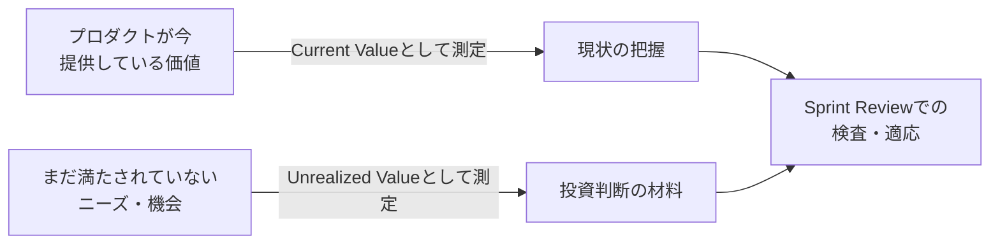

> **ベストプラクティス**
> - 単一の指標に依存せず、CV/UVの両面から「今」と「これから」をセットで評価する。
> - 顧客の声（定性データ）とテレメトリ（定量データ）を組み合わせることで、指標の解釈精度を高める。
> - Product Ownerは、プロダクトバックログの並び替え判断にCV/UVの測定結果を反映させる。

**参考ソース**
- https://www.scrum.org/resources/suggested-resources-professional-agile-leadershiptm-evidence-based-management
- https://www.scrum.org/resources/how-measure-value-evidence-based-management

---

## 第7章：ビジネス戦略とUnrealized Value

Focus Area「Business Strategy」では、Unrealized Valueの概念を「潜在的な機会の追求」にどう応用するかが問われます。

### 7.1 機会のギャップという考え方

顧客・利用者が「今体験していること」と「本来体験したいこと」の間にギャップがあるとき、そのギャップこそがUnrealized Valueであり、戦略的な投資機会の源泉になります。

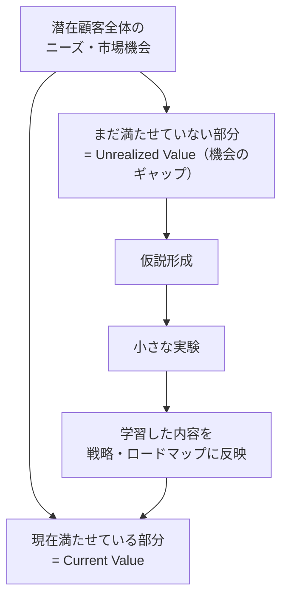

### 7.2 戦略判断への活かし方

| 状況 | 戦略的示唆 |
|---|---|
| CVは高いがUVも大きい | 既存顧客基盤を維持しつつ、新市場・新機能への投資余地がある |
| CVが低くUVが大きい | 現行プロダクトが市場ニーズとズレている可能性があり、方向転換（ピボット）の検討材料になる |
| CV・UVともに小さい | 市場自体が縮小している、またはプロダクトのポジショニングを見直す必要がある可能性 |

> **ベストプラクティス**
> - 戦略立案時にUVを「確定した機会」として扱わず、仮説として検証対象にする。
> - 市場セグメントごとにCV/UVを分解して評価すると、画一的な打ち手を避けられる。

**参考ソース**
- https://www.scrum.org/resources/suggested-resources-professional-agile-leadershiptm-evidence-based-management
- https://www.scrum.org/resources/evidence-based-management

---

## 第8章：ステークホルダーと顧客管理

Focus Area「Stakeholders & Customers」では、Current ValueとUnrealized Valueの概念をステークホルダー・顧客管理にどう応用するかが問われます。

### 8.1 Sprint Reviewを起点とするフィードバックループ

Scrumの中で、ステークホルダー・顧客と直接対話し、プロダクトの現在価値と将来価値についてのフィードバックを得る中心的なイベントがSprint Reviewです。EBMの観点では、Sprint ReviewはCV/UVの測定結果を検査し、次の適応（バックログの調整、戦略の見直し）につなげる重要な機会として位置づけられます。

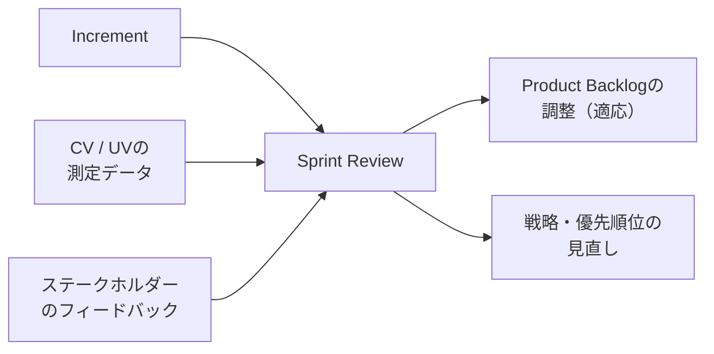

### 8.2 ステークホルダーマッピングの観点

| 観点 | 説明 |
|---|---|
| 影響力（Influence） | 意思決定にどれだけ影響を与えられるか |
| 関心（Interest） | プロダクトの成果にどれだけ関心を持っているか |
| 価値の受益者か | Current Value / Unrealized Valueの直接の受益者かどうか |

> **ベストプラクティス**
> - ステークホルダーごとに「どのKVAに関心があるか」を把握しておくと、対話の焦点を絞りやすい（例：経営層はUV・A2I、現場顧客はCVに関心が強い傾向）。
> - Sprint Reviewを単なる進捗報告の場にせず、測定結果に基づく意思決定の場として設計する。

**参考ソース**
- https://www.scrum.org/resources/suggested-resources-professional-agile-leadershiptm-evidence-based-management
- https://www.scrum.org/resources/scrum-guide（Scrum Guide: Sprint Reviewの目的）

---

## 第9章：ポートフォリオプランニング（Evolving the Agile Organization）

Focus Area「Portfolio Planning」では、リーン・アジャイル原則を「最大のビジネス便益を追求する投資判断」にどう適用するかが問われます。

### 9.1 伝統的な予算配分とリーン・アジャイルな投資の違い

| 観点 | 伝統的な年次予算配分 | リーン・アジャイルな投資 |
|---|---|---|
| 意思決定のタイミング | 年1回、まとめて決定 | 継続的に、小さな単位で決定 |
| 投資判断の根拠 | 事前の見積もり・事業計画 | 実験と測定によるevidence |
| リスクの取り方 | 大きな投資を一度に実行（ビッグバン） | 小さく投資し、学びながら追加投資するかを判断 |
| 変更への対応 | 計画変更のコストが高い | 短いサイクルで方向転換しやすい |

### 9.2 段階的投資（インクリメンタル・ファンディング）の考え方

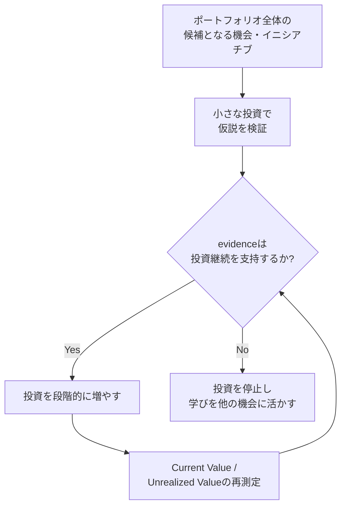

> **補足（EBM Guide本体には明記されない、実務でよく併用される考え方）**：ポートフォリオの優先順位付けにおいては、Donald G. Reinertsenが提唱する「Cost of Delay（遅延コスト）」のようなリーン・プロダクト開発フローの経済的概念が、PAL-EBMトレーニングや実務の場でしばしば補完的に紹介されます。これはScrum.orgの公式EBM Guideそのものの用語ではない点に注意してください。
>
> **ベストプラクティス**
> - 大きな投資判断を一度に行わず、小さく投資して測定し、evidenceに基づいて追加投資するかを判断する。
> - ポートフォリオレベルでもCV/UV/T2M/A2Iの4つの視点でイニシアチブを評価し、単一指標（例：ROIの見積もりのみ）に偏らないようにする。

**参考ソース**
- https://www.scrum.org/resources/suggested-resources-professional-agile-leadershiptm-evidence-based-management
- https://www.scrum.org/resources/evidence-based-management

---

## 第10章：仮説形成と検証（Forming & Evaluating Hypotheses）

Additional Topicsの1つ。短く焦点を絞った実験を行い、望むアウトカムに向けて前進するための考え方です。

### 10.1 仮説ステートメントの型

多くのアジャイル組織で使われる仮説記述の型は、概ね以下のような構造を取ります。

| 要素 | 内容 |
|---|---|
| We believe that（私たちは〜と信じている） | 実施しようとしている施策 |
| will result in（〜という結果をもたらす） | 期待するアウトカム |
| We will know this is true when（これが真であると分かるのは） | 観測可能な測定指標・シグナル |

### 10.2 仮説駆動のループ

小さな実験を通じて学び、次のアクションにつなげるサイクルは、Eric Riesが提唱した「Build-Measure-Learn」ループなど、リーンスタートアップの実務でも広く使われている考え方と親和性があります（EBM Guide自体が定義する専用の図ではなく、業界で広く参照される補完的フレームワークです）。

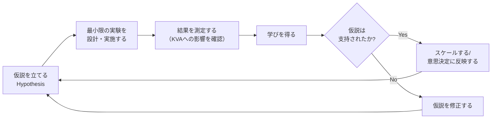

### 10.3 良い実験設計のチェックポイント

| チェック項目 | 説明 |
|---|---|
| スコープは十分小さいか | 学びを得るまでの時間とコストを最小化できているか |
| 測定可能な指標が定義されているか | 「成功／失敗」を判断できる具体的なシグナルがあるか |
| 撤退基準（何をもって実験を止めるか）が事前に決まっているか | サンクコストに引きずられず判断できるか |
| KVAとの紐付けが明確か | 実験結果がどのKVAに影響するのかが説明できるか |

> **ベストプラクティス**
> - 実験は「証明すること」ではなく「学ぶこと」が目的であると組織内で共通認識を持つ。
> - 失敗した実験も評価対象にする文化を作る（懲罰的な評価をしない）。
> - 1つの実験に複数の変数を混在させない。何が結果に影響したのかを特定できなくなる。

**参考ソース**
- https://www.scrum.org/resources/suggested-resources-professional-agile-leadershiptm-evidence-based-management
- https://www.scrum.org/resources/evidence-based-management

---

## 第11章：目標の設定・検査・適応（Setting, Inspecting & Adapting Goals）

Additional Topicsのもう1つの柱。複雑な世界で、経験主義を用いてどのように目標に向かって進むかを扱います。

### 11.1 Scrumにおける目標の階層

Scrum Guide（2020年版）では、組織のビジョンからSprint Goalに至るまで、目標が階層的につながっていることが強調されています。

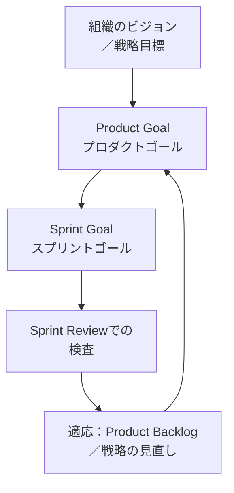

### 11.2 目標を「良いもの」にする観点

| 観点 | 説明 |
|---|---|
| 測定可能性 | 到達したかどうかを検査できる形になっているか |
| 経験主義との整合 | 固定的な計画ではなく、学びに応じて調整できる余地があるか |
| KVAとの接続 | 目標が最終的にどのKVA（顧客価値・組織能力）に貢献するか説明できるか |
| 短いサイクルでの検査 | 年単位ではなく、Sprintなど短い単位で進捗を検査できるか |

### 11.3 補完的な目標設定フレームワーク（OKR）について

OKR（Objectives and Key Results）は、GoogleやLinkedInなど多くの企業で採用されている目標設定フレームワークで、ScrumのProduct Goal／Sprint Goalの階層と組み合わせて使われることがあります。ただし、OKRはScrum GuideやEBM Guideが定義する公式要素ではなく、実務で広く使われている補完的な手法として理解しておくとよいでしょう。

> **ベストプラクティス**
> - 目標は上位（組織戦略）から下位（Sprint Goal）まで、一直線に「なぜこの作業をしているのか」を説明できるようにする。
> - 目標の検査サイクルを短くし、Sprint Reviewや定期的なレトロスペクティブで実際の測定結果と突き合わせる。
> - 「目標を達成すること」自体を目的化せず、目標達成が最終的にどのKVAの改善につながるかを常に問い直す。

**参考ソース**
- https://www.scrum.org/resources/suggested-resources-professional-agile-leadershiptm-evidence-based-management
- https://www.scrum.org/resources/scrum-guide（Scrum Guide 2020: Product Goal / Sprint Goalの定義）
- https://www.infoq.com/articles/agile-goals-okr/（OKRとアジャイル目標設定に関する補足情報）

---

## 第12章：試験対策：シナリオ問題の解き方

PAL-EBMは単純な用語暗記ではなく、シナリオに対してどう考え・解釈するかを問う設問が中心です。「あなたの経験に基づいてEBMの原則にどう沿って対応するか」を問う形式である点が公式に明記されています。

### 12.1 出題形式の特徴

| 形式 | 特徴 |
|---|---|
| Multiple Choice（単一選択） | 1つの正解を選ぶ標準的な形式 |
| Multiple Answer（複数選択） | 複数の正解をすべて選ぶ必要がある形式。部分点がない場合が多いため注意 |
| True/False | 記述の正誤を判断する形式 |

### 12.2 よくある「落とし穴」パターン

| パターン | 対処法 |
|---|---|
| もっともらしいがEBMの公式定義とズレた選択肢が混じっている | 4つのKVAの正式な定義（本ガイド第5章）に立ち返って照合する |
| アウトプット指標をアウトカム指標として扱う選択肢 | 「顧客・ビジネスにとっての変化を表しているか」を基準に判別する |
| 「唯一絶対の正解プロセス」を示唆する選択肢 | Scrum/EBMは経験主義に基づくため、文脈依存であることを前提に、最も原則に沿った選択肢を選ぶ |
| 特定の指標（例：ベロシティ）を価値指標として扱う選択肢 | ベロシティは内部の相対的キャパシティ指標であり、顧客価値・ビジネス成果の指標ではないことを思い出す |

### 12.3 学習の優先順位（頻出度の目安）

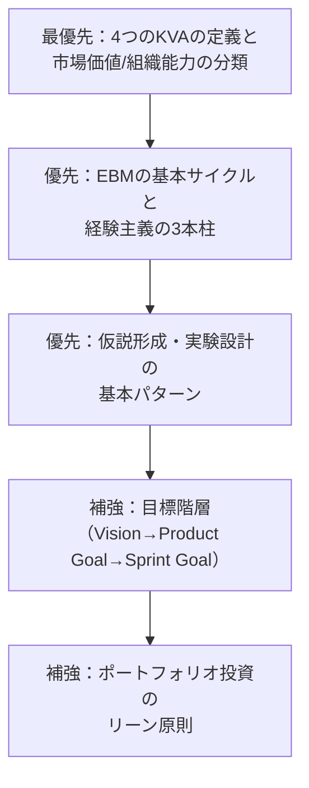

> **ベストプラクティス**
> - 公式のScrum Open Assessment（無料）で、Scrumフレームワーク自体の理解度をまず確認する。
> - EBM Guideの原文を最低1回は通読し、4つのKVAの定義を「自分の言葉で」説明できる状態にする。
> - 過去に受験した人のブログ記事等は参考程度に留め、非公式な問題集の内容を暗記することに時間を使いすぎない（設問プールは非公開かつ変動する）。

**参考ソース**
- https://www.scrum.org/resources/blog/how-pass-professional-agile-leadership-evidence-based-management-pal-ebm-assessment
- https://www.scrum.org/assessments/professional-agile-leadership-evidence-based-management-certification

---

## 第13章：学習ステップ（初学者向けロードマップ）

初めてEBM・PAL-EBMに触れる方向けの、ステップバイステップの学習の進め方です。

| ステップ | やること | 目的 |
|---|---|---|
| Step 1 | Scrum Guide（公式・無料）を通読する | 経験主義、Scrumの役割・イベント・作成物の基礎を固める |
| Step 2 | Scrum Open AssessmentやPSM関連の無料アセスメントで基礎理解を確認する | 前提知識の抜け漏れを可視化する |
| Step 3 | EBM Guide（公式・無料）を通読する | 4つのKVAの定義、EBMの基本サイクルを理解する |
| Step 4 | 本ガイドの第5章〜第11章を用いて、各Focus Areaごとに「なぜそれが重要か」を自分の言葉でまとめる | 単なる暗記ではなく応用可能な理解にする |
| Step 5 | 自分の実務・過去のプロジェクトを題材に、CV/UV/T2M/A2Iを当てはめてみる | シナリオ問題への対応力を養う |
| Step 6 | 可能であればPAL-EBM公式クラスを受講する | 実務家との議論を通じて理解を深め、受験パスコードを取得する |
| Step 7 | 本試験を受験する（60分・40問・85%以上） | 認定取得 |

> **ベストプラクティス**：EBMは「知識」よりも「組織の中でどう適用するか」を問う色合いが強い資格です。学習の各段階で、必ず「これは自分の組織・チームだったらどう当てはまるか」を自問しながら進めると定着が早まります。

**参考ソース**
- https://www.scrum.org/assessments/professional-agile-leadership-evidence-based-management-certification
- https://www.scrum.org/resources/evidence-based-management

---

## 第14章：用語集（Glossary）

| 用語 | 説明 |
|---|---|
| Empiricism（経験主義） | 知識は経験から生まれ、意思決定は観察された事実に基づくべきとする考え方。透明性・検査・適応の3本柱で構成される |
| Evidence-Based Management™（EBM） | Ken SchwaberとScrum.orgが開発した、価値提供を測定・管理・向上させるための経験主義的フレームワーク |
| Key Value Area（KVA） | EBMが価値を捉えるための4つの領域（CV, UV, T2M, A2I）の総称 |
| Current Value（CV） | プロダクトが現時点で提供している価値 |
| Unrealized Value（UV） | 潜在顧客の全ニーズを満たした場合に実現しうる価値と現状のギャップ |
| Time-to-Market（T2M） | 新しい価値を届け、フィードバックを得るまでの速さ・応答性 |
| Ability to Innovate（A2I） | 組織が新しい能力を効果的に届け続ける実効性 |
| Hypothesis-Driven Development | 施策を仮説として扱い、実験と測定を通じて検証しながら進める開発アプローチ |
| Product Goal | プロダクトが向かう将来の状態を表す、Product Backlogの長期的な目的地 |
| Sprint Goal | そのSprintで達成したい単一の目的 |
| Portfolio Planning | 複数のプロダクト・イニシアチブに対する投資配分の意思決定プロセス |
| OKR（Objectives and Key Results） | 目標（Objective）と主要な結果（Key Results）で構成される、実務で広く使われる目標設定フレームワーク（Scrum公式要素ではない） |

---

## 第15章：参考文献・ソースURL一覧

以下は本ガイド作成にあたって参照した一次情報・公式情報源です。学習の際は、可能な限りこれらの一次情報にあたることを強く推奨します。

### Scrum.org 公式情報

- PAL-EBM 公式アセスメントページ
  https://www.scrum.org/assessments/professional-agile-leadership-evidence-based-management-certification
- PAL-EBM 学習用の推奨リソース一覧（Focus Areas詳細）
  https://www.scrum.org/resources/suggested-resources-professional-agile-leadershiptm-evidence-based-management
- Evidence-Based Management™ Guide（ダウンロードページ）
  https://www.scrum.org/resources/evidence-based-management
- How to Measure Value with Evidence-Based Management（ワークショップ資料）
  https://www.scrum.org/resources/how-measure-value-evidence-based-management
- 3 Questions to Consider When Getting Started with EBM（公式ブログ）
  https://www.scrum.org/resources/blog/3-questions-consider-when-getting-started-evidence-based-management-ebm
- Pitfalls (challenges) of implementing EBM（公式ブログ）
  https://www.scrum.org/resources/blog/pitfalls-challenges-implementing-ebm
- How To Pass The PAL-EBM Assessment（公式ブログ・受験対策）
  https://www.scrum.org/resources/blog/how-pass-professional-agile-leadership-evidence-based-management-pal-ebm-assessment
- Professional Scrum Competencies（コンピテンシーモデル）
  https://www.scrum.org/professional-scrum-competencies
- Scrum Guide（経験主義・Scrumの基礎）
  https://www.scrum.org/resources/scrum-guide

### 補足・解説記事（二次情報、理解の補強用）

- InfoQ「Evidence-Based Management Guide - Updated」
  https://www.infoq.com/articles/evidence-based-management-guide-updated
- InfoQ「Evidence Based Management with scrum.org」（Podcast）
  https://www.infoq.com/podcasts/evidence-based-management
- InfoQ「Agile Goal Setting with OKR」（OKRとアジャイル目標設定の補足）
  https://www.infoq.com/articles/agile-goals-okr/
- The Scrum Master「What are the four Key Value Areas (KVAs) in EBM, and what do they represent?」
  https://www.thescrummaster.co.uk/docs/what-are-the-four-key-value-areas-kvas-in-ebm-and-what-do-they-represent/

> **注記**：二次情報（ブログ・スクール等）はあくまで理解を助けるための補足資料です。試験対策における一次情報は、常にScrum.org公式のEBM Guideとアセスメントページを優先してください。EBM Guideは版によって内容が更新される（例：Unrealized ValueがKVAとして追加された経緯があります）ため、学習時は必ず最新版を参照するようにしてください。
