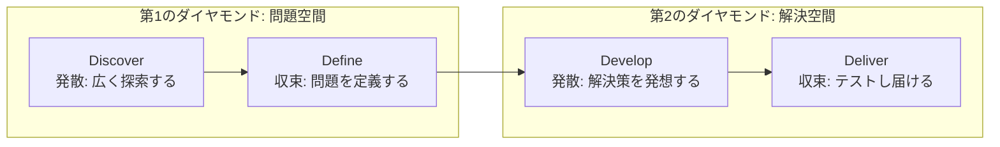
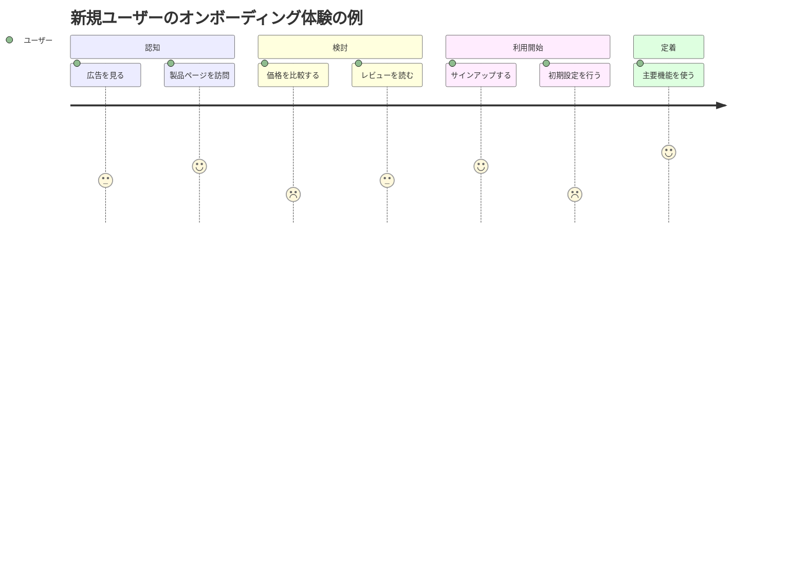
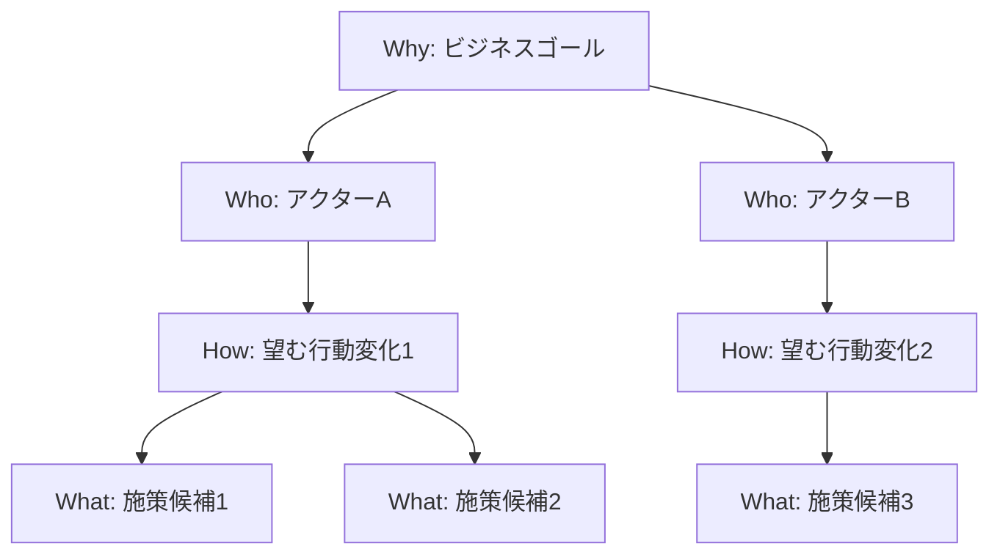
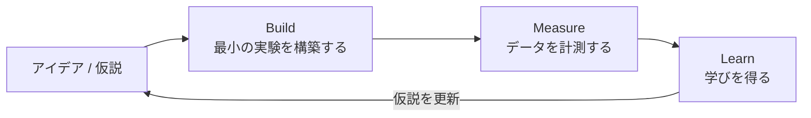
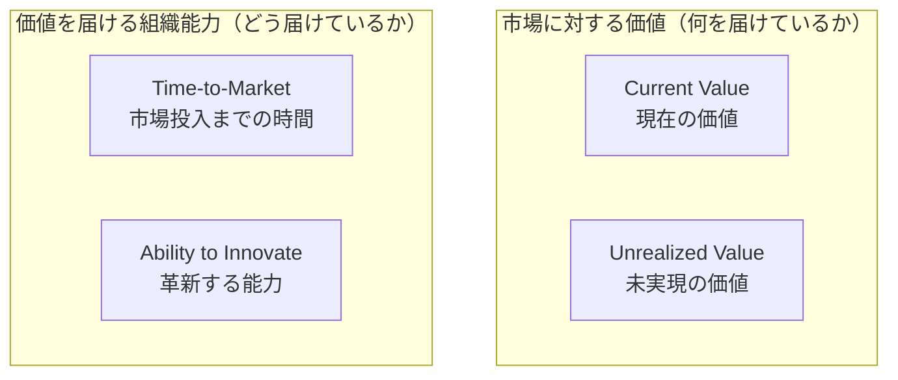
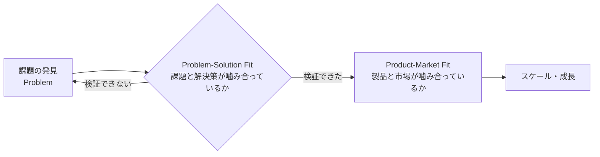
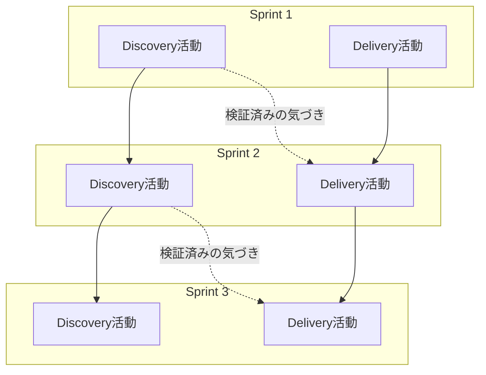

# Professional Product Discovery and Validation™（PPDV）認定試験 学習ガイド

> 初学者向け・ステップバイステップ解説版
> 対象試験: [Professional Product Discovery and Validation™ Certification](https://www.scrum.org/assessments/professional-product-discovery-and-validation-certification)（Scrum.org）

---

## このガイドの読み方

PPDV認定試験は、プロダクトの「発見（Discovery）」と「検証（Validation）」に関する知識と、それをいつ・どのように使うべきかの判断力を問う試験です。単なる用語暗記ではなく、「この状況ではどの手法を選ぶべきか」を問われる問題が中心になります。

このガイドは以下の構成で進みます。

1. 第1章: 試験の全体像（形式・対象者・学習目標）
2. 第2章: PPDVの土台となる考え方「ダブルダイヤモンド」
3. 第3章: 問題 vs ソリューション（課題の定式化）
4. 第4章: Discovery（発見）技法群
5. 第5章: Validation（検証）技法群
6. 第6章: Scrumチームでの実践への統合
7. 第7章: よくある誤解・アンチパターン
8. 第8章: 試験対策の進め方
9. 参考文献・ソース一覧

各章の末尾に **ベストプラクティス** と **📚 ソース** を明記しているので、根拠を辿りながら学習してください。

---

## 第1章: PPDV認定試験の概要

### 1.1 PPDVとは何か

PPDV（Professional Product Discovery and Validation）は、Scrum.orgが提供する認定資格です。プロダクトオーナーやプロダクトマネージャー、ビジネスアナリスト、プロダクトチームのメンバーが、ユーザーや顧客から学びながら「市場に届けるべき正しいプロダクト機能」を見極める力を証明するための試験です。

Scrum.orgの公式ページでは、この認定は「発見・検証技法をどう使うか、いつ使うかについての知識」を検証し、さらに「発見・検証スキルを適用して価値創出を高める能力」もテストすると説明されています。受講は必須ではありませんが、公式トレーニングクラスの受講が強く推奨されています。

### 1.2 試験の基本情報

| 項目 | 内容 |
|---|---|
| 出題数 | 20問 |
| 制限時間 | 30分 |
| 合格ライン | 85%以上 |
| 資格の有効期限 | 生涯有効（失効なし） |
| 受験の前提条件 | 明確な必須要件はないが、Professional Scrum Product Owner I（PSPO I）や同等のトレーニング受講が推奨される |
| フィードバック形式 | 正誤の詳細は開示されないが、「Professional Scrum Competencies（プロフェッショナル・スクラム・コンピテンシー）」の観点別に成績のブレークダウンが提供される |
| 受験資格の入手方法 | 公式PPDVトレーニング受講者には無料の受験権が付与される。受講なしでも購入して受験可能 |

### 1.3 対象者

この試験・研修は主に以下の役割の人を対象に設計されています。

- プロダクトオーナー（Product Owner）
- プロダクトマネージャー
- ビジネスアナリスト
- 発見・検証プロセスに関わるプロダクトチーム全体

新規プロダクト開発（グリーンフィールド）だけでなく、既存プロダクトの機能拡張・改善にも適用できる内容として設計されています。

### 1.4 公式の学習目標（Course Learning Objectives）

Scrum.org公式コースページに掲載されている学習目標は次の4点です。

1. ユーザーのニーズ・欲求に関する仮説を検証する実験を意図的に設計することで、ユーザー価値の創出を高める
2. 検証によって得られたエビデンスに基づいてのみ投資判断を行うことで、無駄を減らしROIを改善する
3. 意見ではなくデータを用いて主要なステークホルダーと関わることで、組織のコラボレーションと連携を改善する
4. 「実行すべきタスク」ではなく「解決すべき問題」として仕事を再定義することで、創造性を引き出す

この4つの目標は、そのまま試験で問われる評価軸（コンピテンシー）の土台になっていると考えてよいでしょう。

### ✅ ベストプラクティス（第1章）

- 「手法を知っている」ことと「状況に応じて適切な手法を選べる」ことは別スキルと捉え、各技法を学ぶ際は必ず **「どんな状況でこれを使うか / 使わないか」** をセットで整理する
- 前提知識としてProfessional Scrum（Scrumの基本イベント・作成物・価値基準）とProduct Ownership（PSPO Iレベル）を先に固めておくと、Discovery/Validationの技法がスムーズに理解できる
- 学習中は「タスクではなく問題を解く」という学習目標4を常に意識し、機能一覧ではなく「解くべき課題」を起点に技法を整理する

### 📚 ソース（第1章）

- [Professional Product Discovery and Validation™ Certification（Scrum.org 公式試験ページ）](https://www.scrum.org/assessments/professional-product-discovery-and-validation-certification)
- [Professional Product Discovery and Validation™ Training（Scrum.org 公式コースページ・学習目標記載）](https://www.scrum.org/courses/professional-product-discovery-and-validation-training)
- [Professional Product Discovery and Validation™（Credly バッジ説明）](https://www.credly.com/org/scrum-org/badge/professional-product-discovery-and-validation)
- [PPDV認定・試験形式（20問/30分/85%/生涯有効）の記載（ScrumDojo.cz、Scrum.org Professional Training Networkパートナー）](https://scrumdojo.cz/en/courses/professional-product-discovery-and-validation)

---

## 第2章: PPDVの土台となる考え方 — ダブルダイヤモンド

### 2.1 ダブルダイヤモンドとは

PPDVのコース構成は、イギリスのDesign Councilが2004〜2005年にかけて11のグローバル企業（LEGO、Sony、Microsoftなど）の実際のデザインプロセスを調査してまとめた **ダブルダイヤモンドモデル** に沿っています。このモデルは「発散（Divergent Thinking）」と「収束（Convergent Thinking）」を2回繰り返す構造を持ち、4つのフェーズで構成されます。

- **Discover（発見）**: 課題領域を幅広く探索する（発散）
- **Define（定義）**: 探索した情報から解くべき問題を絞り込む（収束）
- **Develop（開発）**: 解決策の選択肢を幅広く発想・試作する（発散）
- **Deliver（提供）**: 有望な解決策に絞り込み、テスト・実装・提供する（収束）

最初のダイヤモンドは「正しい問題」を見つけるための問題空間、2つ目のダイヤモンドは「正しい解決策」を見つけるための解決空間を表します。

PPDVコースの構成（ScrumDojo.czの公式パートナーによる解説）は、このダブルダイヤモンドの4フェーズすべてを、顧客ニーズの探索から優先順位付け、実験の定式化、検証までひと通り扱う設計になっています。

### 2.2 Discovery（発見）とは何か

Scrum.org CEOのDave Westは公式ブログで、Product Discoveryを次のように定義しています。

> プロダクトディスカバリーとは、解く価値のある問題と、作る価値のある解決策を見つけるために不確実性を減らしていく、エビデンスに基づいた（evidence-informed）プロセスであり、非線形な一連の活動として、機能横断チームによって行われるものである。

この定義には3つの重要な要素があります。

1. **エビデンス・インフォームド（evidence-informed）であり、エビデンス・ベースド（evidence-based）ではない** — エビデンスは意思決定の材料にはなるが、最終的に決めるのは人であるという考え方
2. **活動は非線形** — 1980年代のウォーターフォール的な「理解フェーズ→実現フェーズ」という一直線の流れではなく、様々な活動が並行・反復しながらチームの理解を深めていく
3. **機能横断チームが担う** — 専門家が要件を調査して開発チームに引き渡す分業モデルではなく、デジタル時代には多様なスキルを持つチームが一体となって進める必要がある

### ✅ ベストプラクティス（第2章）

- Discoveryを「開発の前工程」として切り離さず、ダブルダイヤモンドの4フェーズを反復的に回す発想を持つ
- 「エビデンスに基づいて決める」のではなく「エビデンスを判断材料の一つとして人が決める」というスタンスを意識し、データ至上主義に陥らない
- Discovery活動を特定の役割（POだけ等）に閉じ込めず、機能横断チーム全体の共同責任として設計する

### 📚 ソース（第2章）

- [Framework for Innovation: Design Council's evolved Double Diamond（Design Council 公式）](https://www.designcouncil.org.uk/resources/framework-for-innovation/)
- [Product Discovery and Validation in Scrum（Dave West, Scrum.org 公式ブログ）](https://www.scrum.org/resources/blog/product-discovery-and-validation-scrum)
- [ダブルダイヤモンドを用いたPPDVコース構成の解説（ScrumDojo.cz）](https://scrumdojo.cz/en/courses/professional-product-discovery-and-validation)

---

## 第3章: 問題 vs ソリューション（Problem vs Solution）

ダブルダイヤモンドの最初の「問題空間」に対応する領域です。多くのプロダクトチームは、ユーザーの本当の課題を確認する前に解決策（機能）の話を始めてしまいます。PPDVはまずこの順序を正すところから始まります。

### 3.1 問題・ニーズの定式化

「なぜこの機能が必要か」を、特定のソリューションを前提とせずに言語化する練習です。ソリューションから入ると、チームは代替案を検討する視野を失い、その機能に固執してしまいます。「問題を解く」というフレームに立ち戻ることで、チームの創造性とオーナーシップを引き出せます（第1章で見た公式学習目標4に対応）。

### 3.2 ビジネス問題ステートメント（Business Problem Statement）

課題を関係者間で共有可能な形に整理するためのテンプレートです。一般的には以下の要素を含みます。

| 項目 | 記述内容の例 |
|---|---|
| 現状（Current State） | 今、何が起きているか。誰が、どのような状況に置かれているか |
| 望ましい状態（Desired State） | 本来どうあるべきか。理想の状態は何か |
| ギャップの影響（Impact / Gap） | 現状と理想の差が放置された場合、誰に・どんな悪影響があるか |
| 影響を受ける対象（Who is affected） | どのユーザー・顧客セグメントが対象か |

このテンプレートを埋めることで、チームは「なぜ取り組む価値があるのか」を、特定の解決策を仮定せずに説明できるようになります。

### 3.3 感情・印象から測定可能な事実へ

ステークホルダーの意見や個人の印象（「〜だと思う」「〜な気がする」）だけで優先順位を決めるのではなく、それらを検証可能な仮説に変換し、データや観察に基づく事実へ置き換えていくプロセスです。第5章で扱う仮説・実験の技法は、まさにこの「印象→事実」への変換を支える道具になります。

### ✅ ベストプラクティス（第3章）

- 要求（Requirement）や機能アイデアが出てきたら、まず「これはどんな問題を解決しようとしているのか」を1文で書き出す習慣をつける
- ビジネス問題ステートメントは「現状」「理想」「影響」「対象者」の4点を関係者全員で合意してから次のフェーズ（Discovery）に進む
- ステークホルダーの意見は「仮説」として扱い、「事実」として扱わない。意見は検証対象のインプットであり、結論ではない

### 📚 ソース（第3章）

- [PPDVコース公式トピック一覧（Problem vs Solution章の構成、ScrumDojo.cz）](https://scrumdojo.cz/en/courses/professional-product-discovery-and-validation)
- [Professional Product Discovery and Validation™ Training（学習目標「タスクではなく問題として仕事を再定義する」、Scrum.org公式）](https://www.scrum.org/courses/professional-product-discovery-and-validation-training)

---

## 第4章: Discovery（発見）技法

ダブルダイヤモンドの「Discover→Define」に対応する技法群です。ユーザー・顧客の実像を把握し、取り組むべき課題を絞り込むための道具を扱います。

### 4.1 Proto Persona（プロトペルソナ）vs Persona（ペルソナ）

| 観点 | プロトペルソナ | ペルソナ |
|---|---|---|
| 情報源 | チーム内の仮説・経験・推測 | 実際のユーザーインタビューやリサーチデータ |
| 作成タイミング | Discoveryの初期段階、リサーチ着手前 | リサーチを行い、パターンを検証した後 |
| 目的 | チームの前提を可視化し、リサーチで確認すべき仮説を洗い出す | 検証済みのユーザー理解をチーム・組織で共有する |
| 精度・信頼度 | 低い（あくまで仮説） | 高い（エビデンスに基づく） |
| 更新の仕方 | リサーチ結果をもとに随時修正・破棄される前提 | 継続的なリサーチで裏付けを補強していく |

**ベストプラクティス**: プロトペルソナは「完成品」ではなく「検証すべき仮説の一覧」として扱う。プロトペルソナのまま意思決定の根拠にしてしまうことが、Discoveryにおける典型的な落とし穴。

### 4.2 Customer Journey Map vs User Story Map

| 観点 | Customer Journey Map | User Story Map |
|---|---|---|
| 焦点 | 顧客の体験・感情・行動の時系列変化 | プロダクトの機能・ユーザーストーリーの構造 |
| 視点 | 顧客視点（顧客が何を経験するか） | プロダクトチーム視点（何を作るか） |
| 主な用途 | ペインポイントや機会をDiscoveryで発見する | バックログを整理し、リリース計画を立てる（Delivery寄り） |
| 提唱者・出典 | サービスデザイン領域で発展した手法 | Jeff Patton（『User Story Mapping』） |

顧客ジャーニーマップの例をMermaidの`journey`図で示します（値は説明用の相対スコアです）。

**ベストプラクティス**: Customer Journey MapはDiscovery（課題発見）、User Story MapはDelivery（実装計画）という役割分担を意識し、両者を混同しない。ジャーニーマップで見つけたペインポイントを、ストーリーマップ上のどこに位置づけるかを紐づけると、発見から実装への橋渡しがしやすくなる。

### 4.3 Impact Map（インパクトマップ）

Impact Mappingは、Gojko Adzicが2012年に著書『Impact Mapping: Making a Big Impact with Software Products and Projects』で提唱した戦略立案技法です。ビジネスゴールと、それを実現するための手段との関係を可視化するマインドマップ型のツールで、次の4つの問いに沿って構造化されます。

- **Why（なぜ）**: 達成したいビジネスゴールは何か（マップの中心）
- **Who（誰が）**: そのゴールに影響を与えられるアクター（顧客、ユーザー、内部関係者など）は誰か
- **How（どのように）**: そのアクターにどのような行動変化（インパクト）を起こしてほしいか
- **What（何を）**: そのインパクトを引き起こすために、チームは何を提供・実装するか

**ベストプラクティス**: 「What（機能一覧）」から作り始めない。必ず「Why（ゴール）」を最初に固定し、Who→How→Whatの順に発想することで、機能が本当にゴールに貢献しているかを常に説明できる状態を保つ。

### 4.4 Empathy Map（エンパシーマップ）

Empathy Mapは、デザインコンサルティング会社XPLANEのDave Grayが考案し、2010年の書籍『Gamestorming』（Dave Gray, Sunni Brown, James Macanufo 著）で広く知られるようになったツールです。ユーザーへの理解を、次の4象限（拡張版では6区分）に整理します。

| 象限 | 内容 |
|---|---|
| Says（言う） | ユーザーが実際にインタビュー等で発言したこと |
| Thinks（思う） | 発言はしないが、心の中で考えていると推測されること |
| Does（行う） | ユーザーが実際に取る行動 |
| Feels（感じる） | ユーザーの感情状態 |

拡張版（Pains / Gains を追加した6区分）は、次章のValue Proposition Canvasの「Customer Profile」と対応関係にあります。

**ベストプラクティス**: Empathy Mapは実際のユーザーリサーチ（インタビュー・観察）の結果を整理するために使う。リサーチなしにチームの想像だけで埋めると、プロトペルソナと同様「未検証の仮説」に過ぎないことを忘れない。

### 4.5 Value Proposition Canvas（バリュー・プロポジション・キャンバス）

Alexander OsterwalderとYves Pigneurが2014年の著書『Value Proposition Design』で発表したツールで、Strategyzer社によって維持・提供されています。Business Model Canvasの「顧客セグメント」と「価値提案」の2ブロックを深掘りするための拡張ツールという位置づけです。

| サイド | 構成要素 | 説明 |
|---|---|---|
| Customer Profile（顧客プロファイル） | Customer Jobs | 顧客が片付けたい機能的・感情的・社会的な「ジョブ」 |
| | Pains（痛み） | ジョブを遂行する上での障害・リスク・不満 |
| | Gains（利得） | ジョブを遂行する上で顧客が期待する成果・メリット |
| Value Map（価値マップ） | Products & Services | 提供するプロダクト・サービス |
| | Pain Relievers | Painsをどう和らげるか |
| | Gain Creators | Gainsをどう生み出すか |

両サイドが噛み合っている状態を「フィット（Fit）」と呼び、これはいわゆる「Problem-Solution Fit」の考え方に対応します（第5.7節で詳述）。

**ベストプラクティス**: 1枚のキャンバスは必ず単一の顧客セグメントに絞って作成する。複数セグメントを1枚に混在させることと、記憶だけで（顧客インタビューなしで）埋めてしまうことが、最もよくある失敗パターンとされている。

### 4.6 Curve of Truth（Truth Curve / 真実の曲線）

Giff Constableが著書『Talking to Humans』で提唱した概念で、Jeff Gothelfらプロダクトコミュニティによって広く紹介されています。実験にかける労力（横軸: Effort / Fidelity）と、そこから得られる学びの信頼度（縦軸: Confidence / Truth）の関係を表す考え方です。

労力の低い実験から高い実験まで、代表的な手法を並べると次のような順序になります。

Curve of Truthの重要な示唆は、「労力をかけすぎても、かけなさすぎても失敗する」という点です。エビデンスに対して投資が過少だと根拠のないまま構築するリスクを負い、逆にエビデンスに対して投資が過大だと、学習の機会を逃したり分析麻痺（Analysis Paralysis）に陥ったりします。

**ベストプラクティス**: 検証したい仮説の「不確実性の高さ」と「間違っていた場合のコストの大きさ」に応じて、曲線上のどのレベルの実験を選ぶかを意図的に決める。確信度が低い段階でいきなり高コストな実験（実製品の構築など）に飛びつかない。

### 4.7 Jobs-to-be-Done（JTBD）によるセグメンテーション

Clayton Christensenが『イノベーションのジレンマ』などで発展させた理論で、「顧客は製品を買うのではなく、特定の“ジョブ（片付けたい用事）”を片付けるために製品を“雇用（hire）”する」という考え方です。有名な事例として、ファストフードチェーンのミルクシェイクの売上向上を検討した調査があります。従来の年齢・性別などのデモグラフィック属性ではなく、「朝の通勤中に手持ち無沙汰を紛らわせながら小腹を満たす」という“ジョブ”の観点で購買者を分析したところ、製品改善の方向性（より濃く、より長く楽しめるシェイクにする）が明確になったという事例です。

JTBDによるセグメンテーションは、年齢・性別・職業などの属性ではなく「片付けたいジョブが同じかどうか」で顧客をグルーピングする点が従来のセグメンテーションとの違いです。

**ベストプラクティス**: セグメンテーションの軸を「誰であるか（デモグラフィック）」ではなく「何を成し遂げたいか（ジョブ）」に置き換える。ユーザーインタビューでは「その状況で他に何を検討したか／しなかったか」を尋ねることで、真のジョブ（代替候補との比較軸）を掘り下げる。

### 📚 ソース（第4章）

- [Impact Mapping（Gojko Adzic 公式サイト）](https://gojko.net/books/impact-mapping/)
- [Impact Mapping 概説（Open Practice Library）](https://openpracticelibrary.com/practice/impact-mapping/)
- [The Empathy Map: A Human-Centered Tool（XPLANE 公式ブログ、考案の経緯）](https://xplane.com/the-empathy-map-a-human-centered-tool-for-understanding-how-your-audience-thinks/)
- [Value Proposition Canvas Book Summary（Strategyzer 公式）](https://www.strategyzer.com/library/value-proposition-design-book-summary)
- [The Truth Curve（Jeff Gothelf 公式ブログ、Giff Constable『Talking to Humans』の紹介）](https://jeffgothelf.com/blog/the-truth-curve/)
- [Jobs To Be Done / ミルクシェイクの事例（HBS Working Knowledge）](https://www.library.hbs.edu/working-knowledge/clay-christensens-milkshake-marketing)
- [User Story Mapping（Jeff Patton & Associates 公式）](https://www.jpattonassociates.com/story-mapping/)
- [PPDVコース公式トピック一覧（Discovery章の構成、ScrumDojo.cz）](https://scrumdojo.cz/en/courses/professional-product-discovery-and-validation)

---

## 第5章: Validation（検証）技法

ダブルダイヤモンドの「Develop→Deliver」に対応する技法群です。Discoveryで見えてきた仮説を、実験を通じて検証（または反証）し、投資判断につなげます。

### 5.1 仮説と実験の定式化

検証の出発点は、あいまいな期待を「反証可能な仮説」に変換することです。一般的な仮説ステートメントのフォーマットは次のような形を取ります。

> 私たちは、[特定の顧客セグメント]が[特定の行動]を取ると信じている。なぜなら[理由・提供価値]があるからだ。これが正しいことは、[測定可能な指標]が[しきい値]に達したときにわかる。

このフォーマットにより、「誰の」「どんな行動を」「なぜ」「どう測るか」の4点が明確になり、次に紹介するTest Cardにそのまま接続できます。

### 5.2 実験技法（Experimentation Techniques）の全体像

Build-Measure-Learnのループ（Eric Ries『The Lean Startup』）を小さく素早く回すことが検証の基本サイクルです。

代表的な実験手法は4.6節のCurve of Truthで整理した通り、インタビューからWizard of Ozまで労力順に並べられます。状況（不確実性の大きさ、失敗した場合のコスト）に応じて適切なレベルの実験を選択します。

### 5.3 Concierge MVP と Wizard of Oz

いずれもEric Riesの『The Lean Startup』で紹介された、Minimum Viable Product（MVP）の一種です。どちらも「まだ自動化されていない仕組みを、人手で肩代わりする」という共通点がありますが、決定的な違いは「手作業であることを顧客に開示するかどうか」です。

| 観点 | Concierge MVP（コンシェルジュMVP） | Wizard of Oz MVP |
|---|---|---|
| 顧客への開示 | 手作業であることを顧客に明示する | 自動化された製品であるかのように見せる（隠す） |
| 目的 | 一対一の手厚いサービスを通じて、需要そのものを検証する | 完成品としての体験・価値提案を検証する |
| 代表例 | Food on the Table（人手で顧客ごとに献立と買い物リストを作成） | Zappos（在庫を持たず、注文が入るたびに近隣店舗で靴を購入して発送） |
| リスク | 顧客体験がスケール後と異なる可能性がある | 隠していた事実が発覚した際に信頼を損なうリスクがある |

**ベストプラクティス**: どちらの手法も「本格的なシステムを作る前に、価値仮説そのものを検証する」ために使う。エンジニアリング投資を先送りしながら「本当に欲しがられているか」を確かめられる場合に適している。ただし、いつまでも手作業に頼り続けると、成長モデルなきまま小さな黒字事業に満足してしまうリスクがある点にも注意する。

### 5.4 Test Card + Learning Card（Strategyzer）

Strategyzer社が提供する、実験を設計・記録するための対の様式です。

**Test Card（実験を設計する）**

| 要素 | 記述内容の型 |
|---|---|
| ① 仮説（Hypothesis） | 私たちは〜と信じている（We believe that ...） |
| ② テスト方法（Test） | それを確かめるために、私たちは〜を行う（To verify that, we will ...） |
| ③ 指標（Metric） | そして〜を計測する（And measure ...） |
| ④ 成功基準（Criteria） | 〜であれば、私たちは正しい（We are right if ...） |

このほか、テストコスト・データ信頼性・実施にかかる時間なども併記する形式が提供されています。

**Learning Card（実験結果を記録する）**

| ステップ | 記述内容の型 |
|---|---|
| 1. 仮説 | 私たちは〜と信じていた（We believed that ...） |
| 2. 観察 | 私たちは〜を観察した（We observed ...） |
| 3. 学びと洞察 | そこから〜を学んだ（From that we learned that ...） |
| 4. 意思決定とアクション | したがって、私たちは〜を行う（Therefore we will ...） |

**ベストプラクティス**: Test Cardは実験を「実施する前」に必ず埋める。特に④の成功基準（何が起きれば正しいと判断するか）を事前に定義しておくことで、結果が出た後に都合よく解釈してしまう（結論ありきの後付け解釈）ことを防げる。

### 5.5 導入・行動の測定（Measuring Adoption and Behavior）

実験や機能リリース後、実際にユーザーがそれを使い続けているか（導入・定着）を観察・測定するプロセスです。「作った機能が使われているか」「使われているならなぜか、使われていないならなぜか」を継続的に確認し、継続（Persevere）、方向転換（Pivot）、撤退（Kill）のいずれかを判断する材料にします。

**ベストプラクティス**: 「リリースした」ことと「価値を生んでいる」ことを混同しない。アウトプット（機能を出荷した数）ではなく、アウトカム（実際の行動変化・顧客成果）を測定する。次節のEBMはこの考え方を組織レベルに拡張したフレームワークです。

### 5.6 Evidence-Based Management™（EBM）

EBMは、Scrum共同考案者のKen SchwaberとScrum.orgが開発したフレームワークで、組織がプロダクト提供から得ている価値を測定・向上させるための考え方です。2015年に初版が公開され、2018年、2020年、2024年に更新されています。

EBMの中核にあるのが **4つのKey Value Areas（KVA、重要な価値領域）** です。

| KVA | 焦点 | 代表的な指標の例 |
|---|---|---|
| Current Value（CV, 現在の価値） | 現時点で顧客に届けている価値 | 顧客満足度、利用率、収益 |
| Unrealized Value（UV, 未実現の価値） | まだ実現できていない潜在的な価値・市場機会 | 対応できていない顧客セグメント、市場シェアの伸びしろ |
| Time-to-Market（T2M, 市場投入までの時間） | 価値を届けるまでの組織の応答速度 | リリース頻度、サイクルタイム |
| Ability to Innovate（A2I, 革新する能力） | 継続的に新しい価値を生み出す組織の実効力 | 技術的負債の量、実験の実施数 |

EBMは特定のKey Value Measures（具体的指標）を規定しません。組織ごとの状況に合わせて、各KVAに紐づく指標を選び、仮説を立てて小さな実験を行い、結果を測定し、目標を検査・適応していくプロセスそのものがEBMの実践です。

**ベストプラクティス**: 4つのKVAをバランスよく見る。Current Value（今の稼ぎ）だけを追うと将来の成長機会（Unrealized Value）を見落とし、逆にT2MやA2Iのような組織能力の指標だけを見ると、実際に顧客に価値が届いているかを見失う。

### 5.7 Problem-Solution Fit から Product-Market Fit へ

検証の進み方は、一般に次のような段階を踏みます。

- **Problem-Solution Fit**: 特定した課題に対して、その解決策が本当に効くと言えるかどうかの適合。Value Proposition Canvas（4.5節）の「Customer Profile」と「Value Map」が噛み合っている状態に相当します。
- **Product-Market Fit**: 解決策が、対象市場全体で持続的に受け入れられるかどうかの適合。ここまで来て初めて、スケールに向けた投資判断が正当化されます。

**ベストプラクティス**: Problem-Solution Fitを確認する前に、スケールを前提とした大規模な開発投資を行わない。第4.6節のCurve of Truthに沿って、段階に応じた検証の深さで進める。

### 📚 ソース（第5章）

- [The Lean Startup - MVP, Concierge MVP, Wizard of Oz の解説（Eric Ries著、要約記事経由）](https://www.shortform.com/blog/concierge-mvp/)
- [Validate your ideas with the Test Card（Strategyzer 公式ブログ）](https://www.strategyzer.com/library/validate-your-ideas-with-the-test-card)
- [Capture insights with the Learning Card（Strategyzer 公式ブログ）](https://www.strategyzer.com/library/capture-customer-insights-and-actions-with-the-learning-card)
- [Test Card テンプレートPDF（Strategyzer 公式）](https://assets.strategyzer.com/assets/resources/the-test-card.pdf)
- [Evidence-Based Management™（EBM）（Scrum.org 公式リソースページ）](https://www.scrum.org/resources/evidence-based-management)
- [The Evidence-Based Management Guide 2020（Scrum.org 公式PDF）](https://scrumorg-website-prod.s3.amazonaws.com/drupal/2020-10/EBM%20Guide%202020_1.pdf)
- [PPDVコース公式トピック一覧（Validation章の構成、ScrumDojo.cz）](https://scrumdojo.cz/en/courses/professional-product-discovery-and-validation)

---

## 第6章: Scrumチームでの実践への統合

PPDVは単発の手法集ではなく、Scrumの日常的な営みにDiscoveryとValidationをどう組み込むかを重視しています。

### 6.1 Discoveryは「フェーズ」ではなく「並行する活動」

Dave Westのブログによれば、優れたScrumチームはDiscoveryを常に行っており、特定のスプリントだけが「発見フェーズ」というわけではありません。むしろ、あるスプリントは相対的にDiscoveryの比重が大きく、別のスプリントはDeliveryの比重が大きい、というグラデーションで進みます。

### 6.2 3つの地平線（Three Horizons）

Dave Westのブログでは、成熟したScrumチームが同時に扱う3つの「地平線（Horizon）」という考え方が紹介されています。

| 地平線 | 内容 |
|---|---|
| Horizon 1 | 今のプロダクトにある不具合・課題への対応 |
| Horizon 2 | 十分に理解されており、今のリリース・プロダクトの地平線で中心となる機能 |
| Horizon 3 | 将来に向けた大胆なアイデアや実験 |

プロダクトに大きな品質課題がなければ、スプリントゴールの中心はHorizon 2に置かれますが、Horizon 1とHorizon 3も無視できません。Horizon 3での探索的な気づきが、将来のHorizon 2の仕事の質を高めることにもつながります。

### ✅ ベストプラクティス（第6章）

- 「Discoveryスプリント」と「Deliveryスプリント」を分離した二段階Scrum（Design Sprint型の運用）は、公式ブログでも「懸念すべき考え方」として明示的に指摘されている。DiscoveryとDeliveryは同じスプリントの中で並行して進める
- Product Goalを軸に、チームが自律的にDiscovery/Delivery活動の配分を調整できるようにする
- 3つの地平線を意識的にバックログや会話の中で区別し、目先の不具合対応だけに時間を奪われないようにする

### 📚 ソース（第6章）

- [Dispelling Myths of Product Discovery in Scrum（Dave West, Scrum.org 公式ブログ）](https://www.scrum.org/resources/blog/dispelling-myths-product-discovery-scrum)
- [Product Discovery and Validation in Scrum（Dave West, Scrum.org 公式ブログ）](https://www.scrum.org/resources/blog/product-discovery-and-validation-scrum)

---

## 第7章: よくある誤解・アンチパターン

Scrum.org公式ブログ「Dispelling Myths of Product Discovery in Scrum」で取り上げられている、Discoveryにまつわる代表的な誤解を整理します。

| 誤解（Myth） | 実際のところ（Reality） |
|---|---|
| Discoveryは独立した「フェーズ」であり、スプリントの中では行えない | 優れたScrumチームは常にDiscoveryを行っている。スプリントごとにDiscoveryとDeliveryの比重が変わるだけで、両者は並行する |
| Discoveryはグリーンフィールド（新規プロダクト）にしか適用できない | 既存プロダクトの改善・拡張にも同様にDiscoveryは有効であり、大小どちらの課題にも適用できる |
| Definition of Done（完成の定義）があるとDiscoveryができなくなる | DoDは成果物の品質基準であり、Discovery活動そのものを妨げる制約ではない |

このほか、本ガイドの中で繰り返し触れてきた次のようなアンチパターンにも注意してください。

- ソリューション（機能）から会話を始め、問題を後付けで説明する（第3章）
- プロトペルソナやEmpathy Mapを、リサーチなしの想像だけで「完成品」として扱う（第4章）
- Test Cardの成功基準を決めずに実験を始め、結果を都合よく解釈する（第5.4節）
- アウトプット（機能数・リリース数）だけを追い、アウトカム（顧客の行動変化・価値）を測定しない（第5.5〜5.6節）
- Problem-Solution Fitの検証前に、Product-Market Fitを前提とした大規模投資を行う（第5.7節）

### 📚 ソース（第7章）

- [Dispelling Myths of Product Discovery in Scrum（Dave West, Scrum.org 公式ブログ）](https://www.scrum.org/resources/blog/dispelling-myths-product-discovery-scrum)

---

## 第8章: 試験対策の進め方

### 8.1 学習ステップ（推奨の順序）

1. **土台を固める**: Scrumの基本（イベント・作成物・価値基準）とProduct Ownershipの基礎を先に押さえる
2. **ダブルダイヤモンドで全体地図を持つ**: 第2章の4フェーズ（Discover/Define/Develop/Deliver）を頭に入れ、以降の技法がどのフェーズに属するかを常にマッピングしながら学ぶ
3. **各技法を「定義→目的→ベストプラクティス」の3点セットで覚える**: 用語の暗記ではなく、「なぜその技法が必要か」「他の似た技法とどう違うか」を比較しながら学ぶ（第4・5章の比較表を活用）
4. **ケーススタディで手法を適用する練習をする**: 架空のプロダクト課題を1つ設定し、Business Problem Statement→Impact Map→Value Proposition Canvas→Test Card→Learning Cardという一連の流れを自分で書き出してみる（公式コースもケーススタディ形式で進行する）
5. **アンチパターンを逆引きで復習する**: 第7章の「誤解 vs 実際」を見て、なぜそれが誤解なのかを自分の言葉で説明できるようにする

### 8.2 出題傾向への向き合い方

Scrum.org公式ページの記載によれば、PPDVは「多くの設問が、潜在顧客・既存ユーザーをどう活用して市場に正しいプロダクト機能を届けるかを考えさせる」形式です。つまり、単一の正解を選ぶ知識問題よりも、**状況設定に対して最も適切な技法・進め方を選ぶ判断問題** が中心になると想定して学習するのが効果的です。

- 「この局面で使うべき技法はどれか」を問う問題に備え、各技法の **適用タイミング** を意識して整理する
- 「この技法とこの技法の違いは何か」を問う問題に備え、本ガイドの比較表（Proto Persona vs Persona、Journey Map vs Story Map、Concierge MVP vs Wizard of Oz など）を繰り返し復習する
- 「このシナリオでの適切な次の一手は何か」を問う問題に備え、Curve of Truthのように「段階に応じた選択」を要求する考え方に慣れておく

### 8.3 受験の実務情報

- 20問・30分・合格ライン85%という短時間集中型の試験のため、時間配分よりも一問一問への理解の正確さが重要になる
- 合格後の資格は生涯有効(失効なし)
- 公式トレーニングを14日以内に受験して不合格だった場合、無料の再受験権が付与されるという運用を行っているトレーニングパートナーもある（パートナーごとの条件は個別に確認すること）

### 📚 ソース（第8章）

- [Professional Product Discovery and Validation™ Certification（出題傾向の説明、Scrum.org 公式）](https://www.scrum.org/assessments/professional-product-discovery-and-validation-certification)
- [PPDV試験形式・再受験条件（ScrumDojo.cz、Scrum.org Professional Training Networkパートナー）](https://scrumdojo.cz/en/courses/professional-product-discovery-and-validation)

---

## 参考文献・ソース一覧

### Scrum.org 公式ソース

- [Professional Product Discovery and Validation™ Certification（試験公式ページ）](https://www.scrum.org/assessments/professional-product-discovery-and-validation-certification)
- [Professional Product Discovery and Validation™ Training（コース公式ページ）](https://www.scrum.org/courses/professional-product-discovery-and-validation-training)
- [Product Discovery and Validation in Scrum（Dave West 公式ブログ）](https://www.scrum.org/resources/blog/product-discovery-and-validation-scrum)
- [Dispelling Myths of Product Discovery in Scrum（Dave West 公式ブログ）](https://www.scrum.org/resources/blog/dispelling-myths-product-discovery-scrum)
- [Scrum.org Launches New Professional Product Ownership Initiative（PPDVコースの発表記事）](https://www.scrum.org/resources/scrumorg-launches-new-professional-product-ownership-initiative-aligning-evolution-agility)
- [Evidence-Based Management™（EBM）概要ページ](https://www.scrum.org/resources/evidence-based-management)
- [The Evidence-Based Management Guide 2020（PDF）](https://scrumorg-website-prod.s3.amazonaws.com/drupal/2020-10/EBM%20Guide%202020_1.pdf)
- [The Creation of the Professional Product Discovery and Validation Course（開発秘話ポッドキャスト）](https://podcasts.scrum.org/872401/episodes/15736683-the-creation-of-the-professional-product-discovery-and-validation-course)

### 認定研修パートナー（Scrum.org Professional Training Network）

- [ScrumDojo.cz - Professional Product Discovery and Validation™（コース詳細・試験形式）](https://scrumdojo.cz/en/courses/professional-product-discovery-and-validation)
- [Xebia Academy - Professional Product Discovery and Validation (PPDV)](https://academy.xebia.com/training/professional-product-discovery-validation-ppdv/)
- [Responsive Advisors - PPDV Training](https://responsiveadvisors.com/professional-scrum-training/professional-product-discovery-and-validation-training/)

### 各技法の原典・一次情報源

- [Framework for Innovation（Double Diamond, Design Council 公式）](https://www.designcouncil.org.uk/resources/framework-for-innovation/)
- [Impact Mapping（Gojko Adzic 公式サイト）](https://gojko.net/books/impact-mapping/)
- [The Empathy Map: A Human-Centered Tool（XPLANE 公式ブログ）](https://xplane.com/the-empathy-map-a-human-centered-tool-for-understanding-how-your-audience-thinks/)
- [Value Proposition Design Book Summary（Strategyzer 公式）](https://www.strategyzer.com/library/value-proposition-design-book-summary)
- [Validate your ideas with the Test Card（Strategyzer 公式）](https://www.strategyzer.com/library/validate-your-ideas-with-the-test-card)
- [Capture insights with the Learning Card（Strategyzer 公式）](https://www.strategyzer.com/library/capture-customer-insights-and-actions-with-the-learning-card)
- [The Truth Curve（Jeff Gothelf 公式ブログ、Giff Constable "Talking to Humans" の紹介）](https://jeffgothelf.com/blog/the-truth-curve/)
- [Jobs To Be Done / ミルクシェイクの事例（Harvard Business School Working Knowledge）](https://www.library.hbs.edu/working-knowledge/clay-christensens-milkshake-marketing)
- [User Story Mapping（Jeff Patton & Associates 公式）](https://www.jpattonassociates.com/story-mapping/)

---

*本ガイドはPPDV認定試験の学習補助を目的として作成した二次資料です。最新の出題範囲・試験形式は必ず [Scrum.org公式ページ](https://www.scrum.org/assessments/professional-product-discovery-and-validation-certification) で確認してください。*
