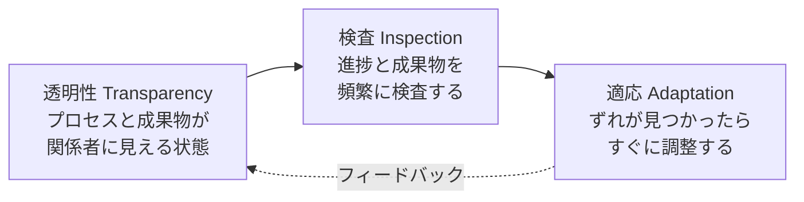
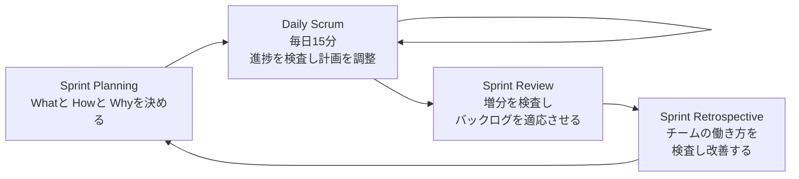
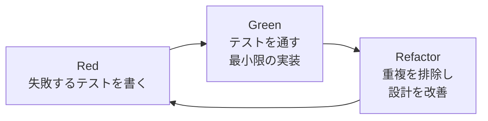
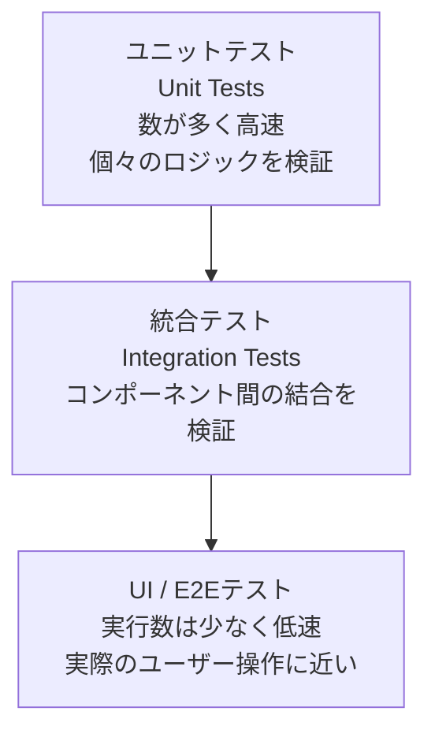
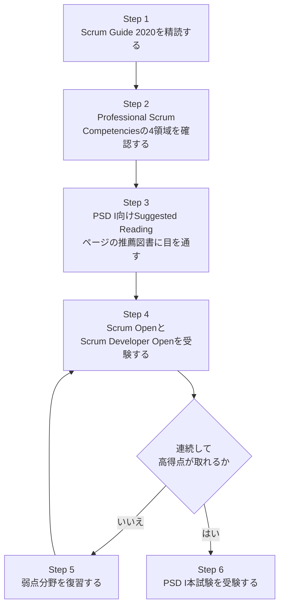

# Professional Scrum Developer™（PSD I）認定資格 学習ガイド

> 出典：Scrum.org「Professional Scrum Developer™ Certification」<https://www.scrum.org/assessments/professional-scrum-developer-certification>
> 本ガイドは上記ページおよび Scrum.org が公開する関連ページ・The Scrum Guide（2020年11月版）等の一次情報をもとに、初学者向けに再構成した学習資料です。原文の丸写しは避け、要点を筆者の言葉で解説しています。試験の正式な合否基準・出題内容は必ず一次情報（各リンク先）で確認してください。

---

## 目次

1. [この資格の全体像](#1-この資格の全体像)
2. [Part A：Scrumフレームワークの理解と適用](#2-part-ascrumフレームワークの理解と適用)
3. [Part B：プロフェッショナルとしてのプロダクト開発と提供](#3-part-bプロフェッショナルとしてのプロダクト開発と提供)
4. [Part C：人とチームの成長](#4-part-c人とチームの成長)
5. [Part D：アジリティを持ったプロダクトマネジメント](#5-part-dアジリティを持ったプロダクトマネジメント)
6. [モダンなエンジニアリングプラクティスとDevOps](#6-モダンなエンジニアリングプラクティスとdevops)
7. [ベストプラクティス総まとめ表](#7-ベストプラクティス総まとめ表)
8. [学習ロードマップ](#8-学習ロードマップ)
9. [理解度チェック（オリジナル問題）](#9-理解度チェックオリジナル問題)
10. [よくある誤解と注意点](#10-よくある誤解と注意点)
11. [参考文献・出典一覧](#11-参考文献出典一覧)

---

## 1. この資格の全体像

### 1.1 PSD Iとは何か

Professional Scrum Developer™ I（PSD I）は、Scrum.orgが提供する認定資格の一つで、Scrumフレームワークを使ってソフトウェアを開発・提供する能力を検証するものです。他の多くのアジャイル資格が「研修に出席したこと」を認定するのに対し、Scrum.orgの資格はすべて「試験に合格したこと」を根拠とする知識証明型の資格である点が特徴です。

PSD Iは、単なるScrum理論の理解にとどまらず、**自己管理型の開発、設計とアーキテクチャ、ドキュメンテーション、プログラミング、品質、テスト、リリース計画、プロダクト価値**まで、開発者（Developer）としてScrumを実践するために必要な幅広い知識を対象とします。

> **補足：** 受験に際して研修の受講は必須ではありませんが、Scrum.orgは公式研修「Applying Professional Scrum for Software Development（APS-SD）」の受講を強く推奨しています。

### 1.2 試験概要

| 項目 | 内容 |
|---|---|
| 試験名 | Professional Scrum Developer（PSD I） |
| 出題形式 | 択一式（Multiple Choice）、複数選択（Multiple Answer）、正誤問題（True/False） |
| 問題数 | 80問 |
| 制限時間 | 60分 |
| 合格ライン | 85% |
| 受験形式 | オンライン、Open Book（資料参照可） |
| 受験料 | 200 USD |
| 前提条件 | なし（誰でも受験可能） |
| 有効期限・更新 | 更新不要（永続的な認定） |
| 受験可能回数 | 1回分の受験料につき1回。不合格の場合は再度購入が必要（研修経由の場合は別条件あり） |

> **出典：** Scrum.org公式ページおよびIndiana州DWD公開資料。<https://www.scrum.org/assessments/professional-scrum-developer-certification>、<https://www.in.gov/dwd/files/industry-certifications/Professional-Scrum-Developer-PSD.pdf>

### 1.3 前提条件・対象者

PSD Iには公式な受験資格要件はなく、誰でも受験可能です。ただし対象として想定されているのは、Scrumチームの中で実際にプロダクトを作り上げる立場にある人たちです。

- プログラマー／コーダー
- アーキテクト
- データベース開発者
- テスター
- IT運用（Operations）担当者
- （技術的知識を持つ）Scrum MasterやProduct Owner

Scrum Guide 2020では「Development Team」という下位区分は廃止され、Product Owner・Scrum Master以外の全員が単に「Developers」と呼ばれるようになりました。PSD Iはこの意味での「Developers」を主対象としています。

### 1.4 出題範囲マッピング

PSD Iの出題は「Professional Scrum Competencies（プロフェッショナルScrumコンピテンシー）」というScrum.orgの知識体系モデルに基づいています。出題の約85%が、以下の4つのコンピテンシーに含まれる「Focus Area（フォーカスエリア）」からランダムに選ばれます。

```mermaid
flowchart TB
    EXAM["PSD I 試験<br/>80問 / 60分 / 合格ライン85%"]
    A["A. Scrumフレームワークの<br/>理解と適用"]
    B["B. プロフェッショナルとしての<br/>プロダクト開発と提供"]
    C["C. 人とチームの成長"]
    D["D. アジリティを持った<br/>プロダクトマネジメント"]

    EXAM --> A
    EXAM --> B
    EXAM --> C
    EXAM --> D

    A --> A1["Empiricism 経験主義"]
    A --> A2["Scrum Values"]
    A --> A3["Scrum Team"]
    A --> A4["Events"]
    A --> A5["Artifacts"]
    A --> A6["Done"]

    B --> B1["Backlog Refinement"]
    B --> B2["Cross-functional"]
    B --> B3["Self-managed Development"]
    B --> B4["Design and Architecture"]
    B --> B5["Programming"]
    B --> B6["Quality"]
    B --> B7["Testing"]

    C --> C1["Self-Managing Teams"]
    C --> C2["Facilitation"]
    C --> C3["Coaching and Mentoring"]

    D --> D1["Forecasting and<br/>Release Planning"]
    D --> D2["Product Value"]
    D --> D3["Product Backlog<br/>Management"]
    D --> D4["Stakeholders and Customers"]
```

> **出典：** Scrum.org「Suggested Reading for PSD I」<https://www.scrum.org/resources/suggested-reading-professional-scrum-developer> および「The Professional Scrum Competencies」<https://www.scrum.org/professional-scrum-competencies>

> **ベストプラクティス：** 4つのコンピテンシーのうち、出題の中心となるのは B（プロフェッショナルとしてのプロダクト開発と提供）です。ここが「PSD Iらしさ」の部分であり、他の資格（PSM Iなど）と重なるA・C・Dの部分は、既にScrum知識のある人にとっては復習で済むことが多いです。学習の優先順位はB > A ≈ D > Cの順で配分すると効率的です。

---

## 2. Part A：Scrumフレームワークの理解と適用

このコンピテンシーは、Scrumを実践する上での土台となる部分です。Scrum Guide（2020年11月版）が一次情報源であり、PSD Iの設問の多くはScrum Guideの記述に忠実に基づいています。

### 2.1 経験主義（Empiricism）

Scrumは経験主義に基づくフレームワークです。経験主義とは、「知識は経験からのみ得られ、意思決定は観察された事実に基づいて行うべきである」という考え方であり、事前に詳細な計画を立てて実行するのではなく、探索的なプロセスを通じて複雑な問題を解決していくアプローチを指します。

経験主義を支えるのが「透明性（Transparency）」「検査（Inspection）」「適応（Adaptation）」という3つの柱です。

- **透明性**：不透明な情報の上では正しい検査はできず、誤った適応につながる。プロダクトバックログやスプリントの状態を関係者全員が同じ理解で見られる状態を作ることが前提となる。
- **検査**：作業成果物やゴールへの進捗を、望ましくない差異を検出できる頻度で確認すること。検査自体が作業の妨げにならない程度の頻度・熱心さが求められる。
- **適応**：プロセスや作成物のいずれかが許容範囲を逸脱していると判断された場合、できるだけ早く調整を行うこと。

> **ベストプラクティス：**
> - 「動くソフトウェア」を頻繁に完成させることで、検査対象の透明性を最大化する（半分できた機能は検査しづらい）。
> - スプリントレビューやデイリースクラムを「報告会」にせず、実際の増分（Increment）を見せて検査・適応につなげる。
> - CI（継続的インテグレーション）や自動テストの可視化は、開発チームレベルでの透明性を支える技術的な裏付けになる。

### 2.2 Scrumの5つの価値基準（Scrum Values）

Scrumチームの成功は、以下5つの価値基準をどれだけ体現できるかに懸かっています。

| 価値基準 | 内容 |
|---|---|
| Commitment（確約） | ゴール達成とお互いへのサポートを約束する |
| Focus（集中） | スプリントの作業とゴールに集中する |
| Openness（公開） | 作業やその過程で生じる課題をオープンにする |
| Respect（尊敬） | チームメンバーを能力ある独立した人として尊重する |
| Courage（勇気） | 正しいことをする勇気、難しい問題に取り組む勇気を持つ |

> **ベストプラクティス：** Scrum Valuesは抽象的に見えますが、開発の現場では非常に具体的に効いてきます。たとえば「動かないコードを隠さずに Daily Scrum で共有する（Openness）」「技術的負債を指摘する（Courage）」など、日々のエンジニアリング行動と直結させて理解すると記憶に残りやすくなります。

### 2.3 Scrum Team

Scrum Guide 2020では、Product Owner・Scrum Master・Developersの3つのアカウンタビリティ（責任）を持つ、単一のチーム「Scrum Team」という考え方に統一されました。以前存在した「Development Team」という入れ子のチーム概念は廃止されています。

- **Product Owner**：プロダクトの価値を最大化する責任を持つ。プロダクトゴールの策定、プロダクトバックログの管理を担う。
- **Scrum Master**：Scrumの理解と実践を組織・チームに根付かせる責任を持つ。真のリーダーとしてチームに奉仕する（サーバントリーダーシップ）。
- **Developers**：スプリントごとに利用可能な増分の各側面を作成することにコミットする人たち。職能横断的（Cross-functional）かつ自己管理的である必要がある。

> **出典：** Scrum.org「Professional Scrum Competency: Understanding and Applying the Scrum Framework」<https://www.scrum.org/professional-scrum-competencies/understanding-and-applying-scrum-framework>

> **ベストプラクティス：** PSD I試験では「Developersの人数」「肩書き」「サブチーム」に関する設問で古い（2017年以前の）知識に基づく誤答選択肢が用意されていることがあります。「Development Teamという言葉自体がもう存在しない」という前提を必ず押さえておきましょう。

### 2.4 Scrumイベント（Events）

5つのイベントは、経験主義の3本柱（透明性・検査・適応）を実践するための定期的な機会です。

| イベント | 目的 | タイムボックス（1か月スプリントの場合の目安） |
|---|---|---|
| The Sprint | すべてのイベントを包含するコンテナ。一貫性のあるIncrementを生み出す | 最大1か月 |
| Sprint Planning | 今回のスプリントで「何を」「どう」「なぜ」やるかを計画する | 最大8時間 |
| Daily Scrum | Sprint Goalに向けた進捗を検査し、計画を調整する | 15分 |
| Sprint Review | Increment を検査し、プロダクトバックログを適応させる | 最大4時間 |
| Sprint Retrospective | チーム自身の働き方（プロセス・ツール・人間関係）を検査し改善計画を立てる | 最大3時間 |

> **ベストプラクティス：**
> - Daily Scrumは「進捗報告会」ではなく「その日の計画を作り直すための検査・適応の場」と捉える。参加者はDevelopersのみで、状態確認のためのミーティングにしない。
> - Sprint Reviewは「デモの日」ではなく、ステークホルダーとの協働作業（コラボレーティブなワーキングセッション）として設計する。
> - Sprint Retrospectiveでは「人」ではなく「プロセス・ツール・関係性・完成の定義」を対象にする。

### 2.5 Scrum成果物（Artifacts）とコミットメント

Scrum Guide 2020では、3つの成果物それぞれに対応する「コミットメント」が明示されました。コミットメントは、その成果物が実際にどれだけ進捗しているかの透明性を高めるためのものです。

| 成果物（Artifact） | 内容 | 対応するコミットメント |
|---|---|---|
| Product Backlog | プロダクトを改善するために必要な作業の、順序付けされた一覧 | Product Goal（プロダクトゴール） |
| Sprint Backlog | 選択されたプロダクトバックログアイテム＋実現計画 | Sprint Goal（スプリントゴール） |
| Increment | 完成した（Doneの）プロダクトバックログアイテムの積み上げ | Definition of Done（完成の定義） |

> **ベストプラクティス：** 「成果物＝物」「コミットメント＝その成果物が目指す方向性・進捗の目安」という対応関係をセットで覚えると、設問で「Sprint Goalはどの成果物に対応するコミットメントか」といった問われ方をされても即答できます。

### 2.6 完成の定義（Definition of Done）

Definition of Done（DoD）は、Incrementの品質基準を定める正式な記述です。プロダクトバックログアイテムがDoDを満たしたときにのみ、それは「Increment」の一部となります。

- DoDはScrum Teamがコンテキストに応じて作成する。組織で標準のDoDが存在する場合、それを最低ラインとして各Scrum Teamが独自にさらに厳しくすることは可能。
- DoDを満たさない作業は、Sprint Reviewで公開してはならない。むしろプロダクトバックログに戻し、次回以降のスプリントで再検討する。
- 開発の過程でDoDに関する新しい知識が得られた場合、DoDの基準そのものを厳格化していくのが一般的な成熟プロセス。

> **ベストプラクティス：** ソフトウェア開発の文脈では、DoDは単なる「テストが通った」だけでなく、「コードレビュー済み」「静的解析をクリア」「ドキュメント更新済み」「本番相当環境にデプロイ可能」などまで含めて定義することが望ましいとされます。DoDが甘いと、後工程に「隠れた未完成作業（技術的負債）」が積み上がっていく点が、PSD Iでは品質（Quality）や技術的リスクの管理の文脈と結び付けて出題されます。

---

## 3. Part B：プロフェッショナルとしてのプロダクト開発と提供

このコンピテンシーが、PSD Iを他のScrum.org資格（PSM Iなど）と差別化する中核部分です。「Developing and Delivering Products Professionally」というコンピテンシーは、高品質なプロダクトを反復的・漸進的に、しかも高い頻度で提供することを目的としています。

> **出典：** Scrum.org「Professional Scrum Competency: Developing and Delivering Products Professionally」<https://www.scrum.org/professional-scrum-competencies/developing-and-delivering-products-professionally>

### 3.1 プロダクトバックログリファインメント（Backlog Refinement）

リファインメントとは、プロダクトバックログアイテムに詳細・見積もり・順序を追加していく継続的な活動です。Scrum Guideでは正式な「イベント」ではなく、必要に応じて随時行う活動として位置づけられています。

- 大きすぎるアイテムを、より小さく、より扱いやすい単位に分割する。
- 受け入れ基準（Acceptance Criteria）を明確にし、Developersが実装可能な粒度まで具体化する。
- 見積もりの精度を高め、次のスプリント以降の計画をしやすくする。

> **ベストプラクティス：**
> - リファインメントに使う時間は、スプリントの稼働時間の10%程度を目安にする、という考え方が広く実務で採用されている。
> - ユーザーストーリーの分割には「垂直分割（画面から永続化層まで一気通貫で薄く切る）」を優先し、「水平分割（フロントだけ、バックエンドだけ）」は避ける。垂直に分割することで、各アイテムが独立して「動く」ものとして完成させられる。
> - INVEST（Independent, Negotiable, Valuable, Estimable, Small, Testable）の観点でアイテムの品質をチェックする。

### 3.2 職能横断型チーム（Cross-functional）

Developersは、Increment を作成するために必要なすべてのスキルを、チーム全体として持っている必要があります。個々人が全スキルを持つ必要はなく、チーム全体として職能横断的であればよい、という点が重要です。

- 特定の専門家（DBA、フロントエンド専任など）に依存すると、その人が不在のときにボトルネックが発生する。
- T型人材（一つの専門を深く持ちつつ周辺領域もある程度対応できる）を育てることで、チームのフロー効率が上がる。

> **ベストプラクティス：**
> - ペアプログラミングやモブプログラミングは、知識のサイロ化を防ぎ、チーム全体のクロスファンクショナル性を高める実践的な手段として推奨される。
> - スキルマトリクス（誰が何を得意とするかの可視化表）を作り、意図的にペア構成やタスクアサインをローテーションする。

### 3.3 自己管理型の開発（Self-managed Development）

Scrum Guide 2020では「自己組織化（Self-organizing）」から「自己管理（Self-managing）」へと用語が変わりました。自己管理とは、Developersが「誰が」「どのように」「何を」行うかを、チーム内部で決定することを指します（外部からの管理・指示ではなく）。

- 自己管理には、適切な開発スキルの存在だけでなく、協働・チームコミットメント・共同の課題オーナーシップ・共有ゴール・創造性が必要とされる。
- マネージャーがタスクを個人に割り当てるのではなく、チーム自身がSprint Backlogの中でタスクを引き受けていく。

> **出典：** Scrum.org「Suggested Reading for PSD I」内 "Cross-Functional, Self-Managed Development" の項 <https://www.scrum.org/resources/suggested-reading-professional-scrum-developer>

> **ベストプラクティス：** 自己管理は「放任」ではありません。明確なSprint Goal・DoD・透明性という「枠組み」があってはじめて機能する自由度です。PSD Iでは「マネージャーがDevelopersにタスクを割り振るべきか」といった設問で、自己管理の原則からの逸脱を見抜けるかが問われます。

### 3.4 設計とアーキテクチャ（Design and Architecture）

Scrumでは、詳細な設計を事前にすべて確定させる「Big Design Up Front（BDUF）」ではなく、アーキテクチャの境界の中で設計が創発的（Emergent）に育っていくアプローチを取ります。

- アーキテクチャの大枠（境界・原則）は初期に方向性を定めるが、詳細はスプリントを重ねる中で、実際に得られた知見をもとに進化させる。
- YAGNI（You Aren't Gonna Need It）の原則に従い、「今必要なもの」だけを作り、将来のための過剰設計を避ける。
- リファクタリングを継続的に行うことで、設計をコードベースの成長に追従させる。

> **ベストプラクティス：**
> - アーキテクチャ決定の背景を記録する軽量な手法として ADR（Architecture Decision Record）を使い、なぜその設計を選んだかをチームで共有する。
> - 技術的な選択肢を早期に検証するために、スパイク（時間を区切った調査用の作業）を活用する。
> - ドキュメンテーションは「作って終わり」ではなく、コードや設計と同様に継続的にメンテナンスする対象として扱う。

### 3.5 プログラミング（Programming）

PSD Iでは、具体的なプログラミング言語や実装テクニックそのものよりも、Scrumの文脈でどのようなプログラミングプラクティスが「継続的に高品質なDoneの増分」を支えるかが問われます。

- **テスト駆動開発（TDD）**：先にテストを書き、そのテストを通す最小限の実装を行い、その後リファクタリングするサイクル（Red → Green → Refactor）。
- **ペアプログラミング／モブプログラミング**：知識共有と品質担保を同時に行う協働的な実装スタイル。
- **クリーンコード**：可読性・単純性を重視し、将来の変更コストを下げるコーディング。
- **継続的リファクタリング**：機能を変えずに内部構造を改善し続けることで、技術的負債の蓄積を防ぐ。

> **ベストプラクティス：**
> - TDDは「テストを後から書く」文化と対比され、設計の質を早期に検証する手段として位置づけられる。
> - コードレビューをDefinition of Doneの一部に組み込み、属人化と品質低下を防ぐ。
> - 静的解析・Linter・フォーマッタをCIパイプラインに組み込み、レビューの負荷を「スタイルの指摘」から「設計・ロジックの指摘」にシフトさせる。

### 3.6 品質（Quality）

品質は「後から付け加えるもの」ではなく、開発プロセス全体に組み込まれるべきものだという考え方が、Scrumのエンジニアリングプラクティスの中核にあります。

- **継続的品質（Continuous Quality）**：品質保証をスプリント末のフェーズとして切り離すのではなく、日々の開発活動の中に統合する。
- **技術的負債（Technical Debt）**：短期的な近道の代償として将来発生する追加コスト。可視化し、計画的に返済する対象として扱う。
- **技術的リスクの管理（Managing Technical Risk）**：不確実性の高い技術要素を早期に検証し、後工程での手戻りを防ぐ。

> **ベストプラクティス：**
> - 技術的負債をプロダクトバックログに可視化し、「見えない負債」を「管理可能な負債」に変える。
> - サイクルタイム（Cycle Time）やリードタイムなどのフロー指標をチームで計測し、品質と速度のトレードオフを定量的に把握する。
> - Definition of Doneに品質基準（テストカバレッジ、静的解析の合格、パフォーマンス基準など）を明示的に組み込む。

### 3.7 テスト（Testing）

「動くソフトウェアを毎スプリント届ける」というScrumの原則を支えるには、手動テストへの依存を減らし、自動化されたテストで継続的に品質を担保する必要があります。

- **テストピラミッド**：ユニットテストを土台に多く配置し、統合テスト、E2E/UIテストの順に数を絞っていく考え方。逆ピラミッド（UIテストに偏重する構成）はメンテナンスコストが高く壊れやすい。
- **受け入れテスト駆動開発（ATDD）／振る舞い駆動開発（BDD）**：ビジネス側が理解できる自然言語に近い形で受け入れ基準を記述し、それをそのまま自動テストとして実行可能にするアプローチ。
- **探索的テスト**：自動化だけでは見つけにくいユーザビリティやエッジケースの問題を、テスターが能動的に探索して発見する手法。

> **ベストプラクティス：**
> - テストの自動化はDefinition of Doneの一部として扱い、「テストが書かれていない機能はDoneではない」という基準をチームで合意する。
> - テスターはスプリントの最後にまとめて作業するのではなく、リファインメントや実装の初期段階からDevelopersと協働する（シフトレフト）。
> - CIパイプライン上でテストスイートを自動実行し、失敗した場合はビルドを止める「壊れたビルドを放置しない」文化を徹底する。

---

## 4. Part C：人とチームの成長

このコンピテンシーは、Scrumチームが「単に手順を回す集団」から「継続的に学習し成長するチーム」へと成熟していくために必要な、対人的なスキルを扱います。

> **出典：** Scrum.org「Professional Scrum Competency: Developing People and Teams」<https://www.scrum.org/resources/professional-scrum-competency-developing-people-and-teams>

### 4.1 自己管理型チーム（Self-Managing Teams）

複雑な問題に取り組むチームを支援する最良の方法は、チームに「どう仕事をするか」を細かく指示することではなく、チーム自身が決められる余地（スペース）を与えることです。

- 自己管理型チームには、明確な境界（ゴール・制約・Definition of Done）が必要。境界がないまま自由度だけを与えると混乱を招く。
- 「自己管理＝マネージャー不要」という誤解が多いが、実際には組織的な支援やコーチングは依然として必要。

> **ベストプラクティス：** チームの自己管理度合いを一足飛びに最大化しようとせず、段階的に権限移譲していく（タスクの割り当て→見積もり→スプリント計画→リリース判断、の順で裁量を広げるなど）アプローチが実務では有効とされます。

### 4.2 ファシリテーション（Facilitation）

ファシリテーションとは、参加・当事者意識・創造性を促す形で、人々を合意された目標に導く技術です。Scrum Masterに限らず、Developers自身がミーティングや議論をファシリテートできることが望ましいとされます。

- Scrumイベント（特にSprint RetrospectiveやRefinement）は、ファシリテーション技術を活用することで質が大きく変わる。
- 特定の声の大きい人だけが発言する状況を避け、全員の視点を引き出す工夫（ラウンドロビン、匿名アイデア出しなど）が重要。

> **ベストプラクティス：** レトロスペクティブでは、毎回同じフォーマット（例：KPT、Start-Stop-Continue）だけに頼らず、チームの状況に応じてファシリテーション手法を変えることでマンネリ化を防ぐ。

### 4.3 コーチングとメンタリング（Coaching and Mentoring）

- **コーチング**：コーチはプロセスの専門家として振る舞い、対話や積極的傾聴、示唆に富む質問を通じて、相手自身が答えにたどり着けるよう支援する。
- **メンタリング**：メンターが自身の経験・専門知識に基づいて、メンティーに具体的なガイダンスを提供する、双方向の関係性。

両者は混同されがちですが、コーチングは「答えを引き出す」、メンタリングは「答え（または方向性）を提供する」という違いがあります。

> **ベストプラクティス：** 経験豊富なDeveloperが新しいメンバーに対してペアプログラミングを通じてメンタリングを行うことは、知識移転とオンボーディングの高速化に直結する実践例としてよく挙げられます。

---

## 5. Part D：アジリティを持ったプロダクトマネジメント

PSD Iでは主にProduct Ownerの役割とされる領域からも、Developerとして知っておくべき部分が出題されます。

> **出典：** Scrum.org「Professional Scrum Competency: Managing Products with Agility」<https://www.scrum.org/professional-scrum-competencies/managing-products-with-agility>

### 5.1 予測とリリース計画（Forecasting and Release Planning）

Scrumチームは、大きな一度きりのビッグバンリリースではなく、小さく頻繁な増分リリースを導くためのガイドとして予測とリリース計画を用います。

- ベロシティ（過去の実績）をもとにした予測は「約束」ではなく、不確実性を伴う目安として扱う。
- 経験主義に基づき、計画は一度立てたら終わりではなく、スプリントを重ねるごとに継続的に更新する。

> **ベストプラクティス：** バーンダウン／バーンアップチャートだけに頼らず、スコープの変化そのものを可視化する（バーンアップチャートはスコープの増減が見えやすい）ことで、ステークホルダーとの期待値調整がしやすくなります。

### 5.2 プロダクト価値（Product Value）

Scrumチームの目的は、顧客とステークホルダーに価値を届けることです。価値の定義・測定・検証を継続的に行うことが求められます。

- 価値を継続的に定義し、実際に実現された価値を測定し、仮説を検証し、傾向を分析することが鍵となる。
- アウトプット（作った機能の数）ではなく、アウトカム（それによって生まれた成果）で成功を測る。

> **ベストプラクティス：** リリース後の利用状況やビジネス指標（例：離脱率、コンバージョン率）をチームにフィードバックする仕組みを作り、「作ったら終わり」にしない。

### 5.3 プロダクトバックログマネジメント（Product Backlog Management）

プロダクトバックログの効果的な管理には、Scrumチーム自身を含む多様なステークホルダーからの入力と協働が必要です。透明性のレベルは、ステークホルダーのニーズに応じて進化させる必要があります。

> **ベストプラクティス：** DevelopersはPBMを「Product Ownerだけの仕事」と捉えず、技術的な観点からアイテムの分割・見積もり・依存関係の指摘に積極的に関わることで、バックログの質を高められます。

### 5.4 ステークホルダーと顧客（Stakeholders and Customers）

ステークホルダーとの関わり方は、Sprint Reviewを中心に設計されますが、それだけに閉じません。継続的なフィードバックループを設計することが重要です。

> **ベストプラクティス：** Sprint Reviewを「完成した機能の発表会」にせず、ステークホルダーと一緒に次の優先順位を議論する場として設計する。

---

## 6. モダンなエンジニアリングプラクティスとDevOps

公式のFocus Areaには明示的な項目名としては現れませんが、Scrum.orgの公式研修「Applying Professional Scrum for Software Development（APS-SD）」のカリキュラムには、DevOpsおよびモダンなエンジニアリングプラクティスの概観が含まれており、PSD Iの「Programming」「Quality」「Testing」「Design and Architecture」の設問の背景知識として重要です。

> **出典：** Scrum.org「Applying Professional Scrum for Software Development」研修ページ <https://www.scrum.org/courses/applying-professional-scrum-for-software-development-training>

### 6.1 継続的インテグレーション／継続的デリバリー（CI/CD）

- **継続的インテグレーション（CI）**：Developersが頻繁に（少なくとも1日に一度は）変更を共有のメインラインに統合し、自動ビルド・自動テストで即座に検証する。
- **継続的デリバリー（CD）**：ビルドされた成果物を、いつでも本番にリリース可能な状態に保つ。実際のリリースタイミングはビジネス判断で決める。
- **継続的デプロイメント**：CDをさらに進め、テストを通過した変更を自動的に本番へ反映する。

> **ベストプラクティス：** 「動くソフトウェアを毎スプリント届ける」というScrumの原則は、CI/CDという技術基盤なしには実質的に達成が困難です。PSD Iでは、CI/CDがScrumのイベント・成果物とどう結び付くか（例：Doneの増分を支える技術的裏付け）を理解しているかが問われます。

### 6.2 進化的データベース設計（Evolutionary Database Development）

データベーススキーマも、アプリケーションコードと同様に、スプリントを重ねる中で段階的に進化させていくアプローチです。

- スキーマ変更をバージョン管理し、マイグレーションスクリプトとして自動化・再現可能にする。
- 「後方互換性のある小さな変更」を積み重ねることで、大規模な一括マイグレーションのリスクを避ける。

> **ベストプラクティス：** データベースマイグレーションを手作業のSQL実行ではなく、コードと同じCI/CDパイプラインに組み込んで自動化・レビュー対象にする。

### 6.3 技術的負債の可視化と返済

- 技術的負債は「悪」ではなく、意図的に選択されるトレードオフである場合もある（納期優先で近道を選ぶなど）。問題は「見えない負債」が無秩序に蓄積することにある。
- 定期的なリファクタリング枠をスプリントの計画に組み込み、負債の返済を継続的なプラクティスにする。

> **ベストプラクティス：** 技術的負債専用のバックログアイテムを作り、Product Ownerと優先順位を明示的に交渉する（隠れた負債にしない）ことが、持続可能な開発速度を保つ鍵になります。

---

## 7. ベストプラクティス総まとめ表

| トピック | ベストプラクティス（要約） |
|---|---|
| Backlog Refinement | 稼働時間の目安10%を確保し、垂直分割でINVESTを満たすアイテムに整える |
| Cross-functional | ペア／モブプログラミングとスキルマトリクスで知識のサイロ化を防ぐ |
| Self-managed Development | 明確なゴールとDoDという境界の中で、タスク割り当てをチーム自身に委ねる |
| Design and Architecture | ADRで意思決定を記録し、大枠は初期に、詳細は創発的に育てる |
| Programming | TDD・ペアプログラミング・継続的リファクタリングで内部品質を保つ |
| Quality | DoDに品質基準を明記し、技術的負債をバックログで可視化する |
| Testing | テストピラミッドに沿って自動化し、テストをDoDに組み込む（シフトレフト） |
| Empiricism | 頻繁な検査ができるよう、小さく完成させた増分を作り続ける |
| Scrum Values | 日々のエンジニアリング行動（隠さず共有する、指摘する勇気）と結び付けて実践する |
| Events | 各イベントの目的（検査と適応）を報告会にせず徹底する |
| Self-Managing Teams | 権限移譲を段階的に進め、境界を明確にした上で裁量を広げる |
| Facilitation | フォーマットを固定化せず、状況に応じたファシリテーション手法を選ぶ |
| Coaching and Mentoring | ペアプログラミングを知識移転とオンボーディングの手段として活用する |
| Forecasting & Release Planning | バーンアップチャートでスコープの変化そのものを可視化する |
| Product Value | アウトプットでなくアウトカム（成果）で成功を測る |
| CI/CD | 壊れたビルドを放置しない文化と、自動デプロイまでのパイプラインを整備する |

---

## 8. 学習ロードマップ

学習の進め方として、以下のステップが実務でも広く推奨されています。

1. **Scrum Guideを精読する。** PSD Iを含むScrum.orgの全資格において、Scrum Guideは一次情報源であり、最も出題根拠として引用される頻度が高い文書です。
2. **Professional Scrum Competenciesページで、4つのコンピテンシーとFocus Areaの全体像をつかむ。**
3. **PSD I向けのSuggested Readingページで、推薦図書（例：The DevOps Handbook、Professional Scrum Development with Azure DevOps など）を確認する。** 全部読む必要はなく、目次レベルで用語を拾うだけでも効果があります。
4. **無料のOpen Assessment（Scrum OpenおよびScrum Developer Open）を繰り返し受験する。** 実際の本試験と同一問題ではありませんが、出題傾向をつかむ最も有効な練習方法として公式にも案内されています。
5. **間違えた分野・自信のない分野を、該当するCompetencyページやScrum Guideの該当箇所に戻って復習する。**
6. **安定して高得点が取れるようになってから、本試験（PSD I）を受験する。**

> **出典：** Scrum.org「Open Assessments」<https://www.scrum.org/open-assessments>、「Scrum Developer Open」<https://www.scrum.org/open-assessments/scrum-developer-open>、「Suggested Reading for PSD I」<https://www.scrum.org/resources/suggested-reading-professional-scrum-developer>

> **ベストプラクティス：** Scrum Developer Openは30問構成の無料練習アセスメントで、Scrum.org自身が「PSD I受験前に強く推奨する」と案内しています。本試験前に、時間を計って何度も受け、安定して高スコアを出せる状態を目指しましょう。ただし丸暗記ではなく、「なぜその選択肢が正しいのか／誤りなのか」を毎回言語化することが、出題パターンが変化しても対応できる実力につながります。

---

## 9. 理解度チェック（オリジナル問題）

以下は本ガイドの理解度を確認するために独自に作成した設問です。実際のPSD I試験の問題ではありません。

**Q1.** Scrum Guide 2020において、以前存在した「Development Team」というサブチームの概念はどうなったか。

- A. そのまま維持されている
- B. Product Owner・Scrum Master・DevelopersのすべてがScrum Teamという単一のチームに統合され、Development Teamという用語は廃止された
- C. Development Teamの人数上限が撤廃された
- D. Development TeamがScrum Masterの管理下に置かれるようになった

**正解：B**　2020年版では、3つのアカウンタビリティを持つ単一のScrum Teamという考え方に統一され、入れ子構造の「Development Team」という呼び方は使われなくなりました。

**Q2.** テストピラミッドの考え方として最も適切なものはどれか。

- A. UI／E2Eテストを最も多く用意し、ユニットテストは最小限にする
- B. ユニットテストを土台として最も多く配置し、統合テスト、UI/E2Eテストの順に数を絞る
- C. すべてのテストを手動で行い、自動化は避ける
- D. 統合テストのみを実施すれば十分である

**正解：B**　高速で保守しやすいユニットテストを土台に多く配置し、実行コストの高いE2Eテストは最小限に絞ることで、フィードバックの速度とテストの保守性を両立させます。

**Q3.** 技術的負債への向き合い方として、Scrumのエンジニアリングプラクティスとして推奨されるのはどれか。

- A. 負債を隠し、Product Ownerに気付かれないようにする
- B. 負債を可視化し、バックログ上で明示的に優先順位を交渉する
- C. 負債の返済は考えず、常に新機能開発を優先する
- D. 負債はScrum Masterが単独で判断して返済する

**正解：B**　技術的負債を見える化し、Product Ownerと優先順位を明示的に交渉することで、透明性を保ったまま持続可能な開発速度を維持できます。

---

## 10. よくある誤解と注意点

| よくある誤解 | 実際の考え方 |
|---|---|
| 「Developersとはプログラマーだけを指す」 | テスター、DBA、アーキテクトなど、Increment作成に関わる全員がDevelopersに含まれる |
| 「自己管理＝マネージャー不要、指示ゼロで自由にやってよい」 | ゴールとDoDという境界の中での裁量であり、無秩序な自由放任ではない |
| 「リファインメントは正式なScrumイベントである」 | リファインメントはイベントではなく、継続的な活動として位置づけられている |
| 「DoDはScrum.orgが標準として定めている」 | DoDはScrum Team（および組織）が自ら定義するものであり、統一のグローバル標準は存在しない |
| 「Sprint ReviewはDoneになった機能のデモをするだけの場」 | ステークホルダーと共に次の優先順位を協働で検討する場でもある |
| 「PSD IはCSD（Scrum Alliance）と同じ資格である」 | PSD IはScrum.orgが提供する知識証明型試験であり、Scrum Alliance（研修受講型）のCSDとは発行団体・認定方式が異なる |

> **補足：** 最後の項目について、Scrum AllianceのCertified Scrum Developer（CSD）は研修出席をベースにした認定であるのに対し、Scrum.orgのPSD Iは筆記試験（85%の合格ライン）による知識証明型の認定です。両者は名称が似ていますが別団体・別制度である点に注意してください。

---

## 11. 参考文献・出典一覧

| 資料 | URL |
|---|---|
| Professional Scrum Developer™ Certification（公式試験ページ） | <https://www.scrum.org/assessments/professional-scrum-developer-certification> |
| Suggested Reading for PSD I™（推奨学習リソース） | <https://www.scrum.org/resources/suggested-reading-professional-scrum-developer> |
| The Professional Scrum™ Competencies（コンピテンシー概要） | <https://www.scrum.org/professional-scrum-competencies> |
| Professional Scrum Competency: Understanding and Applying the Scrum Framework | <https://www.scrum.org/professional-scrum-competencies/understanding-and-applying-scrum-framework> |
| Professional Scrum Competency: Developing and Delivering Products Professionally | <https://www.scrum.org/professional-scrum-competencies/developing-and-delivering-products-professionally> |
| Professional Scrum Competency: Developing People and Teams | <https://www.scrum.org/resources/professional-scrum-competency-developing-people-and-teams> |
| Professional Scrum Competency: Managing Products with Agility | <https://www.scrum.org/professional-scrum-competencies/managing-products-with-agility> |
| The Scrum Guide（Scrum.org公式配布ページ） | <https://www.scrum.org/resources/scrum-guide> |
| The Scrum Guide（2020年11月版・一次配布サイト） | <https://scrumguides.org/scrum-guide.html> |
| Applying Professional Scrum for Software Development™（公式研修ページ） | <https://www.scrum.org/courses/applying-professional-scrum-for-software-development-training> |
| Open Assessments（無料練習アセスメント一覧） | <https://www.scrum.org/open-assessments> |
| Scrum Developer Open（PSD I向け無料練習アセスメント） | <https://www.scrum.org/open-assessments/scrum-developer-open> |
| Professional Scrum Developer™ I（PSD I）バッジ情報 | <https://www.credly.com/org/scrum-org/badge/professional-scrum-developer-i-psd-i> |
| PSD概要資料（Indiana州 DWD公開PDF：受験料・時間等の要約） | <https://www.in.gov/dwd/files/industry-certifications/Professional-Scrum-Developer-PSD.pdf> |

> **免責事項：** 本ガイドは学習支援を目的とした非公式の解説資料であり、Scrum.orgの公式教材ではありません。試験の出題形式・合格基準・Focus Areaの内容は変更される可能性があるため、受験前に必ず上記の公式ページで最新情報を確認してください。
