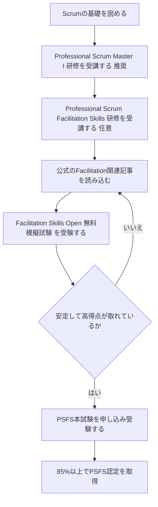
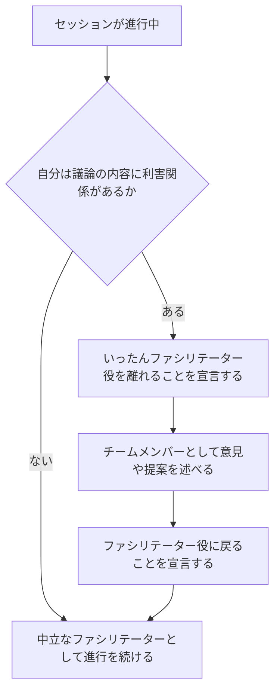
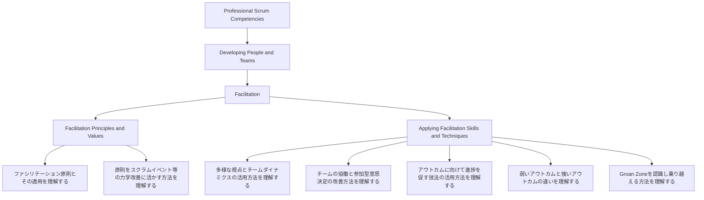
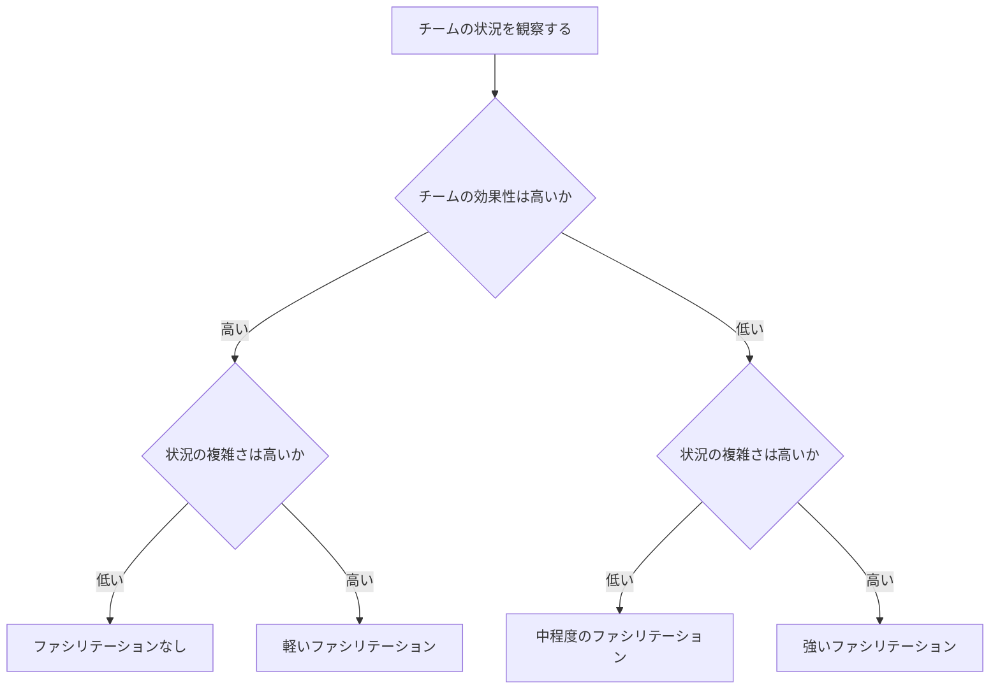
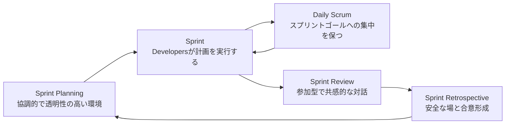
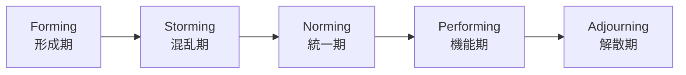
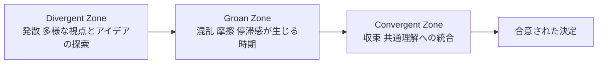
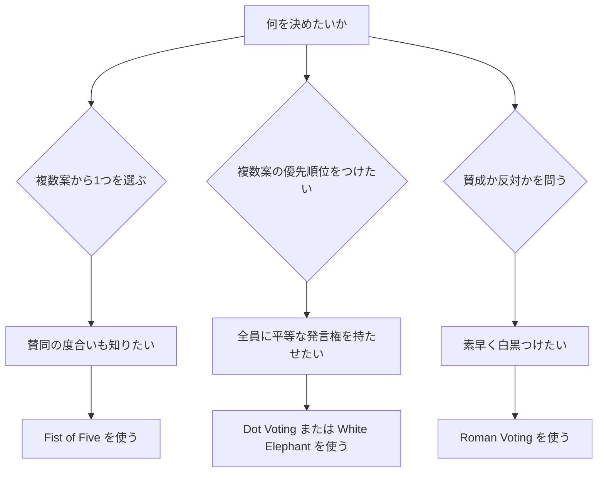
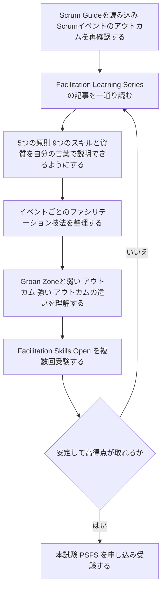

# Professional Scrum Facilitation Skills™ (PSFS) 認定資格 完全対策ガイド

> 初学者向けに、出題範囲の各項目をステップバイステップで解説し、各項目・各テクニックにおけるベストプラクティスをまとめた学習ガイドです。すべての図はMermaidで、表形式の情報はMarkdownテーブルで記述しています。
>
> 公式ページ: https://www.scrum.org/assessments/professional-scrum-facilitation-skills-certification

---

## 目次

1. この資格の概要
2. ファシリテーションとは何か
3. 出題範囲の全体像（Professional Scrum Competencies）
4. ファシリテーションの5原則とスクラムの価値基準
5. ファシリテーターに必要なスキルと資質
6. どれだけ・どんなファシリテーションが必要か
7. スクラムイベントのファシリテーション
8. グループダイナミクスと意思決定
9. ファシリテーション技法ツールキット
10. 多様な視点と難しい状況への対応
11. 試験対策・学習ロードマップ
12. 練習問題（オリジナル10問）
13. ベストプラクティス チートシート
14. 参考文献・出典

---

## 1. この資格の概要

Professional Scrum Facilitation Skills（PSFS）は、Scrum.org が提供する認定資格で、ファシリテーションの原則・スキル・技法をどれだけ理解し、スクラムイベントやその他のチームの対話にどう応用できるかを検証するものです。単なる「一般的なファシリテーション知識」を問う試験ではなく、**スクラムという文脈の中でファシリテーション原則をどう適用するか**を問う点が最大の特徴です。

### 1.1 基本情報

| 項目 | 内容 |
|---|---|
| 提供元 | Scrum.org |
| レベル | Intermediate（中級） |
| 受験形式 | オンライン、自分の好きな場所と時間で受験可能 |
| 問題数 | 20問（多肢選択式） |
| 制限時間 | 30分 |
| 合格ライン | 85%以上 |
| 受験言語 | 英語（Chrome に標準搭載された Google 翻訳で母国語表示にして受験する人も多い。翻訳用の拡張機能を追加インストールする必要はない） |
| 費用 | 200 USD |
| 有効期限 | なし（更新料も不要） |
| 前提資格 | 必須ではないが、Professional Scrum Master I（PSM I）研修コースの受講が強く推奨される |
| 公式スタンダード | The Scrum Guide／The Professional Scrum Competencies |
| バッジ発行 | Credly経由でデジタルバッジが発行される |

> 出典: https://www.scrum.org/assessments/professional-scrum-facilitation-skills-certification／https://www.credly.com/org/scrum-org/badge/professional-scrum-facilitation-skills.1

### 1.2 誰のための資格か

- スクラムマスターやスクラムチームのメンバーで、チームの成功をファシリテーションによって後押ししたい人
- アジャイルコーチ、スクラムコーチ、アジャイルコンサルタント
- 「Scrumの基本用語は知っているがイベントがうまく回らない」と感じているファシリテーター初学者

なお公式サイトでは、Scrumの経験がほとんどない人には不向きな試験だと明記されています。PSM Iで学ぶスクラムの基礎（イベント・作成物・価値基準）を土台として、その上にファシリテーションの知識を積み上げる構成になっているためです。

### 1.3 資格取得までの流れ

### 1.4 出題対象となる「フォーカスエリア」

Scrum.orgが定める Professional Scrum Competencies のうち、PSFSの中心となるのは「Developing People and Teams」というコンピテンシーの中の「Facilitation」というフォーカスエリアです。その中は次の2つのサブ項目に分かれます。

- **Facilitation Principles and Values**（ファシリテーションの原則と価値観）
- **Applying Facilitation Skills and Techniques**（ファシリテーションのスキルと技法の適用）

ただし、出題がこの2つのサブ項目だけに閉じるわけではありません。PSFSはファシリテーションを「スクラムの文脈の中で」問う試験のため、Scrum Values（スクラムの価値基準）、Scrum Team（スクラムチーム）、Events（スクラムイベント）、Artifacts（作成物）といったスクラムの基礎理解を前提とした上で、上記のFacilitationフォーカスエリアが主要な出題範囲となります。

出典: https://www.scrum.org/resources/prove-your-knowledge-facilitation-skills

---

## 2. ファシリテーションとは何か

### 2.1 定義

Scrum.orgはファシリテーションを、関係者全員の参加・当事者意識・創造性を引き出しながら、合意された目的に向けて人々を導くための手法と定義しています。良いファシリテーションは透明性とコラボレーションを生み出し、集団の相乗効果（シナジー）を発揮させ、共通の目的の達成につながります。

ファシリテーターの役割は、人々が共通のゴールを理解し、それを達成できるよう支援することです。そのために欠かせないのが「中立性」です。ファシリテーターは議論の内容そのものに肩入れせず、あくまで議論が前に進むための「場」と「プロセス」を設計し、導く役割に徹します。

出典: https://www.scrum.org/resources/what-facilitation

### 2.2 ファシリテーターとスクラムマスターの関係

スクラムでは、誰でもファシリテーターになれます。スクラムチームの内部の人（開発者やプロダクトオーナー）でも、外部の人でも構いません。ただし現実には、スクラムマスターがファシリテーターを担うことが最も多いパターンです。

ここで初学者がつまずきやすいポイントが一つあります。それは「ファシリテーターとして進行している自分」と「チームの一員として意見を言いたい自分」が同一人物の中に同居してしまう場面です。例えばスプリントレトロスペクティブを進行しているスクラムマスターが、同時に開発チームの一員として改善案を提案したくなることがあります。

このとき重要なのは、**今どちらの立場で話しているのかをチームに明確に伝えること**です。曖昧なまま両方の役割を行き来すると、チームはあなたの発言をどう受け止めればよいか混乱してしまいます。

### 2.3 ベストプラクティス

- ファシリテーションを始める前に「今日は私がファシリテーターとして進行します」と役割を明言する
- 発言する前に「今は参加者として話します」と一言添えるだけで、チームの混乱を防げる
- ファシリテーターは「プロセスのオーナー」であって「コンテンツのオーナー」ではない、という原則を常に意識する
- スクラムの枠組みに関すること以外は、チームに「何をすべきか」「どうすべきか」を指示しない

出典: https://www.scrum.org/resources/blog/scrum-master-facilitator

---

## 3. 出題範囲の全体像（Professional Scrum Competencies）

### 3.1 各フォーカスエリアの Knowledge Requirements（公式の知識要件）

| フォーカスエリア | 公式の知識要件（Knowledge Requirements） |
|---|---|
| Facilitation Principles and Values | ・ファシリテーション原則とその適用方法を理解している ・ファシリテーション原則がスクラムイベントやその他の対話の力学をどう改善できるかを理解している |
| Applying Facilitation Skills and Techniques | ・チームの多様な視点とダイナミクスを活かすファシリテーションスキルの使い方を理解している ・チームの協働と参加型意思決定を改善する方法を理解している ・アウトカムに向けた進捗を促す複数のファシリテーションスキルと技法の使い方を理解している ・弱いアウトカムと強いアウトカムの違いを理解している ・「Groan Zone（うなり声ゾーン）」を認識し、乗り越える方法を理解している |

出典: https://www.scrum.org/resources/facilitation-principles-and-values／https://www.scrum.org/resources/applying-facilitation-skills-and-techniques

> **補足**: PSFS試験問題は、この2つのフォーカスエリアに加えて、スクラムの価値基準・スクラムチーム・イベント・作成物についての土台知識（＝PSM Iレベルの内容）からも派生して出題されます。「一般的なファシリテーション理論の試験」ではなく「スクラムの文脈でのファシリテーション原則の適用」を問う試験である、という点を繰り返し意識してください。

出典: https://www.scrum.org/resources/prove-your-knowledge-facilitation-skills

---

## 4. ファシリテーションの5原則とスクラムの価値基準

### 4.1 ファシリテーションの5原則

スクラムの価値基準（Commitment確約／Focus集中／Openness公開／Respect尊敬／Courage勇気）はスクラムチームの行動の土台ですが、それを補完する形で、Scrum.orgは次の5つのファシリテーション原則を定義しています。これらはファシリテーターがどんなテクニックを選ぶべきかを判断する際の拠り所になります。

| 原則 | 内容 |
|---|---|
| Participatory（参加） | 効果的なファシリテーションの核心は、全員の完全な参加と関与である。チームに共有された責任感が生まれる。 |
| Healthy（安全・健全） | 人々が違いや対立する視点を安心して表明できる、安全な空間をつくること。互いに敬意を持って学び合える環境が必要。 |
| Transparency（透明性） | 透明性は「見えること」だけでなく「共有された理解があること」で初めて成立する。 |
| Process（プロセス） | ファシリテーションは、協調的・包括的で多様な視点を活かす形で、チームが目的に向かって進めるようにするものであるべき。 |
| Purposeful（目的） | よくファシリテーションされたセッションには、全員が同意し向かうべき明確な目的がある。 |

出典: https://www.scrum.org/resources/facilitation-principles

### 4.2 スクラムの価値基準から見たファシリテーター行動

Scrum.orgのブログ記事「Scrum Values from a Facilitator's Perspective」では、5つのスクラム価値基準それぞれについて、ファシリテーターが体現すべき具体的な行動が紹介されています。要点を以下にまとめます。

| スクラムの価値基準 | ファシリテーターの具体的な行動例 |
|---|---|
| Commitment（確約） | 目的・人・プロセスにコミットする。事前準備を怠らず、包括的な進行構造を設計する。ルーティンのイベントでも難しいレトロスペクティブでも一貫した姿勢を保つ。内容ではなく進行に対して中立であり続ける。 |
| Courage（勇気） | 言いにくい真実でも表に出す勇気を持つ。「私たちが話していないことは何か」と問いかける。声の大きい人の発言を遮ってでも、他の人が話す余地をつくる。 |
| Focus（集中） | 活動そのものではなくアウトカムに焦点を当てる。会議が始まる前から目的に集中する。タイムボックスや視覚的な手がかりを使って進捗をガイドする。 |
| Openness（公開） | 収束する前に発散的な思考を歓迎する。プロセス・時間配分・力関係について透明性を保つ。進捗を妨げている暗黙の前提を表面化させる。 |
| Respect（尊敬） | 参加者一人ひとりの立場や感じ方を尊重し、安全に発言できる場を保証する（本ガイド4.1の Healthy 原則とも重なる観点）。 |

出典: https://www.scrum.org/resources/blog/scrum-values-facilitators-perspective

> **ベストプラクティス**: 5原則とスクラムの価値基準は、公式に1対1で対応関係が定義されているわけではありません。試験対策としては「両者は互いに補完し合う関係にある」という位置づけを理解しておけば十分です。無理に1対1のペアで暗記しようとすると、誤った理解につながるので注意してください。

---

## 5. ファシリテーターに必要なスキルと資質

Scrum.orgの「Skills and Traits of a Facilitator」では、優れたファシリテーターに共通する資質が紹介されています。初学者はこれらを「性格」ではなく「後天的に磨けるスキル」として捉えることが重要です。

| スキル・資質 | 内容 | 初学者向けの実践のコツ |
|---|---|---|
| Active Listening（積極的傾聴） | 発言された内容だけでなく、発言されなかったことにも意識を向けて完全に集中して聴く。 | 相手が話し終わるまで自分の返答を考えない。要約して聞き返す「パラフレーズ」を習慣にする。 |
| Encouraging Curiosity（好奇心を促す） | 異なる視点を歓迎し、内省と議論を刺激するオープンな質問を投げかける。 | 「なぜ」ではなく「どのように」「何が」で始まる質問を用意しておく。 |
| Problem Solving（問題解決） | グループが問題を定義し、明確な問題文に再構成し、幅広い解決策を検討できるよう支援する。 | 議論が発散したら「私たちが解決しようとしている問題は何か」と立ち戻る質問をする。 |
| Resolving Conflict（対立の解消） | 対立は自然なものであり、適切に表現されれば抑え込む必要はないと理解する。建設的かつ敬意を持って扱う。 | 対立が起きたら止めるのではなく「その意見の背景にある懸念は何か」と深掘りする。 |
| Using a Participative Style（参加型スタイルの活用） | 参加者それぞれの快適さのレベルに応じて、全員が積極的に関与できるよう促す。 | 声の大きい人だけでなく、静かな人にも発言の機会を意図的に設ける。 |
| Encouraging Openness（オープンさを促す） | 他者のアイデアや提案、視点に対してグループがオープンであるよう促す。 | 「良い／悪い」を即座に判断せず、まず全てのアイデアを可視化してから評価する。 |
| Empathizing and Showing Compassion（共感と思いやり） | 他者の感情・視点・行動を理解し、敬意を払う。 | 感情的な発言があった場合、内容の是非より先に「そう感じたのですね」と受け止める。 |
| Demonstrating Leadership（リーダーシップの発揮） | グループを共通のゴールと目的に導く。 | 指示するリーダーシップではなく、問いかけと場づくりによるリーダーシップを意識する。 |
| Building Consensus（合意形成） | 意見の異なる参加者の間で、実行可能な合意を形成する。 | 「全員が100%満足する」ではなく「全員が支持できる」水準を目指す。 |

出典: https://www.scrum.org/resources/skills-and-traits-facilitator

---

## 6. どれだけ・どんなファシリテーションが必要か

すべての対話に強いファシリテーションが必要なわけではありません。むしろ、健全で自己管理されたスクラムチームには、明示的なファシリテーションがまったく不要な場面も多くあります。Scrum.orgのPatricia Kong氏とGlaudia Califano氏は、必要なファシリテーションの強さを判断するための2軸モデルを提唱しています。

### 6.1 2つの軸

- **チームの効果性（Team Effectiveness）**: チームが効果的に協働し、価値を届け、自己回復・自己管理できる能力
- **状況の複雑さ（Contextual Complexity）**: 必要とされる合意や確約の種類、対面かリモートかなど、チームが置かれている内外の環境要因を含む状況の複雑さ

この2軸の組み合わせによって、ファシリテーションのレベルは「なし」「軽い」「中程度」「強い」の4段階に分かれます。

### 6.2 具体例

| 状況 | チームの効果性 | 状況の複雑さ | 必要なファシリテーション |
|---|---|---|---|
| 実績のある高効果チームが日常的なブレインストーミングを行う | 高い | 低い | なし |
| 同じチームがハイブリッド環境でプロダクトゴールとスプリントゴールを策定する複雑なスプリントプランニングを行う | 高い | 高い | 軽い〜中程度 |
| ひどいスプリントの直後、組織の人員削減の発表を受けて全員がストレスを抱えている状態でレトロスペクティブを行う | 低下している | 高い | 強い |

> **重要な注意点**: チームの状態は固定的なものではありません。同じチームでも状況によって必要なファシリテーションのレベルは変化します。「このチームはいつも自己管理できているから、もうファシリテーションは不要」と決めつけないことが大切です。

出典: https://www.infoq.com/articles/facilitation-skill-scrum／https://www.scrum.org/resources/blog/how-facilitation-key-effective-scrum-events

### 6.3 ベストプラクティス

- テクニックを「知っていること」自体が目的化しないようにする。アイスブレイクや凝った手法は、目的に沿って使われて初めて価値を持つ
- リモート・ハイブリッド環境が増えるほど、対話の意図と目的にフォーカスすることが一層重要になる
- 感情的知性（Emotional Intelligence）の高い人は自然と必要なファシリテーションの強さを察知できるが、それだけに頼らず「どれだけ」「どんな種類の」ファシリテーションが必要かを意識的に考える習慣をつける

---

## 7. スクラムイベントのファシリテーション

Scrumの5つのイベント（スプリント・デイリースクラム・スプリントプランニング・スプリントレビュー・スプリントレトロスペクティブ）には、それぞれ目的とタイムボックスがあらかじめ定義されています。良いファシリテーションが機能しないと、目的が果たされないまま時間だけが過ぎたり、一部の声だけが反映されたりする「非効果的な会議」に陥ってしまいます。

### 7.1 イベント別ファシリテーションの焦点

| イベント | 目的（アウトプット） | ファシリテーターの焦点 | 推奨されるテクニックの例 |
|---|---|---|---|
| Daily Scrum | Developersがスプリントゴールへの進捗を検査し、翌営業日の計画を作る | 品質・確約（スプリントゴール）・障害への対処に焦点を当てた雰囲気をつくる。ステータス報告化を避ける。必要な時だけ観察し質問する。スプリントゴールへの集中を保つ | パワフルクエスチョン、ウォーキング・ザ・ボード |
| Sprint Planning | スプリントを開始し、実施する作業を計画する（スプリントゴール＋選択したPBI＋計画） | 明確な目的を持った協調的で透明性の高い環境をつくる。スプリントゴールへの集中を保つ | Roman Voting、ビジュアライゼーション、パワフルクエスチョン |
| Sprint Review | インクリメントを検査し、必要であればプロダクトバックログを適応させる | 参加型でエネルギッシュな環境をつくる。「反応する」より「聴く」ことを促す。スクラムチームとスポンサー・ステークホルダーの間に共感とシナジーを生む | プロダクトへの実際の操作体験、Bazaar形式 |
| Sprint Retrospective | 直近のスプリントを振り返り、最も効果を高める改善点を特定して適応する | 全員が安心して参加できる安全な雰囲気をつくる。言葉にされたことと されなかったことの両方に耳を傾ける。多様な視点に場を開く。合意形成と次のアクションの明確化を行う | Prime Directive、Perfection Game、Dot Voting、Affinity Mapping |
| Sprint | すべてのイベントを包含するコンテナであり、他の4イベントを通じて継続的にファシリテーションが機能する | イベントの合間にも透明性と障害対応を促す文化を維持する | ワーキングアグリーメントの継続的な参照 |

出典: https://www.scrum.org/resources/facilitation-techniques-scrum-events／https://www.scrum.org/resources/facilitation-techniques-daily-scrum／https://www.scrum.org/resources/facilitation-techniques-sprint-planning／https://www.scrum.org/resources/facilitation-techniques-sprint-review／https://www.scrum.org/resources/facilitation-techniques-sprint-retrospective

### 7.2 良いファシリテーションがない場合に起こる問題

- イベントの目的そのものが見失われる
- 人々が話しすぎるか、まったく話さなくなる
- 常に同じ数人の声しか反映されず、他の意見が埋もれる
- タイムボックスを超過しても必要なアクションアイテムが生まれない
- 協働し、望む成果に向けて前進する機会そのものを逃してしまう

出典: https://www.scrum.org/resources/facilitation-techniques-scrum-events

### 7.3 スプリントレビューを「デモ」にしないためのベストプラクティス

- 「デモ」「見せる場」という一方通行の場ではなく、学びと発見のための協働的な場として設計する
- ステークホルダーには事前にスプリントゴールを共有し、当日どのように貢献するかを考えてきてもらう
- 台本通りに説明するのではなく、実際にステークホルダーにプロダクトを触ってもらい、その様子を観察する
- 得られたフィードバックをプロダクトバックログの適応に確実につなげる

出典: https://www.scrum.org/resources/facilitation-techniques-sprint-review

---

## 8. グループダイナミクスと意思決定

### 8.1 Tuckmanのチーム発達モデル

チームが成果を出せるようになるまでには段階があります。ファシリテーターは、チームが今どの段階にいるかを理解した上で、適切な支援のレベルを調整する必要があります。

- Forming（形成期）: 礼儀正しく振る舞い、互いを探り合う段階
- Storming（混乱期）: 礼儀の壁が取れ、意見の衝突が起きやすい段階
- Norming（統一期）: 協働のルールや役割分担が定着していく段階
- Performing（機能期）: チームが自律的に高い成果を出せる段階
- Adjourning（解散期）: チームの役目が終わり解散する段階

出典: https://en.wikipedia.org/wiki/Group_dynamics（Bruce Tuckmanの5段階モデルに基づく整理）

### 8.2 Sam Kanerの「参加型意思決定のダイヤモンド」とGroan Zone

複雑な問題についてグループで意思決定をする際、最初から一直線に結論に向かえることはほとんどありません。Sam Kaner氏は著書『Facilitator's Guide to Participatory Decision-Making』の中で、発散思考から収束思考に至る過程を「ダイヤモンド」の形で説明し、その中間に訪れる混乱の時期を「Groan Zone（うなり声ゾーン）」と名付けました。

Groan Zoneは、チームが機能不全だから起きるのではなく、多様な視点を持つ人々が複雑な問題に向き合うときに**自然に生じるもの**です。ファシリテーターの役割は、このゾーンを避けることではなく、チームがそこを通り抜けられるよう支援することです。

Groan Zoneを乗り越えるために大切な3つの姿勢:

| 姿勢 | 内容 |
|---|---|
| Openness（開放性） | 互いの視点・ニーズ・懸念を積極的に探索することにオープンであること。積極的に耳を傾けること。 |
| Courage（勇気） | 自分のアイデアや提案を伝える勇気、正しいことをする勇気を持つこと。集団思考（グループシンク）を避けること。 |
| Commitment（コミットメント） | 複雑な問題には混乱の期間がつきものだと理解し、共通理解を築き、協働して決定を作り上げるプロセスに向き合い続けること。 |

出典: https://www.scrum.org/resources/blog/rollercoaster-group-dynamics-decision-making

### 8.3 弱いアウトカム vs 強いアウトカム

出題範囲の知識要件に明記されている「弱いアウトカムと強いアウトカムの違いを理解する」という項目は、PSFS試験特有の重要な観点です。

- **弱いアウトカム**: 曖昧なまま終わり、参加者が本当には納得・確約していない結論。表面的には「決まった」ように見えても、後になって蒸し返されたり、実行に移されなかったりする
- **強いアウトカム**: 参加者が実際に発言し、懸念が表に出され、Groan Zoneを経た上で導かれた、具体的で実行可能かつ全員が確約できる結論

ファシリテーターは、タイムボックスの終わりが近づくと「とりあえず何かを決めてしまう」誘惑に駆られがちですが、それは弱いアウトカムを生みやすい典型的な落とし穴です。

### 8.4 意思決定ルールの一覧

チームがどのように決定を下すかについては、あらかじめ合意しておくことが重要です。以下は代表的な意思決定ルールとその特徴です。

| 意思決定ルール | 内容 | メリット | デメリット |
|---|---|---|---|
| 多数決（Majority Vote） | 過半数の賛成で決定する | 比較的速く決定できる | 少数派が結論を支持しない可能性がある |
| 全会一致（Unanimous Vote） | 全員が賛成して初めて決定する | 全員の確約が得られる | 時間がかかる、決定に至らないことがある |
| コンセント（Consent） | 「決定に進むことに異議がない」状態で決定する | 全会一致より速く、かつ広い受容を得られる | 「懸念」と「異議」の区別に慣れが必要 |
| 決定者が議論後に決定 | 責任者が意見を聞いた上で最終決定する | 議論の材料を反映しつつ速く決められる | 決定者への権限集中に対する不満が出ることがある |
| 決定者が議論なしで決定 | 責任者が単独で決定する | 最も速い | チームの当事者意識が低下しやすい |
| 委任（Delegate） | 特定の個人やサブグループに決定を委ねる | 専門性を活かせる | 委任先の判断への信頼が前提になる |
| コイントス | ランダムに決定する | 極めて速い、対立を回避できる | 重要な決定には不向き |

出典: https://www.infoq.com/articles/facilitation-skill-scrum

### 8.5 沈黙・対立・集団思考への向き合い方

- **沈黙は問題ではない**: 沈黙は、声の大きい人に埋もれがちな意見を持つ人が考えをまとめるための貴重な時間になり得る。無理に沈黙を埋めようとせず、意図的に「間」をつくる
- **対立を抑え込まない**: 「和を乱さないため」に対立を封じ込めると、緊張は解消されずに後で再燃する。対立は多様なアイデアを発見するための仕組みでもある
- **集団思考（Groupthink）に注意する**: 声の大きい人・権威のある人に合わせて「イエス」と言ってしまう、あるいは「みんなが決めたことでいい」と発言そのものを控えてしまう状態は、後になって「本当は納得していなかった」という不満につながる
- **静かにアイデアを書き出す時間をつくる**: 全員に付箋（物理でもデジタルでも）に個々にアイデアを書いてもらってから共有する方法は、声の大きさに関係なく全員の考えを可視化するのに有効

出典: https://www.infoq.com/articles/facilitation-skill-scrum

---

## 9. ファシリテーション技法ツールキット

### 9.1 発散のための技法

| 技法 | 概要 | 使いどころ |
|---|---|---|
| Silent Brainstorming（サイレントブレインストーミング） | 参加者が個別に無言でアイデアを書き出す | 声の大きい人の意見に引っ張られたくないとき |
| 1-2-4-All | 個人→ペア→4人組→全体、と段階的に意見をまとめていくLiberating Structuresの手法 | 大人数でも短時間で全員の意見を集約したいとき |
| Crazy 8s | 短時間で複数のアイデアを次々に書き出す発想法 | アイデアの量を増やしたいとき |
| Affinity Mapping（親和図法） | 出てきた意見を似た者同士でグルーピングする | レトロスペクティブで出た意見を整理するとき |

### 9.2 収束・合意形成のための技法

| 技法 | 概要 | 使いどころ | ベストプラクティス |
|---|---|---|---|
| Fist of Five（フィストオブファイブ） | 0〜5本の指で賛成度合いを同時に示す | 1つの提案への賛同度を測りたいとき | 事前に「何本以上で決定とするか」の合意基準を決めておく |
| Roman Voting（ローマ投票） | 親指を上/下で賛成・反対を示す | 単純なYes/Noの決定をしたいとき | 議論を尽くした後に行う。同調圧力を避けるため一斉に挙げる |
| Dot Voting（ドット投票） | シールや付箋で各自が票を投じる | 複数の選択肢から優先順位をつけたいとき | 票が割れている場合は「合意が弱い」サインと捉え、追加の議論を検討する |
| Thirty-Five（サーティファイブ） | カードを回して合計が35点になるまで加点していく手法 | 大人数でも不正なく素早く合意形成したいとき | ゲーム性を保ちながら真剣な議論に落とし込む |
| White Elephant（ホワイトエレファント） | 全員が平等に発言・関与しながら項目を順序づける手法 | 声の大きい人だけに偏らず全員の参加を確保したいとき | 「アイデアを生む」ためではなく「既存の項目を並べ替える」ためのものと理解する |
| Buy a Feature（バイ・ア・フィーチャー） | 参加者に仮想通貨を配り、欲しい項目に投票する形で優先順位づけをするゲーム | ステークホルダーを巻き込んだ優先順位づけをしたいとき | 一人では買えない価格設定にすることで、自然な交渉と合意形成を促す |
| 1-2-4-All（合意形成用途） | 発散だけでなく最終的な合意形成の材料集めにも使える | チーム全体の合意にじわじわ near づけたいとき | 最終ステップでDot Voting等と組み合わせて決定する |

出典: https://www.scrum.org/resources/blog/five-ways-build-consensus／https://www.scrum.org/resources/blog/trumpeting-all-voices-be-heard-white-elephant-facilitating-participation／https://www.scrum.org/resources/creating-team-working-agreement

### 9.3 意思決定技法の選び方（フロー）

### 9.4 スプリントレトロスペクティブ特有の技法

| 技法 | 概要 |
|---|---|
| Prime Directive（プライムディレクティブ） | 「誰もが、その時に知り得た情報とスキル、置かれていた状況の中で最善を尽くしたはずだ」という前提から振り返りを始めるという宣言。犯人探しではなく学びに焦点を当てるための土台となる |
| Perfection Game（パーフェクションゲーム） | あるトピックに対して10点満点で評価し、「なぜその点数なのか」「10点にするには何が必要か」を尋ねることで、建設的な改善案を引き出す手法 |

出典: https://www.scrum.org/resources/facilitation-techniques-sprint-retrospective

### 9.5 Liberating Structures について

Liberating Structures（リベレイティング・ストラクチャーズ）は、従来の「発表者中心の会議」やありがちな「フリーディスカッション」の限界を超え、あらゆる参加者の関与を引き出すために設計された、一連の軽量なファシリテーション構造の総称です。1-2-4-Allはその代表例の一つです。PSFSの出題範囲そのものに個々のLiberating Structuresの名称を暗記することは求められていませんが、Credlyのスキルタグにも挙げられている通り、PSFSが扱う「参加型ファシリテーション」という考え方の実践例として理解しておくとよいでしょう。

出典: https://www.scrum.org/resources/blog/power-facilitation-liberating-structures-effective-collaboration／https://www.credly.com/org/scrum-org/badge/professional-scrum-facilitation-skills.1

---

## 10. 多様な視点と難しい状況への対応

### 10.1 内向的なメンバーと外向的なメンバーのバランス

グループには自然と、積極的に発言する人と、静かに考えることを好む人がいます。これは補完し合う関係になり得ますが、放っておくと声の大きい人の意見に他のメンバーが流されてしまう「集団思考」につながりやすくなります。

- 「静かな人から先に発言してもらう」というやり方は、善意であっても不自然でぎこちなくなりがちで、逆効果になることがある
- 代わりに、オープンな問いを投げかけた上で、全員に付箋へ個別に書き出してもらう時間を設けると、発言順に関係なく全員の考えを可視化できる
- 出てきた意見をチーム全体で確認する際に Fist of Five や Roman Voting を使うと、理解度や納得度を測りながら議論を深めることができる

出典: https://www.infoq.com/articles/facilitation-skill-scrum

### 10.2 対立が表面化したときの対応

- 緊張が高まっている場面で、対立を無視したり打ち切ったりするのは最悪の対応の一つ。適切に扱われれば、対立を乗り越えたチームはむしろ結束が強まる
- 感情が高ぶっている場合は、一時的に休憩を挟み、場の温度を下げるという選択肢を持っておく
- ファシリテーションはその場のセッションだけで完結しない。過去のイベント（スプリントプランニングやデイリースクラムなど)で同じ問題がすでに芽生えていなかったかを振り返ることも、ファシリテーターの重要な視点

出典: https://www.infoq.com/articles/facilitation-skill-scrum

### 10.3 タイムボックスとアジェンダの扱い方

タイムボックスを厳守することは重要ですが、それ自体を目的化してしまうと本末転倒です。時間切れを理由に必要な決定がなされないまま会議を終えてしまうと、そのイベントの目的そのものが果たされなかったことになります。

- スクラムイベントのタイムボックスは「上限」であり、超過は選択肢にならない。アジェンダを柔軟に扱うのは、あくまでこの上限の範囲内での調整として行う
- 時間配分を変える場合も「なんとなく続ける」のではなく、チームと合意の上で調整する
- 決定に至らなかった論点は、イベントを延長するのではなく、フォローアップの場と担当を明確にした上でイベント外に持ち越す

出典: https://www.infoq.com/articles/facilitation-skill-scrum

### 10.4 リモート・ハイブリッド環境でのファシリテーション

- 対面よりもリモート・ハイブリッドの方が、意図と目的を明確にすることの重要性が増す
- デジタルの付箋やドット投票ツールを使うと、匿名性を保ちながら全員の意見を集めやすくなる
- 発言のタイミングを平等にするため、挙手機能やチャット機能などのツールを積極的に活用する

出典: https://www.infoq.com/articles/facilitation-skill-scrum

---

## 11. 試験対策・学習ロードマップ

### 11.1 出題カテゴリの再確認

Scrum.org公式ガイダンスによれば、PSFSの問題は次の2つの大きなカテゴリに分類されます。

- **Facilitation Principles and Values**
- **Applying Facilitation Skills and Techniques**

そしてこれらの問題は、スクラムの価値基準・スクラムチーム・イベント・作成物、そしてFacilitationのフォーカスエリアから導き出されます。「一般的なファシリテーション力を問う試験」ではなく「スクラムの文脈でのファシリテーション適用力を問う試験」であることを最後まで意識してください。

出典: https://www.scrum.org/resources/prove-your-knowledge-facilitation-skills

### 11.2 公式の推奨学習リソース

| リソース | 内容 | URL |
|---|---|---|
| Scrum Guide | Scrumの公式ボディ・オブ・ナレッジ。特にイベントのアウトカムに注目する | https://www.scrum.org/resources/scrum-guide |
| Facilitation（Learning Series） | ファシリテーションの原則・スキル・技法の全体像を学べる公式コンテンツ | https://www.scrum.org/resources/what-facilitation |
| Facilitation Principles | 5原則の解説 | https://www.scrum.org/resources/facilitation-principles |
| Skills and Traits of a Facilitator | ファシリテーターに必要な資質の解説 | https://www.scrum.org/resources/skills-and-traits-facilitator |
| Facilitation Techniques for Scrum Events | イベントごとのファシリテーション技法 | https://www.scrum.org/resources/facilitation-techniques-scrum-events |
| Facilitation Skills Open | 無料の模擬アセスメント（母集団からランダムに10問出題） | https://www.scrum.org/facilitation-skills-open |
| Professional Scrum Facilitation Skills 研修コース | 認定トレーナーによる1日研修（受講は必須ではないが強く推奨） | https://www.scrum.org/courses/professional-scrum-facilitation-skills-training |

出典: https://www.scrum.org/resources/prove-your-knowledge-facilitation-skills

### 11.3 学習ロードマップ

### 11.4 受験当日のベストプラクティス

- 制限時間は30分で20問。1問あたり平均1.5分というタイトな時間配分になるため、迷った問題は一旦フラグを立てて次に進む判断力が必要
- 英語での出題だが、Chrome に標準搭載された Google 翻訳で母国語表示にして読むことも可能。翻訳用の拡張機能をインストールする必要はない。事前に翻訳表示に慣れておくとよい
- 「一般的に正しそうなファシリテーション論」ではなく「Scrum Guideに沿った文脈で最も適切な選択肢」を選ぶことを常に意識する
- 選択肢に複数の技法が並んでいる場合、「発散のための技法か」「収束・合意形成のための技法か」をまず見極めると正答率が上がりやすい

出典: https://www.scrum.org/assessments/professional-scrum-facilitation-skills-certification／https://www.thescrummaster.co.uk/scrum/how-to-pass-the-professional-scrum-facilitation-skills-psfs-assessment-from-scrum-org/

---

## 12. 練習問題（オリジナル10問）

> 以下は本ガイドの内容の理解度を確認するための、著者オリジナルの練習問題です。Scrum.orgの本試験問題そのものではありません。

**Q1.** ファシリテーションの5原則に含まれないものはどれか。

A. Participatory　B. Healthy　C. Adaptation　D. Transparency　E. Purposeful

解答と解説

正解: C（Adaptationはスクラムの経験主義の柱の一つであり、ファシリテーションの5原則には含まれない。5原則はParticipatory／Healthy／Transparency／Process／Purposefulの5つ。）

---

**Q2.** チームの効果性が高く、状況の複雑さも低い場面で、一般的に推奨されるファシリテーションのレベルはどれか。

A. 強いファシリテーション　B. ファシリテーションなし　C. 中程度のファシリテーション　D. 常に強いファシリテーションが必要

解答と解説

正解: B（Team EffectivenessとContextual Complexityの2軸モデルにおいて、両方が低リスクな組み合わせでは、明示的なファシリテーションはほとんど不要になる。）

---

**Q3.** Sam Kanerの「参加型意思決定のダイヤモンド」における中間の混乱・摩擦の時期を何と呼ぶか。

A. Storming Zone　B. Groan Zone　C. Norming Phase　D. Conflict Bridge

解答と解説

正解: B（Groan Zoneは、発散から収束に至る過程で自然に生じる混乱の時期を指す。避けるべきものではなく、乗り越えるべきものとして扱う。）

---

**Q4.** White Elephant技法の主な目的として最も適切なものはどれか。

A. 新しいアイデアを大量に生み出すこと　B. 全員が平等に関与しながら既存の項目を順序づけること　C. プロダクトバックログから項目を削除すること　D. 単一の提案への賛否を問うこと

解答と解説

正解: B（White Elephantはアイデア創出の技法ではなく、既にある項目を全員参加で並べ替えるための技法である。）

---

**Q5.** デイリースクラムのファシリテーターの焦点として最も適切でないものはどれか。

A. スプリントゴールへの集中を保つ　B. 各メンバーの進捗をステータス報告として発表させる　C. 品質と確約に焦点を当てた雰囲気をつくる　D. 必要な時だけ観察し質問する

解答と解説

正解: B（Scrum.orgの公式ガイダンスでは、デイリースクラムがステータス報告会になることを避けるべきだと明記されている。）

---

**Q6.** 「決定に進むことに異議がない」状態で意思決定を行うルールを何と呼ぶか。

A. 全会一致　B. コンセント　C. 多数決　D. 委任

解答と解説

正解: B（コンセントは全員の積極的な賛成までは求めないが、決定に対する重大な異議がないことを確認する意思決定ルールである。）

---

**Q7.** ファシリテーターが「中立性」を保つとはどういうことか、最も適切な説明はどれか。

A. 議論の内容について一切発言しないこと　B. プロセスの舵取りに専念し、議論の内容そのものに肩入れしないこと　C. 常に多数派の意見を支持すること　D. チームに代わって最終決定を下すこと

解答と解説

正解: B（中立性とは、発言を完全に禁じることではなく、コンテンツではなくプロセスのオーナーであり続けることを意味する。内容に関与したい場合は役割の切り替えを明示すべきである。）

---

**Q8.** 「弱いアウトカム」の特徴として最も適切なものはどれか。

A. 参加者の懸念が十分に表に出され、確約された結論　B. 曖昧なまま終わり、参加者が本当には納得していない結論　C. Fist of Fiveで満場一致となった結論　D. タイムボックスより早く終わった結論

解答と解説

正解: B（弱いアウトカムとは、表面的には決定したように見えても実際には確約が伴っていない結論を指す。タイムボックス終了間際の「とりあえずの決定」は弱いアウトカムに陥りやすい典型例。）

---

**Q9.** スプリントレビューにおけるファシリテーターの焦点として最も適切なものはどれか。

A. できるだけ多くの機能をデモすること　B. 参加型でエネルギッシュな環境をつくり、ステークホルダーとの共感とシナジーを築くこと　C. スケジュール通りに終わらせることだけに集中すること　D. 開発チーム内の対立を解消すること

解答と解説

正解: B（Sprint Reviewは一方向のデモではなく、フィードバックを引き出す協働的な学びの場として設計されるべきである。）

---

**Q10.** グループの中で声の大きい人に他のメンバーが同調してしまい、本音を言えなくなる現象を何と呼ぶか。

A. Groan Zone　B. Groupthink（集団思考）　C. Forming　D. Consent

解答と解説

正解: B（Groupthinkは、和を乱さないために本心とは異なる同意をしてしまう状態を指す。ファシリテーターはこれを防ぐため、個別に意見を書き出す時間を設けるなどの工夫を行う。）

---

## 13. ベストプラクティス チートシート

### 13.1 イベント別チートシート

| イベント | やるべきこと | 避けるべきこと |
|---|---|---|
| Daily Scrum | スプリントゴールへの集中を保つ、必要な時だけ質問する | ステータス報告会にする、毎回同じ3つの質問を機械的に繰り返す |
| Sprint Planning | 明確な目的を持った協調的な環境をつくる、パワフルクエスチョンを使う | プロダクトオーナーだけが一方的に指示する |
| Sprint Review | ステークホルダーに実際にプロダクトを触ってもらう | 台本通りの一方通行のデモに終始する |
| Sprint Retrospective | 安全な場をつくり、Prime Directiveから始める | 犯人探しをする、タイムボックス超過を理由に合意形成を放棄する |

### 13.2 汎用ベストプラクティス

- ファシリテーションを始める前に、自分の役割（ファシリテーターか参加者か）を明言する
- テクニックはコレクションを増やすことが目的ではなく、原則（Participatory／Healthy／Transparency／Process／Purposeful）に立ち返って選ぶ
- 沈黙・対立を恐れず、むしろ多様な視点を引き出す機会として活用する
- タイムボックスは尊重しつつも、価値ある議論を時間だけを理由に打ち切らない
- 「弱いアウトカム」で終わらせないために、Groan Zoneを避けずに通り抜ける
- チームの状態は固定ではないため、毎回「今回はどれだけのファシリテーションが必要か」を見極め直す

---

## 14. 参考文献・出典

### Scrum.org 公式リソース

- 認定資格ページ: https://www.scrum.org/assessments/professional-scrum-facilitation-skills-certification
- 試験対策ガイダンス（Prove your knowledge of Facilitation Skills）: https://www.scrum.org/resources/prove-your-knowledge-facilitation-skills
- Facilitation Principles and Values（フォーカスエリア）: https://www.scrum.org/resources/facilitation-principles-and-values
- Applying Facilitation Skills and Techniques（フォーカスエリア）: https://www.scrum.org/resources/applying-facilitation-skills-and-techniques
- What is Facilitation?: https://www.scrum.org/resources/what-facilitation
- Facilitation Principles: https://www.scrum.org/resources/facilitation-principles
- Skills and Traits of a Facilitator: https://www.scrum.org/resources/skills-and-traits-facilitator
- Facilitation Techniques for Scrum Events（総合ページ）: https://www.scrum.org/resources/facilitation-techniques-scrum-events
- Facilitation Techniques for the Daily Scrum: https://www.scrum.org/resources/facilitation-techniques-daily-scrum
- Facilitation Techniques for Sprint Planning: https://www.scrum.org/resources/facilitation-techniques-sprint-planning
- Facilitation Techniques for the Sprint Review: https://www.scrum.org/resources/facilitation-techniques-sprint-review
- Facilitation Techniques for the Sprint Retrospective: https://www.scrum.org/resources/facilitation-techniques-sprint-retrospective
- Five Ways to Build Consensus: https://www.scrum.org/resources/blog/five-ways-build-consensus
- Trumpeting for all Voices to be Heard with White Elephant: https://www.scrum.org/resources/blog/trumpeting-all-voices-be-heard-white-elephant-facilitating-participation
- The Rollercoaster of Group Dynamics in Decision Making: https://www.scrum.org/resources/blog/rollercoaster-group-dynamics-decision-making
- Scrum Values from a Facilitator's Perspective: https://www.scrum.org/resources/blog/scrum-values-facilitators-perspective
- How Facilitation is Key to Effective Scrum Events: https://www.scrum.org/resources/blog/how-facilitation-key-effective-scrum-events
- A Facilitator as an (Event) Value Maximiser: https://www.scrum.org/resources/blog/facilitator-event-value-maximiser
- The Scrum Master as a Facilitator: https://www.scrum.org/resources/blog/scrum-master-facilitator
- The Power of Facilitation: Liberating Structures for Effective Collaboration: https://www.scrum.org/resources/blog/power-facilitation-liberating-structures-effective-collaboration
- Uncovering the Essentials of Skilled Facilitation for Agile Teams: https://www.scrum.org/resources/blog/uncovering-essentials-skilled-facilitation-agile-teams
- Creating a Team Working Agreement: https://www.scrum.org/resources/creating-team-working-agreement
- Facilitation Skills Open（無料模擬試験）: https://www.scrum.org/facilitation-skills-open
- Professional Scrum Competency: Developing People and Teams: https://www.scrum.org/resources/professional-scrum-competency-developing-people-and-teams
- Professional Scrum Facilitation Skills 研修コース: https://www.scrum.org/courses/professional-scrum-facilitation-skills-training

### 業界解説記事・書籍関連

- Patricia Kong, "When, Why and How Facilitation Skills Help Scrum Teams" (InfoQ): https://www.infoq.com/articles/facilitation-skill-scrum/
- Patricia Kong, "Facilitating Professional Scrum Teams: Improve Team Alignment, Effectiveness and Outcomes"（書籍、O'Reilly掲載の抜粋）: https://www.oreilly.com/library/view/facilitating-professional-scrum/9780138196202/

### 認定情報

- Credly バッジページ（Professional Scrum Facilitation Skills™）: https://www.credly.com/org/scrum-org/badge/professional-scrum-facilitation-skills.1

### 一般的な理論的背景（補足）

- Group dynamics / Tuckman's stages（Wikipedia、Bruce Tuckmanの5段階モデルの一般的整理。当初は Forming / Storming / Norming / Performing の4段階として提唱され、Adjourning（解散期）は後年に追加された段階）: https://en.wikipedia.org/wiki/Group_dynamics
- Sam Kaner, "Facilitator's Guide to Participatory Decision-Making"（Groan Zoneの提唱元となった書籍。Scrum.orgのブログ記事内でも参照されている）

---

*本ガイドはScrum.orgの公開情報および関連する業界解説記事を基に、学習目的で独自にまとめたものです。試験問題そのものを再現したものではありません。最新の出題範囲・受験要項は必ず公式ページでご確認ください。*
