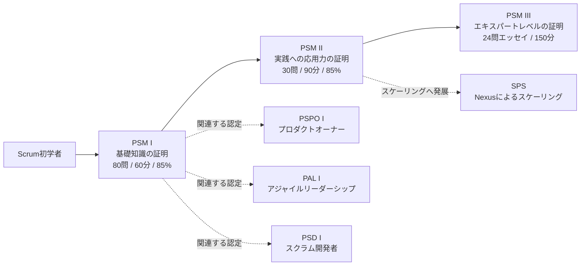
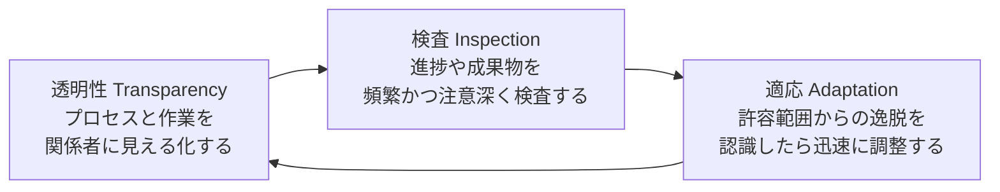
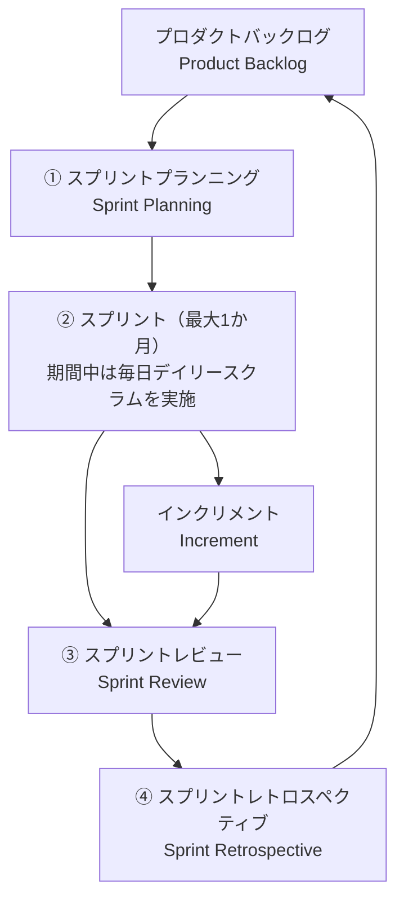
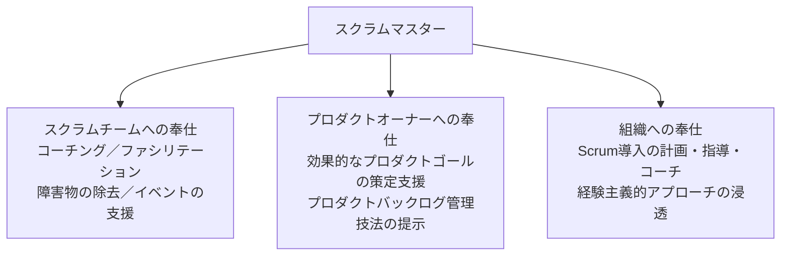
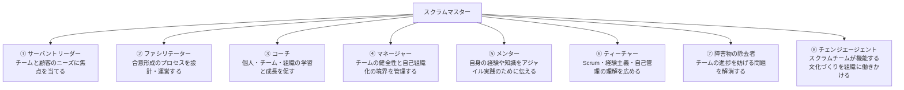
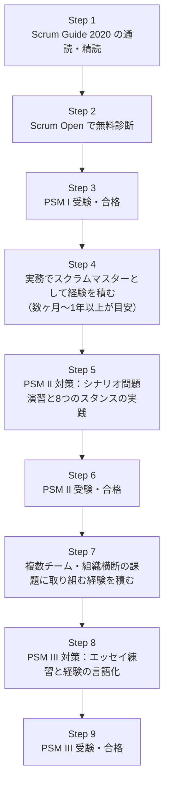

# Professional Scrum Master™（PSM）認定ガイド

**初学者のためのステップバイステップ解説とベストプラクティス集**

> 本ガイドは Scrum.org が提供する **Professional Scrum Master™ Assessments**（PSM I / PSM II / PSM III）を対象に、Scrum の理論的基盤から各アセスメントの出題範囲・学習戦略までを体系的に解説するものです。すべての図解は Mermaid、比較情報はすべて Markdown テーブルで表現しています。
>
> 参照元: [Professional Scrum Master Assessments（Scrum.org）](https://www.scrum.org/professional-scrum-certifications/professional-scrum-master-assessments)

---

## 目次

1. [PSM認定の全体像](#1-psm認定の全体像)
2. [スクラムの理論的基盤](#2-スクラムの理論的基盤)
3. [スクラムチームと3つのアカウンタビリティ](#3-スクラムチームと3つのアカウンタビリティ)
4. [スクラムイベント](#4-スクラムイベント)
5. [スクラムの作成物とコミットメント](#5-スクラムの作成物とコミットメント)
6. [スクラムマスターの役割とサーバントリーダーシップ](#6-スクラムマスターの役割とサーバントリーダーシップ)
7. [よくあるアンチパターンと対処法](#7-よくあるアンチパターンと対処法)
8. [PSM I 試験対策](#8-psm-i-試験対策)
9. [PSM II 試験対策](#9-psm-ii-試験対策)
10. [PSM III 試験対策](#10-psm-iii-試験対策)
11. [スケーリングへの橋渡し（Nexus）](#11-スケーリングへの橋渡しnexus)
12. [学習ロードマップ](#12-学習ロードマップ)
13. [参考文献・出典](#13-参考文献出典)

---

## 1. PSM認定の全体像

### 1.1 PSMとは何か

Professional Scrum Master™（PSM）は、Scrum の共同考案者 Ken Schwaber が設立した **Scrum.org** が提供する認定制度です。CSM（Certified ScrumMaster、Scrum Alliance）が主に「研修への出席」によって認定されるのに対し、PSM は **知識と理解度を問う試験に合格すること** で認定される点が最大の特徴です。研修の受講は必須ではなく、独学でも受験・合格が可能です。

PSM ファミリーには難易度別に3段階のアセスメントがあります。

- **PSM I**：Scrum フレームワークの基礎知識とスクラムマスターのアカウンタビリティの理解を証明する
- **PSM II**：組織内で Scrum を実践し、応用する高度な能力を証明する
- **PSM III**：複数チーム・複雑な組織状況においてスクラムマスタリーを体現する、エキスパートレベルの能力を証明する

### 1.2 資格比較表

| 項目 | PSM I | PSM II | PSM III |
|---|---|---|---|
| 難易度 | 基礎（Fundamental） | 応用（Advanced） | エキスパート（Expert） |
| 受験料 | $200 USD | $250 USD | $500 USD |
| 制限時間 | 60分 | 90分 | 150分（2.5時間） |
| 問題数 | 80問 | 30問（一部部分点あり） | 24問（エッセイ形式のみ） |
| 出題形式 | 択一式・複数選択・True/False | 択一式・複数選択・True/False | エッセイ（記述式）のみ、貼り付け不可・手入力必須 |
| 合格基準 | 85% | 85% | 採点担当者による Pass / Did Not Pass 判定 |
| 採点方法 | 即時自動採点 | 即時自動採点 | Scrum専門家チームによる手動採点（結果通知まで約4週間） |
| 前提資格 | なし | なし（PSM I 取得が推奨） | なし（PSM II 取得が推奨） |
| 有効期限 | なし（生涯有効） | なし（生涯有効） | なし（生涯有効） |
| 対応言語 | 英語・日本語・簡体字中国語（scrum.org.cn 経由） | 英語のみ | 英語のみ |
| デジタル資格 | Credly バッジ付与 | Credly バッジ付与 | Credly バッジ付与 |

> 出典: [PSM I 公式ページ](https://www.scrum.org/assessments/professional-scrum-master-i-certification)、[PSM II 公式ページ](https://www.scrum.org/assessments/professional-scrum-master-ii-certification)、[PSM III 公式ページ](https://www.scrum.org/assessments/professional-scrum-master-iii-certification)

### 1.3 認定パスの全体図

### 1.4 その他の関連アセスメント（参考）

PSM I・II・III はスクラムマスターのコアパスですが、Scrum.org は役割や専門テーマに応じて複数のアセスメントを用意しています。実務で PSM と併せて検討されることが多いものを簡単に紹介します（詳細は各アセスメントの個別ガイドを参照してください）。

| アセスメント | 対象 |
|---|---|
| PSPO I / II（Professional Scrum Product Owner） | プロダクトオーナーとしての価値最大化の知識 |
| PSD I（Professional Scrum Developer） | Scrum チームにおける開発者としての技術プラクティス |
| PAL I（Professional Agile Leadership I） | 組織のリーダー層に向けたアジャイルリーダーシップ |
| PSU I（Professional Scrum with User Experience） | UX とスクラムの統合 |
| SPS（Scaled Professional Scrum） | Nexus フレームワークによる複数チームのスケーリング |

---

## 2. スクラムの理論的基盤

PSM 試験全体を通じて最も重要な前提知識が「経験主義（Empiricism）」です。Scrum は経験主義とリーン思考の考え方に基づいた軽量級フレームワークであり、PSM I の設問の多くはこの理論を正しく理解しているかを問う形で出題されます。

### 2.1 経験主義の3本柱

経験主義とは、「知識は経験から生まれ、意思決定は観察されたものに基づいて行われる」という考え方です。Scrum ではこれを支える3つの柱が定義されています。

| 柱 | 説明 | ベストプラクティス |
|---|---|---|
| 透明性 | プロセスの重要な側面が、それを見る人たちに対して見える必要がある。透明性がなければ検査は誤解を招き、適応の判断も誤る | 「完成」の定義を全員が共有する／進捗を隠さず可視化するボードや指標を使う／悪いニュースほど早く共有する文化を作る |
| 検査 | スクラムの成果物と、ゴールに向けた進捗を頻繁かつ注意深く検査し、望ましくない変化や問題を検知する | デイリースクラムやスプリントレビューを形骸化させず、実際の作業状況を突き合わせる／検査しすぎて作業の妨げにならないバランスを取る |
| 適応 | プロセスや作成される素材が許容範囲を逸脱していると検査で判断された場合、できるだけ早く調整しなければならない | レトロスペクティブでの気づきを次のスプリントで実際に試す／検査結果を無視せず、迅速にプロセスや計画を見直す |

### 2.2 スクラムの5つの価値基準

Scrum チームが経験主義とリーン思考の考え方を実践する際に拠り所とするのが、以下の5つの価値基準です。PSM I では単なる暗記ではなく、「この状況はどの価値基準が損なわれているか」を問う応用問題として出題される傾向があります。

| 価値基準 | 意味 | 体現するベストプラクティス |
|---|---|---|
| 確約（Commitment） | ゴールの達成に人々が個人としてコミットする | スプリントゴールを全員で合意し、達成に向けてチーム全体で責任を持つ |
| 集中（Focus） | スプリントの作業とスクラムチームのゴールに集中する | WIP（仕掛り作業）を制限し、並行作業を減らす |
| 公開（Openness） | スクラムチームとステークホルダーが、作業や課題について公開する | 問題や遅れを隠さず、スプリントレビューで率直にステークホルダーへ共有する |
| 尊敬（Respect） | スクラムチームのメンバーが、互いに能力があり自立した人間であると認め合う | 意見の相違を人格攻撃にせず、専門性や自律性を尊重する対話をする |
| 勇気（Courage） | スクラムチームのメンバーが、正しいことをする勇気や、困難な問題に取り組む勇気を持つ | 「できない」と言うべきときに言う、対立を避けずに建設的に指摘する |

---

## 3. スクラムチームと3つのアカウンタビリティ

### 3.1 スクラムチームの基本原則

Scrum Guide 2020 では、それまでの「開発チーム（Development Team）」と「スクラムチーム」という二重構造が廃止され、**プロダクトオーナー・スクラムマスター・開発者から構成される単一の「スクラムチーム」** という考え方に統一されました。これは「チームの中のチーム」という対立構造をなくすための重要な改訂です。

主な原則は以下の通りです。

- 小規模である（一般的に10名以下が目安とされる）
- 職能横断的（Cross-functional）であり、チーム外に依存せず価値を生み出せる
- 自己管理型（Self-managing）であり、誰が・どのように・何に取り組むかをチーム内で決定する
- 1つのプロダクトに全体で集中する

### 3.2 3つのアカウンタビリティ比較表

| アカウンタビリティ | 主な責任 | 焦点 |
|---|---|---|
| プロダクトオーナー（Product Owner） | プロダクトの価値を最大化することに責任を持つ。プロダクトゴールの策定、プロダクトバックログの管理（作成・並び替え・透明性の確保）を担う | Why / What（何を作るべきか） |
| スクラムマスター（Scrum Master） | スクラムの理論・プラクティスの理解とその実践をチームおよび組織全体に浸透させる責任を持つ。真のリーダーとしてスクラムチームと組織に奉仕する | How（どうスクラムを機能させるか） |
| 開発者（Developers） | スプリントごとに使用可能なインクリメントの一部を作成することにコミットする。計画作成、品質基準の遵守、日々の計画の適応を行う | How（どう作るか） |

### 3.3 よくある誤解

| 誤解 | 正しい理解 |
|---|---|
| プロダクトオーナーは要求を右から左に伝える「代理人（プロキシPO）」でよい | プロダクトオーナーは価値最大化の意思決定権を持つ、単一の説明責任者でなければならない |
| スクラムマスターはプロジェクトマネージャーやチームリーダーである | スクラムマスターには管理権限がなく、サーバントリーダーとしてチームと組織に奉仕する存在である |
| 開発者は「実装だけする人」であり、計画やプロセス改善には関与しなくてよい | 開発者はスプリント計画、Done基準の遵守、日々の進捗適応すべてに責任を持つ自己管理チームの一員である |

---

## 4. スクラムイベント

Scrum には無駄を減らし、透明性を確保するための5つのイベント（Sprint を含む）があります。すべてタイムボックス化されており、必要以上に長くならないよう設計されています。

### 4.0 スプリントサイクル全体図

### 4.1 スプリント（Sprint）

すべてのイベントを内包する「コンテナイベント」。1か月以内の固定された長さで、アイデアを価値に変換する一貫性のある機会を作ります。

| 項目 | 内容 |
|---|---|
| タイムボックス | 1か月以内（通常1〜4週間、多くの現場では2週間） |
| 目的 | 一貫した学習と価値提供のリズムを作る |
| 重要な原則 | スプリント中はスプリントゴールを危険にさらすような変更はしない／品質目標を下げない／スコープはプロダクトオーナーと開発者の間で明確化し、再交渉し続けてよい |

**ベストプラクティス**
- スプリント期間は固定し、途中で安易に延長・短縮しない（リズムの崩壊はチームの学習サイクルを乱す）
- スプリントゴールが陳腐化した（obsolete になった）場合にのみスプリントのキャンセルを検討する。キャンセルの権限を持つのはプロダクトオーナーだけである（頻発する場合は計画の粒度を見直す）
- スプリント開始・終了日を固定し、カレンダーで関係者に周知する

### 4.2 スプリントプランニング（Sprint Planning）

| トピック | 問い | 主な参加者 |
|---|---|---|
| トピック1：Why（このスプリントが価値を持つ理由） | なぜこのスプリントは価値があるのか | プロダクトオーナーが提案し、チーム全体で合意 |
| トピック2：What（今スプリントで何を完成させるか） | 何を「完成」とするのか | 開発者が主導し、プロダクトオーナーと対話 |
| トピック3：How（選択した作業をどう成し遂げるか） | どのように作業を成し遂げるか | 開発者が計画する |

**ベストプラクティス**
- タイムボックスは1か月スプリントで最大8時間（期間が短ければ比例して短縮）
- 「トピック1（Why）」を省略し、いきなりタスク分解から入らない（スプリントゴールなき計画は形骸化しやすい）
- スプリントゴールは1文で言い切れるレベルまでシンプルにする

### 4.3 デイリースクラム（Daily Scrum）

| 項目 | 内容 |
|---|---|
| タイムボックス | 15分 |
| 目的 | スプリントゴールに向けた進捗を検査し、翌24時間の計画を適応させる |
| 参加者 | 開発者（Scrum Guide 2020 以降、進行の義務は開発者にある） |

**ベストプラクティス**
- 「昨日やったこと・今日やること・障害物」という3つの質問形式は必須ではなく、チームに合った形式に適応してよい
- スクラムマスターへの「進捗報告会」にしない（あくまでチームが自分たちのために行う検査と適応の場）
- 議論が必要な話題は「駐車場（Parking Lot）」に出し、デイリースクラム後に関係者だけで別途話し合う

### 4.4 スプリントレビュー（Sprint Review）

| 項目 | 内容 |
|---|---|
| タイムボックス | 1か月スプリントで最大4時間 |
| 目的 | インクリメントを検査し、プロダクトバックログを適応させる。単なるデモではなく、ステークホルダーとの共同作業セッション |

**ベストプラクティス**
- 「発表会」ではなく「ワーキングセッション」として設計する（フィードバックを引き出す双方向の対話にする）
- 市場動向・予算・想定タイムライン・競合状況など、プロダクトバックログを取り巻く状況も一緒に検査する
- 完成していないものはデモしない（「完成の定義」を満たしたものだけを提示する）

### 4.5 スプリントレトロスペクティブ（Sprint Retrospective）

| 項目 | 内容 |
|---|---|
| タイムボックス | 1か月スプリントで最大3時間 |
| 目的 | 品質と効果を高める方法を計画する。個人・相互作用・プロセス・ツール・完成の定義について検査する |

**ベストプラクティス**
- 代表的なファシリテーション手法：KPT（Keep/Problem/Try）、Start-Stop-Continue、セイルボート（Sailboat）などを状況に応じて使い分ける
- 出てきた改善アクションのうち最もインパクトが大きいものに絞り、次のスプリントバックログに組み込む
- 「犯人探し」にせず、心理的安全性を保つグラウンドルールを最初に共有する

---

## 5. スクラムの作成物とコミットメント

各作成物には、進捗を測るための透明性を高める「コミットメント」が対応付けられています。

| 作成物 | コミットメント | 表すもの |
|---|---|---|
| プロダクトバックログ | プロダクトゴール（Product Goal） | プロダクトの将来の状態、中長期の目的地 |
| スプリントバックログ | スプリントゴール（Sprint Goal） | このスプリントで達成する単一の目的 |
| インクリメント | 完成の定義（Definition of Done） | 成果物がプロダクトに求められる品質基準を満たしているかの検証可能な条件 |

### 5.1 プロダクトバックログ & プロダクトゴール

プロダクトバックログは、プロダクトを改善するために必要なものを含む、創発的で並び替え可能なリストです。プロダクトゴールはプロダクトバックログの長期的な目的地であり、次に達成すべき単一のターゲットです。

**ベストプラクティス**：定期的なリファインメント（洗練）を通じて、直近のアイテムほど詳細で見積り可能な状態を保つ。プロダクトゴールを達成するまでは、次のゴールに着手しない。

### 5.2 スプリントバックログ & スプリントゴール

スプリントバックログは、スプリントゴール（Why）・選択されたプロダクトバックログアイテム（What）・インクリメントを届けるための実行可能な計画（How）から構成されます。

**ベストプラクティス**：スプリントバックログはスプリント中に開発者がリアルタイムで更新する「生きた計画」として扱う。作り込みすぎた事前計画に固執しない。

### 5.3 インクリメント & 完成の定義

インクリメントは、これまでのすべてのインクリメントの合計であり、完成の定義を満たした具体的な足がかりです。複数のインクリメントがスプリント内で生まれることもあります。

**ベストプラクティス**：組織全体の標準がある場合、完成の定義はそれを下回ってはならない（下回る場合は「リリース可能」と呼べない）。スクラムチームに完成の定義が存在しない場合、開発者がプロダクトに適した完成の定義を作成しなければならない。

---

## 6. スクラムマスターの役割とサーバントリーダーシップ

PSM 試験群の核心テーマです。スクラムマスターは、スクラムの理論とプラクティスの理解と実践を、スクラムチームおよび組織全体に確立する責任を負う **真のリーダー（true leader）** と定義されます。管理権限を持つマネージャーではなく、奉仕を通じて影響力を発揮する存在です。

### 6.1 3つの奉仕対象

| 奉仕対象 | 具体的な支援内容 |
|---|---|
| スクラムチーム | 自己管理を指導する／障害物を取り除く／すべてのスクラムイベントが前向きかつ生産的でタイムボックス内に収まるよう支援する |
| プロダクトオーナー | 効果的なプロダクトゴールの定義とプロダクトバックログ管理の方法を探すことを支援する／明確で簡潔なプロダクトバックログアイテムの必要性をチームに理解してもらう／長期的なプロダクト計画を組織内の文脈で理解してもらう |
| 組織 | 組織へのスクラム導入を指導・トレーニング・コーチする／組織におけるスクラムの実施方法を計画・助言する／ステークホルダーとスクラムチームの間の障壁を取り除く |

### 6.2 サーバントリーダーシップとは

サーバントリーダーシップとは「まず奉仕し、その結果として導く」という考え方です。地位や権限による統制ではなく、信頼・尊敬・影響力によってチームと組織を動かします。アジャイル宣言の背後にある原則のうち、「動機づけられた人々を中心にプロジェクトを構築する。彼らが必要とする環境と支援を与え、仕事が無事終わるまで彼らを信頼する」という一節は、この考え方と深く結びついています。

### 6.3 スクラムマスターの8つのスタンス

Scrum.org の Professional Scrum Trainer である Barry Overeem が提唱した、実務上の振る舞いの型が「8つのスタンス」です。公式試験の出題範囲そのものではありませんが、Scrum.org のリソースとして公開されており、PSM II・III で問われる「状況に応じた振る舞いの使い分け」を理解する上で広く参照されています。

| スタンス | 発揮される場面の例 | ベストプラクティス |
|---|---|---|
| サーバントリーダー | チームが困難な決断を迫られている場面 | 自分の意見を押し付けず、チームが最善の判断を下せるよう支援に徹する |
| ファシリテーター | スプリントレビューやレトロスペクティブの進行 | 中立的な立場を保ち、特定の意見に偏らない進行技法（サイレントブレインストーミングなど）を使う |
| コーチ | チームが同じ問題を繰り返している場面 | 答えを与えず、問いかけによって気づきを引き出す（コーチングとティーチングを混同しない） |
| マネージャー | チームの自己組織化の境界を定める必要がある場面 | 「何を管理し、何をチームに委ねるか」の境界を明確にし、過干渉を避ける |
| メンター | 経験の浅いメンバーがアジャイルプラクティスに悩んでいる場面 | 自身の経験を一方的に語らず、相手の状況に合わせて選択的に共有する |
| ティーチャー | 組織全体がスクラムの原則を誤解している場面 | Scrum Guide に立ち返り、具体例を用いて経験主義の考え方を分かりやすく伝える |
| 障害物の除去者 | チーム外の要因（承認プロセスの遅延など）で進捗が止まっている場面 | チームが自力で解決できる障害物とスクラムマスターが介入すべき障害物を見極める |
| チェンジエージェント | 組織構造がスクラムチームの自己管理を阻害している場面 | 一足飛びの改革を狙わず、影響力の輪の中から小さな変化を積み重ねる |

### 6.4 ファシリテーション技法のベストプラクティス

- **発散と収束を意識する**：ブレインストーミングなど意見を広げるフェーズと、優先順位付けなど収束させるフェーズを明確に分ける
- **サイレントスタート**：発言力の強い人の意見に引きずられないよう、まず個人で書き出す時間を設けてから共有する
- **タイムボックスの可視化**：残り時間をタイマーで共有し、議論の停滞を防ぐ
- **決定事項の記録**：合意した内容とネクストアクションを必ず明文化し、次のイベントで検査できるようにする

### 6.5 コーチング・メンタリング・ティーチングの違い

| アプローチ | 焦点 | 進め方 |
|---|---|---|
| コーチング（Coaching） | 相手の中にある答えを引き出す | 問いかけを中心とし、直接的な助言は控える |
| メンタリング（Mentoring） | 自身の経験を伝える | 実体験や知見を共有し、相手の意思決定を支援する |
| ティーチング（Teaching） | 知識やスキルを教える | 明確な答えのある事柄について体系的に説明する |

### 6.6 障害物（Impediment）除去のベストプラクティス

1. **可視化する**：障害物リストを作り、チーム全員が状況を把握できるようにする
2. **切り分ける**：チームが自力で解決できるものと、スクラムマスターの介入が必要なものを区別する
3. **優先順位をつける**：スプリントゴールの達成に対するインパクトの大きさで対応順を決める
4. **エスカレーションする**：組織的な障害物は、権限を持つステークホルダーへ適切に働きかける
5. **再発防止を検討する**：レトロスペクティブで根本原因を扱い、同じ障害物が繰り返し発生しない仕組みを作る

---

## 7. よくあるアンチパターンと対処法

PSM II・III では、以下のようなアンチパターンをシナリオ問題の中で見抜けるかが問われます。

| アンチパターン | 症状 | スクラムマスターの対処 |
|---|---|---|
| ScrumBut | 「Scrumをやっているが、○○の部分だけは違う」という部分適用により経験主義が機能しなくなる状態 | なぜそのプラクティスが必要なのかを説明し、逸脱によるリスクを透明化する |
| Zombie Scrum | イベントの形式だけをこなし、検査と適応による実質的な価値創出が起きていない状態 | 各イベントの「目的」に立ち返り、形骸化した儀式ではなく本来の意図を取り戻す |
| ウォーターマロン・ステータス | 表面上（緑）は順調に見えるが、内部（赤）は問題だらけの報告 | 定性的な自己申告だけでなく、実際のインクリメントや検証可能な指標で進捗を確認する |
| ミニウォーターフォール・スプリント | スプリント内で「設計→開発→テスト」を順番に行い、最終盤にまとめてテストする | スプリント内で継続的に統合・テストを行う技術プラクティス（CI/CDなど）の導入を支援する |
| スクラムマスター＝書記・秘書化 | 議事録係やスケジュール調整係に終始し、本来のコーチング・ファシリテーションの役割を果たしていない | 自身の役割を「サーバントリーダー」として再定義し、雑務は他のメンバーと分担する |
| プロキシプロダクトオーナー | POが意思決定権を持たず、上位の承認待ちで判断が遅延する | POが実際に意思決定できる権限を持てるよう、組織に働きかける |

---

## 8. PSM I 試験対策

### 8.1 試験概要

| 項目 | 内容 |
|---|---|
| 受験料 | $200 USD／回 |
| 制限時間 | 60分 |
| 問題数 | 80問 |
| 出題形式 | 択一式・複数選択・True/False |
| 合格基準 | 85%（68/80問） |
| 難易度 | 基礎（Fundamental） |
| 主な参照資料 | Scrum Guide 2020（全13ページ） |

出典：[PSM I 公式ページ](https://www.scrum.org/assessments/professional-scrum-master-i-certification)

### 8.2 主な出題範囲

- スクラムの理論（経験主義・リーン思考・3本柱・5つの価値基準）
- スクラムチームとアカウンタビリティ（PO・SM・開発者）
- 5つのスクラムイベントの目的・タイムボックス・参加者
- 3つの作成物と3つのコミットメント
- スクラムマスターのアカウンタビリティと組織への奉仕
- Scrum Guide 内の正確な用語・定義（「must」と「should」の違いに注意）

### 8.3 出題傾向の例（オリジナル作成の演習問題）

> 以下は本ガイド独自に作成した練習問題であり、実際の試験問題そのものではありません。出題の「雰囲気」をつかむための例としてご利用ください。

**Q. スプリントレビューの説明として最も適切なものはどれか（複数選択）。**

- A. プロダクトオーナーだけが参加する社内報告会である
- B. インクリメントを検査し、プロダクトバックログを適応させるための共同作業セッションである
- C. 未完成の作業も進捗として発表してよい
- D. スプリントレビューの結果、プロダクトバックログが更新されることがある

解答例と解説

正解は B と D です。スプリントレビューは単なる報告会ではなく、ステークホルダーとスクラムチームが共同で検査と適応を行う場です。完成の定義を満たしていない作業物は提示すべきではありません（Cは誤り）。

### 8.4 学習ステップ（5ステップ）

1. **Scrum Guide 2020 を通読する**：まずは全体像を掴むために最初から最後まで一読する
2. **精読して用語を正確に覚える**：「must」「should」「may」などの助動詞のニュアンスの違いに注意しながら再読する
3. **Scrum Open（無料の練習問題）を解く**：Scrum.org が無料公開している Scrum Open で理解度を確認する
4. **間違えた箇所を Scrum Guide に立ち返って確認する**：暗記でなく、なぜその答えになるのかを Guide の文言で確認する
5. **時間配分の練習をする**：80問を60分で解くため、1問あたり45秒程度のペース感覚を模擬試験で養う

### 8.5 受験当日のベストプラクティス

- 迷った問題は一旦保留し、確実に分かる問題から解答して時間切れを防ぐ
- 「best」「most appropriate」のような相対評価を求める設問では、消去法で明確に誤っている選択肢を除外する
- 複数選択（Multiple Answer）は、選択数が指定される場合があるため見落とさない
- 減点方式ではないため、分からない問題でも必ず何かを選択して解答する

---

## 9. PSM II 試験対策

### 9.1 試験概要

| 項目 | 内容 |
|---|---|
| 受験料 | $250 USD／回 |
| 制限時間 | 90分 |
| 問題数 | 30問（一部の設問に部分点あり） |
| 出題形式 | 択一式・複数選択・True/False |
| 合格基準 | 85%（26/30問相当） |
| 難易度 | 応用（Advanced） |

出典：[PSM II 公式ページ](https://www.scrum.org/assessments/professional-scrum-master-ii-certification)

### 9.2 PSM I との違い

PSM I が「Scrum フレームワークを理解しているか」を問うのに対し、PSM II は「変化を望まない組織の中で、実際に Scrum を適用できるか」を問う、シナリオベースの試験です。ある学習リソースでは、出題トピックのうちフレームワーク自体に関するものは一部にとどまり、残りの多くはセルフマネジメント・リーダーシップスタイル・ファシリテーション・コーチング・メンタリング・プロダクトバックログマネジメント・ステークホルダー対応・技術的リスク・組織設計といった応用テーマに及ぶと分析されています。

> 出典（非公式の分析記事）：[PSM II Is Not a Harder Version of PSM I（certificationbox.com）](https://www.certificationbox.com/2026/09/04/psm-ii-scrum-master-assessment-people-focus/)

**PSM II で特に重視される周辺知識**

| テーマ | 学習のポイント |
|---|---|
| リーダーシップスタイル | 指示型・コーチ型・支援型・委任型など、チームの成熟度に応じてスタイルを使い分ける考え方（Situational Leadershipなど）を理解する |
| チームの発達段階 | フォーミング・ストーミング・ノーミング・パフォーミングといったチーム形成のモデル（Tuckmanモデル等）を理解し、各段階でスクラムマスターが果たす役割を考える |
| コンフリクトマネジメント | チーム内外の対立を回避するのではなく、建設的に扱うファシリテーション技法 |
| 組織設計 | コンウェイの法則（組織構造がシステム設計に影響する）などを踏まえ、チームトポロジーがスクラムチームの自己管理に与える影響を考える |

> 上記の周辺理論は Scrum Guide そのものには明記されていない補助的な知識ですが、PSM II の対策コースや学習コミュニティで広く参照されています。

### 9.3 学習ステップ

1. PSM I の内容を完全に定着させる（PSM II はその上に応用力を積む試験）
2. シナリオ問題を数多く解き、「正しいスクラムマスターの振る舞い」を選ぶ感覚を養う
3. 8つのスタンスを状況ごとに使い分ける練習をする（本ガイド第6章参照）
4. 実務経験を棚卸しし、過去に経験したチームの課題をスクラムの原則に照らして振り返る
5. 90分で30問というペース（1問あたり平均3分）に慣れるため、じっくり読む練習をする

### 9.4 出題傾向の例（オリジナル作成の演習問題）

> 以下は本ガイド独自に作成した練習問題であり、実際の試験問題そのものではありません。

**Q. 開発者たちがデイリースクラムをスクラムマスターへの進捗報告の場として運用している。スクラムマスターが最初に取るべき行動として最も適切なものはどれか。**

- A. デイリースクラムの進行を自分が引き継ぎ、報告形式を維持する
- B. デイリースクラムの目的（自己管理による24時間先の計画の適応）についてチームと対話し、本来の姿に気づいてもらう
- C. デイリースクラム自体を廃止する
- D. プロダクトオーナーに報告するよう指示を変更する

解答例と解説

正解は B です。スクラムマスターは答えを一方的に押し付けるのではなく、チーム自身が本来の目的に気づき、自己管理として運用を改善できるよう対話とコーチングで支援します。

---

## 10. PSM III 試験対策

### 10.1 試験概要

| 項目 | 内容 |
|---|---|
| 受験料 | $500 USD／回 |
| 制限時間 | 150分（2.5時間） |
| 問題数 | 24問（すべてエッセイ形式） |
| 出題形式 | 記述式のみ。すべて自分でタイプ入力する必要があり、事前に用意した文章の貼り付けは不可 |
| 採点方法 | Scrum専門家チームによる手動採点。各回答は基準を満たす／上回る／満たさないで評価され、全体として合否が判定される |
| 合否判定結果の通知 | 採点完了まで約4週間 |
| 難易度 | エキスパート（Expert） |

出典：[PSM III 公式ページ](https://www.scrum.org/assessments/professional-scrum-master-iii-certification)

### 10.2 エッセイ対策のベストプラクティス

- **時間配分を事前に決める**：24問を150分で解くため、1問あたり平均6分強。長さより「要点が明確な回答」を優先する
- **Scrum Guide の用語を正確に使う**：独自の言い回しではなく、Guide に定義された用語（アカウンタビリティ、コミットメント等）を正確に使用する
- **実体験に基づいて具体的に書く**：抽象論だけでなく、複数チームや複雑な組織状況にどう向き合ったかの経験に基づいた記述が評価されやすい
- **箇条書きを活用する**：文章力より論理構成の明確さが重視されるため、要点を箇条書きで整理して書く
- **表現の正確さより本質を優先する**：文法や誤字は採点基準ではないため、時間を文章の推敲よりも内容の充実に使う

### 10.3 学習ステップ

1. PSM II までの知識を完全に体系化する
2. 複数チーム・複雑な組織における「システミックな障害物」の解消経験を言語化しておく
3. サンプルのエッセイ問題（Scrum.org フォーラムや実践者のブログで共有されているもの）を実際に時間を計って書いてみる
4. 書いた回答を Scrum Guide の原則と照らし合わせ、逸脱がないか自己レビューする
5. 可能であれば同じ資格を持つ実践者コミュニティにレビューを依頼する

---

## 11. スケーリングへの橋渡し（Nexus）

PSM III で扱われる「複数チーム・複雑な組織状況」の理解を深めるうえで、Scrum.org が提供する **Nexus フレームワーク** の知識が役立ちます。Nexus は Scrum を最小限に拡張し、約3〜9個のスクラムチームが単一のプロダクトバックログから統合されたインクリメントを届けられるようにするためのフレームワークです。Nexus 自体を体系的に学ぶ場合は、Scaled Professional Scrum（SPS）認定の学習が推奨されます。

出典：[Scaled Professional Scrum™ Certification（Scrum.org）](https://www.scrum.org/assessments/scaled-professional-scrum-certification)

---

## 12. 学習ロードマップ

以下は、初学者が PSM I 合格からスクラムマスターとしての実務経験を積み、PSM II・III へとステップアップしていく際の標準的な流れです。

**各ステップにおけるベストプラクティス**

- Step 1〜3：暗記ではなく「なぜそう定義されているのか」を理解することに時間をかける
- Step 4：資格取得だけで終わらせず、実際のスクラムイベントで8つのスタンスを意識的に使い分ける
- Step 5〜6：過去の実務経験を「Scrum Guide の原則に照らすとどう説明できるか」という視点で棚卸しする
- Step 7〜9：複数チームを跨いだ障害物解消やチェンジエージェントとしての働きかけの経験を、具体的なエピソードとして言語化しておく

---

## 13. 参考文献・出典

### 一次情報源（Scrum.org / 公式スクラムガイド）

- [Professional Scrum Master Assessments 概要ページ](https://www.scrum.org/professional-scrum-certifications/professional-scrum-master-assessments)
- [PSM I 認定ページ](https://www.scrum.org/assessments/professional-scrum-master-i-certification)
- [PSM II 認定ページ](https://www.scrum.org/assessments/professional-scrum-master-ii-certification)
- [PSM III 認定ページ](https://www.scrum.org/assessments/professional-scrum-master-iii-certification)
- [Scaled Professional Scrum™ Certification（Nexus）](https://www.scrum.org/assessments/scaled-professional-scrum-certification)
- [The 8 Stances of a Scrum Master（Barry Overeem, Scrum.org）](https://www.scrum.org/resources/8-stances-scrum-master)
- [Scrum Guide 2020（英語版・公式）](https://scrumguides.org/scrum-guide.html)
- [スクラムガイド 2020年11月版（日本語版・公式PDF）](https://scrumguides.org/docs/scrumguide/v2020/2020-Scrum-Guide-Japanese.pdf)

### 補足情報源（非公式の学習・分析リソース）

- [PSM II Is Not a Harder Version of PSM I（certificationbox.com）](https://www.certificationbox.com/2026/09/04/psm-ii-scrum-master-assessment-people-focus/)
- [How To Pass The Professional Scrum Master II (PSM II) Assessment（TheScrumMaster.co.uk）](https://www.thescrummaster.co.uk/scrum/how-to-pass-the-professional-scrum-master-ii-psm-ii-assessment-from-scrum-org/)
- [How To Pass The Professional Scrum Master III (PSM III) Assessment（TheScrumMaster.co.uk）](https://www.thescrummaster.co.uk/scrum/how-to-pass-the-professional-scrum-master-iii-psm-iii-assessment-from-scrum-org/)

> 注記：本ガイド中の演習問題（第8章・第9章）はすべて筆者が独自に作成したオリジナル問題であり、Scrum.org の実際の試験問題を再現したものではありません。試験対策としては、必ず一次情報源である Scrum Guide 本文および公式アセスメントページを確認してください。また、PSM II・III の「非公式の学習・分析リソース」に基づく内容（第9章のリーダーシップスタイル等）は、Scrum Guide 本体には明記されていない補助的な知見である点にご留意ください。
