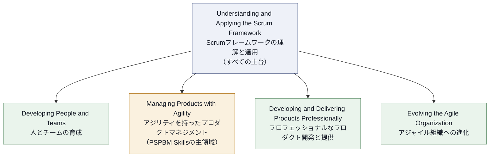
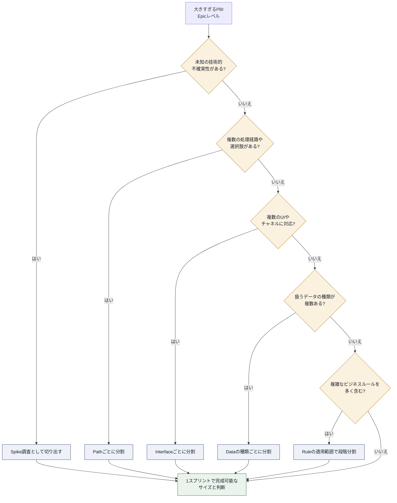
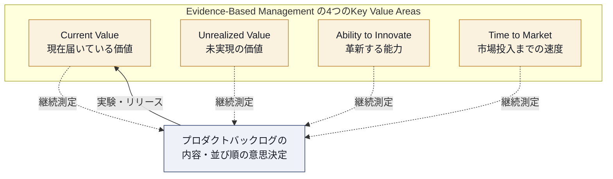

# Professional Scrum Product Backlog Management Skills™（PSPBM）認定 完全学習ガイド

> 対象読者：Scrum Master・Product Owner・ビジネスアナリスト・開発者など、プロダクトバックログの取り扱いを体系的に学びたいすべての初学者
> 出題範囲の一次情報：[scrum.org — Professional Scrum Product Backlog Management Skills Certification](https://www.scrum.org/assessments/professional-scrum-product-backlog-management-skills-certification)

---

## 目次

0. [本ガイドについて](#0-本ガイドについて)
1. [認定試験の概要](#1-認定試験の概要)
2. [Professional Scrum Competencies™ フレームワーク](#2-professional-scrum-competencies-フレームワーク)
3. [Chapter 1：プロダクトバックログとは何か](#chapter-1プロダクトバックログとは何か)
4. [Chapter 2：プロダクトビジョンとプロダクトゴール](#chapter-2プロダクトビジョンとプロダクトゴール)
5. [Chapter 3：プロダクトバックログの形成（Forming）](#chapter-3プロダクトバックログの形成forming)
6. [Chapter 4：リファインメント（Refinement）](#chapter-4リファインメントrefinement)
7. [Chapter 5：並び替えと優先順位付け（Ordering）](#chapter-5並び替えと優先順位付けordering)
8. [Chapter 6：ステークホルダーとカスタマーとの協働](#chapter-6ステークホルダーとカスタマーとの協働)
9. [Chapter 7：経験主義とEvidence-Based Managementによる価値最大化](#chapter-7経験主義とevidence-based-managementによる価値最大化)
10. [Chapter 8：AI時代のプロダクトバックログマネジメント](#chapter-8ai時代のプロダクトバックログマネジメント)
11. [Chapter 9：よくある誤解とアンチパターン](#chapter-9よくある誤解とアンチパターン)
12. [Chapter 10：試験対策のポイント](#chapter-10試験対策のポイント)
13. [用語集](#用語集)
14. [参考文献・ソースURL一覧](#参考文献ソースurl一覧)

---

## 0. 本ガイドについて

このガイドは、Scrum.org が提供する **Professional Scrum Product Backlog Management Skills™（PSPBM Skills）** 認定試験の出題領域を、初学者でも段階的に理解できるよう再構成した学習教材です。各章は以下の3要素で構成しています。

- **概念解説**：Scrum Guide および Scrum.org 公式リソースに基づく定義
- **ベストプラクティス**：実務で使われている具体的な技法・進め方
- **ソース**：各主張の根拠となる一次・準一次情報のURL

> **注意：** PSPBM Skills は Scrum Guide の知識に加え、Scrum.org が公開する **Professional Scrum Competencies** の一部領域を出題範囲として明示的に参照する試験です。単なる用語暗記ではなく、「プロダクトバックログをどう形成し、リファインし、並び替え、ステークホルダーと協働しながら価値を最大化するか」という実践スキルが問われます。

---

## 1. 認定試験の概要

### 1.1 試験基本情報

| 項目 | 内容 |
|---|---|
| 正式名称 | Professional Scrum Product Backlog Management Skills™（PSPBM Skills） |
| 提供元 | Scrum.org |
| 初回提供開始日 | 2023年9月27日 |
| 難易度レベル | Intermediate（中級） |
| 出題形式 | 選択式（Multiple Choice）、英語のみ |
| 問題数 | 20問 |
| 制限時間 | 30分 |
| 合格基準 | 85%以上の正答率 |
| 受験形式 | オンライン、受験者が任意の場所・タイミングで受験可能（試験会場への訪問は不要） |
| 有効期限 | 受験権利（アセスメント）そのものに有効期限なし、合格後の認定に更新義務・更新費用なし |
| 前提資格 | 必須ではないが、PSM I（Professional Scrum Master I）または PSPO I（Professional Scrum Product Owner I）の取得が推奨される |

> **ベストプラクティス：** 出題は「Scrum Guide の暗記」だけでは対応しきれません。PSM I や PSPO I で問われるような Scrum フレームワークの基礎理解を土台としたうえで、プロダクトバックログに関する実務知識（リファインメント技法、並び替え手法、ステークホルダー協働、経験主義の適用）が上乗せされる出題になります。まず土台となる Scrum の基礎を固めてから本ガイドの各章に進むことを推奨します。
>
> **ソース：** [scrum.org — PSPBM Skills Certification](https://www.scrum.org/assessments/professional-scrum-product-backlog-management-skills-certification) ／ [Credly — PSPBM バッジ発行条件](https://www.credly.com/org/scrum-org/badge/professional-scrum-product-backlog-management-skill) ／ [TheScrumMaster.co.uk — 試験形式の解説](https://www.scrum.org/resources/blog/how-pass-professional-scrum-product-backlog-management-skills-pspbm-skills)

### 1.2 認定が証明する能力

Scrum.org は、PSPBM Skills 認定の取得によって以下の理解が示されるとしています。

- 透明性が確保され、かつ価値に焦点を当てたプロダクトバックログを効果的にマネジメントする能力
- カスタマーのニーズを捉える技法
- プロダクトバックログのリファインメント技法
- ステークホルダーの期待値をマネジメントする技法
- 経験主義（empiricism）を競争優位として活用する技法

> **ソース：** [scrum.org — PSPBM Skills Certification](https://www.scrum.org/assessments/professional-scrum-product-backlog-management-skills-certification)

### 1.3 対応する公式トレーニングコース

Scrum.org は本認定に対応する1日制のコース「**Professional Scrum Product Backlog Management Skills**」を提供しています。**講師によるライブコース（instructor-led）の参加者**は、受講後14日以内にアセスメントを受験して85%未満だった場合に限り、追加費用なしで2回目の受験機会が付与されます。自己学習型（self-paced）のコース参加者にはこの特典は付かず、受験機会は1回です。

> **ソース：** [Xebia Academy — PSPBMS トレーニング概要](https://academy.xebia.com/training/professional-scrum-product-backlog-management-skills-pspbms/)

---

## 2. Professional Scrum Competencies フレームワーク

Scrum.org は、個人のスキル成長を導くモデルとして **Professional Scrum Competencies**（プロフェッショナル・スクラム・コンピテンシー）を定義しています。すべての認定試験・コースウェアはこのコンピテンシーモデルを前提に設計されており、PSPBM Skills もその一部を出題範囲として明示しています。

### 2.1 5つのコンピテンシー全体像

| コンピテンシー | 含まれる Focus Area（フォーカスエリア） |
|---|---|
| Understanding and Applying the Scrum Framework | Empiricism、Scrum Values、Scrum Team、Events、Artifacts、Done、Scaling |
| Developing People and Teams | Self-Managing Teams、Facilitation、Leadership Styles、Coaching and Mentoring |
| **Managing Products with Agility** | **Forecasting & Release Planning、Product Vision、Product Value、Product Backlog Management、Business Strategy、Stakeholders & Customers** |
| Developing and Delivering Products Professionally | Emergent Software Development、Managing Technical Risk、Continuous Quality、Continuous Integration、Continuous Delivery、Optimizing Flow |
| Evolving the Agile Organization | Organizational Design & Culture ほか |

> **ソース：** [scrum.org — The Professional Scrum Competencies](https://www.scrum.org/professional-scrum-competencies)

### 2.2 PSPBM Skills が重点的に問う Focus Area

公式に PSPBM Skills の Focus Area として挙げられているのは、**Product Backlog Management** と **Stakeholders & Customers** の2つだけです。加えて、土台となる「Understanding and Applying the Scrum Framework」（Empiricism・Artifacts・Events の基礎）の理解が前提とされます。

| 公式の Focus Area | 概要 |
|---|---|
| Product Backlog Management | プロダクトバックログの形成、リファインメント、並び替えを継続的に行い、透明性と価値を保つ活動 |
| Stakeholders & Customers | プロダクトバックログの内容に影響を与える多様なステークホルダー・カスタマーとの協働 |

次の3つは同じ「Managing Products with Agility」コンピテンシー配下にありますが、**PSPBM Skills の出題範囲としては公式に挙げられていません**。プロダクトバックログ管理の背景を理解するための周辺知識として扱ってください。

| 周辺のコンピテンシー文脈（出題範囲外） | 概要 |
|---|---|
| Product Value | 提供した価値・実現しうる価値を継続的に定義し、測定し、検証する活動 |
| Product Vision | プロダクトが届けるべき価値と、その届け先を表現する将来像 |
| Forecasting & Release Planning | 反復的・漸進的アプローチによるリリース計画とステークホルダーへの見通し提示 |

> **ソース：** [scrum.org — Professional Scrum Competency: Managing Products with Agility](https://www.scrum.org/professional-scrum-competencies/managing-products-with-agility)

---

## Chapter 1：プロダクトバックログとは何か

### 1.1 Scrum Guide における定義

Scrum Guide（2020年版）は、プロダクトバックログを「プロダクトを改善するために必要なものをまとめた、創発的（emergent）で順序付けられた（ordered）リスト」であり、「Scrum Team が行うすべての作業の唯一の情報源（single source of work）」と位置づけています。複数のチームが同一プロダクトに取り組む場合でも、プロダクトバックログは1つだけ存在します。

重要な性質は次の2点です。

- **創発的（Emergent）**：プロダクトバックログは完成することがなく、プロダクトが存在する限り存在し続け、常に変化し続ける
- **順序付けられている（Ordered）**：項目には「優先度カテゴリ」ではなく、明確な並び順（順位）がある

> **ベストプラクティス：** 「優先度（priority）」という言葉は High/Medium/Low のようなカテゴリ分類を連想させますが、プロダクトバックログは**厳密な1本の順序リスト**です。2つの項目が同じ優先度ということはあり得ません。曖昧な優先度ラベルではなく、上から下までの明確な並び順で管理することが、透明性を高める第一歩です。
>
> **ソース：** [Scrum Guide 2020（日本語版含む）](https://scrumguides.org/scrum-guide.html) ／ [scrum.org — What is a Product Backlog?](https://www.scrum.org/resources/what-is-a-product-backlog)

### 1.2 Product Owner の説明責任

Scrum Guide は、Product Owner がプロダクトの価値を最大化する説明責任（accountable）を負うと定め、その一部として効果的なプロダクトバックログマネジメントを次の4つの活動で構成しています。

1. プロダクトゴールを策定し、明確に伝達すること
2. プロダクトバックログ項目を作成し、明確に伝達すること
3. プロダクトバックログ項目を並び替えること
4. プロダクトバックログが透明で、可視化され、理解されている状態を保つこと

Product Owner はこれらの作業を自ら行うことも、他者に委任することもできますが、**説明責任そのものは常に Product Owner に残ります**。また、Product Owner は1人の人間であり、委員会ではありません。

> **ベストプラクティス：** 実務では Product Owner が単独ですべてのプロダクトバックログ項目を書き上げるのではなく、Developers・Scrum Master・ステークホルダーの知見を集めながら形成・リファインするのが一般的です。ただし「誰が作業したか」に関わらず、最終的な内容・並び順に対する説明責任は Product Owner から離れません。
>
> **ソース：** [Scrum Guide 2020 PDF（英語）](https://scrumguides.org/docs/scrumguide/v2020/2020-Scrum-Guide-US.pdf)

### 1.3 コミットメント：プロダクトゴール

2020年版 Scrum Guide で追加された概念が、プロダクトバックログの**コミットメント（Commitment）**である「**プロダクトゴール（Product Goal）**」です。プロダクトゴールはプロダクトの将来のある状態を表し、Scrum Team が計画を立てる際の目標となります。プロダクトゴールはプロダクトバックログの中に存在し、それ以外のプロダクトバックログ項目は「プロダクトゴールを達成するために何が必要か」を定義する形で創発していきます。

プロダクトゴールは長期的な目標であり、Scrum Team は次のプロダクトゴールに着手する前に、1つのプロダクトゴールを達成するか、放棄する必要があります。

> **ソース：** [Scrum Guide 2020](https://scrumguides.org/scrum-guide.html) ／ [scrum.org — What is a Product Backlog?](https://www.scrum.org/resources/what-is-a-product-backlog)

### 1.4 良いプロダクトバックログの4条件：DEEP モデル

Product Owner Roman Pichler と Mike Cohn が提唱した **DEEP** は、良いプロダクトバックログが備えるべき4つの性質の頭文字です。Scrum Guide 公式の用語ではありませんが、実務・多くの認定対策資料で広く参照される補助モデルです。

| 文字 | 意味 | 内容 |
|---|---|---|
| **D** | Detailed appropriately（適切に詳細化） | 上位（近い将来に着手する）項目ほど詳細に、下位項目ほど粗く記述する |
| **E** | Emergent（創発的） | 新しい学びに応じて項目が追加・削除・変更され続ける |
| **E** | Estimated（見積もられている） | すべての項目に粗いサイズ感があり、上位ほど精緻な見積りになる |
| **P** | Prioritized（並び替えられている） | 最も価値の高い項目が上位に来るよう常に並び替えられている |

> **ベストプラクティス：** 「D」（適切な詳細化）と「E」（創発性）は見落とされがちですが、これらを軽視すると、遠い未来の項目まで過剰に詳細化してしまい、後で無駄になる作業（ウォーターフォール的な要件定義の再来）を生みます。「Just enough, just in time（必要な分だけ、必要なタイミングで）」の原則を徹底しましょう。
>
> **ソース：** [Roman Pichler — Make Your Product Backlog DEEP](https://www.romanpichler.com/blog/make-the-product-backlog-deep/)

---

## Chapter 2：プロダクトビジョンとプロダクトゴール

### 2.1 プロダクトという単位

Scrum Guide は「プロダクト」を「価値を届けるための乗り物（vehicle）」と定義し、明確な境界、既知のステークホルダー、明確に定義されたユーザーまたはカスタマーを持つものとしています。プロダクトはサービスであっても、物理的な製品であっても、より抽象的な何かであっても構いません。

### 2.2 ビジョン・ゴール・戦略の関係

Managing Products with Agility コンピテンシーの Focus Area「Product Vision」は、プロダクトが誰に対してどんな価値を届けるのかを表現する将来像です。プロダクトゴールはこのビジョンを実現する過程における、より具体的・中期的な到達点（コミットメント）と位置づけられます。

| レイヤー | 時間軸 | 役割 |
|---|---|---|
| Product Vision（プロダクトビジョン） | 長期・恒久的 | プロダクトが存在する理由と、届ける価値・対象を表現する |
| Business Strategy（ビジネス戦略） | 中〜長期 | ビジョンを市場・競合環境の中でどう実現するかの方針 |
| Product Goal（プロダクトゴール） | 中期（複数スプリントにまたがる） | Scrum Team が今取り組んでいる具体的な到達点。プロダクトバックログ内のコミットメント |
| Sprint Goal（スプリントゴール） | 短期（1スプリント） | プロダクトゴールに向けた、そのスプリントでの具体的な貢献 |

> **ベストプラクティス：** プロダクトゴールを設定する際は「機能の羅列」ではなく、「なぜこの機能群が必要なのか」という価値の仮説を言語化しましょう。良いプロダクトゴールは、Developers がプロダクトバックログ項目の並び替えや取捨選択について自律的に判断できるだけの、十分な文脈を提供します。
>
> **ソース：** [scrum.org — Professional Scrum Competency: Managing Products with Agility](https://www.scrum.org/professional-scrum-competencies/managing-products-with-agility) ／ [Scrum Guide 2020](https://scrumguides.org/scrum-guide.html)

---

## Chapter 3：プロダクトバックログの形成（Forming）

「形成（Forming）」とは、アイデア・ニーズ・課題をプロダクトバックログ項目という実行可能な単位に変換していく最初の活動です。

### 3.1 カスタマー・ステークホルダーのニーズを捉える技法

| 技法 | 概要 |
|---|---|
| ユーザーインタビュー | カスタマー・ユーザーに直接ヒアリングし、課題・行動・動機を理解する |
| ユーザーストーリーマッピング | ユーザーの行動フローに沿ってプロダクトバックログ項目をマッピングし、全体像とリリース単位を可視化する |
| オポチュニティ（機会）バックログ | まだプロダクトバックログに正式に取り込む前の、検証されていないアイデア・課題を蓄積する場所として分離管理する |
| ペルソナ・ジャーニーマップ | 対象ユーザー像と体験の流れを明文化し、項目の背景にある「誰のためか」を明確にする |
| データ・利用状況分析 | 実際のプロダクト利用データから課題・機会を発見する（経験主義に基づくニーズ発見） |

> **ベストプラクティス：** すべてのアイデアを直接プロダクトバックログに追加すると、バックログが肥大化し透明性が損なわれます。検証前のアイデアは別建ての「オポチュニティバックログ」で管理し、価値の仮説が固まった段階でプロダクトバックログ項目へ昇格させる運用が有効です。

### 3.2 プロダクトバックログ項目（PBI）の属性

Scrum Guide は PBI が持つ属性を厳密に規定していませんが、一般的に以下の属性が用いられます（ドメインによって変わることが明記されています）。

- **説明（Description）**：何を、なぜ実現するのか
- **順序（Order）**：バックログ内での並び順
- **サイズ（Size）**：相対的な規模感（ストーリーポイントなど）
- **価値（Value）**：プロダクトゴール・ビジネス目標への貢献度

> **ソース：** [scrum.org — Product Backlog Refinement](https://www.scrum.org/resources/product-backlog-refinement) ／ [scrum.org — What is a Product Backlog?](https://www.scrum.org/resources/what-is-a-product-backlog)

---

## Chapter 4：リファインメント（Refinement）

### 4.1 定義と位置づけ

Scrum Guide（2020年版）は、プロダクトバックログのリファインメントを「プロダクトバックログ項目をより小さく、より正確な項目に分解し、詳細化していく行為」と定義しています。これは説明・順序・サイズなどの詳細を追加し続ける継続的な活動であり、**スプリントの中で必要に応じて行われる継続的活動であり、Scrum の公式イベント（Event）ではありません**。

> **ベストプラクティス（時間配分の目安）：** Developers がリファインメントに費やす時間の目安として、スプリントキャパシティの**約10%以内**にとどめることが多くの実務者・トレーナーから推奨されています。これは Scrum Guide の必須ルールではなく、経験則としてのガイドラインです。
>
> **ソース：** [scrum.org — What Is Product Backlog Refinement?](https://www.scrum.org/resources/blog/what-product-backlog-refinement) ／ [scrum.org — Product Backlog Refinement](https://www.scrum.org/resources/product-backlog-refinement)

### 4.2 リファインメントの5つの戦略

Scrum.org が公開するブログでは、リファインメントを構成する活動として以下の5つを紹介しています。

1. **Gaining insights（洞察を得る）**：ステークホルダーとの対話を通じて、成功仮説・成功基準を明確にする
2. **Ordering the Product Backlog（並び替える）**：新しい情報に基づいて順序を更新する
3. **Estimating Product Backlog items（見積もる）**：規模感を明らかにする
4. **Breaking down of Product Backlog items（分割する）**：大きな項目を小さく実行可能な単位にする
5. **Eliminating dependencies（依存関係を解消する）**：項目間の依存を減らし、独立して着手できるようにする

> **ソース：** [scrum.org — 5 Strategies for Product Backlog Refinement](https://www.scrum.org/resources/blog/5-strategies-product-backlog-refinement)

### 4.3 プロダクトバックログ項目の分割技法

大きすぎる項目（エピック）は、1スプリント以内に完成できるサイズまで分割する必要があります。分割は「機能単位の垂直分割（Vertical Slicing）」で行うことが原則であり、UI層・データ層といった技術レイヤー単位の水平分割（Horizontal Slicing）は避けるべきとされています。

#### SPIDR（Mike Cohn）

| 頭文字 | 技法 | 内容 |
|---|---|---|
| S | Spikes（スパイク） | 未知の技術的・調査的な部分を、知識獲得のための調査活動として切り出す |
| P | Paths（パス） | 処理経路・ユーザーの選択肢ごとに項目を分ける |
| I | Interfaces（インターフェース） | 対応するUI・チャネル・プラットフォームごとに分ける |
| D | Data（データ） | 対応するデータの種類・範囲ごとに分ける（頻出データを先に） |
| R | Rules（ルール） | 対応するビジネスルールの範囲を段階的に広げる形で分ける |

#### Richard Lawrence の分割パターン（抜粋）

- Workflow Steps（ワークフローの各ステップで分割）
- Business Rule Variations（ビジネスルールのバリエーションで分割）
- Major Effort（作業量が突出して大きい部分を切り出す）
- Simple/Complex（単純なケースと複雑なケースを分ける）
- Data Entry Methods（データ入力手段ごとに分割）
- Deferred Performance（性能要件を後回しにする段階分割）

> **ベストプラクティス：** 分割の目的は「作業を小さくすること」自体ではなく、**分割後も各項目が独立して価値を生み、ユーザーに意味のある形で確認できること**です。垂直分割を徹底し、「フロントエンドだけ作る」「バックエンドだけ作る」のような技術レイヤーでの分割（水平分割）は避けましょう。
>
> **ソース：** [Mountain Goat Software — SPIDR: Five Simple but Powerful Ways to Split User Stories](https://www.mountaingoatsoftware.com/agile/five-simple-but-powerful-ways-to-split-user-stories)（Mike Cohn） ／ [scrum.org — 5 Strategies for Product Backlog Refinement](https://www.scrum.org/resources/blog/5-strategies-product-backlog-refinement)（垂直分割の原則）

### 4.4 INVEST 基準（項目の品質チェック）

良いプロダクトバックログ項目（特にユーザーストーリー形式のもの）が満たすべき性質として、以下の INVEST 基準が広く使われます。

| 文字 | 意味 |
|---|---|
| I | Independent（独立している） |
| N | Negotiable（交渉可能である） |
| V | Valuable（価値がある） |
| E | Estimable（見積り可能である） |
| S | Small（十分に小さい） |
| T | Testable（テスト可能である） |

> **補足：** INVEST は Bill Wake が提唱した概念で、DEEP がバックログ全体の品質基準であるのに対し、INVEST は個々の項目単位の品質基準という関係にあります。

### 4.5 見積り（Estimating）

2020年版 Scrum Guide では「estimate（見積り）」という単語自体が本文から削除され、リファインメントで追加する詳細は「description・order・size」という言葉に置き換えられました。これは見積り手法（ストーリーポイント、理想日数、#NoEstimates など）を Scrum Team 自身が選べるようにするための変更であり、見積りという行為自体を禁止するものではありません。**サイズの見積りは、実際に作業を行う Developers が行う責任を持ちます。**

> **ソース：** [scrum.org フォーラム — Product Backlog Refinement details（2017年版と2020年版の比較）](https://www.scrum.org/forum/scrum-forum/45798/product-backlog-refinement-details)

### 4.6 Definition of Ready（DoR）について

「Definition of Ready（レディの定義）」は、プロダクトバックログ項目がスプリントプランニングで選択可能な状態を判断するための、チーム独自の合意事項として広く実務で使われる概念です。ただし、**Definition of Ready は Scrum Guide が定めるコミットメントではありません**（Scrum Guide 公式のコミットメントは Product Goal・Sprint Goal・Definition of Done の3つのみ）。試験対策上は、この違いを明確に区別しておくことが重要です。

---

## Chapter 5：並び替えと優先順位付け（Ordering）

### 5.1 「順序」であって「優先度カテゴリ」ではない

繰り返しになりますが、プロダクトバックログは**厳密な1本の順序リスト**です。実務ではしばしば「優先順位付け（Prioritization）」という言葉が使われますが、試験対策上は「複数の項目が同じ優先度を持つことはない、常に明確な順序がある」という Scrum Guide の考え方を正確に理解しておく必要があります。

### 5.2 代表的な並び替え・優先順位付け技法

| 技法 | 概要 | 主な出典・提唱元 |
|---|---|---|
| MoSCoW法 | Must / Should / Could / Won't の4区分で要求を分類する | Dai Clegg（DSDM） |
| Kano Model（狩野モデル） | 「当たり前品質」「一元的品質」「魅力的品質」など顧客満足への影響で機能を分類する | 狩野紀昭 |
| Value vs. Effort（価値対労力マトリクス） | 価値と実装コストの2軸で項目をプロットし、費用対効果の高い項目を優先する | 一般的なプロダクトマネジメント手法 |
| Cost of Delay（遅延コスト） | 「その項目の実現を遅らせることで失われる価値」を定量化し、優先順位判断に使う | Donald Reinertsen |
| WSJF（Weighted Shortest Job First） | Cost of Delay を Job Size（作業量）で割った値で優先順位を決める。SAFe で採用される手法 | SAFe（Scaled Agile Framework） |
| Buy a Feature | ステークホルダーに仮想予算を配分してもらい、機能への支持度を可視化する参加型技法 | Luke Hohmann |
| Weighted Scoring（重み付けスコアリング） | 複数の評価軸に重みを付けてスコア化し、総合順位を出す | 一般的なプロダクトマネジメント手法 |

> **補足（試験対策上の注意）：** WSJF・Cost of Delay は SAFe（Scaled Agile Framework）の文脈でよく紹介される手法であり、**Scrum Guide 自体が規定する公式手法ではありません**。PSPBM Skills は Scrum.org の認定であるため、出題の中心は「Scrum の原則（価値・経験主義に基づく並び替え）」であり、特定のフレームワーク固有の計算式そのものよりも、「なぜ並び替えるのか」「何を根拠に並び替えるのか」という考え方の理解が重視されます。
>
> **ソース：** [Scaled Agile Framework — WSJF](https://framework.scaledagile.com/wsjf) ／ [scrum-master.org — WSJFの計算式](https://scrum-master.org/en/what-is-wsjf-weighted-shortest-job-first-safe/)

### 5.3 並び替えの判断材料

Product Owner が並び替えを行う際に考慮すべき代表的な観点は次の通りです。

- **価値（Value）**：ビジネス価値・顧客価値への貢献度
- **リスクの低減（Risk Reduction）**：技術的・市場的な不確実性を早期に解消できるか
- **依存関係（Dependencies）**：他の項目やチームとの依存関係
- **学習の機会（Learning Opportunity）**：仮説検証によって得られる知見の大きさ
- **コスト・労力（Cost / Effort）**：実現にかかる工数

> **ベストプラクティス：** 「声の大きいステークホルダーの要望を最上位に置く」といった政治的な判断ではなく、価値・リスク低減・学習機会を軸にした透明な根拠を持って並び替えを行い、その根拠をステークホルダーに説明できる状態を保つことが、Product Owner の信頼構築につながります。

---

## Chapter 6：ステークホルダーとカスタマーとの協働

### 6.1 なぜステークホルダー協働がプロダクトバックログマネジメントの核なのか

Managing Products with Agility コンピテンシーは、効果的なプロダクトバックログマネジメントには「Scrum Team を含む多様なステークホルダー・カスタマーからの入力と協働」が不可欠であるとしています。ステークホルダーが必要とする透明性のレベルは一様ではなく、相手に応じた手法を選ぶ必要があります。

> **ソース：** [scrum.org — Professional Scrum Competency: Managing Products with Agility](https://www.scrum.org/professional-scrum-competencies/managing-products-with-agility)

### 6.2 ステークホルダー識別・関与の技法

| 技法 | 概要 |
|---|---|
| ステークホルダーマッピング | 関係者を洗い出し、関心度・影響力などの軸で整理する |
| Power/Interest グリッド | 「影響力」と「関心度」の2軸でステークホルダーを4象限に分類し、関与の濃淡を決める |
| ステークホルダーインタビュー | 個別に期待値・懸念点をヒアリングする |
| プロダクトバックログの公開・共有 | プロダクトバックログ自体を可視化し、誰でも状況を把握できるようにする |
| Sprint Review への招待 | 動くインクリメントに対するフィードバックを得る最重要の場として活用する |

### 6.3 コミュニケーションのリズム

Scrum の公式イベントの中で、ステークホルダーとの協働が最も強く組み込まれているのが **Sprint Review** です。Sprint Review はインクリメントを検査し、今後の適応を判断するための協働セッションであり、進捗報告会ではありません。Product Owner はここで得たフィードバックをプロダクトバックログの並び替え・内容更新に反映します。

> **ベストプラクティス：** ステークホルダー全員に同じ深さの関与を求める必要はありません。Power/Interest グリッドなどで関与の濃淡を決め、影響力・関心度が高い層には密なコミュニケーション（定例の1on1やレビューへの招待）、それ以外の層には公開情報（バックログの共有、ニュースレター等）による透明性確保、といった使い分けが有効です。

### 6.4 期待値マネジメントとコンフリクトの扱い

複数のステークホルダーが異なる優先順位を主張することは日常的に起こります。Product Owner はこうした対立を「誰の声が大きいか」ではなく、プロダクトゴール・測定可能な価値・経験主義に基づく根拠に立ち返って調整する役割を担います。

---

## Chapter 7：経験主義とEvidence-Based Managementによる価値最大化

### 7.1 経験主義の3本柱をプロダクトバックログに適用する

Scrum は経験主義（Empiricism）に基づくフレームワークであり、その3本柱は **透明性（Transparency）・検査（Inspection）・適応（Adaptation）** です。プロダクトバックログマネジメントにおいては、次のように現れます。

| 柱 | プロダクトバックログにおける現れ方 |
|---|---|
| 透明性 | プロダクトバックログの内容・並び順が誰にでも理解できる形で公開されている |
| 検査 | Sprint Review などでインクリメントとプロダクトバックログの妥当性を定期的に確認する |
| 適応 | 検査で得た学びをもとに、プロダクトバックログの内容・並び順・プロダクトゴールを更新する |

### 7.2 Evidence-Based Management（EBM）

**Evidence-Based Management（EBM）** は、Ken Schwaber と Scrum.org が開発した、組織がプロダクト提供から得る価値を測定・向上させるためのフレームワークです。実験と頻繁な検査を通じてリスクを低減し、意思決定を改善することを重視します。EBM は4つの**主要価値領域（Key Value Areas, KVA）**で構成されます。

| KVA | 意味 |
|---|---|
| **Current Value（CV）** | 現在、顧客・ユーザーに届いている価値 |
| **Unrealized Value（UV）** | 潜在的なニーズをすべて満たした場合に実現しうる、未実現の価値 |
| **Ability to Innovate（A2I）** | 顧客・ユーザーのニーズによりよく応える新しい能力を届ける組織の能力 |
| **Time to Market（T2M）** | 新しい能力・サービス・プロダクトを迅速に届ける能力 |

> **ベストプラクティス：** ベロシティ（Velocity）は「チームがどれだけ作業をこなしたか」という**内部の出力（アウトプット）指標**であり、顧客に届いた価値そのもの（アウトカム）を測るものではありません。プロダクトバックログの意思決定にベロシティだけを根拠にするのは誤りで、EBM の KVA のような**アウトカム指標**と組み合わせて価値を検証することが推奨されます。
>
> **ソース：** [scrum.org — Evidence-Based Management™（EBM）](https://www.scrum.org/resources/evidence-based-management)

### 7.3 経験主義を競争優位として活かす

PSPBM Skills のコース説明では、学習目標の一つとして「データに基づく意思決定と継続的な学習が、いかに競争優位につながるかを理解する」ことが挙げられています。これは、プロダクトバックログの並び替えや取捨選択を、憶測や声の大きさではなく、実データ・実験結果に基づいて行うという姿勢そのものを指します。

> **ソース：** [Agilemania — PSPBM Certification Course Objectives](https://agilemania.com/professional-scrum-product-backlogmanagement-skills-pspbms-training-united-states)

---

## Chapter 8：AI時代のプロダクトバックログマネジメント

近年の PSPBM 関連トレーニングでは、学習目標の一つとして「AI がリファインメント・優先順位付け・意思決定をどのように簡素化しうるか」という観点が明示的に含まれるようになっています。これは Scrum Guide 本体の内容ではなく、近年のコースアップデートで扱われるようになったトピックである点に注意してください。

> **補足：** 以下は Scrum.org 公式のコース説明ページを参照元とする、トレーニングベンダーが公開しているコース目標の要約であり、Scrum Guide の公式規定ではありません。試験本体がAI活用の細部をどこまで問うかは公開されていないため、「経験主義・データ駆動の意思決定の延長線上にAI活用がある」という位置づけで理解しておくのが安全です。

- リファインメント時の項目分割・書き起こしの効率化にAIを補助的に使う
- 優先順位付けの判断材料となるデータ分析・傾向抽出をAIで補助する
- ステークホルダーからのフィードバックの要約・傾向分析にAIを活用する

> **ベストプラクティス：** AIはあくまで「意思決定を支援する道具」であり、プロダクトバックログの内容・並び順に対する説明責任は Product Owner に残り続けます。AIが提示した分析結果や生成した項目案も、経験主義の3本柱（透明性・検査・適応）のプロセスに組み込み、人間による検証を経て取り込むべきです。
>
> **ソース：** [Agilemania — PSPBM Certification Course Objectives（AI活用への言及）](https://agilemania.com/professional-scrum-product-backlogmanagement-skills-pspbms-training-united-states)

---

## Chapter 9：よくある誤解とアンチパターン

| 誤解・アンチパターン | 正しい理解 |
|---|---|
| プロダクトバックログは固定された要件仕様書である | プロダクトバックログは創発的であり、常に変化し続ける。完成することはない |
| 項目には High/Medium/Low のような優先度カテゴリを付ければよい | プロダクトバックログは厳密な1本の順序リストであり、同じ順位の項目は存在しない |
| リファインメントは決まったイベントとして週1回だけ行うものである | リファインメントはScrumの公式イベントではなく、スプリント中に必要に応じて継続的に行う活動である |
| Product Owner が1人で黙々とバックログを書く | 内容の作成自体はDevelopers・ステークホルダーと協働してよいが、説明責任はProduct Ownerに残る |
| 見積りが付いていない項目は着手できない | 見積りの精度は上位項目ほど高ければよく、下位項目は粗い見積りで十分。見積り手法自体もチームが選択できる |
| ベロシティを上げることが価値の証明になる | ベロシティは内部の出力指標に過ぎず、顧客への実際の価値提供（アウトカム）を直接示すものではない |
| ステークホルダー全員に同じ深さで対応する必要がある | 影響力・関心度に応じて関与の濃淡を使い分けるのが実務上有効 |
| Definition of Ready はScrum Guideが定めるコミットメントである | Definition of Ready はチーム独自の合意事項であり、Scrum Guide公式のコミットメントは Product Goal・Sprint Goal・Definition of Doneの3つのみ |
| 大きな項目は技術レイヤー（フロント/バック）で分割すればよい | 分割は原則として垂直分割（機能単位）で行い、各分割後も独立して価値を確認できる形にする |

---

## Chapter 10：試験対策のポイント

### 10.1 学習の進め方

1. まず PSM I または PSPO I レベルの Scrum Guide 理解（Events・Artifacts・Accountabilities・経験主義）を固める
2. 本ガイドの Chapter 1〜3 でプロダクトバックログとプロダクトゴールの位置づけを正確に理解する
3. Chapter 4〜5 のリファインメント・並び替え技法を、実際の職場の具体例に当てはめて練習する
4. Chapter 6〜7 のステークホルダー協働・EBM を、抽象論ではなく「自分ならどう説明するか」の言葉で整理する
5. Chapter 9 の誤解一覧を見て、即座に正しい理解を口頭で説明できるか自己チェックする

### 10.2 頻出のひっかけパターン

- 「優先度（priority）」という言葉が使われている選択肢に対して、「同じ優先度の項目が複数存在してよい」という誤った前提が紛れ込んでいないか注意する
- 「リファインメントはイベントである」という誤った前提を含む選択肢に注意する
- 「見積り＝ストーリーポイントのみ」という決めつけに注意する（見積り手法はチームが選択できる）
- 「並び替えは Product Owner が単独で決める孤立した作業である」という誤った前提に注意する（協働は前提だが、説明責任はProduct Ownerにある、という両立関係を正確に理解する）
- EBM の4つの KVA の名称と意味を正確に区別できるようにしておく（Current Value と Unrealized Value の違いなど）

### 10.3 推奨される準備の組み合わせ

- 公式コース「Professional Scrum Product Backlog Management Skills」の受講（受講後14日以内の受験で再受験権が付与される特典あり）
- [Scrum Guide 2020](https://scrumguides.org/scrum-guide.html) の通読（プロダクトバックログ・プロダクトゴール・Product Owner の説明責任の箇所を重点的に）
- [scrum.org のブログ・リソースページ](https://www.scrum.org/resources)（本ガイドで引用したリソース群）の一次情報確認
- 自分の実務のプロダクトバックログを題材に、DEEP・INVEST・SPIDR を実際に当てはめてみる練習

> **ソース：** [TheScrumMaster.co.uk — How To Pass The PSPBM Skills Assessment](https://www.scrum.org/resources/blog/how-pass-professional-scrum-product-backlog-management-skills-pspbm-skills)

---

## 用語集

| 用語（英語） | 日本語 | 説明 |
|---|---|---|
| Product Backlog | プロダクトバックログ | プロダクトを改善するために必要なものをまとめた、創発的・順序付きのリスト |
| Product Backlog Item（PBI） | プロダクトバックログ項目 | プロダクトバックログを構成する個々の項目 |
| Product Goal | プロダクトゴール | プロダクトバックログのコミットメント。プロダクトの将来のある状態を表す中期的な目標 |
| Product Owner | プロダクトオーナー | プロダクトの価値最大化に説明責任を負うScrum Teamのアカウンタビリティ |
| Refinement | リファインメント | プロダクトバックログ項目をより小さく、より正確な項目に分解・詳細化する継続的活動 |
| Ordering | 並び替え | プロダクトバックログ項目に明確な順序を与える活動（優先度カテゴリではない） |
| Empiricism | 経験主義 | 透明性・検査・適応の3本柱に基づく意思決定の考え方 |
| Evidence-Based Management（EBM） | エビデンスベースドマネジメント | 実験と頻繁な検査により価値を測定・向上させるためのフレームワーク |
| Key Value Area（KVA） | 主要価値領域 | EBMにおける4つの価値測定領域（CV・UV・A2I・T2M） |
| DEEP | DEEP | 良いプロダクトバックログが備えるべき4性質（Detailed appropriately, Emergent, Estimated, Prioritized） |
| INVEST | INVEST | 良いプロダクトバックログ項目が備えるべき6性質 |
| SPIDR | SPIDR | 項目分割の5技法（Spikes, Paths, Interfaces, Data, Rules） |
| Stakeholder | ステークホルダー | プロダクトの成果に関心・影響力を持つ、Scrum Team外部の関係者 |
| Definition of Ready（DoR） | レディの定義 | チーム独自に合意する、項目着手可能と判断する基準（Scrum Guide公式のコミットメントではない） |
| Vertical Slicing | 垂直分割 | 技術レイヤーではなく機能単位で項目を分割し、各分割後も独立した価値を確認できるようにする考え方 |

---

## 参考文献・ソースURL一覧

- [scrum.org — Professional Scrum Product Backlog Management Skills Certification（公式試験ページ）](https://www.scrum.org/assessments/professional-scrum-product-backlog-management-skills-certification)
- [scrum.org — The Professional Scrum Competencies（コンピテンシー全体像）](https://www.scrum.org/professional-scrum-competencies)
- [scrum.org — Professional Scrum Competency: Managing Products with Agility](https://www.scrum.org/professional-scrum-competencies/managing-products-with-agility)
- [Scrum Guide 2020（英語・公式）](https://scrumguides.org/scrum-guide.html)
- [Scrum Guide 2020 PDF（英語版）](https://scrumguides.org/docs/scrumguide/v2020/2020-Scrum-Guide-US.pdf)
- [scrum.org — What is a Product Backlog?](https://www.scrum.org/resources/what-is-a-product-backlog)
- [scrum.org — Product Backlog Refinement](https://www.scrum.org/resources/product-backlog-refinement)
- [scrum.org — What Is Product Backlog Refinement?](https://www.scrum.org/resources/blog/what-product-backlog-refinement)
- [scrum.org — 5 Strategies for Product Backlog Refinement](https://www.scrum.org/resources/blog/5-strategies-product-backlog-refinement)
- [scrum.org フォーラム — Product Backlog Refinement details（2017年版と2020年版の違い）](https://www.scrum.org/forum/scrum-forum/45798/product-backlog-refinement-details)
- [scrum.org — Evidence-Based Management™（EBM）](https://www.scrum.org/resources/evidence-based-management)
- [Credly — PSPBM Skills バッジ発行条件](https://www.credly.com/org/scrum-org/badge/professional-scrum-product-backlog-management-skill)
- [scrum.org（TheScrumMaster.co.uk寄稿）— How To Pass The PSPBM Skills Assessment](https://www.scrum.org/resources/blog/how-pass-professional-scrum-product-backlog-management-skills-pspbm-skills)
- [Xebia Academy — PSPBMS トレーニング概要](https://academy.xebia.com/training/professional-scrum-product-backlog-management-skills-pspbms/)
- [Agilemania — PSPBM Certification Course Objectives（コース目標の例）](https://agilemania.com/professional-scrum-product-backlogmanagement-skills-pspbms-training-united-states)
- [Roman Pichler — Make Your Product Backlog DEEP](https://www.romanpichler.com/blog/make-the-product-backlog-deep/)
- [Mountain Goat Software（Mike Cohn）— SPIDR: Five Simple but Powerful Ways to Split User Stories](https://www.mountaingoatsoftware.com/agile/five-simple-but-powerful-ways-to-split-user-stories)
- [Scaled Agile Framework — WSJF（補足：SAFe固有の手法）](https://framework.scaledagile.com/wsjf)
- [scrum-master.org — WSJFの計算式（補足）](https://scrum-master.org/en/what-is-wsjf-weighted-shortest-job-first-safe/)

---

*本ガイドは学習支援を目的とした二次資料です。試験の正式な出題範囲・最新情報は必ず [Scrum.org 公式ページ](https://www.scrum.org/assessments/professional-scrum-product-backlog-management-skills-certification) で確認してください。*
