# Professional Scrum Product Owner™ - AI Essentials（PSPO-AI Essentials）認定資格 完全学習ガイド

> 世界トップクラスのソフトウェアエンジニア兼スクラムマスターの視点から、初学者にもわかりやすいように、出題範囲の各項目を一つひとつ丁寧に解説する学習ガイドです。
> 本ガイドは Scrum.org 公式サイトおよび関連の一次情報を調査・要約した**非公式の自主学習教材**です。Scrum.org による公式認定はしていません。試験の実際の設問・正答を示すものではなく、あくまで概念理解と復習のための資料としてご利用ください。

**参照した公式ページ（出発点）**
https://www.scrum.org/assessments/professional-scrum-product-owner-ai-essentials-certification

---

## 目次

0. [このガイドの使い方](#0-このガイドの使い方)
1. [第1部：認定試験の全体像](#第1部認定試験の全体像)
2. [第2部：AI Theory and Primer（AI理論の基礎）](#第2部ai-theory-and-primerai理論の基礎)
3. [第3部：AI Security and Ethics（AIのセキュリティと倫理）](#第3部ai-security-and-ethicsaiのセキュリティと倫理)
4. [第4部：AI Product Ownership（AIを活用したプロダクトオーナーシップ）](#第4部ai-product-ownershipaiを活用したプロダクトオーナーシップ)
5. [第5部：ベストプラクティス総まとめ表](#第5部ベストプラクティス総まとめ表)
6. [第6部：試験対策とシナリオ思考トレーニング](#第6部試験対策とシナリオ思考トレーニング)
7. [第7部：参考文献・公式ソース一覧](#第7部参考文献公式ソース一覧)

---

## 0. このガイドの使い方

PSPO-AI Essentials は、Scrum.org が発行する認定資格の中でもかなり特殊な位置づけです。他の多くの Scrum.org 認定（PSM I や PSPO I など）は誰でもオンラインで受験できますが、この資格は**公式トレーニング「Professional Scrum Product Owner™ - AI Essentials Training」を受講した人だけ**が受験できる、コース連動型（course-gated）の認定です。

つまり本ガイドは、

- これから公式トレーニングの受講を検討している人が、事前に全体像をつかむため
- 公式トレーニングを受講済みで、Exam Code を受け取った後に復習するため
- 実務でAIをプロダクトオーナーシップに活かしたいが、体系的に整理された情報が欲しい人のため

に構成しています。試験そのものは公式コースの受講が前提となるため、本ガイドを読むだけで受験できるわけではない点に注意してください。

> **本ガイドの構成方針**
> - ASCIIアートは一切使用せず、フローチャートはすべて Mermaid 記法で記述しています。
> - 比較・一覧情報はすべて Markdown の表で整理しています。
> - 英語の専門用語（Machine Learning, Generative AI, Agentic AI, LLM, Hallucination など）はあえて日本語に無理に置き換えず、そのまま併記しています。実務や試験でそのまま英語表記に出会うことが多いためです。

---

## 第1部：認定試験の全体像

### 1.1 PSPO-AI Essentials とは何か

Professional Scrum Product Owner™ - AI Essentials（PSPO-AI Essentials）は、Scrum.org が2025年6月に新設した認定資格です。従来の「プロダクトオーナーとしてのScrumの理解」を問う PSPO I / II / III とは異なり、**Professional Scrum Product Ownership の枠組みの中で、AI（人工知能）をどのように責任を持って探求・評価・統合できるか**を検証するものです。

具体的には、次の3つの目的に沿ってAIを活用する力が問われます。

- プロダクトディスカバリー（Product Discovery）の強化
- 顧客理解（Customer Understanding）の深化
- 実験・検証（Experimentation）と意思決定の高速化

これらすべてを「responsible and ethical manner（責任を持って、倫理的に）」行うことが強調されている点が、このAI Essentials系認定に共通する特徴です。

### 1.2 受験資格・前提条件

| 項目 | 内容 |
|---|---|
| 受験資格 | Professional Scrum Product Owner™ - AI Essentials Training（公式トレーニング）の受講者のみ |
| 前提知識 | 事前のAI・データサイエンスの知識は不要（コース側の前提） |
| 受験権利の取得方法 | コース受講後にScrum.orgからExam Codeが発行される |
| 受験回数 | 通常1回無料、Exam Code受領から14日以内に受験して不合格だった場合は無料の再受験が1回付与されるケースが多い（提供元・パートナーにより条件は異なる） |
| 受験言語 | 英語のみ |

> **ベストプラクティス**：公式コースでは「Exam Codeは無期限に有効」だが「14日以内に受験すれば不合格時に無料の再受験権が付与される」という条件がパートナーの案内で共通して見られます。学習のモチベーションが高いコース受講直後、できるだけ早いタイミングで受験する計画を立てるのが得策です。

### 1.3 試験形式・出題範囲

| 項目 | 内容 |
|---|---|
| 出題形式 | Multiple Choice（選択式） |
| 問題数 | 20問 |
| 制限時間 | 30分 |
| 合格ライン | 85%以上（20問中17問以上の正答が目安） |
| 言語 | 英語 |

出題は、次の3つのカテゴリに分類されています。この3カテゴリの構成そのものが、学習範囲を整理するうえで最も重要な地図になります。

| カテゴリ | 概要 |
|---|---|
| **AI Theory and Primer** | AIの基礎知識。歴史、機械学習・深層学習・生成AI・エージェンティックAIの違い、LLMや拡散モデルの仕組み、プロンプトエンジニアリングとトークン化など |
| **AI Security and Ethics** | 責任あるAI利用、AIのリスク（バイアス・ハルシネーションなど）、データプライバシーとセキュリティ、AIに関する法規制の概観 |
| **AI Product Ownership** | プロダクトオーナーの各スタンス（Visionary, Customer Representative, Experimenter, Decision Maker, Collaborator & Influencer, Orchestrator）にAIをどう組み込むか |

> **出典**：Scrum.org「Professional Scrum Product Owner™ - AI Essentials Certification」公式ページ

### 1.4 PSPO I / II / III との違い・位置づけ

PSPO-AI Essentials は、PSPO I（基礎）・PSPO II（応用）・PSPO III（卓越）の縦のレベル系列とは別軸にある、**横方向の専門特化（AI）系認定**です。公式サイトでも「PSPO™ および PSPO-Advanced コースの上に積み上げる形で、プロダクトオーナーの各スタンスの中でAIをどう応用するかを掘り下げる」と説明されています。

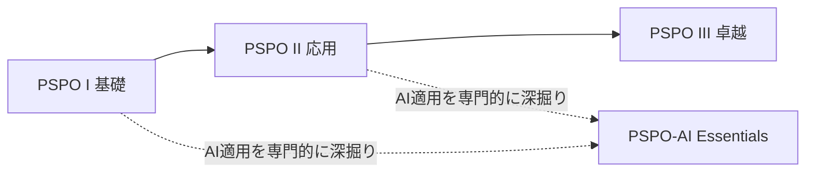

同様の「AI Essentials」シリーズは、Scrum Master向けの PSM-AI Essentials も存在し、Product Owner版とほぼ同じ設計思想（3カテゴリ、course-gated、85%合格ライン）で作られています。

### 1.5 コースの7セクション構成

Scrum.org 公式ブログ（VLOGシリーズ）によれば、PSPO-AI Essentials のトレーニングは次の7つのセクションで構成されています。これは試験の「AI Product Ownership」カテゴリの土台であり、本ガイドの第4部もこの構成に沿って解説します。

| セクション | テーマ | 学ぶこと（要約） |
|---|---|---|
| Section 1 | The Visionary Product Owner | AIでプロダクトビジョン・戦略・ロードマップを効果的に伝える。AIアバターの作成 |
| Section 2 | The Customer Representative | AIで顧客の課題・痛み・機会を理解し、プロダクトディスカバリーを強化。ユーザーペルソナ作成の実習 |
| Section 3 | The Experimenter | AIでアイデアをブレインストーミングし、検証可能な仮説を立てる。モックアップ生成の実習 |
| Section 4 | The Decision Maker | AIを知識豊富なアシスタントとして、プロダクトバックログ管理の意思決定を高度化 |
| Section 5 | The Collaborator & Influencer | AIで顧客インタビューの質を高め、会議の文字起こし・要点抽出・感情分析を行う。ステークホルダー要望管理アプリの実習 |
| Section 6 | The Orchestrator | AIツールの基礎知識を広げ、状況に応じて最適なツールを選定・設定する。AIエージェント構築の実習 |
| Section 7 | AI Theory, Ethics, and Security | AIの歴史、ANI/生成AI/AGIなどの分類、LLMや拡散モデルの理解、モデルの学習方法、プロンプトエンジニアリングとトークン化 |

> **出典**：Scrum.org Blog「[VLOG] The Why and What of the PSPO-AI Essentials Course, Explained」

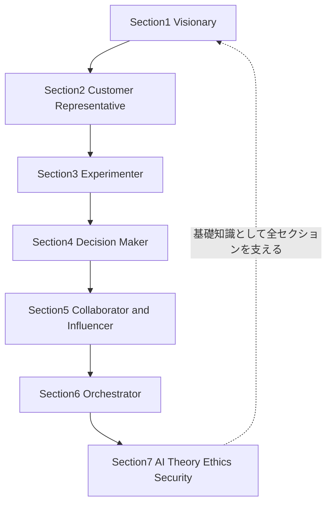

---

## 第2部：AI Theory and Primer（AI理論の基礎）

このカテゴリでは、プロダクトオーナーが「AIを使う人」から一歩進んで「AIの仕組みを理解して説明できる人」になるための基礎知識が問われます。エンジニアほど深い数学的理解は不要ですが、正確な言葉の定義を押さえることが得点に直結します。

### 2.1 AIの全体像と歴史のポイント

AI（Artificial Intelligence）は、機械が人間の知的な作業（学習・推論・判断・生成）を模倣・実行する技術全般を指す、非常に広い概念です。1950年代のチューリングテストや初期のルールベースAI（記号主義AI）から始まり、2010年代のディープラーニングのブレイクスルー、2020年代の生成AI（Generative AI）の爆発的普及、そして直近のエージェンティックAI（Agentic AI）へと発展してきました。

試験対策としては「年号を暗記する」ことよりも、**AIの各世代がそれぞれ何を新しく可能にしたか**という流れを理解することが重要です。

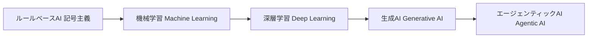

### 2.2 AIの分類：ANI・AGI・ASI

AIはその汎用性のレベルによって、大きく3つに分類されます。試験の「AI Theory and Primer」カテゴリで最も基本的な区分です。

| 分類 | 正式名称 | 説明 | 現状 |
|---|---|---|---|
| **ANI** | Artificial Narrow Intelligence（特化型AI） | 特定のタスクに特化したAI。画像認識、翻訳、チャットボットなど、現在私たちが使っているAIのほぼすべて | 実用化済み |
| **AGI** | Artificial General Intelligence（汎用人工知能） | 人間と同等の幅広い知的タスクをこなせるAI | 研究・議論段階 |
| **ASI** | Artificial Superintelligence（超知能） | あらゆる面で人間の知能を超えるAI | 理論・将来予測の段階 |

> **ベストプラクティス**：現在プロダクトオーナーが業務で扱うChatGPTやCopilotなどの生成AIツールは、いずれも「非常に高性能なANI」に分類されます。「AGIだから何でもできる」という誤解は、AIの限界（Discernment＝出力の見極め）を軽視するリスクにつながるため、試験でもよく問われるポイントです。

### 2.3 機械学習（Machine Learning）の基礎

機械学習は、明示的なルールをプログラムするのではなく、**データからパターンを学習**することでタスクを実行できるようにする技術です。学習の与え方によって、大きく3つの方式に分かれます。

| 学習方式 | 説明 | プロダクトオーナー実務での例 |
|---|---|---|
| 教師あり学習（Supervised Learning） | 正解ラベル付きのデータで学習する | 過去のバグ報告から重大度を自動分類するモデル |
| 教師なし学習（Unsupervised Learning） | ラベルなしデータからパターン・クラスタを発見する | ユーザー行動ログから未知のユーザーセグメントを発見する |
| 強化学習（Reinforcement Learning） | 試行錯誤と報酬によって方策を最適化する | レコメンドエンジンのクリック率最適化 |

### 2.4 深層学習（Deep Learning）とニューラルネットワーク

深層学習は機械学習の一分野で、人間の脳の神経細胞（ニューロン）の仕組みを模した「ニューラルネットワーク」を何層にも重ねることで、画像・音声・テキストのような複雑で非構造なデータから高精度にパターンを学習する技術です。現在の生成AI（LLMを含む）はすべて、この深層学習の延長線上にあります。

プロダクトオーナーとして覚えておくべきポイントは、「深層学習モデルの精度は、学習データの質と量に大きく依存する」ということです。これは第3部で扱うバイアスの問題に直結します。

### 2.5 生成AI（Generative AI）の仕組み

生成AI（Generative AI）は、既存のデータのパターンを学習し、それに基づいて**新しいコンテンツ（テキスト・画像・音声・動画・コードなど）を生成**するAIです。ChatGPT、Claude、Gemini、Copilot、Synthesia（動画生成）などが代表例です。

生成AIの中核技術には主に2つの系統があります。

| モデルの系統 | 主な用途 | 代表的な仕組み |
|---|---|---|
| **LLM（Large Language Model：大規模言語モデル）** | テキスト生成、要約、翻訳、コード生成 | Transformerアーキテクチャに基づき、直前までのトークン列から次のトークンを確率的に予測する |
| **拡散モデル（Diffusion Model）** | 画像・動画・音声生成 | ノイズを段階的に除去していくプロセスを学習し、ノイズからコンテンツを「復元」するように生成する |

### 2.6 エージェンティックAI（Agentic AI）とは

エージェンティックAI（Agentic AI）は、生成AIをさらに一歩進め、**与えられたゴールに向けて、自律的に計画を立て、複数のステップにわたってツールを呼び出し、行動を実行する**AIシステムです。単発の質問に単発で答える生成AIとは異なり、フィードバックの収集→分析→ドラフト作成→登録、のような一連のワークフローを人間の逐一の指示なしにこなせる点が特徴です。

第4部で扱う「The Orchestrator」スタンスでは、まさにこのエージェンティックAIを使って、ユーザーフィードバックのレビューからドラフトのプロダクトバックログアイテム（PBI）作成までを自動化する実習が想定されています。

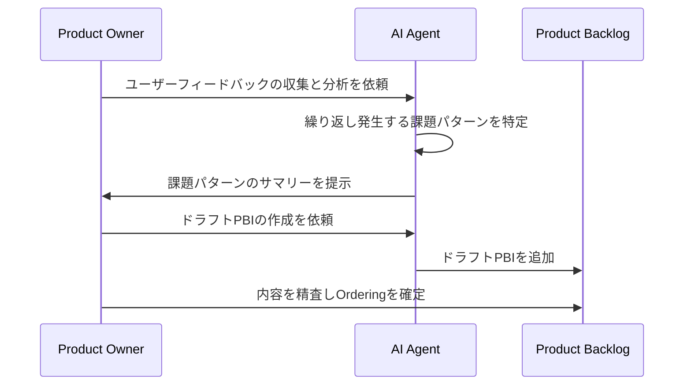

> **ベストプラクティス**：エージェンティックAIは強力な一方、自律性が高いほど「意図しない行動」のリスクも高まります。プロダクトオーナーは、AIエージェントに委任する範囲（Delegationのスコープ）を明確に設計し、Product Backlogへの反映など重要な意思決定の最終確認は必ず人間が行うという原則を崩さないことがベストプラクティスです。

### 2.7 プロンプトエンジニアリングとトークン化（Tokenization）

**トークン化（Tokenization）**とは、自然言語の文章をモデルが処理できる最小単位（トークン）に分割する処理です。英語ではおおむね単語や部分語がトークンになり、日本語では文字や文節に近い単位に分割されることが多くなります。LLMは、入力されたトークン列をもとに、次に来る可能性が高いトークンを確率的に予測し、それを繰り返すことで文章を生成します。

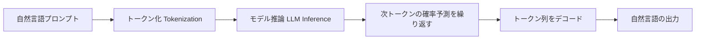

**プロンプトエンジニアリング（Prompt Engineering）**は、モデルから望ましい出力を引き出すために、指示文（プロンプト）を設計・改善する技術です。プロダクトオーナーにとっては、コーディングスキルよりも重要度の高い実務スキルと位置づけられています。

### 2.8 効果的なプロンプトのベストプラクティス

| 原則 | 内容 | 具体例 |
|---|---|---|
| 役割（Role）を与える | モデルにどんな立場で回答してほしいかを明示する | 「あなたは経験豊富なプロダクトオーナーです」 |
| 文脈（Context）を与える | 背景情報・制約条件を具体的に伝える | 対象プロダクト、顧客セグメント、既存のPBLの状況など |
| 期待する出力形式を指定する | 表・箇条書き・特定のフォーマットを指示する | 「ユーザーストーリー形式で、受け入れ基準を3つ添えて」 |
| 例を示す（Few-shot） | 望ましい出力の例を1〜2個提示する | 過去の優れたユーザーストーリーの例を貼り付ける |
| 段階的に指示する | 複雑なタスクは一度に全部頼まず、ステップに分ける | 「まず仮説を3つ挙げて。その後、私が選んだ1つを深掘りして」 |
| 出力を検証する前提で使う | 生成された内容を鵜呑みにせず、人間が確認する | 事実確認が必要な統計・引用は必ずソースを確認する |

> **出典**：Scrum.org Blog「[VLOG] The Why and What of the PSPO-AI Essentials Course, Explained」（Section 7の内容要約）

---

## 第3部：AI Security and Ethics（AIのセキュリティと倫理）

このカテゴリは、PSPO-AI Essentials コースが新たに追加した「新しいスタンス」として説明されている、セキュリティと倫理に関する領域です。プロダクトオーナーは「AIを使えるかどうか」だけでなく「AIを安全に、責任を持って使えるかどうか」まで問われます。

### 3.1 Responsible AI（責任あるAI）の基本姿勢

Responsible AI とは、AIを開発・活用する際に、公平性・透明性・説明責任・プライバシー保護・安全性を確保しようとする実践全般を指す考え方です。プロダクトオーナーの文脈では、次の問いを常に自分に投げかける姿勢がこれにあたります。

- このAI出力を、そのまま顧客やステークホルダーに見せてよいか？
- このAIに入力したデータは、機密情報や個人情報を含んでいないか？
- このAI提案には、特定の集団に不利益なバイアスが含まれていないか？
- 最終的な意思決定の責任は誰にあるか（＝常に人間、特にプロダクトオーナー自身）？

### 3.2 4D AI Fluency Framework（AI流暢性の4Dフレームワーク）

Scrum.orgのブログ記事「The Product Owner's AI Start Checklist」でも紹介されている代表的なフレームワークが、Anthropic社の研究者らが提唱した **4D Framework（AI Fluency Framework）** です。AIとの関わり方を「effective（効果的）・efficient（効率的）・ethical（倫理的）・safe（安全）」の4条件で捉え、それを実現するための4つの能力（4つのD）を定義しています。

| 能力（4D） | 意味 | プロダクトオーナーの実務での問い |
|---|---|---|
| **Delegation（委任）** | 何をAIに任せ、何を自分でやるかを見極める | このタスクはAIに任せてよい定型作業か、それとも人間の判断が不可欠な意思決定か？ |
| **Description（説明）** | AIに目的・文脈・制約を明確に伝える | プロンプトに、達成したいゴールと守るべき制約を十分に含めたか？ |
| **Discernment（見極め）** | AIの出力の品質・妥当性を批判的に評価する | この出力は事実に基づいているか、ハルシネーションを含んでいないか？ |
| **Diligence（責任）** | AIとの協働の結果に責任を持つ | 最終的にこの成果物を提出・公開する責任は自分にあると自覚しているか？ |

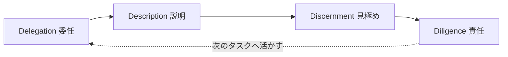

またこのフレームワークでは、AIとの関わり方を3つのモードに整理しています。

| モード | 説明 |
|---|---|
| Automation（自動化） | 人間の指示に基づき、AIが特定のタスクを実行する |
| Augmentation（拡張） | 人間とAIが思考のパートナーとして協働する |
| Agency（自律） | 人間がAIを設定し、AIが将来のタスクを自律的に代行する |

> **出典**：Anthropic「AI Fluency: Framework & Foundations」（Rick Dakan, Joseph Feller と Anthropic による共同開発。CC BY-NC-SA 4.0 ライセンスで公開）

### 3.3 ハルシネーション（Hallucination）とバイアス（Bias）

| リスク | 説明 | プロダクトオーナーへの示唆 |
|---|---|---|
| **ハルシネーション（Hallucination）** | AIが事実に基づかない、もっともらしい誤った情報を生成する現象 | 統計・引用・法規制など、事実確認が重要な情報は必ず一次情報で裏取りする |
| **アルゴリズミック・バイアス（Algorithmic Bias）** | 学習データの偏りが、特定の属性・集団に不利益な出力として現れる現象 | ユーザーペルソナ生成や優先順位付けにAIを使う際、特定の顧客層が過小評価・過大評価されていないか検証する |

Scrum.orgのブログ「The Augmented Product Owner: Amplifying Scrum with AI」でも、AIに大量のユーザーストーリーを生成させることは可能でも、深い文脈を欠いたユーザーストーリーには価値がないこと、そしてアルゴリズミック・バイアスへの警戒と、AIへの過度な依存が人間の創造性・批判的思考力を弱めるリスクが指摘されています。

### 3.4 データプライバシーとセキュリティ

生成AIツールに入力したデータは、ツールやプラン（無料版・有料版・エンタープライズ版）によって、モデルの再学習に利用されたり、ベンダー側に保存されたりする可能性があります。プロダクトオーナーが特に注意すべきデータの例は次のとおりです。

- 未公開のプロダクトロードマップ・事業戦略
- 顧客の個人情報（PII：Personally Identifiable Information）
- 契約情報・価格情報など、社外秘の商用データ
- 社内システムの認証情報・ソースコードの機密部分

> **ベストプラクティス（データ分類の第一歩）**：チームで「どのデータならAIツールに入力してよいか」を分類する簡単なガイドラインを最初に作ることが、Ethical AI実践の出発点として推奨されています。組織のセキュリティポリシーやAIツールの利用規約（データの学習利用有無など）を確認したうえで、チームメンバー全員が同じ基準を持つことが重要です。

### 3.5 4つのガードレール（Ethical AI for Product Owners）

Scrum.orgブログ「Ethical AI for Product Owners & Product Managers」では、プロダクトオーナー・プロダクトマネージャーがAIを倫理的に活用するための4つのガードレールが提示されています。

| ガードレール | 内容 |
|---|---|
| データプライバシーの確保（Ensuring Data Privacy） | AIに共有してよいデータの範囲を明確なプロトコルとして定める |
| 人間の価値の保持（Preserving Human Value） | 顧客への共感・人間的な判断をAIに委譲しすぎない |
| AI出力の検証（Validating AI Outputs） | AIが生成した情報・提案を鵜呑みにせず、事実確認と妥当性検証を行う |
| AIの関与の透明な帰属（Transparently Attributing AI's Role） | 成果物のどの部分がAI生成か、ステークホルダーに対して透明性を保つ |

> **出典**：Scrum.org Blog「Ethical AI for Product Owners & Product Managers」（PST Stefan Wolpers）

### 3.6 規制・法令の概観

試験の「AI Security and Ethics」カテゴリでは、詳細な法律知識までは求められませんが、代表的な規制・ガバナンスフレームワークの「存在と目的」を把握しておくことが望まれます。

| フレームワーク | 発行主体 | 概要 |
|---|---|---|
| **NIST AI RMF**（AI Risk Management Framework） | 米国国立標準技術研究所（NIST） | 「Govern（統治）・Map（特定）・Measure（測定）・Manage（管理）」の4機能でAIリスクを管理する、任意（voluntary）のフレームワーク |
| **EU AI Act** | 欧州連合（EU） | AIシステムをリスクの大きさに応じて4段階（許容不可・高リスク・限定的リスク・最小リスク）に分類し、義務を課す世界初の包括的AI法規制 |
| **ISO/IEC 42001** | 国際標準化機構（ISO） | AIマネジメントシステムに関する国際規格。組織がAIを責任を持って開発・運用するための体制構築を規定 |

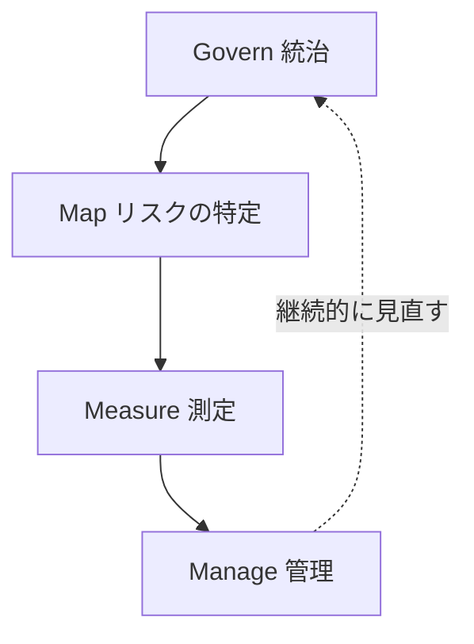

> **ベストプラクティス**：法規制の暗記よりも、「なぜこうした規制が必要とされているか（リスクベースでAIを管理する、という共通の考え方）」を理解しておくことが試験にも実務にも有効です。特にEU圏の顧客を持つプロダクトを担当している場合、EU AI Actのリスク分類がプロダクト要件そのものに直結することがあります。

### 3.7 プロダクトオーナーの説明責任（Accountability）

Scrum Guideは、プロダクトオーナーが唯一、プロダクトバックログ管理の説明責任（Accountability）を持つと定義しています。AIをどれだけ活用しても、この説明責任がAIに移譲されることはありません。Scrum.orgブログ「The Augmented Product Owner: Amplifying Scrum with AI」でも、「プロダクトオーナーはプロダクトの成功に対する説明責任を保持し続けるべきであり、AIはあくまでツールであって、中核的な責任を委譲する相手ではない」と明確に述べられています。

Sprint ReviewやRetrospectiveのような透明性・検査の場は、AIの活用がチームにとってプラスに働いているかを定期的に点検する自然な機会として活用できます。

---

## 第4部：AI Product Ownership（AIを活用したプロダクトオーナーシップ）

伝統的にプロダクトオーナーには、Scrum.orgが提唱する6つの「望ましいスタンス（Preferred Stances）」——The Visionary、The Collaborator、The Customer Representative、The Decision Maker、The Experimenter、The Influencer——があります。PSPO-AI Essentials コースでは、これらのスタンスにAIをどう組み込むかを具体的に学び、さらに新しいスタンスとして **The Orchestrator** を加えています。

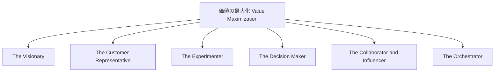

### 4.1 The Visionary（ビジョナリー）× AI

**本来のスタンス**：プロダクトのビジョン・戦略・目標をステークホルダー全員に明確に伝える役割。

**AIによる強化ポイント**：

- プロダクトビジョン・ロードマップの草案作成をAIとの壁打ちで加速する
- 複雑な戦略メッセージを、対象オーディエンス（経営層・開発チーム・顧客）ごとに異なるトーンで再構成する
- 「AIアバター」（自分の分身となる動画・音声コンテンツ）を作成し、ビジョンメッセージをスケーラブルに発信する

> **ベストプラクティス**：AIにビジョンの「文章」を書かせることはできますが、ビジョンの「意思決定」自体は必ず人間が行うべきです。AIは伝達手段の高速化・多様化に使い、ビジョンの本質的な方向性は自分自身の判断に委ねましょう。

### 4.2 The Customer Representative（顧客代表）× AI

**本来のスタンス**：顧客の課題・ニーズ・行動を深く理解し、チームに橋渡しする役割。

**AIによる強化ポイント**：

- インタビューやアンケートの生データから、顧客の課題・痛み・機会を要約させる
- AIを使ってユーザーペルソナのドラフトを作成し、チームで議論するたたき台にする
- 市場調査データから、傾向やインサイトを高速に抽出する

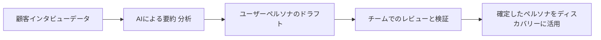

> **ベストプラクティス**：AI生成のペルソナは「仮説」として扱い、必ず実際の顧客データ・インタビューで検証するプロセスを組み込むこと。AIは調査を速くしますが、実際の顧客の声に取って代わるものではありません。

### 4.3 The Experimenter（実験者）× AI

**本来のスタンス**：仮説と検証を通じて、価値を発見していく役割。「何がわかっていて、何がわかっていないか」を明確にする。

**AIによる強化ポイント**：

- 新機能・新プロダクトのアイデアをAIとブレインストーミングする
- 検証可能な仮説（Hypothesis）の形に、アイデアを構造化する
- AIプロトタイピングツール（例：Bolt.newのようなノーコード生成ツール）で、数分単位でモックアップやテスト用の簡易サイトを作成する

> **ベストプラクティス**：AIでモックアップ生成が高速化すればするほど、「作ってから考える」誘惑が強まります。必ず仮説（何を検証したいのか）を先に明文化してからプロトタイピングに入ることで、目的のない量産を防ぎます。

### 4.4 The Decision Maker（意思決定者）× AI

**本来のスタンス**：日々、プロダクトバックログの並び替えや優先順位付けなど、あらゆる意思決定を行う役割。

**AIによる強化ポイント**：

- 過去のデータ（利用状況、サポート問い合わせ、売上インパクトなど）をAIに分析させ、優先順位付けの判断材料を増やす
- MoSCoWやKano分析などの優先順位付けフレームワークに、AIが抽出したインサイトを組み込む
- リスクの洗い出しと影響度評価をAIと一緒に検討する

| 優先順位付けフレームワーク | 概要 | AIの活用余地 |
|---|---|---|
| MoSCoW | Must / Should / Could / Won't で分類 | 各PBIの分類理由の草案作成、過去データとの整合性チェック |
| Kano分析 | 基本機能・満足度向上機能・魅力的機能を区別 | 顧客フィードバックからKanoカテゴリの傾向を推定 |
| WSJF（重み付き最短ジョブ優先） | コスト・オブ・ディレイと作業規模の比から算出 | 各要素のスコアリング根拠データの整理・要約 |

> **ベストプラクティス**：AIは「意思決定のための材料」を高速に用意してくれますが、最終的な優先順位の決定という**説明責任そのもの**は常にプロダクトオーナーに残ります（3.7節参照）。AIの推奨をそのまま採用するのではなく、なぜその優先順位にしたのかを自分の言葉で説明できる状態を保つことが重要です。

### 4.5 The Collaborator & Influencer（協働者・インフルエンサー）× AI

**本来のスタンス**：The Collaboratorはチームと協力してゴールを定義する役割、The Influencerはステークホルダーをビジョン・戦略・目標のもとに整合させる役割です。PSPO-AI Essentialsコースでは、この2つのスタンスがAI活用の観点でまとめて扱われています。

**AIによる強化ポイント**：

- 顧客インタビューやステークホルダーミーティングをAIで文字起こしし、要点とアクションアイテムを自動抽出する
- 会話や文章の感情分析（Sentiment Analysis）を行い、ステークホルダーの温度感を把握する
- ステークホルダーからの要望を収集・分類・トラッキングするアプリケーションをAIの支援で構築する

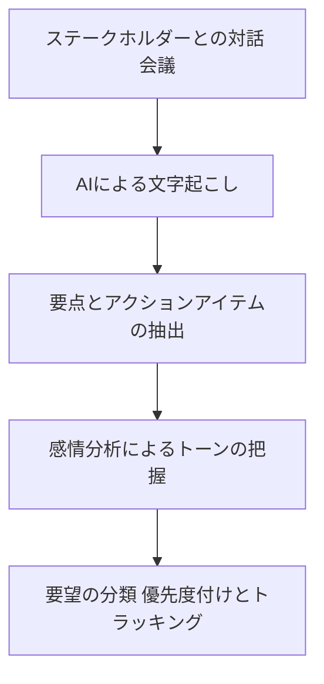

> **ベストプラクティス**：感情分析やAIによる要約は、あくまで「一次スクリーニング」の道具として使い、重要なステークホルダーとの関係構築そのものは対面・人間同士のコミュニケーションを軸に置きましょう。AIの要約結果に頼りすぎると、ニュアンスの取りこぼしに気づきにくくなります。

### 4.6 The Orchestrator（オーケストレーター）— AI時代の新スタンス

**新設のスタンス**：PSPO-AI Essentialsコースで追加された、従来の6スタンスにはなかった新しい役割です。プロダクトオーナー自身が「AIツールの選定者・設定者・監督者」としてふるまうスタンスを指します。

**主な活動**：

- 状況や目的に応じて、最適なAIツールを選定する（LLMチャットツール、動画生成、プロトタイピング、コラボレーション、文字起こしなど、用途ごとに適したツールは異なる）
- 選んだAIツールをセットアップ・設定し、チームが使いやすい状態に整える
- AIエージェントを構築し、定型的なワークフロー（フィードバック分析→ドラフトPBI作成など）を自動化する

| 用途カテゴリ | 代表的なツールの例 |
|---|---|
| 汎用LLMチャット | ChatGPT, Claude, Gemini, Copilot |
| 動画生成 | Synthesia |
| プロトタイピング | Bolt.new, Typeform |
| コラボレーション | Mural AI, Miro AI |
| 会議の文字起こし・要約 | NotebookLM |

> **出典**：Prowareness（Scrum.org認定パートナー）コース案内ページに記載のツール例、Scrum.org公式ブログのコース紹介記事

> **ベストプラクティス**：ツールは頻繁にアップデートされるため、「特定のツール名」を覚えるより、「用途ごとにどんな種類のツールが必要になるか」という分類軸を理解しておくことが、長期的に役立つ知識になります。

### 4.7 誤解されたスタンスとAI利用の落とし穴

Scrum.orgのスタンス関連ブログでは、望ましいスタンスの対比として「誤解されたスタンス（Misunderstood Stances）」——The Clerk（事務員）、The Manager（管理者）、The Project Manager、The Subject Matter Expertなど——も紹介されています。AIを誤用すると、せっかくの効率化ツールが、むしろこうした望ましくないスタンスを助長するリスクがあります。

| 誤解されたスタンス | AI誤用によって陥りやすいパターン |
|---|---|
| The Clerk（事務員） | AIが生成した大量のユーザーストーリーやPBIを、内容を吟味せずそのままバックログに登録してしまう |
| The Manager（管理者） | AIの分析結果を根拠に、チームへ一方的にタスクを割り振るような使い方をしてしまう |
| The Subject Matter Expert（専門家への依存） | 顧客理解をAI要約だけで済ませ、自ら顧客と対話する機会を減らしてしまう |

> **ベストプラクティス**：AI活用の目的は「望ましいスタンス（Visionary, Collaborator, Customer Representative, Decision Maker, Experimenter, Influencer, Orchestrator）を強化すること」であり、「作業量を増やして誤解されたスタンスに逆戻りすること」ではない、という原則を常に意識しましょう。

---

## 第5部：ベストプラクティス総まとめ表

| 領域 | ベストプラクティス |
|---|---|
| AI Theory | ANI・AGI・ASIの違いを理解し、現行の生成AIは高性能なANIであるという前提を忘れない |
| AI Theory | プロンプトには役割・文脈・出力形式・例を含め、複雑なタスクは段階的に指示する |
| AI Theory | エージェンティックAIに委任する範囲は明確に定義し、重要な意思決定は人間が最終確認する |
| AI Security and Ethics | 4D Framework（Delegation, Description, Discernment, Diligence）を意思決定の型として使う |
| AI Security and Ethics | ハルシネーションのリスクを前提に、事実情報は一次ソースで検証する |
| AI Security and Ethics | チームで「AIに入力してよいデータ」の分類基準を先に合意しておく |
| AI Security and Ethics | AI出力のうちどの部分がAI生成かを、ステークホルダーに対して透明に伝える |
| AI Product Ownership | AIはビジョン伝達・顧客理解・仮説検証・意思決定材料の準備を加速するが、最終判断と説明責任は常にプロダクトオーナーが持つ |
| AI Product Ownership | AI生成のペルソナ・優先順位付けの根拠は、必ず実データ・実際の対話で検証してから確定する |
| AI Product Ownership | ツール選定は「用途カテゴリ」で考え、特定ツールへの過度な依存を避ける |
| 組織・チーム | Sprint ReviewやRetrospectiveで、AI活用がチームに有益かどうかを定期的に検査する |

---

## 第6部：試験対策とシナリオ思考トレーニング

> **重要な注意**：以下は実際の試験問題ではなく、本ガイドの著者が学習目的で作成した練習用のシナリオ例です。試験の実際の設問内容・正答を示すものではありません。

### 6.1 学習の進め方

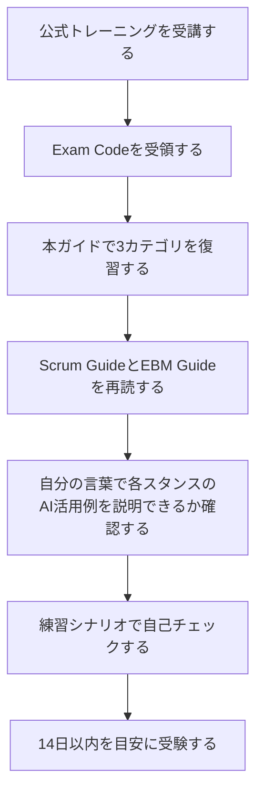

### 6.2 出題されやすい思考パターン

PSPO-AI Essentials の試験は Multiple Choice ですが、単純な用語の暗記だけでなく、「このような場面でプロダクトオーナーはどう行動すべきか」というシナリオベースの判断力を問う傾向が、Scrum.org系の他の認定試験（PSPO I/IIなど）と共通していると考えられます。学習の際は、以下のような自問自答を繰り返すと効果的です。

| 出題されやすい観点 | 自問の型 |
|---|---|
| 用語の正確な理解 | 「この選択肢の中で、Agentic AIを正しく説明しているのはどれか？」 |
| 責任の所在 | 「AIが提案した優先順位付けをそのままチームに伝えるのは適切か？」 |
| リスク認識 | 「この状況でプロダクトオーナーが最初に確認すべきリスクは何か？」 |
| スタンスとの対応 | 「この行動は、6つの望ましいスタンス＋Orchestratorのうち、どれに最も近いか？」 |
| 倫理・セキュリティ | 「このデータをAIツールに入力する前に、何を確認すべきか？」 |

### 6.3 練習シナリオ例（自作・非公式）

**シナリオ1**：あなたはプロダクトオーナーです。チームメンバーが「AIに未公開の来期ロードマップと顧客の契約金額を入力して、競合分析のレポートを作らせました」と報告してきました。あなたが最初に取るべき行動として最も適切なものはどれか、を考えてみましょう。

- 選択肢の方向性の例：ただちに使用しているAIツールのデータ取り扱いポリシーと、入力した情報の機密レベルを確認する（3.4節・3.5節の「データプライバシーの確保」ガードレールに対応）

**シナリオ2**：The Decision Maker のスタンスで、AIが「機能Aを最優先にすべき」と提案してきました。あなたはこの提案をどう扱うべきか、を考えてみましょう。

- 選択肢の方向性の例：AIの提案の根拠データを確認し、自分自身の判断とEBM（Evidence-Based Management）の観点を踏まえて最終決定を行う（4.4節・3.7節に対応）

このように、各シナリオを「どの部（AI Theory / AI Security and Ethics / AI Product Ownership）のどの原則に対応するか」を紐づけながら復習すると、記憶が定着しやすくなります。

---

## 第7部：参考文献・公式ソース一覧

### Scrum.org 公式ページ（PSPO-AI Essentials 関連）

- 認定試験ページ：https://www.scrum.org/professional-scrum-product-ownertm-ai-essentials-certification
- コースページ（例）：https://www.scrum.org/courses/professional-scrum-product-owner-ai-essentials-training
- コース新設アナウンス：https://www.scrum.org/resources/scrumorg-announces-new-ai-training-product-owners
- コース構成解説VLOG：https://www.scrum.org/resources/blog/vlog-why-what-pspo-ai-essentials-course-explained
- Product Owner's AI Start Checklist：https://www.scrum.org/resources/blog/product-owners-ai-start-checklist
- Ethical AI for Product Owners & Product Managers：https://www.scrum.org/resources/blog/ethical-ai-product-owners-product-managers
- The Augmented Product Owner: Amplifying Scrum with AI：https://www.scrum.org/resources/blog/augmented-product-owner-amplifying-scrum-ai
- The Crossroads of Product Ownership and AI：https://www.scrum.org/resources/blog/crossroads-product-ownership-and-ai
- Professional Scrum Certifications 一覧：https://www.scrum.org/professional-scrum-certifications

### Product Owner スタンス関連（Scrum.org）

- Stances of the Product Owner：https://www.scrum.org/resources/blog/stances-product-owner
- What is a Product Owner?：https://www.scrum.org/resources/what-is-a-product-owner
- The Experimenter（A Preferred Product Owner Stance）：https://www.scrum.org/resources/blog/experimenter-preferred-product-owner-stance

### Scrumの一次情報

- The Scrum Guide（公式）：https://scrumguides.org/scrum-guide.html
- Evidence-Based Management Guide（Scrum.org）：https://www.scrum.org/resources/evidence-based-management-guide

### AI理論・倫理・フレームワーク関連

- Anthropic「AI Fluency: Framework & Foundations」（4D Framework 公式コース）：https://academy.claude.com/courses/ai-fluency-framework-foundations/the-4d-framework
- Anthropic「The AI Fluency Framework」公式PDF：https://www-cdn.anthropic.com/334975cdec18f744b4fa511dc8518bd8d119d29d.pdf
- NIST AI Risk Management Framework：https://www.nist.gov/itl/ai-risk-management-framework
- EU AI Act（欧州委員会 公式ポリシーページ）：https://digital-strategy.ec.europa.eu/en/policies/regulatory-framework-ai

### 補足：コースパートナーによる紹介ページ（ツール例・学習目標の参照用）

- Xebia Academy コース紹介：https://academy.xebia.com/training/professional-scrum-product-owner-ai-essentials-training/
- Prowareness コース紹介（ツール一覧の出典）：https://www.prowareness.com/academy/en/trainingen/professional-scrum-product-owner-ai-essentials-pspo-ai-english
- tryscrum.com コース紹介：https://tryscrum.com/certifications/agile/scrum/product-owner/professional-scrum-product-owner-ai-essentials-training/

> **免責事項**：本ガイドは独自に公開情報を調査・要約したものであり、Scrum.orgによる公式監修を受けたものではありません。試験の出題内容・合格基準・受験条件は変更される可能性があるため、最新情報は必ず上記の公式ページでご確認ください。
