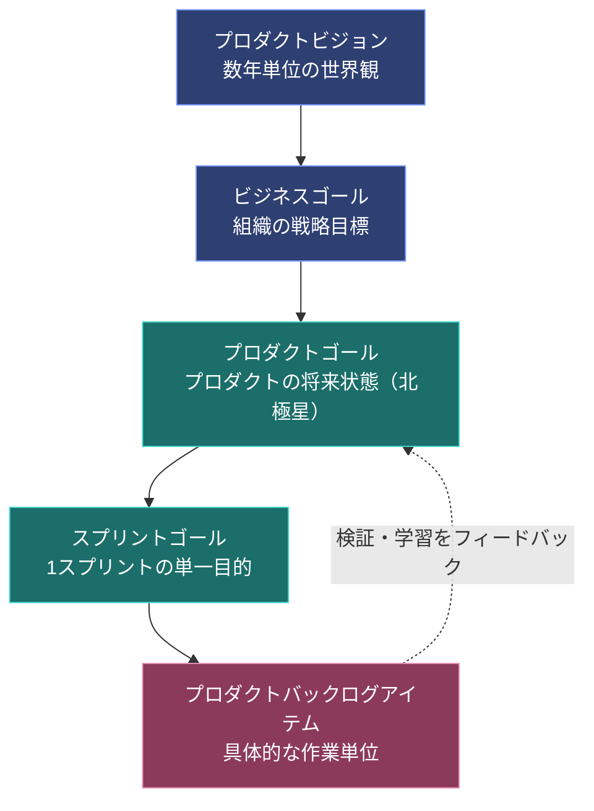
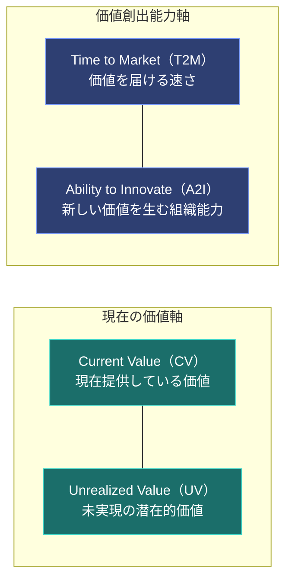

# Professional Scrum Product Owner™（PSPO I / PSPO II）学習ガイド
### ― 価値最大化の思想から実践プラクティスまで、体系的に理解する ―

> 本ガイドは、Scrum.org 公認の「Professional Scrum Product Owner」認定試験（PSPO I / PSPO II）の出題範囲を、プロダクトマネジメントやアジャイルの初学者でも本質から理解できるよう構成した学習教材です。単なる用語暗記ではなく、「なぜそうなのか」を一貫して説明することを目指しています。

---

## 目次

1. [PSPO 認定試験概要とプロダクトオーナーの本質](#1-pspo-認定試験概要とプロダクトオーナーの本質)
2. [プロダクトビジョンと戦略](#2-プロダクトビジョンと戦略product-vision--strategy)
3. [プロダクトバックログ管理と優先順位付け](#3-プロダクトバックログ管理と優先順位付けpbl-management--ordering)
4. [エビデンスベースドマネジメント（EBM）](#4-エビデンスベースドマネジメントebm-evidence-based-management)
5. [スクラムイベントとプロダクトオーナーの振る舞い](#5-スクラムイベントとプロダクトオーナーの振る舞い)
6. [試験対策・頻出シチュエーション問題の解法パターン](#6-試験対策頻出シチュエーション問題の解法パターン)
7. [参考リソース・公式リンク集](#7-参考リソース公式リンク集)

---

## 1. PSPO 認定試験概要とプロダクトオーナーの本質

### 1.1 PSPO 試験とは何か

Professional Scrum Product Owner（PSPO）は、Scrum.org が提供する認定試験の中でも「プロダクトの成功責任者」としての知識とマインドセットを問う試験群です。レベルは大きく2段階に分かれています。

| 項目 | PSPO I | PSPO II |
|---|---|---|
| 対象レベル | 基礎〜実務初級 | 実務中級〜上級（戦略・組織視点） |
| 出題形式 | 選択式（単一選択・複数選択・True/False・穴埋め） | シナリオベースの記述式に近い選択式、より深い考察を要求 |
| 問題数の目安 | 80問 | 30問 |
| 制限時間の目安 | 60分 | 120分 |
| 合格ラインの目安 | 85% | 85% |
| 前提資格 | なし（誰でも受験可） | 実質的に PSPO I 相当の知識が前提 |
| 出題の重心 | Scrum Guide の正確な理解、PBL管理、基本用語 | 戦略・EBM・組織スケール・ステークホルダー対応などの応用力 |

PSPO 試験は「一度きりの合格」ではなく「一発勝負・再受験は有料」という緊張感のある試験設計になっている点も特徴です（不合格の場合は再受験費用が発生します）。そのため、丸暗記ではなく Scrum Guide の一次情報に基づいた本質理解が合格への近道になります。

> **公式リソース**: [Professional Scrum Product Owner Certifications](https://www.scrum.org/professional-scrum-product-owner-certifications)

### 1.2 プロダクトオーナーの唯一の目的：価値の最大化

Scrum Guide において、プロダクトオーナーの説明は非常にシンプルです。

> プロダクトオーナーは、**プロダクトの価値を最大化する**ことに責任を持つ。

この一文がすべての出発点です。ここで重要なのは、プロダクトオーナーの仕事が「バックログを綺麗に整理すること」でも「ステークホルダーの要望を漏れなく記録すること」でもなく、**その先にある価値（ビジネス成果）を最大化すること**にある、という点です。バックログ管理やステークホルダー調整は、価値最大化という目的を達成するための「手段」に過ぎません。

このマインドセットを言い換えると、プロダクトオーナーは「プロダクトというビジネスに対する意思決定権を持つミニ経営者（ミニCEO）」のような存在だと理解すると分かりやすくなります。ただし、これは比喩であり、Scrum Guide が定める権限（プロダクトバックログの内容・並び順・可視性に対する唯一の説明責任者であること）を超えるものではありません。

### 1.3 アウトプットとアウトカムの違い

初学者が最も陥りやすい誤解が、「アウトプット（output）＝仕事をした証」と「アウトカム（outcome）＝実際に得られた価値」の混同です。

| 観点 | アウトプット（Output） | アウトカム（Outcome） |
|---|---|---|
| 定義 | 作った成果物・機能・リリース件数 | その成果物によって実際に変化したユーザー行動やビジネス指標 |
| 測定例 | 「今スプリントで5個の機能をリリースした」 | 「その機能によって解約率が2%改善した」 |
| 落とし穴 | 作ること自体が目的化しやすい（ベロシティ至上主義） | 測定に時間がかかり、短期的には評価しにくい |
| PO の責務 | 開発チームと共に効率よく作る | **アウトプットが本当にアウトカムを生んだかを検証し続ける** |

真に価値を最大化するプロダクトオーナーは、「何を作ったか」ではなく「何が変わったか」を問い続けます。これは第4章で扱う Evidence-Based Management（EBM）の考え方と直結しています。

### 1.4 プロダクトオーナーのアンチパターン

PSPO 試験では、「正しいPOの振る舞い」と対比する形で、形骸化したPOのパターンを見抜く出題が頻出します。以下に代表的なアンチパターンを整理します。

| アンチパターン | 特徴 | 引き起こされる弊害 |
|---|---|---|
| **御用聞きPO（Order Taker PO）** | ステークホルダーの要望をそのままバックログに転記するだけで、優先順位への意思決定をしない | バックログが「言われた順」になり、価値の高いものが埋もれる。No と言えないため、チームが疲弊する |
| **委員会PO（Committee PO）** | 意思決定が複数人の合議制になっており、誰も最終責任を負わない | 意思決定が遅延する。Scrum Guide が定める「単一の説明責任者」という原則に反する |
| **仕様書作成係PO（Backlog Administrator PO）** | 詳細な仕様書を書くことに終始し、ビジネス成果への関心が薄い | プロダクトの「なぜ」が失われ、開発チームが単なる「作業者」になる |
| **権限のない代理PO（Proxy PO）** | 実質的な意思決定権を持たず、真の意思決定者（経営層等）への取り次ぎ役に留まる | 意思決定のたびに承認待ちが発生し、俊敏性が失われる |
| **不在PO（Absent PO）** | スプリントレビューやリファインメントに参加せず、開発チーム任せにする | 開発チームが優先順位やビジネス文脈を推測で判断せざるを得なくなる |

一方、真のプロダクトオーナーは以下のような特徴を持ちます。

| 真のPOの特徴 | 具体的な振る舞い |
|---|---|
| 価値への説明責任を引き受ける | 優先順位付けの理由を自分の言葉で説明できる |
| 権限を持って意思決定する | ステークホルダーの要望に対して、根拠を持って「No」と言える |
| 開発チームと協働する | リファインメントやレビューに積極的に参加し、対話を通じて理解を深める |
| データと仮説で判断する | 経験や勘だけでなく、EBM の指標や実験結果を根拠にする |
| ビジョンを語り続ける | チームとステークホルダーの双方に、プロダクトの「なぜ」を繰り返し伝える |

> **公式リソース**: [The Scrum Guide](https://www.scrumguides.org/) / [Professional Scrum Product Owner Certifications](https://www.scrum.org/professional-scrum-product-owner-certifications)

---

## 2. プロダクトビジョンと戦略（Product Vision & Strategy）

### 2.1 ビジョン・ビジネスゴール・プロダクトゴールの階層構造

プロダクトオーナーが日々の優先順位付け（第3章）や実験（第4章）を正しく行うためには、その土台となる「なぜこのプロダクトが存在するのか」という階層構造を明確にしておく必要があります。

- **プロダクトビジョン（Product Vision）**: プロダクトが将来実現したい世界観。数年単位の長期的な方向性であり、頻繁には変わらない。
- **ビジネスゴール（Business Goal）**: 組織全体の戦略目標。売上、市場シェア、顧客満足度など、経営レベルの指標に紐づく。
- **プロダクトゴール（Product Goal）**: Scrum Guide 2020 で正式に導入された概念。プロダクトの「将来の状態」を表す長期的な目標であり、プロダクトバックログ全体が向かう方向を示す「北極星」の役割を果たす。1つのプロダクトには常に1つのプロダクトゴールが存在する。
- **スプリントゴール（Sprint Goal）**: 1回のスプリントで達成したい単一の目的。プロダクトゴールに向けた「ひとつのステップ」であり、スプリントに一貫性と焦点をもたらす。
- **プロダクトバックログアイテム（PBI）**: スプリントゴールを達成するための具体的な作業単位。

これらは上位から下位に向かって「why → what」が徐々に具体化されていく関係にあり、逆に下位から上位へと問いかけることで「このPBIは本当にプロダクトゴールに貢献しているか？」を常に検証できます。

この図が示す重要なポイントは、矢印が上から下へ一方通行ではないということです。スプリントレビューでの学びや市場からのフィードバックは、点線のようにプロダクトゴールやビジョンそのものを見直す材料になります。プロダクトオーナーは、この上り下りの往復を継続的に行う「翻訳者」の役割を担います。

### 2.2 ロードマップ設計：フィーチャードリブンからアウトカムドリブンへ

従来型のロードマップは「いつ・何を作るか」を並べた計画表（フィーチャードリブン・ロードマップ）になりがちです。しかしこの形式には次のような弱点があります。

- 機能を作ること自体がゴール化し、「作ったのに使われない」機能が生まれやすい
- 市場や顧客の変化に対して計画の変更コストが高くなる
- チームが「なぜ作るか」を理解しないまま「何を作るか」だけを渡される

これに対して、PSPO が推奨するのは**アウトカムドリブン（ゴールドリブン）・ロードマップ**です。時間軸に沿って「達成したい成果」や「解決したい課題」を並べ、その成果を達成する手段（機能）はチームの裁量とディスカバリー活動に委ねます。

| 観点 | フィーチャードリブン・ロードマップ | アウトカムドリブン・ロードマップ |
|---|---|---|
| 軸になる単位 | 機能・リリース内容 | 達成したい成果・解決したい課題 |
| 柔軟性 | 低い（計画変更＝機能変更として認識される） | 高い（同じ成果を別の手段で達成してもよい） |
| チームの動機付け | 「言われたものを作る」意識になりやすい | 「なぜ」を共有し、解決策を共に考える意識が生まれる |
| リスク | 作っても価値が出ない可能性がある | 成果に向けた仮説検証が前提になるため、無駄が出にくい |

### 2.3 ターゲットユーザーの特定：ペルソナとカスタマージャーニーマップ

価値を最大化するためには、「誰にとっての価値か」を明確にする必要があります。ここで有効なのが以下の2つのツールです。

- **ペルソナ（Persona）**: ターゲットとなるユーザー像を、属性・目標・課題・行動パターンとして具体化した架空の人物像。チーム全員が「同じユーザー」を思い浮かべながら会話できるようにする効果がある。
- **カスタマージャーニーマップ（Customer Journey Map）**: ユーザーがプロダクトを認知してから利用・継続・離脱に至るまでの一連の体験を時系列で可視化したもの。各段階での感情や課題を洗い出すことで、優先順位付けの根拠（第3章参照）や新たなPBIの発見につながる。

これらはあくまで意思決定を支援するための道具であり、作成すること自体が目的化しないよう注意が必要です。PSPO 試験では、「ペルソナやジャーニーマップは誰が作るべきか」という問いに対し、**プロダクトオーナーが単独で作るのではなく、開発チームやステークホルダーを巻き込みながら共同で作り上げるべき**という考え方が問われることがあります。

> **公式リソース**: [The Scrum Guide](https://www.scrumguides.org/) / [Product Owner Learning Series](https://www.scrum.org/pathway/product-owner-learning-series)

---

## 3. プロダクトバックログ管理と優先順位付け（PBL Management & Ordering）

### 3.1 プロダクトバックログの原則

Scrum Guide において、プロダクトバックログは「プロダクトを改善するために必要な作業の、唯一かつ創発的で、順番付けされたリスト」と定義されます。ここから導かれる原則を整理します。

- **単一のバックログ（Single Source of Truth）**: 組織内にプロダクトバックログは1つだけ存在する。部門ごと・チームごとに別々の優先順位リストを持つことは、優先順位の一貫性を破壊する。
- **動的なリファインメント（Refinement）**: プロダクトバックログは常に「生きている」ドキュメントであり、一度作って終わりではなく、継続的にPBIの詳細化・見積り・並び替えが行われる。リファインメントは公式のスクラムイベントではないが、通常継続的な活動として推奨される。
- **DEEP 原則**: 健全なプロダクトバックログが備えるべき性質の頭文字。
  - **D**etailed appropriately（適切に詳細化されている）: 直近取り組むPBIほど詳細に、将来のPBIほど粗く記述する
  - **E**stimated（見積もられている）: 開発チームが見積りを行い、規模感を共有している
  - **E**mergent（創発的である）: 学びや市場の変化に応じて常に変化し続ける
  - **P**rioritized（優先順位付けされている）: 単なる並び替えではなく、価値に基づいて順序付けられている

### 3.2 価値基準の優先順位付け（Ordering）テクニック

プロダクトバックログの並び順（Ordering）を決める際、プロダクトオーナーは単一の基準だけでなく、複数の要素をバランスさせる必要があります。

- **価値（Value）**: そのPBIが顧客・ビジネスにもたらす便益の大きさ
- **リスク**: 実現しないことによる機会損失、あるいは実現することで顕在化する技術的・市場的リスク
- **依存関係**: 他のPBIや外部要因（法規制、他チームの成果物など）との依存
- **コスト・オブ・ディレイ（Cost of Delay, CoD）**: そのPBIの実現を先延ばしにすることで失われる価値。「今やらないと、どれだけ損をするか」という時間軸を組み込んだ考え方

これらを踏まえた代表的な優先順位付けフレームワークを比較します。

| フレームワーク | 概要 | 強み | 弱み・注意点 |
|---|---|---|---|
| **MoSCoW** | Must / Should / Could / Won't の4区分に分類する | シンプルで合意形成がしやすい | 相対的な優先度が曖昧になりやすく、「Must」が増えすぎる傾向がある |
| **Kano モデル** | 機能を「当たり前品質」「一元的品質」「魅力的品質」「無関心品質」「逆品質」に分類し、顧客満足度への影響を分析する | 顧客体験の質的な違いを捉えられる。「魅力的品質」の発見に有効 | 調査・分析にコストがかかり、頻繁な更新には向かない |
| **WSJF（Weighted Shortest Job First）** | CoD（ビジネス価値・時間的制約・リスク低減/機会獲得の合計）を、実装規模（Job Size）で割って優先度スコアを算出する | 定量的な意思決定がしやすく、SAFe など大規模フレームワークでも採用される | スコアの入力値（価値やサイズ）自体が主観的見積りに依存する |

PSPO 試験では、「唯一絶対の優先順位付けフレームワークは存在せず、状況に応じて使い分けるべき」という前提が重視されます。フレームワークは意思決定を助ける道具であり、最終的な説明責任はあくまでプロダクトオーナー個人にあります。

### 3.3 PBI（プロダクトバックログアイテム）の具体化

#### ユーザーストーリーと INVEST 原則

PBI は多くの場合ユーザーストーリー形式（「〜として、〜したい。なぜなら〜だから」）で記述されますが、Scrum Guide 自体はユーザーストーリー形式を必須としていません。あくまで一般的なプラクティスの一つです。良いPBIの条件として広く使われるのが **INVEST** 原則です。

| 頭文字 | 意味 | 説明 |
|---|---|---|
| I | Independent（独立している） | 他のPBIへの依存が少なく、単独で価値を提供・見積り可能 |
| N | Negotiable（交渉可能） | 詳細は固定仕様ではなく、対話を通じて調整可能 |
| V | Valuable（価値がある） | ユーザーまたはビジネスにとって明確な価値を持つ |
| E | Estimable（見積り可能） | 開発チームが規模感を見積れる程度に理解可能 |
| S | Small（小さい） | 1スプリント内で完了できる程度の大きさ |
| T | Testable（テスト可能） | 完了したかどうかを検証できる明確な基準がある |

#### 受け入れ基準と Given-When-Then

「テスト可能」であるための土台となるのが受け入れ基準（Acceptance Criteria）です。曖昧な自然文だけで済ませず、**Given-When-Then** 形式（振る舞い駆動開発, BDD に由来）で記述することで、開発チーム・QA・プロダクトオーナー間の認識齟齬を減らせます。

- **Given**（前提条件）: どのような状態から始まるか
- **When**（操作・イベント）: 何が実行されるか
- **Then**（期待される結果）: その結果どうなるべきか

例えば「カート内商品の割引適用」というPBIであれば、「Given: カートに対象商品が入っている状態で／When: クーポンコードを入力すると／Then: 割引後の合計金額が表示される」のように記述します。この形式は「Doneの定義（Definition of Done）」とは別物である点に注意してください。受け入れ基準は個々のPBIに固有の合格条件であり、Doneの定義はプロダクト全体・組織全体で共通に適用される品質基準です（詳細は第5章・第6章参照）。

> **公式リソース**: [The Scrum Guide](https://www.scrumguides.org/) / [Product Owner Learning Series](https://www.scrum.org/pathway/product-owner-learning-series)

---

## 4. エビデンスベースドマネジメント（EBM: Evidence-Based Management）

### 4.1 経験主義に基づく意思決定

Scrum そのものが経験主義（Empiricism）― 「知識は経験と観察から得られる」という考え方 ― に基づいています。EBM は、この経験主義をプロダクトの価値創出という文脈に適用するための、Scrum.org が提供する実践的なフレームワークです。

EBM の根底にある問いはシンプルです。「私たちは本当に、より多くの価値を顧客とビジネスにもたらせているか？ それをどうやって知るのか？」。売上や機能数といった単一の指標だけでは、この問いに正しく答えることはできません。EBM は、複数の視点（Key Value Areas）から複合的にプロダクトの健全性を測ることを提案します。

### 4.2 4つの Key Value Areas（KVA）

EBM は価値を測定する視点を4つの領域に分類します。それぞれ「今」と「未来」、「アウトプットの速さ」と「アウトプットを生み出す能力」という2つの軸で整理すると理解しやすくなります。

| KVA | 説明 | 具体的な指標例 |
|---|---|---|
| **Current Value（CV）: 現在の価値** | プロダクトが「今この瞬間」顧客とビジネスに提供している価値の大きさ | 顧客満足度スコア（NPS等）、収益、利用頻度・アクティブユーザー数、従業員満足度 |
| **Unrealized Value（UV）: 未実現の価値** | 市場にまだ存在する、獲得できていない潜在的な価値の大きさ | 対象市場シェアの余地、想定顧客に対する未獲得顧客の割合、追加収益ポテンシャル |
| **Time to Market（T2M）: 市場投入までの時間** | アイデアから価値提供までの俊敏性・速度 | リリース頻度、平均リードタイム、フィーチャーサイクルタイム、デプロイ頻度 |
| **Ability to Innovate（A2I）: 革新能力** | 新しい価値を継続的に生み出すための組織・技術面での健全性 | 技術的負債の割合、欠陥（バグ）発生率、チームの自律性・裁量の度合い、実験に割ける時間の割合 |

これら4つは互いにトレードオフの関係を持つことがあります。例えば、T2M（速さ）を追い求めすぎて技術的負債を無視すると、中長期的に A2I（革新能力）を毀損し、結果として CV や UV も低下する、という悪循環が起こり得ます。プロダクトオーナーは、これらの指標を定点観測しながら、どこにテコ入れすべきかを判断する必要があります。

### 4.3 EBM を実務でどう使うか

EBM は「毎回すべての指標を完璧に計測せよ」という厳格なルールブックではなく、**仮説検証のサイクルを回すための思考の道具**です。実務では以下のような使い方が推奨されます。

1. 現状のKVAに関連する指標をいくつか選び、ベースラインを計測する
2. 「この施策を実行すれば、この指標がこう変化するはずだ」という仮説を立てる（Build-Measure-Learn サイクル、第1章・第6章とも関連）
3. 小さく実験し、実際の指標変化を観察する
4. 学びをプロダクトバックログの優先順位付けやプロダクトゴールの見直しに反映する

このサイクルこそが、第1章で述べた「アウトプットではなくアウトカムを問う」姿勢を実務に落とし込んだ姿です。

> **公式リソース**: [Evidence-Based Management Guide](https://www.scrum.org/resources/evidence-based-management-guide)

---

## 5. スクラムイベントとプロダクトオーナーの振る舞い

各スクラムイベントにおいて、プロダクトオーナーがどのように関わるべきかは PSPO 試験の頻出テーマです。「参加が必須かどうか」「誰が意思決定するか」という観点を軸に整理します。

### 5.1 スプリントプランニング（Sprint Planning）

プロダクトオーナーは、なぜこのスプリントに価値があるのか（Topic 1: Why is this Sprint valuable?）を説明し、スプリントゴールの草案を提案します。ただし、スプリントゴールを最終的に確定させ、どのPBIをどこまで取り組むかを決めるのは**開発チーム自身**です。プロダクトオーナーの役割は次の通りです。

- プロダクトバックログの中から、次のスプリントで着手すべき価値の高いPBIを提示する
- 開発チームからの質問に答え、ビジネス上の文脈やスコープの意図を説明する
- スコープと期間・品質のトレードオフについて交渉し、必要に応じて優先順位やスコープの調整に応じる

ここでの重要な注意点は、**プロダクトオーナーが開発チームに対して「これを全部やれ」と一方的に指示する立場ではない**という点です。あくまで対話と交渉を通じて、双方が納得したスプリントゴールとプランを作り上げます。

### 5.2 デイリースクラム（Daily Scrum）

Scrum Guide 上、デイリースクラムは開発者（Developers）のためのイベントであり、プロダクトオーナーの参加は必須ではありません。ただし、開発チームから直接相談を受けた場合（要件の疑問、優先順位の確認など）には、可能な限り迅速に対応することが期待されます。プロダクトオーナー自身がデイリースクラムを「進捗報告会」や「管理者への報告の場」に変質させてしまうことは、Scrumの自己管理の原則に反するアンチパターンとして扱われます。

### 5.3 スプリントレビュー（Sprint Review）

スプリントレビューは単なる「デモ発表会」ではありません。Scrum Guide では、スプリントレビューを「検査に基づいて今後の適応を決める、作業セッション」と位置づけています。プロダクトオーナーにとっての実践的なポイントは以下の通りです。

- 完成した成果物を実際に動かして見せるだけでなく、**関連するステークホルダーを巻き込み、率直なフィードバックを引き出す場**として設計する
- プロダクトゴールに対する進捗状況を共有し、必要であればプロダクトゴール自体の見直しについても議論する
- レビューで得られたフィードバックをその場でプロダクトバックログに反映し、次のスプリントプランニングにつなげる

「デモ会で終わらせない」ためには、事前にステークホルダーへ検証したい仮説や意見を聞きたいポイントを明示しておく、レビューの後半に対話の時間を十分確保する、といった工夫が有効です。

### 5.4 スプリントレトロスペクティブ（Sprint Retrospective）

プロダクトオーナーはスクラムチームの一員として、レトロスペクティブに参加する義務があります。ここでの立場は「監督者」ではなく「チームメンバーの一人」です。プロダクトオーナー自身の振る舞い（優先順位の伝え方、ステークホルダーとの調整の仕方など）についても率直にフィードバックを受け、プロセス改善に貢献する姿勢が求められます。

### 5.5 スプリントの中止（Cancelling a Sprint）

Scrum Guide において、スプリントを中止できる権限を持つのは**プロダクトオーナー**のみです。スプリントゴールが意味をなさなくなった場合（市場環境の激変、経営方針の大転換など）に発動されうる、緊急避難的な手段です。ただし、これは頻繁に使うべき手段ではなく、通常は次のスプリントプランニングやスプリントレビューでの調整によって対応されるべきものである、という前提を理解しておく必要があります。

> **公式リソース**: [The Scrum Guide](https://www.scrumguides.org/)

---

## 6. 試験対策・頻出シチュエーション問題の解法パターン

PSPO 試験、特に PSPO II では、単純な知識問題よりも「このシチュエーションでプロダクトオーナーはどう振る舞うべきか」を問うシナリオ問題が中心になります。ここでは典型的なトレードオフのパターンを整理します。

### 6.1 ステークホルダーの要望とプロダクトゴールの衝突

試験でよく出題される状況は、「有力なステークホルダー（経営層や大口顧客）が、プロダクトゴールと矛盾する機能を強く要求してくる」というものです。この場合の望ましい振る舞いは以下の通りです。

- 要望を頭ごなしに拒否するのではなく、**その要望の裏にある「本当の課題（Why）」を丁寧にヒアリングする**
- その要望がプロダクトゴールにどう寄与する、あるいは矛盾するのかを、データや根拠を持って説明する
- 必要であれば、その要望を通すことで犠牲になるもの（他の優先度の高いPBI、プロダクトゴールの一貫性）を明確に提示する
- 最終的に、根拠を持って「今はやらない」という**Noを言う勇気**を持つ。ただし、これは「対話を拒否すること」とは異なる

「PO はステークホルダーの言いなりになるべきではないが、対話を拒否してもいけない」という両立が、試験で問われる本質的なバランス感覚です。

### 6.2 開発チームの見積りに対するPOの介入制限

プロダクトオーナーは「価値」に責任を持ちますが、「どうやって作るか（How）」や「その作業にどれだけ時間がかかるか（見積り）」は開発チームの裁量領域です。試験では、「POが見積りを不服として一方的に数字を変更させようとする」ような選択肢は、明確な誤りとして扱われます。プロダクトオーナーにできることは以下の通りです。

- PBIのスコープや受け入れ基準を分割・調整し、見積りしやすい粒度にする
- なぜその見積りになるのか、開発チームとの対話を通じて理解を深める
- 見積り自体を「約束」ではなく「不確実性を伴う予測」として扱う

### 6.3 リリース判定基準と「Doneの定義」の満たし方

「PBI が完了したかどうか」を判断する基準には2つのレイヤーがあり、これらを混同しないことが試験対策上重要です。

| 基準 | 適用範囲 | 内容 |
|---|---|---|
| **受け入れ基準（Acceptance Criteria）** | 個々のPBIに固有 | そのPBI固有の機能的な合格条件（第3章 Given-When-Then 参照） |
| **Doneの定義（Definition of Done）** | プロダクト全体・組織全体で共通 | リリース可能な品質を保証するための普遍的な基準（例：テストが通っている、コードレビュー済み、ドキュメント更新済みなど） |

インクリメントが「Done」と判断されるためには、**受け入れ基準を満たし、かつ Doneの定義も満たしている**必要があります。片方だけでは不十分です。また、Doneの定義は開発チームが定めるものであり、プロダクトオーナーが一方的に基準を緩めたり厳しくしたりできるものではない、という点も頻出の論点です。

### 6.4 合格に向けた推奨学習ステップ

1. **The Scrum Guide を原文で複数回読み込む**: 翻訳や要約ではなく、一次情報の言葉遣いそのものが出題の根拠になります。特に「誰が」「何に対して」責任を持つのか、という主語と目的語の対応関係を正確に押さえてください。
2. **EBM Guide を読み、4つのKVAをそれぞれ具体的な指標とセットで説明できるようにする**（第4章参照）。
3. **公式のオープンアセスメント（無料の実力診断テスト）を繰り返し受験する**: Scrum.org が提供する Product Owner Open や Product Backlog Management Open などの無料アセスメントは、本試験の出題傾向を掴む上で非常に有効です。満点近くを安定して取れるようになるまで繰り返すことが推奨されます。
4. **アンチパターンを人に説明できるようにする**: 第1章のアンチパターン一覧を、自分の言葉で「なぜそれが問題なのか」まで説明できるようにしておくと、シナリオ問題への応用力が高まります。
5. **実務経験と紐づける**: 可能であれば、自分の実務における優先順位付けの根拠やステークホルダー対応を、本ガイドのフレームワーク（第3章のCoD、第4章のEBMなど）に当てはめて振り返ってみると、知識が定着しやすくなります。

> **公式リソース**: [Professional Scrum Product Owner Certifications](https://www.scrum.org/professional-scrum-product-owner-certifications) / [The Scrum Guide](https://www.scrumguides.org/)

---

## 7. 参考リソース・公式リンク集

本ガイドの解説・フレームワークは、以下の Scrum.org 公式リソースを一次情報として参照しています。試験直前の最終確認には、必ずこれらの一次情報にあたることを強く推奨します。

- **PSPO 公式認定概要**: https://www.scrum.org/professional-scrum-product-owner-certifications
- **The Scrum Guide（スクラムガイド最新版）**: https://www.scrumguides.org/
- **Evidence-Based Management Guide（EBM ガイド）**: https://www.scrum.org/resources/evidence-based-management-guide
- **Product Owner Learning Series**: https://www.scrum.org/pathway/product-owner-learning-series

---

*本ガイドは学習目的で作成された非公式の教材です。試験の出題範囲・形式・合格基準は Scrum.org の発表により変更される場合があるため、受験前に必ず公式サイトで最新情報をご確認ください。*
