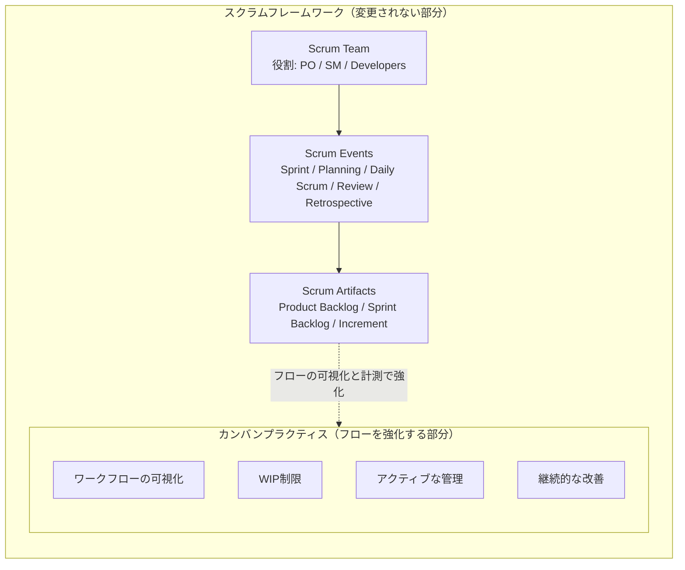
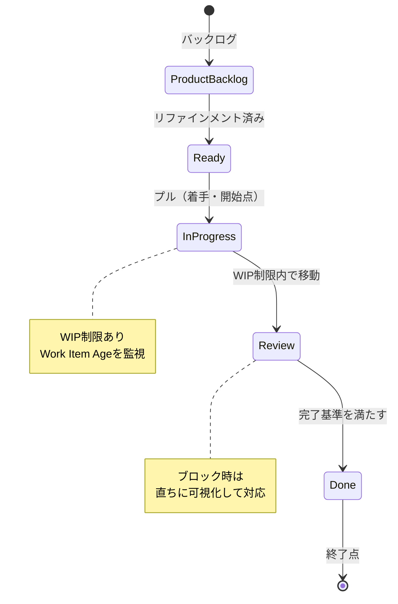
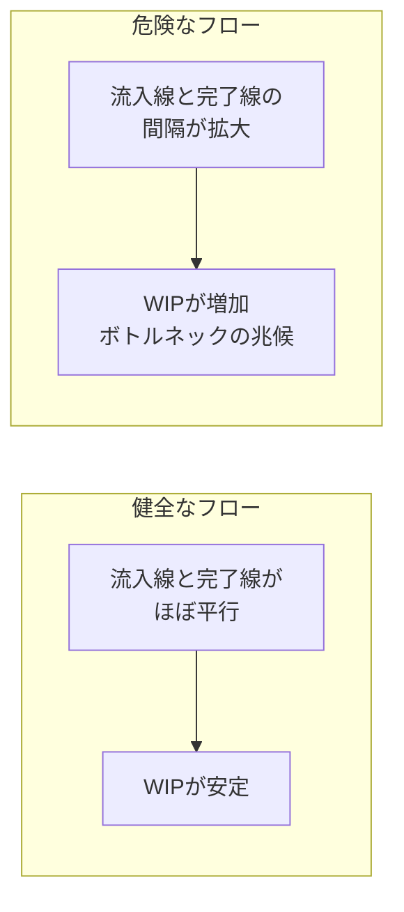
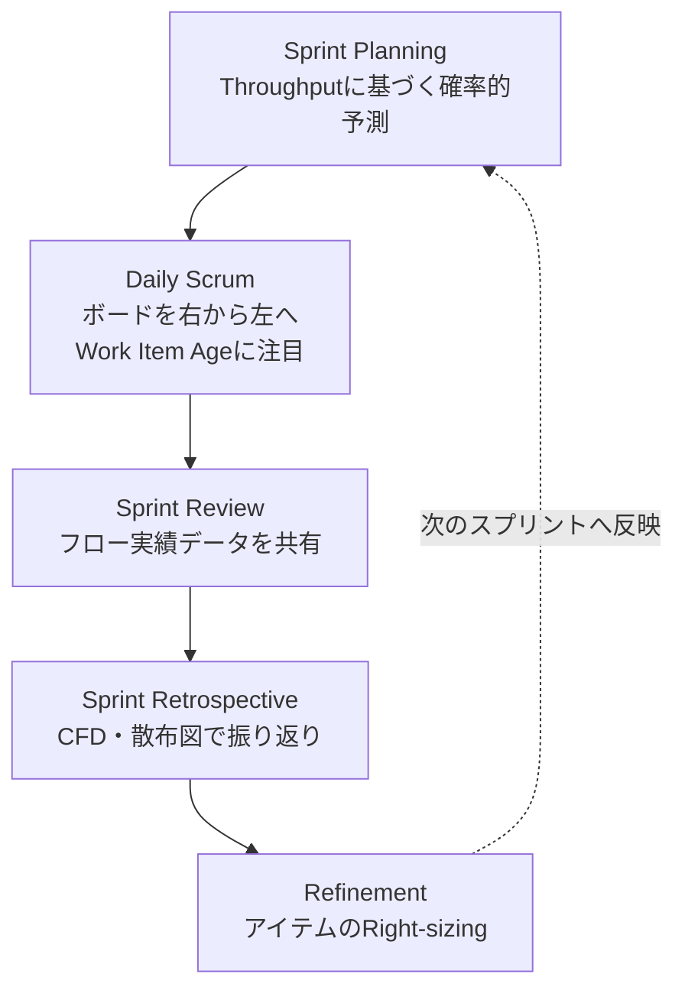
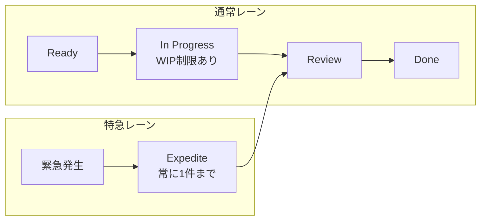

# Professional Scrum with Kanban（PSK I）認定試験 学習ガイド

> スクラムとカンバンの初学者でも体系的に理解できるよう、Scrum.org 公式リソースに基づいて構成した学習ガイドです。すべての図解は Mermaid 構文で表現し、比較・整理が必要な箇所は Markdown テーブルを用いています。

---

## 目次

1. [PSK（Professional Scrum with Kanban）試験概要と基本思想](#1-pskprofessional-scrum-with-kanban試験概要と基本思想)
2. [スクラムチーム向けカンバンの4つの基本プラクティス](#2-スクラムチーム向けカンバンの4つの基本プラクティス)
3. [フローを測る4つの主要メトリクス](#3-フローを測る4つの主要メトリクス)
4. [スクラムイベントにおけるカンバンの適用](#4-スクラムイベントにおけるカンバンの適用実践ベストプラクティス)
5. [ソフトウェアエンジニアリングにおける実践テクニック](#5-ソフトウェアエンジニアリングにおける実践テクニック)
6. [試験対策：頻出の落とし穴とアンチパターン](#6-試験対策頻出の落とし穴とアンチパターン)
7. [参考リソース・公式リンク集](#7-参考リソース公式リンク集)

---

## 1. PSK（Professional Scrum with Kanban）試験概要と基本思想

### 1-1. PSK認定の目的と試験形式

Professional Scrum with Kanban（PSK I）は、Scrum.org が提供する認定資格の一つで、**スクラムチームがカンバンのプラクティスとフローメトリクスをどのように活用して、透明性・予測可能性・価値提供のスピードを高めるか**を検証するものです。PSM（Professional Scrum Master）のように「スクラムの理解」そのものを問うのではなく、**「すでにスクラムを実践しているチームが、フロー最適化の観点でどう改善できるか」**に焦点が当てられている点が特徴です。

| 項目 | 内容 |
|---|---|
| 試験名 | Professional Scrum with Kanban I（PSK I） |
| 出題形式 | Multiple Choice（単一選択）／ Multiple Answer（複数選択）／ True or False |
| 問題数 | 45問 |
| 制限時間 | 60分 |
| 合格ライン | 85%（45問中39問以上の正解） |
| 試験言語 | 英語のみ |
| 受験資格 | 公式コース受講は必須ではなく、単独でオンライン受験可能（PSM I相当のスクラム理解とカンバンの基礎知識が前提） |
| 出題の中心テーマ | ①フローメトリクス（Cycle Time・WIPなど）とカンバンプラクティスの理解、②既存のスクラム環境にカンバンのプラクティス／メトリクスを適用した場合の効果の理解 |

> 受験料や出題形式は改定される可能性があるため、受験前に必ず公式ページで最新情報を確認してください。また試験自体は英語でのみ提供されているため、英語の専門用語（Cycle Time、Work Item Age、Throughput、Service Level Expectation など）はそのまま英語表記で覚えておくことを強く推奨します。

参照: [PSK 公式試験概要](https://www.scrum.org/assessments/professional-scrum-with-kanban-certification)

### 1-2. なぜスクラムチームにカンバンが必要なのか

スクラムガイドは意図的に「不完全（purposefully incomplete）」に設計されたフレームワークであり、ワークフローをどう可視化し、どう改善していくかという具体的な実践方法までは規定していません。ここにカンバンのプラクティスを組み合わせることで、スクラムチームは以下を得られます。

- **透明性の向上**：ワークフローの各状態（列）が明確になり、どこに仕事が滞留しているかが一目でわかる。
- **予測可能性の向上**：ベロシティ（相対見積もりの合計）だけでなく、実測されたフローメトリクスに基づく確率的な予測（Sprint Planning での確率的フォーキャストなど）が可能になる。
- **フロー効率への意識転換**：リソース効率（人やチームの稼働率を最大化する発想）ではなく、フロー効率（一つひとつの作業アイテムが最短で完了に向かうこと）を重視する発想へのシフトを促す。

| 観点 | リソース効率（Resource Efficiency） | フロー効率（Flow Efficiency） |
|---|---|---|
| 最適化の対象 | 人・チームの稼働率 | 作業アイテムの流れる速さ |
| 典型的な行動 | 手が空かないよう常に新しい仕事を割り当てる | 仕掛かり中のアイテムを完了させることを優先する |
| WIPへの影響 | 高止まりしやすい | 意図的に制限される |
| 結果として起こりやすいこと | 多くのタスクが同時並行になり、個々のCycle Timeが伸びる（コンテキストスイッチの増加） | 個々のアイテムが早く完了し、リードタイムが安定する |

### 1-3. カンバンの基本原則とスクラムとの補完関係

PSK 学習で最初に押さえるべき思想は、**「スクラムというコンテナ（container）の中で、カンバンがフローを加速させるターボチャージャー（turbocharger）として働く」**という関係性です。カンバンはスクラムのイベント・作成物・役割を一切置き換えません。むしろ、それらが機能する「土台」の中で、作業がどのように流れているかを可視化し、経験主義（Empiricism）による検査と適応をより高い解像度で行うための補完的なプラクティス群です。



この図が示す通り、カンバンはスクラムという「容器」の外側に存在するものではなく、内側でフローを加速させる装置です。試験では「カンバンを導入するとスプリントが不要になる」「カンバンはスクラムのイベントを置き換える」といった誤った選択肢が頻出しますが、これらはすべて誤りです（詳細は[6章](#6-試験対策頻出の落とし穴とアンチパターン)を参照）。

参照: [The Kanban Guide for Scrum Teams](https://www.scrum.org/resources/kanban-guide-scrum-teams) / [Scrum with Kanban リソースハブ](https://www.scrum.org/resources/professional-scrum-with-kanban)

---

## 2. スクラムチーム向けカンバンの4つの基本プラクティス

Kanban Guide for Scrum Teams では、スクラムチームがフロー最適化を実現するための基本プラクティスが定義されています。歴史的には4つの基本プラクティスとして整理されていますが、最新版のガイドでは「Service Level Expectation（SLE）」という考え方が「アクティブな管理」の中に明示的に組み込まれています。本ガイドでも、実践上の位置づけがわかるように、4つの基本プラクティスの枠組みの中でSLEに触れます。

### 2-1. ワークフローの定義と可視化（Definition of Workflow）

まず最初に行うべきことは、**「開始点（Started）」と「終了点（Finished）」を明確に定義すること**です。この2点の間にある作業状態（列）をボード上に可視化し、各列に「そのアイテムがどの状態にあれば次の列に進めるか」という**完了基準（Policies）**を明文化します。

- 開始点：バックログから最初に着手された瞬間（多くの場合「進行中（Doing）」に入った時点）
- 終了点：ステークホルダーに価値が届く、または「完了の定義（Definition of Done）」を満たした瞬間
- 各列のPolicies：例えば「レビュー列に入るには、コードレビューのリクエストが出ていること」など

> 重要な誤解ポイント：ワークフローの列は「To Do / Doing / Done」のような単純なタスク状態ではなく、**価値創出の過程を反映した状態遷移**である必要があります。列を増やしすぎると可視化の意味が薄れ、少なすぎるとボトルネックの検出ができなくなります。

### 2-2. 仕掛品制限（Limiting Work in Progress）

WIP制限を設ける最大の目的は、**同時に進行させる作業の数を意図的に絞ることで、個々のアイテムのCycle Timeを短縮し、ボトルネックを可視化すること**です。これはリトルの法則（[3-5章](#3-5-リトルの法則littles-law)参照）に基づく数学的な帰結でもあります。

- WIP制限を超えそうな場合、新しい作業を「開始」するのではなく、既存の仕掛かり中アイテムを完了させることが優先される
- WIP制限が頻繁に超過する列は、ボトルネックの兆候であり、チームの改善対象になる
- WIP制限は列ごとに設定することも、チーム全体で設定することも可能

> **注意**：WIP「メトリクス」（実際に仕掛かっている数）と、WIP「制限（ポリシー）」は別概念です。試験では「WIPメトリクスとWIP制限ポリシーの違いを理解しているか」を問う設問が出やすいポイントです。

### 2-3. アクティブなアイテムの管理（Actively Managing Work Items in Progress）

WIP制限を設けるだけでは不十分で、**進行中のアイテムに積極的に介入し続けること**が求められます。具体的には次の3点です。

1. **プル型システムの徹底**：アイテムは、次の工程に空きが出たときに「引っ張られる（pull）」形で進む。決して押し込む（push）ことはしない。
2. **停滞アイテムへの介入**：不必要に長く同じ状態に留まっているアイテム（Work Item Ageが高いアイテム）に対して早期に手を打つ。
3. **ブロックへの迅速な対応**：ブロックされたアイテムをすぐに可視化し（ボード上にブロッカーの目印を付けるなど）、解消を最優先する。

この「積極的な管理」を支える仕組みが **Service Level Expectation（SLE）** です。SLEとは、**「あるアイテムが開始してから完了するまでにかかる時間の見込みを、期間と確率の組み合わせで表したもの」**です（例：「85%の確率で8日以内に完了する」）。これは固定的な約束（Service Level Agreement）ではなく、あくまで過去のCycle Timeの実績データに基づく統計的な期待値であり、チーム自身がフローの異常を早期発見するための道具として使われます。

### 2-4. ワークフローの継続的改善（Inspecting and Adapting the Definition of Workflow）

ワークフローの定義（列構成、Policies、WIP制限）自体も固定的なものではなく、**継続的に検査され適応される対象**です。スプリントレトロスペクティブでフローメトリクスのデータ（CFD、Cycle Timeの散布図など）を用いて振り返り、必要であれば列の追加・統合、Policiesの見直し、WIP制限値の調整を行います。

以下は、スクラムチームにおける典型的なカンバンボードのフローを状態遷移として表したものです。



参照: [The Kanban Guide for Scrum Teams](https://www.scrum.org/resources/kanban-guide-scrum-teams)

---

## 3. フローを測る4つの主要メトリクス

Kanban Guide for Scrum Teams は、フローの状態を客観的に把握するための4つの基本メトリクスを定義しています。これらはすべて「作業アイテムの個数」または「経過時間（elapsed time、休日や夜間も含む）」で計測される点が共通しており、ストーリーポイントのような相対見積もり単位とは異なります。

### 3-1. Work in Progress（WIP：仕掛中の作業量）

- **定義**：開始されたが、まだ完了していない作業アイテムの数
- **計測単位**：アイテム数（個数）
- **活用法**：WIPを減らす取り組みの進捗を可視化する。WIPの推移はCFD（累積フロー図）の帯の幅として視覚化できる。
- **アンチパターン**：緊急対応やステークホルダーからの圧力で、WIP制限を無視して新しい作業を次々と開始してしまう。これはリトルの法則に反し、結果的に全体のCycle Timeを悪化させる。

### 3-2. Cycle Time（サイクルタイム：作業開始から完了までの実経過時間）

- **定義**：あるアイテムが「開始」されてから「完了」するまでの経過時間
- **計測単位**：日数（休日・夜間を含む経過時間。営業日ベースではない）
- **活用法**：過去のCycle Timeの分布を使って、将来のアイテムの完了時期を確率的に予測する（SLEの根拠データになる）。
- **アンチパターン**：平均値だけを見て「平均Cycle Timeが3日だから大丈夫」と判断してしまう。実際には分布のばらつき（85パーセンタイルや95パーセンタイルなど）を見なければ、外れ値のリスクを見逃す。

### 3-3. Work Item Age（未完了アイテムの経過時間：最も重要な先行指標）

- **定義**：まだ完了していない（進行中の）アイテムが、開始されてから現在までに経過した時間
- **計測単位**：日数
- **活用法**：Cycle Timeが「終わったアイテムにしか使えない遅行指標（lagging indicator）」であるのに対し、Work Item Ageは「今まさに進行中のアイテムに使える先行指標（leading indicator）」です。日々のスタンドアップで「どのアイテムが停滞しているか」を判断する最重要指標。
- **アンチパターン**：アイテムが「完了した後」にしかCycle Timeを振り返らず、進行中の停滞アイテムを放置してしまう。Work Item Ageを日次で監視しないと、問題が手遅れになるまで気づけない。

### 3-4. Throughput（単位時間あたりの完了アイテム数）

- **定義**：単位時間（1日、1週間、1スプリントなど）あたりに完了したアイテムの数
- **計測単位**：アイテム数 / 単位時間
- **活用法**：スプリントプランニングにおける確率的な予測（モンテカルロシミュレーションなど）の基礎データとして使う。
- **アンチパターン**：Throughputの数値そのものを目標化し、アイテムを不必要に細分化して「完了数」を水増しする（メトリクスのゲーミング）。また、Throughputを個人の生産性評価に転用することも、心理的安全性を損なうアンチパターンとして試験で問われやすい。

### 4つのメトリクス比較表

| メトリクス | 定義 | 単位 | 何がわかるか | 典型的なアンチパターン |
|---|---|---|---|---|
| WIP | 開始済み・未完了のアイテム数 | 個数 | 現在の仕掛かり量、ボトルネックの兆候 | WIP制限を無視して仕事を積み増す |
| Cycle Time | 開始〜完了までの経過時間 | 日数 | 完了までにかかる実績時間 | 平均値のみで判断し、ばらつきを見ない |
| Work Item Age | 進行中アイテムの経過時間（現在時点） | 日数 | 今、何が停滞しているか（先行指標） | 完了後の振り返りだけに頼り、日次監視しない |
| Throughput | 単位時間あたりの完了アイテム数 | 個数／単位時間 | チームの実測ペース、予測の基礎データ | 数値目標化によるアイテムの不自然な細分化 |

### 3-5. リトルの法則（Little's Law）

リトルの法則は、WIP・Cycle Time・Throughput の3つのメトリクスを結びつける数学的関係です。Kanban Guide for Scrum Teams における表現は次の通りです。

```text
平均 Cycle Time = 平均 WIP ÷ 平均 Throughput
```

**計算例**：あるチームの平均WIPが10アイテム、平均Throughputが1日あたり2アイテムだとすると、

```text
平均 Cycle Time = 10 ÷ 2 = 5日
```

つまり、このチームでは1つのアイテムが完了するまでに平均5日かかっていることになります。もしチームがCycle Timeを短縮したい場合、リトルの法則が示す打ち手は基本的に2つしかありません。

1. **WIPを減らす**（同時に手を付ける数を絞る）
2. **Throughputを増やす**（自動化やボトルネック解消などでチームの完了ペースを上げる）

多くのマネージャーが陥る失敗は、「Cycle Timeが長すぎる」と感じたときに、**逆効果となる「WIPを増やす」対応**（＝焦って新しい作業をどんどん着手させる）をしてしまうことです。リトルの法則を理解していれば、これが誤りであることは明白です。

**リトルの法則が成立する前提条件**：

- 定常状態（steady state）であること。つまり、アイテムの流入率（Arrival Rate）と流出率（Departure Rate）が長期的にほぼ釣り合っていること
- WIP・Cycle Time・Throughput が同じ単位系（同じ種類のアイテム、同じ計測期間）で測定されていること
- 極端な外れ値（非常に長期間放置されたアイテムなど）が平均値を大きく歪めていないこと

### 3-6. フローチャート・散布図の読み解き方

**累積フロー図（CFD：Cumulative Flow Diagram）**

CFDは、各ワークフロー状態（列）にあるアイテム数の累積を時系列で積み上げて表示したグラフです。読み解きの基本は以下の通りです。

- ある時点での**帯（バンド）の垂直方向の幅** → その状態のWIP
- ある時点での**帯の水平方向の距離** → その状態を通過するのにかかったおおよそのCycle Time
- **一番上の線（総流入）の傾き** → Arrival Rate（流入速度）
- **一番下の線（完了）の傾き** → Throughput（流出速度）
- 流入の線と完了の線の**間隔が時間とともに広がっている場合** → WIPが増加している＝ボトルネックの兆候



**サイクルタイム散布図（Cycle Time Scatterplot）**

完了したアイテムを1つの点として、横軸に完了日、縦軸にそのアイテムのCycle Timeをプロットしたグラフです。

- 点が全体的に低い位置に集まっている → Cycle Timeが短く安定している
- 上方向に外れた点が多い → 特定のアイテムが異常に長くかかっている（原因調査の対象）
- 50パーセンタイル・85パーセンタイル・95パーセンタイルの水平線を引くことで、「〇〇%の確率でN日以内に完了する」というSLEの根拠データになる

参照: [The Kanban Guide for Scrum Teams](https://www.scrum.org/resources/kanban-guide-scrum-teams) / [Little's Law for Professional Scrum with Kanban](https://www.scrum.org/resources/littles-law-professional-scrum-kanban)

---

## 4. スクラムイベントにおけるカンバンの適用（実践ベストプラクティス）

カンバンはスクラムのイベントを置き換えるのではなく、**それぞれのイベントに「フロー視点のデータ」を持ち込むことで、質を高める**という形で統合されます。

### 4-1. Sprint Planning：確率的予測に基づくバックログ選定

従来のストーリーポイントの合計（ベロシティ）だけに頼るのではなく、**過去のThroughputの実績分布**を使った確率的な予測（モンテカルロシミュレーションなど）を組み合わせることで、「今回のスプリントでどれだけの量が完了できそうか」をより現実的に見積もることができます。ベロシティが「見積もりの正確さ」に依存するのに対し、Throughputベースの予測は「実測された完了数」に基づくため、見積もりのブレに影響されにくいという特徴があります。

### 4-2. Daily Scrum：「ボードを右から左へ見る（Walk the Board）」

伝統的な「昨日やったこと／今日やること／障害」という進捗報告型のフォーマットではなく、**ボードを完了に近い列（右側）から着手側の列（左側）へと順に見ていく**進め方が推奨されます。これにより、チームの意識が「新しい仕事を始めること」ではなく「今ある仕事を完了に近づけること」に自然と向きます。

- Work Item Ageが高いアイテム（停滞しているもの）を最初に特定する
- SLEを超えそうなアイテムがあれば、その日のうちに障害排除の対象にする
- WIP制限を超過している列があれば、なぜ超過しているのかをその場で確認する

### 4-3. Sprint Review：フロー実績データの共有

インクリメントとスプリントゴールの達成度に加えて、**Throughputの推移、Cycle Timeの傾向、CFDの状態**といったフローの実績データをステークホルダーと共有することで、「なぜこのペースで進んでいるのか」「次のリリースがいつ頃見込めるのか」について、より透明性の高い対話が可能になります。

### 4-4. Sprint Retrospective：定量的なフローデータに基づく振り返り

CFDやCycle Timeの散布図を持ち込むことで、「なんとなく忙しかった」という定性的な振り返りから、「どの状態でアイテムが滞留していたか」「WIP制限は適切だったか」という**データドリブンな振り返り**に発展させます。ここでの気づきは、[2-4章](#2-4-ワークフローの継続的改善inspecting-and-adapting-the-definition-of-workflow)で説明したワークフロー定義自体の見直しにつながります。

### 4-5. Refinement（リファインメント）：アイテムサイズの均一化（Right-sizing）

大きさのばらつきが大きいアイテムが混在していると、Cycle Timeの予測可能性が下がります。リファインメントの場で**アイテムを可能な限り小さく、かつサイズを揃える（Right-sizing）**ことで、フローの予測可能性が向上します。これはリトルの法則の観点からも合理的です。アイテムが小さく均一であるほど、WIPの数え方やCycle Timeの分布が安定し、SLEの精度も高まります。



参照: [The Kanban Guide for Scrum Teams](https://www.scrum.org/resources/kanban-guide-scrum-teams)

---

## 5. ソフトウェアエンジニアリングにおける実践テクニック

PSK試験はカンバンの概念理解が中心ですが、実務でソフトウェア開発チームがフローを最適化する際に押さえておくべき技術的なプラクティスも併せて理解しておくと、現場適用の解像度が高まります。

### 5-1. バッチサイズの極小化

- **単一責任の原則（Single Responsibility Principle）とプルリクエストの分割**：1つのプルリクエストが複数の関心事を混在させていると、レビューに時間がかかり、Cycle Timeが伸びる要因になる。変更を小さな単位に分割することで、レビューの負荷が下がり、フローが安定する。
- 小さいバッチサイズは、アイテムサイズの均一化（[4-5章](#4-5-refinementリファインメントアイテムサイズの均一化right-sizing)）と同じ思想であり、リトルの法則が示す「予測可能性の向上」に直結する。

### 5-2. CI/CDパイプラインとの統合

- デプロイ頻度の向上とCycle Timeの短縮は相乗効果を持つ。手動のリリース作業や承認待ちの工程が長いほど、コードが完成してから実際に価値が届くまでの経過時間（＝広義のCycle Time）が伸びる。
- 自動化されたテスト・ビルド・デプロイパイプラインは、ワークフローの「完了」に近い列における滞留時間を削減し、結果としてThroughputの向上にも寄与する。

### 5-3. 緊急対応（Fast Track / Expediteレーン）の運用ルール

緊急性の高い作業のために「特急レーン（Expedite Lane）」を設けるチームは多いですが、運用ルールを誤るとWIP制限の意味そのものを壊してしまいます。

- **原則1**：Expediteレーンに入れられるアイテムは、常に1件まで（同時に複数の「緊急」は存在しえないという合意）
- **原則2**：Expediteレーンに入れる基準を明文化し、安易に使われないようにする（例：本番障害のみ、など）
- **原則3**：Expediteレーンのアイテムも、システム全体のWIPの一部としてカウントする。「特急だから制限外」という扱いにしない
- **原則4**：Expediteレーンの使用頻度をレトロスペクティブで振り返り、頻発するようであれば根本原因（プロセスの欠陥や品質問題）に対処する



参照: [Scrum with Kanban リソースハブ](https://www.scrum.org/resources/professional-scrum-with-kanban)

---

## 6. 試験対策：頻出の落とし穴とアンチパターン

### 6-1. 試験でよく出る誤解

| 誤解・アンチパターン | なぜ誤りか |
|---|---|
| カンバンを導入するとスプリントが不要になる、あるいはスクラムイベントを廃止してよい | カンバンはスクラムのイベント・役割・作成物を置き換えない。あくまでフローを可視化・改善するための補完的プラクティスである |
| ベロシティ（相対見積もり）の代わりに、時間による見積もり（時間ベースのタスク見積もり）を義務付けるべきだ | Kanban Guide はストーリーポイントや時間見積もりを義務付けても禁止してもいない。重要なのは実測されたフローメトリクスを活用することであり、見積もり手法そのものを強制するものではない |
| WIP制限を超えて、緊急タスクは無制限にレーンへ入れてよい | Expediteレーンであっても、同時に扱えるのは原則1件までであり、システム全体のWIPとしてカウントされる。無制限に許容するとWIP制限の目的（Cycle Timeの短縮）が崩れる |
| Cycle Timeは平均値だけを見ればよい | 平均値だけでは分布のばらつき（外れ値やロングテール）を見逃す。パーセンタイル（50th/85th/95thなど）に基づく分析がSLEの基礎になる |
| Throughputを上げることそのものが目的である | Throughputはあくまで実測データであり、目標化するとアイテムの不自然な細分化などのゲーミングを招く。目的はあくまで価値のある成果物を継続的に届けることである |
| スクラムマスターがWIP制限を一方的に決定する | ワークフローの定義（DoW）全体に対するアカウンタビリティはScrum Teamにある。Developersは、自分たちの活動に関わる部分を定義し、継続的に検査・適応する |
| WIP制限は「価値を生む作業アイテム」単位ではなく、サブタスク単位で設定すべきだ | WIP制限は、価値を生成する作業アイテム（Product Backlog Item相当）に対して適用されるべきであり、個々のサブタスク単位ではない |

### 6-2. 合格に向けた推奨学習ステップ

1. **The Kanban Guide for Scrum Teams を繰り返し精読する**：PSK I の設問はすべてこの公式ガイドの内容を根拠としているため、一字一句の定義（特に4つのフローメトリクスとカンバンプラクティスの名称・定義）を正確に覚えることが最優先です。
2. **「Little's Law for Professional Scrum with Kanban」を読み込む**：リトルの法則の前提条件や、WIPを増やすことがなぜ逆効果なのかという因果関係を、具体例とともに説明できるレベルまで理解する。
3. **無料の Scrum with Kanban Open Assessment を繰り返し受験する**：出題形式や問われ方に慣れるため、満点近いスコアを安定して取れるまで繰り返すことが推奨されています。
4. **CFDとCycle Timeの散布図を実際に描いて読む練習をする**：グラフから「WIPが増加しているか」「どのパーセンタイルで何日かかるか」を素早く判断できるようにしておく。
5. **確率的予測（モンテカルロシミュレーション）の考え方に慣れる**：ベロシティによる単純な見積もりではなく、実績データに基づく確率分布での予測という考え方の違いを説明できるようにしておく。

参照: [PSK 公式試験概要](https://www.scrum.org/assessments/professional-scrum-with-kanban-certification)

---

## 7. 参考リソース・公式リンク集

本ガイドの解説根拠として参照した公式リソースは以下の通りです。学習の際は、必ず一次情報である公式ガイドおよび公式ページを直接確認してください。

- **PSK 公式試験概要（Scrum.org）**：https://www.scrum.org/assessments/professional-scrum-with-kanban-certification
- **The Kanban Guide for Scrum Teams（公式ガイド最新版）**：https://www.scrum.org/resources/kanban-guide-scrum-teams
- **Scrum with Kanban リソースハブ**：https://www.scrum.org/resources/professional-scrum-with-kanban
- **Little's Law for Professional Scrum with Kanban（Daniel Vacanti によるホワイトペーパー）**：https://www.scrum.org/resources/littles-law-professional-scrum-kanban

---

*本ガイドはScrum.org公式リソースの内容をもとに、PSK I認定試験の学習用に体系立てて再構成したものです。試験内容・出題形式・受験料は変更される可能性があるため、受験前に必ず公式サイトで最新情報をご確認ください。*
