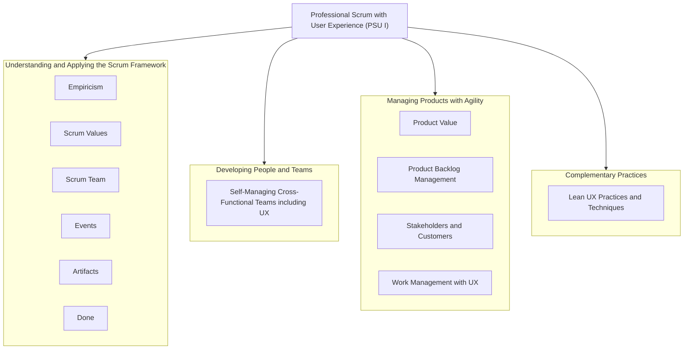
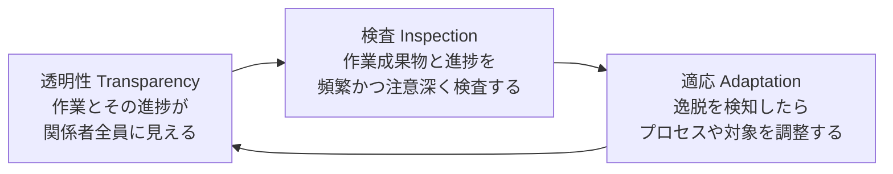
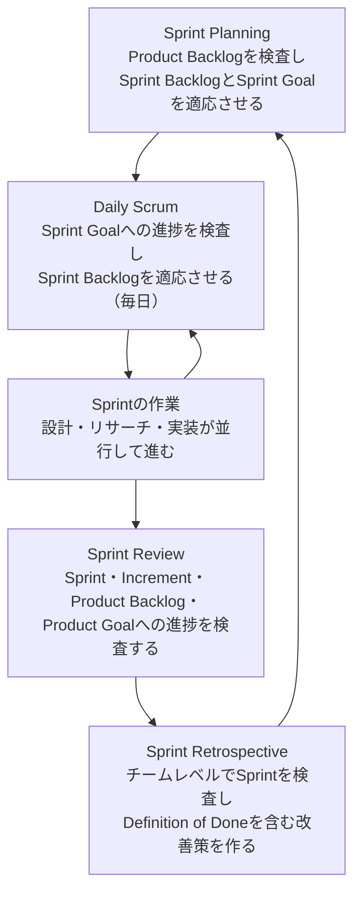
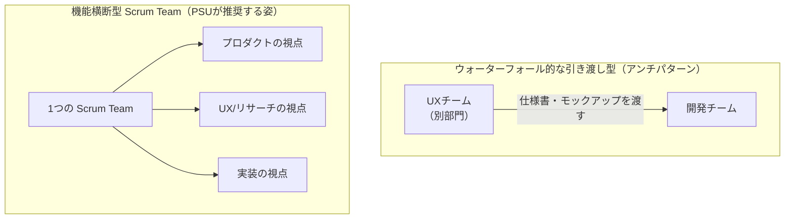
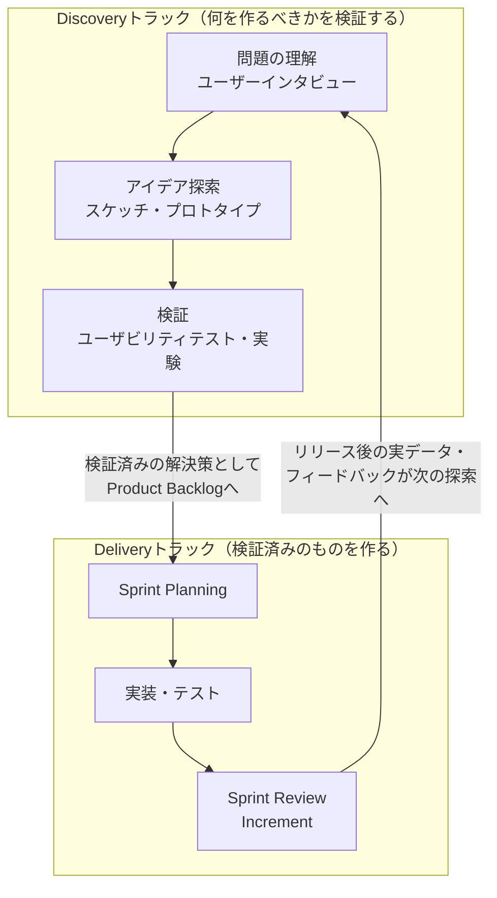
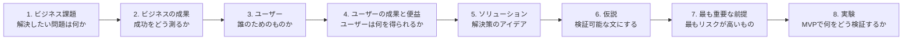
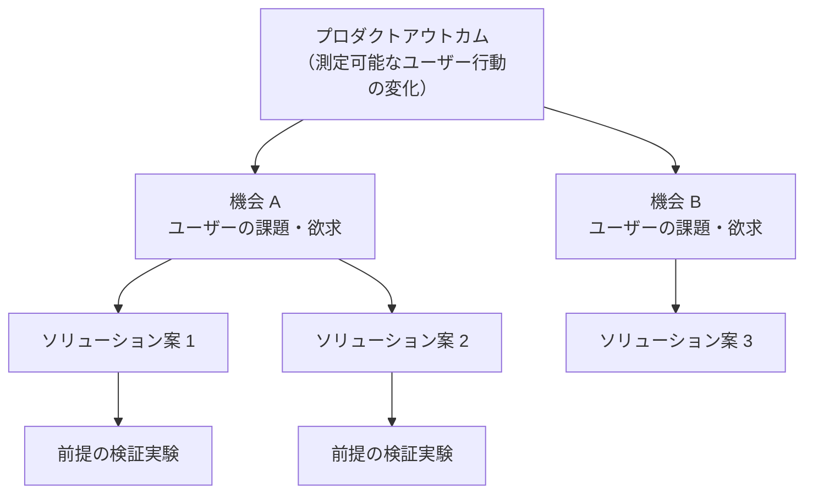
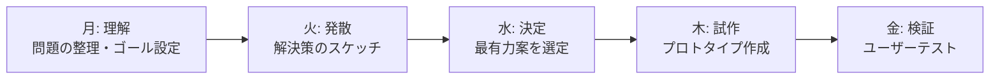
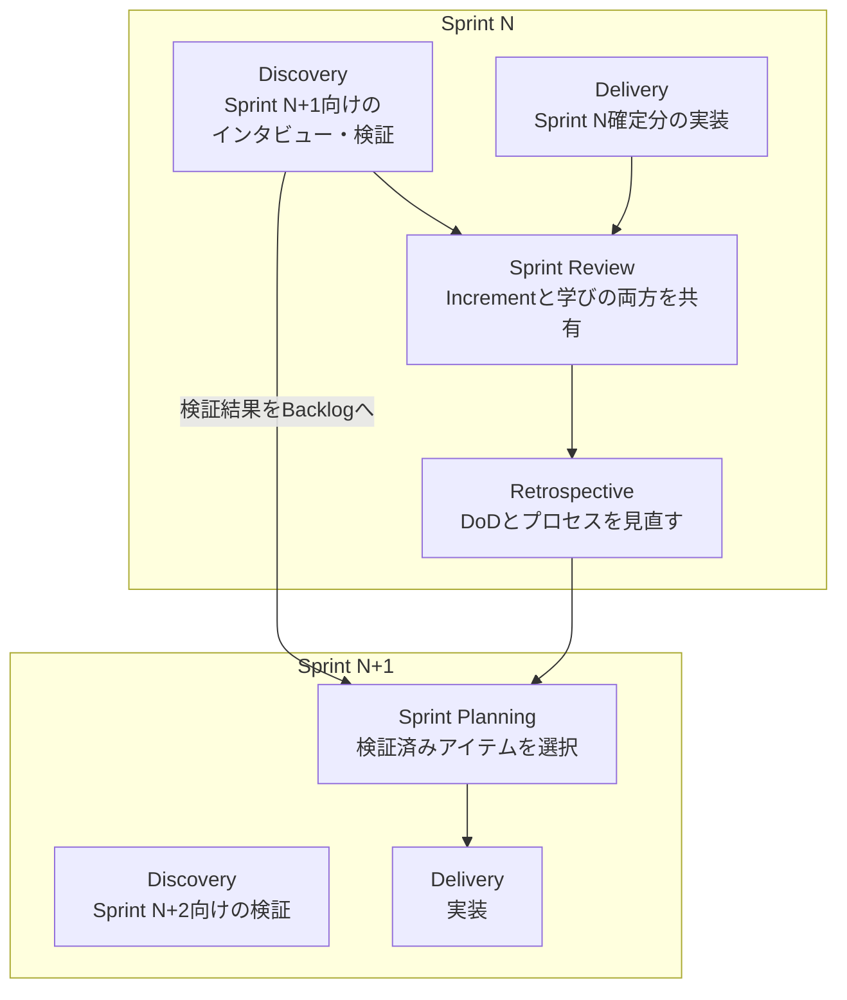
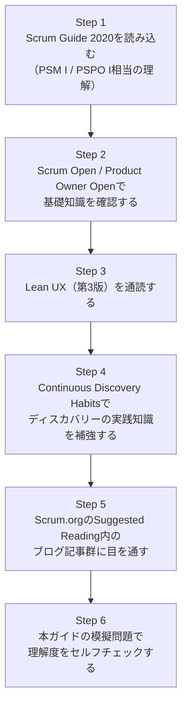

# Professional Scrum™ with User Experience（PSU I）認定資格 学習ガイド

> 対象試験: [Professional Scrum™ with User Experience Certification](https://www.scrum.org/assessments/professional-scrum-user-experience-certification)（Scrum.org）
> 本ガイドは、Scrum初学者〜中級者が「なぜUXとScrumを統合するのか」「どう統合するのか」をステップバイステップで理解し、PSU Iの出題範囲を体系的にカバーすることを目的としています。

---

## 0. この試験について

Professional Scrum with User Experience I（PSU I）は、Scrum TeamがUX（ユーザーエクスペリエンス）をどのようにScrumへ統合し、価値の創出と提供を高めるかについての基礎的な理解を証明する認定資格です。UXデザイナー単体の資格ではなく、**Product Owner・Scrum Master・Developers全員がUXマインドセットを持ってScrumを実践できるか**を問う試験である点が特徴です。

### 0.1 試験概要

| 項目 | 内容 |
|---|---|
| 受験料 | $200 USD（1回の受験につき） |
| 合格ライン | 85% |
| 制限時間 | 60分 |
| 問題数 | 60問 |
| 出題形式 | 選択式（単一選択・複数選択）、正誤問題 |
| 受験前提 | 受講は必須ではないが、PSUトレーニングコースの受講が強く推奨される |
| 有効期限 | 生涯有効（更新不要） |

出典: [Professional Scrum with User Experience Certification – Scrum.org](https://www.scrum.org/assessments/professional-scrum-user-experience-certification)

### 0.2 出題範囲（Focus Areas）

PSU Iは、Scrum.orgが定める [The Professional Scrum Competencies](https://www.scrum.org/professional-scrum-competencies) というコンピテンシーモデルのうち、以下4つのコンピテンシー領域・7つのFocus Areaから出題されます。

| コンピテンシー領域 | Focus Area |
|---|---|
| Understanding and Applying the Scrum Framework （Scrumフレームワークの理解と適用） | Empiricism, Scrum Values, Scrum Team, Events, Artifacts, Done |
| Developing People and Teams （人とチームの成長） | Self-Managing (Cross-Functional) Teams - Including UX |
| Managing Products with Agility （アジリティを持ったプロダクトマネジメント） | Product Value, Product Backlog Management, Stakeholders & Customers, Work Management with UX |
| Complementary Practices （補完的プラクティス） | Lean UX Practices & Techniques |

出典: [Suggested Reading for Professional Scrum with User Experience – Scrum.org](https://www.scrum.org/resources/suggested-reading-professional-scrum-user-experience)

### 0.3 全体マップ

**このガイドの構成:** 第1章〜第4章で上記4領域を順に解説し、第5章で「Sprintの中でどうUXを実践するか」を統合的にまとめます。最後に模擬問題と学習計画、参考文献一覧を掲載します。

---

## 第1章: Understanding and Applying the Scrum Framework（Scrumフレームワークの理解と適用）

PSU Iの土台となる章です。PSM I / PSPO Iと共通のFocus Areaですが、UX視点での補足を随所に加えています。すでにScrumに精通している場合も、UXとの接続部分（1.6節など）は必ず押さえてください。

### 1.1 経験主義（Empiricism）とScrumの理論

Scrumは**経験主義（Empiricism）**と**リーン思考（Lean Thinking）**の上に成り立っています。経験主義とは「知識は経験から生まれ、意思決定は観察された事実に基づいて行われるべきである」という考え方です。UXの世界で言う「推測ではなくユーザー観察・データに基づいて意思決定する」という姿勢そのものであり、これがPSUがLean UXと親和性を持つ根本理由です。

経験主義を支えるのが、以下の**3本柱**です。

| 柱 | 説明 | UXの実務での対応例 |
|---|---|---|
| 透明性 | 作業プロセスと成果物が、実施者・受け手の双方から見える状態であること。透明性が低いと誤った意思決定につながる | ユーザーリサーチの生データや調査結果を、デザイナーだけが抱え込まずチーム全員に共有する |
| 検査 | 成果物やプロセスの状態を、目的からの逸脱を検知するために頻繁に検査すること | プロトタイプを都度チームでレビューし、ユーザーテストの結果を定期的に確認する |
| 適応 | 検査の結果、許容範囲を超える逸脱が判明したら、できるだけ早くプロセスや対象を調整すること | ユーザビリティテストで致命的な問題が見つかったら、次のSprintを待たずデザインを修正する |

出典: [The 2020 Scrum Guide – scrumguides.org](https://scrumguides.org/scrum-guide.html)

### 1.2 Scrumの価値基準（Scrum Values）

Scrum Teamが経験主義を実践するにあたり拠り所とする、5つの価値基準です。

| 価値基準 | 意味 |
|---|---|
|確約（Commitment） | ゴールの達成とお互いの支援にコミットする |
| 集中（Focus） | Sprintの作業とゴールに集中する |
| 公開（Openness） | 作業や課題について透明・オープンである |
| 尊敬（Respect） | 互いを能力のある独立した人間として尊重する |
| 勇気（Courage） | 正しいことをする勇気、困難な問題に取り組む勇気を持つ |

これらの価値がScrum Teamと関わる人々に体現されたとき、経験主義の3本柱（透明性・検査・適応）が実際に機能し始め、信頼が構築されます。UXの文脈では、たとえば「ユーザーテストでデザインの欠陥が見つかったことを正直に共有する（Openness）」「まだ検証されていない仮説であることを認める勇気（Courage）」が典型例です。

出典: [The 2020 Scrum Guide – scrumguides.org](https://scrumguides.org/scrum-guide.html)

### 1.3 Scrum Team とUXの位置づけ

Scrum Teamは、Product Owner・Scrum Master・Developersという3つのアカウンタビリティ（責任）から成る、通常10名以下の小さなチームです。重要なのは、**UXデザイナー / リサーチャーは「別チーム」ではなく、Developersの一員としてScrum Teamに内包される**という考え方です。

| アカウンタビリティ | 主な役割 | UXとの関わり |
|---|---|---|
| Product Owner | プロダクトの価値を最大化する。プロダクトバックログの管理に責任を持つ | ユーザー価値とビジネス価値の両方を代弁し、どの学習・仮説検証を優先するかを判断する |
| Scrum Master | Scrumの理解と実践を組織全体に広める。チームの障害を取り除く | Discovery（発見）とDelivery（提供）の両トラックがうまく協調するようファシリテートする |
| Developers | Increment（インクリメント）を作成する全ての人。デザイナー・リサーチャー・エンジニアを含む | 「デザイナーが作ってエンジニアが実装する」という受け渡し型ではなく、Sprintを通じて協働する |

**Note:** Scrum Guideには「UXデザイナー」という役職名は登場しません。PSU Iが強調するのは、UXの専門性を持つ人を含めてDevelopersを**機能横断的（Cross-Functional）**に構成し、Sprintの中でデザイン・リサーチ・実装が並行して進む状態を作ることです（詳細は第2章）。

出典: [The 2020 Scrum Guide – scrumguides.org](https://scrumguides.org/scrum-guide.html)

### 1.4 Scrumのイベント（Events）

Sprintという「コンテナイベント」の中に、4つの正式なイベントが内包されます。これらのイベントはすべて、検査と適応を行うための機会として設計されています。

| イベント | タイムボックス（目安） | 検査対象 | 適応対象 |
|---|---|---|---|
| Sprint Planning | 1ヶ月Sprintで最大8時間 | Product Backlog、Product Goal | Sprint Backlog、Sprint Goal |
| Daily Scrum | 15分 | Sprint Goalへの進捗 | Sprint Backlog（当日の作業計画） |
| Sprint Review | 1ヶ月Sprintで最大4時間 | Increment、Product Backlogの状態、市場の変化 | Product Backlogの内容・優先順位 |
| Sprint Retrospective | 1ヶ月Sprintで最大3時間 | 個人・相互作用・プロセス・ツール、Definition of Done | 実行可能な改善計画 |

UXの観点で特に重要なのは **Sprint Review** です。ここは単なる「動くソフトウェアのデモ」の場ではなく、**ユーザーやステークホルダーからのフィードバックを得る協働セッション**として設計されています。ユーザビリティテストの結果、デザイン案のフィードバック、ディスカバリー活動で得た学びを共有する最適な場です。

出典: [The 2020 Scrum Guide – scrumguides.org](https://scrumguides.org/scrum-guide.html)、[Three — Wait: Four — Elements of Empiricism – Scrum.org Blog](https://www.scrum.org/resources/blog/three-wait-four-elements-empiricism)

### 1.5 Scrumの作成物（Artifacts）とコミットメント

Scrumには3つの作成物（Artifacts）があり、それぞれに透明性を担保するための「コミットメント」が紐づいています。

| Artifact | 内容 | 対応するコミットメント | コミットメントの役割 |
|---|---|---|---|
| Product Backlog | プロダクトを改善するために必要な作業の、創発的で並び替え可能な一覧 | Product Goal | プロダクトの長期的な目的・状態を示す |
| Sprint Backlog | Sprint GoalとそのためのProduct Backlogアイテム、実行計画 | Sprint Goal | そのSprintで達成したい単一の目的を示す |
| Increment | Sprint中に完成した、これまでのIncrementすべてを合算した具体的な踏み台 | Definition of Done | 品質基準を満たしているかを判断する基準 |

UXの実務では、Product Backlogに「機能（Feature）」だけでなく、**リサーチや検証のための作業（Research Spike、Design Spike、実験ストーリー）**が並ぶ点がPSM/PSPOとの違いです（詳細は3.2節）。

出典: [The 2020 Scrum Guide – scrumguides.org](https://scrumguides.org/scrum-guide.html)

### 1.6 完成の定義（Definition of Done）とUX

Definition of Done（DoD）は、Incrementが満たすべき品質基準の正式な記述であり、Product Backlogアイテムが「Doneとみなされる」ために必要な条件です。DoDを満たさない作業はリリースはおろか、Sprint Reviewで提示することもできません。

PSU Iで問われる重要な論点は、**「UX・デザインに関する検証や作業を、DoDにどう組み込むか」**です。

- デザインだけが完了し、ユーザビリティ検証がまだの状態は「Done」ではない（DoDに「ユーザビリティテストを実施済み」を含めるチームもある）
- 逆に、リサーチや実験そのもの（仮説の検証）は、機能の実装とは別に、それ単体で「学びを得る」という価値を生む作業として扱われる
- 1つのSprintで完結しない大きなデザイン課題は、そのSprintのDoDを満たす小さな単位に分解する（例: 「コンセプト検証まで」を今回のDoneとする）

#### ベストプラクティス

- DoDは固定ではなく、Sprint Retrospectiveを通じて継続的に強化していく（例: 最初はコードレビューのみだったDoDに、後からアクセシビリティ確認やユーザビリティ確認を追加する）
- 「デザインが完了した」と「ユーザーにとって価値があると検証された」を明確に区別し、後者を伴わない完了を安易に許容しない
- 大きすぎるUX課題は、Product Backlog Refinementの中でDoDを満たせるサイズに分解する（詳細は3.2節）

出典: [The 2020 Scrum Guide – scrumguides.org](https://scrumguides.org/scrum-guide.html)

---

## 第2章: Developing People and Teams（人とチームの成長）

### 2.1 自己管理型・機能横断型チーム（Self-Managing Cross-Functional Teams – Including UX）

このFocus Areaは、PSU I独自の重点分野です。PSM Iでは「Self-Managing Teams, Facilitation, Coaching」が問われますが、PSU Iでは**UXを含む機能横断性**にフォーカスが絞られています。

**自己管理（Self-Managing）**とは、Scrum Teamが「誰が」「何を」「いつ」「どのように」作業するかを、外部から指示されるのではなく、内部で決定することです。**機能横断（Cross-Functional）**とは、Sprintの間にIncrementを作成するために必要なすべてのスキル（設計、リサーチ、実装、テストなど）をチーム内に持つことです。

| 観点 | 引き渡し型（アンチパターン） | 機能横断型（PSUが推奨） |
|---|---|---|
| チーム構成 | UXチームと開発チームが別組織・別バックログ | 同じScrum Team、同じProduct Backlog |
| 協働のタイミング | デザインが完成してから開発に引き渡す（Sprint 0的な前倒し作業） | SprintのはじめからPO・SM・デザイナー・エンジニアが一緒に検討する |
| フィードバック | 実装後にしかユーザーの反応が分からない | Sprint中に継続的にプロトタイプ・実装物を検証する |
| スキルの持ち方 | I字型（1つの専門性のみ） | T字型（1つの深い専門性＋他領域への理解と協力） |

#### ベストプラクティス

- UXの専門家をDevelopersチームに常駐させ、「毎Sprint、設計・検証・実装が同時並行で進む」状態を目指す（Dual-Track Agileとの接続は3.4節）
- 「デザイナー」「リサーチャー」「エンジニア」という肩書きより先に、チーム全員が「価値のある成果（Outcome）を届ける」という共通目的を持つ
- T字型スキル（自分の専門を深く持ちつつ、隣接領域を理解し手伝える）を育成し、単一障害点（特定の人しかできない作業）を減らす
- ペアワーク（デザイナー×エンジニア、PO×デザイナーなど）を通じて暗黙知を共有し、引き渡しによる情報の欠落を防ぐ

出典: [The 2020 Scrum Guide – scrumguides.org](https://scrumguides.org/scrum-guide.html)、[The Professional Scrum Competencies – Scrum.org](https://www.scrum.org/professional-scrum-competencies)、[Dual-Track Agile: A Practical Guide for Product Teams](https://www.ideaplan.io/guides/dual-track-agile-guide)

---

## 第3章: Managing Products with Agility（アジリティを持ったプロダクトマネジメント）

### 3.1 プロダクトの価値（Product Value）: アウトプットからアウトカムへ

Scrumの目的は「機能を作ること」自体ではなく、「価値を創出すること」です。PSU Iでは、この価値の考え方をUXの言葉で捉え直します。すなわち **アウトプット（Output）とアウトカム（Outcome）の違い** です。

| | アウトプット（Output） | アウトカム（Outcome） |
|---|---|---|
| 定義 | チームが作り、出荷したもの（機能、画面、リリース） | その結果として生まれた、ユーザーの行動・状態の変化 |
| 例 | 「新しいオンボーディング画面をリリースした」 | 「新規ユーザーの初回利用継続率が向上した」 |
| 測定しやすさ | 測りやすい（完了/未完了） | 測るには仮説と検証が必要 |
| リスク | 作ったのに使われない・価値がない可能性がある | 価値が検証されているため手戻りが少ない |

Lean UXおよびContinuous Discovery Habitsが強調するのは、**Product Backlogの並び替え（優先順位付け）を「機能の大きさ」ではなく「期待されるアウトカムと、それを検証するための学習の速さ」で行う**という発想です。

#### ベストプラクティス

- Product Backlogアイテムに「この機能によって、どのユーザー行動をどう変えたいか」という仮説を明記する
- リリースそのものをゴールにせず、リリース後の指標（継続率、タスク完了率、満足度など）をチームで追跡する
- 「作ったかどうか」ではなく「学んだかどうか・価値があったかどうか」でSprintの成功を評価する文化を作る

出典: [Lean UX, 3rd Edition – O'Reilly](https://www.oreilly.com/library/view/lean-ux-3rd/9781098116293/)、[Continuous Discovery Habits – Product Talk](https://www.producttalk.org/continuous-discovery-habits/)

### 3.2 UXを踏まえたプロダクトバックログ管理（Product Backlog Management with UX）

Product Backlog Managementとは、Product Backlogの内容、可用性、順序を明確にする活動です。UXを統合したチームでは、Product Backlogアイテムの種類が多様化します。

| バックログアイテムの種類 | 内容 | 完了の定義（例） |
|---|---|---|
| 機能ストーリー（Feature Story） | 実装すべき機能要求 | 実装・テスト・DoDを満たしてリリース可能な状態 |
| デザインストーリー（Design Story） | デザイン検討・プロトタイピングの作業 | プロトタイプが完成し、次の検証に進める状態 |
| リサーチスパイク（Research Spike） | ユーザーインタビューや競合調査など、知識を得るための時間限定の調査 | 学びがドキュメント化され、チームに共有された状態 |
| 実験ストーリー（Experiment Story） | 仮説を検証するための小さな実験（A/Bテスト、コンシェルジュMVPなど） | 仮説が検証（または反証）され、結論が出た状態 |

**Backlog Refinement（バックログの磨き込み）** は、これらの多様なアイテムを次のSprintで着手できる十分小さいサイズに分解し、受け入れ基準を明確にする継続的な活動です。UXの検証がまだ済んでいない大きな機能は、まず「検証のための小さな一歩（実験・プロトタイプ）」に分解してからバックログに積むのが定石です。

#### ベストプラクティス

- 「実装ストーリー」と「検証・学習ストーリー」を同じProduct Backlog上で並び替え、優先順位を統一する（別々のバックログに分けると、価値の比較ができなくなる）
- 大きすぎるUX課題は、Discoveryの中でさらに小さな検証可能な単位に分解してからバックログに載せる
- 受け入れ基準にユーザビリティやアクセシビリティの観点を含める

出典: [The 2020 Scrum Guide – scrumguides.org](https://scrumguides.org/scrum-guide.html)、[Lean UX, 3rd Edition – O'Reilly](https://www.oreilly.com/library/view/lean-ux-3rd/9781098116293/)

### 3.3 ステークホルダーと顧客（Stakeholders & Customers）

PSU Iでは、Scrum Teamと関わる関係者を明確に区別して理解しているかが問われます。

| 区分 | 定義 | 具体例 |
|---|---|---|
| 顧客（Customer） | プロダクトを購入・利用し、その価値を直接享受する人 | エンドユーザー、購買担当者 |
| ステークホルダー（Stakeholder） | プロダクトに影響を与える、またはプロダクトから影響を受ける関係者。Scrum Team の外部にいるが、Product Goal や状況に応じて Scrum Team と継続的に協働することもある | 経営層、営業部門、法務、サポート部門、ユーザー代表 |
| ユーザー（User） | 実際にプロダクトを操作・利用する人（顧客と同一とは限らない） | 企業向けSaaSであれば、契約者（顧客）と実際の利用者（ユーザー）が異なることが多い |

UXの実務知識が特に効くのは、この「顧客」「ステークホルダー」「ユーザー」の違いを踏まえて、**適切な相手から適切なタイミングでフィードバックを得る設計**をすることです。Sprint Reviewはステークホルダーとの協働の場であると同時に、可能であれば実際のユーザーやユーザー調査の結果を招き入れる場にもなり得ます。

#### ベストプラクティス

- Sprint Reviewを「社内向けの進捗報告会」にせず、実データ・実ユーザーの声を持ち込む場にする
- ステークホルダーの「要望」と、ユーザー調査で裏付けられた「ニーズ」を区別し、後者を優先する透明な基準を持つ
- ペルソナやジャーニーマップを用いて、チーム全体がどの顧客・ユーザー像に向けて意思決定しているかの共通理解を作る

出典: [The 2020 Scrum Guide – scrumguides.org](https://scrumguides.org/scrum-guide.html)

### 3.4 UXを踏まえたワークマネジメント（Work Management with UX）: Dual-Track Agile

これがPSU I最大の山場です。**「デザイン作業はSprintのリズムに馴染まない」という古くからの課題に、Scrumの枠組みを変えずにどう応えるか**——その答えが **Dual-Track Agile（デュアルトラック・アジャイル）** です。Marty CaganとJeff Pattonが2012年に提唱した考え方が起点になっています。

| | Discoveryトラック | Deliveryトラック |
|---|---|---|
| 目的 | 何を作るべきかを検証する（What） | 検証済みのものを、いかに正しく作るかを実行する（How） |
| 主な活動 | ユーザーインタビュー、プロトタイピング、ユーザビリティテスト、実験 | 設計・実装・テスト・リリース |
| 進むペース | Deliveryより1〜2Sprint先行することが多い | 通常のSprintのリズムで進む |
| 参加者 | PO・デザイナー・リサーチャー（＋必要に応じてエンジニア） | Developers全員 |
| アウトプット | 検証済みの解決策・仮説の結論 | Done Increment |

重要なポイントは、**Dual-Track AgileはScrumのイベントを増やしたり複雑にしたりするものではない**ということです。DiscoveryとDeliveryは「別のプロセス」ではなく、**同じProduct Backlogに合流する、並行した2つの作業の流れ**です。Discoveryで得た学びは、Product Backlogアイテムの作成・リファインメント・並び替え、そしてSprint Planningでの選択に継続的に反映されます。ただしDiscoveryはProduct Backlogへ入るための必須ゲートではありません。未検証の仮説や、それを確かめるための実験そのものをProduct Backlogアイテムとして扱い、Sprintの中で検証することもできます。何をいつ検証するかの判断は、最終的にProduct Ownerの説明責任の範囲にあります。

#### ベストプラクティス

- Discoveryを走らせすぎない。「Deliveryのバックログが常に2〜3Sprint分の検証済みアイテムで満たされている」状態を目安に、Discoveryの投資量を調整する
- Discoveryの結果（検証済み・反証済みの両方）をSprint Reviewで共有し、「学び自体」も成果として扱う
- 1つのSprint内でも、デザイナーは「今のSprintの実装を支援しながら、次のSprintのDiscoveryを進める」という二重の役割を担うのが自然な姿である
- Discovery専用ボード・Delivery専用ボードを分けて運用する場合でも、両者は必ずリンクさせ、Product Backlogとしての優先順位は一元管理する

出典: [What is Dual-Track Agile? – Productboard](https://www.productboard.com/glossary/dual-track-agile/)、[Dual-Track Agile: Managing Discovery and Delivery in a Single Sprint – Sense & Respond Press](https://www.senseandrespond.co/blog/dual-track-agile)、[Professional Scrum with User Experience™ Training – Scrum.org](https://www.scrum.org/courses/professional-scrum-user-experience-training)

---

## 第4章: Complementary Practices — Lean UX Practices & Techniques

PSU Iのもう一つの柱が **Lean UX** です。公式教材はJeff GothelfとJosh Seidenの共著『Lean UX: Designing Great Products with Agile Teams』（第3版）をベースに作られており、実際の合格者体験談でも「この本の内容を理解していれば試験範囲の9割はカバーできる」と言われるほど重要な位置づけです。

### 4.1 Lean UXの基本思想

Lean UXは、Lean StartupとAgile開発に着想を得た、**「成果物（Deliverable）ではなく、体験そのもの」に焦点を当てる**プロダクト開発・デザインの考え方です。

| 従来のUX | Lean UX |
|---|---|
| 詳細なワイヤーフレーム・仕様書などの成果物中心 | 学びを最速で得るための最小限の成果物 |
| 長いリサーチ期間の後にまとめて設計 | 継続的・少人数での検証サイクル |
| フィードバックは早期と終盤のみ | 週次・日次レベルでの継続的なフィードバック |
| 「要求」を確定した事実として扱う | 「要求」は権威を持って語られた仮定に過ぎないとみなす |

Lean UXを支える主な原則は、次の3つのグループに整理されます。

| グループ | 原則の例 |
|---|---|
| チーム編成の原則 | 機能横断型・少人数・専有・自己完結・問題志向のチーム |
| 文化の原則 | アウトプットではなくアウトカムを重視する／無駄を減らす／共通理解を作る／「失敗する許可」を与える |
| プロセスの原則 | 謙虚さを持つ／失敗する許可／自己主導性／透明性 |

#### ベストプラクティス

- 「要求仕様書」を作りこむ前に、まず仮説として明文化し、検証する対象として扱う
- デザインレビューを「承認を得る儀式」にせず、チーム全員が参加する共同作業にする
- 学びを最大化するために、成果物は「伝わる最小限」にとどめる（高精細なモックアップより、素早い検証を優先する）

出典: [Lean UX, 3rd Edition – O'Reilly](https://www.oreilly.com/library/view/lean-ux-3rd/9781098116293/)、[Lean UX — A Summary from the Ground Floor](https://medium.com/10x-curiosity/lean-ux-a-summary-from-the-ground-floor-bc195341dbea)

### 4.2 Lean UX Canvas

Lean UX Canvasは、Jeff Gothelfが考案した1枚のワークショップツールで、チームがビジネス課題を明確にし、前提（Assumption）を洗い出し、仮説（Hypothesis）に変換し、検証実験を設計するプロセスを構造化します。

| Box | 名称 | 問い |
|---|---|---|
| 1 | ビジネス課題 | 私たちが解決しようとしているビジネス課題は何か |
| 2 | ビジネスの成果 | ビジネスとして成功したと言える状態を、どの指標で測るか |
| 3 | ユーザー | 誰のために作るのか（ペルソナ・セグメント） |
| 4 | ユーザーの成果と便益 | ユーザーは何を達成・体験できるようになるか |
| 5 | ソリューション | 考えられる解決策のアイデア一覧 |
| 6 | 仮説 | 前提を検証可能な形に変換した文 |
| 7 | 最も重要な前提 | 仮説の中で、間違っていた場合の影響が最も大きいもの |
| 8 | 実験（MVP） | その前提を検証するための最小限の実験・プロトタイプ |

**仮説（Hypothesis）の書き方テンプレート:**

> 私たちは、**［この機能・解決策］**によって、**［これらのユーザー］**が**［この便益・アウトカム］**を得られると信じている。もしこれが正しければ、**［このビジネス成果］**を達成できるだろう。

#### ベストプラクティス

- Canvasはチーム全員（PO・デザイナー・エンジニア・場合によってはステークホルダー）で一緒に埋める。個人やデザイナーだけで完結させない
- 仮説は「測定可能」で「反証可能」な形にする（例: 「使いやすくなる」ではなく「タスク完了時間が20%短縮される」）
- 最もリスクの高い前提（Box 7）から検証する。検証コストが低く、間違っていた場合の影響が大きい前提を最優先にする

出典: [Lean UX Canvas: A Practical Tool for the Lean UX Process](https://creately.com/guides/lean-ux-canvas/)、[Facilitating the Lean UX Canvas: A Workshop Guide for Agile Coaches](https://www.senseandrespond.co/blog/lean-ux-canvas-workshop-guide)

### 4.3 MVPと実験（MVP & Experiments）

Lean UXにおけるMVP（Minimum Viable Product）は、「製品として出荷できる最小限のもの」ではなく、**「学びを得るための最小限の実験」**として捉え直されます。実際の実装を伴わない、ランディングページ・コンシェルジュ型対応・ペーパープロトタイプなども立派なMVPです。

| MVPの種類 | 内容 | 検証できること |
|---|---|---|
| プロトタイプMVP | クリック可能なモックアップ | ユーザーがフローを理解できるか |
| コンシェルジュMVP | 裏側は人力で対応し、自動化されているように見せる | サービス自体に需要があるか |
| フィーチャーフラグMVP | 一部のユーザーにのみ機能を公開する | 実際の利用データ上で仮説が成立するか |
| A/Bテスト | 2つ以上のバリエーションを同時に提示する | どちらのデザインがより高い成果を生むか |

### 4.4 継続的ディスカバリー（Continuous Discovery Habits）

Teresa Torresが提唱する **Continuous Discovery Habits** は、Discoveryを「一度きりのプロジェクト」ではなく**「週次の習慣」**として定着させるためのフレームワークです。PSU Iの公式Suggested Readingでも取り上げられる代表的な書籍の一つです。

主要な実践は次の4つです。

1. **明確なプロダクトアウトカムを持つ** — 「機能をリリースする」ではなく、チームがコントロールできるユーザー行動の変化を目標に据える
2. **週次でユーザーと対話する** — 最低週1回、Product Trio（PO・デザイナー・エンジニアの3者）が揃ってユーザーインタビューを行う
3. **Opportunity Solution Tree（機会ソリューションツリー）で機会を可視化する**
4. **前提を仮説として明示し、意見の対立ではなく実験で検証する**

#### ベストプラクティス

- インタビューはProduct Trio全員で参加する。リサーチ担当者だけに任せない
- 「ユーザーが将来どうしたいか」という仮定の質問ではなく、「過去に実際に何をしたか」という具体的な経験を聞く
- Opportunity Solution Treeは一度作って終わりにせず、新しい学びが得られるたびに更新し続ける

出典: [Continuous Discovery Habits – Product Talk](https://www.producttalk.org/continuous-discovery-habits/)、[Continuous discovery habits: how to build and sustain them](https://greatquestion.co/blog/continuous-discovery-habits)

### 4.5 デザインスプリント（Design Sprint）

Google Venturesが考案した **Design Sprint** は、5日間で「理解 → 発散 → 決定 → 試作 → 検証」を一気に行う、集中型のDiscovery手法です。Dual-Track Agileにおいて、通常の週次ペースの探索だけでは間に合わない、大きな意思決定が必要な場面で使われます。

#### ベストプラクティス

- Design Sprintは頻発させない（燃え尽きにつながる）。年に数回、重要な意思決定のタイミングに絞って実施する
- 参加者には意思決定権を持つ人（PO、時には経営層）を必ず含める。持ち帰って承認を得る形にしない
- 金曜のユーザーテストの結果は、次のDiscoveryやDeliveryの出発点として必ずバックログに反映する

### 4.6 ユーザビリティテスト（Usability Testing）

ユーザビリティテストは、実際のユーザーに製品やプロトタイプを操作してもらい、問題点を発見する手法です。Nielsen Norman Group（NN/g）が提唱する **「5ユーザーの法則」** はPSU Iでも背景知識として押さえておくべき考え方です。

| テスト参加者数 | 発見できるユーザビリティ問題の割合（目安） |
|---|---|
| 1人 | 約31% |
| 5人 | 約85% |
| 15人 | ほぼ100%（費用対効果は逓減） |

ポイントは、「多くの人数を1回で厳密にテストする」より、**「少人数（5人程度）で何度も繰り返しテストする」**方が、限られたリソースの中でより多くの改善につながるという考え方です。これはScrumの反復的・漸進的アプローチと非常に相性が良い発想です。

#### ベストプラクティス

- 大規模な一発勝負のテストより、5人前後の小規模テストをSprintごとに繰り返す
- 定性的な使いやすさの検証（5人ルールが有効な範囲）と、定量的な行動データの検証（A/Bテストなど、より大きなサンプルが必要）を使い分ける
- ユーザーに「thinking aloud（考えていることを声に出す）」形式で操作してもらい、行動と発話の両方を観察する

出典: [Why You Only Need to Test with 5 Users – Nielsen Norman Group](https://www.nngroup.com/articles/why-you-only-need-to-test-with-5-users/)、[How Many Test Users in a Usability Study? – NN/g](https://www.nngroup.com/articles/how-many-test-users/)

### 4.7 その他の関連ツール（補足）

| 手法 | 概要 |
|---|---|
| ユーザーストーリーマッピング（Jeff Patton） | ユーザーの行動フローに沿ってストーリーを並べ、リリースの切れ目（スライス）を可視化する手法。Product Backlogを「積み上げるだけのリスト」ではなく「旅」として捉え直す |
| ペルソナ | 調査に基づく典型的ユーザー像。チーム内の意思決定の共通言語になる |
| カスタマージャーニーマップ | ユーザーが目的を達成するまでの一連の体験・感情の変化を可視化する図 |

出典: [Lean UX, 3rd Edition – O'Reilly](https://www.oreilly.com/library/view/lean-ux-3rd/9781098116293/)

---

## 第5章: SprintサイクルへのUX統合実践（まとめ）

ここまでの内容を、実際の複数Sprintの時間軸に統合すると、次のようなイメージになります。

### 統合の要点まとめ表

| Scrumのイベント/成果物 | UX統合における役割 |
|---|---|
| Product Backlog | 機能・デザイン検証・リサーチ・実験の全アイテムを一元的に優先順位づけする場 |
| Sprint Planning | Discoveryで検証済みのアイテムのみをDeliveryに引き込む関門 |
| Daily Scrum | DiscoveryとDeliveryの進捗を同期し、両者の連携の詰まりを早期発見する場 |
| Sprint Review | Incrementのデモに加え、ユーザーテストや実験の結果を共有し、次の優先順位に反映する場 |
| Sprint Retrospective | Definition of Doneにユーザビリティ・アクセシビリティ観点を追加するなど、プロセス自体を継続的に改善する場 |
| Definition of Done | 「動く」だけでなく「検証された価値がある」水準まで含めるかをチームで合意する基準 |

---

## 模擬問題で理解度チェック

> 以下は学習用に作成した非公式の模擬問題です。実際の試験問題とは異なります。

**Q1.** Scrum TeamがDual-Track Agileを採用する主な目的として、最も適切なものはどれか。

A. Scrumのイベントを増やし、より詳細な計画を立てるため
B. 検証されていないアイデアをDeliveryトラックに直接流し込み、開発速度を上げるため
C. 何を作るべきかを検証するDiscoveryと、それを実装するDeliveryを並行させ、Discoveryで得た学びをProduct Backlogの作成・リファインメント・並び替えへ継続的に反映するため
D. UXデザイナーを開発チームから独立させ、別々のバックログで管理するため

解答と解説

**正解: C**
Dual-Track Agileは、DiscoveryとDeliveryを並行させることで、Deliveryトラックが根拠のある作業に取り組めるようにする考え方です。ScrumのイベントやArtifactを増やすものではなく、同じProduct Backlogに合流します。なお「検証済みの作業しかProduct Backlogに入れてはならない」という意味ではありません。未検証の仮説や実験自体をProduct Backlogアイテムとして扱い、Sprintの中で検証することもできます。Bが誤りなのは、検証を省いて速度だけを上げることがDual-Track Agileの目的ではないためです。

---

**Q2.** Lean UXにおける「仮説（Hypothesis）」の説明として最も適切なものはどれか。

A. すでに市場調査で確定した、疑う余地のない事実
B. 権威を持って語られているが、検証されていない前提を、測定可能・検証可能な形に書き換えたもの
C. デザイナーが個人の経験に基づいて下す最終的な意思決定
D. ステークホルダーからの要望をそのまま文書化したもの

解答と解説

**正解: B**
Lean UXでは「要求は権威を持って語られた前提にすぎない」と捉え、それを検証可能な仮説の形に変換します。仮説は「もし〜すれば、〜という成果が得られるだろう」という形で書かれ、実験によって検証・反証されます。

---

**Q3.** Definition of Doneに関する説明として適切なものはどれか。

A. Definition of Doneは一度定義したら二度と変更してはならない
B. デザインが完成した時点で、そのProduct Backlogアイテムは常にDoneとみなされる
C. Definition of Doneは、Increment（作成物）が満たすべき品質基準の正式な記述であり、Sprint Retrospectiveなどを通じて継続的に強化されうる
D. Definition of DoneはScrum Masterのみが単独で決定する

解答と解説

**正解: C**
Definition of Doneは固定的な文書ではなく、チームの成熟度に応じてSprint Retrospectiveなどを通じて強化されていくものです。デザインが完成しても、品質基準（ユーザビリティ検証などを含む場合はそれも）を満たさなければDoneとはみなされません。

---

**Q4.** ステークホルダーと顧客・ユーザーの違いに関する説明として、最も適切なものはどれか。

A. ステークホルダーと顧客は常に同一人物である
B. ステークホルダーはプロダクトに影響を与える、または影響を受ける関係者であり、顧客・ユーザーと重なることもあるため、それぞれの立場を区別したうえで協働の仕方を設計する必要がある
C. ユーザーは常にプロダクトの購入者と同一である
D. Scrum Teamはステークホルダーの要望のみを優先し、ユーザー調査は不要である

解答と解説

**正解: B**
ステークホルダー、顧客、ユーザーは重なることもありますが、常に同一とは限りません。特にBtoBプロダクトでは、契約する顧客と実際に使うユーザーが異なることが多く、これらを区別して意思決定することが重要です。なお、ステークホルダーは「日々の開発に関与しない人」に限定されません。Sprint Review での協働が中心になる場合もあれば、Product Goal や状況によっては Scrum Team と継続的に協働する場合もあります。

---

**Q5.** Nielsen Norman Groupが提唱する「5ユーザーの法則」が示唆する実践として、最も適切なものはどれか。

A. どのような検証でも常に5人だけをテストすれば十分である
B. 大規模な一度きりのテストより、少人数（目安5人程度）でのテストをSprintごとに繰り返す方が、限られたリソースの中で効果的なことが多い
C. 5人未満のテストにはまったく意味がない
D. 定量的なA/Bテストも5人で十分である

解答と解説

**正解: B**
「5ユーザーの法則」は定性的なユーザビリティテストにおける目安であり、少人数での反復的なテストが効率的であることを示しています。定量的な検証（A/Bテストなど）にはより大きなサンプルが必要になる点には注意が必要です。

---

## 学習の進め方（おすすめステップ）

1. **Scrum Guideの理解を固める** — PSU Iの半分近くは通常のScrum知識（PSM I / PSPO I相当）です。ここが曖昧だと、UX固有の設問以前に失点します。
2. **Scrum OpenとProduct Owner Openを繰り返す** — Scrum.orgが無料公開している練習アセスメントで、基礎知識の抜けを確認します。
3. **Lean UX（第3版）を読む** — 本ガイドの第4章はこの書籍の要点整理です。可能であれば原著（またはその要約）にも目を通すことを推奨します。
4. **Continuous Discovery Habitsに目を通す** — Discoveryの具体的な実践習慣（週次インタビュー、Opportunity Solution Tree）の理解を深めます。
5. **Scrum.orgのSuggested Readingのブログ記事群を確認する** — 「Work Management with UX」など、公式ガイド本体には載っていない実践的な視点を補います。
6. **本ガイドの模擬問題や、他の非公式練習問題で理解度を確認する**

---

## 参考文献・情報源一覧

### Scrum.org 公式

- [Professional Scrum with User Experience Certification](https://www.scrum.org/assessments/professional-scrum-user-experience-certification)
- [Suggested Reading for Professional Scrum with User Experience](https://www.scrum.org/resources/suggested-reading-professional-scrum-user-experience)
- [The Professional Scrum Competencies](https://www.scrum.org/professional-scrum-competencies)
- [Professional Scrum with User Experience™ Training](https://www.scrum.org/courses/professional-scrum-user-experience-training)
- [Scrum.org Launches Professional Scrum with User Experience (PSU) Training Course](https://www.scrum.org/resources/scrumorg-launches-professional-scrum-user-experience-psu-training-course)
- [Three — Wait: Four — Elements of Empiricism (Scrum.org Blog)](https://www.scrum.org/resources/blog/three-wait-four-elements-empiricism)

### Scrum Guide

- [The 2020 Scrum Guide – scrumguides.org](https://scrumguides.org/scrum-guide.html)

### Lean UX / 書籍

- [Lean UX, 3rd Edition – O'Reilly（Jeff Gothelf, Josh Seiden）](https://www.oreilly.com/library/view/lean-ux-3rd/9781098116293/)
- [Chapter 7. Integrating Lean UX and Agile – O'Reilly](https://www.oreilly.com/library/view/lean-ux/9781449366834/ch07.html)
- [Lean UX Canvas: A Practical Tool for the Lean UX Process](https://creately.com/guides/lean-ux-canvas/)
- [Facilitating the Lean UX Canvas: A Workshop Guide for Agile Coaches](https://www.senseandrespond.co/blog/lean-ux-canvas-workshop-guide)

### Continuous Discovery / Dual-Track Agile

- [Continuous Discovery Habits – Product Talk（Teresa Torres）](https://www.producttalk.org/continuous-discovery-habits/)
- [Continuous discovery habits: how to build and sustain them](https://greatquestion.co/blog/continuous-discovery-habits)
- [What is Dual-Track Agile? – Productboard](https://www.productboard.com/glossary/dual-track-agile/)
- [Dual-Track Agile: Managing Discovery and Delivery in a Single Sprint – Sense & Respond Press](https://www.senseandrespond.co/blog/dual-track-agile)
- [Dual-Track Agile: A Practical Guide for Product Teams](https://www.ideaplan.io/guides/dual-track-agile-guide)

### ユーザビリティテスト

- [Why You Only Need to Test with 5 Users – Nielsen Norman Group](https://www.nngroup.com/articles/why-you-only-need-to-test-with-5-users/)
- [How Many Test Users in a Usability Study? – Nielsen Norman Group](https://www.nngroup.com/articles/how-many-test-users/)

### 受験体験記（参考・非公式）

- [Passing the PSU I assessment with 100% — a retrospective (Medium)](https://medium.com/serious-scrum/passing-the-psu-i-assessment-with-100-a-retrospective-97c5f34cb831)
- [How To Pass The Professional Scrum With User Experience (PSU I) Assessment](https://www.thescrummaster.co.uk/scrum/how-to-pass-the-professional-scrum-with-user-experience-i-psu-i-assessment/)

---

*本ガイドは学習支援を目的とした非公式の要約・解説であり、Scrum.orgによる公式教材ではありません。試験の最新の出題範囲・詳細は必ず [Scrum.org公式サイト](https://www.scrum.org/assessments/professional-scrum-user-experience-certification) でご確認ください。*
