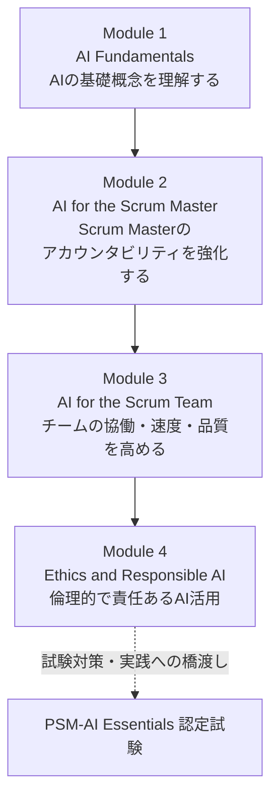
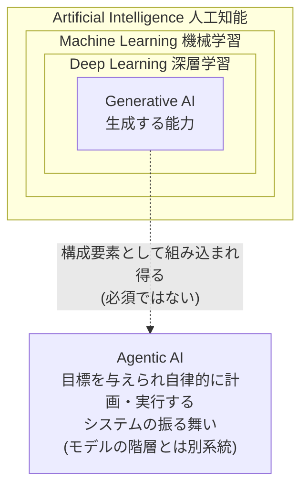
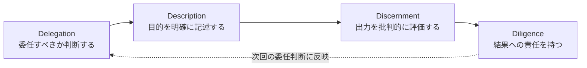
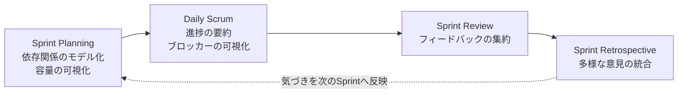
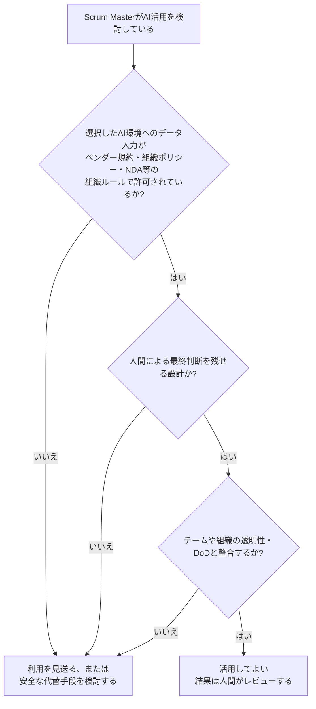

# Professional Scrum Master™ - AI Essentials (PSM-AI Essentials) 学習ガイド

> 世界トップクラスのソフトウェアエンジニア兼スクラムマスターの視点から、Scrum.org公式のProfessional Scrum Master™ - AI Essentials Certificationについて、初学者でも迷わず学べるようステップバイステップで解説します。各項目には根拠となる出典URLを付記しています。

**公式認定ページ:** https://www.scrum.org/assessments/professional-scrum-master-ai-essentials-certification

---

## 目次

0. [このガイドについて](#0-このガイドについて)
1. [認定資格の全体像](#1-認定資格の全体像)
2. [Module 1: AI基礎知識(AI Fundamentals)](#2-module-1-ai基礎知識ai-fundamentals)
3. [Module 2: Scrum MasterとAI](#3-module-2-scrum-masterとai)
4. [Module 3: Scrum チームとAI](#4-module-3-scrum-チームとai)
5. [Module 4: 責任あるAI利用と倫理](#5-module-4-責任あるai利用と倫理)
6. [発展: エージェント時代のScrum Master像](#6-発展-エージェント時代のscrum-master像)
7. [試験対策チェックリスト](#7-試験対策チェックリスト)
8. [用語集(Glossary)](#8-用語集glossary)
9. [参考文献・出典](#9-参考文献出典)

---

## 0. このガイドについて

### 対象読者

- Scrum Masterの経験があり、AIの実務活用を体系的に学びたい方
- PSM-AI Essentials受験を予定しているが、AIの基礎用語(機械学習・深層学習・生成AI・エージェンティックAI)にまだ自信がない方
- チームにAIを安全に導入する際の「型」を持ちたいAgile Coach / スクラムマスター

### このガイドの読み方

各Moduleは「概念解説 → ベストプラクティス → 出典」の順に構成しています。図解はすべてMermaid記法、比較・整理はMarkdown表で統一し、ASCIIアートは使用していません。Mermaidに対応したビューア(GitHub、VS Code、Obsidian等)で閲覧すると図が正しく描画されます。

> **[補足]** PSM-AI Essentialsは「Scrum Masterが実務でAIをどう使うか」を問う資格であり、AIエンジニアリングやデータサイエンスの技術試験ではありません。公式に示されている出題領域は **AI Theory and Primer / AI Security and Ethics / AI for Scrum Masters / Effective AI Prompting** の4カテゴリーです。いずれも、AIエンジニアではなくユーザーの視点からのAI理解、Scrum実務への応用、そして倫理・責任という文脈で問われます。(出典: 1, 7)

---

## 1. 認定資格の全体像

### 1.1 PSM-AI Essentialsとは

Professional Scrum Master™ - AI Essentials Certification(PSM-AI Essentials)は、Scrum.orgが提供する認定資格で、Scrum MasterとしてAIを活用する知識を証明するものです。公式ページでは次のように説明されています。

> **[出典に基づく要約]** 本認定は、Professional Scrum MasterとしてAIを応用する知識を検証し、AIツールと実践知識を用いてScrum Teamの効果を高める理解を示すものである。生成AIを活用してScrum Team内の協働と透明性を促進する実践力に加え、責任ある倫理的なAI利用、そしてそれがDefinition of Doneに与える影響へのコミットメントを実証する。(出典: 1)

重要なポイントは、この資格が**Scrum.orgの正式トレーニングを受講した学生にのみ提供される**「コースゲート型」の認定である点です。他の多くのScrum.org認定(PSM Iなど)は誰でも受験できますが、PSM-AI Essentialsは「Professional Scrum Master™ - AI Essentials Training」の受講が前提条件になります。(出典: 1, 2)

### 1.2 対象者・受験要件

| 項目 | 内容 |
| --- | --- |
| 前提知識 | Scrumフレームワークの基本理解が推奨される |
| Scrum Master経験 | あれば望ましいが必須ではない |
| AI・技術的前提知識 | 不要(ユーザー視点からAIを学ぶ設計) |
| 受講形式 | インストラクター主導トレーニング。対面開催は通常1日間。Live Virtual Class などのオンライン開催では、複数の短い日程に分割されることがある。対面開催では実機(自分のデバイス)持参が推奨 |
| 受験資格 | 公式トレーニング修了者のみ(試験パスワードが付与される) |

(出典: 1, 2, 7, 12)

> **[補足]** 本コースは「高度な機械学習やデータサイエンスの内容を意図したものではない」と明記されています。あくまで実務でAIツールを使うScrum Master向けの内容です。(出典: 7)

### 1.3 試験概要

公式認定ページに記載されている試験詳細は次の通りです。

| 項目 | 内容 |
| --- | --- |
| 出題数 | 20問 |
| 形式 | 選択式(Multiple Choice) |
| 制限時間 | 30分 |
| 合格ライン | 85%以上 |
| 言語 | 英語 |
| 受験資格 | PSM-AI Essentialsトレーニング受講者のみ |
| デジタルバッジ | Credly発行の無料デジタル資格証明が付帯 |
| 資格の有効期限 | 生涯有効(更新料なし) |
| パスワードの有効期限 | 期限なし、ただし1回のみ有効 |

(出典: 1)

> **[注意]** 一部のトレーニングパートナー(再受験企業など)のページでは「40問・60分」「45分」など異なる数値が掲載されている場合があります。これはパートナー側ページの記載更新タイミングのずれによるものと考えられるため、**受験直前は必ず公式ページ(出典1)で最新の試験詳細を確認してください。**

### 1.4 学習の進め方

トレーニングは4つのコアモジュールで構成されています(出典: 12)。本ガイドもこの構成に沿って第2〜5章を組み立てています。

---

## 2. Module 1: AI基礎知識(AI Fundamentals)

### 2.1 AIとは何か

AI(Artificial Intelligence, 人工知能)は、人間の知的な振る舞い(認識・推論・学習・判断)をコンピュータで模倣する技術分野全体を指す包括的な言葉です。PSM-AI Essentialsでは、この分野を技術的な深堀りではなく「ユーザー視点」から理解することが求められます。(出典: 7)

コースの学習目標として、公式には次の内容が明記されています。

> **[出典に基づく要約]** 機械学習・深層学習・生成AI・エージェンティックAIを含む主要なAI概念を説明できること。(出典: 11)

### 2.2 機械学習(Machine Learning)

機械学習は、明示的にルールをプログラムするのではなく、**データからパターンを学習する**手法です。Scrum Teamの文脈では、過去のベロシティやバグ発生傾向など「データの蓄積があるもの」に強みを発揮します。

### 2.3 深層学習(Deep Learning)

深層学習は機械学習の一分野で、**多層のニューラルネットワーク**を用いて、より複雑なパターン(自然言語、画像など)を認識・生成する手法です。生成AIの多くはこの深層学習の技術基盤の上に成り立っています。

### 2.4 生成AI(Generative AI)

生成AIは、学習したパターンをもとに**新しいテキスト・要約・コード・画像などのコンテンツを生成する**AIの能力です。Scrum Masterにとって最も日常的に触れる領域であり、ステークホルダー向け更新情報の下書き、会議準備、要約作成、改善アクションの文書化などに活用されます。(出典: 11)

### 2.5 エージェンティックAI(Agentic AI)とAIエージェント

これはPSM-AI Essentialsで特に重視される新しい概念です。公式ブログでは次のように定義されています。

> **[出典に基づく要約]** エージェンティックAIとは、最小限の人間の介入で、自律的に意思決定を行い、計画を立て、目標達成のためのタスクを実行するよう設計されたAIシステムを指す。(出典: 4)

さらに「AIエージェント」については以下のように説明されています。

> **[出典に基づく要約]** AIエージェントとは、環境を認識し、意思決定を行い、目標達成のために行動を起こす自律的なソフトウェアシステムであり、絶え間ない人間の介入を必要としない。(出典: 4)

**生成AIとエージェンティックAIの違い**が試験上のポイントになりやすいため、明確に区別しておきましょう。

| 観点 | 生成AI (Generative AI) | エージェンティックAI (Agentic AI) |
| --- | --- | --- |
| 中心的な能力 | コンテンツの「生成」 | 目標に向けた「自律的な計画・実行」 |
| 人間の関与 | プロンプトの都度、人間が指示を出す | 一度目標を設定すれば、以降は自律的に動く比率が高い |
| 典型的な利用例 | Retrospectiveの意見を要約する、ユーザーストーリーの下書きを書く | Sprint Planningで複雑な依存関係をモデル化する、繰り返しタスクをオーケストレーションする |
| Scrum Masterに求められる姿勢 | プロンプトの質を高める(プロンプトエンジニアリング) | 権限範囲・監視・説明責任の設計(ガバナンス) |

(出典4の記述をもとに要約・整理)

### 2.6 AIモデルとは

> **[出典に基づく要約]** モデルとは、パターンの認識・予測・新規コンテンツの生成のためにデータセットで訓練されたAIシステムである。例としてOpenAIのGPT-4モデルやGoogleのGemini 1.5 Flashモデルが挙げられる。(出典: 4)

### 2.7 概念の関係性(全体像)

AI・機械学習・深層学習・生成AIは、モデルの技術系統として「入れ子構造」で整理できます。一方でエージェンティックAIは、モデルの階層ではなく「目標を与えられて自律的に計画・実行する」というシステムの振る舞いを指す概念であり、同じ入れ子には収まりません。生成AIはエージェンティックAIの構成要素として組み込まれ得ますが、必須の包含関係でも継承関係でもありません(生成AIを使わないエージェンティックAIも、エージェント化されていない生成AIも存在します)。下図はこの2系統の関係を示したものです。

### 2.8 ベストプラクティス

> **[ベストプラクティス]** Scrum Masterは、AIツールを選定・提案する際に「これは生成AI(コンテンツを作る)なのか、エージェンティックAI(自律的に動く)なのか」を最初に切り分けてチームに説明する。この区別が、後述する権限設計・監視の要否を決める土台になる。

<!-- -->

> **[ベストプラクティス]** 技術的な仕組みを完璧に理解する必要はない。「何ができて、何が苦手か(限界)」をユーザー視点で言語化できることの方が、Scrum Masterの実務では重要視される。(出典: 7「Key AI concepts are explained from the user perspective」)

---

## 3. Module 2: Scrum MasterとAI

### 3.1 Scrum Masterのアカウンタビリティとの接続

PSM-AI EssentialsはScrumの基礎知識を前提にしています。Scrum Guide(2020)では、Scrum Masterは「Scrum Teamの有効性(effectiveness)に対して説明責任を負う真のリーダーシップの役割」と定義されており、Scrum Team・組織それぞれに対する奉仕(サーブ)の形でその役割を果たします。(出典: 8)

PSM-AI Essentialsのコース目標では、この基礎の上にAIを重ねる形で以下が掲げられています。

> **[出典に基づく要約]** AIがどのようにScrum Teamの効果的なファシリテーションと協働を支えるかを説明できること。実際のユースケースを通じて、AIツールがScrum Masterのアカウンタビリティをどのように強化しうるかを議論できること。(出典: 11)

### 3.2 「チャットボットを超えて」— AIはファシリテーションのパートナー

公式ブログ「Scrum Master as the AI Catalyst」では、AIを単純な質問応答ツール(チャットボット)として捉えるのではなく、**チームの協働を支えるファシリテーションパートナー**として位置づけることの重要性が述べられています。

> **[出典に基づく要約]** AIは単純なQ&Aツールとして見られがちだが、その真の力はチームの協働を支援する点にある。Retrospectiveで多様な意見を統合するために生成AIを使ったり、Sprint Planningで複雑な依存関係をモデル化するためにエージェンティックAIを使ったりする場面を想像してほしい。AIを日々の業務に組み込むことで、Scrum Masterは認知負荷を減らし、最も重要なこと、すなわち「人」に集中できるようになる。(出典: 3)

### 3.3 プロンプトエンジニアリングというスキル

同ブログでは、良いファシリテーションが「適切な問いを立てる技術」であるのと同様に、AIとの対話でも「プロンプトエンジニアリング」が重要なスキルになると述べています。

> **[出典に基づく要約]** 効果的なファシリテーションには適切な問いを立てることが求められる。デジタル時代においてこれは技術との対話の仕方にも及ぶ。「プロンプトエンジニアリング」は、アジャイルリーダーにとって重要なスキルになりつつある。(出典: 3)

<!-- -->

> **[ベストプラクティス]** プロンプトを書く際は、①目的(何のためのアウトプットか)、②文脈(チームの状況・制約)、③期待する形式(要約か、箇条書きか、質問リストか)の3点を明示すると、Scrum関連のプロンプト品質が安定する。より汎用的なプロンプト設計の考え方は出典13も参考になる。

### 3.4 4D AI Fluency Framework

公式ブログ「The Scrum Master's AI Start Checklist」で紹介されている、AIと責任を持って関わるための実践的フレームワークです。「AI対応力のあるScrum Masterは、AIとのやり取りが効果的・効率的・倫理的・安全であることを保証するために、この4Dフレームワークの境界内でAIを活用する」とされています。(出典: 4)

| D | 名称 | 内容 |
| --- | --- | --- |
| 1 | **Delegation(委任)** | 目標を設定し、いつ・どのようにAIに関与させるかを決める |
| 2 | **Description(記述)** | 有用なAIの振る舞いとアウトプットを引き出すために、目標を的確に説明する |
| 3 | **Discernment(見極め)** | AIのアウトプットや振る舞いの有用性を正確に評価する |
| 4 | **Diligence(責任)** | AIを使って行ったこと・その方法について責任を持つ |

(出典: 4)

> **[ベストプラクティス]** 4DフレームワークはScrumの経験主義(検査と適応)と親和性が高い。AIの出力をそのまま採用するのではなく、Discernment(見極め)の工程を必ず挟み、Diligence(責任)の主体を「AI」ではなく常に「人間(Scrum MasterやTeam)」に置く。

### 3.5 Scrumイベント別のAI活用

コースの学習目標には「生成AIツールをScrum TeamやScrum Eventsを支援するために実践的に活用できること」が含まれます。(出典: 11)

**「良いAIを活かしたDaily Scrum」の定義(チェックリスト)**

公式ブログでは、AIが適切に活用された状態のDaily Scrumの特徴が具体的にリストされています。

> **[出典に基づく要約]** Sprint Goalが会話の中心にあること。今日のための明確で実行可能な計画が生まれること。得られた気づきが実際に使われること。チームメンバーが適切なタイミングでアラートを受け取れること。ブロッカーが可視化されていること。ポジティブで生産的であり、時間通りか早めに終わること。チームが「次に何をすべきか」を明確に理解して終えること。(出典: 4)

日常業務へのAI組み込みについても、公式トレーニングの説明では次のような具体例が挙げられています。

> **[出典に基づく要約]** ステークホルダー向け更新情報の下書き、会議準備、要約作成、改善アクションの文書化など、Scrum Masterの日常的なタスクをAIがどのように支援できるかを学ぶ。参加者は、複雑さを増やすことなくAIを既存のワークフローに溶け込ませる方法を学ぶ。(出典: 11)

### 3.6 ベストプラクティス表

| 場面 | ベストプラクティス | 避けるべきアンチパターン |
| --- | --- | --- |
| Sprint Planning | AIに依存関係やリスクの「たたき台」を出させ、最終判断はチームで行う | AIが出した見積り・計画をそのままSprint Backlogとして確定する |
| Daily Scrum | 進捗要約やブロッカー検知の補助として使い、対話の主役は人に残す | AIによる自動要約だけで済ませ、チームの対話・検査の機会を奪う |
| Sprint Review | 多様なステークホルダーのフィードバックの構造化・要約に使う | フィードバックの解釈や優先順位付けをAIに丸投げする |
| Retrospective | 多様な意見の統合、論点の可視化に使う(出典3) | 心理的安全性が必要な発言までAIツールに入力してしまう |
| 日常業務 | ステークホルダー更新・会議準備・要約・改善アクションの文書化を効率化する(出典11) | 定型作業の効率化を超えて、人と人との信頼構築の代替として使う |

---

## 4. Module 3: Scrum チームとAI

### 4.1 チームレベルでのAI活用の観点

公式トレーニングの説明では、このモジュールは次のように位置づけられています。

> **[出典に基づく要約]** Scrum Teamのメンバーが、協働・ベロシティ・デリバリーの品質を高めるためにどのようにAIを適用できるかを探求する。(出典: 12)

Scrum Masterはこのモジュールにおいて、「自らAIを使う」だけでなく、**チームがAIを安全かつ効果的に使えるように支援・コーチングする**役割を担います。

### 4.2 Definition of Doneの変化 — 「透明性のファイアウォール」

PSM-AI Essentials認定ページの説明にもある通り、AI活用はDefinition of Done(完成の定義)に直接影響します。公式ブログ「AI Is Rewiring Scrum Teams, But Not Scrum」では、この関係が端的に表現されています。

> **[出典に基づく要約]** Scrum TeamはDefinition of Doneの中で、AIが生成した成果物がどのように使用され、検証され、統合されるかを明示的に宣言することで、ステークホルダーの信頼を獲得し、共通理解を高めることができる。「AIが支援したコードは、人間によるレビューと人間が作成したテストに合格しなければならない」——これは任意ではなく、新しい基準線である。この作業合意がなければ、チームは目に見えない技術的負債を抱えることになる。(出典: 5)

同記事では、Definition of Doneの改訂例として「AI生成コードにも人間が書いたコードと同等のカバレッジ・品質でユニットテスト・統合テストが揃っていること」「受け入れ基準は人間が作成すること」といった項目が挙げられています。(出典: 5)

> **[出典に基づく要約]** 透明性は「あれば望ましいもの」ではなく、存続の条件である。(出典: 5)

### 4.3 具体的な整理: DoDに追加を検討すべき観点

| カテゴリ | Definition of Doneに追記する観点の例 |
| --- | --- |
| コード生成 | AI支援コードは人間によるレビューとテストに合格していること |
| テスト | AI生成コードも人間が書いたコードと同等のカバレッジ・品質基準を満たすこと |
| 受け入れ基準 | 受け入れ基準そのものは人間が作成すること |
| 出所の透明性 | どの成果物がAI支援で作られたかを、チーム・ステークホルダーに分かる形にすること |

(出典5の内容をもとに整理)

### 4.4 ベストプラクティス

> **[ベストプラクティス]** Scrum Masterは、チームがAIツールを導入するタイミングで「Definition of Doneを見直す会話」をファシリテートする。これは一度きりのイベントではなく、Sprint Retrospectiveのたびに検査・適応する継続的なプロセスとして扱う。

<!-- -->

> **[ベストプラクティス]** 「AIが作った/使った」という事実そのものより、「それがどう検証され、統合されたか」をDoDで明確にすることが透明性の核心である。(出典: 5)

---

## 5. Module 4: 責任あるAI利用と倫理

### 5.1 なぜ倫理が問われるのか

PSM-AI Essentials認定ページでは、この資格が「責任ある倫理的なAI利用へのコミットメント」を実証するものであると明記されています。(出典: 1) Scrum Masterは、チームや組織に対してAIの安全な導入を推進する変革の担い手(チェンジエージェント)としての役割も期待されます。

> **[出典に基づく要約]** Scrum Masterはしばしば変革の担い手として、チームやリーダーが新しい実践を採用する手助けをする。トレーニングでは、倫理・データプライバシー・セキュリティに関する懸念に対応し、ステークホルダー間の信頼を構築しながら、AIを安全に導入するための指針を提供する。(出典: 7)

### 5.2 グローバルなAIガバナンスの枠組み(実務での参考知識)

PSM-AI Essentialsのコース自体は特定の外部規制フレームワークを教材として指定しているわけではありませんが、「責任あるAI」を実務レベルで語る際の一般的な参照点として、以下の国際的な枠組みを知っておくと、倫理・ガバナンスに関する議論の土台になります。

| フレームワーク | 発行元 | 位置づけ | 主な柱 |
| --- | --- | --- | --- |
| OECD AI Principles | OECD(経済協力開発機構) | 2019年採択・2024年改訂。AIに関する初の政府間標準 | 包摂的成長・人間中心の価値観・透明性と説明可能性・堅牢性/安全性/セキュリティ・アカウンタビリティ |
| NIST AI Risk Management Framework(AI RMF 1.0) | 米国国立標準技術研究所(NIST) | 2023年1月公表。任意利用のリスク管理フレームワーク | Govern(統治)・Map(特定)・Measure(測定)・Manage(対応)の4機能 |

(出典: 9, 10)

> **[補足]** これらは法規制そのものではなく「信頼できるAI」を実現するための自主的な指針です。組織によっては社内AI利用ポリシーの土台としてこれらを参照していることがあるため、Scrum Masterとして名称と概要を知っておくと、経営層やコンプライアンス部門との会話がスムーズになります。

### 5.3 データプライバシーとセキュリティ

Scrum Masterがチームの AI利用を支援する際、次のような問いを常に持つことが推奨されます。

- 入力しようとしている情報に、機密情報・個人情報・未公開の顧客データが含まれていないか
- AIベンダーの利用規約上、入力データが学習に再利用される可能性はないか
- 組織のセキュリティポリシー・NDA(秘密保持契約)に抵触しないか

### 5.4 人間の説明責任(Accountability)は代替されない

AI活用がどれほど進んでも、Scrumのアカウンタビリティ構造(Product Owner・Scrum Master・Developers)自体は変わりません。エージェンティックAIが自律的にタスクを実行する場合であっても、その結果に対する説明責任は人間の側に残ります。これは4D AI Fluency Frameworkの「Diligence(責任)」とも直結する考え方です。(出典: 4)

### 5.5 「AIを使ってよいか」の判断フロー

### 5.6 ベストプラクティス

> **[ベストプラクティス]** チームでAIツールを選定する際は、「何を入力してよいデータか」の合意をScrum Team内で先に作ってから利用を開始する。事後的なルール化は、すでに機密情報が入力された後では手遅れになりやすい。

<!-- -->

> **[ベストプラクティス]** 「AIが決めた」という表現をチーム内で使わないようにする。エージェンティックAIであっても、権限を与えた人間(Scrum Team)が意思決定の主体であることを言語化し続ける。

<!-- -->

> **[ベストプラクティス]** 倫理・プライバシーの懸念は、Sprint Retrospectiveの通常の検査・適応サイクルに組み込み、特別な「AI委員会」を待たずにチームレベルで継続的に扱う。

---

## 6. 発展: エージェント時代のScrum Master像

これは試験の核ではありませんが、コースが射程に入れている「今後の方向性」として押さえておくと理解が深まります。公式ブログ「AI Augmented Scrum Framework」では、AIエージェントがチームに加わる状況でのScrum Masterの役割拡張について論じられています。

> **[出典に基づく要約]** Scrum Masterのアカウンタビリティも進化する。人間同士の協働をファシリテートすることに加えて、ボット(AIエージェント)がブロックされないよう、システムログやAPIレート制限を監視することが求められる。(出典: 6)

また、AIエージェントに対して人間のDevelopers向けの「ストーリーポイント」をそのまま適用しようとすることは典型的な誤りとして指摘されています。ストーリーポイントはScrum Guide自体が必須としている実践ではなく、人間の労力・認知的複雑性・リスク・不確実性を測るための補完的な慣行であり、疲労なく継続的に動作するAIエージェントには同じ意味で当てはまらない、という考え方です。(出典: 6)

> **[補足]** この領域はまだ実務・業界内でも議論が続いている発展的なトピックです。断定的な「正解」として暗記するのではなく、「Scrumの価値観(確約・集中・公開・尊重・勇気)がAIエージェント併存チームでも変わらず土台になる」という原則を押さえておくのが安全です。

---

## 7. 試験対策チェックリスト

### 7.1 学習の優先順位

| 優先度 | トピック | 理由 |
| --- | --- | --- |
| 高 | 生成AIとエージェンティックAIの違い | Module 1の核心であり、他モジュールの前提知識になる |
| 高 | 4D AI Fluency Framework(Delegation/Description/Discernment/Diligence) | 実務適用を問う設問で軸になりやすい |
| 高 | Definition of Doneとの関係・透明性の考え方 | 認定ページ自体が明示的に言及している重点テーマ |
| 中 | Scrumイベント別のAI活用例(特にDaily Scrumの「良い状態」の定義) | 具体的なシナリオ問題で問われやすい |
| 中 | 倫理・データプライバシー・セキュリティの基本姿勢 | Module 4の中心テーマ |
| 低〜中 | 機械学習・深層学習の技術的詳細 | ユーザー視点の理解で十分、実装知識までは不要 |

### 7.2 受験前の確認事項

- [ ] 公式ページ 1 で最新の試験詳細(出題数・制限時間・合格ライン)を再確認した
- [ ] 4D AI Fluency Frameworkの4つの単語と、それぞれの意味を自分の言葉で説明できる
- [ ] 生成AIとエージェンティックAIの違いを、具体例を添えて説明できる
- [ ] Definition of Doneに「AI利用」をどう反映すべきか、自分のチームを例に一つ挙げられる
- [ ] Scrum Guide(2020)のScrum Masterのアカウンタビリティを復習した(出典8)

---

## 8. 用語集(Glossary)

| 用語 | 説明 |
| --- | --- |
| AI(Artificial Intelligence) | 人間の知的な振る舞いを模倣する技術分野全体を指す包括的な概念 |
| Machine Learning(機械学習) | データからパターンを学習する手法 |
| Deep Learning(深層学習) | 多層ニューラルネットワークを用いる機械学習の一分野 |
| Generative AI(生成AI) | 新しいコンテンツ(テキスト・要約・コード等)を生成する能力 |
| Agentic AI(エージェンティックAI) | 最小限の人間の介入で自律的に意思決定・計画・実行を行うAIシステム |
| AI Agent(AIエージェント) | 環境を認識し、意思決定し、目標達成のために行動する自律的なソフトウェアシステム |
| AI Model(AIモデル) | パターン認識・予測・コンテンツ生成のために訓練されたAIシステム |
| Prompt Engineering(プロンプトエンジニアリング) | AIから有用な出力を引き出すために、指示や文脈を的確に設計するスキル |
| 4D AI Fluency Framework | Delegation・Description・Discernment・Diligenceの4要素からなる、AIとの責任ある関わり方の枠組み |
| Definition of Done(完成の定義) | Increment(成果物)が満たすべき品質基準の形式的な記述。Scrum Guideに定義される正式なScrumの要素 |
| Scrum Master | Scrum Teamの有効性(effectiveness)に説明責任を負う役割 |

(出典: 4, 8)

---

## 9. 参考文献・出典

1. Scrum.org, "Professional Scrum Master™ - AI Essentials Certification"(公式認定ページ・試験詳細)
   https://www.scrum.org/assessments/professional-scrum-master-ai-essentials-certification
2. Scrum.org, "Professional Scrum Master™ - AI Essentials Training"(公式トレーニングページ)
   https://www.scrum.org/courses/professional-scrum-master-ai-essentials-training
3. Scrum.org Blog, "Scrum Master as the AI Catalyst"
   https://www.scrum.org/resources/blog/scrum-master-ai-catalyst
4. Scrum.org Blog, "The Scrum Master's AI Start Checklist"
   https://www.scrum.org/resources/blog/scrum-masters-ai-start-checklist
5. Scrum.org Blog, David Sabine, "AI Is Rewiring Scrum Teams, But Not Scrum"
   https://www.scrum.org/resources/blog/ai-rewiring-scrum-teams-not-scrum
6. Scrum.org Blog, "AI Augmented Scrum Framework: When Half Your Team is Autonomous Agents"
   https://www.scrum.org/resources/blog/ai-augmented-scrum-framework-when-half-your-team-autonomous-agents
7. tryscrum.com(Scrum.orgパートナー), "Professional Scrum Master - AI Essentials (PSM-AI Essentials) Course"(コース対象者・前提知識の説明)
   https://tryscrum.com/certifications/agile/scrum/scrum-master/professional-scrum-master-ai-essentials/
8. Ken Schwaber & Jeff Sutherland, "The Scrum Guide"(2020年11月版)
   https://scrumguides.org/docs/scrumguide/v2020/2020-Scrum-Guide-US.pdf ( https://scrumguides.org/scrum-guide.html )
9. OECD, "AI Principles"(公式ページ)
   https://oecd.ai/en/ai-principles
10. NIST, "Artificial Intelligence Risk Management Framework (AI RMF 1.0)"
    https://nvlpubs.nist.gov/nistpubs/ai/nist.ai.100-1.pdf
11. Agilemania(Scrum.orgパートナー), "Professional Scrum Master - AI Essentials Training"(コース目標・日常業務への適用例)
    https://agilemania.com/professional-scrum-master-ai-essentials-training
12. Xebia Academy(Scrum.orgパートナー), "Professional Scrum Master™ - AI Essentials Training"(モジュール構成・受講要件)
    https://academy.xebia.com/training/professional-scrum-master-ai-essentials-psm-ai/
13. Anthropic, "Prompt engineering overview"(実践的なプロンプト設計の参考資料)
    https://docs.claude.com/en/docs/build-with-claude/prompt-engineering/overview

> **[出典の性質について]** 出典1〜6はScrum.org公式サイト(scrum.org)発信の一次情報です。出典7・11・12はScrum.orgの認定トレーニングパートナーによる説明で、コースの公式説明文を引用・要約したものと考えられますが、パートナー独自の解釈が混じる可能性があるため、一次情報(出典1〜6)と矛盾する場合は出典1〜6を優先してください。出典8〜10はAI/Scrum分野の外部の権威ある一次情報源です。出典13はプロンプト設計の実務的な補助資料です。
