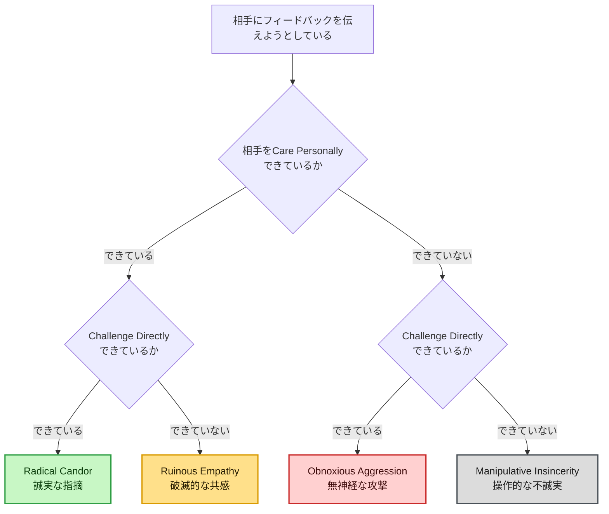
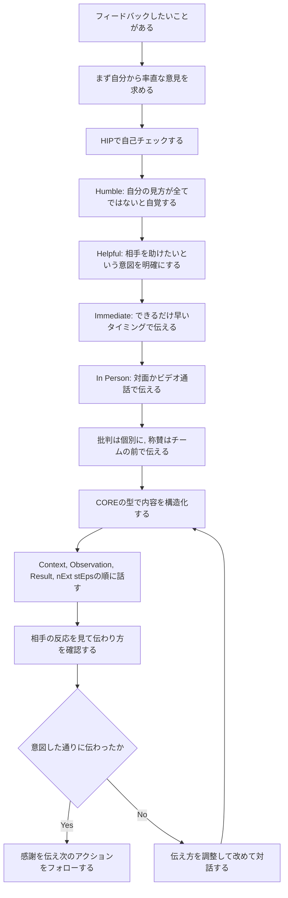
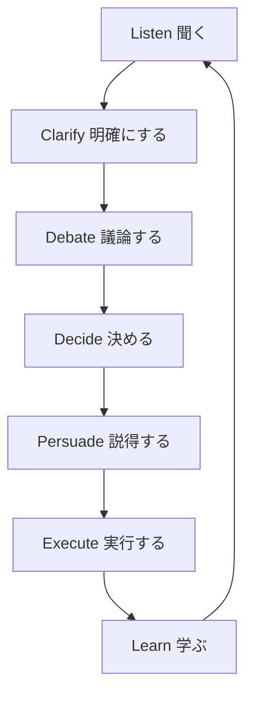
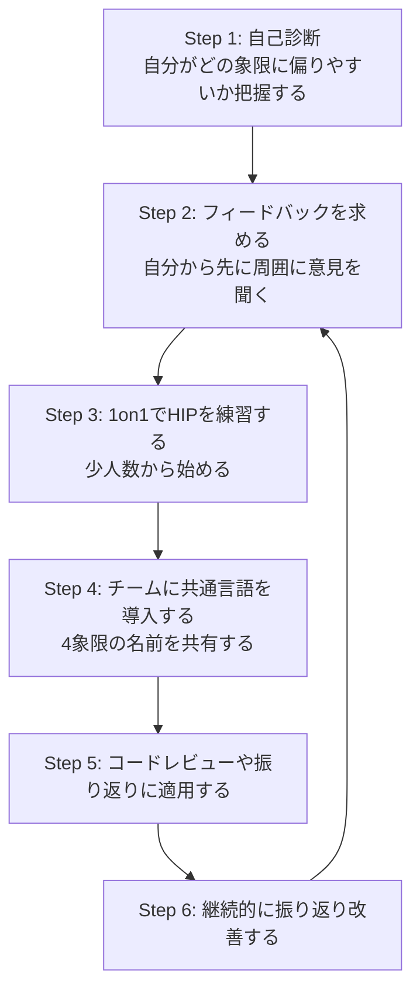

# Radical Candor 完全ガイド ― 初学者のための実践フレームワーク

> 本ページは Kim Scott 著『Radical Candor』を学ぶための非公式の解説ログです。原著の内容を正しく把握するには必ず原著をお読みください。2026年8月23日時点の公式情報源および実践知を参照しており、根拠となるURLを本文末尾の参考文献に記載しています。

## 目次

1. [Radical Candorとは何か](#1-radical-candorとは何か)
2. [誕生の背景 ― Google・Appleでの経験](#2-誕生の背景--googleappleでの経験)
3. [核となるフレームワーク：Care Personally × Challenge Directly](#3-核となるフレームワークcare-personally--challenge-directly)
4. [4つの象限を理解する](#4-4つの象限を理解する)
5. [HIPフィードバックフレームワーク](#5-hipフィードバックフレームワーク)
6. [COREモデルで内容を構造化する](#6-coreモデルで内容を構造化する)
7. [実践フロー：HIP＋COREでフィードバックを届ける](#7-実践フローhipcoreでフィードバックを届ける)
8. [Get Stuff Done（GSD）ホイール ― チームで成果を出す](#8-get-stuff-donegsdホイール--チームで成果を出す)
9. [1on1ミーティングとキャリア対話への適用](#9-1on1ミーティングとキャリア対話への適用)
10. [ソフトウェアエンジニアリングでの実践例](#10-ソフトウェアエンジニアリングでの実践例)
11. [初学者向けステップバイステップ導入ロードマップ](#11-初学者向けステップバイステップ導入ロードマップ)
12. [よくある落とし穴とアンチパターン](#12-よくある落とし穴とアンチパターン)
13. [限界と批判的視点](#13-限界と批判的視点)
14. [関連するエンジニアリングマネジメント書籍](#14-関連するエンジニアリングマネジメント書籍)
15. [まとめ](#15-まとめ)
16. [参考文献・出典](#16-参考文献出典)

---

## 1. Radical Candorとは何か

Radical Candor（ラディカル・キャンダー、日本語では「徹底的な誠実さ」などと訳される）は、元Google・Apple幹部であり、Dropbox・Twitter・Qualtricsなどのアドバイザーを務めた Kim Scott（キム・スコット）氏が提唱したフィードバック・マネジメントのフレームワークです。

中心にあるアイデアはシンプルです。良い上司・良いリーダーになるには、**「部下に嫌われないよう優しくする」か「成果を出すために厳しくする」かの二択ではない**ということです。Scott氏は、相手を**Care Personally（個人として気にかける）**ことと、**Challenge Directly（率直に指摘する）**ことは両立できる、いやむしろ両立させるべきだと説きます。この2つを同時に行っている状態こそが「Radical Candor」です。

この考え方は書籍の表紙にもなっている2×2のマトリクスとして広く知られ、Googleのマネジメント研修から生まれた経緯もあって、特にテック業界のエンジニアリングマネージャーの間で「必読書」として定着しています。

---

## 2. 誕生の背景 ― Google・Appleでの経験

Radical Candorの発想は、Scott氏がGoogleで働いていた頃の実体験に基づいています。あるプレゼンテーションの後、自分では上出来だと感じていたところ、当時の上司であったSheryl Sandberg（後のMeta COO）から、話し方の癖について非常に率直な指摘を受けたというエピソードが有名です。Sandbergはまず具体的な成果を褒めたうえで、話し方の改善点を明確に伝え、さらに専門のコーチをつける提案までしてくれました。Scott氏は当初その指摘を軽く受け流してしまいますが、後になって「なぜあの時、もっと強く言ってくれなかったのか」と感じ、遠慮のない率直さこそが本当の思いやりだと気づいたと振り返っています。

この経験に加え、Apple在職中にマネジメント研修プログラムを開発した経験が組み合わさり、Radical Candorという体系立てたフレームワークが生まれました。

---

## 3. 核となるフレームワーク：Care Personally × Challenge Directly

Radical Candorは、次の2つの軸で人とのコミュニケーションを整理します。

- **Care Personally（個人として気にかける）**：相手を単なる「タスクをこなす人」ではなく、仕事以外の人生や願望を持つ一人の人間として捉え、本音で向き合うこと
- **Challenge Directly（率直に指摘する）**：自分の意見が間違っている可能性を認めつつも、遠慮せず、はっきりと考えを伝えること

Scott氏はこのモデルを「判定に使うレッテル」ではなく「会話を良い方向に導くためのコンパス」として使ってほしいと繰り返し強調しています。特定の人物を「あの人はObnoxious Aggressionタイプだ」のように分類するための道具ではなく、**今この瞬間の自分の言動がどちらに寄っているかを点検するための道具**である点が重要です。

以下のフローチャートは、ある発言・フィードバックが4つの象限のどれに該当するかを判定する考え方を示したものです（原著のマトリクス図はquadrantChart形式のため、本ガイドでは判定ロジックとしてフローチャートに書き換えています）。

---

## 4. 4つの象限を理解する

| 象限 | Care Personally | Challenge Directly | 特徴 | リスク・注意点 |
|---|---|---|---|---|
| **Radical Candor**（誠実な指摘） | 高い | 高い | 相手を気にかけながら率直に意見を伝える。称賛は具体的かつ心のこもったものに、批判は親切で明確なものになる | 効果を発揮するには前提として信頼関係が必要。準備不足だと相手に届きにくい |
| **Ruinous Empathy**（破滅的な共感） | 高い | 低い | 相手を傷つけたくない一心で必要な指摘を避けたり、称賛を曖昧にしたりする。最も多くのマネージャーが陥る失敗パターンとされる | 短期的には優しく見えるが、長期的には相手の成長機会を奪ってしまう |
| **Obnoxious Aggression**（無神経な攻撃） | 低い | 高い | 率直ではあるが相手への配慮を欠く。Scott氏は当初この象限を俗称で呼んでいたが、レッテル貼りを助長するとして現在はこの呼称を避けている | 信頼関係を損ない、相手を防御的にさせる。批判は的確でも、称賛すら誠実に響かなくなる |
| **Manipulative Insincerity**（操作的な不誠実） | 低い | 低い | 相手に気に入られたい、あるいは政治的な思惑から、本心を隠した表面的な称賛や陰口を言う | 4象限の中で最も有害とされ、チームの心理的安全性そのものを破壊しうる |

ポイントは、**フィードバックの「誠実さ」は発言者の意図ではなく、受け手にどう届いたかで測られる**という考え方です。良かれと思って発した言葉でも、相手にとって配慮が伝わらなければObnoxious Aggressionになり得ますし、逆に厳しい指摘でも信頼関係の上で伝われば相手はRadical Candorとして受け取ります。

---

## 5. HIPフィードバックフレームワーク

「Care PersonallyとChallenge Directlyを両立させる」と言われても、実際の会話でどう振る舞えばよいか分かりにくいものです。そこでRadical Candorの実践チームは、フィードバックを届ける際のチェックリストとして **HIP** という頭字語を提案しています。

| 要素 | 意味 | 実践のポイント |
|---|---|---|
| **H**umble（謙虚） | 自分の見方が唯一の正解ではないと自覚する | 相手からの反論や訂正を受け止める余地を持つ |
| **I**mmediate（即時） | 記憶が新しいうちに、できるだけ早く伝える | 先延ばしにするほど具体性が失われ、行動修正の機会も遅れる |
| **P**rivate criticism / Public praise（批判は個別に、称賛は公開で） | 批判は一対一の場で、称賛はチームの前で行う | 公開の場での批判は防御反応を招きやすい |
| Helpful（相手のため） | 自分の目的が相手を助けることにあると明確に示す | 「あなたの力になりたくて伝えている」という意図を言葉にする |
| In Person（対面） | 対面、難しければビデオ通話で伝える | 表情や声のトーンから相手の反応をリアルタイムに読み取れる |
| Not about Personality（人格ではなく行動について） | 性格ではなく、具体的な行動や事実に焦点を当てる | 「だらしない人だ」ではなく「この資料は締め切りに間に合わなかった」と伝える |

補足：情報源によって頭字語の並びは"HIP"（Humble, Helpful, Immediate, In Person, Private/Public, Not Personal）や"HHIIPP"のように表記が揺れていますが、含まれる6つの原則自体は一貫しています。

---

## 6. COREモデルで内容を構造化する

HIPが「フィードバックを届ける姿勢・タイミング」を整えるものだとすれば、**COREモデル**は「フィードバックの中身」を具体的に組み立てるための型です。

| 要素 | 意味 |
|---|---|
| **C**ontext | 具体的な状況を示す（いつ、どこで起きたことか） |
| **O**bservation | 実際に何を見た・聞いたかを、解釈を交えず客観的に描写する |
| **R**esult | その行動が引き起こした、最も重要な結果や影響を伝える |
| n**E**xt st**E**ps | 次に何をすべきか、あるいは何を一緒に考えたいかを明確にする |

例えば「発表がうまくいっていなかった」と漠然と伝えるのではなく、「先週の定例会で（Context）、資料の途中で口ごもる場面が何度かあり（Observation）、聞き手が要点をつかみにくそうにしていた（Result）。次回までに一度リハーサルに付き合おうか（nExt stEps）」のように組み立てると、相手が受け取りやすく、行動にもつながりやすくなります。

---

## 7. 実践フロー：HIP＋COREでフィードバックを届ける

HIPとCOREを組み合わせた、フィードバックを渡すまでの一連の流れを示します。Radical Candorでは、**まず自分から相手にフィードバックを求めること**が最初のステップとして強調されています。自分が指摘を受け入れる姿勢を見せることで、相手も安心して指摘を受け取れるようになるためです。

このフローで重要なのは、フィードバックは**話し手の口ではなく、聞き手の耳で測られる**という原則です。伝えたつもりでも相手に響いていなければ、それはまだRadical Candorになっていません。反応を見て調整するループを組み込んでいる点がこのフローの核心です。

---

## 8. Get Stuff Done（GSD）ホイール ― チームで成果を出す

Radical Candorは1対1のフィードバックだけでなく、チーム全体で意思決定と実行を進めるための枠組みも提供しています。それが **Get Stuff Done（GSD）ホイール** です。7つのステップを順番に回し、どのステップも飛ばさないことが重要とされています。

| ステップ | 内容 |
|---|---|
| **Listen（聞く）** | チームメンバーの意見やアイデアに耳を傾け、追求すべき目標を見極める。ここで生まれた「聞き合う文化」が、後に述べる隠れた問題の早期発見にもつながる |
| **Clarify（明確にする）** | 出てきたアイデアはまだ形が定まっていないことが多い。マネージャーはアイデアを潰さず、議論できる形に整理する役割を担う |
| **Debate（議論する）** | アイデアの是非を、人格やエゴではなく中身について議論する。「誰が勝ったか」ではなく「一緒に最良の答えを見つける」ことが目的 |
| **Decide（決める）** | 意思決定は必ずしも最も立場が上の人が行う必要はない。事実に最も近い人が決められるようなプロセスを設計する |
| **Persuade（説得する）** | 決定に直接関わらなかったメンバーにも、実行する理由を納得してもらう。このステップを省くと実行段階でつまずきやすい |
| **Execute（実行する）** | 実際に計画を遂行する段階。コラボレーションに時間をかけすぎて実行時間を圧迫しないよう、マネージャーが会議や雑音を吸収する役割を果たす |
| **Learn（学ぶ）** | 結果から学びを得て、再びListenのステップへとサイクルを回す |

---

## 9. 1on1ミーティングとキャリア対話への適用

Radical Candorは、日々の1on1ミーティングを「業績確認の場」から「信頼構築とフィードバックの場」へと転換することを重視します。実践のポイントは次の通りです。

- **まず相手に質問する**：「もっと働きやすくするために、私が始めるべきこと・やめるべきことは何ですか」といった定型の質問を用意し、自分から先に指摘を求める
- **フィードバックは会議まで溜め込まない**：気づいたことは短い立ち話でその場で伝え、1on1は主により大きなキャリアの話題に使う
- **成長志向（growth）か安定志向（stability）かを尊重する**：チームメンバー全員が急成長を望んでいるわけではない。高い安定成果を出す人を過小評価しないことも重要とされる
- **傾聴は「理解するため」であって「反論するため」ではない**：フィードバックを受け取る側に回ったときは、相手の意図を要約し確認するところから始める

---

## 10. ソフトウェアエンジニアリングでの実践例

Radical Candorはマネジメント書として書かれていますが、コードレビューや振り返りなど、エンジニアの日常業務にもそのまま応用できるという実践報告が数多く公開されています。

| 場面 | Radical Candorの適用例 |
|---|---|
| **コードレビュー** | 単なる指摘（例：ある技術選定を頭ごなしに批判するだけのコメント）で終わらせず、なぜその書き方がより良いのかを説明し、指導の機会に変える。BuzzFeedのエンジニアによる実践報告では、雑なPRコメントが投稿者の離職につながった失敗例から、Radical Candorに基づくレビュー文化の見直しが紹介されている |
| **レトロスペクティブ（振り返り）** | 犯人探しにせず、具体的な事実に基づいて何がうまくいき、何が改善できるかを議論する。プロジェクト管理ツールを開発するチームでは、振り返りをRadical Candorに沿って再設計し、率直な意見交換を後押しした結果、インターンがシニアエンジニアのコードを改善する提案をするほど活発な文化が生まれたと報告されている |
| **1on1ミーティング** | まずメンバーから自分へのフィードバックを求め、信頼関係を築いたうえで指摘を行う |
| **リモート・分散チームでの運用** | オフィス以外の環境では「表面的な調和（artificial harmony）」が生まれやすく、業績上の問題を伝えるタイミングを逃しがちである。分散チーム特有の課題として、意識的に率直な対話の機会を設ける必要があるという指摘がある |
| **ペアプログラミング・設計レビュー** | その場で率直に、かつ相手を尊重しながら設計上の懸念を伝える。具体的な理由づけとともにコメントすることで、単なる指摘が「メンタリングの機会」に変わる |

---

## 11. 初学者向けステップバイステップ導入ロードマップ

いきなりチーム全体にRadical Candorを導入しようとすると、うまくいかないことが多いとされています。まず少人数のグループで練習し、実績を積んでから広げていくアプローチが推奨されています。

1. **自己診断**：自分は普段どの象限に偏りやすいか（多くの人はRuinous Empathyに寄りやすいとされる）を振り返る
2. **フィードバックを求める**：指摘する前に、まず自分自身が指摘を受け取る姿勢を示す
3. **1on1でHIPを練習する**：3〜5人程度の小さなグループから始め、やり方を調整しながら実績を作る
4. **チームに共通言語を導入する**：4象限の名前をチームで共有し、「それはObnoxious Aggressionかもしれない」と気軽に指摘し合える状態を目指す
5. **コードレビューや振り返りに適用する**：日常業務のプロセスにHIP・COREの考え方を組み込む
6. **継続的に振り返り改善する**：完璧を目指すのではなく、継続的な練習として捉える

---

## 12. よくある落とし穴とアンチパターン

- **「Radical Candor」を厳しさの免罪符にしてしまう**：Challenge Directlyだけを都合よく解釈し、Care Personallyの土台を作らずに率直さを振りかざすと、それは単なるObnoxious Aggressionである
- **フィードバックサンドイッチへの逆戻り**：褒める→指摘する→褒める、という定型パターンは、批判をぼかしてしまい、かえって伝わりにくくなるとされる
- **完璧な言葉を探して沈黙してしまう**：HIPの要素をすべて満たそうと考えすぎて何も言えなくなるより、まず伝えることの方が重要だとされる
- **解決策を用意してからでないと指摘できないと思い込む**：批判的フィードバックをする際に、あらかじめ答えを持っている必要はなく、一緒に考える姿勢で十分とされる
- **一度の導入で終わらせてしまう**：Radical Candorは一過性の施策ではなく、日々の習慣として繰り返し練習することが前提とされている

---

## 13. 限界と批判的視点

Radical Candorは広く支持される一方で、いくつかの重要な限界が指摘されています。初学者として導入する際は、次の点も踏まえておくとよいでしょう。

- **心理的安全性が前提条件である**：信頼関係やチームの心理的安全性が確立されていない環境では、率直な指摘がただの攻撃として受け取られてしまう可能性がある
- **文化的な直接さの違い**：直接的な物言いを好む文化圏と、婉曲的なコミュニケーションを重んじる文化圏とでは、同じ発言でも「誠実」と「無神経」の受け取られ方が大きく異なる。Scott氏自身も、イスラエルのチームと日本のチームとでは全く異なるアプローチが必要だったと述べている
- **権力勾配（power dynamics）への配慮不足という指摘**：フレームワークが暗黙のうちに「対等な関係」を前提としており、立場の弱い人が上司や多数派に率直な指摘をする際のリスクを十分に扱っていないという批判がある。特に、性別や人種などの属性によって率直さがもたらすリスクの大きさが異なるという指摘も出ている
- **「濫用（悪用）」のリスク**：率直さを免罪符にして、配慮を欠いた発言を正当化する事例が報告されている。フレームワークの本質は「Care Personally」との両立にあるが、その部分が抜け落ちたまま「Radical Candorだから」と厳しい物言いを正当化する誤用が起こりうる
- **フレームワーク自体の単純さへの指摘**：2軸のマトリクスは分かりやすい反面、単純化しすぎているという声もあり、体調や個人的事情など、フィードバックの文脈に影響する要因を十分に考慮できないという議論もある

これらの批判を踏まえると、Radical Candorは万能の処方箋ではなく、**信頼関係・心理的安全性・文化的文脈を土台とした上で使う道具**として捉えるのが実践的です。

---

## 14. 関連するエンジニアリングマネジメント書籍

Radical Candorは単独の書籍にとどまらず、エンジニアリングマネジメント分野の定番書籍群の中でしばしば並んで参照されています。

| 書籍 | 著者 | Radical Candorとの関係 |
|---|---|---|
| *The Manager's Path* | Camille Fournier（元Rent the RunwayのCTO） | エンジニアリングマネージャー向けの実践書。フィードバックに関する章でRadical Candorの考え方が参照されている |
| *An Elegant Puzzle: Systems of Engineering Management* | Will Larson | 組織設計とマネジメントの体系書。Radical Candorと並んでエンジニアリングマネージャーの必読書として紹介されることが多い |
| *Radical Respect* | Kim Scott | Radical Candorの続編にあたる書籍。バイアス・偏見・いじめの排除に焦点を当てている |
| *97 Things Every Engineering Manager Should Know* | Camille Fournier（編） | 複数のエンジニアリングリーダーの知見を集めたアンソロジー。Radical Candorを含む代表的なマネジメント書の一つとして紹介されている |

---

## 15. まとめ

Radical Candorの核心は、「相手を気にかけること」と「率直に伝えること」は対立するものではなく、両立させて初めて本当に相手の役に立てる、という考え方にあります。HIP・COREといった実践フレームワークやGSDホイールは、この考え方を日々の1on1・コードレビュー・振り返りといった具体的な場面に落とし込むための道具です。

ただし、Radical Candorは万能薬ではありません。心理的安全性が確立されていない環境や、文化的・権力的な非対称性がある場面では、率直さがかえって害になりうるという批判も存在します。フレームワークをそのまま鵜呑みにするのではなく、自分のチームの文脈に照らして調整しながら、少人数からゆっくり実践を積み重ねていくことが、初学者にとって最も現実的な導入の道筋だといえるでしょう。

---

## 16. 参考文献・出典

本ガイドの作成にあたり、2026年8月23日時点で以下の情報源を調査しました。公式サイトの記事に加え、著名なテック企業のエンジニア・エンジニアリングマネージャーによる実践報告を優先的に参照しています。

- Radical Candor公式：Our Approach ― https://www.radicalcandor.com/our-approach
- Radical Candor公式ブログ：What is Radical Candor? ― https://www.radicalcandor.com/blog/what-is-radical-candor
- Radical Candor公式ブログ：A HIP Approach to Feedback ― https://www.radicalcandor.com/blog/a-hip-approach-to-feedback
- Radical Candor公式ブログ：Give Feedback Playbook（CORE / Order of Operations） ― https://www.radicalcandor.com/blog/give-feedback-playbook
- Radical Candor公式ブログ：Culture of Listening（GSDホイール） ― https://www.radicalcandor.com/blog/culture-of-listening
- Radical Candor公式ブログ：Decisions to Get Sh*t Done（GSDホイール） ― https://www.radicalcandor.com/blog/decisions-to-get-shit-done
- Radical Candor公式：Frequently Asked Questions ― https://www.radicalcandor.com/frequently-asked-questions
- Radical Candor公式ブログ：Radical Candor and Cultural Differences ― https://www.radicalcandor.com/blog/radical-candor-cultural-differences
- Radical Candor公式ブログ：Radical Candor and Software Engineers（ZenHub事例） ― https://www.radicalcandor.com/blog/radical-candor-software-engineers
- Kim Scott, Medium：What is Radical Candor? Learn the Basic Principles in 6 Minutes ― https://kimmalonescott.medium.com/what-is-radical-candor-learn-the-basic-principles-in-6-minutes-50391b3ad76a
- Jordan Harbinger Show：Kim Scott | Care Personally, Challenge Directly with Radical Candor ― https://www.jordanharbinger.com/kim-scott-care-personally-challenge-directly-with-radical-candor/
- Ian Feather（BuzzFeedのエンジニア）：Radical Candor in Code Review ― https://www.ianfeather.co.uk/radical-candor-in-code-review/
- Rina Artstain（ソフトウェアエンジニア）：Once more, with feeling: A radical approach to code review ― https://rinaarts.com/once-more-with-feeling-a-radical-approach-to-code-review/
- Showpad Engineering, Medium：How to get better at providing candid feedback ― https://medium.com/showpad-engineering/how-to-get-better-at-providing-candid-feedback-9af3282bcdd2
- LeadDev：Radical candor for distributed engineering teams ― https://leaddev.com/mentoring-coaching-feedback/radical-candor-distributed-engineering-teams
- The Pragmatic Engineer（Gergely Orosz）：Become an Effective Software Engineering Manager ― https://blog.pragmaticengineer.com/become-and-effective-software-engineering-manager-my-book-review/
- Software Engineering and Management resources（Will Larson・Camille Fournier・Gergely Oroszらのリソースをまとめたリスト） ― https://gist.github.com/typesanitizer/76565f63e6ec7b0a21e98276cf075799
- Camille Fournier, Wikipedia ― https://en.wikipedia.org/wiki/Camille_Fournier
- ModelThinkers：Radical Candor Framework（限界・批判のセクションを含む） ― https://modelthinkers.com/mental-model/radical-candor-framework
- Teaching While White：Whiteness at Work（権力・人種の観点からの批判） ― https://www.teachingwhilewhite.org/blog/yx9zi31geawjmjxoqfxfs3ltf777ev
- CITCON Wiki：Pros and cons of radical candor（開発者コミュニティのカンファレンスでの議論） ― https://citconf.com/wiki/index.php?title=Pros_and_cons_of_radical_candor

---

*本ガイドはKim Scott氏の著書『Radical Candor』および関連する公開情報の要約・整理であり、原著の文章をそのまま引用したものではありません。詳細な事例やワークシートについては、原著およびRadical Candor公式サイトを直接参照することを推奨します。*
