# Release It! 実践ガイド ― 本番対応ソフトウェアを設計・デプロイするためのステップバイステップ入門

> 対象読者：バックエンド／インフラ／SREを学び始めたばかりのエンジニア
> 原著：Michael T. Nygard 著『Release It!: Design and Deploy Production-Ready Software』（Pragmatic Bookshelf）
> 本ガイドは初版（2007年）と第2版（2018年）の両方を参照しながら、初学者が本番運用の勘所を体系的に理解できるように再構成した解説書です。

---

## 目次

1. [はじめに：なぜ「機能が完成した」だけでは足りないのか](#1-はじめになぜ機能が完成しただけでは足りないのか)
2. [著者と本書の位置づけ](#2-著者と本書の位置づけ)
3. [初版と第2版の違い](#3-初版と第2版の違い)
4. [本書全体のマップ：第2版の4部構成](#4-本書全体のマップ第2版の4部構成)
5. [第1部：安定性を作る（Create Stability）](#5-第1部安定性を作るcreate-stability)
6. [第2部：本番のために設計する（Design for Production）](#6-第2部本番のために設計するdesign-for-production)
7. [第3部：システムを届ける（Deliver Your System）](#7-第3部システムを届けるdeliver-your-system)
8. [第4部：システミックな問題を解く（Solve Systemic Problems）](#8-第4部システミックな問題を解くsolve-systemic-problems)
9. [現代の実務にどう活かすか：パターン対応表](#9-現代の実務にどう活かすかパターン対応表)
10. [ステップバイステップ実践チェックリスト](#10-ステップバイステップ実践チェックリスト)
11. [よくある誤解・FAQ](#11-よくある誤解faq)
12. [まとめ](#12-まとめ)
13. [参考文献](#13-参考文献)

---

## 1. はじめに：なぜ「機能が完成した」だけでは足りないのか

多くの設計・アーキテクチャ本は「要件を満たす」「テストに通る」ことをゴールに書かれています。しかし Nygard は、**「機能完成（feature complete）」と「本番対応（production ready）」はまったく別物である**という一点を本書全体を通じて主張します。

QAを通過したソフトウェアが本番環境に出たとたんに落ちる理由の多くは、機能不足ではなく、次のような「本番特有の現実」に対する備えがないことにあります。

- 想定外のトラフィックの急増（Slashdotされる、SNSでバズる、深夜に海外ユーザーが押し寄せる）
- メンテナンスのために止められない稼働時間要件
- 統合先システムの障害・レイテンシ
- 運用担当者が交代し、開発時の暗黙知が失われた後の長い「余生」

出典：O'Reillyに掲載された概要では、Release 1.0がリリースされた後にコンサルタントが去り、主要な開発者が別プロジェクトへ異動し、自由な開発環境が変更管理委員会や障害報告に置き換わっていく現実が描かれています。その後、一般ユーザーがシステムを叩き始めます。

本書は、こうした「本番の現実」を生き延びるための、ケーススタディに基づいた実践的なパターン集です。

---

## 2. 著者と本書の位置づけ

Michael T. Nygard は15年以上にわたりプログラマー・アーキテクトとして、米国政府や銀行・金融・農業・小売業界向けに稼働システムを提供してきた実務家です。`97 Things Every Software Architect Should Know` の共著者でもあります。

出典：Pragmatic Bookshelfの公式書籍ページでは、Nygard氏が15年以上プログラマー・アーキテクトとして活動し、米国政府や銀行・金融・農業・小売業界向けにシステムを提供してきた経歴と、技術カンファレンスの人気講演者であることが紹介されています。

本書は「アーキテクチャパターン集」でありながら、抽象的な理論書ではなく、**実際の障害事例（ケーススタディ）から出発して、そこから一般化されたアンチパターン／パターンを導く**という構成が最大の特徴です。各部の冒頭には実際に企業に数百万ドル規模の損失を与えた障害の再現ドラマが置かれています。

---

## 3. 初版と第2版の違い

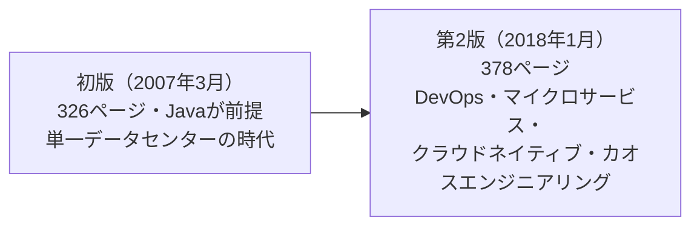

出典：第2版の公式ページでは、DevOps・マイクロサービス・クラウドネイティブアーキテクチャの内容が新たに追加され、安定性のアンチパターンが大規模システムにおける構造的な問題も含むよう拡張されたことが明記されています。

第2版のレビューでは、Java色の強かった初版から、クラウド／OSS／DevOps実務に軸足を移した内容へと大きく作り替えられたことが評価されています。出典：レビュアーのAdam Hawkins氏は、第2版がクラウドインフラ・OSS・DevOpsの実務に根ざした内容へと移行し、3大クラウドプロバイダーの存在やコンテナの台頭など、この10年間のIT環境の変化を反映していると評価しています。

| 観点 | 初版（2007） | 第2版（2018） |
|---|---|---|
| 想定インフラ | オンプレミス・物理サーバー中心 | データセンター＋クラウド（物理ホスト／VM／コンテナ） |
| アーキテクチャ前提 | モノリシックなJavaアプリケーション | マイクロサービス／分散システム |
| デプロイ | 手動デプロイ、計画停止が前提 | 自動化デプロイ、継続的デプロイ、ゼロダウンタイムが前提 |
| 新規追加分野 | ― | コントロールプレーン、OWASP Top 10、バージョニング戦略、カオスエンジニアリング |
| 安定性アンチパターン数 | 抜粋（Dogpile・Force Multiplier等を含む一部異なる編成） | 12種に整理 |
| 安定性パターン数 | 抜粋 | 12種に整理 |

このガイドは、より現代の実務に近い**第2版の章構成**を軸に解説します。第2版の目次は出版社の書誌情報（ドイツ・イルメナウ工科大学図書館の書誌カタログPDF）で確認できます。出典：第2版は「第1部 安定性を作る」「第2部 本番のために設計する」「第3部 システムを届ける」「第4部 システミックな問題を解く」という4部構成で、17章＋参考文献＋索引から成ります。

なお、ユーザーが参照した [O'Reillyの書誌ページ](https://www.oreilly.com/library/view/release-it/9781680500264/) は初版（2007年3月・326ページ）のものです。初版は絶版ではなく現在も購読可能ですが、これから読む場合は第2版を推奨する声が実務者の間で多く見られます。

---

## 4. 本書全体のマップ：第2版の4部構成

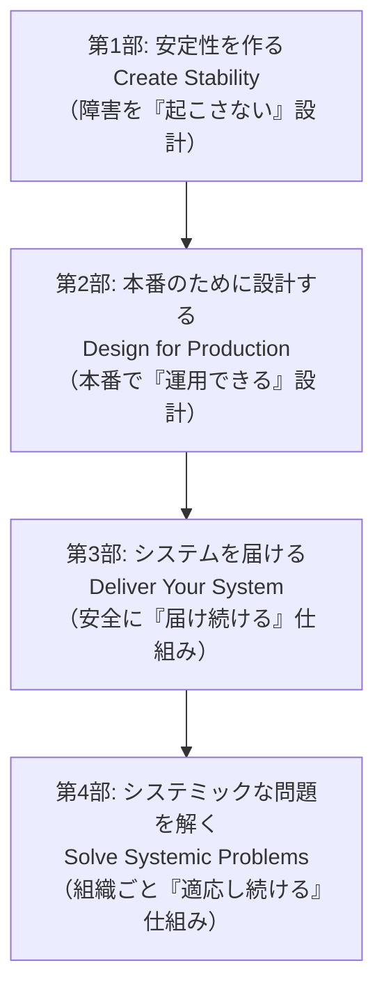

本書の各部は、次のように役割分担されています。

| 部 | 中心テーマ | 主な読者層の関心 |
|---|---|---|
| 第1部 安定性を作る | 個々のシステムが障害に耐える設計 | アプリケーションエンジニア、バックエンド設計者 |
| 第2部 本番のために設計する | ネットワーク・インフラ・セキュリティ・運用基盤 | インフラ／プラットフォームエンジニア |
| 第3部 システムを届ける | デプロイとバージョン管理の安全性 | DevOps／リリースエンジニア |
| 第4部 システミックな問題を解く | 組織・プロセス・カオスエンジニアリング | アーキテクト、EM、SREリーダー |

---

## 5. 第1部：安定性を作る（Create Stability）

### 5.1 安定性とは何か

Nygard は「安定性（stability）」を、単に落ちないことではなく、**部分的な障害が発生しても全体としてサービスを提供し続けられる性質**と定義します。ポイントは「クラック（ひび）は必ず発生する」という前提に立つことです。個々の障害を完全に防ぐことはできませんが、**そのひびが他の部分に伝播しないように設計する**ことはできます。

この「クラックの伝播モデル」が、本書全体の設計思想の出発点になります。出典：John氏の読書ノートでは、ブロックされたスレッド（Blocked Threads）アンチパターンがほとんどの障害の直接的な原因であり、連鎖反応（Chain Reactions）とカスケード障害（Cascading Failures）に直結すると整理されています。

### 5.2 安定性のアンチパターン（12種）

第2版第4章では、実務でよく観測される「安定性を壊すパターン」が12種類、体系的に整理されています。出典：第4章「Stability Antipatterns」は、Integration Points・Chain Reactions・Cascading Failures・Users・Blocked Threads・Self-Denial Attacks・Scaling Effects・Unbalanced Capacities・Dogpile・Force Multiplier・Slow Responses・Unbounded Result Setsの12節から構成されています。

| # | アンチパターン | 直訳・意味 | 典型的な発生原因 |
|---|---|---|---|
| 1 | Integration Points（統合ポイント） | 他システムとの接続点 | すべてのソケット・RPC・REST呼び出しは障害点になり得る |
| 2 | Chain Reactions（連鎖反応） | 障害の連鎖 | 1台の障害で他ノードの負荷が増し、次々に倒れる |
| 3 | Cascading Failures（カスケード障害） | 層をまたぐ障害伝播 | ある層のクラックが上位・下位の層に飛び火する |
| 4 | Users（ユーザー） | 予測不能な利用パターン | テストでは想定しない使い方を本番ユーザーは必ずする |
| 5 | Blocked Threads（ブロックされたスレッド） | 永遠に返ってこない待機 | デッドロックやプール枯渇でスレッドが戻らない |
| 6 | Self-Denial Attacks（自己拒否攻撃） | 自らを攻撃する設計ミス | 一斉メール送信が自らの受信サーバーを飽和させる等 |
| 7 | Scaling Effects（スケーリング効果） | 小規模では見えない欠陥 | 台数が増えると初めて顕在化するO(n²)通信や設定ミス |
| 8 | Unbalanced Capacities（アンバランスな容量） | 層ごとの処理能力のミスマッチ | Web層だけスケールしDB層が追いつかない |
| 9 | Dogpile（ドッグパイル） | 同期した一斉負荷 | cronジョブが真夜中に一斉起動し瞬間的に過負荷になる |
| 10 | Force Multiplier（フォースマルチプライヤー） | 自動化がミスを増幅する | 誤った設定が自動配布で全台へ一瞬で伝播する |
| 11 | Slow Responses（遅い応答） | 速い失敗より厄介な遅延 | 応答が遅いだけで呼び出し元のリソースを奪い続ける |
| 12 | Unbounded Result Sets（無制限の結果セット） | 際限のないクエリ結果 | テストデータでは問題にならないが本番データ量で破綻する |

出典：Kevin Sookocheff氏のまとめでは、統合ポイントは「システムを殺す原因ナンバーワン」であり、あらゆるソケット・プロセス・RPC・REST API呼び出しが安定性リスクになるとされています。同氏は速い失敗であれば呼び出し元は取引を処理・再試行・失敗のいずれかを選べる一方、遅い応答は各呼び出し元のリソースを縛り続け、リクエスト処理スレッドが塞がることでカスケード障害を誘発しやすいと説明しています。

> **ベストプラクティス**
> - アンチパターンは「なくす」ものではなく「必ず起きる前提で備える」ものと捉える
> - 特に Integration Points と Blocked Threads は、他の多くのアンチパターンの引き金になりやすいため優先的に対策する
> - 本番相当のデータ量・同時接続数でテストしない限り、Unbounded Result Sets や Scaling Effects は再現できない

### 5.3 安定性パターン（12種）

アンチパターンに対応する形で、第2版第5章では12種類の安定性パターンが解説されます。出典：第5章「Stability Patterns」は、Timeouts・Circuit Breaker・Bulkheads・Steady State・Fail Fast・Let It Crash・Handshaking・Test Harnesses・Decoupling Middleware・Shed Load・Create Back Pressure・Governorの12節です。

| # | パターン | 目的 | 主に防ぐアンチパターン |
|---|---|---|---|
| 1 | Timeouts（タイムアウト） | 無限待機を許さない | Blocked Threads, Integration Points |
| 2 | Circuit Breaker（サーキットブレーカー） | 失敗が続く呼び出し先を早期に遮断する | Cascading Failures, Slow Responses |
| 3 | Bulkheads（バルクヘッド） | リソースを区画化し影響範囲を限定する | Chain Reactions, Cascading Failures |
| 4 | Steady State（定常状態） | 手動介入なしで自己維持できる状態を保つ | 運用負債の蓄積全般 |
| 5 | Fail Fast（フェイルファスト） | 問題を早期に検出し即座に失敗させる | Slow Responses, Blocked Threads |
| 6 | Let It Crash（クラッシュさせる） | 復旧困難な部分は潔く再起動する | Blocked Threads |
| 7 | Handshaking（ハンドシェイク） | 呼び出し前に相手の余力を確認する | Self-Denial Attacks, Unbalanced Capacities |
| 8 | Test Harnesses（テストハーネス） | 統合ポイントの障害を意図的に再現してテストする | Integration Points |
| 9 | Decoupling Middleware（デカップリングミドルウェア） | 呼び出し元と先を時間・空間的に分離する | Integration Points, Chain Reactions |
| 10 | Shed Load（負荷を捨てる） | 過負荷前に一部リクエストを意図的に拒否する | Self-Denial Attacks, Unbalanced Capacities |
| 11 | Create Back Pressure（バックプレッシャー） | 「減速せよ」のシグナルを上流に伝播させる | Dogpile, Unbalanced Capacities |
| 12 | Governor（ガバナー） | 危険な自動処理の速度を人間の対応速度まで抑える | Force Multiplier |

#### サーキットブレーカー（Circuit Breaker）

Nygard が提唱したこのパターンは、後に Martin Fowler が広めたことで業界標準の語彙になりました。出典：Martin Fowler氏は自身のbliki記事で、リモート呼び出しは失敗したりタイムアウトまでハングしたりする可能性があり、応答のない呼び出し先に多数の呼び出し元が集中するとカスケード障害につながりかねないと述べ、これを防ぐためにNygard氏が著書『Release It』でサーキットブレーカーパターンを広めたと説明しています。

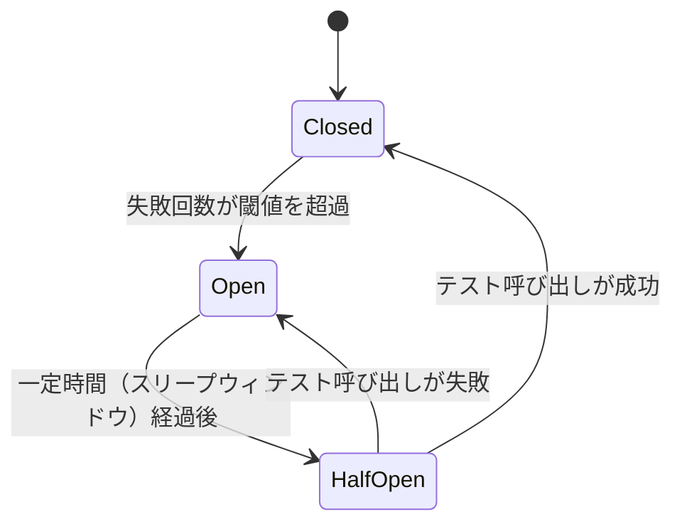

Netflix は2011年に開発した Hystrix ライブラリでこのパターンを大規模に実装し、1日あたり数百億件のリクエストをスレッド分離・セマフォ分離で保護していました。出典：Netflix HystrixのGitHub Wikiによれば、Netflix APIシステムでは100種類以上のHystrixコマンド、40以上のスレッドプールが稼働し、1日あたり100億件以上のスレッド分離実行と2000億件以上のセマフォ分離実行を処理していたと記録されています。Hystrixは2018年にメンテナンスモードに入り、現在はJVM／Springエコシステムでは Resilience4j が事実上の標準として使われています。出典：Resilience4jに関する解説記事では、Hystrixが2018年にメンテナンスモードへ移行した後、Resilience4jがデファクトスタンダードとして台頭したことが述べられています。

#### バルクヘッド（Bulkheads）

船体を隔壁（バルクヘッド）で区切ることで浸水が一箇所にとどまるようにする、という船舶工学のメタファーがそのまま流用されたパターンです。出典：Wikipediaの解説では、船体が水密区画に分割され一区画の破損が船全体を沈めないようにする発想と同様に、Nygard氏はソフトウェアシステムもリソースを区画化し、一部の障害がシステム全体を消耗させないようにすべきだと論じたとされています。

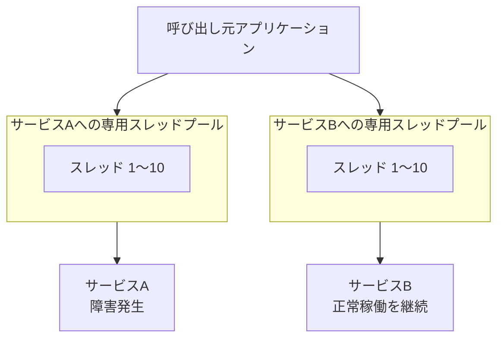

`Building Microservices` の著者 Sam Newman も、バルクヘッドを「3つのパターンの中で最も重要」と位置づけ、マイクロサービスへの分割自体がバルクヘッドの一形態になり得ると述べています。出典：Sam Newman氏は、機能を個別のマイクロサービスへ分割すること自体が、ある領域の障害が別の領域に影響を与える可能性を減らすバルクヘッドの実装方法になり得ると述べ、タイムアウトとサーキットブレーカーがリソースの逼迫を解消するのに対し、バルクヘッドはそもそもリソースが逼迫しないようにする点で3パターンの中で最も重要だと位置づけています。

#### タイムアウト・サーキットブレーカー・バルクヘッドの連携

この3つは単体で使うのではなく、多層防御として組み合わせるのが定石です。

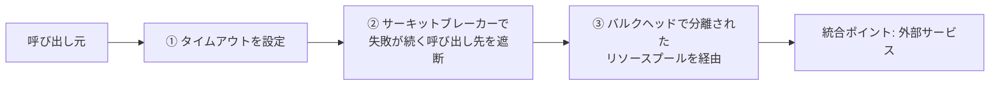

出典：Release Itのサマリーでは、サーキットブレーカーは失敗回数が閾値を超えると発火して以降の呼び出しをブロックし、一定時間後に少数のリクエストを再試行して成功すれば通常状態に戻るとされ、タイムアウトが問題を検知しサーキットブレーカーが過度な再試行を防ぐという役割分担で併用すべきだと説明されています。

#### Fail Fast と Let It Crash の使い分け

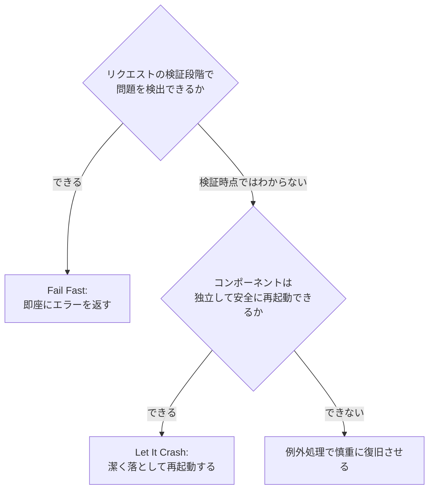

`Let It Crash` はErlang由来の思想で、「壊れたコンポーネント内部の状態を無理に修復しようとするより、まっさらな状態から作り直す方が結果的に安全」という考え方です。出典：GitHub上のサンプル実装の説明では、Erlangの世界でこれは「let it crash」哲学と呼ばれ、コンポーネントレベルの安定性をあきらめてシステムレベルの安定性を優先する発想だと紹介されています。コンテナオーケストレーション全盛の現代では、Kubernetesのヘルスチェック＋自動再起動がこの思想をそのまま体現していると理解すると分かりやすいでしょう。

#### 負荷制御の連鎖：Steady State → Shed Load → Back Pressure → Governor

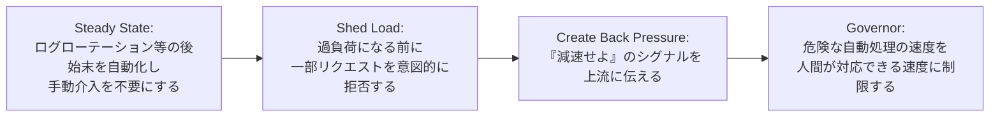

この4つは「システムが限界に近づいたときにどう振る舞うか」という一貫したテーマでつながっています。特に Governor は、自動化そのものは肯定しつつ、暴走したときの被害を抑えるための速度制限という位置づけで、後述する Force Multiplier アンチパターン（自動化がミスを一瞬で増幅する）への直接的な対策になります。

---

## 6. 第2部：本番のために設計する（Design for Production）

第2部は、個々のアプリケーションの安定性設計から視点を引き上げ、**インフラ・ネットワーク・運用基盤全体をどう設計するか**を扱います。出典：第2部「Design for Production」は、Foundations（基盤）、Processes on Machines（マシン上のプロセス）、Interconnect（相互接続）、Control Plane（コントロールプレーン）、Security（セキュリティ）の各章から構成されています。

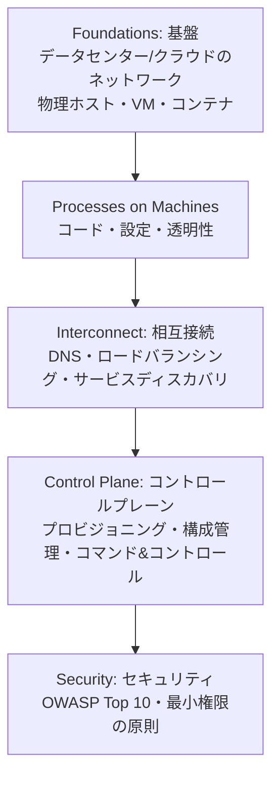

### 6.1 Foundations（基盤）

データセンターとクラウドの双方のネットワーキングを扱い、物理ホスト・仮想マシン・コンテナという3つの実行単位の違いを解説する章です。抽象化のレイヤーが上がるほど起動は速くなりますが、その分「何が実際に動いているか」の可視性は下がるというトレードオフが強調されます。

### 6.2 Processes on Machines（マシン上のプロセス）

1台のマシンで動くプロセスに関わる3要素、**コード・設定・透明性**を扱います。設定ファイルの管理方法が悪いと、それ自体が「Unbalanced Capacities」や「Force Multiplier」の温床になります。ここでいう透明性（Transparency）は次の第4部で詳しく扱われる概念の先取りで、「今このプロセスが何をしているか外から分かるか」という問いです。

### 6.3 Interconnect（相互接続）

DNS、ロードバランシング、需要制御（Demand Control）、ネットワークルーティング、サービスディスカバリ、そして初版から引き継がれた「移動可能な仮想IPアドレス（Migratory VIP）」が扱われます。出典：第9章「Interconnect」は、Solutions at Different Scales・DNS・Load Balancing・Demand Control・Network Routing・Discovering Services・Migratory Virtual IP Addressesの各節から構成されています。

サービスディスカバリは初版執筆時点（2007年）にはほぼ存在しなかった概念で、第2版で大きく拡張された部分の一つです。Netflixが2012年に自社のサービスレジストリ Eureka をオープンソース化したのも同時期の潮流でした。出典：InfoQのアーカイブでは、Netflixが2012年頃、AWSリージョン内でミドル層サービスを検索するためのRESTfulサービスであるEurekaをオープンソース化したと報じられています。

### 6.4 Control Plane（コントロールプレーン）

「どこまで自動化すべきか」「自動化がもたらすレバレッジ（mechanical advantage）をどう活かすか」「開発環境も本番の一部である（Development Is Production）」という思想、システム全体の透明性、構成管理サービス、プロビジョニング・デプロイサービス、そしてコマンド＆コントロールという運用の中枢機能が扱われます。

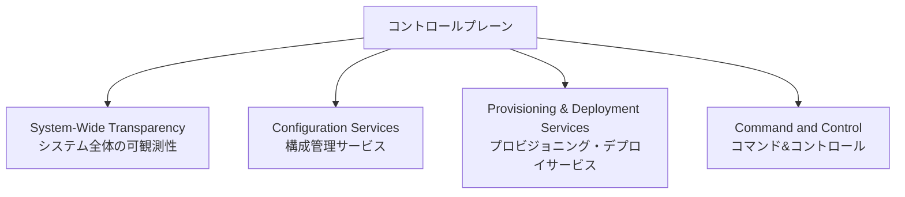

「Development Is Production（開発環境も本番の一部）」という考え方は、開発者のローカル環境や検証環境の構成ドリフトそのものが、本番のインシデントの温床になりうるという教訓を端的に表しています。

### 6.5 Security（セキュリティ）

第2版で最も大きく拡張された章の一つで、OWASP Top 10 が丸ごと組み込まれています。加えて、初版から引き継がれた「最小権限の原則（Principle of Least Privilege）」と「設定されたパスワード（Configured Passwords）」も扱われます。出典：第11章「Security」は、The OWASP Top 10、The Principle of Least Privilege、Configured Passwords、Security as an Ongoing Processの各節から構成されています。

セキュリティを「一度作って終わり」ではなく継続的なプロセス（Security as an Ongoing Process）として位置づけている点は、後述するカオスエンジニアリングの思想とも通じるものがあります。

---

## 7. 第3部：システムを届ける（Deliver Your System）

出典：第3部「Deliver Your System」は、ケーススタディ「Waiting for Godot」に続き、第13章「Design for Deployment」、第14章「Handling Versions」で構成されています。

### 7.1 デプロイのために設計する（Design for Deployment）

この章の核心的な主張は、「**計画停止（planned downtime）という考え方自体が誤り**」というものです。出典：第13章では、So Many Machines・The Fallacy of Planned Downtime・Automated Deployments・Continuous Deployment・Phases of Deploymentという構成で、ゼロダウンタイムデプロイの実現方法が論じられています。

データベーススキーマの変更を安全にゼロダウンタイムで行うための考え方として、後に「Expand/Contract」パターンと呼ばれるようになった手法の源流がここにあります。出典：tim-wellhausen氏の論文は、Nygard氏の『Release It!』第7章「ゼロダウンタイムデプロイメント」（O'Reilly、2007年）を明示的な出典として挙げ、既存アプリケーションが旧コードのまま動作している期間もデータの整合性を保つ必要があるという制約を論じています。

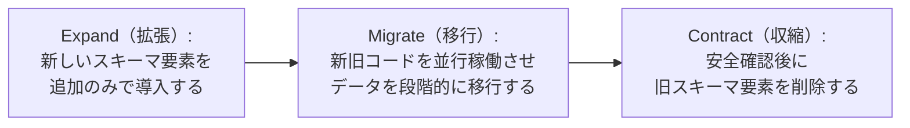

現代の実務でこの考え方をそのまま体現しているのが、ブルーグリーンデプロイやカナリアリリースです。

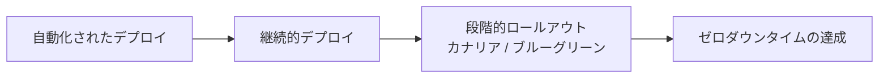

### 7.2 バージョン管理（Handling Versions）

出典：第14章「Handling Versions」は、Help Others Handle Your Versions（自分のバージョンを他者が扱えるようにする）とHandle Others' Versions（他者のバージョンを扱う）の2節から構成されています。

これは分散システムにおける互換性設計の話で、「送信するデータは厳格に、受信するデータには寛容に」というPostelの法則（堅牢性原則）に通じる考え方です。API・メッセージフォーマット・プロトコルのバージョンをまたいだ後方互換性・前方互換性の設計が、ゼロダウンタイムデプロイの前提条件になります。

---

## 8. 第4部：システミックな問題を解く（Solve Systemic Problems）

出典：第4部「Solve Systemic Problems」は、ケーススタディ「Trampled by Your Own Customers」に続き、第16章「Adaptation」、第17章「Chaos Engineering」で構成されています。

### 8.1 適応（Adaptation）

この章は「変化は避けられないが生存は保証されない」という一文から始まります。出典：Educative社の解説コースでは、この章が「変化は保証されているが、生存は保証されていない」という一文から始まり、努力が逓増的な利益を生む『凸型リターン（Convex Returns）』の概念を中心に、変化への適応がソフトウェア開発にどう影響するかを扱っていると紹介されています。

出典：第16章は、Convex Returns・Process and Organization・System Architecture・Information Architectureの各節から構成されています。

「凸型リターン」という発想は、Nassim Nicholas Taleb の「反脆弱性（Antifragility）」の議論とも重なります。出典：Taleb氏の議論では、フラジャイル（脆弱）とアンチフラジャイル（反脆弱）の違いは、変動に対する非線形かつ非対称な応答の凹凸（concave/convex）として表現されると説明されています。ソフトウェアの世界に置き換えると、「変化のコストが逓減していく（＝変化への投資が後になるほど報われやすい）設計・組織・プロセスを選ぶ」という実務的な指針になります。

### 8.2 カオスエンジニアリング（Chaos Engineering）

第2版で完全に新設された章です。出典：第17章「Chaos Engineering」は、Breaking Things to Make Them Better・Antecedents of Chaos Engineering・The Simian Army・Adopting Your Own Monkey・Disaster Simulationsの各節から構成されています。

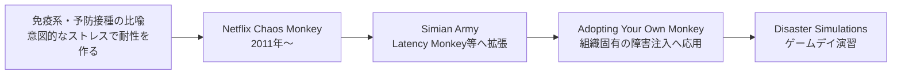

Netflixのカオスエンジニアリングの源流である「Chaos Monkey」は、意図的にサーバーをランダムに落とすことでシステムの回復力を検証するツールとして知られています。出典：InfoQのアーカイブでは、Netflixがクラウド環境の回復力をテストするために、話題になっていた「Chaos Monkey」ツールをオープンソース化したと報じられています。本書では、これを単なる「一発ネタ」ではなく、**運用チームが自分たちの障害への備えを継続的に検証する規律**として位置づけている点が重要です。

---

## 9. 現代の実務にどう活かすか：パターン対応表

本書の初版刊行から約20年が経ち、当時「自作するしかなかった」パターンの多くは、今日ではライブラリやプラットフォーム機能として提供されています。本ガイドの狙いは「car輪の再発明」を避け、**本書のパターンをどのツールで実現するか**を知ることです。

| 本書のパターン | 現代の代表的な実現手段 |
|---|---|
| Circuit Breaker | Resilience4j（Java/Spring）、Polly（.NET）、Istio / Envoy のOutlier Detection（サービスメッシュ） |
| Bulkheads | Kubernetesのリソースリクエスト/リミット、スレッドプール分離、専用ノードプール |
| Timeouts | gRPC/HTTPクライアントのデッドライン設定、サービスメッシュのタイムアウトポリシー |
| Decoupling Middleware | Apache Kafka、Amazon SQS/SNS、RabbitMQ |
| Shed Load / Create Back Pressure | ロードバランサーのレート制限、リアクティブストリームのバックプレッシャー機構 |
| Let It Crash | Kubernetesのヘルスチェック＋Pod自動再起動、Supervisor/PM2 |
| Handshaking | gRPCヘルスチェックプロトコル、サービスメッシュのヘルスプロービング |
| Governor | デプロイのカナリア速度制限、フィーチャーフラグの段階的ロールアウト |
| Expand/Contract デプロイ | ブルーグリーンデプロイ、カナリアリリース、後方互換スキーママイグレーション |
| Chaos Engineering | Netflix Chaos Monkey/Simian Army、Gremlin、AWS Fault Injection Service |

出典：Wikipediaのバルクヘッドパターンの解説では、MicrosoftがAzureのコアクラウドデザインパターンの一つとしてこれを文書化し、AWSも独自のレジリエンスガイダンスに組み込んだこと、Hystrixが2018年にメンテナンスモードに入った後、JVM向けのResilience4jや.NET向けのPollyがスレッドプール／セマフォ両方の分離戦略を引き継いだことが述べられています。

サーキットブレーカーはAWSの公式ガイダンスでも、Nygard の著書を出典として明記した上でモダナイゼーションパターンの一つとして紹介されています。出典：AWS Prescriptive Guidanceでは、サーキットブレーカーパターンはNygard氏の著書『Release It』で広められたもので、呼び出し先サービスが繰り返しタイムアウトや失敗を起こした後の再試行を防ぎ、呼び出し先サービスが復旧したことを検知できるようにするものだと説明されています。

---

## 10. ステップバイステップ実践チェックリスト

自分が担当するシステムに本書のエッセンスを適用する際は、次の順番で進めると迷いにくくなります。

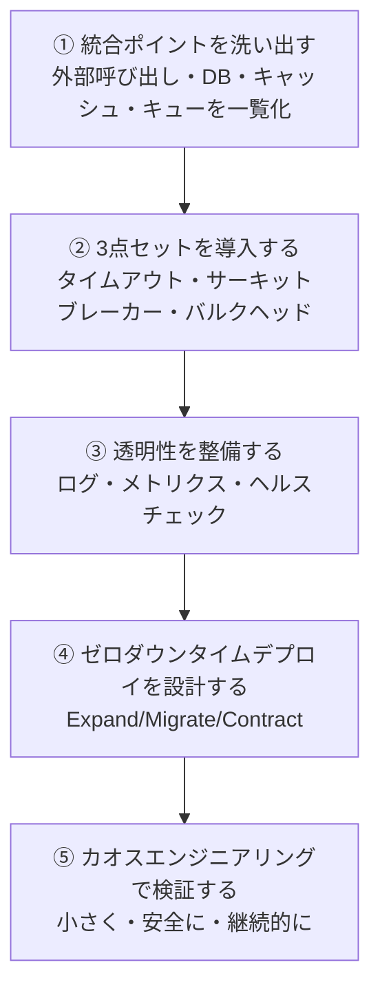

実践時のチェックリスト：

- [ ] すべての外部呼び出し（DB・API・キャッシュ・メッセージング）にタイムアウトが設定されているか
- [ ] 依存先ごとにサーキットブレーカーが導入され、状態（Closed/Open/Half-Open）がダッシュボードで見えるか
- [ ] 依存先ごとにスレッドプール／コネクションプールが分離され、1つの依存先の障害が他に波及しないか
- [ ] 過負荷時に一部リクエストを意図的に拒否する仕組み（Shed Load）があるか
- [ ] ログローテーション・キャッシュ失効・一時ファイル削除など、定常状態を保つ処理が自動化されているか
- [ ] 障害を意図的に再現するテストハーネスが、少なくとも主要な統合ポイントに対して存在するか
- [ ] デプロイ中に新旧バージョンが同時に稼働しても、データの整合性が壊れない設計になっているか（Expand/Contract）
- [ ] 本番相当のデータ量・同時接続数で負荷テストを実施しているか（Unbounded Result Sets対策）
- [ ] OWASP Top 10と最小権限の原則に沿ったセキュリティレビューが行われているか
- [ ] 意図的な障害注入（カオスエンジニアリング）を、小さな範囲から段階的に実施する計画があるか

---

## 11. よくある誤解・FAQ

**Q. サーキットブレーカーとタイムアウトは同じものですか？**
A. 異なります。タイムアウトは「1回の呼び出しをいつ諦めるか」を決めるものであり、サーキットブレーカーは「失敗が続く呼び出し先への呼び出しそのものを、一定期間まとめて止めるか」を決めるものです。タイムアウトが個々の症状を検知し、サーキットブレーカーが再発防止のために回路を開く、という役割分担になります。

**Q. Let It Crash は「エラーハンドリングを放棄する」ということですか？**
A. いいえ。Let It Crash は「回復不能な内部状態を無理に修復しようとするより、コンポーネント単位で作り直した方が安全な場合がある」という限定的な指針です。すべてのエラーハンドリングを省略してよいという意味ではなく、どのレベルで復旧を試みるかの設計判断を促すパターンです。

**Q. 初版と第2版、どちらを読むべきですか？**
A. これから読む場合は、クラウドネイティブ／マイクロサービス／カオスエンジニアリングまでカバーする第2版（2018年）を推奨します。読者レビューでも、初版で指摘されていた「Java色が強すぎる」という弱点が第2版で大きく改善されたと評価されています。出典：Goodreadsのレビューでは、第2版は初版に寄せられていた『内容が古い』という批判の多くを解消し、現代のDevOpsムーブメントやマイクロサービス、モダンな技術を取り込んでいると評価されています。

**Q. マイクロサービスを使っていない（モノリシックな）システムにも本書は役立ちますか？**
A. 役立ちます。本書のアンチパターン／パターンの多くは、モノリシックなアプリケーションが外部のDB・キャッシュ・決済API・メール送信サービスなどと通信する時点ですでに当てはまります。統合ポイントが1つでも存在すれば、Circuit BreakerやTimeoutsの価値は失われません。

---

## 12. まとめ

`Release It!` が20年近く読み継がれている理由は、パターン名そのものよりも、**「本番環境は開発環境と本質的に異なる、敵対的な環境である」という現実を直視する姿勢**にあります。

- 安定性は「障害をゼロにする」ことではなく、「クラックを伝播させない」ことで作られる
- タイムアウト・サーキットブレーカー・バルクヘッドは単体ではなく、多層防御として組み合わせる
- インフラ・ネットワーク・セキュリティ・コントロールプレーンは、アプリケーションの安定性と地続きの設計対象である
- デプロイは「止めて安全に行う」ものではなく、「止めずに安全に行える」ように設計するものである
- 組織やプロセスも、変化に対して凸型リターンを得られるように適応し続ける必要がある
- カオスエンジニアリングは、備えを継続的に検証するための規律である

本書で提唱されたサーキットブレーカーやバルクヘッドといった語彙は、Martin Fowler の解説記事やNetflixのHystrix、そして現在のAWS・Azureの公式クラウド設計パターン集にまで浸透し、今日の分散システム設計の共通言語になっています。

---

## 13. 参考文献

1. Michael T. Nygard, *Release It!* — O'Reilly掲載ページ（初版・ユーザー参照元）: https://www.oreilly.com/library/view/release-it/9781680500264/
2. Michael T. Nygard, *Release It!, 2nd Edition* — O'Reilly掲載ページ: https://www.oreilly.com/library/view/release-it-2nd/9781680504552/
3. *Release It! Second Edition* — 出版社（Pragmatic Bookshelf）公式ページ: https://pragprog.com/titles/mnee2/release-it-second-edition/
4. *Release It! Second Edition* 全目次PDF — イルメナウ工科大学図書館書誌カタログ（GBV）: https://www.gbv.de/dms/ilmenau/toc/898405874.PDF
5. Martin Fowler, "CircuitBreaker" (bliki): https://martinfowler.com/bliki/CircuitBreaker.html
6. Wikipedia, "Bulkhead pattern": https://en.wikipedia.org/wiki/Bulkhead_pattern
7. AWS Prescriptive Guidance, "Circuit breaker pattern": https://docs.aws.amazon.com/prescriptive-guidance/latest/cloud-design-patterns/circuit-breaker.html
8. Netflix/Hystrix Wiki, "Operations": https://github.com/Netflix/Hystrix/wiki/Operations
9. InfoQ, "Netflix Hystrix - Latency and Fault Tolerance for Complex Distributed Systems": https://www.infoq.com/news/2012/12/netflix-hystrix-fault-tolerance
10. InfoQ, "Netflix Content on InfoQ"（Eureka/Chaos Monkeyのオープンソース化の記録）: https://www.infoq.com/Netflix/news/73
11. InnoQ, "Widerstandsfähigen Java-Code mit Resilience4j schreiben"（ドイツの著名テック企業InnoQのブログ）: https://www.innoq.com/de/blog/2021/09/java-circuit-breaker-resilience4j/
12. Adam Hawkins, "Book Review: Release It! (2nd Edition)": https://medium.com/slashdeploy/book-review-release-it-2nd-edition-47eed59ac3e0
13. Kevin Sookocheff, "Stability Anti-Patterns": https://sookocheff.com/post/architecture/stability-antipatterns/
14. "Notes, Quotes, and Thoughts from Release It": https://john.dev/posts/2019-04-14-release-it-notes.html
15. Tim Wellhausen, "Expand and Contract - A Pattern to Apply Breaking Changes to Persistent Data with Zero Downtime"（Release It!第7章を出典として明記）: https://www.tim-wellhausen.de/papers/ExpandAndContract/ExpandAndContract.html
16. Goodreads, *Release It!* 読者レビュー: https://www.goodreads.com/book/show/34695798-release-it
17. Sam Newman, *Building Microservices* 読書ノート（バルクヘッドに関する引用箇所）: https://www.goodreads.com/notes/24836465-building-microservices/30487097-jhony-rivero?page=4
18. Educative, "Convex Returns"（第16章の解説コース）: https://educative.io/courses/distributed-systems-real-world/convex-returns
19. "Circuit Breaker and Resilience4j Practical Implementation Guide"（Resilience4jの普及に関する解説記事）: https://www.youngju.dev/blog/architecture/2026-03-06-architecture-circuit-breaker-resilience4j-patterns.en
20. "Release It - Summary and Review": https://koerbitz.me/posts/Release-It-Summary-And-Review.html
21. kaiosilveira, "nodejs-let-it-crash"（Let It Crashパターンの実装例）: https://github.com/kaiosilveira/nodejs-let-it-crash
22. Nassim Nicholas Taleb, "Concave, Convex, and Nonlinear Fragility"（凸型リターン/反脆弱性の背景）: https://stoicagilist.substack.com/p/concave-convex-and-nonlinear-fragility

---

*本ガイドは上記の一次情報源（出版社公式ページ、書誌カタログ、著者本人が言及されている技術記事、Martin Fowler氏やAWS公式ドキュメントなど国際的に著名な情報源）に基づいて2026年8月24日時点の情報を要約・再構成したものです。原著の文章そのものは引用しておらず、すべて独自の言葉で解説しています。原著の詳細な内容については、上記リンク先の書籍を直接ご参照ください。*
