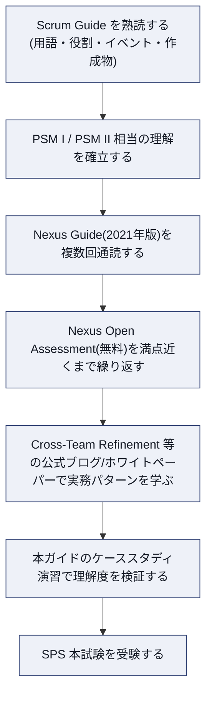
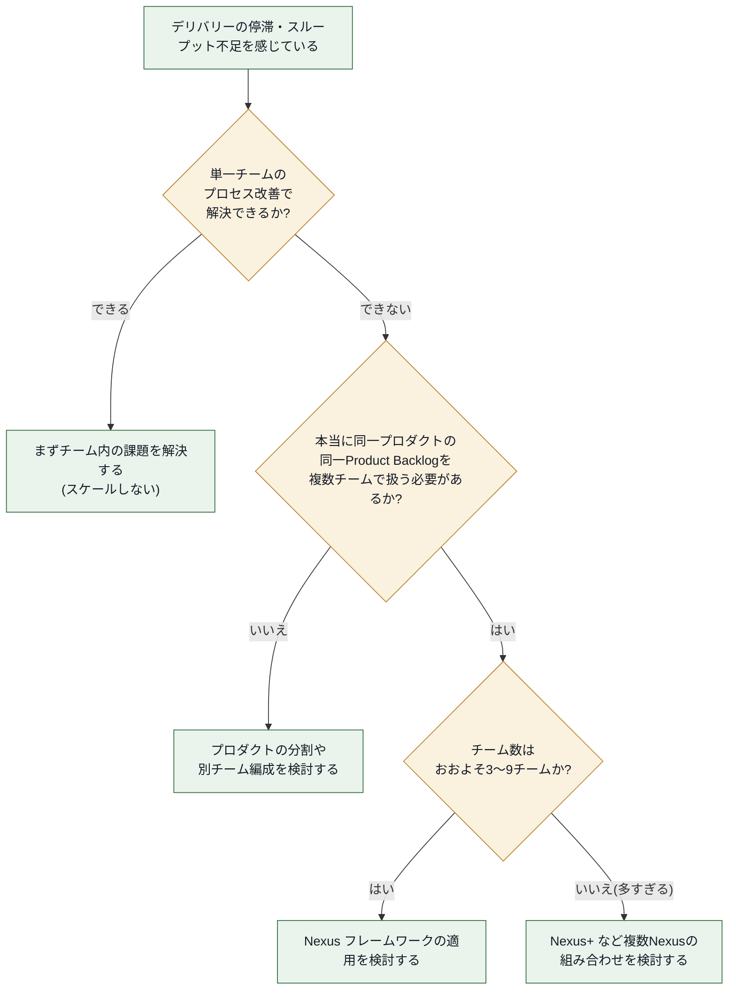
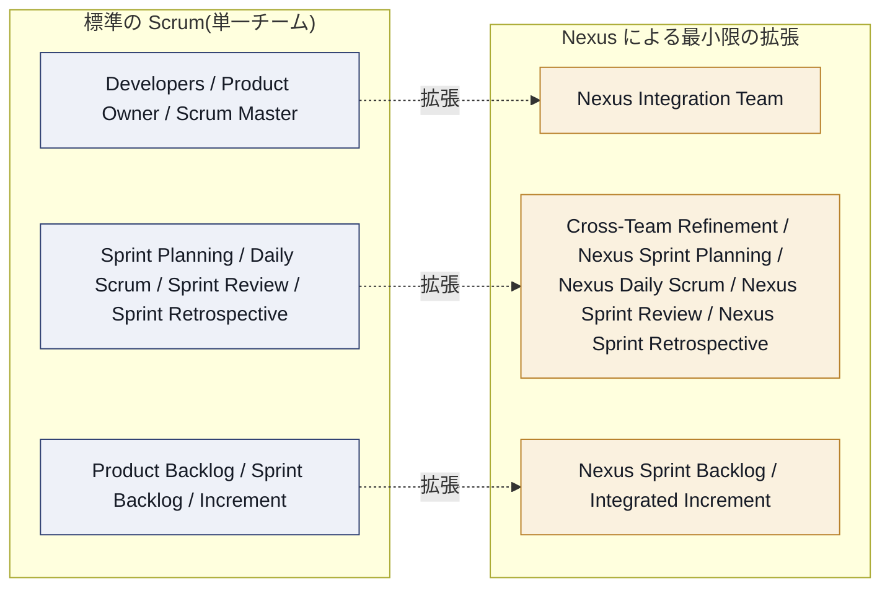
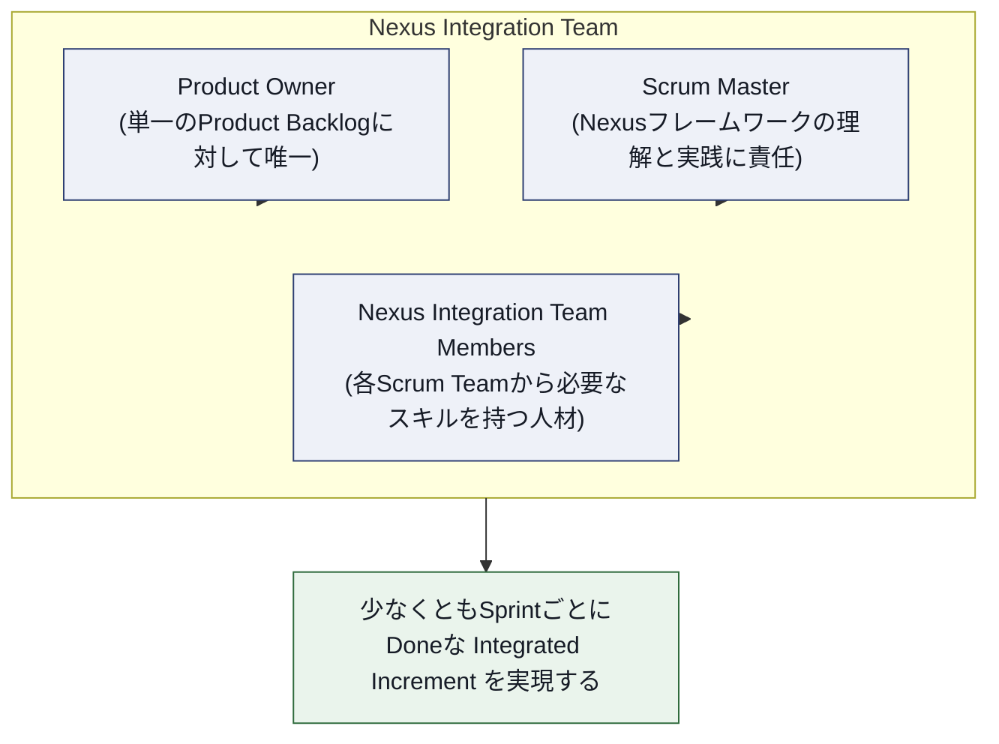
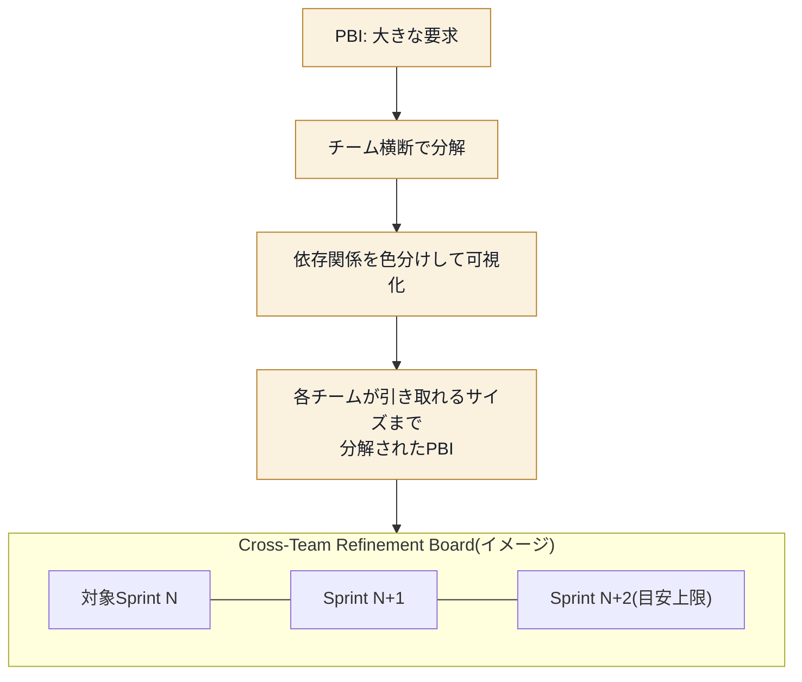
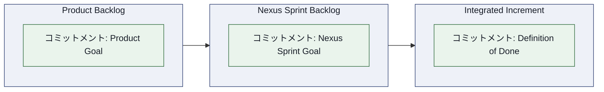
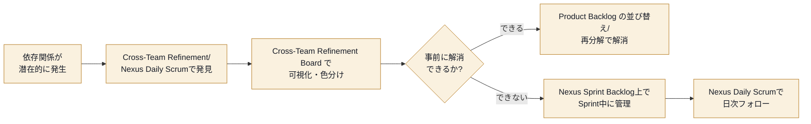
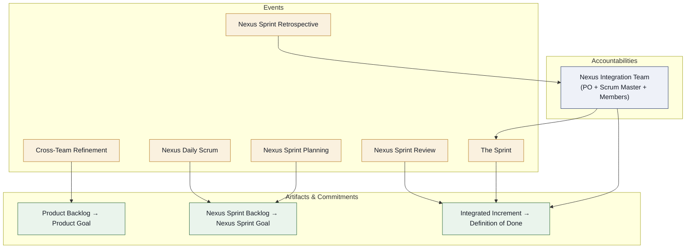

# Scaled Professional Scrum™(SPS)認定 完全学習ガイド

> 初学者にも分かるようにゼロから解説します。本ガイドは Scrum.org 公式の Nexus Guide、公式アセスメントページ、および公式ブログ・ホワイトペーパーの内容を基に、独自の言葉で体系化したものです。引用は最小限にとどめ、一次情報源への参照 URL を各章末に明記しています。

---

## 0. このガイドの読み方

| 項目 | 内容 |
|---|---|
| 対象試験 | Scaled Professional Scrum™(SPS)Certification(Scrum.org) |
| 前提知識 | Scrum Guide の内容を熟知していること(PSM Ⅰ/Ⅱ 相当)。SPS は「Scrum を知らない人」には推奨されない上級試験です |
| 出題形式 | 選択式・複数選択・True/False 混在、40問、60分 |
| 合格ライン | 85%以上(Scrum.org の中でも最も高い合格基準の一つ) |
| コア教材 | The Nexus™ Guide(2021年1月版) |
| 本ガイドの構成 | 第1部:試験の全体像 → 第2部:Nexus フレームワークの詳細 → 第3部:実務ベストプラクティス → 第4部:試験対策・演習 |

本ガイドでは英語の専門用語(Nexus, Sprint, Product Backlog, Sprint Goal, Definition of Done など)はそのまま英語表記を維持し、説明部分は日本語で行います。これは Scrum.org の公式ガイド自体が用語を厳密に定義しているため、翻訳による意味のズレを避けるためです。

---

## 1. Scaled Professional Scrum™ 認定とは何か

### 1.1 資格の位置づけ

SPS 認定は、**Nexus フレームワーク**(Nexus Guide に定義される)を用いて、複数の Scrum Team が単一の Product Backlog から作業し、単一の Integrated Increment を構築する方法についての知識を検証する資格です。Scrum.org 独自の「Professional Scrum Competencies(プロフェッショナル・スクラム・コンピテンシー)」モデルにおいて、「Understanding and Applying the Scrum Framework(スクラムフレームワークの理解と適用)」というコンピテンシーの中に **Scaling(スケーリング)** というフォーカスエリアが存在し、SPS はこのフォーカスエリアを深く掘り下げる資格として位置づけられています。

> **補足:** Scrum.org の資格は「講座に出席したこと」ではなく「試験に合格したこと」で認定される点が Scrum Alliance 系資格(CSM/CSPO など)と大きく異なります。SPS も同様で、Scaled Professional Scrum with Nexus コースへの参加は必須ではありませんが、強く推奨されています。

### 1.2 試験の構造(コミュニティ情報を含む)

Scrum.org は個々の設問内容を公開していませんが、SPS を受験・分析したコミュニティの情報を総合すると、出題は大きく2つのカテゴリーに分類できます。

| カテゴリー | 内容 | 目安割合 |
|---|---|---|
| Nexus フレームワークの知識 | Nexus Guide に定義された用語・役割・イベント・作成物に関する事実確認的な設問(PSM Ⅰ における Scrum の設問に相当) | 約80% |
| ケーススタディ型設問 | スケールされた Scrum 環境(主に Nexus 環境)の状況が提示され、問題を特定する、または最良のアプローチを選択する設問 | 約20% |

**ベストプラクティス:** ケーススタディ型の設問では「唯一の正解」が存在するように見えても、Nexus Guide の原則(経験主義・自己管理・透明性の最大化)に最も忠実な選択肢を選ぶことが鍵になります。表面的なテクニックの暗記よりも、「なぜその Event/Artifact が存在するのか」という目的(purpose)を理解することが得点に直結します。

### 1.3 受験対象者

Scrum.org は SPS を以下のような、**すでに Scrum の実務経験が豊富な人材**に推奨しています。

- 自組織を単一 Scrum Team から複数チーム体制へスケールさせようとしている経験豊富な Scrum Master
- Nexus を使う組織に参加する、またはこれから使う Developers / Product Owner
- Scrum の経験を持つアジャイルコーチ
- 複数チームが協働する際の困難を理解したい開発マネージャー

逆に、Scrum の経験や知識が乏しい人には推奨されていません。

### 1.4 学習ロードマップ(推奨順序)

**ソース:** [Scaled Professional Scrum™ Certification(公式アセスメントページ)](https://www.scrum.org/assessments/scaled-professional-scrum-certification) / [Scaled Professional Scrum(SPS)攻略ガイド:Scrum-Exams.info](https://scrum-exams.info/sps/) / [The Professional Scrum Competencies](https://www.scrum.org/professional-scrum-competencies)

---

## 2. 大前提:なぜ「スケール」する必要があるのか

SPS の学習で最初に押さえるべきなのは、Nexus の仕組みそのものよりも先に「**そもそもスケールすべきかどうか**」という問いです。Scrum.org のトレーニング目標にも明記されている通り、SPS コースの学習目標の一つは「自組織にとって最適な規模を見極め、必要であれば "de-scale"(縮小)する方法を理解すること」です。

### 2.1 スケールの根本原則

Nexus Guide は、価値提供の量を増やすために「人を増やす」ことが必ずしも正しい解決策ではないと明言しています。人と製品規模が増えるほど、複雑性・依存関係・協調コスト・コミュニケーション経路の数が増加します。むしろ人数を減らす「縮小(scaling down)」が、より多くの価値を届けるための重要な実践になり得ます。

### 2.2 依存関係が生まれる2つの根本原因

Nexus Guide によれば、チーム間の依存関係は主に次の2種類のミスマッチから生じます。

| ミスマッチの種類 | 説明 |
|---|---|
| **プロダクト構造(Product structure)** | プロダクト内の関心事がどれだけ独立して分離されているかによって、統合されたプロダクトリリースを作る際の複雑さが大きく変わる |
| **コミュニケーション構造(Communication structure)** | チーム内・チーム間の人々のコミュニケーションの取り方が作業の進め方に影響し、伝達や フィードバックの遅延は作業の流れを阻害する |

**ベストプラクティス:**
- プロダクトのアーキテクチャ(コンポーネント境界)とチーム境界が一致していない場合、依存関係は構造的に発生し続けます。可能な限り「フィーチャーチーム」(エンドツーエンドで価値を届けられるチーム)を志向し、コンポーネントチーム(特定のレイヤーやモジュールにのみ責任を持つチーム)への過度な依存を避けることが推奨されます。
- コミュニケーション構造の改善は、物理的な席配置よりも「誰が・いつ・何を・誰と話すべきか」を明確にする Nexus のイベント設計(Cross-Team Refinement や Nexus Daily Scrum)によって支えられます。

**ソース:** [The Nexus™ Guide(2021年1月版)PDF](https://scrumorg-website-prod.s3.amazonaws.com/drupal/2021-01/NexusGuide%202021_0.pdf) / [Scaling Scrum with Nexus(公式)](https://www.scrum.org/resources/scaling-scrum) / [Scaling Scrum with Nexus and Scrum Studio(公式ブログ)](https://www.scrum.org/resources/blog/scaling-scrum-nexus-and-scrum-studio)

---

## 3. Nexus フレームワーク全体像

### 3.1 定義

Nexus は、**約3〜9個の Scrum Team** が協働して単一のプロダクトを届けるためのフレームワークです。Nexus はただ1人の Product Owner がただ1つの Product Backlog を管理し、すべての Scrum Team がそこから作業を引き出します。Nexus フレームワークは、Nexus 内のチームの作業を結びつける「責任(Accountabilities)」「イベント(Events)」「作成物(Artifacts)」を定義します。

Nexus は Scrum の基盤の上に構築されており、Scrum を使ったことがある人にとってはその構成要素が馴染み深いものになっています。Nexus は、複数のチームが単一の Product Backlog から作業して単一の Integrated Increment を目標に向けて構築できるようにするために、**絶対に必要な箇所だけ最小限に Scrum を拡張**します。

### 3.2 Nexus の理論(Nexus Theory)

Nexus の核心は、Scrum の基盤にあるボトムアップの知性と経験主義を維持・強化しながら、単独チームでは実現できない価値を Scrum Team のグループが届けられるようにすることです。Nexus のゴールは、単一プロダクトに取り組む Scrum Team のグループが届けられる価値をスケールさせることであり、そのために各チームが遭遇する複雑さを軽減します。

### 3.3 Nexus がScrumに追加する3要素

| 拡張要素 | 内容の要約 |
|---|---|
| **Accountabilities(責任)** | Nexus Integration Team が新設され、Nexus が少なくとも Sprint ごとに価値ある使用可能な Integrated Increment を届けることに責任を持つ |
| **Events(イベント)** | 通常の Scrum イベントに追加・付随、または一部を置き換える形でイベントが拡張される。Nexus 全体と個々のチームの両方に資する |
| **Artifacts(作成物)** | すべての Scrum Team が単一の Product Backlog を使用する。Nexus Sprint Backlog が透明性確保のために存在し、Integrated Increment は Nexus が完成させた統合済み作業の総和を表す |

**ソース:** [Online Nexus Guide(公式)](https://www.scrum.org/resources/online-nexus-guide) / [Overview of the Nexus Framework for scaling Scrum(公式ブログ)](https://www.scrum.org/resources/blog/overview-nexus-framework-scaling-scrum)

---

## 4. Nexus の責任(Accountabilities):Nexus Integration Team

### 4.1 目的と構成

**Nexus Integration Team** は、Nexus によって完成された作業の合計である Integrated Increment が、少なくとも Sprint ごとに「Done」の状態で生み出されることに責任を持ちます。複数の Scrum Team が協力して価値ある使用可能な Increment を作るという、Scrum で規定された説明責任を実現可能にする「焦点(フォーカス)」を提供する存在です。

Nexus Integration Team は次のメンバーで構成されます。

| 役割 | 責任の要約 |
|---|---|
| **Product Owner** | 単一の Product Backlog に対する唯一の責任者。Nexus 内 Scrum Team によって統合・実行された作業とプロダクトの価値を最大化する責任を持つ |
| **Scrum Master(NIT所属)** | Nexus フレームワークが Nexus Guide に記述された通りに理解・実践されることに責任を持つ。同時に Nexus 内の1つ以上の Scrum Team の Scrum Master を兼務することもある |
| **Nexus Integration Team Members** | 各 Scrum Team が Definition of Done を満たす価値ある使用可能な Integrated Increment を届けられるよう、ツールや実践の導入・習得を支援する。コーチング、コンサルティング、依存関係やチーム横断課題への意識喚起が主な活動 |

### 4.2 重要な運用ルール

- Nexus Integration Team のメンバー構成は、Nexus のその時点でのニーズを反映して**時間とともに変化**してよい(固定チームである必要はない)。
- **Nexus Integration Team への所属責任は、個々の Scrum Team メンバーとしての責任より優先される**。ただし NIT としての責任が果たされている限り、各自の Scrum Team メンバーとしても作業を続けられる。この優先順位づけにより、複数チームに影響する課題の解決が最優先されるようになる。

**ベストプラクティス:**
- Nexus Integration Team を「別のチーム(第10のチーム)」として固定化しないこと。実務コミュニティでは "The NIT is simply a subset of us"(NIT は自分たちの一部にすぎない)という考え方が推奨されており、NIT を現場から切り離された「司令塔」にしないことが重要です。
- NIT メンバーは日々のチーム活動の中で潜在的な依存関係に目を光らせ、新しい依存関係を発見したら Cross-Team Refinement の場で速やかに透明化するよう促す役割を担います(詳細は5.2節)。

**ソース:** [The Nexus™ Guide(2021年1月版)PDF](https://scrumorg-website-prod.s3.amazonaws.com/drupal/2021-01/NexusGuide%202021_0.pdf) / [Nexus In A Nutshell(公式ブログ)](https://www.scrum.org/resources/blog/nexus-nutshell)

---

## 5. Nexus のイベント(Events)詳細解説

Nexus はイベントを Scrum に「追加」「前後に配置」、または「一部を置き換える」形で拡張します。Nexus イベントのタイムボックスの長さは、対応する Scrum Guide のイベントの長さに準じ、それに**加えて**設定されます(=対応する Scrum イベントの代わりに短縮するものではありません)。

規模が大きくなると、Nexus の全メンバーが情報共有や合意形成に参加するのは現実的でない場合があります。したがって、明記されている場合を除き、Nexus イベントにはその目的を最も効果的に達成するために必要なメンバーのみが参加します。

### 5.1 Sprint 全体の流れ

### 5.2 Cross-Team Refinement(チーム横断リファインメント)

**目的:** Product Backlog のチーム横断リファインメントは、Nexus 内のチーム間依存関係を削減または排除します。Product Backlog は、依存関係が透明化され、チーム横断で特定され、除去または最小化されるように分解されなければなりません。Product Backlog Item は、非常に大きく曖昧な要求から、単一の Scrum Team が1 Sprint 内で届けられる実行可能な作業へと、段階的に分解が進みます。

チーム横断リファインメントは規模において二重の目的を果たします。

1. どのチームがどの Product Backlog Item を届けるかを予測する助けになる
2. チーム間の依存関係を特定する

リファインメントは継続的な活動であり、頻度・期間・参加者はこの2つの目的を最適化するために変化します。単一チーム Scrum では Product Backlog リファインメントは任意の継続的活動ですが、複数チームが単一 Product Backlog から作業する複雑性が増すため、**Nexus では公式かつ必須のイベント**として格上げされています。

#### 5.2.1 実務パターン:Cross-Team Refinement Board

Scrum.org 公式ホワイトペーパーおよびブログ記事では、Cross-Team Refinement を可視化するための「ボード」の使い方が具体的に紹介されています。

**ベストプラクティス(公式ブログ「8 Tips for Scrum Masters to Improve Cross-Team Refinement in Nexus」より要約):**

- **代表者は役割ではなく、対象作業の内容で選ぶ**:全メンバーを毎回招集するのは現実的でも必要でもありません。リファインメント対象の Product Backlog Item に応じて、ドメイン知識・技術知識を持つ代表者を各チームから選出します。
- **ボードは毎日更新する**:Nexus Sprint Backlog が Nexus Daily Scrum で毎日更新されるのと同様に、Cross-Team Refinement Board も新しい依存関係が発生するたびに毎日更新することで、常に「今わかっている依存関係の実像」を反映させます。
- **依存関係の種類を色分けする**:外部依存(他チームや他部門への依存)を少なくとも1色で識別し、組織固有の依存原因があれば追加の色分けを検討します。これにより依存カテゴリーや繰り返し発生する依存を見える化できます。
- **先読みしすぎない**:ソフトウェア開発には「未知の未知」が存在するため、どれだけ長くリファインメントや計画をしても全ての依存関係を事前に予測することは不可能です。時間を浪費しないために、**Nexus は先行して1〜3 Sprint分程度**のみをリファインメントの対象にとどめるべきです。
- **リファインメントの前半と後半で目的を分ける**:前半は PBI をチームが理解できる粒度まで分解すること、後半は依存関係の特定と解消に集中することが推奨されます。

**ソース:** [8 Tips for Scrum Masters to Improve Cross-Team Refinement in Nexus(公式ブログ)](https://www.scrum.org/resources/blog/8-tips-scrum-masters-improve-cross-team-refinement-nexus) / [Cross-Team Refinement in Nexus™(公式ホワイトペーパーPDF)](https://scrumorg-website-prod.s3.amazonaws.com/drupal/2016-08/Cross-Team%20Refinement%20in%20Nexus%20whitepaper_0.pdf) / [Cross-Team Refinement in Nexus(公式リソースページ)](https://www.scrum.org/resources/cross-team-refinement-nexus)

### 5.3 Nexus Sprint Planning

**目的:** Nexus Sprint Planning の目的は、Nexus 内のすべての Scrum Team の活動を単一の Sprint に向けて調整することです。各 Scrum Team からの適切な代表者と Product Owner が集まり、Sprint を計画します。

**成果物:**

| 成果物 | 内容 |
|---|---|
| Nexus Sprint Goal | Product Goal と整合し、その Sprint で Nexus が達成する目的を記述する |
| 各チームの Sprint Goal | Nexus Sprint Goal と整合するように設定される |
| 単一の Nexus Sprint Backlog | Nexus 全体の Nexus Sprint Goal に向けた作業を表し、チーム横断の依存関係を透明化する |
| 各チームの Sprint Backlog | 各チームが Nexus Sprint Goal を支援するために行う作業を透明化する |

**ベストプラクティス:** 実務では「まずチーム横断で依存関係をつぶし、それから各チームが自分たちの Sprint Planning を通常どおり行う」という2段階の流れが推奨されています。Nexus のレイヤーは各チームの Scrum を置き換えるのではなく、その上に乗って整合を取るためのものです。Cross-Team Refinement で十分に依存関係が解消されていれば、Nexus Sprint Planning 自体で新たな依存関係が発生することは最小限に抑えられます。

**ソース:** [Online Nexus Guide(公式)](https://www.scrum.org/resources/online-nexus-guide) / [Nexus Sprint Planning in Practice(実務解説記事)](https://accentient.com/blog/nexus-sprint-planning-in-practice/)

### 5.4 Nexus Daily Scrum

**目的:** Nexus Daily Scrum の目的は、統合上の課題を特定し、Nexus Sprint Goal に向けた進捗を検査することです。Scrum Team からの適切な代表者が参加し、Integrated Increment の現在の状態を検査し、統合上の課題や新たに発見されたチーム横断の依存関係・影響を特定します。

各 Scrum Team の Daily Scrum は、Nexus Daily Scrum で提起された統合上の課題に対応することに主眼を置いた、その日の計画を作成することで Nexus Daily Scrum を補完します。Nexus Daily Scrum のみが依存関係や統合課題を提起できる唯一の場ではなく、Sprint 中の作業再計画についてのより詳細な議論のために、チーム横断のコミュニケーションは1日を通じて発生し得ます。

**ベストプラクティス:** 実務コミュニティ(Growing Agility 等)では、Nexus Daily Scrum の代表者が確認すべき観点として次が挙げられています。

- 前日の作業は正しく統合できたか。できなかった場合、その理由は何か
- 今日、統合上のリスクとなりうる作業は何か
- Nexus Sprint Backlog を用いて、現在の依存関係を可視化・管理する

**順序の工夫:** Nexus Daily Scrum を各チームの Daily Scrum より**先**に実施すると、チームは Nexus Daily Scrum で提起された依存関係や統合課題への対応を、その日の自チームの計画に反映しやすくなります。

**ソース:** [Nexus events: Team Sprint Planning & sequence of events(公式フォーラム)](https://www.scrum.org/forum/scrum-forum/46438/nexus-events-team-sprint-planing-sequence-events) / [Nexus Framework - Growing Agility](http://growing-agility.com/nexus/)

### 5.5 Nexus Sprint Review

**目的:** Nexus Sprint Review は Sprint の終わりに開催され、Nexus が Sprint を通じて構築した Done な Integrated Increment についてフィードバックを得て、今後の適応を決定するために行われます。

Integrated Increment 全体がステークホルダーからのフィードバックを得る対象であるため、**Nexus Sprint Review は個々の Scrum Team の Sprint Review を置き換えます**(Nexus イベントの中で唯一「置き換え型」のイベントです)。イベント中、Nexus は主要ステークホルダーに作業成果を提示し、Product Goal に向けた進捗が議論されますが、完了したすべての作業を詳細に見せることはできない場合もあります。この情報に基づき、参加者はフィードバックへの対応としてNexusが何をすべきか協働します。Product Backlog はこれらの議論を反映して調整されることがあります。

**ベストプラクティス:** すべての作業を1つずつデモすることは現実的ではないため、Product Goal に対するインパクトが大きい機能や、統合によって初めて価値が確認できる機能を優先してデモすることが推奨されます。

**ソース:** [The Nexus™ Guide(2021年1月版)PDF](https://scrumorg-website-prod.s3.amazonaws.com/drupal/2021-01/NexusGuide%202021_0.pdf)

### 5.6 Nexus Sprint Retrospective

**目的:** Nexus Sprint Retrospective の目的は、Nexus 全体の品質と効果性を高める方法を計画することです。Nexus は、個人・チーム・相互作用・プロセス・ツール・Definition of Done に関して、直前の Sprint がどうだったかを検査します。

個々のチームの改善に加えて、各 Scrum Team の Sprint Retrospective は、ボトムアップの知見を使って Nexus 全体に影響する課題に焦点を当てることで、Nexus Sprint Retrospective を補完します。Nexus Sprint Retrospective は Sprint を締めくくるイベントです。

**ベストプラクティス:** 2021年版 Nexus Guide では、Nexus Sprint Retrospective に対する具体的な進行手順(かつて存在した「Nexus全体→個別チーム→Nexus全体」という3部構成)は、もはや必須のプラクティスとして規定されていません。これらは任意の補完的プラクティスとして扱うべきである、と Scrum.org 自身の書籍解説でも明記されています。したがって「型」を機械的に踏襲するのではなく、Nexus が実際に抱える課題(個人・チーム・相互作用・プロセス・ツール・Doneの定義)に応じて柔軟に設計することが望まれます。

**ソース:** [The Nexus Framework for Scaling Scrum(公式書籍紹介ページ、正誤・補足あり)](https://www.scrum.org/resources/nexus-framework-scaling-scrum) / [Nexus Guide Change History(公式)](https://www.scrum.org/resources/nexus-guide-change-history)

### 5.7 イベントまとめ表

| Nexus イベント | 対応する Scrum イベント | 種別 | 主な参加者 |
|---|---|---|---|
| The Sprint | Sprint | 同一(拡張なし) | 全チーム |
| Cross-Team Refinement | Product Backlog Refinement(Nexusでは必須化) | 追加・格上げ | 各チームの代表者 + PO |
| Nexus Sprint Planning | Sprint Planning | 付随(前段階) | 各チームの代表者 + PO |
| Nexus Daily Scrum | Daily Scrum | 付随 | 各チームの代表者 |
| Nexus Sprint Review | Sprint Review | **置き換え** | ステークホルダー含む全体 |
| Nexus Sprint Retrospective | Sprint Retrospective | 付随 | 必要なメンバー |

**試験での注意点:** SPS の設問では「Nexus Sprint Review が個々の Sprint Review を "置き換える" 唯一のイベントである」という点が頻出のひっかけポイントです。他のイベントはすべて「追加・付随」であり、個々のチームの対応イベントを不要にするものではありません。

---

## 6. Nexus の作成物(Artifacts)とコミットメント

作成物は作業や価値を表し、Scrum Guide に記述されている通り透明性を最大化するように設計されています。Nexus Integration Team は、Nexus 内の Scrum Team と協力して、すべての作成物にわたる透明性が達成され、Integrated Increment の状態が広く理解されるようにします。

Nexus は次の作成物で Scrum を拡張し、それぞれの作成物にはコミットメントが含まれます。これらのコミットメントは、Nexus とそのステークホルダーのために経験主義と Scrum の価値基準を強化するために存在します。

### 6.1 Product Backlog / Product Goal

Nexus 全体・すべての Scrum Team のためにプロダクトを改善するために必要なものを列挙した、**単一の** Product Backlog が存在します。規模において、Product Backlog は依存関係を検出・最小化できるレベルで理解されている必要があります。Product Owner は Product Backlog の内容・可用性・順序づけに責任を持ちます。

その**コミットメントは Product Goal** です。Product Goal はプロダクトの将来の状態を記述し、Nexus の長期目標として機能します。

### 6.2 Nexus Sprint Backlog / Nexus Sprint Goal

Nexus Sprint Backlog は、Nexus Sprint Goal と、個々の Scrum Team の Sprint Backlog に含まれる Product Backlog Item を組み合わせたものです。Sprint 中の依存関係と作業の流れを浮き彫りにするために使われます。Nexus Sprint Backlog は、Sprint を通じて学びが深まるにつれて更新され続けます。Nexus Daily Scrum で進捗を検査できる程度の詳細さを持つべきです。

その**コミットメントは Nexus Sprint Goal** です。Nexus Sprint Goal は Nexus 全体で単一の目的であり、Nexus 内の各 Scrum Team の作業とSprint Goal の総和です。チームが別々の取り組みではなく協働するよう促すことで、Sprint 中の Nexus に一貫性と焦点を生み出します。Nexus Sprint Goal は Nexus Sprint Planning イベントで作られ、Nexus Sprint Backlog に追加されます。各 Scrum Team は Sprint 中の作業においてこの目標を意識し続けます。Nexus は、ステークホルダーからのフィードバックを得るために、Nexus Sprint Goal を達成する上で Done になった価値ある使用可能な機能を Nexus Sprint Review でデモすべきです。

### 6.3 Integrated Increment / Definition of Done

Integrated Increment は、Product Goal に向けて Nexus によって完成された、統合済みのすべての作業の現時点での総和を表します。Integrated Increment は Nexus Sprint Review で検査されますが、Sprint終了前にステークホルダーに提供されることもあります。Integrated Increment は Definition of Done を満たさなければなりません。

その**コミットメントは Definition of Done** です。Definition of Done は、統合された作業がプロダクトに求められる品質と測定基準を満たした状態を定義します。Increment は、統合され・価値があり・使用可能であって初めて Done とみなされます。**Nexus Integration Team は、毎 Sprint 開発される Integrated Increment に適用できる Definition of Done に責任を持ちます**。Nexus 内のすべての Scrum Team は、この Definition of Done を定義し遵守しなければなりません。個々の Scrum Team は、自チーム内でより厳格な基準を適用することを選んでもよいですが、Integrated Increment のために合意された基準より緩い基準を適用することはできません。

**試験での注意点:** 「個々のチームは Nexus 全体の DoD より**緩い**基準を適用できるか?」という問いに対する答えは明確に **NO** です。より厳しい(stringent)基準の追加は許容されますが、緩和は許されません。この非対称性は頻出論点です。

作成物の状態に基づく意思決定は、その作成物の透明性のレベルによってのみ効果的です。不完全・部分的な情報は、誤った、あるいは欠陥のある意思決定につながります。そして、その意思決定の影響は Nexus の規模において増幅されます。

**ソース:** [Online Nexus Guide(公式)](https://www.scrum.org/resources/online-nexus-guide) / [The Nexus™ Guide(2021年1月版)PDF](https://scrumorg-website-prod.s3.amazonaws.com/drupal/2021-01/NexusGuide%202021_0.pdf)

---

## 7. 依存関係マネジメントとチーム編成のベストプラクティス

SPS 試験の約20%を占めるケーススタディ問題は、多くの場合「依存関係にどう対処するか」というテーマに集約されます。この章では Nexus Guide 本体を超えて、Scrum.org の公式トレーナー(PST)コミュニティが蓄積してきた実務知見(Nexus with Nexus コースで教えられる「50以上のプラクティス」の一部)を紹介します。

### 7.1 依存関係のライフサイクル

### 7.2 チームトポロジーの選択

| チーム編成方針 | 特徴 | 依存関係への影響 |
|---|---|---|
| **フィーチャーチーム(推奨傾向)** | エンドツーエンドで顧客価値を届けられる、機能軸の職能横断チーム | チーム間依存を構造的に減らせる |
| **コンポーネントチーム** | 特定のレイヤー・モジュール・技術領域を専門に担当するチーム | 技術的専門性は高いが、機能単位のPBIが複数チームをまたぎやすく依存が増えやすい |

**ベストプラクティス:**
- Nexus のような複数チーム環境では、依存関係を減らす最も強力なレバーは「イベントの運用改善」以上に「**チームとプロダクトの構造そのものを見直すこと**」です。コンポーネント指向のチーム編成のまま Nexus のイベントだけを整えても、根本的な依存の発生源は解消されません。
- チームの再編成(reshuffling)は依存解消の万能薬ではありません。実務Q&Aでも「経験的な証拠(empirical evidence)に基づいて、より職能横断的なチームを作れる、あるいは依存を排除できるとわかっている場合にのみ、メンバーの入れ替えを検討すべき」であり、恒常的な入れ替えは推奨されないとされています。

### 7.3 Product Owner のボトルネック対策

Nexus に5チームある場合、単一の Product Owner がすべてのチームの Sprint Planning に出席するのは現実的でないことがあります。この点は実務上よく議論される論点であり、対応としては次のようなプラクティスが挙げられます。

- Nexus Sprint Planning でチーム横断の Nexus Sprint Goal と全体像を Product Owner が直接説明し、各チームの個別 Sprint Planning には Product Owner の代理としてプロダクトの意図を理解した人物(Product Owner のプロキシ)が同席する
- Cross-Team Refinement を通じて、各 PBI の意図・受け入れ基準を事前に十分明確化しておくことで、個別 Sprint Planning での Product Owner への依存を減らす

### 7.4 見積り(Estimation)の扱い

Nexus Guide 自体は見積り手法を規定していませんが、実務コミュニティのフォーラムでは以下のようなアプローチが紹介されています。

| アプローチ | 説明 |
|---|---|
| Cross-Team Refinement 内でTシャツサイズ等の粗い見積り | 大きな Epic レベルの PBI を S/M/L/XL のようなサイズ感でチーム横断的に見積り、チーム割り当ての参考にする |
| 実装チームでの詳細見積り | 粗い見積りの後、実際に実装するチームが確定してから、そのチーム内でストーリーポイント等の詳細見積りを行う |
| No-estimates(見積りなし)アプローチ | PBI を見積りが不要なほど小さく分解する |

**ベストプラクティス:** 実装しないチームが見積りだけを行う「プッシュ見積り」は、精度が低くなりがちで、実装チームの当事者意識を下げるリスクがあるため注意が必要です。

**ソース:** [Nexus questions: cross-team dependencies and PO availabilities(公式フォーラム)](https://www.scrum.org/forum/scrum-forum/35030/nexus-questions-cross-team-dependencies-and-po-availabilities) / [Nexus Refinement meetings and estimates(公式フォーラム)](https://www.scrum.org/forum/scrum-forum/8731/nexus-refinement-meetings-and-estimates) / [Nexus In A Nutshell(公式ブログ)](https://www.scrum.org/resources/blog/nexus-nutshell)

---

## 8. Nexus と他のスケーリングフレームワークとの比較

SPS 試験自体は他フレームワーク(LeSS, SAFe, Scrum@Scale)を直接問うものではありませんが、実務での立ち位置を理解しておくことは Nexus の設計思想を相対的に理解する助けになります。

| フレームワーク | 提唱元 | 適用規模の目安 | 設計思想 |
|---|---|---|---|
| **Nexus** | Scrum.org(Ken Schwaber ら) | 約3〜9 Scrum Team、単一プロダクト | Scrum を「最小限」拡張し、Scrum の原則からの逸脱を避ける |
| **LeSS(Large-Scale Scrum)** | Craig Larman, Bas Vodde | LeSS:最大8チーム、LeSS Huge:それ以上 | 「より多くのプラクティスを足す」のではなく「よりシンプルなScrum」を志向し、単一 PO・単一 Product Backlog を維持 |
| **SAFe(Scaled Agile Framework)** | Scaled Agile, Inc. | 大規模〜エンタープライズ全体 | 複数レベル(チーム・プログラム・ポートフォリオ)の構造化されたプロセス群を提供 |
| **Scrum@Scale** | Jeff Sutherland | 小規模組織から大企業まで(スケールフリー志向) | Scrum of Scrums(SoS)を中核に、組織全体へのスケーリングを志向 |

**試験での注意点:** SPS の設問において「Nexus は SAFe のような重量級フレームワークを置き換えるものだ」という誤解に基づく選択肢は誤りです。Nexus の設計思想はあくまで「Scrum に対する最小限の拡張(exoskeleton)」であることを繰り返し強調しています。

**ソース:** [Scaling Scrum: LeSS, SAFe, Nexus, or Scrum@Scale?(比較記事)](https://prepforscrum.com/scaling-scrum-frameworks-less-safe-nexus-scrum-at-scale/) / [Nexus - the scaling Scrum framework(解説記事)](https://www.scrum-tips.com/agile/nexus-scaling-scrum-framework/)

---

## 9. Nexus の立ち上げと運用:実務上の落とし穴(アンチパターン)

| アンチパターン | 問題点 | あるべき姿 |
|---|---|---|
| Nexus Integration Team を固定の「特別チーム」として組織図に常設する | 現場のチームから乖離した司令塔になり、ボトムアップの知性を損なう | NIT はニーズに応じて構成が変化する、現場チームの一部という位置づけを保つ |
| Cross-Team Refinement を省略、または月1回程度にとどめる | 依存関係の発見が遅れ、Sprint中に大きな手戻りが発生する | 継続的に実施し、少なくとも週次以上の頻度でボードを更新する |
| Nexus Sprint Retrospective を必ず「全体→個別→全体」の3部構成で固定する | 2021年版ガイドで必須のプラクティスではなくなったにもかかわらず、形骸化した儀式になる | Nexus が実際に抱える課題に応じて柔軟に設計する |
| 個々のチームがNexus全体のDefinition of Doneより緩い基準を適用する | Integrated Incrementの品質保証が崩れる | 各チームはNexus全体のDoD以上(同等かより厳格)を満たす |
| Sprint期間を統合のためだけに延長する | Scrumのタイムボックスの規律を損ない、フィードバックサイクルを遅らせる | 統合の課題自体をDefinition of DoneやCI/CDなどの技術的実践で解決する |
| 依存関係が起きるたびにチームを頻繁に再編成する | チームの安定性・自己管理能力が損なわれる | 経験的根拠に基づく場合のみ、慎重に構造変更を検討する |

**ソース:** [Nexus In A Nutshell(公式ブログ)](https://www.scrum.org/resources/blog/nexus-nutshell) / [Nexus questions: cross-team dependencies and PO availabilities(公式フォーラム)](https://www.scrum.org/forum/scrum-forum/35030/nexus-questions-cross-team-dependencies-and-po-availabilities)

---

## 10. 試験対策:ケーススタディ形式の演習問題

以下は本ガイドの著者が作成したオリジナルの演習問題です(実際の SPS 試験の設問を再現・引用したものではありません)。Nexus Guide の原則理解を検証する目的で作成しています。

### 演習1

> あるNexusで、Team AがPBI Xの実装中に、Team Bが担当するモジュールへの変更が必要なことに気づいた。この依存関係が発覚したのはSprintの3日目である。Nexus Guideの原則に最も忠実な対応はどれか。

**選択肢の考え方:**

- 誤り:「次のCross-Team Refinementまで報告を待つ」→ 依存関係は発見次第、透明化されるべきであり、Nexus Daily Scrumやチーム間の日中コミュニケーションを通じて即座に共有すべきです。
- 誤り:「Product Ownerの許可なしにTeam Bのバックログに直接タスクを追加する」→ Product Backlogの内容・順序づけに対する責任はProduct Ownerに一元化されています。
- **適切:** 「Nexus Daily Scrum(またはチーム間の直接のコミュニケーション)で速やかに共有し、Nexus Sprint Backlog上で依存関係を可視化した上で、両チームと必要に応じてProduct Ownerを交えて対応方針を調整する」

### 演習2

> Team CはNexus全体で合意されたDefinition of Doneに「自動テストカバレッジ80%以上」を含めているが、自チームの成熟度に自信があるため、90%を目標に運用している。これはNexus Guide上、許容されるか。

**解説:** 許容されます。個々のScrum Teamは、Nexus全体で合意されたDefinition of Doneより**厳格な**基準を自チーム内で適用することができます。禁止されているのは、合意された基準より**緩い**基準を適用することです。

### 演習3

> Nexus Sprint Reviewの目的として最も適切なものはどれか。

**解説:** 正解は「Sprintを通じてNexusが構築したDoneなIntegrated Incrementについてステークホルダーからフィードバックを得て、今後の適応を決定すること」です。個々のチームの作業内容を網羅的に報告することが目的ではなく、また、Nexus Sprint Reviewは個々のScrum TeamのSprint Reviewを置き換える点も重要な理解ポイントです。

### 演習4

> ある組織が3チーム体制でNexusの導入を検討しているが、実際にはチーム間の技術的な依存関係がほとんど発生しない、独立性の高いプロダクト構成になっている。この場合の最も適切なアドバイスはどれか。

**解説:** Nexus Guideおよびコースの学習目標は「本当にスケールが必要かどうかをまず見極めること」を重視しています。依存関係がほとんど発生しない構成であれば、Nexusの追加的なイベント・役割によるオーバーヘッドがかえって価値提供を遅らせる可能性があります。プロダクト構造やチーム構成を見直し、必要最小限の協調の仕組み(あるいは緩やかなScrum of Scrums程度)から始め、実際に依存が顕在化した段階でNexusの要素を導入する、という段階的アプローチが妥当です。

---

## 11. 総まとめ図:Nexus フレームワーク全体マップ

---

## 12. 参考文献・ソース一覧

本ガイドの作成にあたり参照した一次情報源・公式リソースを以下にまとめます。学習の際は特に上位の一次情報源(Nexus Guide本体、Scrum Guide、公式アセスメントページ)を繰り返し読み込むことを強く推奨します。

### 一次情報源(Scrum.org 公式)

- [Scaled Professional Scrum™ Certification(公式アセスメントページ)](https://www.scrum.org/assessments/scaled-professional-scrum-certification)
- [The Nexus™ Guide(2021年1月版・公式PDF)](https://scrumorg-website-prod.s3.amazonaws.com/drupal/2021-01/NexusGuide%202021_0.pdf)
- [Online Nexus Guide(公式・Web版)](https://www.scrum.org/resources/online-nexus-guide)
- [Nexus Guide Change History(改訂履歴・公式)](https://www.scrum.org/resources/nexus-guide-change-history)
- [Scaled Professional Scrum(コース概要・公式)](https://www.scrum.org/courses/scaled-professional-scrum-2024-11-05-86619)
- [The Professional Scrum™ Competencies(公式)](https://www.scrum.org/professional-scrum-competencies)
- [Professional Scrum™ Certifications(認定一覧・公式)](https://www.scrum.org/professional-scrum-certifications)
- [Scaling Scrum with Nexus(公式リソースセンター)](https://www.scrum.org/resources/scaling-scrum)
- [Scaling Scrum with Nexus and Scrum Studio(公式ブログ)](https://www.scrum.org/resources/blog/scaling-scrum-nexus-and-scrum-studio)
- [Overview of the Nexus Framework for scaling Scrum(公式ブログ)](https://www.scrum.org/resources/blog/overview-nexus-framework-scaling-scrum)
- [8 Tips for Scrum Masters to Improve Cross-Team Refinement in Nexus(公式ブログ)](https://www.scrum.org/resources/blog/8-tips-scrum-masters-improve-cross-team-refinement-nexus)
- [Cross-Team Refinement in Nexus(公式リソースページ)](https://www.scrum.org/resources/cross-team-refinement-nexus)
- [Cross-Team Refinement in Nexus™(公式ホワイトペーパーPDF)](https://scrumorg-website-prod.s3.amazonaws.com/drupal/2016-08/Cross-Team%20Refinement%20in%20Nexus%20whitepaper_0.pdf)
- [Nexus In A Nutshell(公式ブログ)](https://www.scrum.org/resources/blog/nexus-nutshell)
- [The Nexus Framework for Scaling Scrum(公式書籍紹介ページ)](https://www.scrum.org/resources/nexus-framework-scaling-scrum)
- [Nexus questions: cross-team dependencies and PO availabilities(公式フォーラム)](https://www.scrum.org/forum/scrum-forum/35030/nexus-questions-cross-team-dependencies-and-po-availabilities)
- [Nexus Refinement meetings and estimates(公式フォーラム)](https://www.scrum.org/forum/scrum-forum/8731/nexus-refinement-meetings-and-estimates)
- [Nexus events: Team Sprint Planning & sequence of events(公式フォーラム)](https://www.scrum.org/forum/scrum-forum/46438/nexus-events-team-sprint-planing-sequence-events)
- [The Scrum Guide(公式・scrumguides.org)](https://scrumguides.org/scrum-guide.html)

### 二次情報源(コミュニティ・実務解説)

- [Scaled Professional Scrum(SPS)攻略ガイド・出題傾向分析:Scrum-Exams.info](https://scrum-exams.info/sps/)
- [How To Pass The Scaled Professional Scrum (SPS) Assessment:TheScrumMaster.co.uk](https://www.thescrummaster.co.uk/scrum/how-to-pass-the-scaled-professional-scrum-sps-assessment-from-scrum-org/)
- [Scaled Professional Scrum With Nexus コース詳細・学習目標:TheScrumMaster.co.uk](https://www.thescrummaster.co.uk/scaled-professional-scrum/)
- [Nexus Sprint Planning in Practice(実務解説):Accentient](https://accentient.com/blog/nexus-sprint-planning-in-practice/)
- [Nexus Framework 実務解説:Growing Agility](http://growing-agility.com/nexus/)
- [Nexus Guide 詳細解説(Martin Hinshelwood, Professional Scrum Trainer)](https://engineering-leadership.hinshelwood.com/guides/nexus-guide)
- [Nexus - the scaling Scrum framework(解説記事)](https://www.scrum-tips.com/agile/nexus-scaling-scrum-framework/)
- [Scaling Scrum: LeSS, SAFe, Nexus, or Scrum@Scale?(比較記事)](https://prepforscrum.com/scaling-scrum-frameworks-less-safe-nexus-scrum-at-scale/)

> **注意:** 本ガイドは学習支援を目的とした二次的な要約・解説資料であり、Scrum.org による公式教材・公式見解を代替するものではありません。試験直前には必ず最新版の [Nexus Guide](https://www.scrum.org/resources/online-nexus-guide) と [公式アセスメントページ](https://www.scrum.org/assessments/scaled-professional-scrum-certification) を確認してください。Nexus Guide は Creative Commons Attribution-ShareAlike 4.0 ライセンスの下で Scrum.org により提供されています。
