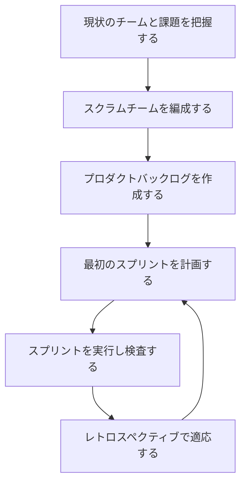
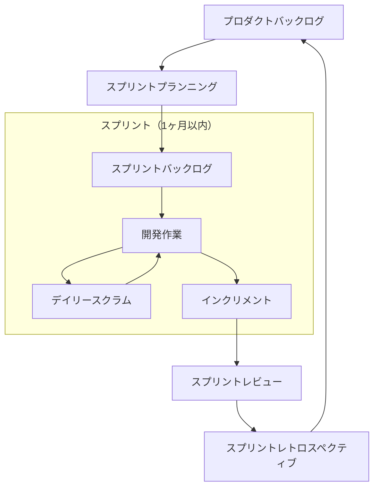
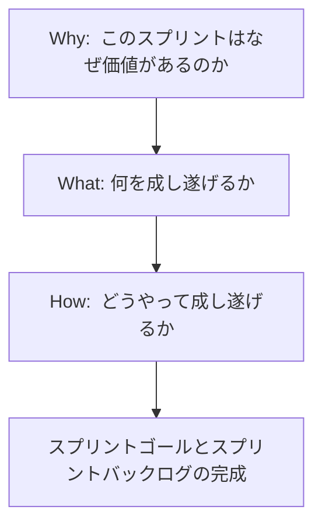
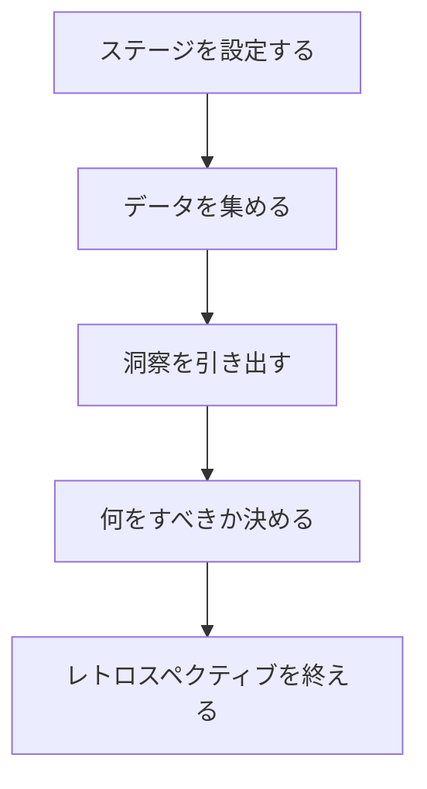
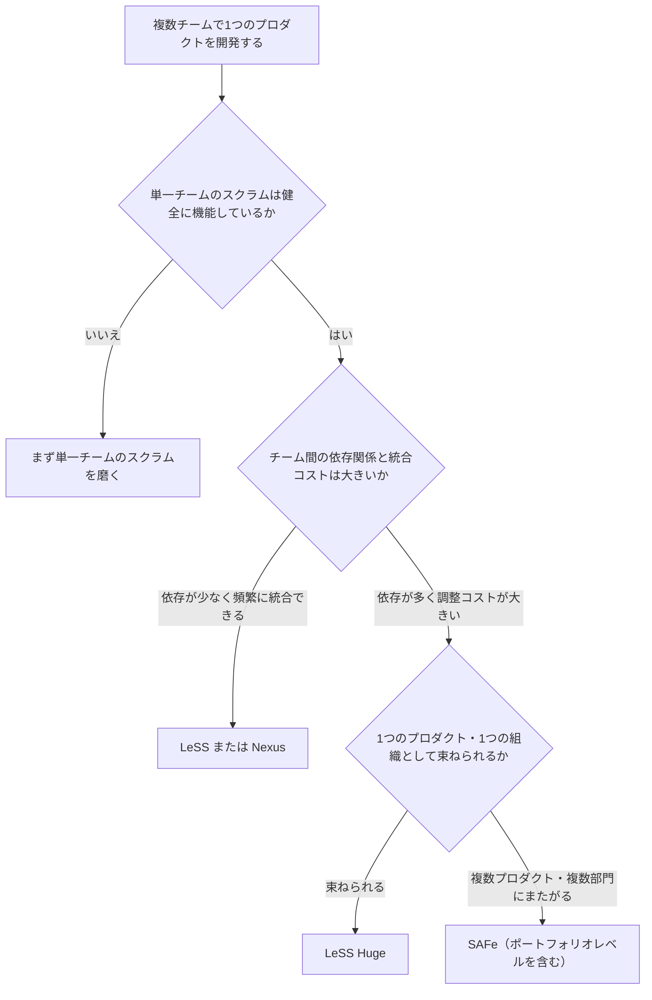

# スクラム実践者が知るべきベストプラクティス97 ― 初学者のための完全ガイド

> 本ガイドは、O'Reilly刊『[97 Things Every Scrum Practitioner Should Know](https://www.oreilly.com/library/view/97-things-every/9781492073833/)』（編：Gunther Verheyen）の章立て構成にインスピレーションを得て、スクラム初学者がゼロから実践できるように、公式Scrum Guideおよび国際的に著名な実践者たちの知見を基に書き下ろしたオリジナル解説書です。書籍本文の引用・複製は行わず、公開情報源への参照とともに独自の解説を提供します。

---

## 目次

1. [このガイドについて](#0)
2. [Part I. 始める・導入する・繰り返す（Start, Adopt, Repeat）](#1)
3. [Part II. プロダクトが価値を届ける（Products Deliver Value）](#2)
4. [Part III. コラボレーションこそが鍵（Collaboration Is Key）](#3)
5. [Part IV. 開発は多面的な仕事（Development Is Multi-faceted Work）](#4)
6. [Part V. イベントであってミーティングではない（Events, Not Meetings）](#5)
7. [Part VI. 熟達こそが重要（Mastery Does Matter）](#6)
8. [Part VII. 人はどこまでも人間である（People, All Too Human）](#7)
9. [Part VIII. 価値基準が行動を導く（Values Drive Behavior）](#8)
10. [Part IX. 組織デザイン（Organizational Design）](#9)
11. [Part X. 台本のないスクラム（Scrum Off Script）](#10)
12. [まとめ：実践チェックリスト](#11)
13. [参考文献・出典URL一覧](#12)

---

## 0. このガイドについて

### 0.1 なぜ「97」なのか

『97 Things Every Scrum Practitioner Should Know』は、世界中のスクラム実践者・トレーナー・コーチが持ち寄った短い知見（エッセイ）を10のパートに分類してまとめた書籍です。Gunther Verheyen氏（スクラムの共同考案者と直接仕事をしてきた著名なスクラム専門家）による刊行告知によれば、構成は次の10パートです。

| パート | テーマ（原題） | 収録エッセイ数（目安） |
|---|---|---|
| I | Start, Adopt, Repeat（始める・導入する・繰り返す） | 11 |
| II | Products Deliver Value（プロダクトが価値を届ける） | 11 |
| III | Collaboration Is Key（コラボレーションが鍵） | 10 |
| IV | Development Is Multi-faceted Work（開発は多面的な仕事） | 12 |
| V | Events, Not Meetings（イベントであってミーティングではない） | 10 |
| VI | Mastery Does Matter（熟達こそが重要） | 12 |
| VII | People, All Too Human（人はどこまでも人間である） | 8 |
| VIII | Values Drive Behavior（価値基準が行動を導く） | 6 |
| IX | Organizational Design（組織デザイン） | 9 |
| X | Scrum Off Script（台本のないスクラム） | 8 |

出典：[Gunther Verheyen氏によるブログ記事](https://guntherverheyen.com/2019/12/11/announcing-the-book-97-things-every-scrum-practitioner-should-know/)、[O'Reilly書誌情報](https://www.oreilly.com/library/view/97-things-every/9781492073833/)

本ガイドはこの10パート構成を「学習の地図」として採用し、各パートのテーマに沿って、初学者が迷わず実践できるように**公式のScrum Guide**および**国際的に著名な実践者の一次情報**を基にステップバイステップで解説していきます。

### 0.2 前提知識：Scrum Guideは今も2020年版が最新

2026年8月現在、スクラムの公式定義である「Scrum Guide」はKen SchwaberとJeff Sutherlandが2020年11月に発行した版が最新であり、新しい公式改訂版は発行されていません。Web上には「2026年版」を謳う記事も見られますが、それらの多くは常時更新されるブログ記事の公開日を指しているだけで、共同考案者による正式な改訂ではない点に注意してください。

出典：[scrumguides.org（公式サイト）](https://scrumguides.org/scrum-guide.html)、[Scrum Guide改訂履歴](https://scrumguides.org/revisions.html)、[PMTIによる2026年時点の解説記事](https://www.4pmti.com/learn/a-complete-guide-to-scrum-ceremonies/)

2020年版で導入された最大の変更点は、3つの成果物それぞれに「コミットメント」が紐づいた点です。この構造は本ガイド全体を貫く基本フレームなので、最初に押さえておきましょう。

| 成果物（Artifact） | 対応するコミットメント | 目的 |
|---|---|---|
| プロダクトバックログ | プロダクトゴール（Product Goal） | プロダクトが目指す将来の状態を示す |
| スプリントバックログ | スプリントゴール（Sprint Goal） | そのスプリントで達成したい単一の目的を示す |
| インクリメント | 完成の定義（Definition of Done） | 品質基準を満たしたと言える状態を示す |

出典：[Scrum Guide 2020 公式PDF（英語）](https://scrumguides.org/docs/scrumguide/v2020/2020-Scrum-Guide-US.pdf)、[Scrum.orgによる2020年改訂まとめ](https://www.scrum.org/scrum-guide-2020)

---

## 1. Part I. 始める・導入する・繰り返す（Start, Adopt, Repeat）

### 1.1 スクラムとは何か（3分で理解する）

Scrum Guideは、スクラムを次のように定義しています（要約・意訳）。スクラムは、複雑な問題に対して適応的な解決策を通じて価値を生み出すことを助ける、軽量なフレームワークです。それ自体は「やり方」を細かく規定するものではなく、経験的プロセス制御理論（Empiricism）に基づいて、**透明性（Transparency）・検査（Inspection）・適応（Adaptation）**という3つの柱の上に成り立っています。

出典：[The 2020 Scrum Guide（公式）](https://scrumguides.org/scrum-guide.html)

- **透明性**：進捗や課題が、意思決定に関わる人全員に見える状態にすること
- **検査**：作業や進捗を頻繁かつ注意深く確認し、望ましくない変化や問題を早期に発見すること
- **適応**：検査の結果、逸脱が許容範囲を超えていると判断したら、プロセスや対象物を速やかに調整すること

この3本柱がすべての土台であり、以降のイベントや作業もすべてここに立ち返って理解すると腑に落ちやすくなります。

### 1.2 スクラムチームの3つの役割（アカウンタビリティ）

2020年版Scrum Guideでは「役割（role）」ではなく「アカウンタビリティ（accountability＝説明責任）」という語が使われるようになりました。これは、単なる肩書きではなく「何に対して責任を持つか」を明確にするための変更です。

| アカウンタビリティ | 主な責任 |
|---|---|
| プロダクトオーナー | プロダクトの価値を最大化する。プロダクトバックログの管理に説明責任を持つ |
| スクラムマスター | スクラムチームおよび組織に対してスクラムの理解と実践を促す「奉仕するリーダー」 |
| 開発者（Developers） | インクリメントの各側面の作成にコミットする。スプリントバックログの計画、完成の定義の順守、日々の計画の適応、互いへの説明責任を担う |

出典：[Scrum Guide 2020 公式PDF](https://scrumguides.org/docs/scrumguide/v2020/2020-Scrum-Guide-US.pdf)

> 補足：かつては「開発チーム（Development Team）」という独立したサブチームの概念がありましたが、2020年版では廃止され、プロダクトオーナー・スクラムマスター・開発者が一つの「スクラムチーム」として自己管理（self-managing）する形に整理されました。自己管理とは、誰が・どのように・何に取り組むかをチーム自身が決めることを指します。

### 1.3 スクラムを導入するステップバイステップ

初めてスクラムを導入するチームは、次の順序で進めると迷いにくくなります。

**ステップ1：現状のチームと課題を把握する**
いきなりイベントを機械的に始めるのではなく、なぜスクラムを導入したいのか（リリース頻度を上げたい、手戻りを減らしたい、顧客フィードバックを早く得たいなど）を明確にします。目的を見失うと、後述する「形だけのスクラム」に陥りやすくなります。

**ステップ2：スクラムチームを編成する**
プロダクトオーナー・スクラムマスター・開発者を任命します。開発者は「機能横断型（cross-functional）」である必要があります。これは任意の推奨ではなく、各スプリントで価値あるインクリメントを生み出すために必要なスキルを、チーム全体として備えていなければならないという要件です。

**ステップ3：プロダクトバックログを作成する**
プロダクトゴールに向けて、やるべきことを一覧化し優先順位をつけます。最初から完璧である必要はなく、後述する「リファインメント」で継続的に磨いていきます。

**ステップ4：最初のスプリントを計画する**
1ヶ月以内の固定された期間（スプリント）を設定し、その期間で何を達成するかを計画します（詳細はPart V参照）。

**ステップ5：スプリントを実行し検査する**
デイリースクラムで日々進捗を検査し、必要に応じて計画を調整します。

**ステップ6：レトロスペクティブで適応する**
スプリントの終わりに、プロセス自体を振り返り、次のスプリントで試す改善策を1つ以上決めます。

このステップ4〜6を繰り返す（Repeat）ことこそがスクラムの本質です。1回のスプリントで完璧にしようとせず、「試して、検査して、適応する」というサイクルを回し続けることが重要です。

---

## 2. Part II. プロダクトが価値を届ける（Products Deliver Value）

### 2.1 プロダクトバックログの基本原則

プロダクトバックログは、プロダクトの改善に必要だと分かっているすべての情報を集めた**創発的で並び替え可能なリスト**です。重要なのは「並び替え可能」という点で、固定的な仕様書ではなく、市場や顧客理解の変化に応じて常に見直されるべきものです。

出典：[Scrum Guide 2020 公式PDF](https://scrumguides.org/docs/scrumguide/v2020/2020-Scrum-Guide-US.pdf)

### 2.2 プロダクトバックログリファインメント（Refinement）の進め方

リファインメントとは、プロダクトバックログの項目に詳細・見積り・並び順を付与する継続的な活動です。Mike Cohn（Mountain Goat Software創業者、Scrum Alliance共同創設者）は、リファインメントの目的について、確実性（certainty）を作ることではなく、次のスプリントプランニングに十分なだけの**自信（confidence）**を作ることだと説明しています。

出典：[Mountain Goat Software「Product Backlog Refinement: How Scrum Teams Do It Right」](https://www.mountaingoatsoftware.com/agile/user-stories/product-backlog-refinement)

**リファインメントのステップ：**

1. プロダクトバックログ上位の項目を選ぶ（直近1〜2スプリント分が目安）
2. 項目の目的・受け入れ条件をチームとプロダクトオーナーで対話しながら明確化する
3. 大きすぎる項目（エピック）は、独立してリリース可能な小さな単位に分割する
4. 必要に応じて相対的な見積り（ストーリーポイントなど）を付ける
5. 「十分に理解できた」と感じた時点でリファインメントを止める（過剰な作り込みをしない）

Mike Cohnは、チームがすべての未解決事項をリファインメントの場で解決しようとしてしまう傾向を指摘し、細部（ボタンの色が赤か青かなど）はスプリント中に決めればよいと述べています。

出典：[Agile Mentors Podcast #152（Mike Cohn出演回）](https://www.mountaingoatsoftware.com/agile/podcast/152-the-five-pillars-of-real-agile-improvement-with-mike-cohn)

### 2.3 ユーザーストーリーの書き方

ユーザーストーリーは要求を「誰が・何を・なぜ」の形式で捉える手法です。Mike Cohnは近年、"I can" や "I want to" のような表現よりも、より中立的な "I" から始まる表現への変化を指摘しており、ストーリーは仕様書ではなく**会話のきっかけ**であるべきだと強調しています。

出典：[Agile Mentors Podcast #86（ユーザーストーリー再考）](https://www.mountaingoatsoftware.com/agile/podcast/86-revisiting-user-stories-with-mike-cohn)

良いユーザーストーリーの目安（Bill Wakeが提唱し広く使われるINVEST基準）：

| 頭文字 | 意味 |
|---|---|
| I | Independent（独立している） |
| N | Negotiable（交渉可能である） |
| V | Valuable（価値がある） |
| E | Estimable（見積り可能である） |
| S | Small（小さい） |
| T | Testable（テスト可能である） |

### 2.4 プロダクトゴールという「北極星」

2020年版で導入された「プロダクトゴール」は、プロダクトの将来の状態を表す長期的な目標です。各スプリントは、このプロダクトゴールに向けた一歩でなければなりません。プロダクトバックログの個々の項目に一喜一憂するのではなく、常に「これはプロダクトゴールに近づいているか」を問い直す習慣が、価値あるプロダクト開発の鍵になります。

---

## 3. Part III. コラボレーションこそが鍵（Collaboration Is Key）

### 3.1 プロダクトオーナーと開発者の協働

かつてのスクラムでは、プロダクトオーナーと開発チームが分離した「二つのチーム」であるかのように振る舞われ、要求を「投げる／受け取る」という代理人的（proxy）で「私たち対彼ら」的な関係に陥る問題が指摘されてきました。2020年版Scrum Guideはこれを是正するため、プロダクトオーナー・スクラムマスター・開発者を単一のスクラムチームとして明確に位置づけています。

出典：[Scrum Guide改訂に関するInfoQインタビュー（Ken Schwaber, Jeff Sutherland）](https://www.infoq.com/articles/changes-2020-Scrum-guide/)

**実践のポイント：**

- プロダクトオーナーはスプリント期間中も開発者からの質問にすぐ答えられる状態を保つ（プロダクトオーナーの不在は最も典型的なアンチパターンの一つです。詳細はPart Xで解説します）
- 開発者はプロダクトオーナーに「作業リストの実行者」としてではなく、共にプロダクトの成功を目指す対等なパートナーとして関わる
- 意思決定の場（リファインメント、プランニング、レビュー）には可能な限り双方が参加する

### 3.2 ステークホルダーとの関わり方

スプリントレビューは単なる進捗報告会ではなく、ステークホルダーからのフィードバックを次のプロダクトバックログに反映させるための協働セッションです。Zombie Scrum Survival Guideの著者であるChristiaan Verwijs（The Liberators共同創業者、Professional Scrum Trainer）らは、健全なスクラムチームが外部との接触を積極的に求めるのに対し、機能不全に陥ったチームは外の世界との接触を避けたがる傾向があると指摘しています（詳しくはPart Xで解説）。

出典：[The Rise Of Zombie Scrum（Christiaan Verwijs）](https://medium.com/the-liberators/the-rise-of-zombie-scrum-cd98741015d5)

### 3.3 機能横断型チームであることの意味

機能横断型チームとは、プロダクトの完成に必要なすべてのスキル（設計・実装・テスト・場合によっては運用）をチーム内に持つチームです。特定のスキルを持つ人が一人しかいない「知識のサイロ化」は、その人が不在になった瞬間にボトルネックとなります。ペアプログラミングやモブプログラミングによる知識共有は、この問題を緩和する実践としてXP（エクストリーム・プログラミング）由来の技法がしばしば取り入れられます。

---

## 4. Part IV. 開発は多面的な仕事（Development Is Multi-faceted Work）

### 4.1 「Flaccid Scrum（軟弱なスクラム）」という警鐘

ソフトウェア開発の世界で最も影響力のある技術者の一人であるMartin Fowler（ThoughtWorks創業者、"Refactoring"や多くの技術書の著者）は、2009年のブログ記事で「Flaccid Scrum（軟弱なスクラム）」という言葉を提唱しました。これは、チームがスクラムの語彙（スプリント、プロダクトオーナー、ストーリーポイントなど）を使いながらも、内部の技術的品質（コードの保守性、テストの充実度など）への注意を怠った結果、開発速度が徐々に低下していく現象を指します。

出典：[Martin Fowler "FlaccidScrum"（原文）](https://martinfowler.com/bliki/FlaccidScrum.html)

Fowlerはこの現象について、技術的負債を抱えたチームは新機能追加が徐々に困難になり、いわば「膝から崩れ落ちる」ように生産性が低下すると説明しています。この問題は、スクラム自体が「何を作るか（What）」には強い指針を持つ一方で「どう作るか（How）」については意図的に規定していないことに起因します。

出典：[Scrum.orgによる背景解説](https://www.scrum.org/about/)、[Simple Threadによる技術的負債の解説](https://www.simplethread.com/scrum-anti-patterns/)

### 4.2 技術的卓越性を支える実践

Flaccid Scrumを避けるために広く推奨される技術プラクティス（多くはXP由来）：

| プラクティス | 目的 |
|---|---|
| テスト駆動開発（TDD） | 設計の健全性を保ちながら、リグレッションを防ぐ |
| 継続的インテグレーション（CI） | 統合の問題を早期に、頻繁に発見する |
| リファクタリング | コードの外部挙動を変えずに内部構造を改善し続ける |
| ペア/モブプログラミング | 知識の属人化を防ぎ、コードレビューを常時行う |
| シンプルな設計 | 将来の変更コストを低く保つ |

Robert C. Martin（"Uncle Bob"、"Clean Code"や"Clean Agile"の著者）も、アジャイルムーブメントがプロジェクトマネジメント面ばかりに焦点を当て、プログラマー向けの規律（クラフトマンシップ）を置き去りにしてしまったことに繰り返し警鐘を鳴らしています。

出典：[Uncle Bob "The Tragedy of Craftsmanship"](https://blog.cleancoder.com/uncle-bob/2018/08/28/CraftsmanshipMovement.html)

### 4.3 完成の定義（Definition of Done）を段階的に強化する

「完成の定義」は、インクリメントがプロダクトに追加されるために満たすべき品質基準の正式な記述です。組織標準がある場合はそれを最低限として、チームはより厳格な完成の定義を自ら追加できます。Zombie Scrum Survival Guideの著者らは、不健全なチームほど「完成の定義」を技術的な最小限（例：「バージョン管理にコミット済み」）にとどめてしまい、実際にユーザーやデータ、本番環境に触れる機会が少なくなる結果、フィードバックの学びが乏しくなると指摘しています。

出典：[The Rise Of Zombie Scrum](https://medium.com/the-liberators/the-rise-of-zombie-scrum-cd98741015d5)

**完成の定義を強化するステップ：**

1. 現在の完成の定義を書き出す（暗黙のルールになっていないか確認する）
2. 「本当に完成と言えるか？」を定期的にレトロスペクティブで問い直す
3. テスト自動化やコードレビューなど、抜けている品質基準を1つずつ追加する
4. 「本番同等の環境で動作確認済み」など、ユーザーへの実際の到達度に近づける項目を目指す

---

## 5. Part V. イベントであってミーティングではない（Events, Not Meetings）

スクラムには、スプリント自体を含めて5つのイベントがあります。これらは単なる「会議」ではなく、透明性・検査・適応を実践するための構造化された機会です。

### 5.1 スプリント（Sprint）

すべてのイベントを内包する「コンテナ」で、最大1ヶ月の固定期間です。期間を固定することで、検査と適応のリズム（ケイデンス）が生まれます。スプリントの途中でゴールを危うくするような変更は避けるべきとされています。スプリントを中止できるのはプロダクトオーナーだけであり、しかも中止できるのはスプリントゴールが陳腐化した（意味を失った）場合に限られます（ただしこれは稀なケースとして扱われます）。

### 5.2 スプリントプランニング（Sprint Planning）

2020年版Scrum Guideは、スプリントプランニングで扱うべき3つのトピック（Why・What・How）を明確化しました。

- **Why（なぜ）**：このスプリントがプロダクトにとってなぜ価値があるのかを議論し、スプリントゴールを策定する
- **What（何を）**：プロダクトオーナーとの対話を通じて、プロダクトバックログのどの項目をスプリントに含めるかを選ぶ
- **How（どうやって）**：選んだ項目をどのように「完成」まで持っていくかを開発者が計画する

**見積りとプランニングの進め方（Mike Cohn流）：**

Mike Cohnは、チームのベロシティ（過去の実績）だけを基準に機械的に項目を積み上げる「ベロシティ駆動プランニング」よりも、1項目ずつタスクを大まかに洗い出しながら「これでスプリントが一杯になった」と感じるまで積み上げていく**コミットメント駆動（近年は容量駆動＝capacity-driven とも呼ばれる）プランニング**を好むと述べています。理由は、ベロシティはスプリントごとの変動が大きく、短期の計画には不向きだからです。

出典：[InfoQ「Velocity-Driven Versus Commitment-Driven Sprint Planning」](https://www.infoq.com/news/2014/11/sprint-planning)、[Mountain Goat Softwareブログ](https://www.mountaingoatsoftware.com/blog/dont-estimate-the-sprint-backlog-using-task-points)

### 5.3 デイリースクラム（Daily Scrum）

開発者向けの15分のイベントで、スプリントゴールに向けた進捗を検査し、翌24時間の計画を適応させます。2020年版では「昨日やったこと・今日やること・障害物は何か」という3つの定型質問が公式には削除され、チームが自分たちに合った形式（ボードを見ながらのウォークスルーなど）を選べるようになりました。

**ステップバイステップ：**

1. 毎日同じ時刻・同じ場所（オンラインなら同じURL）で実施し、習慣化する
2. スプリントゴールを起点に「ゴール達成に近づいているか」を議論する（タスク消化の報告会にしない）
3. 詳細な問題解決はデイリースクラムの外で、関係者だけで行う
4. 15分を超えそうな話題は「あとで」に回す

### 5.4 スプリントレビュー（Sprint Review）

スプリントの成果を検査し、プロダクトバックログを適応させるための、ステークホルダーを交えたワーキングセッションです。単なるデモではなく、フィードバックを次の計画に反映させる対話の場である点が重要です。

### 5.5 スプリントレトロスペクティブ（Sprint Retrospective）

チーム自身の働き方（人・関係・プロセス・ツール）を検査し、次のスプリントに向けた改善計画を立てるイベントです。興味深いことに、レトロスペクティブは元々スクラムの最初期の定義には含まれておらず、Norm Kerth、そして後にEsther DerbyとDiana Larsenの仕事の影響を受けて、正式なイベントとして組み込まれた経緯があります。

出典：[The Professional ScrumMaster's Handbook（O'Reilly）](https://www.oreilly.com/library/view/the-professional-scrummasters/9781849688024/ch05s02.html)

Esther DerbyとDiana Larsenの著書『Agile Retrospectives』は、レトロスペクティブの標準的な進め方として、次の5段階モデルを確立しました。

| フェーズ | やること |
|---|---|
| ① ステージを設定する | 心理的安全を確保し、全員が「今ここ」に意識を向けられるようにする |
| ② データを集める | 何が起きたかについて、チーム全員が同じ事実認識を持てるようにする |
| ③ 洞察を引き出す | なぜそれが起きたのか、パターンや根本原因を分析する |
| ④ 何をすべきか決める | 次のスプリントで試す、具体的で実行可能な改善策を選ぶ |
| ⑤ レトロスペクティブを終える | 学びを振り返り、次回に向けて締めくくる |

出典：[Lucid「Sprint Retrospective Meetings」](https://lucid.co/all-access-agile/sprint-retrospective-meetings)、[Agile Retrospectives, Second Edition（Pragmatic Bookshelf）](https://pragprog.com/titles/dlret2/agile-retrospectives-second-edition/)

**プライムディレクティブ（Norm Kerth）：**
レトロスペクティブの冒頭で読み上げることが推奨される宣言文で、「何が判明しようとも、私たちは、その時に知り得た情報、持っていたスキルと能力、利用可能なリソース、そして当時の状況を踏まえて、誰もが最善を尽くしたということを、心から理解し信じる」という考え方を共有し、犯人探しではなく学習に焦点を当てる場を作ります。

出典：[InfoQ「Questioning the Retrospective Prime Directive」](https://www.infoq.com/articles/retrospective-prime-directive)

**心理的安全性についてのEsther Derbyの言葉（意訳）：**
Esther Derbyは、心理的安全性とは常に快適でいられることではなく、居心地の悪いことについても率直に話せる状態を指す、と説明しています。

出典：[What is Scrum「Mastering the Sprint Retrospective」](https://www.whatisscrum.org/mastering-the-sprint-retrospective-for-continuous-team-improvement/)

**代表的なレトロスペクティブの手法：**

| 手法名 | 向いている場面 |
|---|---|
| Start / Stop / Continue | 初めてのチーム、シンプルに始めたい場合 |
| Mad / Sad / Glad | チームの感情や士気を可視化したい場合 |
| Sailboat（帆船） | 目標に対する追い風・向かい風を議論したい場合 |
| 4Ls（Liked / Learned / Lacked / Longed for） | より深い振り返りをしたい成熟したチーム |

出典：[Retrium「10 Retrospective techniques」](https://www.retrium.com/blog/10-retrospective-techniques-to-try-with-your-agile-team)

---

## 6. Part VI. 熟達こそが重要（Mastery Does Matter）

### 6.1 ストーリーポイントによる見積り

ストーリーポイントは、時間ではなく**相対的な労力（effort）**を表す単位です。Mike Cohnはストーリーポイントが単一の要素ではなく、複数の要素を統合した見積りであると説明しています。

| 要素 | 内容 |
|---|---|
| 複雑さ（Complexity） | 作業の難易度。思考の量、試行錯誤の必要性 |
| リスク・不確実性（Risk/Uncertainty） | 問題が発生する可能性とその影響の大きさ |
| 作業量（Amount of Work） | やるべきことの量。同種の作業でも、量が増えれば見積りは大きくなる |

出典：[Mountain Goat Software「What Are Story Points and Why Do We Use Them?」](https://www.mountaingoatsoftware.com/agile/what-are-story-points)

**見積りの実務ステップ（プランニングポーカー）：**

1. プロダクトオーナーが対象の項目を簡潔に説明する
2. チーム全員が同時に（他者に影響されないよう）カードで見積りを提示する
3. 見積りが大きく割れた場合、最も高い/低い見積りを出した人がその理由を説明する
4. 議論の後、再度見積りを行い、合意形成を図る
5. 大きすぎる項目（目安として13ポイント以上など）は分割を検討する

Mike Cohnは、見積りを「バケット（範囲）」として捉え、境界値に近い場合は切り上げる方が、結果的に納期予測の精度が上がると説明しています。例えば10ポイントちょうどだと感じる項目でも13ポイントのバケットに切り上げることで、後から分割した際の合計値のズレを吸収しやすくなるためです。

出典：[Mountain Goat Software「Story Point Estimates: For Accuracy, Use Ranges & Round Up」](https://www.mountaingoatsoftware.com/blog/story-point-estimates-are-best-thought-of-as-ranges)

### 6.2 スクラムマスターの熟達：奉仕するリーダーシップ

2020年版Scrum Guideは、スクラムマスターを「奉仕するリーダー（真のリーダーであり、かつチームに奉仕する存在）」と再定義しました。Jeff Sutherlandは、この語順の変更（「奉仕するリーダー」であって「リーダーである奉仕者」ではない）によって、指示せずに導けない、あるいは責任を取らない「奉仕するふりをしたリーダー」の問題に対応しようとしたと述べています。

出典：[InfoQ「Changes in the 2020 Scrum Guide」](https://www.infoq.com/articles/changes-2020-Scrum-guide/)

スクラムマスターがチームに対して果たす役割は、大きく次の3つに整理できます。

| 対象 | スクラムマスターの働きかけ |
|---|---|
| スクラムチーム | コーチング、ファシリテーション、障害物の除去 |
| プロダクトオーナー | 効果的なプロダクトバックログ管理の技法を伝える |
| 組織全体 | スクラムの理解を広め、組織的な障壁を取り除くための変革をリードする |

### 6.3 継続的な学習の姿勢

熟達は一度きりの資格取得では得られません。Mike Cohnは、原則と判断力を重視した学習を提唱しており、チームが「なぜこの手法を使うのか」を理解していれば、優先順位が変わったり想定より難易度が高かったりステークホルダー間で意見が割れたりといった、教科書通りにいかない状況でも自分たちで判断できるようになると述べています。

出典：[Mike Cohnのプロフィールページ](https://www.mountaingoatsoftware.com/about/mike-cohn)

---

## 7. Part VII. 人はどこまでも人間である（People, All Too Human）

### 7.1 心理的安全性はなぜ重要か

心理的安全性が欠けたチームでは、率直なフィードバックが失われ、レトロスペクティブが形骸化し、問題の早期発見も難しくなります。前述のプライムディレクティブは、この心理的安全性を作るための具体的な仕掛けの一つです。フィードバックを伝える際は、評価ではなく観察に基づいた「私」を主語にした表現（「Xが起きたとき、Yという結果になり、私はZと感じた」という形式）が推奨されます。

出典：[Lucid「Sprint Retrospective Meetings」](https://lucid.co/all-access-agile/sprint-retrospective-meetings)

### 7.2 チームのダイナミクスとコンフリクト

自己管理型のチームでは、意見の相違が起きるのは自然なことであり、それ自体は問題ではありません。問題は、対立が建設的な議論に発展せず、個人攻撃や沈黙に転じてしまうことです。スクラムマスターは、対立を無理に消そうとするのではなく、健全に表面化させ、チームの合意形成につなげるファシリテーションが求められます。

### 7.3 自己管理型チームを「本物」にする

Zombie Scrum Survival Guideの著者らは、自己管理を形だけのものにせず本物にするためには、チームが「誰が・どのように・何に取り組むか」を実際に決められる権限と、それに伴う責任の両方を持つ必要があると論じています。権限だけを与えて支援体制がなければチームは孤立し、逆に細かく管理され続ければ自己管理は名目だけのものになります。

出典：[Zombie Scrum Survival Guide 書籍情報（Scrum.org）](https://www.scrum.org/resources/zombie-scrum-survival-guide-0)

---

## 8. Part VIII. 価値基準が行動を導く（Values Drive Behavior）

Scrum Guideは、スクラムが機能するために必要な5つの価値基準を定めています。これらはスキルや手法ではなく、日々の意思決定を導く「心構え」です。

| 価値基準 | 意味 |
|---|---|
| コミットメント（Commitment） | ゴールの達成に向けて自らを律すること |
| 集中（Focus） | スプリントの作業とゴールに意識を集中すること |
| 公開（Openness） | 作業や課題について、チームとステークホルダーに対しオープンであること |
| 尊重（Respect） | スクラムチームメンバーが互いを能力ある独立した個人として尊重すること |
| 勇気（Courage） | 正しいことをする勇気、困難な問題に取り組む勇気を持つこと |

出典：[Scrum Guide 2020 公式PDF](https://scrumguides.org/docs/scrumguide/v2020/2020-Scrum-Guide-US.pdf)

**実践のヒント：**

- これらの価値基準は、透明性・検査・適応という3本柱を支える土台です。例えば「公開」がなければ「透明性」は成立しません
- チームの働き方に関する合意（ワーキングアグリーメント）を作る際、この5つの価値基準を具体的な行動レベルに翻訳すると効果的です（例：「集中」→「スプリント中は新しい割り込み作業を安易に受けない」）
- レトロスペクティブで「今スプリント、どの価値基準が最も守れていたか／守れていなかったか」を振り返る問いかけも有効です

---

## 9. Part IX. 組織デザイン（Organizational Design）

### 9.1 いつスケーリングを検討すべきか

チームが1つで収まっている間は、スケーリングフレームワークを導入する必要はありません。複数チームが1つのプロダクトに関わるようになって初めて、スケーリングの検討が意味を持ちます。専門家の間では、スケーリングは組織の機能不全を解決する魔法の杖ではなく、まず個々のチームレベルでスクラムが健全に機能していることが前提条件だという指摘が一致しています。

出典：[Rockmere Partners「SAFe vs LeSS vs Nexus: An Honest Practitioner Comparison」](https://rockmerepartners.com/resources/safe-vs-less-vs-nexus/)

各フレームワークが示すチーム数（LeSS は2〜8チーム、LeSS Huge や SAFe は8チーム以上など）は、
あくまで適用範囲の目安であり、チーム数だけでフレームワークが自動的に決まる境界ではありません。
実際の選択で効いてくるのは、チーム間の依存関係の多さ、統合にかかるコスト、
プロダクトが1つのバックログで束ねられる構造かどうか、
そして組織構造が単一プロダクトとして意思決定できる形になっているか、といった条件です。

### 9.2 代表的なスケーリングフレームワークの比較

| フレームワーク | 発案者・提供元 | 主な適用範囲 | 特徴 |
|---|---|---|---|
| LeSS（Large-Scale Scrum） | Craig Larman, Bas Vodde | 2〜8チーム（LeSS Huge は8チーム以上） | 新しい役割やイベントをほぼ追加せず、単一のプロダクトバックログ・単一のプロダクトオーナーのまま「デスケール（組織の複雑さを減らす）」する思想 |
| Nexus | Ken Schwaber / Scrum.org | 3〜9チーム | Scrumの構造に「Nexus統合チーム」を追加し、チーム間の依存関係と統合に焦点を当てる、比較的軽量な拡張 |
| SAFe（Scaled Agile Framework） | Scaled Agile, Inc. | 数十〜数百人規模 | Agile Release Train、PIプランニングなど、企業レベルの調整を目的とした体系的で規定色の強いフレームワーク |
| Scrum@Scale | Jeff Sutherland | 中〜大規模 | 「スクラム・オブ・スクラム」の考え方で、プロセス（スクラムマスターサイクル）とプロダクト（プロダクトオーナーサイクル）を独立してスケールさせる |

出典：[Toptal「5 Agile Scaling Frameworks Compared」](https://www.toptal.com/project-managers/agile/agile-scaling-frameworks-compared)、[monday.com「Large Scale Scrum (LeSS): the complete guide」](https://monday.com/blog/rnd/large-scale-scrum/)、[Rockmere Partners比較記事](https://rockmerepartners.com/resources/safe-vs-less-vs-nexus/)、[Scrum.org「Comparing Nexus and SAFe」](https://www.scrum.org/resources/blog/comparing-nexus-and-safe-similarities-differences-potential-synergies)

**選択の指針：**

- 技術的な統合（複数チームの成果物を1つに結合すること）が最大の課題であれば、Nexusのように統合に焦点を当てたフレームワークが直接的に役立ちます
- 組織のサイロ化や部門間の壁が課題であれば、LeSSのようにチーム構造そのものを見直すアプローチが根本原因に効きます
- 数十〜数百人規模で、経営層の強いスポンサーシップと、段階的な導入に十分な期間を確保できるなら、体系的なガイドを提供するSAFeが選択肢になります
- 逆に、単に「もっと構造が欲しい」という理由だけでスケーリングフレームワークを導入すると、組織の政治的・構造的な問題を隠すだけの「シアター（見せかけの改善）」になりがちだという警鐘も、複数の実践者から共通して発せられています

出典：[Rockmere Partners「SAFe vs LeSS vs Nexus」](https://rockmerepartners.com/resources/safe-vs-less-vs-nexus/)

### 9.3 組織構造がチームに与える影響

Nexus・LeSSの双方に共通する前提として、Craig Larman（LeSS考案者）は、スケーリングを機能させるにはすべてのチームが機能横断型・自己組織化されたスクラムチームとして構成され、要求を独立してデプロイ可能な最小単位に垂直分割できていることが必要だと述べています。組織構造（誰が誰に報告するか、チームがどう分かれているか）を変えずに新しいフレームワークの用語だけを導入しても、実質的な変化は起きにくいという点は、多くの実践者が共通して指摘するところです。

出典：[Visual Paradigm「Comparison of Scaling Agile Frameworks」](https://www.visual-paradigm.com/scrum/scaling-agile-frameworks-comparison/)

---

## 10. Part X. 台本のないスクラム（Scrum Off Script）

理論通りにいかないのが現場の常です。ここでは、国際的に広く共有されている代表的なアンチパターンと、2026年時点で議論が活発なAIとスクラムの関係を取り上げます。

### 10.1 代表的なアンチパターン一覧

| アンチパターン | 提唱者・出典 | 症状 | 対処の方向性 |
|---|---|---|---|
| Flaccid Scrum（軟弱なスクラム） | Martin Fowler | スクラムの語彙は使うが技術的卓越性を欠き、徐々に生産性が低下する | XP由来の技術プラクティス（TDD、CI、リファクタリング等）を導入する |
| Zombie Scrum（ゾンビスクラム） | Christiaan Verwijs, Johannes Schartau, Barry Overeem | 表面上はイベントを実施しているが「鼓動する心臓」がない。外部との接触を避け、狭い完成の定義にとどまり、継続的改善が形骸化する | ステークホルダーとの接点を増やす、完成の定義を段階的に強化する、実験ベースの小さな改善を積み重ねる |
| ScrumBut（スクラムバット） | コミュニティ共通の用語 | 「スクラムをやっているが、この部分だけは省略している」という言い訳が常態化する | なぜその部分を省略しているのか根本原因を可視化し、段階的に是正する |
| Dark Scrum（ダークスクラム） | Ron Jeffries | 技術スキルを欠いたままスクラムの管理面だけが運用され、約束された成果が出せない状態が続く | 開発者のトレーニングと技術的熟達に投資する |

出典：[Martin Fowler "FlaccidScrum"](https://martinfowler.com/bliki/FlaccidScrum.html)、[Zombie Scrum公式サイト](https://www.zombiescrum.org/)、[Ron Jeffries "Down on Scrum"](https://ronjeffries.com/articles/020-01ff/down-on-scrum/)、[TeachingAgile「ScrumBut & Flaccid Scrum」](https://teachingagile.com/scrum/articles/scrumbut-flaccid)

### 10.2 Zombie Scrumの4つの症状（詳細）

Zombie Scrum Survival Guideは、症状を4つの領域に整理しています。

| 領域 | 不健全な状態の例 |
|---|---|
| ステークホルダーが求めるものを作る | 外部との接触を避け、フィードバックを取りに行かない |
| 速く届ける | 「完成」の基準が技術的な最小限にとどまり、実際のユーザーに届く頻度が低い |
| 継続的に改善する | レトロスペクティブが儀式化し、実際の行動変化につながらない |
| チームの自律性 | チームが「歯車の一つ」として振る舞い、変化を起こす主体性を持てない |

出典：[The Four Symptoms of Zombie Scrum](https://medium.com/the-liberators/the-four-symptoms-of-zombie-scrum-f107f2e86b3f)

### 10.3 2026年の視点：AIとスクラムマスターの役割

2026年に入り、Scrum.orgは、AI活用を前提としたスクラムマスター向けの新研修「Professional Scrum Master - AI Essentials」を発表しました（同社CEOのDave Westもこの取り組みについて述べています）。この研修は、AIを実践的・倫理的に活用して事務的・反復的なタスク（レポート作成、ボード更新、議事録作成など）を支援・効率化する一方で、コーチング・コンフリクト解消・チームダイナミクスの調整といった、人間の判断力が必要な領域は引き続き重要であるという立場を取っています。

出典：[Scrum.org「Scrum.org Launches New AI Training for Scrum Masters」](https://www.scrum.org/resources/scrumorg-launches-new-ai-training-scrum-masters)

Dave Westは2026年6月開催の Online Scrum Master Summit 2026 の基調セッション「AI Catalyst: The Scrum Master's New Role」で、AIとの関わり方を段階的なモード（例えば、個人の生産性を高めるためにAIを使う段階から、AIを含めたチーム全体のワークフローをオーケストレーションする段階まで）として整理しています。

出典：[Online Scrum Master Summit 2026（公式イベントページ）](https://onlinescrummastersummit.com/)

**実践上の注意点（2026年時点での共通見解）：**

- AIはスプリントの「儀式」の目的自体を変えるものではなく、その儀式に伴う摩擦（事務作業）を減らすものだと捉えるのが実践的です
- レトロスペクティブのフィードバックは機微な情報を含むため、AIツールにデータを渡す際はプライバシーとデータの取り扱いを確認する必要があります
- ジュニアメンバーがAIに頼りすぎて自ら試行錯誤する経験を積まなくなると、チームの将来的な実力が見えないところで損なわれるリスクが指摘されています

出典：[TeamRetro「AI in Agile Project Management in 2026」](https://www.teamretro.com/blog/ai-agile-project-management/)

たとえばAgilemaniaの論考では、「スクラムマスターという役割がAIに置き換えられるか」という問いよりも、「スクラムマスターが担う仕事の中身が事務的なファシリテーションから、人間同士の複雑な調整・コーチング・組織変革のリードへとシフトしていく」という見方が示されています。

出典：[Agilemania「Is the Scrum Master Role Dying in 2026?」](https://agilemania.com/is-the-scrum-master-role-dying)

---

## 11. まとめ：実践チェックリスト

初学者が最初の数スプリントで確認すべき項目をまとめました。

- [ ] スクラムチームの3つのアカウンタビリティ（プロダクトオーナー・スクラムマスター・開発者）が明確に割り当てられている
- [ ] プロダクトゴール・スプリントゴール・完成の定義の3つのコミットメントを言語化できる
- [ ] プロダクトバックログが定期的にリファインメントされ、上位項目は次のスプリントに着手できる粒度になっている
- [ ] スプリントプランニングでWhy・What・Howの3つを扱えている
- [ ] デイリースクラムがタスク報告会ではなく、スプリントゴールに向けた計画の適応の場になっている
- [ ] スプリントレビューでステークホルダーからの実質的なフィードバックを得て、プロダクトバックログに反映している
- [ ] レトロスペクティブでプライムディレクティブを共有し、5段階のプロセス（ステージ設定→データ収集→洞察→決定→終了）を踏んでいる
- [ ] チームが技術的卓越性（テスト自動化、CI、リファクタリングなど）に投資し、Flaccid Scrumの兆候がないか定期的に確認している
- [ ] 完成の定義が「技術的に完了」ではなく「実際にユーザーへ価値が届く状態」に近づくよう段階的に強化されている
- [ ] 5つの価値基準（コミットメント・集中・公開・尊重・勇気）が、チームの日々の行動として具体化されている
- [ ] スケーリングを検討する前に、単一チームレベルでスクラムが健全に機能しているかを確認している
- [ ] AIツールを使う場合、事務作業の効率化にとどめ、人間による判断・コーチング・合意形成を置き換えていないか意識している

---

## 12. 参考文献・出典URL一覧

本ガイドの作成にあたり参照した一次情報・国際的に著名な実践者による情報源です（2026年8月18日時点でのアクセス確認済み）。

**書籍・書誌情報**
- Verheyen, G. (編). *97 Things Every Scrum Practitioner Should Know*, O'Reilly Media. https://www.oreilly.com/library/view/97-things-every/9781492073833/
- Gunther Verheyen「刊行告知ブログ（10パート構成の出典）」 https://guntherverheyen.com/2019/12/11/announcing-the-book-97-things-every-scrum-practitioner-should-know/

**公式Scrum Guide**
- Scrum Guide（公式・2020年11月版） https://scrumguides.org/scrum-guide.html
- Scrum Guide 2020 公式PDF（米国版） https://scrumguides.org/docs/scrumguide/v2020/2020-Scrum-Guide-US.pdf
- Scrum Guide改訂履歴 https://scrumguides.org/revisions.html
- Scrum.org「2020年版Scrum Guideアップデート特集」 https://www.scrum.org/scrum-guide-2020
- PMTI「The Complete Scrum Guide: ...What's Actually New in 2026」 https://www.4pmti.com/learn/a-complete-guide-to-scrum-ceremonies/
- InfoQ「Changes in the 2020 Scrum Guide: Q&A with Ken Schwaber and Jeff Sutherland」 https://www.infoq.com/articles/changes-2020-Scrum-guide/

**技術的卓越性・Flaccid Scrum（Martin Fowler ほか）**
- Martin Fowler "FlaccidScrum" https://martinfowler.com/bliki/FlaccidScrum.html
- Scrum.org「About Scrum.org」（Flaccid Scrumの経緯） https://www.scrum.org/about/
- Simple Thread「Scrum Anti-Patterns」 https://www.simplethread.com/scrum-anti-patterns/
- Uncle Bob（Robert C. Martin）「The Tragedy of Craftsmanship」 https://blog.cleancoder.com/uncle-bob/2018/08/28/CraftsmanshipMovement.html
- Ron Jeffries「Down on Scrum」 https://ronjeffries.com/articles/020-01ff/down-on-scrum/
- TeachingAgile「ScrumBut & Flaccid Scrum: Common Agile Pitfalls to Avoid」 https://teachingagile.com/scrum/articles/scrumbut-flaccid

**見積り・プランニング（Mike Cohn / Mountain Goat Software）**
- Mountain Goat Software「What Are Story Points and Why Do We Use Them?」 https://www.mountaingoatsoftware.com/agile/what-are-story-points
- Mountain Goat Software「Story Point Estimates: For Accuracy, Use Ranges & Round Up」 https://www.mountaingoatsoftware.com/blog/story-point-estimates-are-best-thought-of-as-ranges
- Mountain Goat Software「Don't Estimate the Sprint Backlog Using Task Points」 https://www.mountaingoatsoftware.com/blog/dont-estimate-the-sprint-backlog-using-task-points
- InfoQ「Velocity-Driven Versus Commitment-Driven Sprint Planning」 https://www.infoq.com/news/2014/11/sprint-planning
- Agile Mentors Podcast #152「The Five Pillars of Real Agile Improvement with Mike Cohn」 https://www.mountaingoatsoftware.com/agile/podcast/152-the-five-pillars-of-real-agile-improvement-with-mike-cohn
- Agile Mentors Podcast #86「Revisiting User Stories with Mike Cohn」 https://www.mountaingoatsoftware.com/agile/podcast/86-revisiting-user-stories-with-mike-cohn
- Mike Cohn プロフィール（Mountain Goat Software） https://www.mountaingoatsoftware.com/about/mike-cohn

**レトロスペクティブ（Esther Derby / Diana Larsen / Norm Kerth）**
- Lucid「Sprint Retrospective Meetings」 https://lucid.co/all-access-agile/sprint-retrospective-meetings
- What is Scrum「Mastering the Sprint Retrospective for Continuous Team Improvement」 https://www.whatisscrum.org/mastering-the-sprint-retrospective-for-continuous-team-improvement/
- Pragmatic Bookshelf「Agile Retrospectives, Second Edition」（Esther Derby, Diana Larsen, David Horowitz） https://pragprog.com/titles/dlret2/agile-retrospectives-second-edition/
- InfoQ「Questioning the Retrospective Prime Directive」 https://www.infoq.com/articles/retrospective-prime-directive
- Retrium「10 Retrospective techniques to try with your agile team」 https://www.retrium.com/blog/10-retrospective-techniques-to-try-with-your-agile-team
- O'Reilly「The Professional ScrumMaster's Handbook」（レトロスペクティブの歴史的経緯） https://www.oreilly.com/library/view/the-professional-scrummasters/9781849688024/ch05s02.html

**Zombie Scrum（Christiaan Verwijs / Johannes Schartau / Barry Overeem）**
- Zombie Scrum公式サイト https://www.zombiescrum.org/
- Christiaan Verwijs「The Rise Of Zombie Scrum」 https://medium.com/the-liberators/the-rise-of-zombie-scrum-cd98741015d5
- The Liberators「The Four Symptoms of Zombie Scrum」 https://medium.com/the-liberators/the-four-symptoms-of-zombie-scrum-f107f2e86b3f
- Scrum.org「Zombie Scrum Survival Guide」書籍紹介 https://www.scrum.org/resources/zombie-scrum-survival-guide-0

**組織デザイン・スケーリング**
- Rockmere Partners「SAFe vs LeSS vs Nexus: An Honest Practitioner Comparison (2026)」 https://rockmerepartners.com/resources/safe-vs-less-vs-nexus/
- monday.com「Large Scale Scrum (LeSS): the complete guide for 2026」 https://monday.com/blog/rnd/large-scale-scrum/
- Toptal「5 Agile Scaling Frameworks Compared」 https://www.toptal.com/project-managers/agile/agile-scaling-frameworks-compared
- Scrum.org「Comparing Nexus and SAFe」 https://www.scrum.org/resources/blog/comparing-nexus-and-safe-similarities-differences-potential-synergies
- Visual Paradigm「Comparison of Scaling Agile Frameworks」 https://www.visual-paradigm.com/scrum/scaling-agile-frameworks-comparison/

**2026年のAIとスクラム**
- Scrum.org「Scrum.org Launches New AI Training for Scrum Masters」 https://www.scrum.org/resources/scrumorg-launches-new-ai-training-scrum-masters
- TeamRetro「AI in Agile Project Management in 2026」 https://www.teamretro.com/blog/ai-agile-project-management/
- Agilemania「Is the Scrum Master Role Dying in 2026?」 https://agilemania.com/is-the-scrum-master-role-dying

---

*本ガイドはスクラム初学者向けの教育目的で独自に執筆されたものであり、上記いずれの書籍・記事の本文を複製するものではありません。より深く学びたい方は、上記の一次情報源、特に公式Scrum Guideおよび『97 Things Every Scrum Practitioner Should Know』（O'Reilly）を直接参照することを推奨します。*
