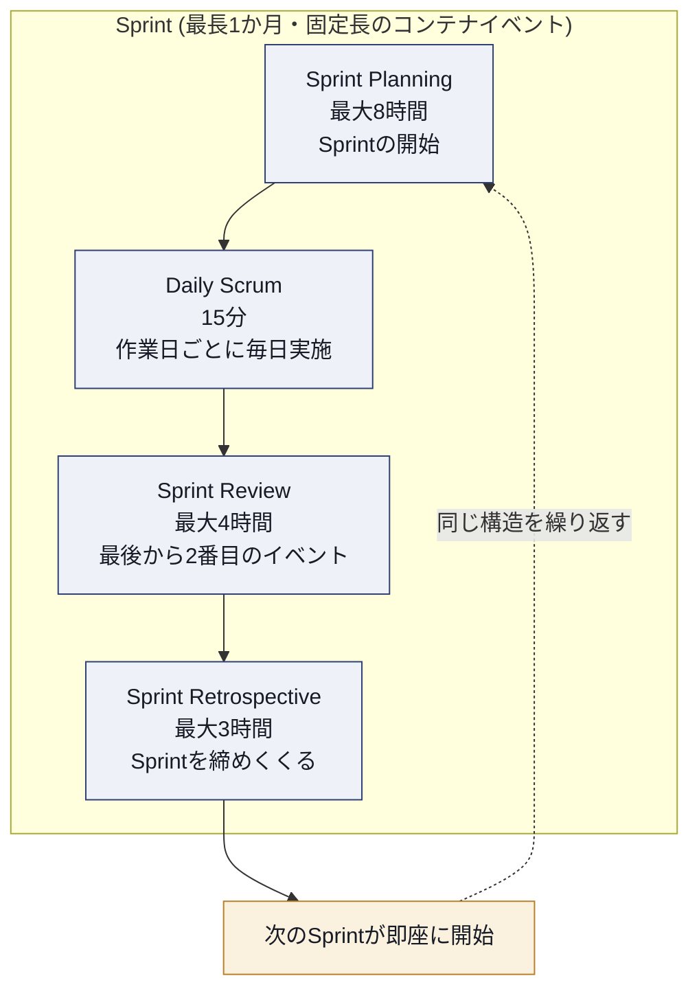
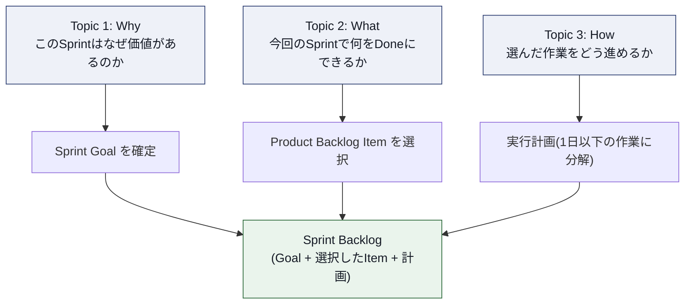
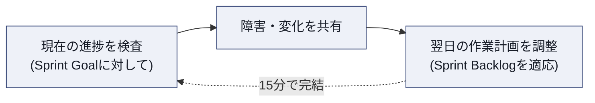
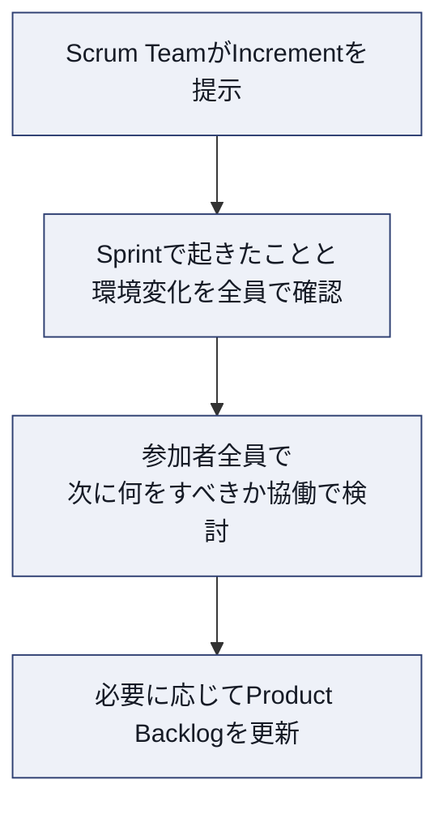
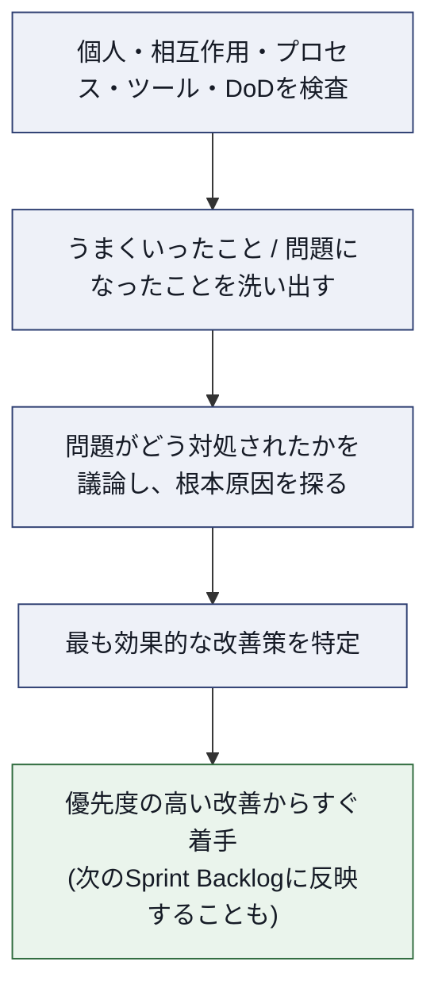
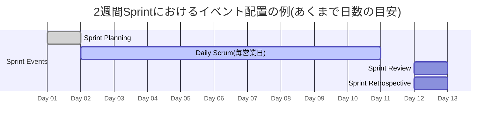

# Scrum Events 完全ガイド ― Certified ScrumMaster®(CSM®)対策

## この文書について

本ガイドは、Scrum Alliance® の **Certified ScrumMaster®(CSM®)** 認定における出題範囲のうち、**Scrum Events(スクラムイベント／スクラムの5つのイベント)** について、初学者が体系的に理解できるようステップバイステップでまとめたものです。

- 一次情報源として **The 2020 Scrum Guide™**(Ken Schwaber & Jeff Sutherland 著)と、Scrum Alliance が公開する **CSM Learning Objectives(2022年1月版)** を用いています。
- 各セクションには「進め方」「ベストプラクティス」「CSM試験ポイント」「アンチパターン」「出典」を設け、学習と実務の両方に使える構成にしています。
- 図解はすべて Mermaid で作成しており、ASCIIアートは使用していません。
- 用語は Scrum Guide 日本語版の翻訳方針(Scrum, Sprint, Sprint Planning, Daily Scrum, Sprint Review, Sprint Retrospective, Product Owner, Scrum Master, Developers, Increment, Definition of Done は翻訳しない)に準拠し、英語表記を保持しています。

> **補足**
> Scrum Guideは著作権(© 2020 Ken Schwaber and Jeff Sutherland)のもとCC BY-SA 4.0ライセンスで提供されています。本ガイドは同ガイドの要約・解説であり、原文の再配布ではありません。正確な定義は必ず一次情報源をご確認ください。

---

## 0. 全体像:なぜ「5つのイベント」なのか

Scrum Guideは次のように説明しています。

> Scrum combines four formal events for inspection and adaptation within a containing event, the Sprint.
> (Scrumは、検査と適応のための4つの正式なイベントを、それらを包含するイベントである Sprint の中で組み合わせる)

つまり「5つのイベント」とは、

1. **Sprint**(すべてを包含するコンテナイベント)
2. **Sprint Planning**
3. **Daily Scrum**
4. **Sprint Review**
5. **Sprint Retrospective**

の5つを指します。2〜5の4イベントは、1の **Sprint という入れ物の中で** 実施されます。これらのイベントはScrumの経験主義(empiricism)を支える3本柱 ―― **透明性(Transparency)・検査(Inspection)・適応(Adaptation)** ―― を実現するための「検査と適応の定例の場」として設計されています。

> **出典**
> - The 2020 Scrum Guide, "Scrum Theory" / "Scrum Events" 節 ― https://scrumguides.org/scrum-guide.html

---

## 1. The Sprint(スプリント)― すべてを包含するコンテナイベント

### 1.1 目的

Sprintは「アイデアを価値に変換する心臓の鼓動(heartbeat)」と表現されます。Product Goalの達成に必要なすべての作業(Sprint Planning、Daily Scrum、Sprint Review、Sprint Retrospective)はSprintの中で行われます。

### 1.2 基本ルール

| 項目 | 内容 |
|---|---|
| 長さ | 1か月以内の固定長。短いほど学習サイクルが増え、コストとリスクの範囲を限定できる |
| 開始 | 直前のSprintが終了した直後に、新しいSprintが即座に開始する(空白期間を作らない) |
| Sprint中の禁止事項 | Sprint Goalを危うくするような変更を行わない |
| 品質 | 品質を低下させない |
| Product Backlog | 必要に応じてリファインメント(refinement)を続ける |
| スコープ | 学習が進むにつれ、Product Ownerと共にスコープを明確化・再交渉してよい |

### 1.3 Sprintの中止(Sprint Cancellation)

- Sprint Goalが陳腐化した場合、Sprintを中止できます。
- **中止できるのはProduct Ownerのみ**です(CSM試験で頻出の論点)。

### 1.4 進め方(ステップバイステップの捉え方)

1. 前のSprintのSprint Retrospectiveが終わった瞬間に、新しいSprintが始まる。
2. Sprint Planningで今回のSprintのSprint Goalと計画(Sprint Backlog)を確定する。
3. Sprint期間中、Developersは毎日Daily Scrumで進捗を検査し、計画を調整する。
4. Sprint終了直前にSprint Reviewで成果物(Increment)を検査し、今後の方向性を適応する。
5. Sprintの最後にSprint Retrospectiveでチームの働き方そのものを検査し、改善策を計画する。
6. Retrospective終了と同時に次のSprintが始まる(1に戻る)。

> **ベストプラクティス**
> - Sprintの長さはチームの学習サイクルとリスク許容度に応じて決める。不確実性が高いほど短く(1〜2週間)する。
> - すべてのイベントを毎回同じ曜日・時間・場所で開催し(Scrum Guideは "Optimally, all events are held at the same time and place" と明記)、認知負荷とスケジューリングコストを下げる。
> - Sprint中に新しい緊急要求が来た場合は、Sprint Goalを壊さない範囲でのみ受け入れ、原則は次のSprintのProduct Backlogに積む。
>
> **CSM試験ポイント**
> - LO1.14「Sprintが早期に終了しうる条件」に対応:Sprint Goalの陳腐化のみが正当な中止理由であり、権限はProduct Ownerに限定される。
> - Sprintは「他の4つのイベントを包含するコンテナ」であるという位置づけが、5イベント構造を理解する鍵になる。
>
> **アンチパターン**
> - Sprintの長さを毎回バラバラに変える(予測可能性が失われる)。
> - Scrum Master・開発者がSprintを中止する、または「なんとなく」延長する。
> - Sprintとリリースを同一視し、「Sprint Review=リリース判定ゲート」だと誤解する(後述の第4章を参照)。
>
> **出典**
> - The 2020 Scrum Guide, "The Sprint" 節 ― https://scrumguides.org/scrum-guide.html
> - CSM Learning Objectives 2022, LO1.14 ― https://www.scrumalliance.org/media/certifications/los/csm_learning_objectives_2022.pdf

---

## 2. Sprint Planning(スプリントプランニング)

### 2.1 目的

Sprint Planningは **Sprintを開始させる** イベントで、Sprintで行う作業を洗い出します。この計画はScrum Team全体の協働作業によって作られます。

### 2.2 参加者

- Scrum Team全体(Product Owner・Scrum Master・Developers)
- 必要に応じて助言のために他者を招待してもよい

### 2.3 タイムボックス

| Sprint長 | Sprint Planningの最大時間 |
|---|---|
| 1か月 | 8時間 |
| それより短いSprint | 通常はより短い(目安として比例配分で考えるとよい) |

### 2.4 3つのトピック(Why・What・How)

Scrum Guide 2020における最大の変更点の一つが、この「なぜ(Why)」トピックの明確化です。

| トピック | 主導する人 | 内容 |
|---|---|---|
| Why(なぜ) | Product Ownerが提案し、Scrum Team全体で協働 | プロダクトの価値・有用性をどう高めるかを提案し、Sprint Goalを定義する |
| What(何を) | Product OwnerとDevelopersの対話 | Product Backlogから今回のSprintに含める項目を選択する(必要に応じてリファインメントも行う) |
| How(どうやって) | Developersのみが決定 | 選択した項目をDoneにするための作業計画を立てる。1日以下の作業に分解することが多い。進め方はDevelopers以外が指図しない |

Sprint Goal・選択したProduct Backlog Item・その実行計画をあわせて **Sprint Backlog** と呼びます。

### 2.5 進め方(ステップバイステップ)

1. Product Ownerが、価値の高いProduct Backlog Itemとその狙い(Why)を提示する。
2. Scrum Team全体でSprint Goalを議論し、Planning終了までに確定させる。
3. Developersが過去の実績・今後のキャパシティ・Definition of Doneを踏まえ、今回Doneにできる項目(What)を選ぶ。
4. Developersが選択した項目を1日以下のタスクに分解し、実行計画(How)を作る。
5. Sprint Goal・選択項目・計画をまとめてSprint Backlogとして可視化する。

> **ベストプラクティス**
> - Sprint Goalを1文で言語化し、チーム外の人にも説明できる状態にする。Sprint Goalがあることで、個別タスクの寄せ集めではなく「一貫性のあるチームの目標」が生まれる。
> - What(選択量)の見積もりは、ベロシティなど過去の実績データを参照しつつも、それに固執しすぎない。経験主義に基づき、状況に応じて調整する。
> - Howの計画はDevelopers自身が作る。Scrum MasterやProduct Ownerが「どう作業すべきか」を指図しない。
> - Product Backlogのリファインメントを普段から行っておくと、Planning当日の議論が速くなる。
>
> **CSM試験ポイント**
> - LO1.8「Sprint Planningを実施する」に対応。3トピック(Why/What/How)の順序と役割分担を正しく説明できるようにする。
> - 「Sprint Goalは誰が最終確定するか」→ Scrum Team全体の協働(Product Ownerが一方的に決めるのではない)。
> - 「作業計画(How)を誰が決めるか」→ Developersのみ。これは試験で頻出のひっかけポイント。
>
> **アンチパターン**
> - Product OwnerやScrum Masterが、Developersのタスク分解方法にまで介入する。
> - Sprint Goalを作らず、Product Backlog Itemの寄せ集めをそのまま「計画」と呼ぶ。
> - キャパシティを無視して「積めるだけ積む」計画にし、Sprintの途中で破綻する。
>
> **出典**
> - The 2020 Scrum Guide, "Sprint Planning" 節 ― https://scrumguides.org/scrum-guide.html
> - CSM Learning Objectives 2022, LO1.8 ― https://www.scrumalliance.org/media/certifications/los/csm_learning_objectives_2022.pdf

---

## 3. Daily Scrum(デイリースクラム)

### 3.1 目的

Daily Scrumの目的は、**Sprint Goalへの進捗を検査し、必要に応じてSprint Backlogを適応させる(直近の作業計画を調整する)** ことです。

### 3.2 参加者とタイムボックス

| 項目 | 内容 |
|---|---|
| 対象者 | Developers(Product OwnerやScrum MasterがSprint Backlogの作業に実際に取り組んでいる場合はDevelopersとして参加) |
| 時間 | 15分 |
| 頻度・場所 | 複雑さを減らすため、Sprintの作業日ごとに同じ時間・同じ場所で開催する |

### 3.3 進め方

- 構成や手法(いわゆる「昨日やったこと・今日やること・障害」の3問形式など)は **Developersが自由に選んでよい**。Scrum Guide 2020ではこの3つの質問は「必須」としては明記されていません(以前の版にあった強い推奨が緩和されています)。
- 唯一の必須条件は、**Sprint Goalへの進捗にフォーカスし、翌日の作業について実行可能な計画を生み出すこと**。

Daily Scrumは、Developersが計画を調整できる **唯一の機会ではありません**。より詳細な再計画のために、Developersは1日の中で他にも随時集まることがあります。

> **ベストプラクティス**
> - 「進捗報告会」ではなく「明日の計画を作る場」と位置づける。話す相手はScrum Masterや上司ではなく、チームメンバー同士。
> - タイムボックス(15分)を厳守する。詳細な議論が必要な場合はDaily Scrumの直後に別途「Daily Scrum後の会議」を設ける。
> - フォーマットはチームに委ねる。3つの質問形式に固執する必要はなく、タスクボード起点や障害起点など、チームが最もSprint Goalに集中できる形式を選ぶ。
>
> **CSM試験ポイント**
> - LO1.12「DevelopersがどのようにDaily Scrumを行うか説明する」/ LO1.13「Daily ScrumがStatus Meetingと異なる点を3つ以上」に対応。
> - Daily Scrumが status meeting(進捗報告会)と異なる代表的な点:
>   1. 対象はマネージャーへの報告ではなく、チーム内の自己管理のための調整である
>   2. アウトプットは「報告」ではなく「翌日の実行可能な計画」である
>   3. 主催者・参加必須者はDevelopersであり、Scrum MasterやProduct Ownerに向けた説明責任の場ではない
>   4. 時間制約(15分)や頻度(毎営業日)といった制約は、Developersの自己管理と集中を支えるために存在する
> - 「Product OwnerやScrum Masterは参加できないのか」→ 参加自体は可能。ただし作業に実際に取り組んでいる場合のみDevelopersとして参加する。
>
> **アンチパターン**
> - Scrum Masterが一人ひとりに順番に質問し、進捗を「聞き取る」形式にしてしまう(ステータス報告会化)。
> - 15分を大幅に超えて技術的な議論を続けてしまう。
> - Product OwnerやマネージャーへのアップデートとしてDaily Scrumを使う。
>
> **出典**
> - The 2020 Scrum Guide, "Daily Scrum" 節 ― https://scrumguides.org/scrum-guide.html
> - CSM Learning Objectives 2022, LO1.12 / LO1.13 ― https://www.scrumalliance.org/media/certifications/los/csm_learning_objectives_2022.pdf

---

## 4. Sprint Review(スプリントレビュー)

### 4.1 目的

Sprint Reviewの目的は、**Sprintの成果(Increment)を検査し、今後の適応を決定すること** です。Scrum Teamは主要なステークホルダーに成果を提示し、Product Goalへの進捗を議論します。

### 4.2 参加者とタイムボックス

| 項目 | 内容 |
|---|---|
| 参加者 | Scrum Team + 主要なステークホルダー |
| Sprint内の位置づけ | Sprintの最後から2番目のイベント |
| 時間 | 1か月Sprintで最大4時間(短いSprintでは比例して短くなる) |

### 4.3 内容と性質

- Scrum Teamとステークホルダーは、Sprintで達成したことと、周囲の環境変化を確認する。
- そのうえで参加者全員で「次に何をすべきか」を協働で決める。
- 結果としてProduct Backlogが更新されることもある。
- **Sprint Reviewは「作業セッション」であり、単なる「発表(プレゼンテーション)」に終始してはいけません**(Scrum Guide 2020で明記された重要なポイント)。
- Sprint Reviewは **リリースの関門(ゲート)ではありません**。Increment は Sprint終了前でもステークホルダーに届けてよいとされています。

> **ベストプラクティス**
> - 事前に作り込んだスライドでの一方的な発表にせず、実際に動くIncrementをその場で操作しながら対話する。
> - ステークホルダーからのフィードバックをその場でProduct Backlogに反映する(または反映の要否を議論する)ことを前提に設計する。
> - 「今回できたこと」だけでなく「環境の変化(市場・競合・技術動向など)」も議題に含め、Product Goalへの進捗を多面的に検査する。
>
> **CSM試験ポイント**
> - LO1.9「Sprint Reviewを実施する」に対応。
> - 「Sprint Reviewはリリース判定会議か」→ いいえ。Incrementのリリースはいつでも可能で、Sprint Reviewはゲートではない、という点が頻出のひっかけ。
> - Sprint Reviewは「発表」ではなく「作業セッション(working session)」であると明記されている点を正確に覚える。
>
> **アンチパターン**
> - デモを完璧に見せるための「作り込み」に時間を使いすぎる(Sprint中の本来の開発作業を圧迫する)。
> - ステークホルダーを呼ばず、チーム内だけで完結させてしまう。
> - Sprint Reviewを「合否判定」の場として恐れの対象にしてしまう(心理的安全性の欠如)。
>
> **出典**
> - The 2020 Scrum Guide, "Sprint Review" 節 ― https://scrumguides.org/scrum-guide.html
> - CSM Learning Objectives 2022, LO1.9 ― https://www.scrumalliance.org/media/certifications/los/csm_learning_objectives_2022.pdf

---

## 5. Sprint Retrospective(スプリントレトロスペクティブ)

### 5.1 目的

Sprint Retrospectiveの目的は、**品質と効果を高める方法を計画すること** です。

### 5.2 参加者とタイムボックス

| 項目 | 内容 |
|---|---|
| 参加者 | Scrum Team全体 |
| Sprint内の位置づけ | Sprintを締めくくる(Sprintの最後のイベント) |
| 時間 | 1か月Sprintで最大3時間(短いSprintでは比例して短くなる) |

### 5.3 検査する対象

Scrum Teamは、直前のSprintがどうだったかを次の観点から検査します。

- 個々人(individuals)
- 相互作用(interactions)
- プロセス(processes)
- ツール(tools)
- Definition of Done

検査する要素は仕事のドメインによって異なることがあります。チームは、うまくいったこと・直面した問題・その問題が(解決できた/できなかった)かを議論し、誤った前提があればその原因を掘り下げます。

### 5.4 進め方(ステップバイステップ)

1. 直前のSprintで「うまくいったこと」を洗い出す。
2. 直前のSprintで「問題になったこと」を洗い出す。
3. それらの問題がどう対処された(あるいはされなかった)かを議論する。
4. 最も効果が見込める改善策を特定する。
5. 影響の大きい改善策から順に、できるだけ早く着手する(次のSprint BacklogにDone基準付きで組み込むこともある)。

> **ベストプラクティス**
> - 「誰が悪かったか」ではなく「プロセス・仕組みとして何を変えられるか」に焦点を当てる(心理的安全性の確保)。
> - 改善策は絞り込む。一度に多くの改善を狙うより、次のSprintで確実に着手できる1〜数個に絞るほうが実行力が高まる。
> - 定期的にフォーマット(KPT、Start-Stop-Continueなど)を変え、マンネリ化を防ぐ。
> - 改善策は「誰が」「いつまでに」実行するかまで具体化する。
>
> **CSM試験ポイント**
> - LO1.10「Sprint Retrospectiveを実施する」、LO1.11「Sprint Retrospectiveを省略した場合の影響を3つ以上説明する」に対応。
> - Retrospectiveを省略した場合の代表的な影響の例:
>   1. チームの働き方(プロセス・ツール・相互作用)に関する問題が可視化・改善されないまま蓄積する
>   2. 検査(inspection)が行われないため適応(adaptation)も起きず、経験主義のサイクルが機能しなくなる
>   3. 同じ問題が繰り返し発生し、チームの士気やベロシティの安定性が損なわれる
> - Sprint RetrospectiveはSprintを「締めくくる」イベントであり、次のSprintのSprint Planningより前に必ず行われる点を押さえる。
>
> **アンチパターン**
> - 忙しさを理由にRetrospectiveを省略・短縮し続ける。
> - 個人への批判や犯人探しの場になってしまう。
> - 改善アクションを洗い出すだけで、実際には誰も実行しない(「話して終わり」)。
>
> **出典**
> - The 2020 Scrum Guide, "Sprint Retrospective" 節 ― https://scrumguides.org/scrum-guide.html
> - CSM Learning Objectives 2022, LO1.10 / LO1.11 ― https://www.scrumalliance.org/media/certifications/los/csm_learning_objectives_2022.pdf

---

## 6. 5つのイベントの相互関係

### 6.1 1つのSprintの中での時系列イメージ(2週間Sprintの例)

### 6.2 経験主義の3本柱とイベントの対応

| Scrumの柱 | 意味 | 主に対応するイベント |
|---|---|---|
| 透明性(Transparency) | 作業とその状況が、行う人にも受け取る人にも見える状態であること | すべてのイベントの前提条件 |
| 検査(Inspection) | 成果物や進捗を頻繁かつ注意深く検査し、望ましくない変化を検出すること | Daily Scrum(進捗)、Sprint Review(成果物)、Sprint Retrospective(プロセス) |
| 適応(Adaptation) | 逸脱を検出したら、できるだけ早く調整すること | Daily Scrum(翌日の計画)、Sprint Review(Product Backlog更新)、Sprint Retrospective(改善策) |

Sprint Planningは、このサイクル全体の起点として「今回何を検査・適応の対象にするか(Sprint Goal)」を定義する役割を担います。

> **出典**
> - The 2020 Scrum Guide, "Scrum Theory" 節 ― https://scrumguides.org/scrum-guide.html

---

## 7. タイムボックス比較表(1か月Sprintを基準)

| イベント | 目的(一言) | 主な参加者 | タイムボックス | Sprint内の位置 | 主なアウトプット |
|---|---|---|---|---|---|
| Sprint | 他の4イベントを包含するコンテナ | Scrum Team全体 | 1か月以内(固定長) | 最初から最後まで | Increment(累積) |
| Sprint Planning | 今回のSprintで行う作業を計画する | Scrum Team全体(+任意参加者) | 最大8時間 | Sprintの開始 | Sprint Backlog(Goal・選択Item・計画) |
| Daily Scrum | Sprint Goalへの進捗を検査し計画を調整する | Developers | 15分 | 毎作業日 | 翌日の実行可能な計画 |
| Sprint Review | Sprintの成果を検査し今後を適応する | Scrum Team + ステークホルダー | 最大4時間 | 最後から2番目 | 更新されたProduct Backlog、フィードバック |
| Sprint Retrospective | 品質と効果を高める方法を計画する | Scrum Team全体 | 最大3時間 | Sprintを締めくくる | 優先度づけられた改善アクション |

> **補足**
> 短いSprint(例:1週間や2週間)の場合、各イベントのタイムボックスは上表の値を上限として比例的に短くなるのが一般的な運用です(Scrum Guideは「通常はより短くなる」とのみ記載し、厳密な比例計算式は定めていません)。

---

## 8. Definition of Done とイベントの関係(補足)

Definition of Done(DoD)はイベントそのものではなく **Increment(成果物)の完成の合意** ですが、CSMの学習目標(LO1.15, 1.16)ではScrum Eventsと併せて扱われるため、ここで簡潔に補足します。

- DoDを満たした瞬間にProduct Backlog ItemはIncrementになる。
- DoDを満たさない項目はリリースできず、Sprint Reviewで提示することもできない(Product Backlogに差し戻される)。
- 強固なDoDの利点の例:
  1. 「完成」の基準がチーム内外で共通認識になり、Sprint Reviewでの手戻りや認識齟齬を防ぐ
  2. 技術的負債の蓄積を抑え、Increment間の整合性を保ちやすくする
  3. Sprint Planningでの見積もり(What)の精度が上がる(何をもって完了とするかが明確なため)
- DoDの作成方法の一例:組織標準のDoDがあればそれを最低限として採用し、なければScrum Teamがプロダクトに適した基準を協働で作成する(例:テスト済み・コードレビュー済み・ドキュメント更新済み、などの具体的条件をリスト化する)。

> **出典**
> - The 2020 Scrum Guide, "Increment" 節 ― https://scrumguides.org/scrum-guide.html
> - CSM Learning Objectives 2022, LO1.15 / LO1.16 ― https://www.scrumalliance.org/media/certifications/los/csm_learning_objectives_2022.pdf

---

## 9. CSM Learning Objectives 対応表(Scrum Events関連: LO1.7〜1.16)

| LO番号 | 学習目標の要約 | 本ガイドの対応セクション |
|---|---|---|
| 1.7 | 各Scrum eventで透明性を高めるためのinspect and adaptの例を挙げる | 6.2 経験主義の3本柱とイベントの対応 |
| 1.8 | Sprint Planningを実施する | 2. Sprint Planning |
| 1.9 | Sprint Reviewを実施する | 4. Sprint Review |
| 1.10 | Sprint Retrospectiveを実施する | 5. Sprint Retrospective |
| 1.11 | Sprint Retrospectiveを省略した場合の影響を3つ以上説明する | 5.3〜5.4「CSM試験ポイント」 |
| 1.12 | DevelopersがどのようにDaily Scrumを行うか説明する | 3. Daily Scrum |
| 1.13 | Daily Scrumがstatus meetingと異なる点を3つ以上、制約の理由を議論する | 3.3 進め方 |
| 1.14 | Sprintが早期終了しうる条件を説明する | 1.3 Sprintの中止 |
| 1.15 | 強固なDefinition of Doneの利点を3つ以上説明する | 8. Definition of Doneとイベントの関係 |
| 1.16 | Definition of Doneを作成する方法を示す | 8. Definition of Doneとイベントの関係 |

> **出典**
> - Scrum Alliance, CSM Learning Objectives(Last Updated: January 2022)― https://www.scrumalliance.org/media/certifications/los/csm_learning_objectives_2022.pdf

---

## 10. CSM試験の概要(参考情報)

Scrum Alliance公式ページに基づく、CSM認定試験の概要は以下の通りです。

| 項目 | 内容 |
|---|---|
| トレーニング時間 | 16時間(2〜3日間で実施されることが多い) |
| 試験形式 | オンライン多肢選択式(50問) |
| 合格基準 | 50問中37問正解 |
| 制限時間 | 1時間 |
| 受験機会 | 最初のウェルカムメール受信日から90日以内は、受験費用込みで最大2回まで受験できる。90日を過ぎた場合や2回とも不合格だった場合も受験は可能だが、1回につき25米ドルの受験料が別途必要になる |

> **補足**
> 価格や運用ルールはトレーナー・地域・時期により変動するため、最新情報は必ずScrum Alliance公式ページで確認してください。
>
> **出典**
> - Scrum Alliance, "Certified ScrumMaster (CSM) Certification" ― https://www.scrumalliance.org/get-certified/scrum-master-track/certified-scrummaster
> - Scrum Alliance Support, "How do I take the CSM test?" ― https://support.scrumalliance.org/hc/en-us/articles/360002112772-How-do-I-take-the-CSM-test

---

## 11. よくある誤解(FAQ形式)

**Q1. Daily Scrumは進捗をScrum Masterに報告する場ですか?**
A. いいえ。目的はSprint Goalへの進捗を検査し、Developers自身が翌日の計画を調整することです。報告先は上司やScrum Masterではなく、チーム自身です。

**Q2. Sprint Reviewでデモが失敗したら不合格・失敗ということですか?**
A. いいえ。Sprint Reviewはリリース判定の関門ではなく、成果を検査し今後を適応するための作業セッションです。うまくいかなかった点も含めて次に活かす場です。

**Q3. Sprintの作業計画(How)はScrum Masterが決めるのですか?**
A. いいえ。Howを決めるのはDevelopersのみです。Scrum Masterはファシリテーションや障害の除去で支援しますが、作業の進め方そのものを指図しません。

**Q4. Sprint Retrospectiveは忙しいときは省略してよいですか?**
A. 推奨されません。省略するとプロセス上の問題が可視化・改善されないまま蓄積し、経験主義のサイクル(検査→適応)が機能しなくなります(LO1.11参照)。

**Q5. すべてのイベントは必ず対面で同じ場所で行う必要がありますか?**
A. Scrum Guideは「最適には(optimally)同じ時間・場所で開催する」としており、絶対的な必須ルールではなく推奨事項です。リモートチームでも、同じ時間帯・同じツールで規則的に開催することで同様の効果を狙います。

---

## 12. 学習チェックリスト

- [ ] 5つのイベントの名称と、Sprintが他4イベントを包含するコンテナであることを説明できる
- [ ] 各イベントの目的を、Scrum Guideの言葉に近い形で1文で言える
- [ ] 各イベントの参加者とタイムボックス(1か月Sprint基準)を暗記している
- [ ] Sprint Planningの3トピック(Why/What/How)と、それぞれの意思決定者を説明できる
- [ ] Daily Scrumがstatus meetingと異なる点を3つ以上説明できる
- [ ] Sprint Reviewが「リリースの関門ではない」ことと「作業セッションである」ことを説明できる
- [ ] Sprint Retrospectiveで検査する5つの観点(個人・相互作用・プロセス・ツール・DoD)を挙げられる
- [ ] Sprint Retrospectiveを省略した場合の影響を3つ以上説明できる
- [ ] Sprintを中止できるのはProduct Ownerのみであることを説明できる
- [ ] 強固なDefinition of Doneの利点を3つ以上説明できる

---

## 13. 参考文献・出典一覧

1. Ken Schwaber & Jeff Sutherland, *The 2020 Scrum Guide™*(HTML版)― https://scrumguides.org/scrum-guide.html
2. Ken Schwaber & Jeff Sutherland, *2020 Scrum Guide*(英語版PDF)― https://scrumguides.org/docs/scrumguide/v2020/2020-Scrum-Guide-US.pdf
3. Ken Schwaber & Jeff Sutherland, *スクラムガイド*(日本語版PDF, 2020年11月)― https://scrumguides.org/docs/scrumguide/v2020/2020-Scrum-Guide-Japanese.pdf
4. Scrum Alliance, *Certified ScrumMaster (CSM) Certification*(コース概要ページ)― https://www.scrumalliance.org/get-certified/scrum-master-track/certified-scrummaster
5. Scrum Alliance, *Certified ScrumMaster (CSM) Learning Objectives*(Last Updated: January 2022, PDF)― https://www.scrumalliance.org/media/certifications/los/csm_learning_objectives_2022.pdf
6. Scrum Alliance, *Scrum Foundations® Learning Objectives*(PDF)― https://www.scrumalliance.org/media/certifications/los/scrum_foundations_learning_objectives_2022.pdf
7. Scrum Alliance, *Scrum Values* ― https://www.scrumalliance.org/about-scrum/values
8. Scrum Alliance Support, *How do I take the CSM test?* ― https://support.scrumalliance.org/hc/en-us/articles/360002112772-How-do-I-take-the-CSM-test
9. Beedle, Kent Beck, et al., *Manifesto for Agile Software Development* ― https://agilemanifesto.org

*The Scrum Guide is © 2020 Ken Schwaber and Jeff Sutherland, and is made available under the Creative Commons Attribution-ShareAlike 4.0 International License(CC BY-SA 4.0)― https://creativecommons.org/licenses/by-sa/4.0/legalcode*
