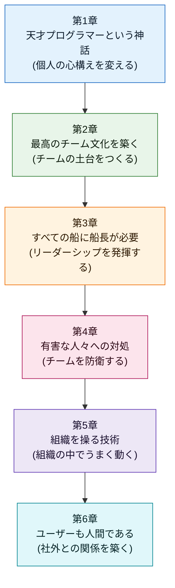
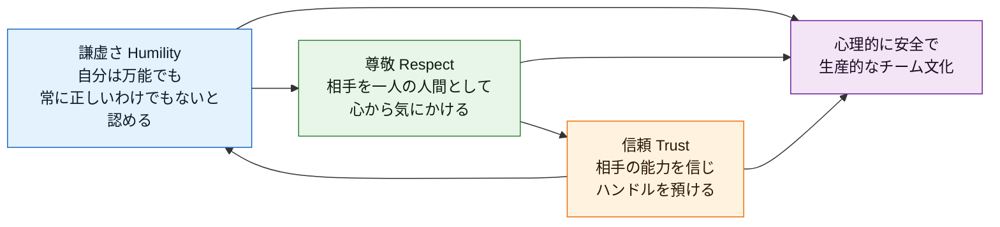
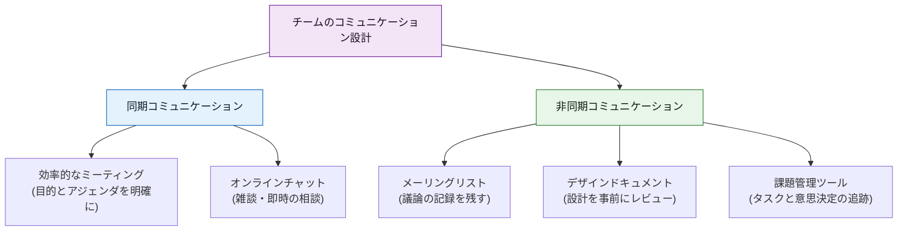
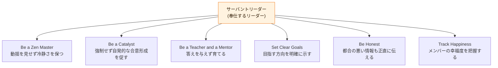
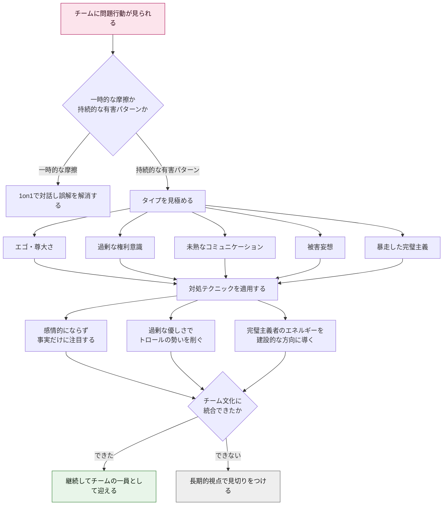
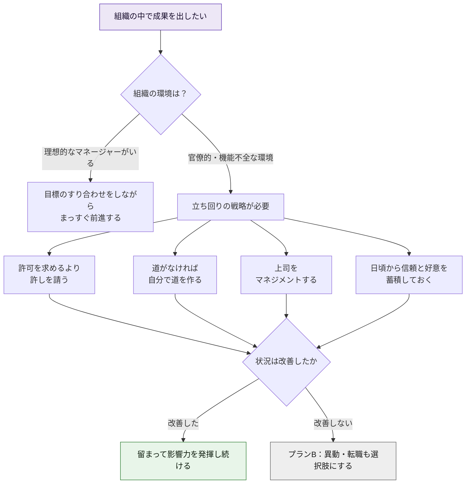
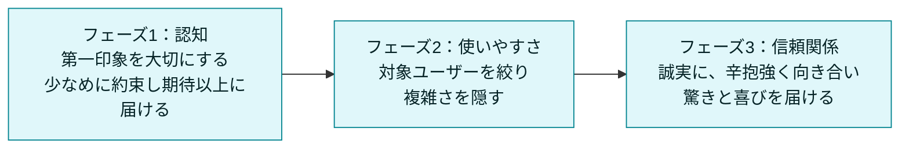

# Team Geek ― Googleのギークたちはいかにしてチームを作るのか【初学者向け完全ガイド】

> 原著: *Team Geek: A Software Developer's Guide to Working Well with Others*
> 著者: Brian W. Fitzpatrick, Ben Collins-Sussman（ともに元Google、Subversion共同開発者）
> 出版: O'Reilly Media, 2012年7月
> 参照: https://www.oreilly.com/library/view/team-geek/9781449329839/

## この記事について

「コードさえ書ければ、ソフトウェアエンジニアは成功できる」——そう思っていないだろうか。しかし『Team Geek』の著者2人は、Googleでの20年以上のキャリアを通じて、そうではないという結論にたどり着いた。ソフトウェア開発は**チームスポーツ**であり、技術力と同じくらい「人間同士がどう関わるか」が結果を左右する。

本書はGoogleのプロダクトホスティング（現在のGoogle Code系サービス）を立ち上げたBrian FitzpatrickとBen Collins-Sussmanが、社内外で数十万人規模の聴衆を集めた講演シリーズ「Working with Poisonous People（有害な人々とどう働くか）」などをベースに書き下ろしたものだ。2013年にはDr. Dobb's JournalのJolt Awardsファイナリストにも選出されている。

この記事では、初めてチーム開発に携わるエンジニアでも迷わないように、本書の6章構成を**ステップバイステップ**で噛み砕いて解説する。図解はすべてMermaidのフローチャート、比較情報はすべてMarkdownの表で示す。

---

## 目次

1. [全体像を掴む：6章の旅](#全体像を掴む6章の旅)
2. [すべての土台となるHRT（謙虚さ・尊敬・信頼）](#すべての土台となるhrt謙虚さ尊敬信頼)
3. [第1章：天才プログラマーという神話](#第1章天才プログラマーという神話)
4. [第2章：最高のチーム文化を築く](#第2章最高のチーム文化を築く)
5. [第3章：すべての船に船長が必要](#第3章すべての船に船長が必要)
6. [第4章：有害な人々への対処](#第4章有害な人々への対処)
7. [第5章：組織を操る技術](#第5章組織を操る技術)
8. [第6章：ユーザーも人間である](#第6章ユーザーも人間である)
9. [まとめ：明日から使えるHRT実践チェックリスト](#まとめ明日から使えるhrt実践チェックリスト)
10. [続編・関連書籍](#続編関連書籍)
11. [参考文献・出典](#参考文献出典)

---

## 全体像を掴む：6章の旅

本書は「個人の心構え」から始まり、「チーム」「リーダーシップ」「防衛」「組織」「社外（ユーザー）」へと同心円状に視野を広げていく構成になっている。まずは全体の地図を頭に入れておこう。

| 章 | タイトル | 対象範囲 | 一言で言うと |
|---|---|---|---|
| 1章 | 天才プログラマーという神話 | 個人 | 一人で完璧を目指すのをやめ、HRTを土台に据える |
| 2章 | 最高のチーム文化を築く | チーム | コミュニケーション設計とツールでチーム文化を作る |
| 3章 | すべての船に船長が必要 | リーダーシップ | 管理者ではなく「奉仕するリーダー」を目指す |
| 4章 | 有害な人々への対処 | チームの防衛 | HRTを壊す人を見極め、冷静に無力化する |
| 5章 | 組織を操る技術 | 組織 | 官僚的な組織でも成果を出す立ち回り方を学ぶ |
| 6章 | ユーザーも人間である | 社外 | ユーザーとの関係にもHRTの原則を適用する |

---

## すべての土台となるHRT（謙虚さ・尊敬・信頼）

本書全体を貫く中心思想が **HRT** ＝ **Humility（謙虚さ）・Respect（尊敬）・Trust（信頼）** の3本柱だ。著者らは「ソフトウェア開発における社会的な対立のほとんどは、この3つのいずれか、あるいは全部が欠けていることに起因する」と述べている。

| 柱 | 定義 | 実践のヒント |
|---|---|---|
| 謙虚さ (Humility) | 自分は宇宙の中心ではなく、全知全能でも無謬でもないと認める。自己改善に対してオープンである | 「自分が間違っているかもしれない」を前提に議論を始める。批判を人格攻撃と受け取らない |
| 尊敬 (Respect) | 一緒に働く人を心から気にかける。人間として扱い、能力と実績を正当に評価する | 相手の時間を大切にする。功績を横取りしない。異なる意見にも敬意を払う |
| 信頼 (Trust) | 他者が有能であり正しいことをすると信じる。適切な場面ではハンドルを譲る | マイクロマネジメントをやめる。仕事を任せたら結果を待つ。失敗を許容する |

O'Reillyに寄せられた著名人の推薦の言葉からも、この考え方への評価がうかがえる。インターネットの基礎技術TCP/IPの共同開発者として知られる **Vint Cerf** は本書を「ギーク気質に語りかける魅力的な一冊」と評し、発明家で技術者育成にも携わってきた **Dean Kamen** は、30年以上エンジニアと働いてきた経験から「技術と同じくらい人間関係の理解が重要だ」と述べている。Apache Software Foundation共同創設者の **Brian Behlendorf** は、本書がオープンソースの優れた開発者に自然と備わっている姿勢を言語化したものだと評価し、Google検索の元責任者で著名なAI研究者でもある **Peter Norvig** は「個人の技術書は多いが、チームメイトとしてどう振る舞うべきかを説いた本は稀有だ」と称賛している（出典: O'Reilly「Team Geek」推薦文ページ）。

---

## 第1章：天才プログラマーという神話

### 何が書かれているか

著者たちはGoogleのオープンソースホスティング事業を運営していた際、あるパターンに気づいた。ユーザーから「特定のブランチを隠す機能が欲しい」「コードが完成するまで非公開にしたい」といった要望が相次いだのだ。理由を突き詰めると、多くのエンジニアが**未完成のコードや失敗を他人に見られることを恐れていた**ことが分かった。これが「天才プログラマーの神話」――一人で黙々とコードを書き、完璧な状態でリリースする孤高の天才像――である。

しかし現実には、コードを隠すことは百害あって一利なしだ。フィードバックを受けられず、バグが早期に見つからず、そして何より**「バス係数（Bus Factor）」**が下がる。バス係数とは「プロジェクトが完全に立ち行かなくなるまでに、バスに轢かれてもよい人数」を指す指標で、知識が一人に集中している状態はリスクそのものだ。バス係数が1（自分しか分かっていない）のプロジェクトは、その人が休暇を取っただけでも止まってしまう。

### 実践ステップ

1. **早期に、頻繁に共有する**：完成を待たずにドラフト段階でコードやアイデアをチームに見せる習慣をつける。
2. **バス係数を意識する**：自分しか知らない知識・コードがないか棚卸しし、ドキュメント化やペアプログラミングで分散させる。
3. **エゴを手放す**：自己評価とコードの品質を切り離す。批判はコードへの指摘であり、自分自身への攻撃ではないと捉える。
4. **失敗を恐れず、素早く学ぶ**：「Fail Fast; Learn; Iterate（早く失敗し、学び、繰り返す）」を合言葉にする。
5. **学習の時間を確保する**：新しい技術や他分野を学ぶ時間を自分自身に許可する。
6. **他者からの影響に対してオープンでいる**：自分のやり方に固執せず、より良い提案があれば受け入れる柔軟性を持つ。

---

## 第2章：最高のチーム文化を築く

### 何が書かれているか

チーム文化とは、メンバーが交代してもなお受け継がれる「暗黙のルールと価値観」だ。著者らは、優れたチーム文化は偶然生まれるものではなく、**意図的なコミュニケーション設計**によって作られると説く。特に重視されるのが「ミッションステートメント（存在意義の宣言）」で、チームが何のために存在し、何を優先するのかを短い言葉で明文化することで、意見が対立したときの判断基準になるとされている。

コミュニケーションには同期的なもの（会議・チャット）と非同期的なもの（メーリングリスト・ドキュメント・課題管理ツール）があり、それぞれに適した使い分けが必要だ。特にリモート／分散チーム（本書でいう「地理的にチャレンジングなチーム」）では、非同期コミュニケーションの設計品質がチームの生産性を大きく左右する。

さらに本書は「コミュニケーションはエンジニアリングの一部である」とし、コードコメント、コミットログ、コードレビューの必須化、テストとリリースプロセスの整備までを、広い意味でのチームコミュニケーションと位置づけている点が特徴的だ。

| 手段 | 主な用途 | 気をつけたいこと |
|---|---|---|
| ミッションステートメント | チームの存在意義と優先順位の共有 | 一度作って終わりにせず、対立時に立ち返る「北極星」として使う |
| デザインドキュメント | 実装前に設計意図を共有しレビューを受ける | 完成度より早さを優先し、たたき台の段階で共有する |
| メーリングリスト／課題管理ツール | 議論と意思決定を記録し検索可能にする | 口頭やDMだけで意思決定を完結させない |
| オンラインチャット | 即時的な相談・雑談によるチーム連帯感の醸成 | 集中作業への割り込みを最小化するルールを決める |
| コードレビュー | コード品質の担保とチーム全体への知識共有 | 人格ではなくコードそのものにフィードバックする |

### 実践ステップ

1. **チームのミッションステートメントを一緒に作る**：何を最優先するか、意見が割れたときの判断軸を短い文章で言語化する。
2. **すべての決定を記録に残す**：口頭の合意で終わらせず、Issueやドキュメントに要点を書き残す。
3. **コミュニケーション手段の使い分けルールを決める**：「緊急はチャット」「設計はドキュメント」「議論の記録はメーリングリスト」のように役割分担を明確にする。
4. **すべてのコミットにコードレビューを必須化する**：品質担保だけでなく、知識共有とバス係数向上にもつながる。
5. **集中作業への割り込みルールを作る**：緊急でない限りは相手の作業が一区切りつくまで待つ、といった配慮を仕組み化する。

---

## 第3章：すべての船に船長が必要

### 何が書かれているか

「マネージャー」という言葉に良いイメージを持たないエンジニアは多い。著者らはあえて「リーダー」という言葉を使い、**サーバントリーダー（奉仕するリーダー）**という考え方を提示する。優れたリーダーはチームの上に君臨するのではなく、チームが最大限の力を発揮できるよう障害物を取り除き、支援に徹する存在だという。

同時に本書は、エンジニアが陥りがちなリーダーシップの**アンチパターン**を具体的に挙げている。イエスマンばかりを採用する、低パフォーマーを放置する、人間関係の問題を無視する、全員の友達になろうとする、採用基準を妥協する、チームを子ども扱いする――こうした振る舞いはすべてHRTを損なう。

印象的な比喩が「人は植物のようなものだ（People Are Like Plants）」という一節だ。植物によって必要な水や日光の量が違うように、メンバーによって必要なモチベーションや裁量の与え方は異なる。画一的なマネジメントではなく、一人ひとりに合わせた関わり方が求められる（この比喩は後年、Google社内のベストプラクティスをまとめた書籍『Software Engineering at Google』でも紹介されており、影響力の大きさがうかがえる）。

| アンチパターン | 内容 | なぜ問題か |
|---|---|---|
| イエスマンを採用する | 自分に逆らわない人材ばかり集める | 多様な視点が失われ、誤りに誰も気づけなくなる |
| 低パフォーマーを放置する | 問題を先送りにする | チーム全体の士気とアウトプット水準が下がる |
| 人間関係の問題を無視する | 技術の話だけに集中する | 対立が水面下で悪化し、後で大きな爆発を招く |
| 全員の友達になろうとする | 嫌われたくない一心で厳しい判断を避ける | 必要なフィードバックや意思決定ができなくなる |
| 採用基準を妥協する | 人手不足を理由に基準を下げる | チーム全体の質が下がり、後々の負債になる |
| チームを子ども扱いする | マイクロマネジメントで裁量を与えない | 信頼を損ない、自律性とモチベーションを奪う |

### 実践ステップ

1. **「答えを出す人」から「問いを立てる人」へ**：メンバーが自分で答えにたどり着けるよう問いかける。
2. **メンバーごとに関わり方を変える**：経験の浅いメンバーには具体的な指示を、経験豊富なメンバーには裁量を、と使い分ける。
3. **定期的にチームの幸福度を確認する**：1on1などで「今の仕事にやりがいを感じているか」を継続的に聞く。
4. **都合の悪い情報も正直に共有する**：不確実な状況や失敗も隠さず伝える。
5. **内発的動機づけを重視する**：金銭的報酬（外発的動機）だけに頼らず、裁量・成長・目的意識（内発的動機）を大切にする。

---

## 第4章：有害な人々への対処

### 何が書かれているか

本書で最も引用されることが多いのがこの章だ。著者らはGoogle I/Oなどでの講演「Working with Poisonous People（有害な人々とどう働くか）」を書籍化する形でここに収めている。「有害（Poisonous）」とは単に苦手な相手のことではなく、**チームの生産性を著しく下げる持続的なパターン**を指す。著者らは主な特徴として、他人の時間への敬意の欠如、過剰なエゴ、過剰な権利意識（Overentitlement）、未熟または分かりにくいコミュニケーション、被害妄想（Paranoia）、暴走した完璧主義（Perfectionism）を挙げている。

重要なのは、これらへの対処は「攻撃」ではなく「毒を無害化してチーム文化に取り込むこと」がゴールだという姿勢だ。感情的に反応せず、事実に基づいて淡々と対応することが繰り返し強調されている。

| タイプ | 特徴 | 対処のポイント |
|---|---|---|
| エゴ・尊大さ | 自分の意見が常に正しいと譲らない | 議論を人格戦ではなく事実・データの土俵に戻す |
| 過剰な権利意識 | 特別扱いを当然の権利として要求する | チーム共通のルールを一貫して適用する |
| 未熟・分かりにくいコミュニケーション | 攻撃的、あるいは真意の読めない発言を繰り返す | 感情的に反応せず、具体的な言葉で事実確認する |
| 被害妄想 | 悪意のない発言や決定を陰謀と解釈する | 透明性を高め、意思決定の経緯を明確に共有する |
| 暴走した完璧主義 | 些細な点にこだわり議論を停滞させる | そのエネルギーを品質向上など建設的な役割に振り向ける |

### 実践ステップ

1. **一時的な摩擦と持続的パターンを区別する**：誰にでも悪い日はある。まず1対1で率直に話す機会を作る。
2. **感情的に反応しない**：挑発的な発言があっても、まず事実確認に徹する（"Look for Facts in the Bile"）。
3. **過剰な優しさで無力化する**：攻撃的な相手には礼儀正しく淡々と対応することで、勢いを削ぐことができる。
4. **完璧主義のエネルギーを転用する**：議論を止める完璧主義は、品質保証やレビュー役など建設的な役割に導く。
5. **長期的な視点を持つ**：一度の対応で解決しなくても、チーム文化を守るという長期目標を見失わない。
6. **見切りをつける勇気を持つ**：あらゆる手を尽くしても改善しない場合は、チーム全体の健全性を優先し、然るべきタイミングで区切りをつける。

---

## 第5章：組織を操る技術

### 何が書かれているか

第5章は視点を「チームの外」に向ける。理想的な組織では、良いマネージャーがチームと会社の間の緩衝材となり、目標のすり合わせを行ってくれる。しかし現実には、多くのエンジニアが機能不全な官僚組織で働いており、著者らはこれを乗りこなす技術を**「組織を操る技術（Organizational Manipulation）」**と呼ぶ——政治や社会的工作と呼ぶ人もいるだろうと前置きした上で。

代表的な戦術として、「許可を求めるより許しを請うほうが簡単（It's Easier to Ask for Forgiveness Than Permission）」という有名な格言、道がなければ自分で道を作るという姿勢、上司を"マネジメントする"（Manage Upward）という発想、そして日頃の信頼や善意を蓄積しておく「好意の経済（Favor Economy）」という考え方が紹介される。それでも組織が変わらない場合の最終手段として「プランB：離れる」という選択肢にも触れている点が本書の誠実さでもある。

なお、Scala開発者コミュニティで著名な開発者Daniel Westheideは自身のブログで、この章を「特にインスピレーションを受けた章」と評し、「組織のルールがどれだけ理不尽に見えても、それと戦うだけでは限界がある。まずルールを理解し、その中でうまく立ち回ることで、初めて組織を良い方向に変えられる」という本書の主張に同意している（出典: danielwestheide.com 書評）。

### 実践ステップ

1. **上司や組織のゴールを理解する**：自分のチームの目標が、上位の目標とどうつながっているかを言語化する。
2. **小さく試して結果で語る**：大きな許可を待つより、小さく実行して結果を示す方が速いこともある（ただし影響範囲は慎重に見極める）。
3. **上司を「マネジメント」する**：上司が意思決定しやすいように、必要な情報を先回りして整理して渡す。
4. **信頼の口座に積み立てる**：普段から小さな助け合いを重ね、いざという時に頼れる関係を築いておく。
5. **限界を見極める**：あらゆる手を尽くしても組織が変わらない場合は、異動や転職も含めて選択肢を持っておく。

---

## 第6章：ユーザーも人間である

### 何が書かれているか

最終章はチームの外側、すなわち**ユーザー（顧客）**との関係に焦点を当てる。著者らは「これまで説明してきたHRTの原則は、実はユーザーとの関係にもそのまま当てはまる」と述べ、ユーザーとの関わりを大きく3つの局面に分けて解説する。

まず「認知」の段階では、第一印象が何より重要であり、「Underpromise and Overdeliver（少なめに約束し、期待以上に届ける）」という姿勢が推奨される。次に「使いやすさ」の段階では、対象ユーザーを絞り込むこと、参入障壁を意識すること、機能を増やしすぎず複雑さを隠すことが重要だとされる。最後に「関係構築」の段階では、ユーザーを見下さず、辛抱強く向き合い、信頼と喜びを生み出すことが長期的な関係につながるとされる。

### 実践ステップ

1. **第一印象をコントロールする**：ドキュメント・ランディングページ・エラーメッセージなど、ユーザーが最初に触れる部分を丁寧に作り込む。
2. **少なめに約束し、期待以上に届ける**：機能や納期を大きく見せすぎない。
3. **ユーザーを絞り込む**：全員に受けようとせず、対象を明確にすることで参入障壁と体験品質のバランスを取る。
4. **複雑さを隠す**：高度な機能は上級者向けに隠し、基本操作をシンプルに保つ。
5. **ユーザーを見下さない**：サポートやフィードバック対応では、常に相手を対等な人間として扱う。
6. **驚きと喜びを演出する**：期待を上回る細やかな配慮が、長期的な信頼につながる。

---

## まとめ：明日から使えるHRT実践チェックリスト

- [ ] コードやアイデアは完成を待たず早めに共有しているか（第1章）
- [ ] 自分しか知らない知識・コードを減らし、バス係数を高める努力をしているか（第1章）
- [ ] チームのミッションステートメントを言語化し、意思決定の判断軸にしているか（第2章）
- [ ] 決定事項を口頭で終わらせず、記録に残しているか（第2章）
- [ ] リーダーとして「答えを与える」より「問いを立てる」姿勢を意識しているか（第3章）
- [ ] メンバー一人ひとりに合わせた関わり方をしているか（第3章：人は植物のようなもの）
- [ ] 有害な言動に対して、感情ではなく事実で対応しているか（第4章）
- [ ] 組織の目標と自分のチームの目標のつながりを理解しているか（第5章）
- [ ] 日頃から信頼と好意を積み立てているか（第5章）
- [ ] ユーザーへの約束は控えめに、届ける価値は期待以上を意識しているか（第6章）

---

## 続編・関連書籍

著者らは2015年、本書をソフトウェアエンジニア以外の読者にも広げた拡張版**『Debugging Teams: Better Productivity through Collaboration』**を刊行している。内容の骨格（HRT、有害な人々への対処、組織を操る技術など）は共通しつつ、対象読者をエンジニアに限定しない構成に改められている。同書はクリエイティブ・コモンズ・ライセンス（CC BY-NC-SA）の下、Web上で無料公開もされている。

| 書籍 | 著者 | フォーカス |
|---|---|---|
| Team Geek (2012) | Fitzpatrick, Collins-Sussman | ソフトウェアエンジニア向けのHRT実践入門 |
| Debugging Teams (2015, 第2版) | Fitzpatrick, Collins-Sussman | 職種を問わないチーム協働の実践ガイド |
| Software Engineering at Google (2020) | Winters, Manshreck, Wright | Googleの大規模開発現場におけるプラクティス集。「人は植物のようなもの」の比喩を引用 |
| The Manager's Path | Camille Fournier | エンジニアからマネージャーへのキャリアパス全般 |
| An Elegant Puzzle | Will Larson | 大規模組織におけるエンジニアリングマネジメントの体系的知見 |
| High Output Management | Andrew S. Grove | マネジメントの古典。1on1やアウトプット思考の原点 |

---

## 参考文献・出典

本記事は2026年8月15日時点でのWeb検索結果に基づき、以下の情報源を参照して作成した。

| No. | 情報源 | 内容 | URL |
|---|---|---|---|
| 1 | O'Reilly — Team Geek 書籍ページ | 目次・章構成・出版情報 | https://www.oreilly.com/library/view/team-geek/9781449329839/ |
| 2 | O'Reilly — Praise for Team Geek | Vint Cerf、Dean Kamen、Brian Behlendorf、Peter Norvigらによる推薦文 | https://www.oreilly.com/library/view/team-geek/9781449329839/pr01.html |
| 3 | O'Reilly — 第1章「The Myth of the Genius Programmer」 | 天才神話・HRT導入部分の詳細目次 | https://www.oreilly.com/library/view/team-geek/9781449329839/ch01.html |
| 4 | O'Reilly — 第2章「Building an Awesome Team Culture」 | コミュニケーションパターンの詳細目次 | https://www.oreilly.com/library/view/team-geek/9781449329839/ch02.html |
| 5 | O'Reilly — 第3章「Every Boat Needs a Captain」 | リーダーシップのパターン／アンチパターン詳細目次 | https://www.oreilly.com/library/view/team-geek/9781449329839/ch03.html |
| 6 | O'Reilly — 第4章「Dealing with Poisonous People」 | 有害な人のタイプと対処法の詳細目次 | https://www.oreilly.com/library/view/team-geek/9781449329839/ch04.html |
| 7 | O'Reilly — 第5章「The Art of Organizational Manipulation」 | 組織内での立ち回り戦術の詳細目次 | https://www.oreilly.com/library/view/team-geek/9781449329839/ch05.html |
| 8 | O'Reilly — 第6章「Users Are People, Too」 | ユーザーとの関係構築3フェーズの詳細目次 | https://www.oreilly.com/library/view/team-geek/9781449329839/ch06.html |
| 9 | O'Reilly — Debugging Teams（第2版）書籍ページ | 拡張版の位置づけと目次 | https://www.oreilly.com/library/view/debugging-teams/9781491932049/ |
| 10 | Debugging Teams 無料Web版（CC BY-NC-SA） | 第2版の全文公開ページ | https://book.debuggingteams.com/ |
| 11 | Daniel Westheide（著名なScala開発者・"The Neophyte's Guide to Scala"著者）による書評 | 第5章への評価を含む詳細なレビュー | https://danielwestheide.com/blog/book-review-team-geek/ |
| 12 | juri.dev ブログ「HRT - Humility, Respect and Trust」 | HRTと「人は植物のようなもの」に関する開発者の考察 | https://juri.dev/blog/2012/10/hrt-humility-respect-and-trust/ |
| 13 | Hacker News Books — Team Geek 議論まとめ | 海外開発者コミュニティでの評価・推薦コメント | https://hackernewsbooks.com/book/team-geek/a8ec77e78ddcbd518ac757f18bbd5fca |
| 14 | Goodreads — Software Engineering at Google 読者ノート | 「人は植物のようなもの」比喩の後続書籍での引用例 | https://www.goodreads.com/notes/53526633-software-engineering-at-google/30279277-gerardo-ortega/dbad6cd2-1538-4940-94e3-01cf553f647e |

---

*本記事はTeam Geek（および拡張版Debugging Teams）の要点を初学者向けに再構成した解説であり、原著の文章を逐語的に引用したものではありません。より深く学びたい方は、ぜひ原著を手に取ることをお勧めします。*
