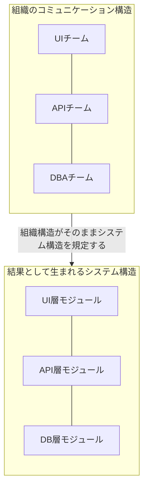
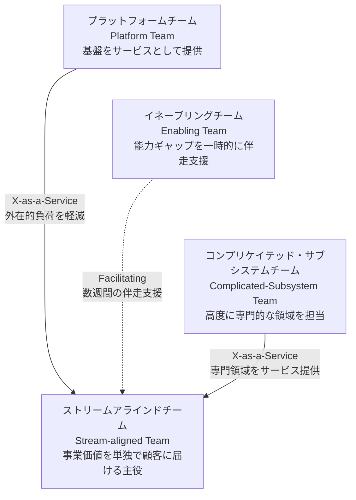
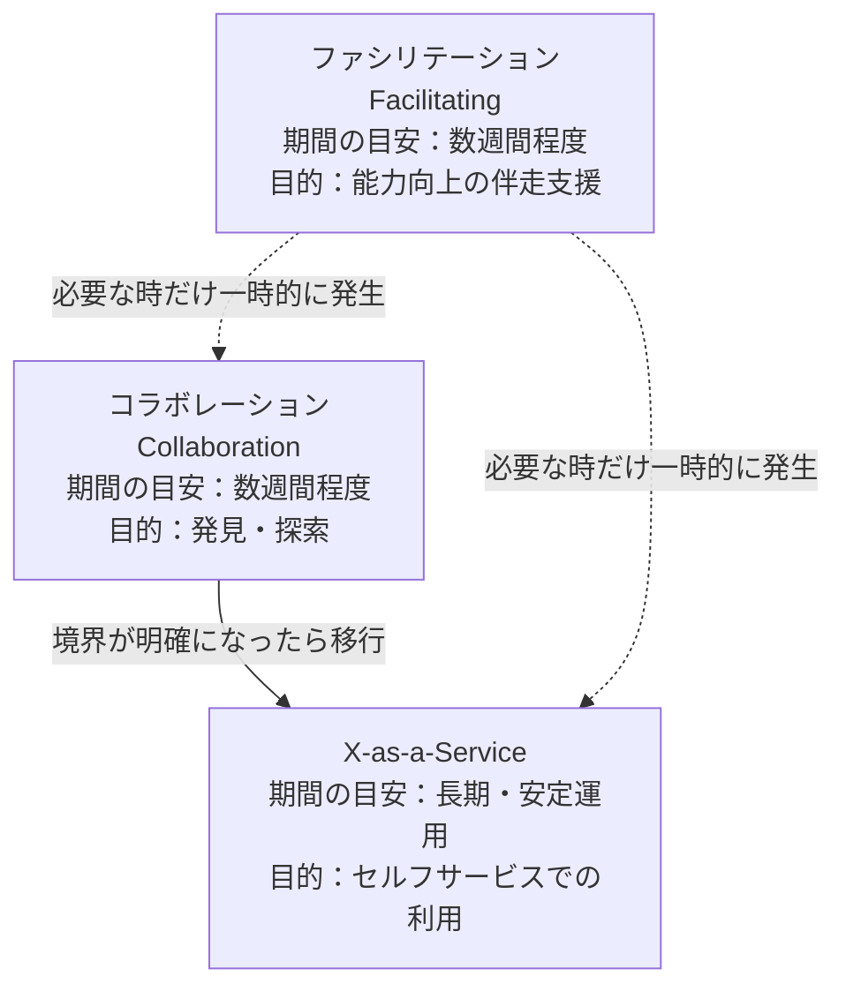
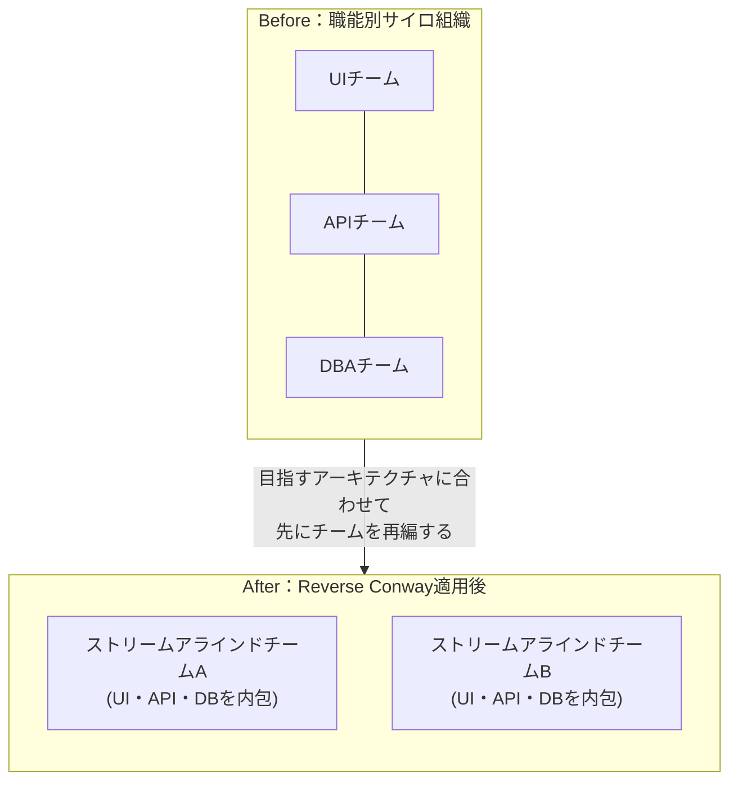
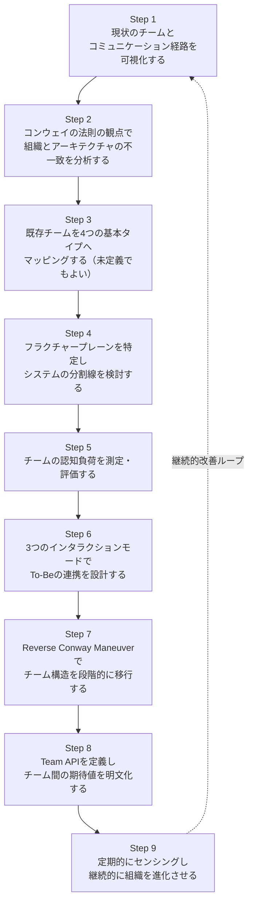

# Team Topologies 実践ガイド ― 初学者のためのステップバイステップ解説

> 対象読者：エンジニアリングマネージャー、テックリード、プロダクトマネージャー、ソフトウェアアーキテクト、そして「なぜうちの組織は開発が遅いのか」を考え始めたすべての人

## 目次

1. [はじめに](#introduction)
2. [Team Topologiesとは何か](#chapter1)
3. [なぜ大切か：コンウェイの法則](#chapter2)
4. [チーム認知負荷（Cognitive Load）](#chapter3)
5. [4つの基本チームタイプ](#chapter4)
6. [3つのチームインタラクションモード](#chapter5)
7. [フラクチャープレーン：システムの分割線](#chapter6)
8. [Reverse Conway Maneuver（逆コンウェイ作戦）](#chapter7)
9. [Team API：チーム間の期待値を明文化する](#chapter8)
10. [導入のステップバイステップガイド（ベストプラクティス）](#chapter9)
11. [よくあるアンチパターンと落とし穴](#chapter10)
12. [2025〜2026年の最新動向：プラットフォームエンジニアリングとの融合](#chapter11)
13. [批判的視点：Team Topologiesの限界](#chapter12)
14. [さらに学ぶために](#chapter13)
15. [参考文献・出典](#references)

---

## はじめに

組織が大きくなるほど、チーム間の調整コストが増え、リリースは遅くなり、誰が何に責任を持つのかが曖昧になっていきます。Team Topologiesは、この「組織の複雑化」という問題に対して、ソフトウェアアーキテクチャと組織設計を同時に扱う実践的なフレームワークです。

著者はMatthew Skelton氏（Confluxの創業者）とManuel Pais氏（独立系ITオーガニゼーションコンサルタント）で、2019年にIT Revolution Pressから初版『*Team Topologies: Organizing Business and Technology Teams for Fast Flow*』が刊行されました。その後、複数業界の新しいケーススタディや著者による新しいまえがき・あとがきを加えた第2版が刊行されています。書籍情報はO'Reilly Media（Learning Platform）でも公開されています。

- O'Reilly Media（書籍詳細）: https://www.oreilly.com/library/view/team-topologies/9781098157234/
- 公式サイト: https://teamtopologies.com

このガイドはMarkdown形式で作成しており、フローチャートはすべてMermaid記法、比較表はMarkdownテーブルで表現しています（ASCIIアートの図解は使用していません）。

---

## 第1章　Team Topologiesとは何か

一言でいうと、Team Topologiesは「**4つの基本チームタイプ**」と「**3つのチームインタラクションモード**」という最小限の語彙を使い、**チームの認知負荷をコントロールしながら価値提供のスピード（Fast Flow）を最大化する**ための組織設計手法です。

前提となる考え方は次の3つです。

- **チームファースト（Team-First）**：個人ではなく「安定したチーム」を組織設計の最小単位とする。1チームはおよそ5〜9名（いわゆる「Two-Pizza Team」やダンバー数の考え方に基づく）。
- **コンウェイの法則（Conway's Law）**：組織のコミュニケーション構造は、そのままシステムのアーキテクチャに反映される。
- **認知負荷理論（Cognitive Load Theory）**：人（チーム）が同時に処理できる情報量には上限があり、それを超えるとパフォーマンスが低下する。

著名なソフトウェアアーキテクトMartin Fowler氏は自身のブログ（bliki）で、Team Topologiesの核心を「プラットフォームの本当の価値は、ストリームアラインドチームの認知負荷を下げることにある」という洞察に見出しています。この視点が、単なる「ビジネス寄りチームと技術支援チームを分ける」という古典的な発想から一歩進んだ、Team Topologies独自の貢献だと評価しています。

---

## 第2章　なぜ大切か：コンウェイの法則

1967年、計算機科学者Melvin Conway氏は、システムを設計する組織は、その組織のコミュニケーション構造をそのまま反映した設計を生み出す、という趣旨の指摘を行いました。これが「コンウェイの法則」です。

つまり、フロントエンド担当チーム・バックエンド担当チーム・DBA（データベース管理）チームのように**職能別に分かれた組織**を作ると、たとえ意図していなくても、フロントエンド／バックエンド／DBという**同じ境界線を持つシステムアーキテクチャ**が自然に生まれてしまいます。これが、変更のたびに複数チームをまたぐ調整が発生し、リリースが遅くなる根本原因になります。

Team Topologiesは、このコンウェイの法則を**逆手に取る**ことを提案します。詳しくは[第7章](#chapter7)の「Reverse Conway Maneuver（逆コンウェイ作戦）」で解説します。

---

## 第3章　チーム認知負荷（Cognitive Load）

Team Topologiesがチーム設計の基準として重視するのが「認知負荷（Cognitive Load）」です。これは教育心理学者John Sweller氏が提唱した認知負荷理論を組織設計に応用したもので、次の3種類に分類されます。

| 認知負荷の種類 | 内容 | 具体例 | 対応方針 |
|---|---|---|---|
| **内在的負荷（Intrinsic）** | タスクそのものに本質的に必要な知識 | プログラミング言語の文法、ビジネスロジックの理解 | トレーニング・採用・ペアプログラミングで習熟度を高め、最小化する |
| **外在的負荷（Extraneous）** | タスクを取り巻く環境や手順に起因する負荷 | デプロイ手順が複雑、環境構築が面倒、誰に聞けばよいか不明 | できる限り自動化・プラットフォーム化して**ゼロに近づける** |
| **学習関連負荷（Germane）** | 学習や高いパフォーマンスの発揮に直結する、価値を生む思考 | 担当ドメイン（請求システムや推薦アルゴリズムなど）特有の問題解決 | ここに最も多くの余力を残すことが目標 |

チームの認知負荷がキャパシティを超えると、品質低下・燃え尽き・スピード低下といった問題が発生します。Team Topologiesの各チームタイプ（第4章）は、この認知負荷を適切に分散させるための「型」だと理解すると、フレームワーク全体の意図がつかみやすくなります。

---

## 第4章　4つの基本チームタイプ

Team Topologiesは、組織内のあらゆるチームを次の**4つの基本タイプ**のいずれかに整理することを提案します。中心にあるのは常に「ストリームアラインドチーム」で、他の3タイプはそれを支援する役割です。

### 4-1. ストリームアラインドチーム（Stream-aligned Team）

- 単一の事業価値の流れ（プロダクトの機能領域や顧客セグメントなど）に沿って編成される、**最も基本となるチームタイプ**。
- フロントエンド・バックエンド・DB・テスト・デプロイ・監視まで、**フルスタック／フルライフサイクル**で責任を持つ。
- 長期的に存続し、他チームへのハンドオフなしに、アイデアから本番運用までを届けられることを目指す。
- 組織内のチームの大半はこのタイプであるべき、というのがTeam Topologiesの基本方針です。

### 4-2. プラットフォームチーム（Platform Team）

- ストリームアラインドチームが「本質的でない」関心事（CI/CD、可観測性、クラウド基盤など）に悩まされないよう、**セルフサービス型の内部プラットフォーム**を提供する。
- 大規模組織では複数のプラットフォームチームが集まった「プラットフォーム・グルーピング」として編成されることもある。
- 重要なのは、プラットフォームチーム自身も「顧客（＝ストリームアラインドチーム）のニーズを深く理解したプロダクト」としてプラットフォームを開発する姿勢です。

### 4-3. イネーブリングチーム（Enabling Team）

- 特定の専門領域（セキュリティ、テスト自動化、パフォーマンスなど）のスペシャリストが集まり、他チームの**能力そのものを底上げする**。
- ソフトウェアの所有権は持たず、コーチングや一時的な伴走を通じて、支援対象チームが自律的に問題を解決できる状態を作ることがゴール。

### 4-4. コンプリケイテッド・サブシステムチーム（Complicated-Subsystem Team）

- 機械学習エンジン、リアルタイム決済処理、動画コーデックなど、**深い専門知識がないと理解・変更が困難な部分**を専任で扱う。
- 存在意義は、その複雑さをストリームアラインドチームの認知負荷から切り離すことにあります。利用チームが1つしかなくても、複雑さの度合いによっては独立させる価値があります。

### チームタイプの比較表

| チームタイプ | 主な目的 | ライフサイクル | 主なインタラクションモード |
|---|---|---|---|
| ストリームアラインド | 事業価値をエンドツーエンドで届ける | 長期・安定 | X-as-a-Serviceを受ける側 |
| プラットフォーム | 外在的負荷を減らす基盤をサービス提供 | 長期・安定 | X-as-a-Service（提供側）／立ち上げ期はCollaboration |
| イネーブリング | 内在的負荷を減らすためのスキル移転 | 一時的・数週間単位で関与 | Facilitating |
| コンプリケイテッド・サブシステム | 高度に専門的な領域を専任担当 | 長期・安定 | X-as-a-Service（提供側）／短期のCollaboration |

---

## 第5章　3つのチームインタラクションモード

チームタイプを定義しただけでは組織は変わりません。Team Topologiesは、チーム同士が**どのように関わり合うべきか**を3つのモードに絞り込んで定義しています。

| モード | 内容 | 適した状況 | 注意点 |
|---|---|---|---|
| **コラボレーション（Collaboration）** | 異なるスキルセットを持つ2チームが、決められた期間、密接に協働する | 新しい境界や仕様を発見したいとき | 長引くと責任範囲が曖昧になり、認知負荷が増える。数週間で区切るのが原則 |
| **X-as-a-Service** | 明確なインターフェースを介して、片方のチームがもう片方にサービスを提供する | 境界が固まり、安定して運用フェーズに入ったとき | 提供側に良い開発者体験（DX）と明確なSLA/SLOが求められる |
| **ファシリテーション（Facilitating）** | 一方のチーム（主にイネーブリングチーム）が、もう一方の障害を取り除き、能力を引き上げる | スキルギャップの解消、詰まりの発見 | コラボレーション同様、短期集中が原則。標準への準拠を強制する役割ではない |

公式サイトのガイドでは、「2チームが長期間にわたって密接に協働し続けている状態」は、正式な3モードのいずれにも当てはまらない**「未定義のインタラクション」**として可視化し、改善対象として扱うことが推奨されています。

---

## 第6章　フラクチャープレーン：システムの分割線

モノリシックなシステムやチームを分割したいとき、Team Topologiesは「**フラクチャープレーン（Fracture Plane）**」＝システムを自然にきれいに分割できる継ぎ目を探すことを提案します。

| フラクチャープレーンの種類 | 説明 |
|---|---|
| ビジネスドメイン境界（Bounded Context） | ドメイン駆動設計（DDD）でいう境界づけられたコンテキストに沿って分割する |
| 規制・コンプライアンス境界 | 監査要件や法規制が異なる部分（決済処理、個人情報など）で分割する |
| 変更ケイデンス | 更新頻度が大きく異なる部分（頻繁に変わるUI vs. めったに変わらない基幹ロジック）で分割する |
| チームの所在地 | タイムゾーンや拠点が異なるチーム間の境界に沿わせる |
| リスク・性能の分離 | 障害影響範囲やパフォーマンス特性が異なる部分を切り離す |
| ユーザーペルソナ／利用パターン | 利用者層やユースケースが大きく異なる機能群を分割する |

分割線を検討する際の基本方針は、**ビジネスドメインの境界づけられたコンテキストに沿ったフラクチャープレーンを最優先する**ことです。これはビジネスの変更の流れ（value stream）と自然に一致しやすいためです。

---

## 第7章　Reverse Conway Maneuver（逆コンウェイ作戦）

第2章で見たコンウェイの法則は「組織構造がシステム構造を規定する」という一種の“重力”のようなものです。Team Topologiesはこの重力を逆用し、**先に理想のシステムアーキテクチャを描き、それに合わせてチーム構造を意図的に再編する**というアプローチを取ります。これが「Reverse Conway Maneuver（逆コンウェイ作戦／inverse Conway maneuver）」です。

書籍『Team Topologies』では、この逆コンウェイ作戦の実行には経営陣の意志力（willpower）とチームの意識変革が必要であり、初期には抵抗が出ることも珍しくないと述べられています。それでも、疎結合（Loose Coupling）と高凝集（High Cohesion）というソフトウェアアーキテクチャの原則をチーム設計に適用することで、実現可能だとされています。

---

## 第8章　Team API：チーム間の期待値を明文化する

Team Topologiesのもう1つの重要な道具が「**Team API**」です。ソフトウェアのAPIが「そのコンポーネントとどう連携すればよいか」を定義するように、Team APIは「**そのチームとどう連携すればよいか**」を明文化したものです。

Team APIには、一般的に次のような情報を含めます（公式のTeam APIテンプレートを要約したものです）。

- チーム名と担当領域、チームタイプ（ストリームアラインド／イネーブリング／コンプリケイテッド・サブシステム／プラットフォーム）
- 他チームへサービスを提供しているか、どのようなサービスレベル期待値（SLA/SLO）があるか
- チームが所有・進化させているソフトウェア資産
- バージョニングの方針
- Wikiの検索キーワード、チャットツールのチャンネル、定例同期の時間
- 現在および今後数週間で連携予定の他チーム（インタラクションモードと目的、想定期間）

Team Topologiesの共著者2人がInfoQのポッドキャストで語っているように、Team APIは「ソフトウェアにAPIがあるなら、チームにもインターフェースがあってしかるべきだ」という発想から来ています。多くのチームが既に持っている「チームチャーター」を、他チームとの連携という外向きの視点で捉え直すものだと説明されています。

公式のTeam APIテンプレート（GitHub）: https://github.com/TeamTopologies/Team-API-template

---

## 第9章　導入のステップバイステップガイド（ベストプラクティス）

ここからは、実際に組織へTeam Topologiesを導入する際の実践的なステップを解説します。公式サイトが提唱する「チームインタラクションモデリング」のアプローチをベースに、初学者でも着手しやすい順序に整理しています。

### Step 1：現状のチームと通信経路を可視化する

まずは今ある全チームと、それらの間の連携（ハンドオフ、承認フロー、定例会議など）を書き出します。この段階では正しい分類を目指す必要はなく、「PMO→UX→開発→テスト→運用」のような**引き継ぎの連鎖**をそのまま図示することが目的です。公式ガイドでは、この引き継ぎを灰色のひし形で表現する記法が紹介されています。

### Step 2：コンウェイの法則の観点で不一致を分析する

可視化した組織構造と、実際のシステムアーキテクチャを見比べます。多くの場合、職能別のサイロ構造が、疎結合であるべきアーキテクチャに不必要な結合を生んでいることが見えてきます。

### Step 3：既存チームを4つの基本タイプへマッピングする

各チームが「ストリームアラインド」「プラットフォーム」「イネーブリング」「コンプリケイテッド・サブシステム」のどれに近いかを検討します。どれにも当てはまらない場合は無理に分類せず、「未定義タイプ」として一旦保留します。ここで重要なのは正確な分類よりも、**議論のきっかけを作ること**です。

### Step 4：フラクチャープレーンを特定する

第6章で紹介した分割線の候補（ビジネスドメイン境界、規制境界、変更ケイデンスなど）を使い、モノリスや巨大なチームをどう分割できるかを検討します。書籍では、この検討のために115〜123ページで複数のフラクチャープレーンのパターンが解説されています。

### Step 5：チームの認知負荷を測定・評価する

各チームが「内在的」「外在的」「学習関連」のどの負荷で苦しんでいるかをヒアリングします。外在的負荷が高いならプラットフォームチームの支援を、内在的負荷が高いならイネーブリングチームの支援を検討する、という判断材料になります。

### Step 6：To-Beのインタラクションモードを設計する

現状の「長期化したコラボレーション」や「頻繁なハンドオフ」を、どのインタラクションモード（コラボレーション／X-as-a-Service／ファシリテーション）に置き換えるべきかを設計します。目指す姿は、コラボレーションとファシリテーションが**短期集中**で発生し、安定した関係の多くがX-as-a-Serviceに収束している状態です。

### Step 7：Reverse Conway Maneuverで段階的に移行する

一気に組織全体を再編するのではなく、小さな単位で段階的にチーム構造を目指すアーキテクチャへ寄せていきます。経営層の後押しと、影響を受けるチームへの丁寧な説明が欠かせません。

### Step 8：Team APIを定義する

再編後の各チームについて、Team API（第8章参照）を作成し、他チームがどのように連携すればよいかを明文化します。これにより「暗黙のルール」に依存した非効率なコミュニケーションを減らせます。

### Step 9：継続的にセンシングし、組織を進化させ続ける

Team Topologiesは一度作って終わりの静的な組織図ではありません。「ユーザーの求めるものを見誤っていないか」「あるチーム間のコラボレーションはまだ有効か、X-as-a-Serviceへ移行すべきか」といった問いを定期的に立て、**組織を継続的にセンシングし、適応させ続けること**が推奨されています。組織が成長したり、システムが1チームで扱うには大きくなりすぎたりするたびに、Step 1に戻って見直します。

---

## 第10章　よくあるアンチパターンと落とし穴

| アンチパターン | 症状 | 対策 |
|---|---|---|
| 組織図シアター（Org Chart Theater） | チーム名だけを「ストリームアラインドチーム」などに変更し、実際の技術的依存関係やハンドオフは変わっていない | 名称変更だけで満足せず、実際の依存関係とインタラクションモードを見直す |
| プラットフォームチームの承認ボトルネック化 | プラットフォームチームが「何でも承認する部署」になり、セルフサービスの理念に反してしまう | プラットフォームを製品として捉え直し、セルフサービス性とドキュメントの質を重視する |
| コラボレーションの長期化・固定化 | 本来は数週間のはずのコラボレーションモードが、何年も同じ2チーム間で続いている | 定期的に「このコラボレーションはまだ必要か、X-as-a-Serviceへ移行できないか」を問い直す |
| フレームワークの機械的な当てはめ | 「4タイプ・3モードに全チームを当てはめること」自体が目的化し、組織の実情を無視する | フレームワークは議論のための道具であり、完璧な組織図を作ることが目的ではないと捉え直す |
| 認知負荷を測らずに再編する | 感覚的な判断だけでチームを分割・統合し、かえって負荷が偏る | チーム認知負荷アセスメントなど、定量・定性の両面から負荷を確認してから再編する |

Martin Fowler氏はブログの中で、統計学者George Box氏の「すべてのモデルは間違っているが、役に立つものもある」という考え方を引用し、Team Topologiesも「複雑な組織を4種類のチームと3種類のインタラクションだけで説明しきれるわけではない」としつつも、組織をより良い方向へ進化させるための実用的な制約・道具として評価しています。

---

## 第11章　2025〜2026年の最新動向：プラットフォームエンジニアリングとの融合

2022年頃からの「プラットフォームエンジニアリング」ムーブメントは、Team Topologiesのプラットフォームチームの考え方と強く結びついて発展してきました。2026年時点の業界レポートでは、次のような傾向が指摘されています。

- 大手調査会社は、2026〜2027年までに大規模なソフトウェア開発組織の約80%が専任のプラットフォームチームを持つようになると予測しており、複数の業界レポートがその実現を裏付けています。
- プラットフォームチームを「インフラチーム」ではなく「プロダクトチーム」として運営する考え方が主流になりつつありますが、これはTeam Topologiesが2019年の初版から提唱していた考え方そのものであるとも指摘されています。
- 内部開発者ポータル（Internal Developer Platform, IDP）を通じたセルフサービス化が進み、Team Topologiesの言う「X-as-a-Serviceモード」がより具体的なツール群として実装されるようになっています。
- 書籍『Team Topologies』自体も、複数業界の新しいケーススタディを加えた第2版が刊行され、著者らによる新しいまえがき・あとがきでは、初版刊行以降のグローバルな影響と、今後の展望が語られています。

---

## 第12章　批判的視点：Team Topologiesの限界

どのフレームワークにも限界があります。実務家からは、次のような批判的視点も提示されています。

- 書籍が非常に読みやすく軽量であるがゆえに、組織全体への急速な導入を招きやすく、その結果として「4タイプに当てはめること」自体が目的化してしまう危険性がある、という指摘があります。
- Conway's Law、ダンバー数、認知負荷理論など、Team Topologies自体が引用している既存の理論は有用である一方、それらを「4タイプ・3モード」という単純化されたテンプレートに落とし込みすぎると、組織固有の複雑さを見落とすおそれがある、という批判もあります。
- Martin Fowler氏自身も、複雑な組織を4種類のチームと3種類の交流だけで表現しきれるわけではないと明言した上で、それでもなお、組織をより良い方向へ動かすための実用的な制約として価値があると位置づけています。

これらの批判は、Team Topologiesを「唯一絶対の正解」としてではなく、**組織設計についての対話を始めるための共通言語・思考の道具**として使うべきだ、という共通のメッセージに集約されます。

---

## 第13章　さらに学ぶために

- 書籍（初版）: *Team Topologies: Organizing Business and Technology Teams for Fast Flow*（IT Revolution Press, 2019）
- 書籍（第2版）: 複数業界の新しいケーススタディと、著者による新しいまえがき・あとがきを追加
- O'Reilly Learning Platformでの書籍詳細: https://www.oreilly.com/library/view/team-topologies/9781098157234/
- 公式サイトのキーコンセプト集、ワークショップ情報、図形テンプレート（shapes.teamtopologies.com）
- GitHub上のコミュニティリソース（Team API テンプレート、認知負荷アセスメントテンプレート、図形テンプレートなど）

---

## 参考文献・出典

本ガイドの作成にあたり、2026年8月16日時点でWeb検索により参照した情報源は以下の通りです（国際的に著名な開発者・企業の一次情報を優先しています）。

| 情報源 | タイトル／内容 | URL |
|---|---|---|
| O'Reilly Media | 書籍『Team Topologies』詳細ページ（ユーザー提示元） | https://www.oreilly.com/library/view/team-topologies/9781098157234/ |
| Martin Fowler（ThoughtWorks Chief Scientist） | bliki: Team Topologies（コンウェイの法則、認知負荷、4タイプ・3モードの解説と批判的考察） | https://martinfowler.com/bliki/TeamTopologies.html |
| Team Topologies 公式サイト | Team Interaction Modeling with Team Topologies（チームインタラクションモデリングの実践ガイド） | https://teamtopologies.com/key-concepts-content/team-interaction-modeling-with-team-topologies |
| Team Topologies 公式GitHub | Team API テンプレート | https://github.com/TeamTopologies/Team-API-template |
| Team Topologies 公式GitHub Organization | コミュニティリソース一覧（図形テンプレート、認知負荷アセスメント等） | https://github.com/teamtopologies |
| InfoQ | Matthew Skelton and Manuel Pais on Software Architecture, Team Topologies, and Platforms（著者インタビューポッドキャスト） | https://www.infoq.com/podcasts/software-architecture-team-topologies/ |
| IT Revolution | Team Topologies, 2nd Edition（第2版刊行情報） | https://itrevolution.com/product/team-topologies-second-edition/ |
| Simon & Schuster | Team Topologies, 2nd Edition（出版社公式ページ） | https://www.simonandschuster.com/books/Team-Topologies-2nd-Edition/Matthew-Skelton/9781966280002 |
| IT Revolution | Team Cognitive Load（認知負荷理論の解説） | https://itrevolution.com/articles/cognitive-load/ |
| LevStack | Platform Engineering in 2026（プラットフォームエンジニアリングとTeam Topologiesの関係、2026年動向） | https://levstack.io/en/blog/platform-engineering-2026/ |
| LeanOps | Platform Engineering Trends 2026（プラットフォームチームの現在地に関する業界動向） | https://leanopstech.com/blog/platform-engineering-trends-2026/ |
| Team Topologies 公式サイト | People（著者紹介ページ） | https://teamtopologies.com/people |

> 免責事項：本ガイドは公開情報を基にした要約・解説であり、原典（書籍およびWeb記事）の著作権はそれぞれの著者・出版社に帰属します。正確な定義や詳細な事例は、必ず原典（特に書籍『Team Topologies』第2版）をご参照ください。