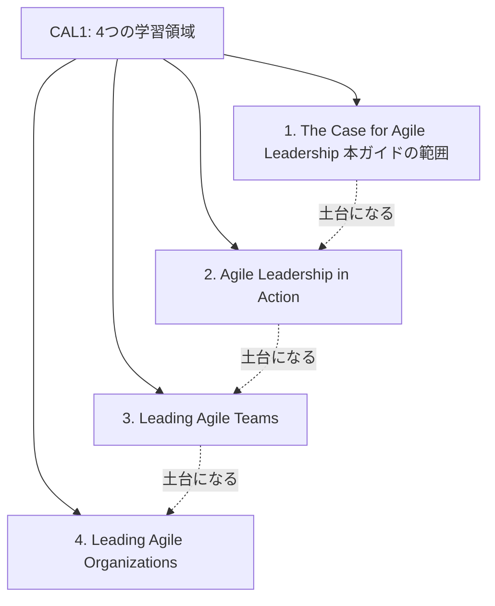
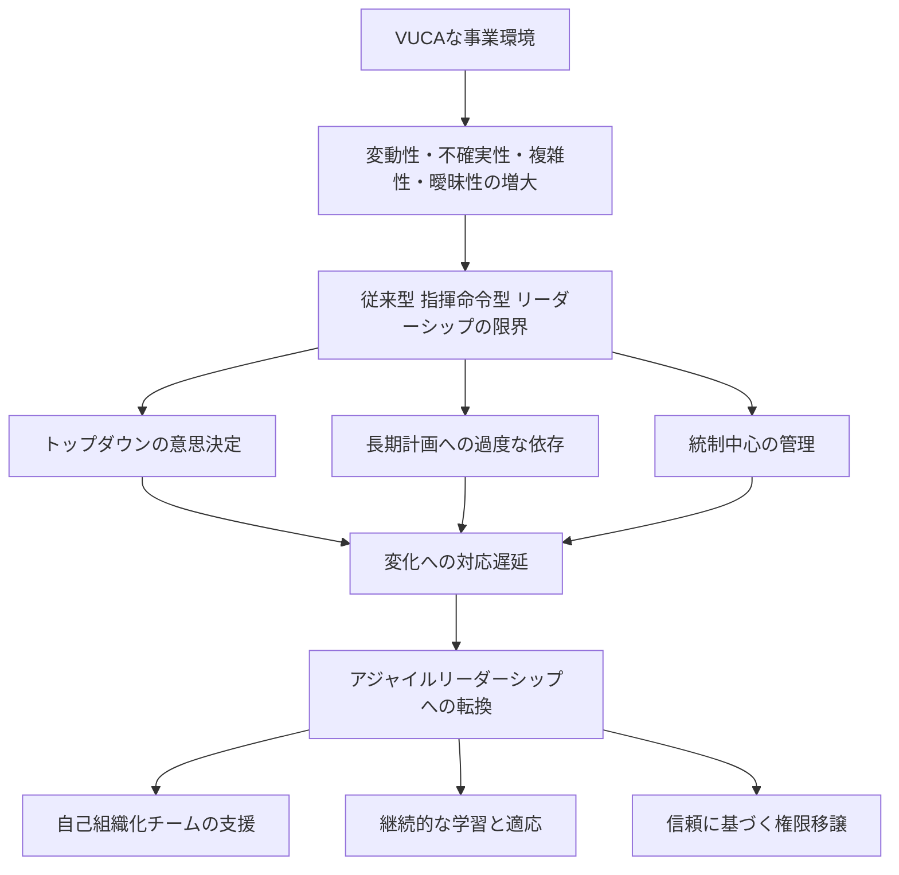
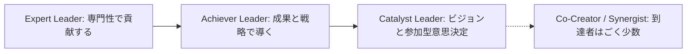
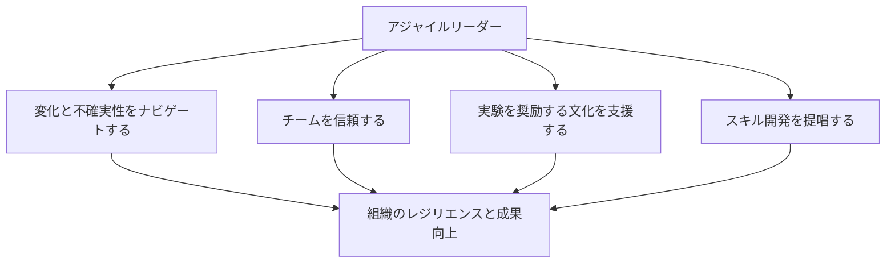
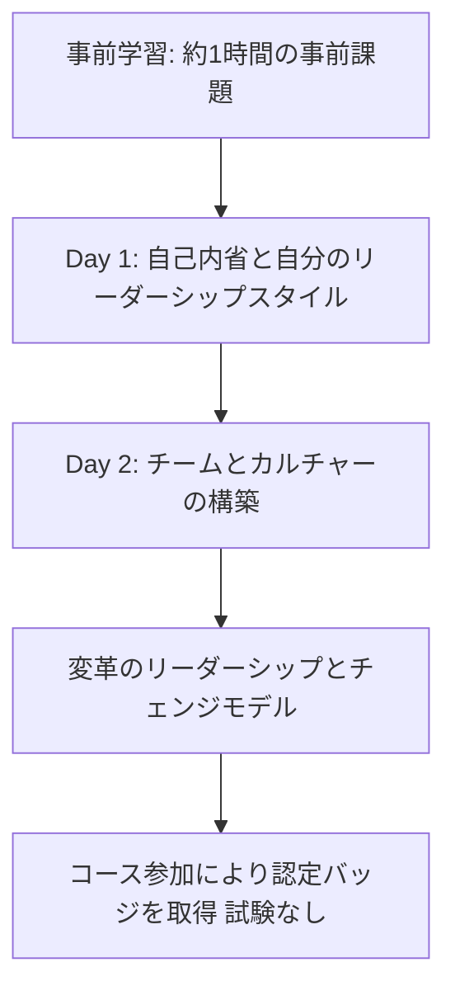

# CAL1 学習ガイド 第1章：アジャイルリーダーシップの必要性を理解する（The Case for Agile Leadership）

対象：Certified Agile Leader® 1（CAL 1™）の学習を始める初学者
本章の位置づけ：CAL1が定める4つの学習領域のうち「領域1：The Case for Agile Leadership」を、ステップバイステップで詳しく解説します。
図解方針：ASCIIアートは使用せず、フローチャートはすべてMermaid、表はすべてMarkdown記法で記載しています。

---

## 0. まずCAL1全体の中での位置づけを把握する

CAL1は、Scrum Allianceが認定する「アジャイルリーダー」向けの資格で、学習内容は、トレーニング提供元が公開している分類にならって4つの領域（Learning Objective Areas）に整理できます。第1章はその入り口にあたる領域で、残り3領域を学ぶための土台となる考え方を扱います。

| 学習領域 | 内容の要約 |
|---|---|
| **1. The Case for Agile Leadership（本ガイドの範囲）** | アジャイルリーダーシップが必要とされる理由と、求められるマインドセットの転換を理解する |
| 2. Agile Leadership in Action | リーダーシップフレームワークを実践に応用し、自分自身の効果性とチームの能力を高める |
| 3. Leading Agile Teams | 高パフォーマンスチームを構築・維持し、部門横断のコラボレーションを促す技術を学ぶ |
| 4. Leading Agile Organizations | 文化・組織構造・リーダーシップの相互作用を理解し、組織の変革を導く |

> **補足**
> CAL1には試験がありません。認定バッジを得るには、合計16時間程度（通常2〜3日間）のライブ研修（対面またはオンライン）に参加し、積極的に取り組むことが条件です。事前知識の前提条件は特にありませんが、アジャイル・スクラムの基礎を知っていると理解が深まります。
>
> **ソース**
> - [Certified Agile Leader® 1 (CAL 1™) | Scrum Alliance 公式ページ](https://www.scrumalliance.org/get-certified/agile-leader/cal-1)
> - [Certified Agile Leader® 1 (CAL 1) | PM-Partners（学習領域の4分類を掲載）](https://www.pm-partners.com.au/course/certified-agile-leader/)

---

## 1. なぜ今「アジャイルリーダーシップ」が必要なのか

### 1.1 VUCAな事業環境という背景

現代のビジネス環境は、Volatility（変動性）・Uncertainty（不確実性）・Complexity（複雑性）・Ambiguity（曖昧性）、いわゆる「VUCA」の度合いが年々高まっています。市場の変化速度、消費者の嗜好の移り変わり、パンデミックのような予測不能な出来事など、あらかじめ完全に計画しきることができない状況が常態化しています。

Scrum Allianceは、こうした環境下では「確実なのは不確実性そのものである」と表現し、リーダーが変化と不確実性を前提に意思決定する姿勢へ移行する必要があると述べています。

### 1.2 従来型リーダーシップの限界

従来の指揮命令型（command-and-control）のマネジメントスタイルは、比較的安定した環境では機能してきました。しかし、変化の速い競争環境では、次のような限界が表面化します。

- トップダウンの意思決定に時間がかかり、現場の変化に追いつけない
- 長期の詳細計画に固執し、計画からのズレを「失敗」として扱ってしまう
- 管理者が統制の中心になることで、現場の自律的な判断や創意工夫が抑制される

### 1.3 伝統的リーダーシップとアジャイルリーダーシップの対比

| 観点 | 伝統的リーダーシップ | アジャイルリーダーシップ |
|---|---|---|
| 計画の扱い | 年次の固定計画に沿って進める | 四半期程度の短いサイクルで見直しながら進める |
| 意思決定 | リーダーに権限が集中する | 現場のチームに権限を委譲し、自己組織化を支援する |
| 変化への態度 | 計画からの逸脱を避けるべきリスクと捉える | 変化を前提とし、素早く方向転換することを歓迎する |
| 失敗の扱い | 失敗は責任追及の対象になりやすい | 小さな失敗を許容し、学びに変える文化を育てる |
| リーダーの役割 | 指示を出し、進捗を管理する | ビジョンを共有し、チームの成長を支援する |
| フィードバック | 定期評価など低頻度 | 頻繁な対話とふりかえりによる高頻度なフィードバック |

> **ベストプラクティス**
> - まずは自組織の意思決定プロセスを棚卸しし、「どの決定に、どれくらいの時間がかかっているか」を可視化することから始める
> - 年次計画を廃止するのではなく、四半期単位のゴールに長期の方向性を紐づけ、短いサイクルで見直す運用に変えていく
> - 「計画通りに進んだか」ではなく「顧客・市場の変化に対応できたか」を評価軸に加える
>
> **ソース**
> - [What Makes You an Agile Leader? | Scrum Alliance](https://resources.scrumalliance.org/Article/makes-agile-leader)
> - [Agile Manifesto（アジャイル的な価値観の基礎として推奨されている一次情報）](https://agilemanifesto.org/)

---

## 2. アジャイルリーダーとは何か：求められるマインドセットシフト

Scrum Allianceの公式学習目標によれば、CAL1を通じて次のような視点の転換（マインドセットシフト）が期待されています。それぞれが「本章で扱う項目」にあたるため、1つずつ詳しく見ていきます。

| マインドセットシフトの項目 | 転換前（伝統的な前提） | 転換後（アジャイルな前提） |
|---|---|---|
| 何がリーダーを「アジャイル」にするのか | 権威・専門知識で導く | 自己認識と適応力で導く |
| アジャイルリーダーシップが重要な理由とタイミング | 常時ではなく危機発生時だけ意識する | 平時から継続的に実践する経営の前提とする |
| 変革（チェンジ）とトランスフォーメーションの導き方 | 一度きりの大規模プロジェクトとして扱う | 継続的な学習プロセスとして扱う |
| ビジネス全体へのアジャイル原則の適用 | ソフトウェア開発チームに限定する | 人事・財務・経営企画など全部門に応用する |
| 組織文化が与える影響 | 文化は所与のもので変えられない | 文化はリーダーの行動によって形づくられる |

> **補足**
> ここで扱う「アジャイル原則」は、もともとソフトウェア開発向けに書かれたAgile Manifesto（アジャイルソフトウェア開発宣言）に由来しますが、現在ではその価値観と原則が業種を問わず幅広い専門職に実践されています。CAL1の受講にあたり、アジャイルに馴染みがない場合はこの宣言に目を通しておくことが推奨されています。
>
> **ソース**
> - [Certified Agile Leader® 1 (CAL 1™) | Scrum Alliance 公式ページ（学習目標の一覧）](https://www.scrumalliance.org/get-certified/agile-leader/cal-1)
> - [CAL 1™ Learning Objectives（Scrum Alliance公開資料）](https://drive.google.com/file/d/1LpDNidfA_r6J2wFvgRhIWfPw_wEnqjiO/view)

---

## 3. なぜマインドセットの転換が必要なのか：リーダーシップ・アジリティ発展モデル

「なぜアジャイルリーダーシップが必要か」を裏づける理論的な柱として、CALプログラムの設計には、Bill JoinerとStephen Josephsによる書籍『Leadership Agility（邦題なし、2006年刊）』の発展段階モデルが取り入れられています。CALプログラム自体も、2015〜2016年にかけてPete Behrens氏らScrum Alliance関係者によって設計されており、この理論を土台の一つとしています。

### 3.1 モデルの全体像：5段階のリーダーシップ発展

Joiner & Josephsは、リーダーの発達段階を5段階（Expert／Achiever／Catalyst／Co-Creator／Synergist）に整理しました。CAL1では、実務上ほとんどのリーダーに当てはまる最初の3段階（Expert・Achiever・Catalyst）に焦点を当てて学びます。

| 段階 | 特徴 | 意思決定のスタイル |
|---|---|---|
| Expert Leader | 自分の専門性・技術的な正しさを拠りどころにする、管理者というより「上級担当者」に近い | 自分の専門知識に基づき指示する |
| Achiever Leader | 明確な目標設定と成果達成を重視し、戦略的に組織を動かす、いわゆる古典的な「マネジメント」の完成形 | 目標達成のために計画し、統制する |
| Catalyst Leader | ビジョンを描き、他者を巻き込む参加型の意思決定を行う。ここから「ポスト・ヒーロー型」のリーダーシップが始まる | ビジョンを共有し、チームと共に意思決定する |
| Co-Creator（発展段階） | 対等な関係性の中で共に新しい価値を創造する | 集合的な意思決定を主導する |
| Synergist（発展段階） | 組織を超えた大きな文脈で影響力を発揮する（到達者はごく少数で、Joiner & Josephs の調査では約1%とされる） | — |

### 3.2 なぜこのモデルが「アジャイルリーダーシップの必要性」の根拠になるのか

Expert・Achiever段階のリーダーシップは、タスク志向・結果志向であり、安定した環境では有効に機能します。しかし、変化が速く複雑な環境で組織全体を導くには、Catalyst段階以降に見られる「ビジョンの共有」「権限の分散」「集合知の活用」が不可欠になります。CAL1第1章は、この発展段階を自覚することが、アジャイルリーダーへの第一歩であると位置づけています。

> **ベストプラクティス**
> - 自分の意思決定を振り返り、「専門知識で押し切っていないか（Expert）」「目標達成だけを追っていないか（Achiever）」を定期的にセルフチェックする
> - 一足飛びにCatalyst段階を目指すのではなく、今の段階での強みを保ちながら、小さな場面から権限移譲やビジョン共有を試す
> - 360度フィードバックなど第三者からの評価を取り入れ、自己認識と他者評価のギャップを把握する
>
> **ソース**
> - [Leadership Agility: Five Levels of Mastery for Anticipating and Initiating Change（William B. Joiner, Stephen A. Josephs, 2006）](https://www.researchgate.net/publication/23318406_Leadership_agility)
> - [What is Leadership Agility? | Agile Leadership Journey（5段階モデルの解説）](https://www.agileleadershipjourney.com/leadership-journey/leadership-agility)
> - [Certified Agile Leadership Program Announced | InfoQ（CALプログラムの設計背景）](https://www.infoq.com/news/2016/08/certified-agile-leadership)

---

## 4. アジャイルリーダーの4つの重要な行動（ベストプラクティス集）

Scrum Allianceは、アジャイルリーダーに共通して見られる代表的な行動を4つに整理しています。これらは「アジャイルリーダーシップとは具体的に何をすることか」という問いへの実践的な答えであり、CAL1第1章の理解を行動レベルに落とし込むうえで重要な項目です。

### 4.1 変化と不確実性をナビゲートする

市場や競合、消費者行動は予測しづらく変化し続けます。アジャイルリーダーは、あらかじめ立てた計画に固執せず、必要に応じて計画を柔軟に組み替える姿勢を持ちます。

> **ベストプラクティス**
> - チームには「四半期先まで」の計画を、長期目標と紐づけた形で持たせる。その際、計画は状況に応じて変わりうることをステークホルダーにも明確に伝える
> - 四半期計画を1〜2週間ごとにステークホルダーと見直し、市場状況や顧客からのフィードバックに基づいて修正する場を設ける
> - チームに「作業内容を素早く修正してよい」という裁量を与える

### 4.2 チームを信頼する

アジャイルチームは、複雑な問題を自律的に解決し、迅速に方向転換できる能力を持っています。アジャイルリーダーは、意思決定・問題解決・フィードバックへの対応をチームに委ねる文化を組織に根づかせる役割を担います。

> **ベストプラクティス**
> - スプリントゴールなど、チームが自ら設定した目標に集中できるよう支援する
> - 部下に求める成果の「基準」を明確に伝えたうえで、進め方は本人たちに任せる
> - マイクロマネジメントを避け、進捗確認の頻度と粒度を最小限にとどめる

### 4.3 実験を奨励する文化を支援する

イノベーションは、失敗が許容される文化の中で生まれます。アジャイルリーダーは、すべての実験が成功するとは限らないという前提に立ち、失敗を罰しない仕組みをつくります。

> **ベストプラクティス**
> - リスクの低いプロジェクトから実験を始められるようにする
> - 小さく安価な実験からスタートし、成果が出た場合にのみ規模を拡大する（コストとリスクの抑制）
> - 実験がうまくいかなかった場合は、チームで結果を振り返り、次の打ち手を一緒に考える場を必ず設ける

### 4.4 スキル開発を提唱する

アジャイルリーダーは、自らのチームが専門性を高め続けられるよう、コーチングやメンタリング、成長機会の提供に力を注ぎます。

> **ベストプラクティス**
> - 自分に知見がある領域については、定期的な1on1コーチングの機会を設ける
> - 本来の職務範囲を超えた挑戦を認め、越境的な学びを後押しする
> - スキルアップや新しい学習のための研修機会を継続的に提供する
>
> **ソース**
> - [What Makes You an Agile Leader? | Scrum Alliance（4つの行動の一次情報）](https://resources.scrumalliance.org/Article/makes-agile-leader)

---

## 5. CAL1コースの構成を理解する（実務情報）

第1章の内容がコース全体でどう展開されるかを知っておくと、学習の見通しが立てやすくなります。

| 項目 | 内容 |
|---|---|
| 提供形式 | ライブ研修（対面またはオンライン）、Scrum Alliance認定トレーナーが提供 |
| 所要時間 | トレーナーとの合計16時間程度のライブ学習（多くは2〜3日構成） |
| 事前学習 ※ | 開始2週間前を目安に配布される事前課題（所要時間の目安：約1時間） |
| 教材 ※ | 参加者向けワークブックが提供される |
| 認定条件 | 試験はなく、合計16時間のコースに出席し積極的に参加することで認定バッジを取得 |
| 前提条件 | 必須の前提条件はないが、アジャイル・スクラムの基礎知識があると望ましい |
| 有効期間 | 認定は2年間有効。通常の更新ルートではScrum Education Units（SEU）の取得と更新料の支払いが必要。別ルートとして、Scrum Allianceの認定コースを新たに修了した場合は、SEUの提出も更新料の支払いも不要で自動更新される |
| 次のステップ | CAL1修了後、より発展的な内容を扱うCAL2に進むことができる |

> **※ 注記：全CAL1コース共通の要件と、提供元ごとに異なる運営情報の区別**
> Scrum Alliance が全CAL1コース共通として定めているのは、**合計16時間のライブ学習**・**試験なしの出席型認定**・
> **必須の前提条件なし**・**認定の2年間有効期間と更新の仕組み（SEU取得＋更新料の支払い、またはScrum Alliance認定コースの新規修了による自動更新）**である。
> 一方、**事前学習の有無・分量、教材（ワークブック）の提供、Day 1／Day 2の日程構成**は
> 認定トレーナー／研修提供元ごとに異なる。上表の ※ 付き項目と下図は
> **PM-Partners の提供例**であり、全コース共通の要件ではない。受講前に各提供元の案内を確認すること。

コースの内容構成をもう少し詳しく見ると、次のような流れになっています（以下はPM-Partnersの提供例であり、日程配分や扱う順序はトレーナーにより異なる）。

- **Day 1**：自己内省が中心。自分自身の価値観・信念、そして自分がリーダーとしてどのように振る舞っているか（"show up" しているか）を見つめ直し、アジャイルチームを支援するための行動やスキルを養う
- **Day 2**：高パフォーマンスなチームの構築と維持に焦点が移る。アジャイルと親和性の高い組織文化の土台、そしてアジャイルな環境に適応させるべきプロセス・ポリシー・ガバナンスのあり方を扱う
- **締めくくり**：変革（チェンジ）のリーディングについて深掘りし、さまざまなチェンジモデルや、アジャイルトランスフォーメーションにおける課題について議論する

> **補足**
> CAL1は「Scrum masters（スクラムマスター）」「Leaders（リーダー）」「Managers（マネージャー）」「Senior directors（シニアディレクター）」「C-suite executives（経営幹部）」「Coaches and consultants（コーチ・コンサルタント）」など、人を率いる、または率いたいと考えるすべての人を対象としています。
>
> **ソース**
> - [Certified Agile Leader® 1 (CAL 1™) | Scrum Alliance 公式ページ](https://www.scrumalliance.org/get-certified/agile-leader/cal-1)
> - [Certified Agile Leader® 1 (CAL 1) | PM-Partners（Day1/Day2の内容構成）](https://www.pm-partners.com.au/course/certified-agile-leader/)

---

## 6. 初学者向け：第1章をステップバイステップで学ぶロードマップ

CAL1第1章の内容を体系立てて自分のものにするための学習ステップです。順番に取り組むことを推奨します。

| ステップ | やること | 目的 |
|---|---|---|
| Step 1 | アジャイルに馴染みがない場合はAgile Manifestoに目を通す | アジャイルな価値観・原則の共通言語を持つ |
| Step 2 | 「1.3 伝統的リーダーシップとアジャイルリーダーシップの対比」表を使い、自組織の現状に印をつける | 自分の組織がどちら寄りかを可視化する |
| Step 3 | 「3.1 リーダーシップ・アジリティ発展モデル」を参照し、自分がExpert・Achiever・Catalystのどの傾向が強いか内省する | 自己認識を高め、成長の方向性を定める |
| Step 4 | 「4. アジャイルリーダーの4つの重要な行動」のベストプラクティスから、今すぐ試せるものを1つ選ぶ | 学びを小さな行動に変換する |
| Step 5 | 選んだ行動を、低リスクな場面（例：1つのチーム、1つのプロジェクト）で試してみる | 実験を通じて学習する（4.3の実践） |
| Step 6 | 実践後にチームとふりかえりを行い、うまくいった点・いかなかった点を共有する | 学びを次のサイクルに反映する |

> **ベストプラクティス**
> - 一度にすべての行動を変えようとせず、まずは1つの行動に絞って小さく始める
> - 学んだ内容を自分の言葉でチームに説明してみることで、理解の抜け漏れに気づきやすくなる
> - CAL1コースの事前課題（Pre-course work）は、本章の内容を実務に接続する良い機会なので早めに着手する

---

## 7. 理解度チェックリスト

次の問いに自分の言葉で答えられれば、第1章の要点を押さえられています。

- なぜ現代のビジネス環境において、従来型の指揮命令型リーダーシップだけでは不十分なのか説明できるか
- 伝統的リーダーシップとアジャイルリーダーシップの違いを、計画・意思決定・失敗への向き合い方の観点から説明できるか
- Expert・Achiever・Catalystという3つのリーダーシップ段階の違いを、自分の言葉で説明できるか
- アジャイルリーダーに共通する4つの行動（変化への対応・信頼・実験文化・スキル開発）を、それぞれ具体例とともに挙げられるか
- CAL1コースの全体構成（Day1・Day2・認定条件）を説明できるか

---

## 8. まとめ

- アジャイルリーダーシップは、VUCAな環境で組織が生き残り、成長し続けるために必要とされている
- 従来の指揮命令型リーダーシップは、変化への対応速度・現場の自律性という点で限界がある
- Joiner & Josephsのリーダーシップ・アジリティモデル（Expert → Achiever → Catalyst）は、アジャイルリーダーシップが目指す成長の方向性を示す理論的な裏づけになっている
- アジャイルリーダーの実践は、「変化への対応」「信頼」「実験文化」「スキル開発」という4つの具体的な行動に集約できる
- CAL1第1章はマインドセットの土台であり、以降の領域2〜4（フレームワークの実践、チームづくり、組織づくり）の学習を支える

---

## 9. 参考文献・ソース一覧

| 資料名 | 発行元 | URL |
|---|---|---|
| Certified Agile Leader® 1 (CAL 1™) | Scrum Alliance 公式ページ | https://www.scrumalliance.org/get-certified/agile-leader/cal-1 |
| CAL 1™ Learning Objectives | Scrum Alliance公開資料 | https://drive.google.com/file/d/1LpDNidfA_r6J2wFvgRhIWfPw_wEnqjiO/view |
| Certified Agile Leader® 1 (CAL 1) | PM-Partners（学習領域4分類とDay1/Day2構成） | https://www.pm-partners.com.au/course/certified-agile-leader/ |
| What Makes You an Agile Leader? | Scrum Alliance | https://resources.scrumalliance.org/Article/makes-agile-leader |
| Agile Manifesto（アジャイルソフトウェア開発宣言） | Kent Beck ほか16名（署名者は Kent Beck を含む計17名） | https://agilemanifesto.org/ |
| Leadership Agility: Five Levels of Mastery for Anticipating and Initiating Change（Joiner & Josephs, 2006） | ResearchGate | https://www.researchgate.net/publication/23318406_Leadership_agility |
| What is Leadership Agility? | Agile Leadership Journey | https://www.agileleadershipjourney.com/leadership-journey/leadership-agility |
| Certified Agile Leadership Program Announced | InfoQ（CALプログラムの設計背景） | https://www.infoq.com/news/2016/08/certified-agile-leadership |
| Certified Agile Leadership | InfoQ（日本語版インタビュー、Pete Behrens氏） | https://www.infoq.com/jp/news/2016/10/certified-agile-leadership |
| Skills in the New World of Work Report 2023（資格保有者への給与プレミアムに関する調査） | Scrum Alliance / Business Agility Institute | https://6606649.fs1.hubspotusercontent-na1.net/hubfs/6606649/Skills%20in%20the%20New%20World%20of%20Work%20Report%202023.pdf |
