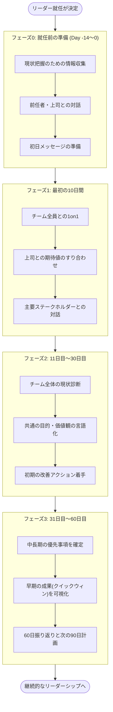
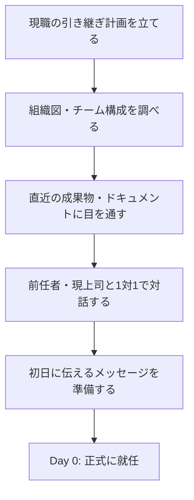
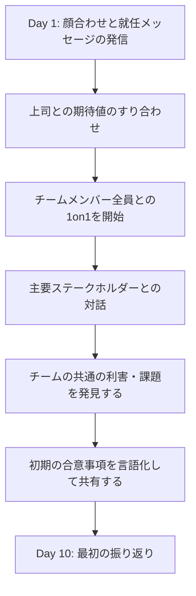
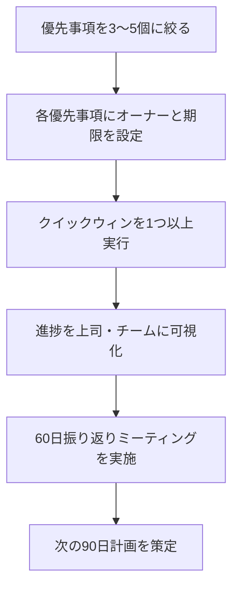

# リーダーとしての最初の60日間 ― 初学者向けステップバイステップガイド

> エンジニアリングチームのリーダー(テックリード・エンジニアリングマネージャー・スクラムマスターなど)に初めて就任する人のための実践ガイドです。世界的に評価の高いリーダーシップ論と、著名なエンジニアリングリーダーたちの実体験に基づくベストプラクティスを、ステップバイステップで解説します。

---

## 目次

1. [はじめに:なぜ「最初の60日間」が重要なのか](#1-はじめになぜ最初の60日間が重要なのか)
2. [全体像:60日間のロードマップ](#2-全体像60日間のロードマップ)
3. [土台となる考え方](#3-土台となる考え方)
4. [フェーズ0:就任前の準備(Day -14〜0)](#4-フェーズ0就任前の準備day-140)
5. [フェーズ1:最初の10日間 ― オープニング・ギャンビット](#5-フェーズ1最初の10日間--オープニングギャンビット)
6. [フェーズ2:11日目〜30日目 ― 一体感と一貫性をつくる](#6-フェーズ211日目30日目--一体感と一貫性をつくる)
7. [フェーズ3:31日目〜60日目 ― アジェンダを始動する](#7-フェーズ331日目60日目--アジェンダを始動する)
8. [1on1ミーティングのベストプラクティス](#8-1on1ミーティングのベストプラクティス)
9. [心理的安全性:チームの土台をつくる](#9-心理的安全性チームの土台をつくる)
10. [AIを思考パートナーとして活用する](#10-aiを思考パートナーとして活用する)
11. [よくある失敗とその回避策](#11-よくある失敗とその回避策)
12. [60日間チェックリスト](#12-60日間チェックリスト)
13. [まとめ](#13-まとめ)
14. [参考文献・出典](#14-参考文献出典)

---

## 1. はじめに:なぜ「最初の60日間」が重要なのか

エンジニアからテックリードへ、シニアエンジニアからエンジニアリングマネージャーへ ── 個人としての成果を出す立場から、他者を通じて成果を出す立場への移行は、キャリアの中でも最も大きな転換点の一つです。

Harvard大学の教育者であるEric McNulty氏は、著書『Your First 60 Days as a Leader』(O'Reilly, 2026年8月刊)の中で、新任リーダーが直面するあらゆるやり取り(上司・チーム・主要ステークホルダーとの対話)を「重要な交渉(critical negotiations)」として捉え、就任前の準備から最初の10日間・30日間・60日間へと段階的に進む「利害に基づく交渉(interest-based negotiation)」のアプローチを提示しています。

同様に、リーダーシップ移行研究の第一人者であるMichael Watkins氏は、ベストセラー『The First 90 Days』の中で、「新しい役職に就いてからの数か月間の行動が、その後の成功・失敗を大きく左右する」と述べ、体系的な移行戦略の必要性を説いています。

> **ポイント**: 最初の60〜90日間は「猶予期間」ではなく「土台工事の期間」です。この期間にチームとの信頼関係・情報・期待値のすり合わせを怠ると、後から取り戻すコストは何倍にも膨れ上がります。

このガイドでは、これらの考え方をエンジニアリングチームの現場(スプリント、コードレビュー、オンコール、技術的負債など)に落とし込み、初学者でも迷わず実践できるステップバイステップの手順として整理します。

---

## 2. 全体像:60日間のロードマップ

まず全体像を掴みましょう。60日間は大きく4つのフェーズに分かれます。

各フェーズの目的を一言でまとめると、次のようになります。

| フェーズ | 期間 | 一言でいうと | 主な問い |
|---|---|---|---|
| フェーズ0 | 就任前(〜Day 0) | 助走をつける | 何を知っておくべきか? |
| フェーズ1 | Day 1〜10 | 聴く・つながる | このチーム・組織は何を大事にしているか? |
| フェーズ2 | Day 11〜30 | 診断し、揃える | チームの現状と目指す姿のギャップは? |
| フェーズ3 | Day 31〜60 | 動かし、示す | 何から着手し、何を示すべきか? |

---

## 3. 土台となる考え方

具体的なアクションに入る前に、共通して使われる3つの基礎フレームワークを押さえておきましょう。

### 3-1. リードすることとマネジメントすることの違い

新任リーダーがまず理解すべきなのは、「マネジメント(管理)」と「リーダーシップ(先導)」は似て非なるものだという点です。

| 観点 | マネジメント | リーダーシップ |
|---|---|---|
| 焦点 | 既存の仕組みを回す(計画・予算・進捗管理) | 方向性を示し、変化を起こす |
| 時間軸 | 短期〜中期(スプリント、四半期) | 中期〜長期(チームのビジョン) |
| 典型的な行為 | タスク割り当て、進捗確認、リスク管理 | ビジョンの言語化、動機づけ、信頼構築 |
| エンジニアリングでの例 | スプリント計画、バグトリアージ | 技術戦略の策定、チーム文化の醸成 |

新任リーダーの多くは「マネジメントの技術」(1on1のやり方、スプリント運営など)から入りますが、**最初の60日間で「リーダーシップの土台」(信頼・方向性・共通理解)を築けるかどうかが、その後の成否を分けます。**

### 3-2. STARSモデルで「自分が置かれた状況」を診断する

Michael Watkinsが提唱する **STARSモデル** は、新しい役割で最初に行うべき「状況診断」のためのフレームワークです。自分のチームが今どの状態にあるかを見極めることで、取るべきアプローチが変わります。

| 状況 | 特徴 | エンジニアリングチームでの例 | 求められるリーダーの姿勢 |
|---|---|---|---|
| **S**tart-up(立ち上げ) | 何もないところから作る | 新規プロダクトのチーム組成 | ゼロから仕組みと文化を設計する |
| **T**urnaround(立て直し) | 深刻な問題を抱えている | 障害多発・納期遅延が続くチーム | 迅速な診断と痛みを伴う意思決定 |
| **A**ccelerated growth(急成長) | 順調だが急拡大中 | ユーザー急増でスケールが必要なチーム | 採用・プロセス整備を並行して進める |
| **R**ealignment(再調整) | 健全だが方向性がズレている | 技術的には強いが優先順位が噛み合わないチーム | 目的の再言語化とすり合わせ |
| **S**ustaining success(成功の維持) | すでに高成果を出している | 安定運用中の成熟したプロダクトチーム | 現状維持に安住せず次の課題を見つける |

> 実務上のコツ: 担当するチームやプロジェクトが必ずしも1つの状況に綺麗に当てはまるとは限りません。「このプロジェクトはTurnaroundだが、あのプロジェクトはSustaining successだ」というように、**担当領域ごとにSTARSを当てはめて優先順位をつける**のが実践的です。

### 3-3. 利害に基づく交渉のマインドセット

McNulty氏が提示する枠組みの核心は、リーダーとしての対話を「指示を出す/従わせる」関係ではなく、**「共有された利害(shared interests)から出発し、合意された方向性・成果・マイルストーンへ向かう交渉」**として捉え直すことです。

具体的には、上司・チームメンバー・他部門のステークホルダーそれぞれと対話する際に、次の順序で考えます。

1. **相手の利害を理解する** ― 相手は何を達成したいのか、何を恐れているのか
2. **自分の利害を明確にする** ― 自分がこの役割で成し遂げたいことは何か
3. **共通の土台を見つける** ― 双方にとって価値のある着地点はどこか
4. **具体的な合意に落とす** ― 方向性・期待される成果・確認のタイミング(マイルストーン)を明文化する

この考え方は、上司との期待値合わせ(フェーズ1)からチーム全体のビジョン策定(フェーズ2)まで、このガイド全体を貫く基本姿勢です。

---

## 4. フェーズ0:就任前の準備(Day -14〜0)

「Start Before You Begin(始める前に始めよ)」という言葉が示すとおり、正式な就任日より前にできる準備は数多くあります。

### やるべきこと

- **クリーンブレイクを意識する**: 前の役割の業務を計画的に引き継ぎ、新しい役割に集中できる状態を作る
- **公開情報を読み込む**: 直近のスプリントレビュー資料、アーキテクチャドキュメント、障害post-mortem、OKR/ロードマップなど
- **前任者・現在の上司と対話する**: なぜこの役割が必要とされているのか、チームが抱える既知の課題は何か
- **自分の強み・弱みを棚卸しする**: 新しい役割で伸ばすべきスキルと、意識的に手放すべき「元の役割の癖」(例:コードを書くことに逃げ込まない)を整理する
- **学習アジェンダを作る**: 「最初の30日間で何を理解しておきたいか」を箇条書きにしておく

### 避けるべきこと

- 前の役割の未完了タスクを引きずったまま新しい役割に入る
- 「自分は技術に詳しいから大丈夫」という思い込みだけで、組織や人間関係の学習を後回しにする

---

## 5. フェーズ1:最初の10日間 ― オープニング・ギャンビット

最初の10日間は「聴くこと」に徹する期間です。この時期の目標は、**信頼の土台を作ること**と**期待値をすり合わせること**の2つに集約されます。

### ステップ1: 上司との「5つの対話」を行う

Michael Watkinsが提唱する「5つの重要な対話」は、上司との関係構築における実践的なチェックリストです。

| 対話のテーマ | 確認すべきこと |
|---|---|
| ① 状況の診断 | このチーム・プロジェクトの現状について、上司と自分の見立てが一致しているか |
| ② 期待値 | 30日・60日・90日それぞれで何を達成すれば「成功」とみなされるか |
| ③ スタイル | 上司はどのくらいの頻度・粒度で報告を求めるか。意思決定にどこまで関与したいか |
| ④ リソース | 予算・人員・ツールなど、成果を出すために何が必要で、何が不足しているか |
| ⑤ 個人の成長 | 自分自身の弱みや伸ばしたい部分について、率直にフィードバックをもらえる関係を作れているか |

### ステップ2: チームメンバー全員と1対1で対話する

エンジニアリングリーダーとして最初にやるべき最も重要なアクションの一つが、**チームメンバー全員との個別対話**です。目的は評価ではなく「知ること」です。

代表的な質問例:

- 今、あなたが最も誇りに思っている仕事は何ですか?
- チームがもっとうまくいくために、変えたほうがいいと思うことは何ですか?
- 私(新任リーダー)に、最初に知っておいてほしいことは何ですか?
- あなたのキャリアで、次に挑戦したいことは何ですか?

### ステップ3: 主要ステークホルダーとの対話

プロダクトマネージャー、隣接チームのリード、QA、SRE/インフラチームなど、日常的に連携する相手とも早期に接点を持ちます。ここでも「利害に基づく交渉」の考え方(3-3節)を使い、相手が何を期待しているかを丁寧に聞き取ります。

### この時期の心得

- **早すぎる変更は避ける**: 就任1週間で大きな方針転換を打ち出すと、チームの信頼を得る前に反発を招きやすい
- **傾聴と観察を優先する**: 「答えを持ち込む人」ではなく「問いを持ち込む人」として現れる
- **小さな約束を守る**: 「確認して明日までに返します」と言ったら必ず守る。信頼は小さな一貫性の積み重ねから生まれる

---

## 6. フェーズ2:11日目〜30日目 ― 一体感と一貫性をつくる

最初の10日間の対話で得た情報をもとに、チーム全体としての一体感(cohesion)と一貫性(coherence)を作っていく段階です。

### ステップ1: チームの現状を「構造化して」診断する

個別の1on1で聞いた声を、パターンとして整理します。エンジニアリングチームであれば、次のような軸で整理すると実務に落とし込みやすくなります。

| 診断軸 | 確認するポイント |
|---|---|
| 技術的な健全性 | 技術的負債の量、テストカバレッジ、デプロイ頻度、障害対応の仕組み |
| プロセスの健全性 | スプリント運営、見積もりの精度、レビューのボトルネック |
| 人・関係性の健全性 | チーム内の信頼関係、燃え尽きの兆候、キャリアへの不満 |
| 組織との整合性 | チームの目標が会社全体の目標とどれだけ揃っているか |

### ステップ2: 共通の目的・価値観を言語化する

個々のメンバーの声を集約し、「このチームは何のために存在し、何を大切にするのか」をチームと一緒に言語化します。トップダウンで押し付けるのではなく、チームディスカッション(例: ワーキングアグリーメントの策定ワークショップ)を通じて合意形成することが重要です。

### ステップ3: 小さな改善アクションに着手する

いきなり大きな変革を狙うのではなく、**チームが「変化は前向きなものだ」と実感できる小さな改善**から始めます。

- 例: 形骸化していた定例会議を1つ廃止する
- 例: コードレビューのSLA(何時間以内に一次レスポンスをするか)を明文化する
- 例: オンコール対応後に必ず休息を取れるようローテーションを見直す

### この時期の心得

- チームの声を「聞きっぱなし」にしない。何を聞いて、何を変え、何を変えないのかを必ずフィードバックする
- 一貫したメッセージを、チーム内・チーム外の両方に発信し続ける

---

## 7. フェーズ3:31日目〜60日目 ― アジェンダを始動する

信頼と共通理解の土台ができたところで、いよいよ自分自身のアジェンダ(中長期の優先事項)を動かし始める段階です。

### ステップ1: 優先事項を絞り込む

フェーズ2までに集めた情報をもとに、次の90日〜半年で取り組むべき優先事項を3〜5個程度に絞り込みます。多くを同時に狙いすぎないことが重要です。

### ステップ2: 早期の成果(クイックウィン)を可視化する

早い段階で目に見える成果を出すことは、リーダーとしての信頼を積み上げるうえで非常に効果的です。ただし、クイックウィンは**チームが大切にしている課題**と結びついている必要があります。単なる「見栄えのいい実績作り」は逆効果です。

### ステップ3: 60日間を振り返り、次の90日計画に接続する

60日目のタイミングで、次のような振り返りを行います。

- 上司との期待値は当初の合意と比べてどう変化したか
- チームからのフィードバックはどう変わったか(1on1やアンケートで確認)
- 診断した課題のうち、着手できたもの・できなかったものは何か
- 次の30日間(=90日目まで)で焦点を当てるべきことは何か

---

## 8. 1on1ミーティングのベストプラクティス

1on1は、このガイド全体を通じて最も重要な「道具」です。Camille Fournierが著書『The Manager's Path』の中で紹介している、あるエンジニアリングリーダーの言葉が象徴的です。定期的な1on1を怠ることは、オイル交換を怠って車を走らせ続けるようなものであり、最悪のタイミングで問題が表面化するリスクを高めます。

### 実践のポイント

| 項目 | 推奨プラクティス |
|---|---|
| 頻度 | 最低でも週1回、30分程度 |
| 主導権 | メンバー側が話したいことを話す時間にする(進捗報告の場にしない) |
| 進め方 | メンバーに答えを与えるのではなく、問いかけて本人に考えさせる |
| 記録 | 話した内容と次のアクションを簡単にメモし、次回参照できるようにする |
| 頻度の調整 | 慣れてきたら、メンバーの状況に応じて頻度・スタイルを調整する |

### 質問のフレームワーク例

1. **今、何が一番気になっていますか?**(Identify)
2. **理想の状態はどんなものですか? 何が障害になっていますか?**(Understand)
3. **私にできるサポートは何ですか?**(Support)

---

## 9. 心理的安全性:チームの土台をつくる

Googleが2012年から実施した大規模調査「Project Aristotle」は、180のチームと250以上の要素を分析し、**チームの効果性を最も強く左右する要因は、個々のメンバーの能力ではなく「心理的安全性」である**という結論を導き出しました。心理的安全性とは、Harvard Business SchoolのAmy Edmondson教授が定義した「対人関係においてリスクを取っても安全だとチームメンバーが共有して信じている状態」を指します。

この調査では、心理的安全性に加えて次の4つの要因も、効果的なチームに共通する特徴として挙げられています。

| 要因 | 内容 |
|---|---|
| 心理的安全性 | 失敗や質問をしても、恥をかいたり罰せられたりしないと感じられること |
| 相互信頼性 | メンバーが期限内に質の高い仕事を仕上げると信頼できること |
| 構造と明確さ | 役割・計画・目標が明確であること |
| 仕事の意味 | 個々人にとって仕事に意味を見出せること |
| インパクト | 自分の仕事が組織やチームに与える影響を実感できること |

### 新任リーダーが最初の60日間でできること

- 自分自身が率先して「わからないことはわからない」と言う
- 失敗を個人の責任追及ではなく、学習の機会として扱う(post-mortemを「誰が悪いか」ではなく「何が起きたか」で進める)
- チームメンバー全員が発言できるよう、会議のファシリテーションを工夫する(発言の偏りに気を配る)

---

## 10. AIを思考パートナーとして活用する

近年のリーダーシップ論(McNulty氏の著書でも1章が割かれています)では、AIを「意思決定を代行させる道具」としてではなく、**難しい対話や意思決定に備えるための壁打ち相手(thought partner)**として活用することが提案されています。

### 具体的な活用例

- **難しい対話のロールプレイ**: 「パフォーマンスが低下しているメンバーへのフィードバック」を伝える前に、想定される反応をシミュレーションする
- **コンティンジェンシープランの作成**: ある意思決定がうまくいかなかった場合の代替シナリオを一緒に洗い出す
- **1on1の準備**: メンバーごとの背景情報を整理し、聞くべき質問の候補をブレインストーミングする
- **文章のドラフト作成**: チーム向けのビジョンステートメントやワーキングアグリーメントの草案を作り、自分の言葉で磨き上げる土台にする

> 注意点: AIはあくまで「準備」のための壁打ち相手であり、最終的な判断や、メンバーとの関係構築そのものを代替するものではありません。

---

## 11. よくある失敗とその回避策

複数の著名なエンジニアリングリーダーの発信(LeadDevに寄稿された新任マネージャーの体験談など)に共通して挙げられる失敗パターンを整理しました。

| よくある失敗 | なぜ起きるか | 回避策 |
|---|---|---|
| 期待値のすり合わせ不足 | 「言わなくても伝わっているはず」という思い込み | 期待値は暗黙のうちに存在してしまうものと理解し、明示的に会話する |
| 技術的な仕事に逃げ込む | マネジメントの不確実性より、コードを書く方が「得意で安心」だから | 自分の役割の変化を受け入れ、意図的に委譲する |
| 早すぎる大改革 | 早く成果を出したい焦り | 信頼構築(フェーズ1・2)を先に済ませる |
| 1on1の形骸化 | 忙しさを理由に後回しにする | 1on1を「削減可能な会議」ではなく「最優先の投資」と位置づける |
| フィードバックを聞きっぱなしにする | 拾った声にどう対応したか報告し忘れる | 「聞いたこと」「変えたこと」「変えない理由」を必ず可視化する |
| 自分がすべての決定をしようとする | マイクロマネジメントに陥りやすい | チームの目標を明確にし、詳細な意思決定は委譲する |

---

## 12. 60日間チェックリスト

| フェーズ | チェック項目 |
|---|---|
| フェーズ0(就任前) | ☐ 組織図・直近ドキュメントを読み込んだ |
| フェーズ0(就任前) | ☐ 前任者・現上司と対話した |
| フェーズ0(就任前) | ☐ 初日メッセージを準備した |
| フェーズ1(Day 1-10) | ☐ 上司との「5つの対話」を実施した |
| フェーズ1(Day 1-10) | ☐ チーム全員と1対1の対話を実施した |
| フェーズ1(Day 1-10) | ☐ 主要ステークホルダーと接点を持った |
| フェーズ2(Day 11-30) | ☐ チームの現状を構造化して診断した |
| フェーズ2(Day 11-30) | ☐ チームの目的・価値観を言語化した |
| フェーズ2(Day 11-30) | ☐ 小さな改善アクションに着手した |
| フェーズ3(Day 31-60) | ☐ 中長期の優先事項を3〜5個に絞った |
| フェーズ3(Day 31-60) | ☐ クイックウィンを1つ以上実行した |
| フェーズ3(Day 31-60) | ☐ 60日振り返りを実施し、次の90日計画を立てた |

---

## 13. まとめ

新任リーダーとしての最初の60日間は、**「聴く」→「診断し、揃える」→「動かし、示す」**という3段階のプロセスとして捉えることができます。この流れの根底にあるのは、指示や管理ではなく、**利害に基づく対話を通じて信頼と共通理解を築く**という姿勢です。

技術力に加えて、STARSモデルによる状況診断、丁寧な1on1、心理的安全性の醸成といった「人と組織を動かす技術」を身につけることが、エンジニアからリーダーへの移行を成功させる鍵となります。焦らず、しかし意図を持って、この60日間を過ごしてください。

---

## 14. 参考文献・出典

本ガイドは以下の情報源を基に作成しています(2026年8月19日時点でアクセス確認済み)。特に国際的に著名なエンジニアリングリーダー・研究者の発信を優先的に参照しました。

1. Eric J. McNulty, *Your First 60 Days as a Leader*, O'Reilly Media (2026年8月刊・概要ページ)
   https://www.oreilly.com/library/view/your-first-60/0642572367008/

2. LeadDev, "Your 30-60-90-day plan as a new manager"
   https://leaddev.com/career-development/your-30-60-90-day-plan-new-manager

3. LeadDev, "Learnings from my first 90 days as an engineering manager"
   https://leaddev.com/skills-new-managers/learnings-my-first-90-days-engineering-manager

4. LeadDev, "Four mistakes I made as a new manager"
   https://leaddev.com/skills-new-managers/four-mistakes-i-made-new-manager

5. Camille Fournier(元Rent the Runway CTO、『The Manager's Path』著者)に関する要約記事
   https://getlighthouse.com/blog/camille-fournier-lessons-managers-path/

6. Camille Fournier, "Following The Manager's Path"(著者本人によるMedium投稿)
   https://skamille.medium.com/following-the-managers-path-50e184cde1ff

7. Julie Zhuo(元Facebook VP of Product Design), *The Making of a Manager* 公式ページ
   https://www.juliezhuo.com/book/manager.html

8. Julie Zhuoへのインタビューに基づく要約記事, "Becoming a Manager: What to do When Everyone Looks to You"
   https://thefutureorganization.com/becoming-a-manager-what-to-do-when-everyone-looks-to-you/

9. Michael Watkins, *The First 90 Days* 要約(STARSモデル・5つの対話の解説)
   https://readingraphics.com/book-summary-the-first-90-days/

10. Google re:Work, "Understand team effectiveness"(Project Aristotle公式ガイド)
    https://rework.withgoogle.com/intl/en/guides/understand-team-effectiveness

11. Pat Kua(元ThoughtWorks Chief Scientist、国際的なエンジニアリングリーダーシップコンサルタント), "Using Project Aristotle To Build Highly Effective Teams"
    https://www.patkua.com/blog/project-aristotle/

12. Sai Emani, "Your first 90 days as an engineering manager"
    https://www.crackingtheeminterview.com/p/your-first-90-days-as-an-engineering

> 注記: 出典1(O'Reilly掲載ページ)は書籍の概要・目次情報のみを参照しており、本文の詳細(会員限定コンテンツ)は含んでいません。各出典の詳細な内容については、リンク先を直接ご確認ください。
