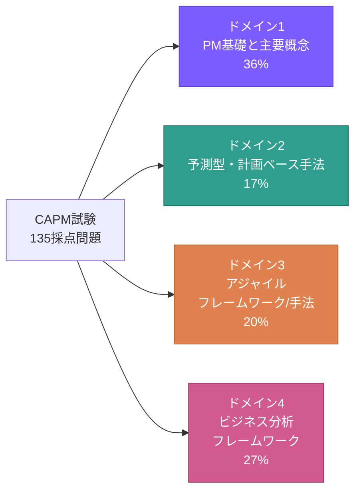
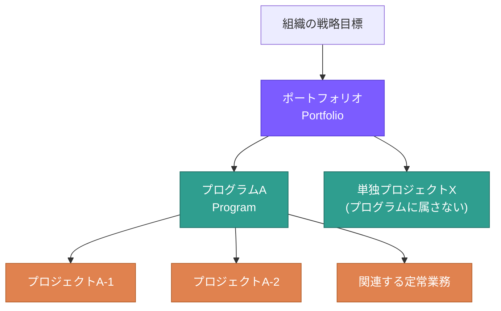
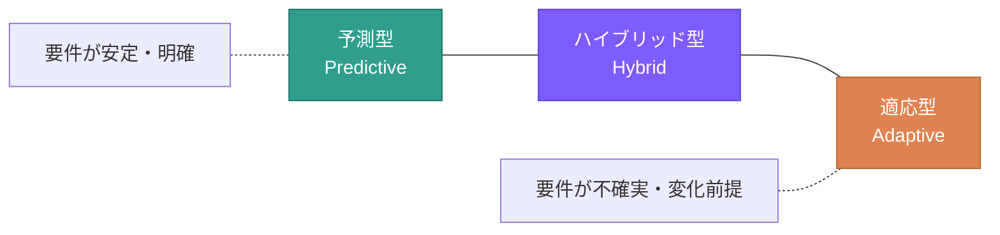
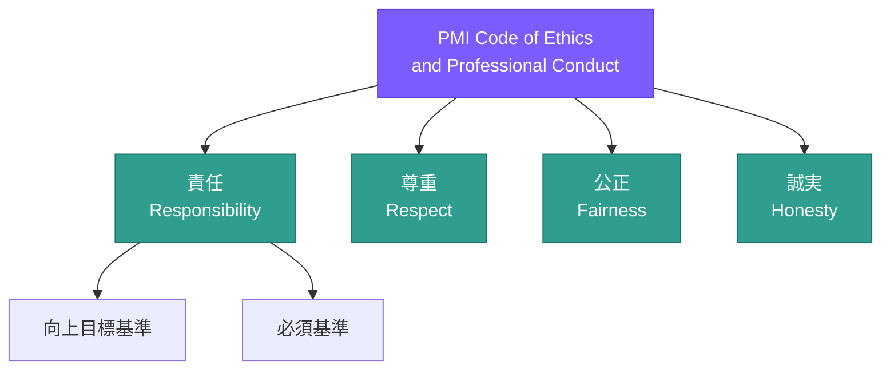
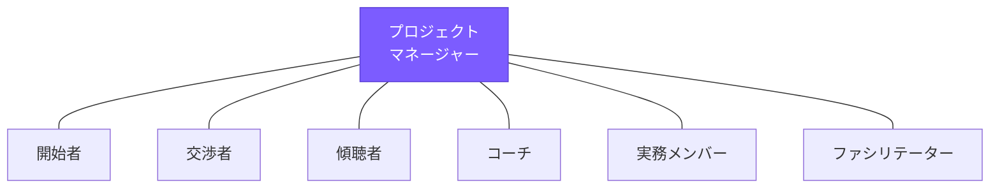

# CAPM® ドメイン1: Project Management Fundamentals and Core Concepts(プロジェクトマネジメント基礎と主要概念) 完全ガイド

> 本ガイドは、PMI(Project Management Institute)が公開する CAPM® Exam Content Outline(ECO)に基づき、CAPM試験のドメイン1(配点36%・4ドメイン中最大)を初学者向けにステップバイステップで解説するものです。各項目には根拠となる出典URLを付記しています。

---

## 目次

1. [CAPM試験の全体像](#0-capm試験の全体像)
2. [ドメイン1の構造](#1-ドメイン1の構造)
3. [Task 1: プロジェクトのライフサイクルとプロセスの理解](#task-1-プロジェクトのライフサイクルとプロセスの理解)
4. [Task 2: プロジェクトマネジメント計画の理解](#task-2-プロジェクトマネジメント計画の理解)
5. [Task 3: プロジェクトの役割と責任の理解](#task-3-プロジェクトの役割と責任の理解)
6. [Task 4: 計画された戦略・フレームワークの実行方法の決定](#task-4-計画された戦略フレームワークの実行方法の決定)
7. [Task 5: 一般的な問題解決ツールと技法の理解](#task-5-一般的な問題解決ツールと技法の理解)
8. [ドメイン1 学習・試験対策のベストプラクティス](#2-ドメイン1-学習試験対策のベストプラクティス)
9. [参考文献・出典](#3-参考文献出典references)

---

## 0. CAPM試験の全体像

### 0.1 試験概要

| 項目 | 内容 |
|---|---|
| 出題数 | 150問(採点対象135問 + プレテスト〈非採点〉15問) |
| 試験時間 | 180分(3時間)、75問終了時点で10分の休憩あり |
| 受験言語 | 英語・アラビア語・ブラジルポルトガル語・フランス語・ドイツ語・イタリア語・日本語・スペイン語・韓国語・中国語(簡体字)・中国語(繁体字)の11言語構成 |
| 出題形式 | 多肢選択、Enhanced Matching(ドラッグ&ドロップ)、Hot Spot/Hot Area、アニメーション動画、コミックストリップ |
| 受験資格 | 高校卒業相当の学歴(GEDまたはそれに準ずるもの) + 23時間以上のプロジェクトマネジメント教育 |
| 有効期間 | 申請承認から1年以内に最大3回まで受験可能 |

出典: PMI公式CAPM認定ページ [1]、CAPM Exam Content Outline [2]

### 0.2 4ドメインの配点

CAPM試験は以下の4ドメインから構成され、**ドメイン1が全体の36%と最大の配点**を占めます。試験全体(135採点問題)のうち、およそ48〜49問がドメイン1からの出題と見積もられます。

出典: PMI公式CAPM認定ページ「Associated exam content」[1]、CAPM Exam Content Outline p.5 [2]

### 0.3 公式参考文献リスト

PMIはCAPM ECOのすべての設問が、以下の書籍のうち最低2冊に根拠を持つとしています(全冊の通読は必須ではありませんが、レビューが推奨されています)。

- *A Guide to the Project Management Body of Knowledge(PMBOK® Guide)– Seventh Edition*
- *Process Groups: A Practice Guide*(2022)
- *The PMI Guide to Business Analysis*(2017)
- *Business Analysis for Practitioners: A Practice Guide – Second Edition*(2024)
- *Agile Practice Guide*(2017)
- *The Project Management Answer Book*(Second Edition)
- *Effective Project Management: Traditional, Agile, Extreme, Hybrid*(8th Edition)

出典: CAPM Exam Content Outline p.4 [2]、PMBOK® Guide公式ページ [6]

---

## 1. ドメイン1の構造

ECOでは、各ドメインは「Task(責任)」と「Enabler(具体的な作業例)」という2階層で構成されています。ドメイン1には以下の5つのTaskが定義されています。

| Task | 概要 |
|---|---|
| Task 1 | プロジェクトのさまざまなライフサイクルとプロセスの理解を証明する |
| Task 2 | プロジェクトマネジメント計画の理解を証明する |
| Task 3 | プロジェクトの役割と責任の理解を証明する |
| Task 4 | 計画された戦略・フレームワーク(コミュニケーション、リスク等)の実行方法を決定する |
| Task 5 | 一般的な問題解決のツールと技法の理解を証明する |

出典: CAPM Exam Content Outline p.7 [2]

以下、各Taskをそれぞれの Enabler(具体的出題ポイント)ごとに詳細解説します。

---

## Task 1: プロジェクトのライフサイクルとプロセスの理解

### 1.1 プロジェクト・プログラム・ポートフォリオの違い

初学者がまず押さえるべきなのが、この3つの階層構造です。

| 用語 | 定義 | スコープ | 成功の基準 | 期間 |
|---|---|---|---|---|
| **プロジェクト(Project)** | 独自のプロダクト・サービス・所産を生み出すために実施される有期的な業務 | 段階的詳細化されるプロジェクトスコープ | スコープ・スケジュール・コストどおりに完了したか(成果物ベース) | 有期的(明確な開始と終了) |
| **プログラム(Program)** | 個別に管理しては得られない便益を得るために、相互に関連する複数のプロジェクト・サブプログラム・プログラム活動を協調的にマネジメントすること | 構成要素であるプロジェクト群のスコープを包含 | 便益(ベネフィット)が実現されたか | プロジェクトより長期になりやすい |
| **ポートフォリオ(Portfolio)** | 戦略的目標を達成するために、プロジェクト・プログラム・サブポートフォリオ・定常業務をグループとしてまとめ一元的にマネジメントする集合体 | 組織の戦略目標に応じて変化する組織的スコープ | 組織戦略とどれだけ整合しているか | 組織戦略のサイクルに連動、継続的 |

**ベストプラクティス**
- 「ポートフォリオ内のプロジェクトやプログラムは、互いに依存関係がなくてもよい」という点を誤解しないこと(ポートフォリオは戦略上の"まとまり"であって、プロジェクト間の技術的関連は前提としない)。
- 試験では「複数の関連プロジェクトを束ねて便益を得たい」という記述が出たら**プログラム**、「組織全体の投資判断・優先順位付け」の話が出たら**ポートフォリオ**、と読み替える練習をする。

出典: CAPM Exam Content Outline p.7 [2]

### 1.2 プロジェクトと定常業務(オペレーション)の違い

| 観点 | プロジェクト | 定常業務(オペレーション) |
|---|---|---|
| 期間 | 有期的(開始と終了が明確) | 継続的・反復的 |
| アウトプット | 独自の(一意の)成果物・サービス・所産 | 反復可能な同一の成果物・サービス |
| 目的 | 変化を生み出し、新たな価値を創出する | 既存の価値をくり返し提供・維持する |
| 例 | 新製品の開発、社内システムの刷新 | 完成した製品の量産ライン運用、日常の顧客サポート業務 |

**ベストプラクティス**
- 「毎日/毎週くり返される」「同じ手順の反復」というキーワードが出たら定常業務、「一度きり」「独自の成果物」というキーワードが出たらプロジェクトと判断する。

出典: CAPM Exam Content Outline p.7 [2]

### 1.3 予測型(Predictive)と適応型(Adaptive)アプローチの違い

PMI公式サイトでは、プロジェクトマネジメントのアプローチを予測型・適応型・ハイブリッド型の3つに整理しています。

| アプローチ | 特徴 | 適した状況 |
|---|---|---|
| **予測型(Predictive)** | 初期段階で要件を詳細に計画し、フェーズを順に完了させていく伝統的モデル | プロジェクトおよびプロダクトの要件が明確かつ安定している場合 |
| **適応型(Adaptive)** | 反復的・漸進的アプローチを採用し、変化を前提として柔軟に対応する | 要件の不確実性・変動性が高く、進行中に変化が見込まれる場合 |
| **ハイブリッド型(Hybrid)** | 予測型と適応型の要素を組み合わせる | プロジェクトの一部要素は確定的、一部要素は変化しやすいなど、確実性の度合いが混在する場合 |

**ベストプラクティス**
- PMIはこの3分類を「二者択一」ではなく「連続体(スペクトラム)」として説明している点に注意。どちらかに完全に振り切れるプロジェクトは少なく、多くは中間(ハイブリッド)に位置する。
- 試験では、組織構造(バーチャル/コロケーション/マトリクス/階層型)がどのアプローチに適しているかを判断させる設問が出る(ドメイン2・3にも関連)。

出典: PMI公式「What Is Project Management」ページ [5]

### 1.4 課題・リスク・前提条件・制約条件の違い(通称IRAC)

初学者が混同しやすい4つの概念です。「すでに起きているか、これから起きるかもしれないか」という時間軸で区別すると理解しやすくなります。

| 用語 | 定義 | 発生タイミング | 記録する文書 | 具体例 |
|---|---|---|---|---|
| **課題(Issue)** | 現在すでに発生しており、対応が必要な事象や状況 | 発生済み | 課題ログ(Issue Log) | 主要メンバーが急に離脱した |
| **リスク(Risk)** | 発生すればプラスまたはマイナスの影響を与える、不確実な事象や状態 | 未発生(不確実) | リスク登録簿(Risk Register) | 為替変動により調達コストが増加するかもしれない |
| **前提条件(Assumption)** | 証明せずに真実・現実的・確実であるとみなす要因 | 計画時に仮定 | 前提条件ログ/スコープ記述書 | 主要ベンダーが契約どおり資材を納品すると仮定する |
| **制約条件(Constraint)** | プロジェクトの実行方法を制限する要因 | 計画時に既知 | スコープ記述書、プロジェクト憲章 | 予算上限、法規制、納期 |

**ベストプラクティス**
- 前提条件は「検証されていない仮説」であり、誤っていた場合はリスクに転化しうる点を理解しておく(前提条件の妥当性確認はリスクマネジメントの入力の一つ)。
- 試験のシナリオ問題では、「まだ起きていない・確率的」→リスク、「もう起きた・対応が必要」→課題、と機械的に切り分けると得点しやすい。

出典: CAPM Exam Content Outline p.7 [2]

### 1.5 プロジェクトスコープのレビュー/批評

スコープ記述書(Scope Statement)やWBS(作業分解構成図)をレビューする際に確認すべき観点です。

| チェック観点 | 確認内容 |
|---|---|
| 完全性 | 必要な成果物・作業がすべて含まれているか |
| 明確性 | 除外事項(スコープ外)が明記されているか |
| 整合性 | プロジェクト目標・ビジネスケースと整合しているか |
| 測定可能性 | 受入基準が具体的で検証可能か |
| スコープ・クリープの兆候 | 変更管理プロセスを経ずに要求が追加されていないか |

**ベストプラクティス**
- 「ゴールドプレーティング(Gold Plating)」— 顧客が求めていない過剰な機能を無償で追加する行為 — はスコープ管理上の典型的なアンチパターンとして試験で問われやすい。
- スコープの批評的レビューは、PMだけでなくスポンサーやステークホルダーを交えて行うことが望ましい。

出典: CAPM Exam Content Outline p.7 [2]

### 1.6 PMIの倫理・職業行動規範(Code of Ethics and Professional Conduct)の適用

CAPM/PMP等のPMI認定資格保持者は、PMI Code of Ethics and Professional Conduct の遵守を求められます。規範は4つの中核的価値観で構成されています。

| 価値観 | 内容の要旨 |
|---|---|
| **責任(Responsibility)** | 自らの決定・行動・結果に対して当事者意識を持つこと |
| **尊重(Respect)** | 自分自身、他者、および割り当てられた資源に対して高い評価を示すこと |
| **公正(Fairness)** | 私心のない、客観的な意思決定を行い、利益相反を適切に扱うこと |
| **誠実(Honesty)** | 真実を語り、誠実に行動すること |

規範はさらに「向上目標基準(Aspirational Standards)」と「必須基準(Mandatory Standards)」の2層に分かれます。向上目標基準は測定が難しくても専門家として努めるべき行動、必須基準は違反すると倫理審査の対象となる明確な要求事項です。

**ベストプラクティス**
- 試験ではシナリオ形式で「あなたならどう行動するか」を問う設問が頻出する。判断の基準は「個人的な利害」ではなく「4つの価値観、特に公正・誠実」に照らして最も倫理的な行動を選ぶこと。
- 利益相反(Conflict of Interest)が疑われる場合は、まず開示(disclose)することが原則。

出典: PMI Code of Ethics and Professional Conduct(公式PDF) [3]、PMI Ethics Guidelines [4]

### 1.7 プロジェクトが変化の手段であること

プロジェクトは単なるタスクの集合ではなく、組織が現状(As-Is)から将来の望ましい状態(To-Be)へ移行するための「変化の手段(vehicle for change)」であるという考え方です。プロジェクトの成果物は、それ自体が目的ではなく、ビジネス価値(ベネフィット)を実現するための手段として位置づけられます。

**ベストプラクティス**
- プロジェクトの成功を「成果物の完成」だけで判断せず、「意図したビジネス価値・便益が実現されたか」まで含めて捉える視点は、ドメイン1全体を通じて繰り返し問われる考え方。

出典: CAPM Exam Content Outline p.7 [2]

---

## Task 2: プロジェクトマネジメント計画の理解

### 2.1 コスト・品質・リスク・スケジュール等の目的と重要性

プロジェクトマネジメント計画は複数のサブ計画・ベースラインで構成されます。それぞれの目的を理解することが重要です。

| 構成要素 | 目的 |
|---|---|
| スケジュールベースライン | 承認されたスケジュールの基準線を定め、進捗の差異分析(スケジュール差異)を可能にする |
| コストベースライン | 承認された予算の時系列配分を定め、コスト差異分析・EVM(アーンドバリューマネジメント)の基礎とする |
| 品質マネジメント計画 | 品質基準・品質保証活動・品質管理活動を定義し、成果物が要求を満たすことを保証する |
| リスクマネジメント計画 | リスクの特定・分析・対応・監視の方法とプロセスを定義する |

**ベストプラクティス**
- ベースラインは「変更管理プロセスを経なければ変更できない基準」であり、実績との比較(差異分析)の土台になるという性質を理解しておく。

出典: CAPM Exam Content Outline p.7 [2]

### 2.2 プロジェクトマネジメント計画 vs プロダクトマネジメント計画

| 観点 | プロジェクトマネジメント計画 | プロダクトマネジメント計画 |
|---|---|---|
| 対象期間 | プロジェクトの有期的な期間に限定 | プロダクトのライフサイクル全体(プロジェクト終了後も継続) |
| 主な作成・所有者 | プロジェクトマネージャー | プロダクトマネージャー/プロダクトオーナー |
| 内容 | スコープ・スケジュール・コスト・品質・資源・コミュニケーション・リスク・調達・ステークホルダー等のマネジメント方法 | プロダクトビジョン、ロードマップ、機能要件、リリース計画 |
| 焦点 | 「どうやってこの成果物を作り上げるか」 | 「このプロダクトが市場・利用者にどう価値を提供し続けるか」 |

**ベストプラクティス**
- 1つのプロダクトに対して複数のプロジェクト(バージョンアップ等)が連続的に実施されることがあるため、プロダクト管理計画はプロジェクト管理計画より長い時間軸を持つ、という関係性を押さえる。

出典: CAPM Exam Content Outline p.7 [2]

### 2.3 マイルストーンとタスク期間の違い

| 用語 | 定義 | 期間 | 例 |
|---|---|---|---|
| **マイルストーン(Milestone)** | プロジェクト上の重要な時点やイベントを示すもの | 期間ゼロ(1時点) | 「要件定義完了」「フェーズゲート承認」 |
| **タスク期間(Task Duration)** | アクティビティの開始から終了までに要する実働期間 | 一定の長さを持つ(例: 5日間) | 「詳細設計:10営業日」 |

**ベストプラクティス**
- ガントチャート上でマイルストーンは通常「ひし形(◆)」、タスクは「バー」で表現される、という視覚表現の違いも実務・試験双方で頻出。

出典: CAPM Exam Content Outline p.7 [2]

### 2.4 プロジェクトにおけるリソースの数と種類の決定

| リソース種別 | 内容 | 決定に使う技法 |
|---|---|---|
| 人的資源 | 必要なスキル・役割・人数 | 資源分解構成図(RBS)、責任分担マトリクス(RAM) |
| 物的資源 | 設備、資材、施設、ソフトウェアライセンス等 | ボトムアップ見積り、類推見積り |
| 資源カレンダー | 各資源が利用可能な期間・稼働率 | 資源カレンダーの作成・可用性確認 |

**ベストプラクティス**
- 資源の「数」だけでなく「専門性(種類)」の両方を、スコープ・WBSに基づき見積もることが求められる。過小見積りはスケジュール遅延、過大見積りはコスト超過のリスクを生む。

出典: CAPM Exam Content Outline p.7 [2]

### 2.5 リスク登録簿(Risk Register)の活用

リスク登録簿は、特定されたリスクとその対応状況を一元管理する文書です。

| Risk ID | リスクの説明 | カテゴリ | 発生確率 | 影響度 | 優先度 | 対応戦略 | 責任者 | ステータス |
|---|---|---|---|---|---|---|---|---|
| R-001 | 主要ベンダーの資材納品遅延 | 調達 | 中 | 高 | 高 | 軽減(代替ベンダーの事前選定) | 調達責任者 | 監視中 |
| R-002 | 主要開発者の離脱 | 人的資源 | 低 | 高 | 中 | 軽減(ナレッジ共有の徹底) | PM | 監視中 |
| R-003 | 為替変動によるコスト増 | 外部環境 | 中 | 中 | 中 | 受容(予備費で対応) | スポンサー | オープン |

**ベストプラクティス**
- リスク登録簿は一度作って終わりではなく、プロジェクトを通じて継続的に更新される「生きた文書(living document)」であることを理解する。
- リスク対応戦略の基本形(脅威に対して):回避・転嫁・軽減・受容/(好機に対して):活用・共有・強化・受容、という対応語彙を覚えておくと試験で有利。

出典: CAPM Exam Content Outline p.7 [2]

### 2.6 ステークホルダー登録簿(Stakeholder Register)の活用

| ステークホルダー | 役割 | 関心度 | 影響力 | 分類 | エンゲージメント戦略 |
|---|---|---|---|---|---|
| プロジェクトスポンサー | 資金提供・意思決定 | 高 | 高 | 主要な意思決定者 | 密接に管理する |
| エンドユーザー部門長 | 業務要件の提供 | 高 | 中 | 満足させておく | 定期的に情報提供・意見聴取 |
| 法務部門 | コンプライアンス確認 | 低 | 高 | 満足させておく | 必要時に関与を依頼 |
| 一般利用者 | システムの利用 | 高 | 低 | 常に情報提供する | ニュースレター等で周知 |

**ベストプラクティス**
- 「関心度(Interest)×影響力(Power)」のグリッド分析でステークホルダーを4象限に分類し、それぞれに適したコミュニケーション頻度・深さを設計する、という考え方はドメイン4(ビジネス分析)とも密接に関連する。
- ステークホルダー登録簿は機密情報(個人の政治的立場等)を含みうるため、配布範囲に注意する。

出典: CAPM Exam Content Outline p.7 [2]

### 2.7 プロジェクトの終結と移行

**ベストプラクティス**
- プロジェクト終結は「成果物ができたら自動的に終わる」ものではなく、正式な受入・契約終結・教訓の記録・引き継ぎという一連の手続きを伴う点を理解する。
- 教訓(Lessons Learned)は終結時にまとめて実施するのではなく、プロジェクトを通じて継続的に収集し、組織のプロセス資産として蓄積することが望ましい。

出典: CAPM Exam Content Outline p.7 [2]

---

## Task 3: プロジェクトの役割と責任の理解

### 3.1 プロジェクトマネージャーとプロジェクトスポンサーの役割比較

| 役割 | プロジェクトマネージャー(PM) | プロジェクトスポンサー |
|---|---|---|
| 主な責任 | 日々の計画・実行・監視・終結のマネジメント | 資金提供、意思決定権限の行使、プロジェクト憲章の承認 |
| 権限の源泉 | スポンサーから委任された権限 | 組織内の経営層としての権限 |
| 焦点 | プロジェクトの実行と成果物の完成 | 戦略との整合性、投資対効果、経営層とのブリッジ |
| エスカレーション対応 | 一次対応(チーム内で解決を試みる) | PMの権限を超える意思決定・障害の解消 |

### 3.2 プロジェクトチームとプロジェクトスポンサーの役割比較

| 役割 | プロジェクトチーム | プロジェクトスポンサー |
|---|---|---|
| 主な責任 | 成果物の作成、専門知識の提供、作業の実行 | 戦略的方向性の提示、プロジェクトの擁護(アドボケイト) |
| 関与の頻度 | 日常的・継続的 | 節目(マイルストーン、意思決定ポイント)ごと |
| 立場 | 実行者 | 後援者・意思決定者 |

### 3.3 プロジェクトマネージャーが担う多様な役割

CAPM ECOでは、PMが状況に応じて以下のような複数の役割を演じることが明示されています。

| 役割 | 内容 |
|---|---|
| **開始者(Initiator)** | プロジェクトやフェーズの立ち上げを主導する |
| **交渉者(Negotiator)** | 資源配分やスコープ調整などで関係者間の合意形成を図る |
| **傾聴者(Listener)** | チームやステークホルダーの懸念・意見を積極的に聴取する |
| **コーチ(Coach)** | チームメンバーの成長・能力開発を支援する |
| **実務メンバー(Working Member)** | 状況によっては自らも作業タスクを実施する |
| **ファシリテーター(Facilitator)** | 会議や意思決定プロセスを円滑に進行させる |

**ベストプラクティス**
- PMの役割は固定的な「管理者」だけではなく、状況に応じて柔軟に切り替える「マルチロール」であるという理解が試験でも重視される。

出典: CAPM Exam Content Outline p.7 [2]

### 3.4 リーダーシップとマネジメントの違い

| 観点 | リーダーシップ(Leadership) | マネジメント(Management) |
|---|---|---|
| 焦点 | ビジョンの提示、動機づけ、変革の推進 | 計画、組織化、実行の統制、効率性の追求 |
| 時間軸 | 中長期的な方向性 | 短期的・日常的な運用 |
| 対人関係 | 人を鼓舞し、共感を得る | 業務プロセスを管理・調整する |
| 典型的な問い | 「なぜ・どこへ向かうのか」 | 「どのように・いつまでに実行するか」 |

**ベストプラクティス**
- 両者は対立概念ではなく補完関係にある。優れたPMは状況に応じてリーダーシップとマネジメントのスタイルを使い分ける必要がある、という視点が問われる。

出典: CAPM Exam Content Outline p.7 [2]

### 3.5 感情知能(EQ: Emotional Intelligence)とプロジェクトマネジメントへの影響

感情知能とは、自分自身や他者の感情を認識し、適切に管理・活用する能力です。一般的に以下の5要素で構成されるとされます。

| 要素 | 内容 |
|---|---|
| 自己認識(Self-awareness) | 自分の感情・強み・弱みを正確に把握する力 |
| 自己統制(Self-regulation) | 衝動的な感情をコントロールし、適切に対応する力 |
| 動機づけ(Motivation) | 目標達成に向けて内発的に努力し続ける力 |
| 共感(Empathy) | 他者の感情や立場を理解する力 |
| 社会的スキル(Social Skill) | 人間関係を構築・維持し、円滑なコミュニケーションを図る力 |

**プロジェクトマネジメントへの影響**
- チーム内のコンフリクト(対立)を早期に察知し、感情的なこじれを防ぐ。
- ステークホルダーとの信頼関係構築、交渉における相手の立場理解に役立つ。
- ストレスの高い局面(納期逼迫、予算超過など)でも冷静な意思決定を維持しやすくする。

**ベストプラクティス**
- EQはIQ(知能指数)と対比されることが多いが、CAPM試験ではEQが対人関係マネジメント・コンフリクトマネジメントの土台として位置づけられている点を押さえておく。

出典: CAPM Exam Content Outline p.7 [2]

---

## Task 4: 計画された戦略・フレームワークの実行方法の決定

### 4.1 計画された戦略・フレームワークへの適切な対応例

プロジェクトでは、コミュニケーションマネジメント計画やリスクマネジメント計画など、あらかじめ合意されたフレームワークに沿って対応することが基本です。

| 状況 | 参照すべき計画・フレームワーク | 対応例 |
|---|---|---|
| スケジュールが遅延し始めた | スケジュールマネジメント計画、変更管理プロセス | あらかじめ定義された差異許容範囲(スレッショルド)と照らして対応レベルを判断する |
| リスクが顕在化した | リスクマネジメント計画、リスク登録簿 | 事前に策定した対応戦略(回避・転嫁・軽減・受容)を実行する |
| ステークホルダー間で認識の齟齬が生じた | コミュニケーションマネジメント計画 | 定義済みの報告ライン・頻度・チャネルに従って情報共有する |

**ベストプラクティス**
- 「その場の思いつき」で対応するのではなく、事前に承認された計画・フレームワークに立ち返って行動することが、プロジェクトマネジメントにおける一貫性と説明責任(アカウンタビリティ)を担保する。

出典: CAPM Exam Content Outline p.7 [2]

### 4.2 プロジェクト立上げとベネフィットプランニング

プロジェクト立上げ(Initiation)では、単に「何を作るか」だけでなく、「どのようなビジネス価値・便益(ベネフィット)を得るために実施するのか」を明確化することが重要です。ベネフィットマネジメント計画は、期待される便益・実現の測定方法・実現のタイミング(プロジェクト完了後になることも多い)を定義します。

**ベストプラクティス**
- 便益の実現はプロジェクト完了時点ではなく、成果物が実際に運用されて初めて確認できる場合が多い(例:新システム稼働後の業務効率向上は、稼働後数か月経ってから測定される)。この時間差を理解しておく。

出典: CAPM Exam Content Outline p.7 [2]

---

## Task 5: 一般的な問題解決ツールと技法の理解

### 5.1 会議の効果性の評価

| 良い会議の特徴 | 効果性の低い会議の特徴 |
|---|---|
| 明確な目的・アジェンダが事前共有されている | 目的が曖昧で、何のための会議か不明確 |
| 必要な参加者のみが招集されている | 無関係な参加者が多く、時間を浪費する |
| 決定事項・アクションアイテムが記録され担当者が明確 | 議論が発散し、結論やネクストアクションが残らない |
| 時間内に終了する(タイムボックス) | 時間超過が常態化している |

**ベストプラクティス**
- 会議の目的を「情報共有」「意思決定」「問題解決」「ブレインストーミング」のいずれかに明確化してから招集すると、目的とアウトプットのずれを防げる。

出典: CAPM Exam Content Outline p.7 [2]

### 5.2 フォーカスグループ、スタンドアップミーティング、ブレインストーミングの目的

| 技法 | 目的 | 形式 | 主な利用場面 |
|---|---|---|---|
| **フォーカスグループ(Focus Group)** | 事前に選定した参加者から、製品・要件・サービスに関する定性的なフィードバックを収集する | モデレーターが進行する構造化された議論 | 要件収集、ユーザーニーズの深掘り(ドメイン4のビジネス分析とも関連) |
| **スタンドアップミーティング(Standup Meeting)** | チームメンバー間で進捗・障害を短時間で同期する | 「昨日やったこと・今日やること・障害」を簡潔に共有(多くはアジャイルの日次イベント) | アジャイル/適応型プロジェクトの日次同期 |
| **ブレインストーミング(Brainstorming)** | 短時間で多様なアイデアを幅広く発散的に出し合う | 批判を保留し、量を重視してアイデアを出す | リスクの特定、問題解決の初期段階でのアイデア創出 |

**ベストプラクティス**
- それぞれの技法は「発散(アイデアを広げる)」か「収束(合意形成・意思決定)」のどちらの局面に向いているかを意識して使い分ける。ブレインストーミングは発散、フォーカスグループは深掘り(収束寄りの定性分析)に近い。

出典: CAPM Exam Content Outline p.7 [2]

---

## 2. ドメイン1 学習・試験対策のベストプラクティス

| ポイント | 解説 |
|---|---|
| 配点比率を意識した学習配分 | ドメイン1は全体の36%(4ドメイン中最大)を占めるため、学習初期にここへ最も多くの時間を割く価値がある |
| 用語の「対」で覚える | プロジェクトvs定常業務、リーダーシップvsマネジメント、課題vsリスクなど、CAPMは対比構造で出題されやすい。ペアで暗記すると得点効率が上がる |
| PMI公式の定義を優先する | 一般的な業界用語と、PMI公式定義(PMBOK® Guide、ECO)にニュアンスの差がある場合、試験ではPMI公式定義が正解になる |
| シナリオ問題に慣れる | CAPMは単純暗記問題だけでなく、状況を読んで適切な行動を選ばせる設問(ドラッグ&ドロップ、コミックストリップ、アニメーション動画を含む)が出題される。読解力を鍛える練習をする |
| PMI倫理規範を丸暗記ではなく理解する | 「責任・尊重・公正・誠実」の4価値観は、単語の暗記よりも「なぜその行動が正しいのか」を説明できるレベルまで理解しておくと応用が利く |
| 公式参考文献を辞書的に使う | 全冊通読が難しい場合でも、PMBOK® Guide 第7版の「12の原則」と「8つのパフォーマンス領域」だけは目を通しておくと、ドメイン1の土台理解に直結する |

---

## 3. 参考文献・出典(References)

| No. | 出典 | URL |
|---|---|---|
| [1] | PMI公式 CAPM® Certification ページ(試験概要・配点・受験パス) | https://www.pmi.org/certifications/certified-associate-capm |
| [2] | CAPM® Exam Content Outline(ECO, 2023 Exam Update, 公式PDF) | https://www.pmi.org/-/media/pmi/documents/public/pdf/certifications/capm-exam-content-outline-english.pdf |
| [3] | PMI Code of Ethics and Professional Conduct(公式PDF) | https://www.pmi.org/-/media/pmi/documents/public/pdf/ethics/pmi-code-of-ethics.pdf |
| [4] | PMI Ethics Guidelines(倫理審査プロセス等) | https://www.pmi.org/about/ethics/guidelines |
| [5] | PMI公式「What Is Project Management」ページ(予測型・適応型・ハイブリッド型の定義) | https://www.pmi.org/about/what-is-project-management |
| [6] | PMBOK® Guide 公式標準ページ | https://www.pmi.org/standards/pmbok |

> 本ガイドはPMI公式資料に基づき作成した学習補助教材であり、PMI公式の認定教材そのものではありません。最新の出題範囲・様式は必ずPMI公式サイトでご確認ください。
