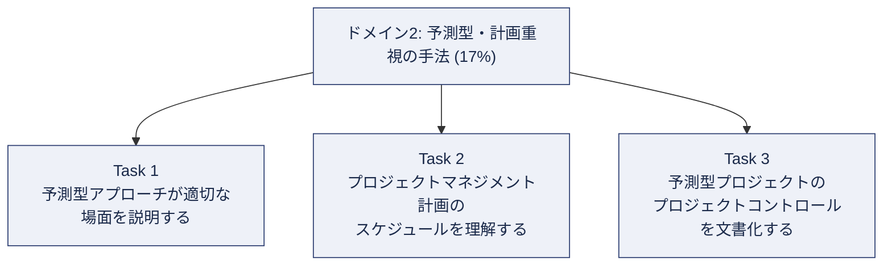
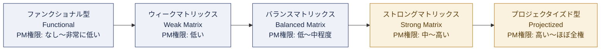
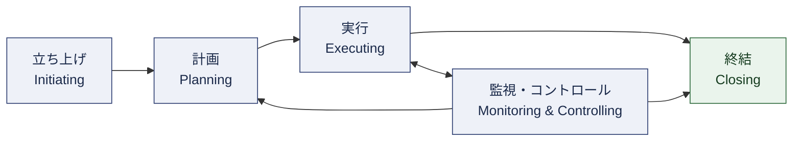
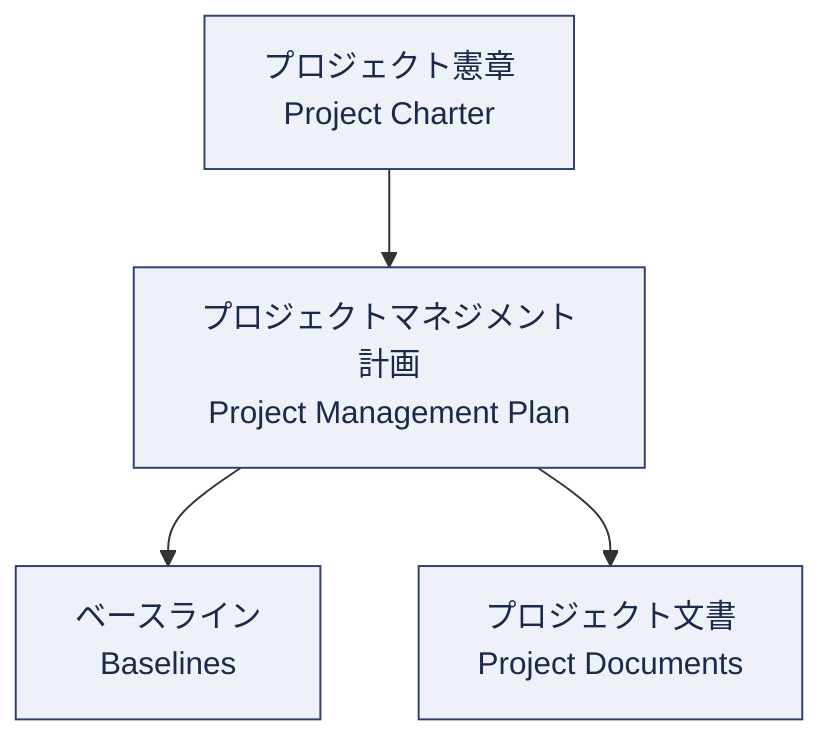
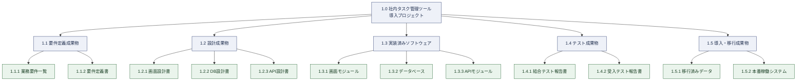
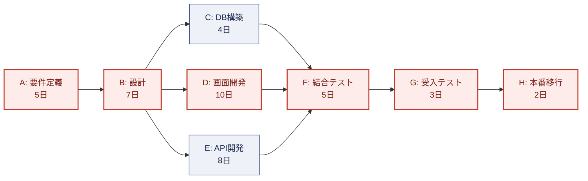
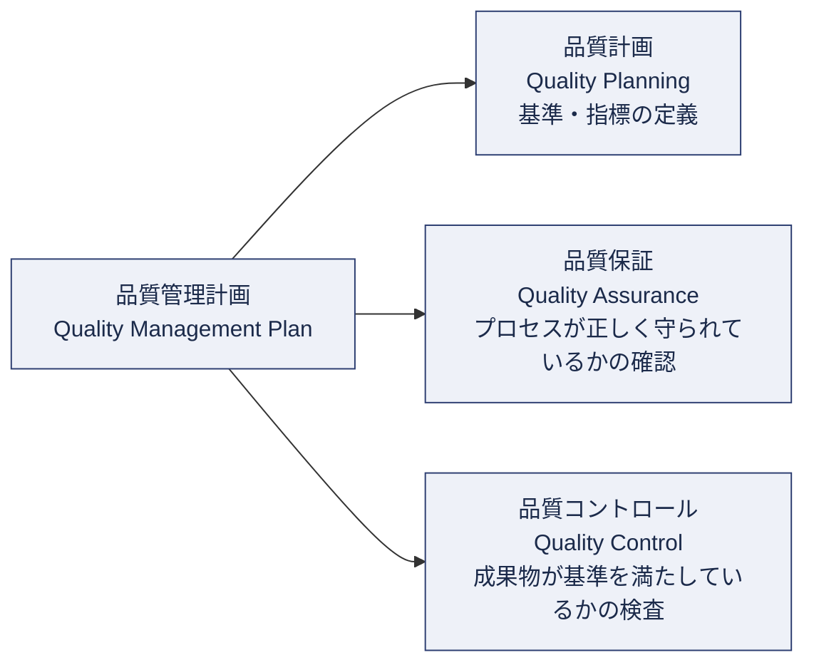
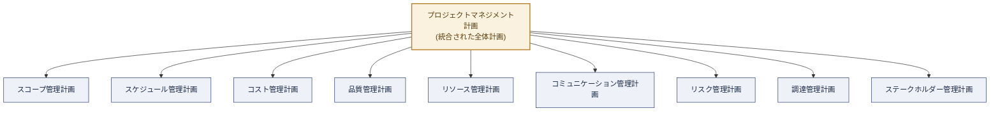
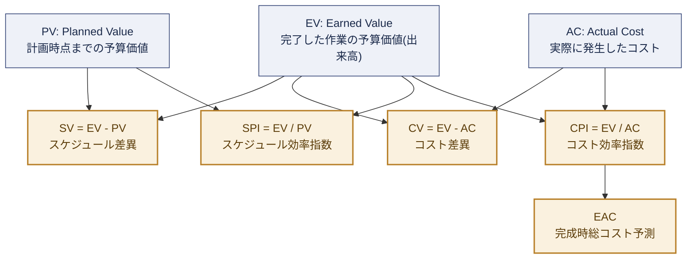
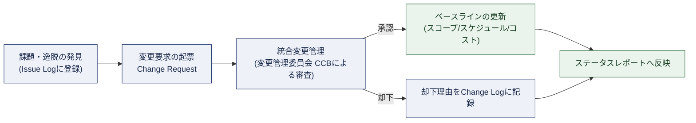

# CAPM(R) ドメイン2: 予測型・計画重視の手法(Predictive, Plan-Based Methodologies) 完全学習ガイド

> 対象読者: これからCAPM(R)(Certified Associate in Project Management)受験を目指す初学者
> 出題比率: 全体の **17%**(4ドメイン中もっとも比率は低いが、他ドメインの土台となる重要領域)
> 準拠: PMI公式 CAPM Examination Content Outline(ECO)2023 Exam Update

---

## このガイドの使い方

このガイドは、CAPM試験の出題範囲を定義する公式文書「Examination Content Outline(ECO)」のドメイン2に完全準拠し、Task単位・Enabler単位で初学者にもわかる言葉に噛み砕いて解説したものです。各セクションは次の3種類の補足ボックスを使って構成されています。

> **ベストプラクティス**
> 実務およびCAPM試験の両方で役立つ、押さえておくべき実践的なポイントです。

<!-- 引用ボックスの区切り (MD028) -->

> **ソース**
> その項目の根拠となる一次情報源(PMI公式)へのリンクです。

<!-- 引用ボックスの区切り (MD028) -->

> **補足**
> 初学者がつまずきやすいポイントや、用語の日英対応を補足します。

図解はすべてMermaid形式のフローチャート/ツリー図で表現し、ASCIIアートは使用していません。

---

## 目次

1. [ドメイン2の全体像](#1-ドメイン2の全体像)
2. [Task 1: 予測型・計画重視アプローチが適切な場面の説明](#2-task-1-予測型計画重視アプローチが適切な場面の説明)
3. [Task 2: プロジェクトマネジメント計画とスケジュールの理解](#3-task-2-プロジェクトマネジメント計画とスケジュールの理解)
4. [Task 3: 予測型プロジェクトのプロジェクトコントロールの文書化](#4-task-3-予測型プロジェクトのプロジェクトコントロールの文書化)
5. [ドメイン2 ベストプラクティス総まとめ](#5-ドメイン2-ベストプラクティス総まとめ)
6. [学習チェックリスト](#6-学習チェックリスト)
7. [参考文献・出典](#7-参考文献出典)

---

## 1. ドメイン2の全体像

### 1.1 CAPM試験全体におけるドメイン2の位置づけ

CAPM試験(2023年改訂版ECO)は4つのドメインで構成されており、ドメイン2「予測型・計画重視の手法」はそのうちの17%を占めます。

| ドメイン | 名称 | 出題比率 |
|---|---|---|
| ドメイン1 | Project Management Fundamentals and Core Concepts(プロジェクトマネジメントの基礎と中核概念) | 36% |
| **ドメイン2** | **Predictive, Plan-Based Methodologies(予測型・計画重視の手法)** | **17%** |
| ドメイン3 | Agile Frameworks/Methodologies(アジャイルのフレームワーク・手法) | 20% |
| ドメイン4 | Business Analysis Frameworks(ビジネス分析のフレームワーク) | 27% |

> **補足**
> ECOの序文では、予測型・適応型(アジャイル)・ビジネス分析の各アプローチは特定のドメインだけに閉じたものではなく、4ドメイン全体を横断して出題され得ると明記されています。ドメイン2はあくまで「予測型アプローチそのものの知識」が集中的に問われる領域ですが、他ドメインの設問文中にも予測型の考え方が前提として登場する点に注意してください。

### 1.2 ドメイン2を構成する3つのTask

ECOはドメインをさらに「Task(責任範囲)」と「Enabler(そのTaskに含まれる具体的な作業例)」に分解しています。ドメイン2は次の3つのTaskで構成されます。

> **ソース**
> Domain 2の正式なTask/Enabler一覧は、PMI公式のCAPM Exam Content Outlineに掲載されています。
> https://www.pmi.org/-/media/pmi/documents/public/pdf/certifications/capm-exam-content-outline-english.pdf

### 1.3 予測型(Predictive)アプローチとは何か

予測型アプローチとは、プロジェクトの開始時点でスコープ・スケジュール・コストをできるだけ詳細に計画し、その計画(ベースライン)に沿って実行・コントロールしていく、いわゆる「ウォーターフォール型」の進め方です。要件が早い段階で明確になり、変更が少ないことが前提となります。

これに対して、ドメイン3で扱う適応型(Adaptive/Agile)アプローチは、短いイテレーションを繰り返しながら要件を段階的に明らかにしていく進め方です。CAPM試験では、この両者の違いを正しく区別できるかが繰り返し問われます。

| 比較項目 | 予測型(Predictive) | 適応型(Adaptive/Agile) |
|---|---|---|
| 計画のタイミング | プロジェクト初期にまとめて詳細計画 | 反復ごとに都度詳細化(Progressive Elaboration) |
| 要件の確定度 | 早期に確定していることが前提 | 変化を前提とし、継続的に見直す |
| 進捗管理の単位 | WBS・スケジュール・コストベースラインとの差異 | ベロシティ、バーンダウン、インクリメント |
| 変更の扱い方 | 正式な変更管理プロセス(CCB等)を通す | 変更を歓迎し、バックログで柔軟に取り込む |
| 適したプロジェクト特性 | スコープが明確、規制が厳しい、大規模インフラ・建設等 | 不確実性が高い、顧客と頻繁に協働できるソフトウェア開発等 |
| 代表的な成果物 | WBS、ガントチャート、リスクレジスター、変更ログ | プロダクトバックログ、スプリントバックログ、カンバンボード |

> **ベストプラクティス**
> 試験対策としては「どちらが優れているか」ではなく「どちらがこの状況に適しているか」という判断軸で問題文を読むことが重要です。実務でも、1つのプロジェクトの中でハイブリッド(予測型+適応型)を採用するケースが増えています。

---

## 2. Task 1: 予測型・計画重視アプローチが適切な場面の説明

Task 1のEnablerは以下の4つです。

- 組織構造(バーチャル、コロケーション、マトリックス構造、階層構造など)に対する予測型アプローチの適合性を識別する
- 各プロセス内の活動を判断する
- 各プロセス内の典型的な活動の例を挙げる
- さまざまなプロジェクト構成要素の違いを区別する

### 2.1 組織構造と予測型アプローチの適合性

プロジェクトがどの組織構造の中で実施されるかによって、プロジェクトマネージャー(PM)がどれだけの権限を持てるかが大きく変わります。CAPM試験では、組織構造の種類とPMの権限レベルの対応関係を問う問題が頻出します。

| 組織構造 | 特徴 | PMの権限 | PMの役割呼称の例 | 予測型との相性 |
|---|---|---|---|---|
| ファンクショナル型(機能別組織) | 部門ごとに縦割り。プロジェクトは各機能部門の業務の一部として扱われる | ほぼなし | プロジェクト調整役、パートタイムの担当者 | 小規模・単一部門で完結する予測型プロジェクトには機能するが、大規模な予測型プロジェクトには不向き |
| ウィークマトリックス | 機能別組織をベースにしつつ、プロジェクト横断の連携が生まれる | 低い(調整者に近い) | プロジェクトコーディネーター、プロジェクトスケジューラー | 予測型の統制(WBS・スケジュール管理)がやりづらく、権限不足が課題になりやすい |
| バランスマトリックス | 機能部門とプロジェクトの権限がおおむね対等 | 中程度 | プロジェクトマネージャー | 部門横断のリソースを要する予測型プロジェクトに適合しやすい |
| ストロングマトリックス | 専任PMが機能部門長と同格の権限を持つ | 高い | プロジェクトマネージャー(専任) | 大規模で厳密なベースライン管理が必要な予測型プロジェクトに適合 |
| プロジェクタイズド型(プロジェクト型組織) | プロジェクトのために組織全体が編成される。プロジェクト終了後にチームは解散 | 非常に高い(ほぼ全権) | プロジェクトマネージャー(全権) | 建設・大規模インフラなど、伝統的な予測型プロジェクトの典型的な受け皿 |

> **ベストプラクティス**
> 試験では「PMがリソースの割り当てに関して最終決定権を持たない」「機能部門長の承認が必要」といった記述が出てきたら、それはウィーク〜バランスマトリックスを示すヒントです。逆に「PMがチームメンバーの人事評価まで行う」とあればプロジェクタイズド型を示しています。

<!-- 引用ボックスの区切り (MD028) -->

> **ソース**
> 組織構造とプロジェクトマネジメントの関係についてはPMI公式ライブラリの以下の論文が詳しく解説しています。
> - https://www.pmi.org/learning/library/pm-matrix-organizations-10000
> - https://www.pmi.org/learning/library/strategic-alignment-project-management-organizational-structure-10956

さらに、近年はチームの働き方(バーチャル型/コロケーション型)も出題論点になっています。

| 働き方の形態 | 特徴 | 予測型プロジェクトでの留意点 |
|---|---|---|
| コロケーション(Co-location) | チームメンバーが同一の物理的空間で作業する | コミュニケーションコストが低く、進捗の可視化やベースライン管理の合意形成がしやすい |
| バーチャル(Virtual)チーム | メンバーが地理的に分散し、主にオンラインで協働する | タイムゾーン差・言語差を考慮した会議設計、ドキュメントによる正式な合意形成(変更管理・ステータス報告)がより重要になる |

### 2.2 プロセス群とプロセス内の典型的な活動

予測型アプローチでは、プロジェクトのライフサイクルを5つの「プロセス群」として捉えます。これはPMI発行の「Process Groups: A Practice Guide」に基づく整理であり、CAPM ECOの参考文献リストにも明記されています。

> **補足**
> 「計画」「実行」「監視・コントロール」の3つは、図のように行ったり来たりを繰り返す反復的な関係にあります。これは予測型プロジェクトであっても、計画が一度作られたら二度と変更されないという意味ではなく、変更管理プロセスを通じて継続的に見直されることを表しています。

各プロセス群の典型的な活動(Enablerが求める「activities within each process」の具体例)を整理すると次のとおりです。

| プロセス群 | 目的 | 典型的な活動の例 |
|---|---|---|
| 立ち上げ(Initiating) | プロジェクトまたはフェーズを正式に承認する | プロジェクト憲章(Project Charter)の作成、ステークホルダーの特定、ステークホルダーレジスターの作成 |
| 計画(Planning) | ゴール達成のための道筋を確定する | プロジェクトマネジメント計画の作成、スコープ定義、WBS作成、スケジュール策定、コスト見積り、品質計画、リスク計画、調達計画、コミュニケーション計画 |
| 実行(Executing) | 計画に基づき実際の作業を遂行する | プロジェクト作業の指揮・マネジメント、品質のマネジメント、チームの編成・育成、コミュニケーションの実施、ステークホルダーエンゲージメントの管理、調達の実施 |
| 監視・コントロール(Monitoring & Controlling) | 進捗と計画のズレを把握し是正する | プロジェクト作業の監視、統合変更管理の実施、スコープの妥当性確認とコントロール、スケジュールのコントロール、コストのコントロール、品質のコントロール、リスクの監視 |
| 終結(Closing) | プロジェクトまたはフェーズを正式にクローズする | 契約・調達の終結、成果物の正式な引き渡し、教訓(Lessons Learned)の記録、リソースの解放 |

> **ベストプラクティス**
> 「立ち上げ」と「計画」を混同しやすい初学者が多いですが、判断基準はシンプルです。「プロジェクトを始めてよいという公式な承認」に関わるものは立ち上げ、「承認されたプロジェクトをどう進めるかの詳細」に関わるものは計画、と覚えると区別しやすくなります。

### 2.3 さまざまなプロジェクト構成要素の違い

Task 1最後のEnablerは「プロジェクトのさまざまな構成要素(コンポーネント)の違いを区別する」ことです。初学者が特に混同しやすい4つの構成要素を整理します。

| 構成要素 | 役割 | 具体例 | 承認・変更の性質 |
|---|---|---|---|
| プロジェクト憲章(Project Charter) | プロジェクトの存在を正式に認可する文書。PMに権限を与える | プロジェクトの目的、ハイレベルな成功基準、PMの任命 | プロジェクト開始時に一度承認される。基本的に大きくは変更されない |
| プロジェクトマネジメント計画(Project Management Plan) | プロジェクトをどのように実行・監視・終結するかを定義する統合文書 | スコープ管理計画、スケジュール管理計画、コスト管理計画、品質管理計画などの補助計画の集合体 | 正式な変更管理プロセスを経て更新される |
| ベースライン(Baselines) | 承認された基準線。実績との比較対象となる | スコープベースライン(スコープ記述書+WBS+WBS辞書)、スケジュールベースライン、コストベースライン | 承認された変更要求によってのみ更新される |
| プロジェクト文書(Project Documents) | 計画やベースラインには含まれないが、プロジェクト運営に必要な文書群 | リスクレジスター、課題ログ(Issue Log)、ステークホルダーレジスター、変更ログ | ベースラインほど厳格な変更管理を経ずに、必要に応じて更新される |

> **補足**
> 「プロジェクトマネジメント計画」と「プロダクト管理計画(Product Management Plan)」の違いもECOで明示的に問われる論点です。前者は「プロジェクトをどう進めるか」、後者は「完成した製品/成果物をどう管理・維持するか」を扱う点が異なります。

<!-- 引用ボックスの区切り (MD028) -->

> **ベストプラクティス**
> 試験問題で「これは承認された変更管理を経ないと更新できないか?」を自問すると、ベースラインかどうかを見分けやすくなります。ベースラインはYes、プロジェクト文書は基本的にNo(比較的柔軟に更新可能)です。

---

## 3. Task 2: プロジェクトマネジメント計画とスケジュールの理解

Task 2のEnablerは以下の6つです。

- クリティカルパス法(Critical Path Method)を適用する
- スケジュール差異(Schedule Variance)を計算する
- work breakdown structure(WBS)を説明する
- ワークパッケージ(Work Package)を説明する
- 品質管理計画(Quality Management Plan)を適用する
- 統合管理計画(Integration Management Plan)を適用する

このセクションでは、以下の共通サンプルプロジェクトを使って一貫した具体例で解説します。

> **サンプルプロジェクト**: 「社内タスク管理ツール導入プロジェクト」
> 社内向けタスク管理ツールを要件定義から本番リリースまで導入する、比較的小規模な予測型プロジェクト。

### 3.1 Work Breakdown Structure(WBS)

WBSとは、プロジェクトのスコープ全体を、成果物(デリバラブル)を基準に階層的に分解した図です。タスクの一覧ではなく、あくまで「作成すべき成果物」を分解する点がポイントです。

#### 100%ルール

WBSの中核をなす原則が「100%ルール」です。これはWBSがプロジェクトスコープに定義された作業の100%を含み、内部・外部・中間のすべての成果物(プロジェクトマネジメント作業を含む)を漏れなく捉えなければならない、という原則です。階層のどのレベルにおいても、子要素の合計は親要素の100%と一致しなければならず、逆にスコープ外の作業を含めてもいけません。

| WBS関連用語 | 説明 |
|---|---|
| WBS(Work Breakdown Structure) | 成果物を基準にスコープ全体を階層的に分解した図。100%ルールに従う |
| ワークパッケージ(Work Package) | WBSの最下層の要素。見積り・スケジューリング・監視・コントロールが可能な最小単位 |
| WBS辞書(WBS Dictionary) | 各WBS要素の詳細な説明(担当、完了基準、必要リソース等)を記載した文書 |
| プランニングパッケージ(Planning Package) | 詳細がまだ確定していないが、100%ルールを満たすために暫定的に置く要素。詳細が判明次第ワークパッケージに発展する |
| コントロールアカウント(Control Account) | WBSの特定レベルに設置される、コストとスケジュールの統合的な管理ポイント |
| デコンポジション(Decomposition) | 成果物をより小さく管理しやすい要素に分解していく技法 |

> **ベストプラクティス**
> WBS作成時は「これ以上分解すると管理しやすくなるか?」を自問し、Noであればそこがワークパッケージの適切な粒度です。過度に細かく分解しすぎると管理コストが増大し、逆に粗すぎると進捗の可視性が失われます。

<!-- 引用ボックスの区切り (MD028) -->

> **ソース**
> WBSと100%ルールについてはPMI公式ライブラリの解説記事、およびPMI発行の「Practice Standard for Work Breakdown Structures」が一次情報源です。
> https://www.pmi.org/learning/library/practice-standard-work-breakdown-structures-8063

### 3.2 クリティカルパス法(Critical Path Method, CPM)

クリティカルパス法は、プロジェクトネットワーク図(アクティビティの依存関係図)から、プロジェクト全体の所要期間を決定する最も長い経路(クリティカルパス)を求める技法です。クリティカルパス上のアクティビティが1日でも遅延すると、プロジェクト全体の完了日が遅延します。

#### 計算の基本用語

| 用語 | 略称 | 意味 |
|---|---|---|
| Early Start | ES | そのアクティビティを最も早く開始できる時点(順行計算=フォワードパス) |
| Early Finish | EF | ES + 所要期間。最も早く終了できる時点 |
| Late Finish | LF | プロジェクト全体を遅延させずに、そのアクティビティを終了できる最も遅い時点(逆行計算=バックワードパス) |
| Late Start | LS | LF - 所要期間 |
| Total Float(トータルフロート/スラック) | TF | LS - ES(= LF - EF)。そのアクティビティが遅延してもプロジェクト全体に影響を与えない余裕日数 |
| クリティカルパス | - | Total Float = 0(最小)となるアクティビティが連なる、ネットワーク上で最長の経路 |

#### サンプルプロジェクトのネットワーク図

ハイライト表示されたA→B→D→F→G→Hがクリティカルパスです。C(DB構築)とE(API開発)には余裕(フロート)があり、クリティカルパス上にはありません。

#### フォワードパス/バックワードパスの計算結果

| アクティビティ | 作業内容 | 所要期間(日) | 先行作業 | ES | EF | LS | LF | Total Float | クリティカル? |
|---|---|---|---|---|---|---|---|---|---|
| A | 要件定義 | 5 | - | 0 | 5 | 0 | 5 | 0 | Yes |
| B | 設計 | 7 | A | 5 | 12 | 5 | 12 | 0 | Yes |
| C | DB構築 | 4 | B | 12 | 16 | 18 | 22 | 6 | No |
| D | 画面開発 | 10 | B | 12 | 22 | 12 | 22 | 0 | Yes |
| E | API開発 | 8 | B | 12 | 20 | 14 | 22 | 2 | No |
| F | 結合テスト | 5 | C, D, E | 22 | 27 | 22 | 27 | 0 | Yes |
| G | 受入テスト | 3 | F | 27 | 30 | 27 | 30 | 0 | Yes |
| H | 本番移行 | 2 | G | 30 | 32 | 30 | 32 | 0 | Yes |

- **フォワードパス**: 複数の先行作業がある場合、ESは先行作業のEFの**最大値**を採用します(例: FのESは C・D・EのEFのうち最大の22)。
- **バックワードパス**: 複数の後続作業がある場合、LFは後続作業のLSの**最小値**を採用します(例: BのLFは C・D・EのLSのうち最小の12)。
- プロジェクト全体の所要期間は32日、クリティカルパスは **A → B → D → F → G → H**(5+7+10+5+3+2=32日)です。

> **ベストプラクティス**
> CAPM試験のクリティカルパス問題では、「複数経路が合流する地点ではESは最大値、複数経路が分岐する地点から遡るときのLFは最小値」というルールを取り違えるミスが非常に多く発生します。計算前にこの2点を必ず確認してください。また、フロートが0のアクティビティがクリティカルパス上にあるという定義も合わせて覚えておくと、ネットワーク図が複雑でも迷わず判定できます。

<!-- 引用ボックスの区切り (MD028) -->

> **ソース**
> クリティカルパス法とスケジュールネットワーク分析の考え方は、CAPM ECOの参考文献にも挙げられている「Process Groups: A Practice Guide」やPMBOK(R) Guideのスケジュールマネジメント領域で体系的に解説されています。
> https://www.pmi.org/standards/pmbok

### 3.3 スケジュール差異(Schedule Variance, SV)

Task 2のEnablerには「スケジュール差異を計算する」ことが明示されています。スケジュール差異はアーンドバリューマネジメント(EVM)の基本指標の一つで、計画と実績のズレを金額(または工数)で表します。

**SV = EV - PV**

- **PV(Planned Value)**: ある時点までに完了しているべき作業の予算価値(計画値)
- **EV(Earned Value)**: ある時点までに実際に完了した作業の予算価値(出来高)

| SVの値 | 意味 |
|---|---|
| SV > 0(プラス) | 計画より進捗が早い(スケジュールを先行) |
| SV = 0 | 計画どおり |
| SV < 0(マイナス) | 計画より進捗が遅れている |

EVMの詳細な計算体系(CVやSPI・CPIとの関係)は、ドメイン2 Task 3(4.2節)でまとめて解説します。

> **補足**
> SVは金額(または工数)の単位で表現される指標であり、「あと何日遅れているか」という時間の単位そのものではない点に注意してください。時間単位でのズレを知りたい場合は、Earned Schedule(ES法)などの発展的な手法が使われますが、CAPM試験の基本範囲ではSV=EV-PVの計算ができれば十分です。

### 3.4 品質管理計画(Quality Management Plan)の適用

品質管理計画は、プロジェクトマネジメント計画の構成要素の一つで、プロジェクトの成果物や作業がどのような品質基準を満たすべきか、そしてそれをどう保証・確認するかを定義します。

| 要素 | 焦点 | 主な活動例 |
|---|---|---|
| 品質計画(Quality Planning) | どの品質基準を適用するかを事前に定義する | 品質基準の特定、品質指標(メトリクス)の設定、チェックリストの準備 |
| 品質保証(QA: Quality Assurance) | プロセスが正しく実施されているかを確認する(予防中心) | プロセス監査、標準への準拠確認、継続的プロセス改善 |
| 品質コントロール(QC: Quality Control) | 実際の成果物・作業結果を検査する(検出中心) | テスト実施、検査、統計的サンプリング、欠陥の是正 |

> **ベストプラクティス**
> QA(保証)とQC(コントロール)を混同しないことが試験の頻出ポイントです。QAは「プロセスに問題がないか」を見る予防的な活動、QCは「できあがった成果物に問題がないか」を見る検出的な活動、と対比させて覚えると区別しやすくなります。サンプルプロジェクトで言えば、開発標準の順守確認がQA、結合テスト・受入テストの実施がQCに該当します。

<!-- 引用ボックスの区切り (MD028) -->

> **ソース**
> 品質管理の3要素(全体方針・QA・QC)についてはPMI公式ライブラリで詳しく解説されています。
> https://www.pmi.org/learning/library/quality-management-9107
> https://www.pmi.org/learning/library/practice-three-project-quality-management-7198

### 3.5 統合管理計画(Integration Management Plan)の適用

統合マネジメントは、プロジェクトマネジメント計画を構成するすべての補助計画(スコープ・スケジュール・コスト・品質・リソース・コミュニケーション・リスク・調達・ステークホルダー管理計画)を一つの首尾一貫した全体としてまとめ上げる、いわば「PMの司令塔」となる領域です。

| 統合マネジメントの主要な活動 | 説明 |
|---|---|
| プロジェクト憲章の作成 | プロジェクトを正式に認可し、PMに権限を与える |
| プロジェクトマネジメント計画の作成 | 各補助計画を整合させ、一つの実行可能な計画にまとめる |
| プロジェクト作業の指揮・マネジメント | 計画に基づき実際の作業を進める |
| プロジェクト知識のマネジメント | 既存の知識を活用し、新たな教訓を組織に還元する |
| プロジェクト作業の監視 | 計画と実績の差異を継続的に把握する |
| 統合変更管理の実施 | すべての変更要求を一元的に評価・承認・却下する(4章で詳述) |
| プロジェクト・フェーズの終結 | 正式にプロジェクトを完了させる |

> **ベストプラクティス**
> 統合マネジメントは「他の知識領域をつなぎ合わせる接着剤」と捉えると理解しやすくなります。例えば、スコープ変更が発生した場合、それをスケジュール・コスト・品質・リスクの各計画にどう波及させるかを一元的に管理するのが統合管理計画の役割です。単独の知識領域だけを見て変更を承認すると、他領域への影響を見落とすリスクがあります。

---

## 4. Task 3: 予測型プロジェクトのプロジェクトコントロールの文書化

Task 3のEnablerは以下の2つです。

- 予測型プロジェクトで使用されるアーティファクト(成果物・文書)を識別する
- コストとスケジュールの差異を計算する

### 4.1 予測型プロジェクトで使用される主なアーティファクト

予測型プロジェクトのプロジェクトコントロールでは、以下のような文書群が体系的に整備・更新されます。

| アーティファクト | 主な目的 | 更新のタイミング |
|---|---|---|
| プロジェクト憲章 | プロジェクトの公式な認可 | 立ち上げ時に作成、以後基本的に不変 |
| プロジェクトマネジメント計画(と各補助計画) | プロジェクト全体の実行方針 | 承認された変更要求に基づき更新 |
| スコープ・スケジュール・コストベースライン | 実績と比較する基準線 | 承認された変更要求に基づき更新 |
| WBS・WBS辞書 | スコープの階層的分解と定義 | スコープ変更時に更新 |
| スケジュール(ネットワーク図・ガントチャート) | 作業順序と期間の可視化 | 進捗・変更に応じて随時更新 |
| リスクレジスター | 識別されたリスクとその対応策の一覧 | リスクの識別・再評価のたびに更新 |
| 課題ログ(Issue Log) | 発生した課題とその対応状況の記録 | 課題の発生・解決のたびに更新 |
| 変更ログ(Change Log) | 提出された変更要求とその審査結果の記録 | 変更要求のたびに更新 |
| ステークホルダーレジスター | 関係者の識別・関心・影響度の記録 | 新規ステークホルダー識別時に更新 |
| RACI(責任分担マトリックス) | 誰が何に対して責任・説明責任・相談・報告の役割を持つかの整理 | 体制変更時に更新 |
| ステータスレポート(進捗報告) | 現在の進捗・課題・リスクの定期報告 | 定期(週次・月次等)に更新 |
| 教訓登録簿(Lessons Learned Register) | プロジェクトを通じて得られた教訓の記録 | プロジェクトを通じて継続的に、終結時に総括 |

> **ベストプラクティス**
> 試験では「ある状況でどのアーティファクトを参照・更新すべきか」を問う設問が多く出ます。判断のコツは「これは基準(比較対象)か、それとも記録(実績・状況)か」を見分けることです。ベースラインは基準、ログ・レジスターは記録、と整理すると迷いにくくなります。

### 4.2 コストとスケジュールの差異計算(EVM: Earned Value Management)

Task 3では「コストとスケジュールの差異を計算する」ことが明示的に求められています。これはアーンドバリューマネジメント(EVM)の中核となる計算です。

#### EVMの基本3指標と主要な派生指標

| 指標 | 正式名称 | 計算式 | 解釈 |
|---|---|---|---|
| PV | Planned Value(計画価値) | (ベースラインから算出) | ある時点までに完了しているべき作業の予算 |
| EV | Earned Value(出来高) | (実績から算出) | ある時点までに実際に完了した作業の予算価値 |
| AC | Actual Cost(実コスト) | (実績から算出) | ある時点までに実際に発生したコスト |
| SV | Schedule Variance(スケジュール差異) | EV - PV | プラスなら進捗が早い、マイナスなら遅れている |
| CV | Cost Variance(コスト差異) | EV - AC | プラスなら予算内、マイナスなら予算超過 |
| SPI | Schedule Performance Index | EV / PV | 1.0以上でスケジュール効率が良い |
| CPI | Cost Performance Index | EV / AC | 1.0以上でコスト効率が良い |
| BAC | Budget at Completion(完成時総予算) | (承認済み総予算) | プロジェクト全体の当初予算 |
| EAC | Estimate at Completion(完成時総コスト見積り) | BAC / CPI(現在の効率が今後も続くと仮定する場合) | 現在の傾向が続いた場合の最終コスト予測 |
| ETC | Estimate to Complete(残作業のコスト見積り) | EAC - AC | 完了までにあと必要なコスト |
| VAC | Variance at Completion(完成時差異) | BAC - EAC | 最終的な予算との差異見込み |
| TCPI | To-Complete Performance Index | (BAC - EV) / (BAC - AC) | 残予算内で完成させるために今後必要な効率 |

> **補足**
> CAPM ECOのTask 2・Task 3で明示的に求められているのはSVとCVの計算です。SPI・CPI・EAC・TCPIはより発展的なEVM指標ですが、これらを理解しておくとSVとCVの意味をより深く把握でき、PMP(R)など上位資格の学習にもつながります。

#### サンプルプロジェクトでの計算例

サンプルプロジェクト(社内タスク管理ツール導入、総予算 BAC = 1,200万円)について、開発フェーズ半ばのステータス日時点で以下の実績が得られたとします。

| 指標 | 値 |
|---|---|
| BAC(総予算) | 12,000,000円 |
| PV(計画価値) | 7,200,000円 |
| EV(出来高) | 6,300,000円 |
| AC(実コスト) | 7,000,000円 |

計算結果は以下のとおりです。

| 指標 | 計算式 | 結果 | 解釈 |
|---|---|---|---|
| SV | 6,300,000 - 7,200,000 | -900,000円 | 計画よりも進捗が遅れている |
| CV | 6,300,000 - 7,000,000 | -700,000円 | 予算を超過している |
| SPI | 6,300,000 / 7,200,000 | 約0.875 | 計画に対して87.5%の速度でしか進捗していない |
| CPI | 6,300,000 / 7,000,000 | 0.90 | 投じた予算1円あたり0.90円分の価値しか生み出せていない |
| EAC | 12,000,000 / 0.90 | 約13,333,333円 | 現在の効率が続くと、当初予算を約133万円超過する見込み |
| TCPI | (12,000,000 - 6,300,000) / (12,000,000 - 7,000,000) | 1.14 | 当初予算内に収めるには、残作業を現状より高い効率(114%)で進める必要がある |

> **ベストプラクティス**
> SVとCVはどちらも「マイナスは悪い兆候」という共通ルールで解釈できます。ただし、SVは「時間軸(進捗)」、CVは「コスト軸(予算)」のどちらの問題かを表しているため、両方がマイナスの場合はスケジュールとコストの両面で早急な是正措置(corrective action)が必要と判断します。試験では、SVとCVの符号だけを見て「スケジュールが遅れている」「予算内に収まっている」を素早く判定できるようにしておくことが重要です。

<!-- 引用ボックスの区切り (MD028) -->

> **ソース**
> EVMの基本式と用語定義はPMI公式ライブラリの以下の解説記事が参考になります。
> - https://www.pmi.org/learning/library/earned-value-management-systems-analysis-8026
> - https://www.pmi.org/learning/library/evm-cpm-evaluate-project-performance-6355
> - https://www.pmi.org/learning/library/integrating-scheduling-evm-metrics-8516
> - https://www.pmi.org/learning/library/make-earned-value-work-project-6001

### 4.3 変更管理とプロジェクトコントロールの流れ

プロジェクトコントロールのアーティファクトがどのように連動して更新されるかを、変更管理の一般的な流れとして図示します。

> **ベストプラクティス**
> ベースラインは「承認された変更要求」以外の理由で更新してはいけません。進捗の遅れをそのままベースラインの日付を書き換えることでごまかす、といった行為は予測型プロジェクトの統制上の重大な違反にあたります。差異が発生した場合は、まず原因を分析し、必要であれば正式な変更要求としてCCBに諮る、という手順を徹底することがベストプラクティスです。

---

## 5. ドメイン2 ベストプラクティス総まとめ

| 領域 | ベストプラクティス |
|---|---|
| アプローチ選定 | スコープの確定度、変更頻度、規制要件、組織構造の権限分布を確認したうえで予測型/適応型/ハイブリッドを選ぶ |
| 組織構造の見極め | 「PMがリソースについて最終決定権を持つか」を基準に、ファンクショナル〜プロジェクタイズドのどこに位置するかを判断する |
| WBS作成 | 100%ルールを厳守し、成果物ベースで分解する。ワークパッケージの粒度は「これ以上分解すると管理しやすくなるか」で判断する |
| スケジュール管理 | クリティカルパス上のアクティビティを最優先で監視し、フロートのある非クリティカルパスのアクティビティに過剰な資源を割かない |
| 品質管理 | QA(プロセスの予防的確認)とQC(成果物の検出的検査)を明確に区別し、両方を計画段階で設計しておく |
| 統合管理 | すべての補助計画・変更要求を一元的に評価し、他知識領域への波及影響を必ず確認してから承認する |
| コントロール文書 | ベースライン(基準)とログ/レジスター(記録)を区別し、ベースラインは正式な変更管理を経てのみ更新する |
| EVM分析 | SV・CVの符号をまず確認し、必要であればSPI・CPI・EAC・TCPIまで踏み込んで是正措置の緊急度を評価する |

---

## 6. 学習チェックリスト

以下の項目にすべて自信を持って回答できれば、ドメイン2の学習は目標水準に達しています。

- [ ] 予測型アプローチと適応型アプローチの違いを、少なくとも4つの観点で説明できる
- [ ] ファンクショナル型からプロジェクタイズド型までの5つの組織構造と、それぞれのPM権限レベルを順に説明できる
- [ ] 5つのプロセス群(立ち上げ・計画・実行・監視コントロール・終結)それぞれの目的と代表的な活動を説明できる
- [ ] プロジェクト憲章・プロジェクトマネジメント計画・ベースライン・プロジェクト文書の違いを説明できる
- [ ] WBSの100%ルールを説明し、ワークパッケージ・WBS辞書との関係を図示できる
- [ ] 与えられたネットワーク図からフォワードパス・バックワードパスを計算し、クリティカルパスとフロートを特定できる
- [ ] SV = EV - PV、CV = EV - AC を暗算レベルで計算し、符号の意味を即座に解釈できる
- [ ] QA(品質保証)とQC(品質コントロール)の違いを具体例つきで説明できる
- [ ] 統合管理計画がなぜ「すべての補助計画をつなぐ接着剤」と呼ばれるかを説明できる
- [ ] 予測型プロジェクトの主要なアーティファクト(リスクレジスター、課題ログ、変更ログ等)の目的と更新タイミングを識別できる

---

## 7. 参考文献・出典

### 7.1 CAPM公式情報(PMI一次情報源)

- PMI Certified Associate in Project Management (CAPM)(R) Certification 公式ページ
  https://www.pmi.org/certifications/certified-associate-capm
- PMI Certified Associate in Project Management (CAPM)(R) Examination Content Outline(2023 Exam Update, PDF)
  https://www.pmi.org/-/media/pmi/documents/public/pdf/certifications/capm-exam-content-outline-english.pdf
- PMBOK(R) Guide(PMI Standard)紹介ページ
  https://www.pmi.org/standards/pmbok

### 7.2 組織構造・プロジェクトマネジメント基礎(PMI公式ライブラリ)

- Project Managers Are Gaining Power within Matrix Organizations
  https://www.pmi.org/learning/library/pm-matrix-organizations-10000
- Strategic Alignment of Project Management Organizational Structure
  https://www.pmi.org/learning/library/strategic-alignment-project-management-organizational-structure-10956

### 7.3 WBS・スケジュールマネジメント(PMI公式ライブラリ)

- Practice Standard for Work Breakdown Structures(第2版)解説
  https://www.pmi.org/learning/library/practice-standard-work-breakdown-structures-8063

### 7.4 品質マネジメント(PMI公式ライブラリ)

- Quality Management(PMI初期タスクフォースレポート)
  https://www.pmi.org/learning/library/quality-management-9107
- Quality in Project Management: A Practical Look at Chapter 8 of the PMBOK(R) Guide
  https://www.pmi.org/learning/library/practice-three-project-quality-management-7198

### 7.5 アーンドバリューマネジメント(EVM)・コスト/スケジュール差異(PMI公式ライブラリ)

- Earned Value Management Systems (EVMS)
  https://www.pmi.org/learning/library/earned-value-management-systems-analysis-8026
- Using EVM and CPM to Evaluate Project Performance
  https://www.pmi.org/learning/library/evm-cpm-evaluate-project-performance-6355
- Integrating Scheduling and Earned Value Management (EVM) Metrics
  https://www.pmi.org/learning/library/integrating-scheduling-evm-metrics-8516
- How to Make Earned Value Work on Your Project
  https://www.pmi.org/learning/library/make-earned-value-work-project-6001

### 7.6 補足情報源(第三者による解説記事・参考用)

以下は理解を補うための第三者解説記事です。一次情報源であるPMI公式資料と齟齬がある場合は、必ずPMI公式資料を優先してください。

- Organizational Structures(オープン教育リソース: Strategic Project Management)
  https://ecampusontario.pressbooks.pub/hrstrategicprojectmanagement/chapter/2-2-structures/
- Project Organizational Structure | Smartsheet
  https://www.smartsheet.com/content/project-management-organization
- Project Management Organization: The Basics | Planview
  https://blog.planview.com/project-management-organization-the-basics/
- What is a Work Breakdown Structure (WBS) | workbreakdownstructure.com
  https://www.workbreakdownstructure.com/
- Schedule Variance: What Is It & How Do I Calculate It? | ProjectManager.com
  https://www.projectmanager.com/blog/schedule-variance-what-is-it-how-do-i-calculate-it
- Project Quality Management According to the PMBOK | ProjectEngineer.net
  https://www.projectengineer.net/project-quality-management-according-to-the-pmbok/
- Project Integration Management According to the PMBOK | ProjectEngineer.net
  https://www.projectengineer.net/project-integration-management-according-to-the-pmbok/
- The PMBOK's Project Management Documents | ProjectEngineer.net
  https://www.projectengineer.net/the-pmboks-project-management-documents/

---

> **補足**
> 本ガイドはCAPM Exam Content Outline(2023 Exam Update)の内容に基づいて作成されています。PMIは試験内容を定期的に見直すため、受験前には必ず上記URLから最新版のECOをダウンロードし、内容の変更がないか確認してください。
