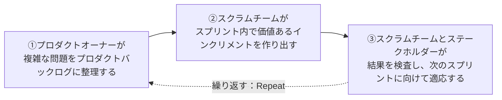
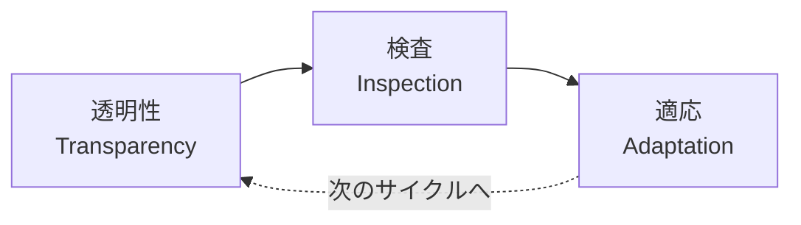
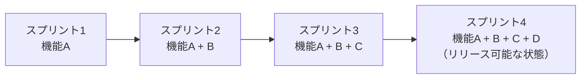
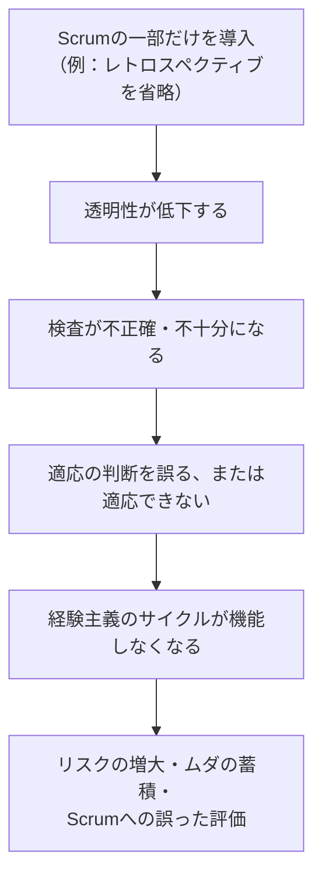
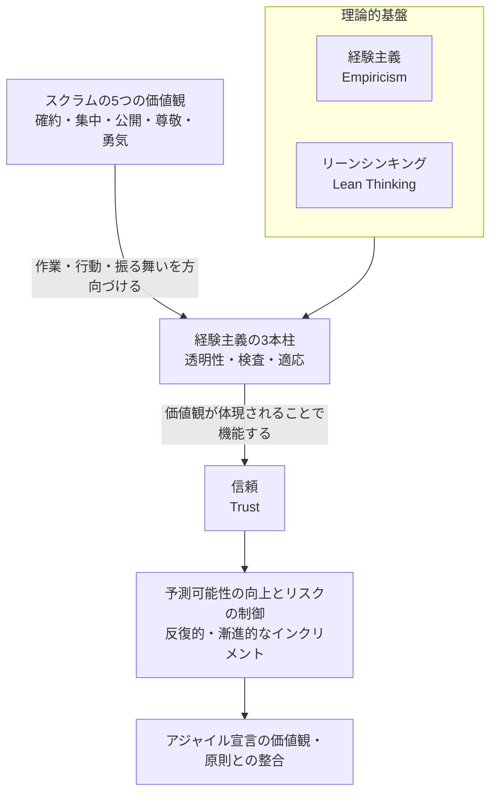

# Scrum理論の基礎（Scrum Theory）― CSM®試験対応 初学者向け完全ガイド

> 対象資格：Scrum Alliance® **Certified ScrumMaster®（CSM®）**
> 対象範囲：Scrum Foundations Learning Objectives カテゴリー1「Scrum Theory」（LO 1.1〜1.7）
> レベル：初学者〜Scrumを学び始めたばかりの方

---

## 目次

1. [このガイドについて](#0-このガイドについて)
2. [Scrumの定義（LO 1.1）](#1-scrumの定義lo-11)
3. [Scrumの理論的基盤：経験主義とリーンシンキング（LO 1.3）](#2-scrumの理論的基盤経験主義とリーンシンキングlo-13)
4. [経験主義の3本柱（LO 1.4）](#3-経験主義の3本柱lo-14)
5. [Scrumの5つの価値観（LO 1.2）](#4-scrumの5つの価値観lo-12)
6. [反復的・漸進的アプローチの利点（LO 1.5）](#5-反復的漸進的アプローチの利点lo-15)
7. [Scrumを部分的に導入した場合の欠点（LO 1.6）](#6-scrumを部分的に導入した場合の欠点lo-16)
8. [アジャイル宣言とScrumの整合性（LO 1.7）](#7-アジャイル宣言とscrumの整合性lo-17)
9. [Scrum Theory 全体像のまとめ図](#8-scrum-theory-全体像のまとめ図)
10. [理解度チェック（練習問題）](#9-理解度チェック練習問題)
11. [まとめ：学習到達度チェックリスト](#10-まとめ学習到達度チェックリスト)
12. [参考文献・ソース一覧](#11-参考文献ソース一覧)

---

## 0. このガイドについて

### 0.1 CSM®試験の全体像

CSM®は、Scrum Alliance®が提供する入門レベルのScrumマスター認定資格です。認定講師（CST®）による16時間のトレーニングコースを受講した後、オンラインの選択式試験（50問中37問正解＝74%以上で合格）を受験します。試験は1時間以内に完了する必要があり、最初のウェルカムメール受信日から90日以内であれば受験費用込みで2回まで受験できます（90日を過ぎた場合や2回を超える場合も受験できますが、1回につき25米ドルの受験料が必要です）（出典: 4, 14）。

### 0.2 「Scrum Theory」はどこに位置づけられるか

Scrum Allianceの公式資料を確認すると、CSM®のLearning Objectives（学習目標）は以下の3カテゴリーに分かれています（出典: 5）。

1. Scrum（チームの責務、イベント、アーティファクト）
2. Scrum Master Core Competencies（ファシリテーション、コーチングなど）
3. Service to the Scrum Team, Product Owner, and Organization（組織への貢献）

これらに加えて、CSM®とCSPO®の両方が共通の土台として学ぶ**Scrum Foundations Learning Objectives**という文書が存在し、その中の最初のカテゴリーが、まさに本ガイドのテーマである**「Scrum Theory（Scrumの理論）」**です（出典: 6）。つまりScrum Theoryは、CSM資格特有の内容ではなく、**Scrumを学ぶすべての人が最初に身につけるべき土台**として公式に位置づけられています。

Scrum Foundations Learning Objectivesの「Scrum Theory」セクションは、以下の7つの学習目標（LO）で構成されています（出典: 6）。

| LO番号 | 学習目標（原文の要約） | 本ガイドの該当章 |
|---|---|---|
| 1.1 | Scrumを定義できる | 第1章 |
| 1.2 | Scrumの5つの価値観を列挙できる | 第4章 |
| 1.3 | 経験主義（Empiricism）を定義できる | 第2章 |
| 1.4 | 経験主義の3本柱を列挙できる | 第3章 |
| 1.5 | 反復的・漸進的アプローチの利点を3つ以上説明できる | 第5章 |
| 1.6 | Scrumを部分的にしか導入しなかった場合の欠点を2つ以上説明できる | 第6章 |
| 1.7 | Scrumがアジャイル宣言の価値観・原則とどう整合しているか説明できる | 第7章 |

これらのLOは、Manifesto for Agile Software Development、Scrum Alliance公式のScrum Valuesページ、そして**Scrum Guide（スクラムガイド）2020年版**を根拠資料として作成されています（出典: 6）。したがって本ガイドも、この3つの一次情報源に忠実に沿って解説します。

> **ベストプラクティス**
> - Scrum Theoryは「暗記事項」ではなく「判断基準」として学ぶ。試験対策としてだけでなく、実務でスプリントの進め方に迷ったときに立ち返る原則として理解する。
> - 学習の際は必ず一次情報源（Scrum Guide本文）を自分の目で読む。二次的な解説記事だけに頼ると、2020年版で削除・変更された用語（例：旧版の「開発チーム」という呼称の扱いなど）を誤って覚えてしまうリスクがある。

---

## 1. Scrumの定義（LO 1.1）

### 1.1 Scrumとは何か

Scrum Guide 2020年版は、Scrumを次のように定義しています。

> Scrumは、人々・チーム・組織が、複雑な問題に対する適応的な解決策を通じて価値を生み出すことを助ける、軽量級のフレームワークである（Scrum Guide本文の趣旨を要約）（出典: 1）。

ここで重要なのは、Scrumが「方法論（methodology）」ではなく「フレームワーク（framework）」だと明言されている点です。Scrumはプロジェクトの進め方を細部まで規定するものではなく、**経験主義に基づく理論を実装するために最低限必要な要素だけ**を定義した、意図的に不完全な骨組みです（出典: 1）。具体的な技法（見積り手法やタスク管理ツールなど）はチームが状況に応じて自由に組み合わせるべきものとされています。

### 1.2 Scrumの由来

Scrumという名称は、1986年にHirotaka Takeuchi（一橋大学）とIkujiro Nonaka（一橋大学）がHarvard Business Reviewに寄稿した論文「The New New Product Development Game」に由来します。この論文は、高いパフォーマンスを発揮するクロスファンクショナルなチームを、ラグビーの「スクラム」になぞらえて論じたものです（出典: 7, 12）。その後1995年、Ken SchwaberとJeff Sutherlandが、米国テキサス州オースティンで開催されたOOPSLAカンファレンスにおいて、Scrumを正式なフレームワークとして初めて発表しました（出典: 7）。

### 1.3 Scrumのサイクルを図で理解する

Scrum Guideは、Scrumの本質を次の4ステップの繰り返しとして説明しています（出典: 1）。

この4ステップ（3ステップ＋繰り返し）の中に、後述する「経験主義の3本柱（透明性・検査・適応）」がすでに埋め込まれていることに注目してください。Scrumの定義そのものが、経験主義を体現する構造になっています。

### 1.4 「軽量」であることの意味

Scrumは、Scrum Master／Product Owner／Developersという3つの責務、5つのイベント、3つのアーティファクトと3つのコミットメントという、必要最小限のルールだけで構成されています。必須の要素を省略したり、Scrumの定義と矛盾する変更を加えたりすると、それは「Scrumではない何か」になってしまう、とScrum Guideの末尾（End Note）で明言されています。一方で、Scrumのフレームワークの内側でさまざまな技法・手法・プラクティスを併用すること自体は妨げられません（この点は第6章で詳しく扱います）（出典: 1）。

> **ベストプラクティス**
> - チームに新しくScrumを紹介するときは、「ルールが厳しい手法」ではなく「必要最小限の骨組みを提供し、その中身の詰め方はチームに委ねられたフレームワーク」として説明する。
> - 「なぜこのイベント／ルールが存在するのか」を都度、経験主義（透明性・検査・適応）に立ち返って説明できるようにしておくと、チームの納得感が高まる。
> - Scrumが元々ソフトウェア開発から生まれた経緯を知っておくと、マーケティングやHRなど非IT領域での応用を説明する際の説得力が増す（Scrum Allianceも「ソフトウェア開発に起源を持ちながら、今日ではあらゆる業種で使われている」と説明している）（出典: 7）。

---

## 2. Scrumの理論的基盤：経験主義とリーンシンキング（LO 1.3）

### 2.1 経験主義（Empiricism）の定義

Scrum Guideは、Scrum Theoryの冒頭で次のように述べています。

> Scrumは経験主義とリーンシンキングに基づいている。経験主義とは、知識は経験から得られ、意思決定は観察されたことに基づいて行われるという考え方である（Scrum Guide本文の趣旨を要約）（出典: 1）。

ポイントは「観察されたこと（what is observed）」に基づいて意思決定を行うという部分です。これは、事前に立てた計画や予測ではなく、**実際に起きた事実**を判断の拠り所にするという考え方です。ソフトウェア開発のような「複雑（complex）」な領域では、未来に何が起こるかを正確に予測することはできません。Scrum Guideも「複雑な環境では、これから何が起こるかは分からない。前向きな意思決定に使えるのは、すでに起きたことだけである」と述べています（出典: 1）。

### 2.2 リーンシンキング（Lean Thinking）

もう一つの理論的基盤がリーンシンキングです。リーンシンキングは、**ムダを減らし、本質的な要素に焦点を当てる**という考え方で、トヨタ生産方式に代表される製造業の改善思想に由来します（出典: 1）。Scrumにおいては、次のような形で表れます。

- タイムボックス（時間の上限を決めること）によって、会議や作業に無制限に時間を費やすムダを防ぐ
- プロダクトバックログを「今必要な分だけ」詳細化する（過剰な事前計画というムダを避ける）
- インクリメントを小さく頻繁にリリースすることで、作りすぎ・手戻りというムダを最小化する

### 2.3 経験的プロセス制御 vs 予測型（決定論的）プロセス制御

初学者がつまずきやすいポイントとして、「経験的プロセス制御（empirical process control）」と、従来型のプロジェクト管理で使われる「予測型（決定論的）プロセス制御」の違いを整理しておきます。

| 観点 | 予測型（決定論的）アプローチ | 経験的（Scrum）アプローチ |
|---|---|---|
| 計画の前提 | 要件・スコープは事前にほぼ確定できる | 要件は不確実で、進めながら明らかになる（創発的） |
| 進捗の判断基準 | 事前計画に対する消化率 | 実際に検査可能な「インクリメント」の状態 |
| 変化への対応 | 変更管理プロセスを経て計画を修正 | 各スプリントの終わりに定期的に適応する |
| 適した問題領域 | 単純（simple）〜煩雑（complicated）な問題 | 複雑（complex）で先が読めない問題 |

> **ベストプラクティス**
> - 「経験主義」を説明するときは、必ず「観察された事実に基づく意思決定」という一文とセットで語る。抽象的に「柔軟な考え方」とだけ説明すると、試験でもニュアンスを問う設問に対応できなくなる。
> - チームメンバーに説明する際は、天気予報を例に出すと理解が早い：1週間後の天気を完璧に予測するのは難しいが、「今、外を見て傘が必要かどうか」は正確に判断できる。Scrumはこの「今、観察できることに基づいて判断する」考え方をプロダクト開発に応用したものである。
> - リーンシンキングの観点から、定例会議やドキュメントを定期的に棚卸しし、「本当に価値を生んでいるか」を問い直す習慣をチームに根付かせる。

---

## 3. 経験主義の3本柱（LO 1.4）

### 3.1 3本柱の全体像

Scrum Guideは、経験主義を支える3つの柱として「透明性（Transparency）」「検査（Inspection）」「適応（Adaptation）」を挙げています（出典: 1）。この3つは独立した概念ではなく、**一方通行の連鎖**として機能します。

Scrum Guideはこの連鎖について「透明性は検査を可能にする。透明性のない検査は、誤解を招き、ムダになる」「検査は適応を可能にする。適応のない検査は無意味である」という趣旨を述べています（出典: 1）。つまり、3本柱のどれか一つでも欠けると、経験主義そのものが機能しなくなります。

### 3.2 各柱の詳細

| 柱 | 定義 | Scrumにおける実現手段 |
|---|---|---|
| **透明性（Transparency）** | 進行中のプロセスや作業の状態が、それを行う人・受け取る人の両方にとって見える状態であること。重要な意思決定は3つのアーティファクト（プロダクトバックログ、スプリントバックログ、インクリメント）の見え方に基づいて行われる（出典: 1） | Definition of Done、プロダクトバックログの並び順、Sprint Reviewでのデモなど |
| **検査（Inspection）** | アーティファクトや目標に向けた進捗を、望ましくないズレや問題を検出するために、頻繁かつ丁寧に確認すること（出典: 1） | Daily Scrum、Sprint Review、Sprint Retrospectiveなど5つのイベントが提供するリズム（cadence） |
| **適応（Adaptation）** | プロセスや成果物が許容範囲を逸脱していると判明した場合、できるだけ早く調整を行うこと（出典: 1） | スプリントバックログの見直し、プロダクトバックログの並び替え、次スプリントへの改善アクションの反映 |

Scrum Guideはさらに「適応は、関係者が権限を与えられておらず自己管理的でない場合、より困難になる」とも述べています（出典: 1）。つまり適応を機能させるには、チームに実際の意思決定権（自己管理性）が必要であるという点が、試験でも狙われやすいポイントです。

### 3.3 「信頼（Trust）」の位置づけ（柱ではなく、柱によって築かれるもの）

**経験主義の柱は透明性・検査・適応の3つであり、「信頼」は柱ではありません。** 2020年版のScrum Guideで「信頼」が登場するのは経験主義のセクションではなく価値観のセクションで、「これらの価値観がスクラムチームと関係者に体現されたとき、経験主義の3本柱（透明性・検査・適応）が息を吹き込まれ、信頼が築かれる」という趣旨の記述です（出典: 1, 3）。つまり信頼は5つの価値観を体現した結果として築かれるものであり、柱と並列に置かれるものではありません。なお、信頼を「経験主義を支える隠れた第4の要素」と表現するのはScrum.orgのブログによる補足的な解釈であって、Scrum Guideの定義ではありません（出典: 13）。試験では「経験主義の3本柱は何か」と問われるため、答えは常に透明性・検査・適応の3つです。

> **ベストプラクティス**
> - **透明性を高める実践**：プロダクトバックログを常に最新の状態に保ち、誰でも参照できる場所に置く。Definition of Doneをチーム全員が同じ言葉で説明できるようにする。
> - **検査を機能させる実践**：Daily Scrumを「進捗報告会」ではなく「スプリントゴールへの到達可能性を検査する場」として運営する。検査の頻度をイベントの設計（5つのイベントのリズム）に委ね、場当たり的にしない。
> - **適応を機能させる実践**：検査で見つかった問題を「次のスプリントで検討します」と先送りせず、可能な限り早く調整する。チームに実際の意思決定権（自己管理性）がなければ、検査しても適応できないため、スクラムマスターは組織的な障害（権限の壁）を取り除く役割を担う。
> - 3本柱はセットで機能することを強調し、「透明性だけ高くて検査していない」「検査はしているが適応していない」という状態を、チームの自己診断のチェックリストとして使う。

---

## 4. Scrumの5つの価値観（LO 1.2）

### 4.1 5つの価値観とは

Scrum Guideは「Scrumを成功裏に使うには、人々が5つの価値観をより上手に体現できるようになることが必要である」と述べ、次の5つを挙げています（出典: 1）。

| 価値観（英語） | 日本語 | Scrum Guideの説明の要約 |
|---|---|---|
| Commitment | 確約（コミットメント） | スクラムチームはゴールの達成と、互いに支え合うことを確約する（出典: 1） |
| Focus | 集中（フォーカス） | チームの主な焦点はスプリントの作業であり、ゴールに向けて最善の進捗を目指す（出典: 1） |
| Openness | 公開（オープンネス） | スクラムチームと関係者は、作業や課題についてオープンである（出典: 1） |
| Respect | 尊敬（リスペクト） | チームメンバーは互いを有能で自立した人間として尊重し合う（出典: 1） |
| Courage | 勇気（カレッジ） | 正しいことを行い、難しい問題に取り組む勇気を持つ（出典: 1） |

Scrum Alliance公式ページも、それぞれの価値観について実務的な言い換えを提示しています。例えば「Commitment」については「チームは達成できると信じられる作業しか引き受けず、過剰なコミットメントを避ける」、「Courage」については「現状に対して『No』と言う、助けを求める、新しいことを試す勇気を持つ」といった具体的な行動例が示されています（出典: 8）。

### 4.2 価値観と3本柱・信頼の関係

Scrum Guideは、価値観と経験主義の3本柱の関係を次のように位置づけています。「これらの価値観は、スクラムチームの作業・行動・振る舞いに方向性を与える。意思決定・行動・Scrumの使い方は、これらの価値観を強化するものであるべきで、損なうものであってはならない」という趣旨です（出典: 1）。つまり価値観は、3本柱を機能させるための**行動規範**であり、両者は独立したものではなく一体として学ぶ必要があります。

### 4.3 各価値観のベストプラクティス

| 価値観 | 体現するための具体的な実践（ベストプラクティス） |
|---|---|
| Commitment | スプリントプランニングで「できると確信できる分だけ」を選ぶ。過去のベロシティを参考にしつつ、根拠のない楽観的な見積りを避ける |
| Focus | スプリント中の割り込みタスクを可視化し、スプリントゴールとの関連性をチームで判断してから受け入れる |
| Openness | Sprint Reviewやレトロスペクティブで、進捗だけでなく「困っていること」も率直に共有する文化を作る |
| Respect | レトロスペクティブでは個人を責めず、プロセスや仕組みに焦点を当てたフィードバックを行う |
| Courage | 「この見積りは根拠が薄い」「このやり方は非効率だ」と気づいたときに、役職に関係なく発言できる心理的安全性を整える |

> **ベストプラクティス（スクラムマスター視点）**
> - 5つの価値観をポスターや壁掛けとして掲示するだけでなく、レトロスペクティブの冒頭で「今スプリント、どの価値観が体現できていたか／できていなかったか」を振り返る時間を設ける。
> - 新しいメンバーがチームに加わったときは、5つの価値観を「ルール」としてではなく「なぜこの価値観が必要なのか（経験主義を機能させるため）」という文脈込みで伝える。

---

## 5. 反復的・漸進的アプローチの利点（LO 1.5）

### 5.1 「反復的」と「漸進的」の違い

Scrum Guideは「Scrumは反復的・漸進的なアプローチを採用し、予測可能性を最適化し、リスクを制御する」と述べています（出典: 1）。この2つの言葉はセットで語られることが多いですが、意味は異なります。

| 用語 | 意味 | 具体例 |
|---|---|---|
| **反復的（Iterative）** | 同じサイクル（スプリント）を繰り返しながら、学びやフィードバックをもとに軌道修正していくこと（出典: 7） | 毎スプリントの終わりにレビューとレトロスペクティブを行い、次のスプリントの計画に反映する |
| **漸進的（Incremental）** | 既存のプロダクトに対して、小さな改善・機能追加を積み重ねていくこと（出典: 7） | 各スプリントで完成した機能を少しずつ積み上げ、プロダクト全体を作り上げていく |

Scrumはこの2つを組み合わせることで、「小さく作って、検証して、積み上げる」というサイクルを実現しています。

### 5.2 反復的・漸進的アプローチの利点（3つ以上）

Scrum GuideとScrum Alliance公式ページを根拠に、代表的な利点を整理します（出典: 1, 7）。

| 利点 | 説明 |
|---|---|
| ① 予測可能性の向上とリスクの制御 | 小さいサイクルで検証を繰り返すため、大きな手戻りが起きる前に軌道修正でき、プロジェクト全体のリスクを抑えられる（出典: 1） |
| ② 早いフィードバックループ | 動くインクリメントを早期かつ頻繁に届けることで、ステークホルダーからのフィードバックを早い段階で得られる（出典: 7） |
| ③ 変化するニーズへの対応力向上 | 市場要件や優先順位の変化に応じて、次のスプリントで計画を調整できる（出典: 7） |
| ④ ボトルネックの可視化 | 継続的にインクリメントを検査することで、価値提供を妨げているチームや組織のボトルネックを発見しやすくなる（出典: 7） |
| ⑤ ステークホルダーへの透明性向上 | 動くプロダクトインクリメントを頻繁に提供することで、進捗が「報告」ではなく「実物」で伝わる（出典: 7） |
| ⑥ ムダの削減 | 問題を早期に発見できるため、誤った方向に長時間・大量のリソースを投じてしまうムダを防げる（リーンシンキングとの接続）（出典: 7） |

> **ベストプラクティス**
> - スプリントの長さは「短ければ短いほど良い」わけではない。Scrum Guideも「スプリントの期間が長すぎるとスプリントゴールが無効になったり、複雑性やリスクが増したりする可能性がある」と述べている一方、短いスプリントは学習サイクルを増やしリスクを限定できると説明している（出典: 1）。チームの成熟度・プロダクトの不確実性に応じて適切な長さ（1ヶ月以内）を選ぶ。
> - 「反復的」であることを活かすには、Sprint ReviewやRetrospectiveで得た学びを、次のスプリントプランニングに確実に反映する仕組み（例：改善アクションをプロダクトバックログやスプリントバックログに明示的に追加する）を作る。
> - バーンダウン／バーンアップチャートなどの予測ツールは有用だが、それらは経験主義の代わりにはならないとScrum Guideも明言している（出典: 1）。ツールの数値だけを信じず、実際のインクリメントの状態（検査可能な事実）を優先する。

---

## 6. Scrumを部分的に導入した場合の欠点（LO 1.6）

### 6.1 「部分的な導入」とは何か

Scrum Guideは末尾（End Note）で次のように明言しています。

> Scrumは無料で、このガイドの中で提供されている。本書で説明されているScrumフレームワークは不変である。Scrumの一部だけを実装することは可能だが、その結果はScrumではない（Scrum Guide本文の趣旨を要約）（出典: 1）。

これは非常に重要な一文です。Scrumはイベント・アーティファクト・責務・ルールが相互に依存し合う設計になっているため、都合の良い部分だけをつまみ食いすると、フレームワーク全体が機能しなくなります。この現象は、コミュニティでは俗に**「Scrum-But（スクラム・バット）」**（＝「Scrumを使っているが、〇〇だけはやっていない」という状態）と呼ばれています。

### 6.2 Scrum Allianceが指摘する「機械的なScrum（Mechanical Scrum）」

Scrum Allianceの公式ページも、価値観と経験主義を体現せずにイベントの形だけをなぞる状態を「機械的なScrum（mechanical scrum）」と呼び、次のように述べています。

> Scrumの価値観と経験主義を体現せずにScrumを実践すること（＝機械的なScrum）は可能だが、Scrumがもたらす真の恩恵は、チームと組織がScrumの価値観と経験主義を体現したときにのみ得られる（Scrum Alliance公式ページの趣旨を要約）（出典: 7）。

### 6.3 部分的導入がもたらす代表的な欠点（2つ以上）

| 欠点 | 内容 |
|---|---|
| ① 経験主義の3本柱が機能不全に陥る | 例えばレトロスペクティブを省略すると「検査」と「適応」の機会が失われ、プロセス改善のサイクルが止まる。Daily Scrumを省略すると、スプリントゴールに対する日次の検査ができなくなる |
| ② 意思決定の質が低下し、リスクが増大する | Scrum Guideも「透明性の低いアーティファクトは、価値を損ない、リスクを高める意思決定につながる」と述べている（出典: 1）。一部のイベントやアーティファクトを省略すると、この透明性が下がり、誤った判断をするリスクが高まる |
| ③ 「機械的なScrum」に陥り、恩恵が得られない | イベントの形式だけをなぞり、価値観（確約・集中・公開・尊敬・勇気）が体現されないと、Scrumを導入した「つもり」でも実際の効果（早いフィードバック、リスク低減など）が得られない（出典: 7） |
| ④ ムダが蓄積し、リーンシンキングの目的を損なう | 問題の発見が遅れることで、誤った方向への投資が続き、結果的にムダ（手戻り、非効率な作業）が増える |
| ⑤ 「Scrumが機能しなかった」という誤った結論につながる | 部分的な導入で失敗した場合、原因が「導入が不完全だったこと」にあるにもかかわらず、「Scrumというフレームワーク自体が悪い」と誤解されるケースが実務でよく見られる |

> **ベストプラクティス**
> - Scrumを導入する際は、「まずはDaily Scrumだけ」のように一部のイベントだけを試すのではなく、5つのイベント・3つのアーティファクト・3つの責務を一体のフレームワークとして導入する。どうしても段階的に導入する場合は、「今は部分的な導入であり、Scrumそのものではない」という認識をチームと組織の双方で共有する。
> - スクラムマスターは、イベントが「形骸化」していないか（＝機械的なScrumに陥っていないか）を定期的に点検する。例えば「Sprint Reviewがステータス報告会になっていないか」「Retrospectiveがただの雑談になっていないか」を確認する。
> - 組織にScrumを説明する際は、「なぜこの要素が必要なのか」を経験主義の3本柱に結び付けて説明できるようにしておくと、安易な省略を防ぎやすい。

---

## 7. アジャイル宣言とScrumの整合性（LO 1.7）

### 7.1 アジャイル宣言の背景

2001年2月、米国ユタ州スノーバードに集まった17名のソフトウェア開発者（Kent Beck、Ken Schwaber、Jeff Sutherland、Martin Fowlerなど）が、それぞれが提唱していた軽量な開発手法（Scrum、XPなど）に共通する価値観を議論し、「Manifesto for Agile Software Development（アジャイルソフトウェア開発宣言）」としてまとめました（出典: 7, 9）。Scrum Allianceも、この宣言が2001年2月11日に公開されたことを明記しています（出典: 7）。

### 7.2 アジャイル宣言の4つの価値

アジャイル宣言は、次の4つの対比構造で価値観を表現しています（出典: 9, 10）。

| 重視するもの | 相対的に重視度が下がるもの |
|---|---|
| 個人と対話 | プロセスやツール |
| 動くソフトウェア | 包括的なドキュメント |
| 顧客との協調 | 契約交渉 |
| 変化への対応 | 計画に従うこと |

宣言文には「右記の事柄にも価値があることを認めながらも、私たちは左記の事柄をより重視する」という趣旨が明記されており、右側を全否定しているわけではない点に注意が必要です（出典: 9, 10）。

### 7.3 Scrumはアジャイル宣言の価値観・原則をどう体現しているか

Scrum AllianceはCSM Learning Objectivesの根拠資料としてアジャイル宣言を明示的に挙げており（出典: 5, 6）、Scrumはアジャイル宣言の価値観・原則を具体的な仕組みに落とし込んだフレームワークだと位置づけられます。代表的な対応関係を整理すると、次のようになります。

| アジャイル宣言の価値観・原則（趣旨の要約） | Scrumにおける具体的な体現 |
|---|---|
| 個人と対話を、プロセスやツールより重視する | Daily Scrumでの直接対話、自己管理型のScrumチーム、Scrum Masterによるファシリテーション |
| 動くソフトウェアを、包括的なドキュメントより重視する | インクリメントとDefinition of Done（「完成」の基準は文書ではなく動く成果物） |
| 顧客との協調を、契約交渉より重視する | Sprint Reviewでのステークホルダーとの協働、プロダクトオーナーによる継続的な優先順位付け |
| 変化への対応を、計画に従うことより重視する | スプリントごとのプロダクトバックログの見直し、経験主義に基づく適応 |
| 価値あるソフトウェアを早く継続的に届ける（原則1） | 1ヶ月以内のタイムボックスであるスプリントと、頻繁なインクリメントのリリース |
| 開発の後期であっても要求の変更を歓迎する（原則2） | プロダクトバックログの創発性（emergent）、スプリントゴールを守りつつスコープを柔軟に調整する仕組み |
| 自己組織的なチームから最良のアーキテクチャ・要求・設計が生まれる（原則） | クロスファンクショナルで自己管理型（self-managing）なScrumチームの設計 |
| シンプルさ（ムダなく作る量を最大化する技術）を大切にする | リーンシンキングに基づくタイムボックス、必要最小限のフレームワーク設計 |

このように、Scrumはアジャイル宣言の「思想（マインドセット）」を、スプリント・イベント・アーティファクトという**具体的で実行可能な仕組み**に変換したものだと理解すると、LO 1.7の趣旨（Scrumとアジャイル宣言の整合性の説明）に対応できます。

> **ベストプラクティス**
> - 「ScrumとAgileは同じものですか？」という質問には、「Agileは価値観と原則の集合（アジャイル宣言）であり、Scrumはその価値観・原則を実践するための具体的なフレームワークの一つ」と整理して答える。
> - チームや組織にScrumを導入する際、単に「イベントとルール」を教えるのではなく、その背後にあるアジャイル宣言の価値観・原則とセットで説明すると、「なぜこのルールがあるのか」への納得感が高まる。
> - アジャイル宣言の12の原則を一度は原文（日本語版）で読み、Scrumのどの要素がどの原則に対応しているかを自分なりに整理しておくと、CSM試験の応用的な設問にも対応しやすくなる（出典: 11）。

---

## 8. Scrum Theory 全体像のまとめ図

ここまで解説してきたScrum Theoryの構成要素を、1つの図に整理します。

この図が示す通り、Scrum Theoryは「経験主義とリーンシンキング」を土台とし、その上に「経験主義の3本柱」が立ちます。「5つの価値観」は3本柱から生まれるものではなく、逆にScrum Teamの作業・行動・振る舞いを方向づけるものです。価値観がチームとその周囲の人々に体現されて初めて3本柱が実際に機能し、その結果として「信頼」が築かれます。そしてこの信頼を土台に「予測可能性の向上とリスクの制御」というScrumの実利的な効果が得られる、という相互作用の構造になっています。そしてこの構造全体が、アジャイル宣言の思想を具体化したものである、という位置づけです。

---

## 9. 理解度チェック（練習問題）

以下は、本ガイドの内容をもとに作成した**オリジナルの practice 問題**です（実際のCSM試験問題そのものではありません）。各LOの理解度確認にご活用ください。

**Q1.** Scrum Guideにおいて、Scrumが基づいているとされる2つの理論的基盤は何か。
**Q2.** 経験主義の3本柱を、正しい連鎖の順序で答えよ。
**Q3.** 「透明性のない検査」は、Scrum Guideによればどのような状態とされているか。
**Q4.** Scrumの5つの価値観のうち、「チームの主な焦点をスプリントの作業に置く」ことを表す価値観はどれか。
**Q5.** 「反復的（Iterative）」と「漸進的（Incremental）」の違いを、それぞれ一文で説明せよ。
**Q6.** Scrum Allianceが「機械的なScrum」と呼ぶ状態とは、どのような状態か。
**Q7.** Scrum Guideの末尾（End Note）は、Scrumを部分的にしか実装しなかった場合の結果について、何と述べているか。
**Q8.** アジャイル宣言の4つの価値のうち、「変化への対応」と対になっている（相対的に重視度が下がるとされる）事柄は何か。

解答を見る

- A1. 経験主義（Empiricism）とリーンシンキング（Lean Thinking）（出典: 1）
- A2. 透明性（Transparency）→ 検査（Inspection）→ 適応（Adaptation）（出典: 1）
- A3. 「誤解を招き、ムダになる（misleading and wasteful）」状態（出典: 1）
- A4. Focus（集中）（出典: 1）
- A5. 反復的：同じサイクルを繰り返しながら学びをもとに軌道修正すること。漸進的：既存のプロダクトに対して小さな改善・機能追加を積み重ねること（出典: 7）
- A6. Scrumの価値観と経験主義を体現せず、イベントの形式だけをなぞって実践している状態（出典: 7）
- A7. 「Scrumの一部だけを実装することは可能だが、その結果はScrumではない」という趣旨（出典: 1）
- A8. 「計画に従うこと」（出典: 9, 10）

---

## 10. まとめ：学習到達度チェックリスト

- [ ] Scrumが「フレームワーク」であり「方法論」ではないことを、自分の言葉で説明できる（LO 1.1）
- [ ] Scrumの5つの価値観（確約・集中・公開・尊敬・勇気）を、順不同で全て挙げられる（LO 1.2）
- [ ] 経験主義の定義（「観察されたことに基づく意思決定」）を正確に説明できる（LO 1.3）
- [ ] 経験主義の3本柱（透明性・検査・適応）を、その連鎖関係とともに説明できる（LO 1.4）
- [ ] 反復的・漸進的アプローチの利点を3つ以上、具体例とともに挙げられる（LO 1.5）
- [ ] Scrumを部分的にしか導入しなかった場合の欠点を2つ以上、具体例とともに挙げられる（LO 1.6）
- [ ] Scrumがアジャイル宣言の価値観・原則とどのように整合しているか、具体的な対応関係を説明できる（LO 1.7）

これら7項目すべてに自信を持ってチェックできるようになれば、CSM試験の「Scrum Theory」領域に対する準備は整ったと言えます。次のステップとして、Scrum Foundationsの残り3カテゴリー（The Scrum Team／Scrum Events and Activities／Scrum Artifacts and Commitments）、および CSM固有のLearning Objectives（Scrum Master Core CompetenciesやService to the Scrum Team, Product Owner, and Organizationなど）へと学習を進めることをお勧めします（出典: 5, 6）。

---

## 11. 参考文献・ソース一覧

本ガイドの内容は、以下の一次情報源に基づいて作成しています。

1. Scrum Guide（2020年11月版）／Ken Schwaber & Jeff Sutherland — https://scrumguides.org/scrum-guide.html
2. Scrum Guide 2020 PDF（US版）— https://scrumguides.org/docs/scrumguide/v2020/2020-Scrum-Guide-US.pdf
3. Scrum Guide Revision History — https://scrumguides.org/revisions.html
4. Scrum Alliance — Certified ScrumMaster®（CSM®）認定ページ — https://www.scrumalliance.org/get-certified/scrum-master-track/certified-scrummaster
5. Scrum Alliance — Certified ScrumMaster® Learning Objectives（2022年1月版, PDF）— https://www.scrumalliance.org/media/certifications/los/csm_learning_objectives_2022.pdf
6. Scrum Alliance — Scrum Foundations Learning Objectives（2022年1月版, PDF）— https://www.scrumalliance.org/media/certifications/los/scrum_foundations_learning_objectives_2022.pdf
7. Scrum Alliance — What is Scrum?（Scrum values／Empiricism and iteration を含む）— https://www.scrumalliance.org/about-scrum
8. Scrum Alliance — Scrum Values — https://www.scrumalliance.org/about-scrum/values
9. Manifesto for Agile Software Development（英語原文）— https://agilemanifesto.org/
10. アジャイルソフトウェア開発宣言（公式日本語訳）— https://agilemanifesto.org/iso/ja/manifesto.html
11. アジャイル宣言の背後にある原則（公式日本語訳）— https://agilemanifesto.org/iso/ja/principles.html
12. Takeuchi, H. & Nonaka, I., "The New New Product Development Game," Harvard Business Review, 1986 — https://hbr.org/1986/01/the-new-new-product-development-game
13. Scrum.org Blog — "The Three — Wait: Four — Elements of Empiricism"（Stefan Wolpers）— https://www.scrum.org/resources/blog/three-wait-four-elements-empiricism
14. Scrum Alliance Support — How do I take the CSM test? — https://support.scrumalliance.org/hc/en-us/articles/360002112772-How-do-I-take-the-CSM-test

> **注記**：本ガイドはScrum Alliance®の公式試験問題そのものを含んでいません。第9章の練習問題は、公開されているLearning Objectivesをもとに独自に作成したオリジナル問題です。Scrum Guideの著作権表記：*The Scrum Guide is © 2020 Ken Schwaber and Jeff Sutherland. Content from The Scrum Guide is used under the terms of the Creative Commons – Attribution – Share-Alike License v. 4.0.*（https://creativecommons.org/licenses/by-sa/4.0/legalcode）
