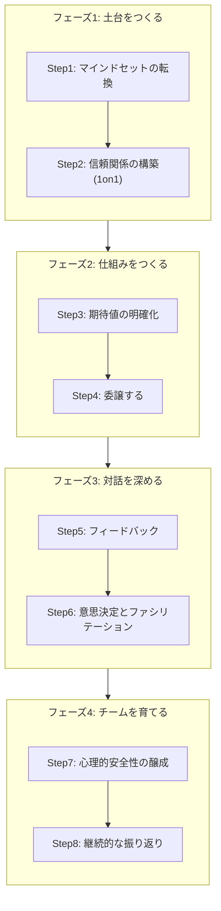
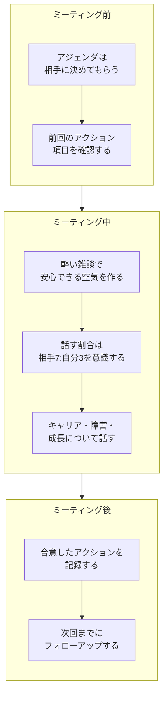
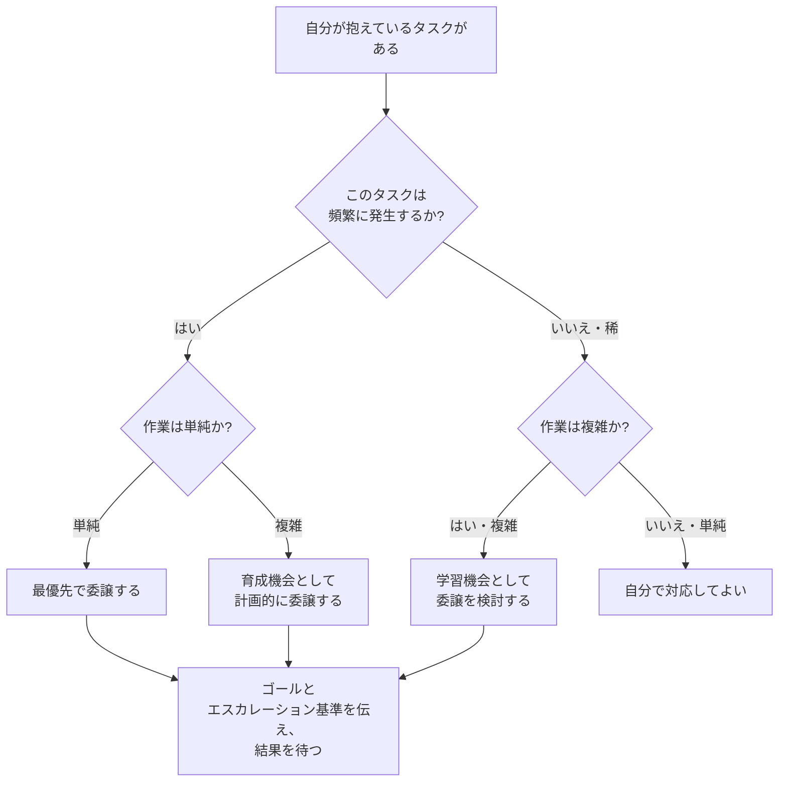
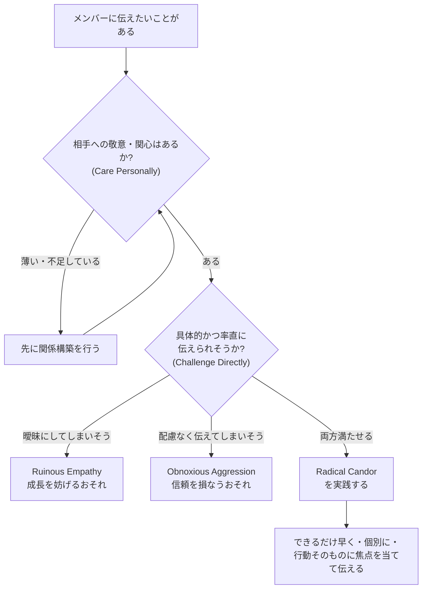
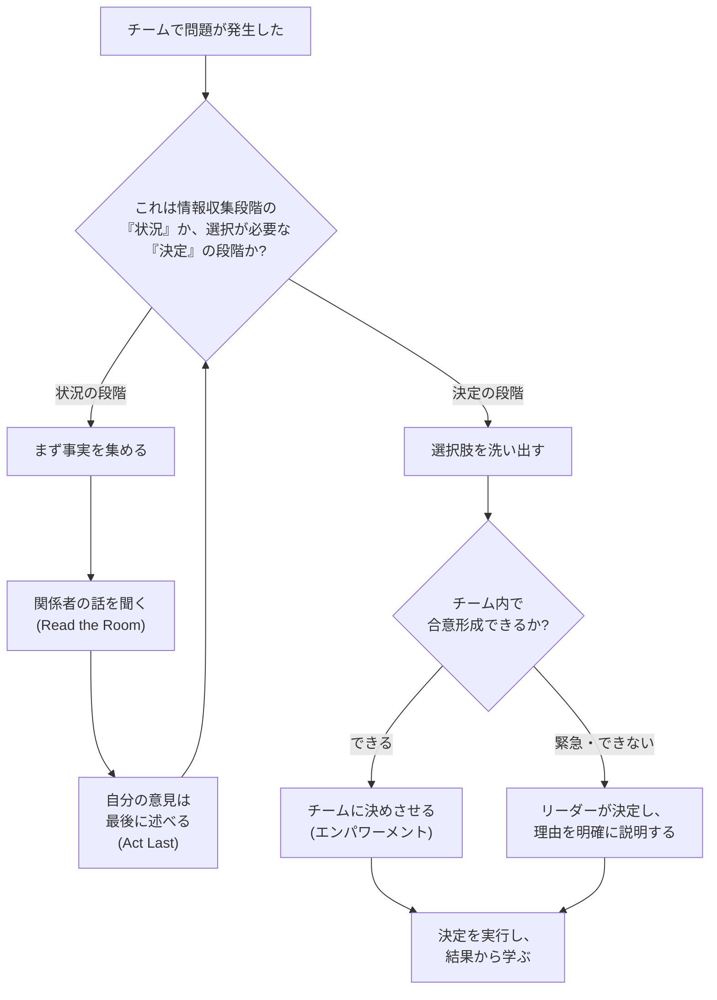

# リーダーの作法 — はじめてのソフトウェアエンジニアリーダーのための実践ガイド

> 対象読者: 初めてテックリード・エンジニアリングマネージャーになった方、またはこれからリーダーを目指す方
> 最終更新: 2026年8月15日時点の情報をもとに作成

---

## 目次

1. [はじめに](#はじめに)
2. [マネジメントとリーダーシップの違い](#マネジメントとリーダーシップの違い)
3. [良いリーダーの土台 — Googleの研究が示すもの](#良いリーダーの土台--googleの研究が示すもの)
4. [ステップバイステップ実践ガイド](#ステップバイステップ実践ガイド)
   - [Step 1: マインドセットを切り替える](#step-1-マインドセットを切り替える)
   - [Step 2: 信頼関係を築く（1on1）](#step-2-信頼関係を築く1on1)
   - [Step 3: 期待値を明確にする](#step-3-期待値を明確にする)
   - [Step 4: 委譲する](#step-4-委譲する)
   - [Step 5: フィードバックを行う](#step-5-フィードバックを行う)
   - [Step 6: 意思決定とファシリテーション](#step-6-意思決定とファシリテーション)
   - [Step 7: 心理的安全性を醸成する](#step-7-心理的安全性を醸成する)
   - [Step 8: 継続的に振り返る](#step-8-継続的に振り返る)
5. [よくある落とし穴（アンチパターン）](#よくある落とし穴アンチパターン)
6. [初学者向けチェックリスト](#初学者向けチェックリスト)
7. [まとめ](#まとめ)
8. [参考文献](#参考文献)

---

## はじめに

「リーダーシップ」と聞くと、カリスマ性や生まれ持った才能が必要な特別なものだと考えてしまいがちです。しかし、著名なエンジニアリングリーダーたちの発信を横断的に見ていくと、共通して語られているのは正反対のことです。リーダーシップは**大きな哲学**ではなく、**小さな習慣の積み重ね**であるという考え方です。

Netscape・Apple・Slackでリーダーを務めたMichael Lopp（ペンネーム: Rands）は、著書『The Art of Leadership』の中で、リーダーシップとは一貫して実践される小さな行動の集合であり、地位や才能の話ではないと述べています。本ガイドはこの考え方を軸に、初めてリーダーになったソフトウェアエンジニアが最初の数ヶ月で身につけるべき作法を、ステップバイステップで解説します。

---

## マネジメントとリーダーシップの違い

初学者がまず混同しやすいのが「マネジメント」と「リーダーシップ」です。CTOやVPエンジニアリングとして複数の組織を率いてきたWill Larson（Imprint CTO、元Carta CTO、著書『Staff Engineer』『An Elegant Puzzle』）は、エンジニアリング組織における役割を技術的な影響力によるリードと、公式な権限によるマネジメントに分けて説明しています。

| 観点 | テックリード（技術リーダーシップ） | エンジニアリングマネージャー（人のマネジメント） |
|---|---|---|
| 影響力の源泉 | 専門知識・技術的信頼 | 組織上の役割・評価権限 |
| 主な関心事 | アーキテクチャ、技術的な意思決定、実装品質 | 育成、評価、モチベーション、チームの健全性 |
| 典型的な活動 | 設計レビュー、技術方針の提示、難易度の高い課題への関与 | 1on1、目標設定、キャリア支援、採用 |
| 成功の測り方 | システムの品質・技術的な成果 | チームの成長・定着率・アウトプット |

両者は排他的ではなく、多くの現場ではテックリードとエンジニアリングマネージャーがペアで1つのチームを支えます。まずは自分がどちらの役割（あるいは両方）を担っているのかを明確にすることが、リーダーとしての第一歩です。

---

## 良いリーダーの土台 — Googleの研究が示すもの

Googleは自社のマネージャーを対象にした大規模な社内調査「Project Oxygen」を通じて、優れたマネージャーに共通する行動を特定しました。技術力の高さそのものよりも、コーチングや権限委譲、インクルーシブなチーム環境づくりといった行動特性が、チームの成果や定着率に強く影響することが示されています。なお、心理的安全性をはじめとする「何がチームを効果的にするか」の知見は、Project Oxygenではなく別調査のProject Aristotleによるものです(後述)。以下はGoogleのre:Workが公開している、Project Oxygenの10の行動特性です。

| # | 優れたマネージャーの行動 |
|---|---|
| 1 | 良いコーチである |
| 2 | チームに権限を委譲し、マイクロマネジメントをしない |
| 3 | メンバーの成功と幸福に配慮した、インクルーシブなチーム環境をつくる |
| 4 | 生産性が高く、結果を重視する |
| 5 | 良いコミュニケーターである（聞く・伝える） |
| 6 | キャリア開発を支援し、パフォーマンスについて話し合う |
| 7 | チームに対する明確なビジョン・戦略を持つ |
| 8 | チームを助けるための重要な技術スキルを持つ |
| 9 | 組織を横断して協働する |
| 10 | 強い意思決定者である |

これらは特別な才能ではなく、後天的に習得できる「行動」として整理されている点が重要です。本ガイドのステップは、この10行動と、後述する複数の著名なリーダーの実践知を統合した内容になっています。

---

## ステップバイステップ実践ガイド

### 全体像

以下、各ステップを詳しく見ていきます。

---

### Step 1: マインドセットを切り替える

初めてリーダーになったエンジニアが最初につまずくのは、「自分が最も優れたエンジニアであり続けなければならない」という思い込みです。The Manager's Pathの著者でRent the RunwayのCTOを務めたCamille Fournierは、マネージャーに昇進した直後の人ほど、旧来の「個人としてのアウトプット」に固執しがちだと指摘しています。

リーダーの成果は「自分が何を作ったか」ではなく「チームが何を生み出せる環境をつくったか」で測られるようになります。この転換ができないと、後述する委譲がうまくいかず、自分がボトルネックになってしまいます。

**実践のポイント**

- 自分の1週間のカレンダーを見直し、「自分でコードを書く時間」と「チームを支援する時間」の比率を把握する
- 昇進や異動の直後は、周囲がまだ自分を以前の役割で見ていることを自覚し、意識的に新しい役割の振る舞いを示す
- Michael Loppは、新任マネージャーが陥りがちな「誰も教えてくれない」「互いに愚痴を言い合う」「マネジメントは昇進ではなく職種転換である」という3段階の危機（The New Manager Death Spiral）を著書で説明しています。最初から「これは別の職種への転換だ」と捉えることが重要です

---

### Step 2: 信頼関係を築く（1on1）

信頼はリーダーシップの通貨です。そしてその信頼を積み上げる最も基本的な仕組みが、定期的な1on1ミーティングです。Fournierは1on1を、マネージャーがメンバーに「何に集中すべきか」を理解させ、その集中を実現できるよう支援するための最重要ツールと位置づけています。

**実践のポイント**

- 1on1は進捗報告の場ではなく、メンバーのための時間である。議題はできる限り相手に決めてもらう
- 「何かあった？」ではなく、具体的な問いを持つ。Rands（Michael Lopp）は自分の癖や情報の受け取り方を明文化した「How to Rands」というドキュメントを公開し、相手に自分の取扱説明書を渡すという手法を紹介しています。これは新しく組んだメンバーとの信頼構築を早めるのに役立ちます
- キャンセルしない。1on1を頻繁にキャンセルすることは、メンバーへの最も分かりやすい「あなたは優先度が低い」というメッセージになってしまう

---

### Step 3: 期待値を明確にする

Michael Loppは著書の中で、チーム内で起きる問題の多くを「状況（Situation）」と「決定（Decision）」に分けて捉えることを提案しています。「状況」とはまだ情報収集の段階にある曖昧な事態、「決定」とは複数の選択肢の中から選ぶべき段階にある事態です。この区別ができていないと、まだ情報が足りない段階で拙速に決断してしまったり、逆に決断すべき場面で議論を長引かせてしまったりします。

期待値を明確にするというのは、この「状況」と「決定」の区別に加えて、「誰が」「何を」「いつまでに」「どの基準で」担うのかをチームと合意しておくことです。

**実践のポイント**

- タスクを渡すときは、完了の定義（Done の基準）を最初にすり合わせる
- 「report を出すこと」に加えて、なぜその仕事が重要なのかという背景を伝える。目的を理解しているチームは自律的に判断できる
- 定例やドキュメントで、意思決定の所在（誰が最終的に決めるか）を明文化しておく

---

### Step 4: 委譲する

委譲はリーダーシップにおいて最も難しく、同時に最もレバレッジの効く行動です。AppleでディレクターだったMichael Loppは、この実践を「Delegate Until It Hurts（痛みを感じるまで委譲する）」という強い言葉で表現しています。快適に感じる範囲でしか委譲しない限り、リーダー自身が組織のスケーリングのボトルネックになってしまうという考え方です。

Camille Fournierは、委譲の判断基準として「頻度」と「複雑さ」の2軸からなるグリッドを提示しています。

| | 単純な作業 | 複雑な作業 |
|---|---|---|
| **頻繁に発生する** | 最優先で委譲する（自分が抱え続ける理由がない） | 次世代のリーダーを育てる機会として、計画的に委譲する |
| **稀にしか発生しない** | 自分でやってしまって構わない | ケースバイケースで判断。学習機会として委譲するのも有効 |

**実践のポイント**

- 委譲するときは「ゴール」と「エスカレーションの境界線」を伝え、細かい手順まで指示しない
- 重要な仕事だからという理由で自分がコントロールを握り続けない。重要な仕事こそ、育成の機会として渡す
- 委譲した後も自分の存在を消さない。相手がいつでも相談できる状態は保ちつつ、手を出しすぎない

---

### Step 5: フィードバックを行う

フィードバックは先延ばしにするほど難しくなります。GoogleとAppleで幹部を務めたKim Scottは、著書『Radical Candor』の中で、フィードバックを「相手を気にかける度合い（Care Personally）」と「率直に伝える度合い（Challenge Directly）」の2軸で整理しています。

| | 率直に伝えない | 率直に伝える |
|---|---|---|
| **相手を気にかけている** | Ruinous Empathy（誤った優しさ）— 曖昧なフィードバックで相手の成長機会を奪う | Radical Candor（理想）— 誠実で具体的なフィードバック |
| **相手を気にかけていない** | Manipulative Insincerity（不誠実な回避）— 当たり障りのない対応に終始する | Obnoxious Aggression（攻撃的な直言）— 配慮のない指摘で信頼を損なう |

**実践のポイント**

- 良いフィードバックも悪いフィードバックも、時間を空けずに伝える
- 人格ではなく行動と結果について具体的に話す
- フィードバックは一方通行にしない。自分自身へのフィードバックも積極的に求める

---

### Step 6: 意思決定とファシリテーション

リーダーには「早く自分の意見を言いたくなる衝動」が常につきまといます。Michael Loppは、会議やチームの議論において自分の意見を最後まで保留する「Act Last」という原則、場の空気や力学を読み取る「Read the Room」、そして表面的な報告だけでなく実態を自ら確かめる「Taste the Soup」という3つの姿勢を提唱しています。

**実践のポイント**

- 会議では役職による固定順ではなく、中立的な順序（挙手順・議題の担当順・ランダムなど）で参加者に意見を求め、リーダーは最後に発言して議論の結論を先取りしないようにする
- レポートやダッシュボードの数字だけを信じず、実際にコードや現場を見に行く時間を作る
- 全ての決定をリーダーが下す必要はない。チームが決められる問題は、チームに委ねる

---

### Step 7: 心理的安全性を醸成する

Googleは管理職の行動特性を調べたProject Oxygenに続き、チームの効果性を左右する要因を調べたProject Aristotleという調査も行いました。その結果、「誰がチームにいるか」よりも「チームがどのように協働しているか」の方が成果に強く影響することが分かり、その中核にあるのが心理的安全性、すなわちリスクを取って発言しても不利益を受けないとメンバーが感じられる状態でした。

**実践のポイント**

- 会議中はスマートフォンやPCを閉じ、議論に集中する姿勢を見せる
- 自分自身のミスや分からないことを率直に共有し、失敗を隠さなくてよい文化を体現する
- 反対意見や異なる視点が出たときに、感謝を示してから議論する

---

### Step 8: 継続的に振り返る

リーダーシップは一度身につけたら終わりではなく、継続的な実践と振り返りのサイクルです。Will Larsonは自身のブログで、エンジニアリング組織の運営方法を継続的に書き残し、更新し続けるプロセスそのものを重視しています。

**実践のポイント**

- 月次・四半期で「うまくいったこと」「うまくいかなかったこと」を自分自身のために書き留める
- チームの健全性は単一の指標で判断せず、リリース頻度・リリース品質・変更失敗率・復旧時間・オンコールの負荷・定性的なフィードバックを組み合わせて定点観測する（コミット頻度のような活動量の数値は個人の評価には用いない）
- 信頼できるメンター、あるいは社外のリーダーコミュニティを持ち、自分のリーダーシップを客観視する機会を作る

---

## よくある落とし穴（アンチパターン）

| アンチパターン | 何が起きるか | 対処のヒント |
|---|---|---|
| マイクロマネジメント | メンバーの自律性と当事者意識を奪う | Step4の委譲グリッドを使い、任せる範囲を明文化する |
| 委譲した仕事を結局巻き取ってしまう | チームが育たず、リーダー自身がボトルネックになる | 「痛みを感じるまで委譲する」を合言葉に、我慢する練習をする |
| フィードバックの先送り | 小さな問題が大きくなってから初めて指摘することになる | Step5のフローに沿って、できるだけ早いタイミングで伝える |
| 派閥化・内輪化したチーム運営 | チーム間の壁が生まれ、組織全体の連携が損なわれる | 部門を横断した協働を評価基準に組み込む |
| 常に忙しそうにしていることを評価する | 見せかけの労働時間が評価され、持続可能な働き方が損なわれる | 成果とアウトカムで評価し、健全な働き方を自らモデルとして示す |
| 会議で自分が最初に結論を言ってしまう | チームの発言が委縮し、多様な視点が出てこなくなる | Step6の「Act Last」を意識し、発言順を工夫する |

---

## 初学者向けチェックリスト

- [ ] 自分がテックリードなのか、エンジニアリングマネージャーなのか、あるいは両方なのかを言語化できている
- [ ] （テックリード）自分が担う技術的な役割の範囲を明文化し、チームと必要な認識合わせができている
- [ ] （エンジニアリングマネージャー）自分が管理するメンバー全員と定期的な1on1の枠が確保されている
- [ ] 直近で少なくとも1つ、意識的にメンバーへ委譲したタスクがある
- [ ] 直近1週間以内に伝えるべきフィードバックを先送りにしていない
- [ ] 会議で自分より先にメンバーに発言してもらう工夫をしている
- [ ] チームの心理的安全性について、自分なりの観察や仮説を持っている
- [ ] 月に一度、自分のリーダーシップを振り返る時間を確保している

---

## まとめ

リーダーシップは特別な才能ではなく、日々の小さな実践の積み重ねです。マインドセットを切り替え、信頼関係を築き、期待値を明確にし、委譲し、フィードバックを行い、意思決定を適切にファシリテーションし、心理的安全性を醸成し、継続的に振り返る。この8つのステップは、Michael Lopp、Camille Fournier、Will Larson、Gergely Orosz、Kim Scott、そしてGoogleの社内研究といった、国際的に広く読まれているリーダーたちの実践知に共通して見られるパターンです。

最初から完璧を目指す必要はありません。まずは1つのステップを選び、3ヶ月続けてみることから始めてみてください。

---

## 参考文献

本ガイドの作成にあたり、以下の情報源を参照しました（2026年8月15日時点で確認）。

- Michael Lopp, *The Art of Leadership*, O'Reilly Media, 2020
  <https://www.oreilly.com/library/view/the-art-of/9781492045687/>
- Michael Lopp, "How to Rands", Rands in Repose
  <https://randsinrepose.com/archives/how-to-rands/>
- Will Larson, Irrational Exuberance（個人ブログ、Imprint CTO・元Carta CTO）
  <https://lethain.com/>
- Will Larson, "Engineering manager archetypes"
  <https://lethain.com/engineering-manager-archetypes/>
- Camille Fournier, *The Manager's Path: A Guide for Tech Leaders Navigating Growth and Change*, O'Reilly Media
  <https://www.oreilly.com/library/view/the-managers-path/9781491973882/>
- Gergely Orosz, *The Software Engineer's Guidebook*
  <https://www.engguidebook.com/>
- Gergely Orosz, The Pragmatic Engineer（ニュースレター）
  <https://newsletter.pragmaticengineer.com/>
- Kim Scott, Radical Candor（公式サイト、フレームワーク解説）
  <https://www.radicalcandor.com/our-approach>
- Google re:Work, "Following the data: The research behind great managers"（Project Oxygen / Project Aristotle）
  <https://rework.withgoogle.com/intl/en/guides/following-the-data-the-research-behind-great-managers>

> 本ガイドは上記ソースの内容を要約・言い換えて構成したものであり、原文からの引用は最小限に留めています。より詳しい内容は各リンク先の一次情報をご参照ください。
